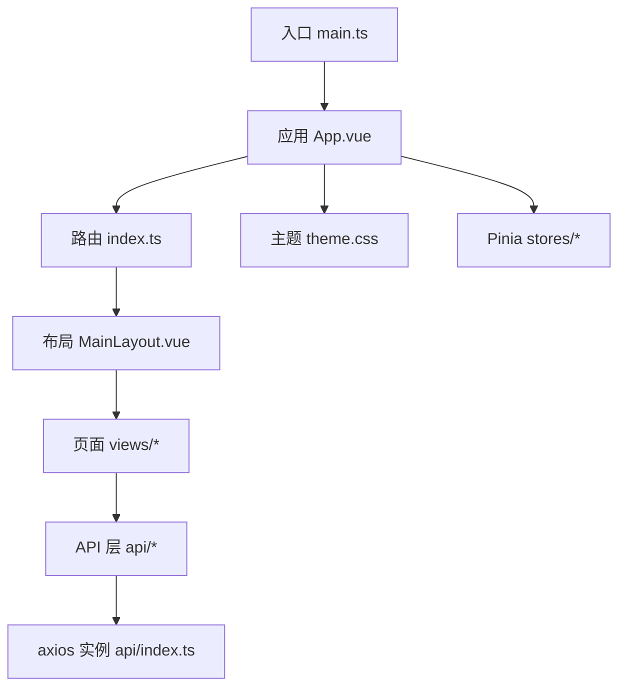
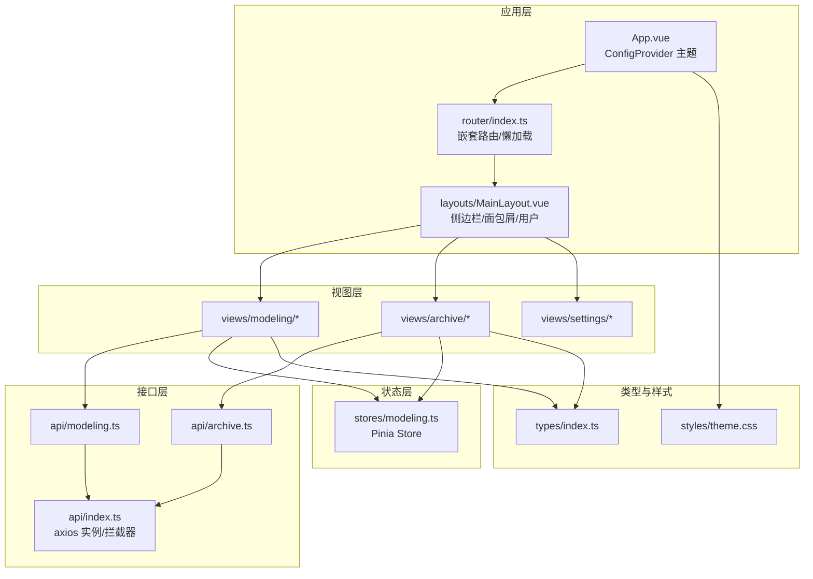
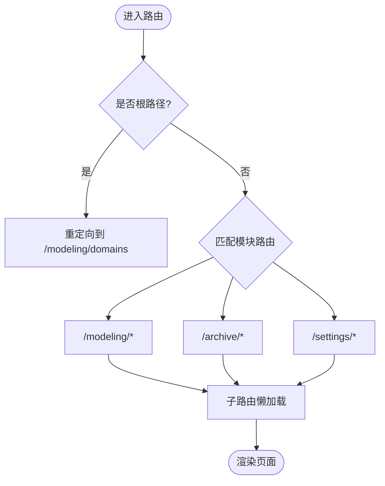
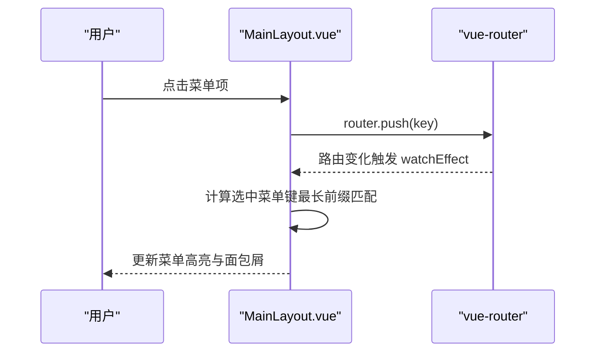
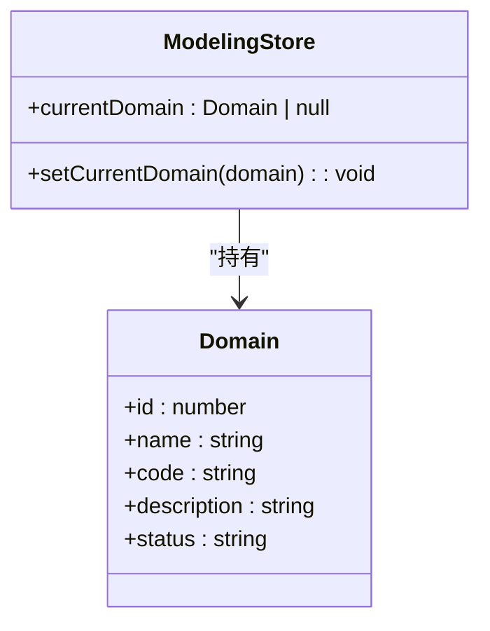
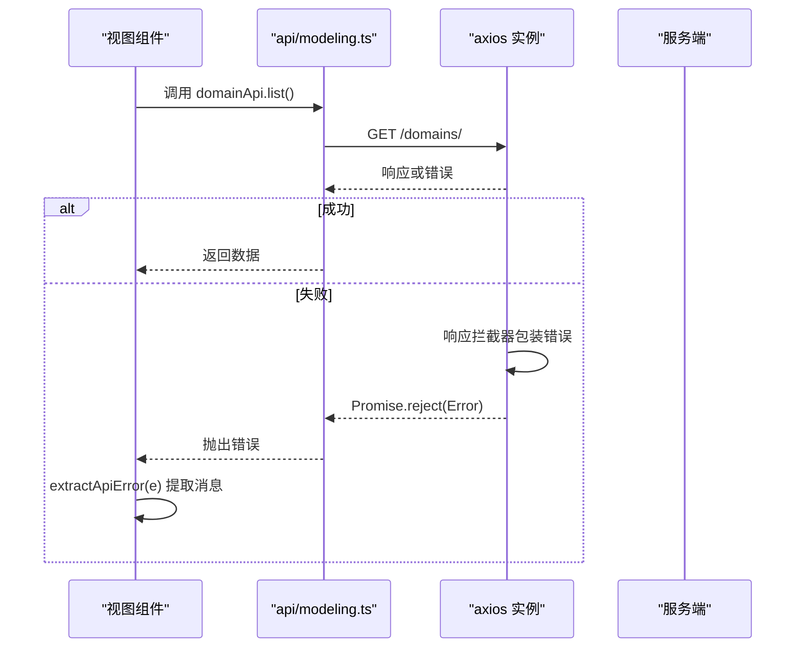
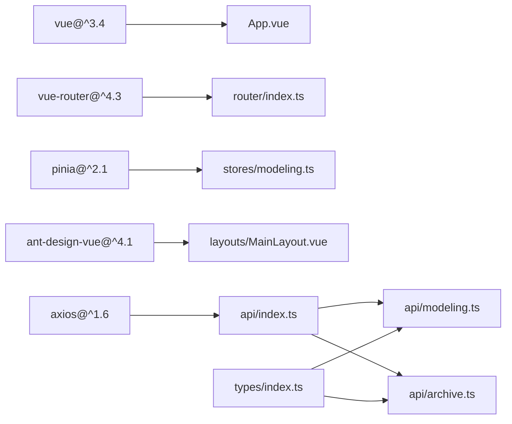

# 前端架构

<cite>
**本文引用的文件**   
- [package.json](file://frontend/package.json)
- [vite.config.ts](file://frontend/vite.config.ts)
- [main.ts](file://frontend/src/main.ts)
- [App.vue](file://frontend/src/App.vue)
- [index.ts（路由）](file://frontend/src/router/index.ts)
- [MainLayout.vue](file://frontend/src/layouts/MainLayout.vue)
- [modeling.ts（Pinia Store）](file://frontend/src/stores/modeling.ts)
- [index.ts（API 封装）](file://frontend/src/api/index.ts)
- [modeling.ts（建模 API）](file://frontend/src/api/modeling.ts)
- [archive.ts（档案 API）](file://frontend/src/api/archive.ts)
- [theme.css（主题样式）](file://frontend/src/styles/theme.css)
- [index.ts（类型定义）](file://frontend/src/types/index.ts)
- [DomainList.vue（域管理页面）](file://frontend/src/views/modeling/DomainList.vue)
- [apiError.ts（错误提取工具）](file://frontend/src/utils/apiError.ts)
- [tsconfig.json](file://frontend/tsconfig.json)
</cite>

## 目录
1. [简介](#简介)
2. [项目结构](#项目结构)
3. [核心组件](#核心组件)
4. [架构总览](#架构总览)
5. [详细组件分析](#详细组件分析)
6. [依赖关系分析](#依赖关系分析)
7. [性能考虑](#性能考虑)
8. [故障排查指南](#故障排查指南)
9. [结论](#结论)
10. [附录：开发规范与最佳实践](#附录开发规范与最佳实践)

## 简介
本文件为 MetaData002 前端的架构文档，聚焦 Vue 3 + TypeScript + Vite + Pinia + Ant Design Vue 的组件化架构、状态管理与数据流、路由与页面组织、API 封装与错误处理、样式与主题、构建优化与开发体验，以及组件开发规范。目标是帮助开发者快速理解系统设计与实现细节，并在后续迭代中保持一致性与可维护性。

## 项目结构
前端采用功能目录划分：
- src/api：按业务域划分的 API 模块（建模、档案等），统一通过 axios 实例发起请求并集中拦截错误。
- src/components：通用 UI 组件（当前为空目录，便于后续沉淀）。
- src/layouts：布局组件（如主布局 MainLayout）。
- src/router：路由配置，包含嵌套路由与元信息。
- src/stores：基于 Pinia 的状态管理（当前为 modeling store）。
- src/styles：全局样式与主题变量。
- src/types：TypeScript 类型定义，贯穿前后端契约。
- src/utils：工具函数（日期、公式、错误提取等）。
- src/views：页面级视图，按业务域分目录组织。
- 根目录：Vite 配置、包管理、TS 配置等。

图表来源
- [main.ts:1-14](file://frontend/src/main.ts#L1-L14)
- [App.vue:1-15](file://frontend/src/App.vue#L1-L15)
- [index.ts（路由）:1-45](file://frontend/src/router/index.ts#L1-L45)
- [MainLayout.vue:1-162](file://frontend/src/layouts/MainLayout.vue#L1-L162)
- [index.ts（API 封装）:1-22](file://frontend/src/api/index.ts#L1-L22)
- [theme.css:1-13](file://frontend/src/styles/theme.css#L1-L13)
- [modeling.ts（Pinia Store）:1-14](file://frontend/src/stores/modeling.ts#L1-L14)

章节来源
- [package.json:1-29](file://frontend/package.json#L1-L29)
- [vite.config.ts:1-22](file://frontend/vite.config.ts#L1-L22)
- [tsconfig.json:1-25](file://frontend/tsconfig.json#L1-L25)

## 核心组件
- 应用入口与插件挂载：在入口文件中创建 Vue 应用，注册 Pinia、Router、Ant Design Vue 及全局样式。
- 根组件与主题：根组件使用 Ant Design 的 ConfigProvider 注入主题 token，所有子组件共享主题。
- 布局组件：侧边栏菜单、面包屑、用户信息与内容区；菜单高亮与路由同步，支持折叠与动态渲染。
- 路由与页面：以 /modeling、/archive、/settings 三大模块划分，采用懒加载与 meta 标题驱动面包屑。
- 状态管理：Pinia store 用于跨组件共享轻量状态（如当前域）。
- API 封装：统一的 axios 实例、超时与响应拦截器，集中处理后端错误结构。
- 类型系统：集中定义前后端契约类型，确保强类型约束与良好 DX。

章节来源
- [main.ts:1-14](file://frontend/src/main.ts#L1-L14)
- [App.vue:1-15](file://frontend/src/App.vue#L1-L15)
- [MainLayout.vue:1-162](file://frontend/src/layouts/MainLayout.vue#L1-L162)
- [index.ts（路由）:1-45](file://frontend/src/router/index.ts#L1-L45)
- [modeling.ts（Pinia Store）:1-14](file://frontend/src/stores/modeling.ts#L1-L14)
- [index.ts（API 封装）:1-22](file://frontend/src/api/index.ts#L1-L22)
- [index.ts（类型定义）:1-388](file://frontend/src/types/index.ts#L1-L388)

## 架构总览
整体采用“单页应用 + 模块化路由 + 组件化视图 + 中心化状态 + 统一 API 层”的现代前端架构。

图表来源
- [App.vue:1-15](file://frontend/src/App.vue#L1-L15)
- [index.ts（路由）:1-45](file://frontend/src/router/index.ts#L1-L45)
- [MainLayout.vue:1-162](file://frontend/src/layouts/MainLayout.vue#L1-L162)
- [modeling.ts（Pinia Store）:1-14](file://frontend/src/stores/modeling.ts#L1-L14)
- [index.ts（API 封装）:1-22](file://frontend/src/api/index.ts#L1-L22)
- [modeling.ts（建模 API）:1-481](file://frontend/src/api/modeling.ts#L1-L481)
- [archive.ts（档案 API）:1-139](file://frontend/src/api/archive.ts#L1-L139)
- [index.ts（类型定义）:1-388](file://frontend/src/types/index.ts#L1-L388)
- [theme.css:1-13](file://frontend/src/styles/theme.css#L1-L13)

## 详细组件分析

### 路由与页面组织
- 路由策略：采用 createWebHistory，根路径重定向至建模域列表；三大模块分别以 /modeling、/archive、/settings 作为父路由，子路由按需懒加载。
- 元信息驱动：meta.title 用于面包屑与页面标题，提升导航一致性。
- 权限控制：当前未实现路由守卫，可在 router.beforeEach 中扩展鉴权逻辑（如角色/权限校验）。

图表来源
- [index.ts（路由）:1-45](file://frontend/src/router/index.ts#L1-L45)

章节来源
- [index.ts（路由）:1-45](file://frontend/src/router/index.ts#L1-L45)

### 布局组件 MainLayout
- 侧边栏：根据路由高亮当前菜单项，支持折叠；菜单项按模块分组，预留禁用项（质量规则、权限管理）。
- 面包屑：自动从 route.meta.title 生成二级面包屑。
- 用户信息：头部右侧展示头像与用户名（可扩展为真实用户态）。
- 交互：点击菜单项通过 router.push 进行程序化导航。

图表来源
- [MainLayout.vue:1-162](file://frontend/src/layouts/MainLayout.vue#L1-L162)
- [index.ts（路由）:1-45](file://frontend/src/router/index.ts#L1-L45)

章节来源
- [MainLayout.vue:1-162](file://frontend/src/layouts/MainLayout.vue#L1-L162)

### 状态管理（Pinia）
- 设计目标：跨组件共享轻量状态（如当前域），避免 props 逐层传递。
- 当前实现：modeling store 暴露 currentDomain 与 setCurrentDomain，供页面设置/读取当前域上下文。
- 扩展建议：可按模块拆分多个 store（如 archiveStore、settingStore），保持单一职责。

图表来源
- [modeling.ts（Pinia Store）:1-14](file://frontend/src/stores/modeling.ts#L1-L14)
- [index.ts（类型定义）:17-26](file://frontend/src/types/index.ts#L17-L26)

章节来源
- [modeling.ts（Pinia Store）:1-14](file://frontend/src/stores/modeling.ts#L1-L14)

### API 调用封装与错误处理
- 统一实例：axios.create 配置 baseURL、超时与默认头。
- 响应拦截：将后端结构化错误包装为 Error，保留 response 以便上层读取明细（如 sync_stats）。
- 错误提取：extractApiError 解析 DRF 常见错误结构（error/detail/message/non_field_errors/字段级错误），返回可读中文提示。
- 模块划分：按业务域拆分为 modeling.ts、archive.ts，提供清晰的命名空间与方法签名。

图表来源
- [index.ts（API 封装）:1-22](file://frontend/src/api/index.ts#L1-L22)
- [modeling.ts（建模 API）:1-481](file://frontend/src/api/modeling.ts#L1-L481)
- [archive.ts（档案 API）:1-139](file://frontend/src/api/archive.ts#L1-L139)
- [apiError.ts:1-29](file://frontend/src/utils/apiError.ts#L1-L29)

章节来源
- [index.ts（API 封装）:1-22](file://frontend/src/api/index.ts#L1-L22)
- [apiError.ts:1-29](file://frontend/src/utils/apiError.ts#L1-L29)

### 样式系统与主题定制
- 全局主题变量：CSS 自定义属性定义侧边栏宽度、头部高度、背景与边框色等。
- Ant Design 主题：通过 ConfigProvider 的 token 注入 primary color、圆角等，覆盖默认样式。
- 响应式：结合 CSS 变量与 Antd 栅格/布局组件，适配不同屏幕尺寸。

章节来源
- [theme.css:1-13](file://frontend/src/styles/theme.css#L1-L13)
- [App.vue:1-15](file://frontend/src/App.vue#L1-L15)

### 构建配置与开发体验
- Vite 插件：启用 @vitejs/plugin-vue，支持 .vue 单文件组件。
- 路径别名：@ 指向 src，简化导入路径。
- 开发服务器：端口 3000，代理 /api 到后端 localhost:8000，解决跨域问题。
- TypeScript：严格模式、ESNext 模块、bundler 解析、路径映射 @/*。

章节来源
- [vite.config.ts:1-22](file://frontend/vite.config.ts#L1-L22)
- [tsconfig.json:1-25](file://frontend/tsconfig.json#L1-L25)

## 依赖关系分析
- 运行时依赖：Vue 3、Vue Router 4、Pinia 2、Ant Design Vue 4、Axios 1.x、Day.js。
- 开发依赖：Vite 5、TypeScript 5、vue-tsc、@vitejs/plugin-vue。
- 模块耦合：视图层依赖 API 层与类型定义；布局与路由解耦；主题通过 App 根组件注入。

图表来源
- [package.json:1-29](file://frontend/package.json#L1-L29)
- [index.ts（路由）:1-45](file://frontend/src/router/index.ts#L1-L45)
- [modeling.ts（Pinia Store）:1-14](file://frontend/src/stores/modeling.ts#L1-L14)
- [index.ts（API 封装）:1-22](file://frontend/src/api/index.ts#L1-L22)
- [modeling.ts（建模 API）:1-481](file://frontend/src/api/modeling.ts#L1-L481)
- [archive.ts（档案 API）:1-139](file://frontend/src/api/archive.ts#L1-L139)
- [index.ts（类型定义）:1-388](file://frontend/src/types/index.ts#L1-L388)

章节来源
- [package.json:1-29](file://frontend/package.json#L1-L29)

## 性能考虑
- 路由懒加载：子路由使用 () => import(...) 按需加载，减少首屏体积。
- 全量分页策略：部分列表接口使用 withFullPage 一次性拉取，避免多次分页请求（适用于小数据集）。
- 表单与表格：合理使用 loading 状态与局部刷新，避免整页重载。
- 资源优化：Vite 生产构建开启 Tree-shaking 与代码分割；图片与图标按需引入。
- 网络优化：合理设置超时与重试策略（可在 axios 拦截器扩展）；对大文件下载使用 Blob 流式处理。

[本节为通用指导，不直接分析具体文件]

## 故障排查指南
- 请求失败：检查 axios 响应拦截器抛出的错误对象，使用 extractApiError 获取后端结构化错误消息。
- 路由异常：确认路由配置与 meta.title 是否正确；检查浏览器地址与菜单 key 的一致性。
- 主题不生效：确认 App.vue 中 ConfigProvider 的 themeConfig 是否正确注入；检查 CSS 变量是否被覆盖。
- 类型报错：核对 types/index.ts 中的接口是否与后端契约一致；必要时调整 withFullPage 参数。
- 开发代理：确认 vite.config.ts 的 proxy 配置与后端服务端口一致。

章节来源
- [apiError.ts:1-29](file://frontend/src/utils/apiError.ts#L1-L29)
- [index.ts（API 封装）:1-22](file://frontend/src/api/index.ts#L1-L22)
- [index.ts（路由）:1-45](file://frontend/src/router/index.ts#L1-L45)
- [App.vue:1-15](file://frontend/src/App.vue#L1-L15)
- [vite.config.ts:1-22](file://frontend/vite.config.ts#L1-L22)

## 结论
MetaData002 前端采用清晰的模块化架构与强类型约束，具备良好可维护性与扩展性。通过统一的 API 封装与错误处理、Pinia 状态管理、Ant Design 主题体系与 Vite 构建优化，提供了稳定的开发体验与运行性能。建议在后续迭代中补充路由权限控制、组件库沉淀与单元测试，进一步提升工程化水平。

[本节为总结，不直接分析具体文件]

## 附录：开发规范与最佳实践
- 组件开发规范
  - 使用 <script setup lang="ts"> 与 Composition API，保持逻辑内聚。
  - 组件职责单一，复杂页面拆分子组件；公共 UI 下沉至 components。
  - 使用 v-model 双向绑定与 computed/ref 管理状态，避免不必要的 re-render。
- 状态管理规范
  - 按模块拆分 Pinia store，避免单 store 过大；仅暴露必要 state/getters/actions。
  - 跨组件共享数据优先使用 store，避免 props drilling。
- API 调用规范
  - 统一通过 api/* 模块调用，禁止在组件内直接使用 axios。
  - 错误处理集中在拦截器与 extractApiError，组件只负责展示。
- 类型与契约
  - 所有接口返回值与入参需定义类型，保持 types/index.ts 与后端一致。
  - 使用 PaginatedResponse<T> 统一分页结构。
- 样式与主题
  - 优先使用 Ant Design 组件样式，必要时通过 CSS 变量覆盖主题。
  - 避免内联样式，尽量使用 scoped 样式或主题变量。
- 构建与调试
  - 使用 Vite 代理与路径别名提升开发效率。
  - 生产构建前执行 vue-tsc 类型检查，确保无类型错误。

章节来源
- [DomainList.vue:1-338](file://frontend/src/views/modeling/DomainList.vue#L1-L338)
- [index.ts（类型定义）:1-388](file://frontend/src/types/index.ts#L1-L388)
- [index.ts（API 封装）:1-22](file://frontend/src/api/index.ts#L1-L22)
- [apiError.ts:1-29](file://frontend/src/utils/apiError.ts#L1-L29)
- [vite.config.ts:1-22](file://frontend/vite.config.ts#L1-L22)
- [tsconfig.json:1-25](file://frontend/tsconfig.json#L1-L25)