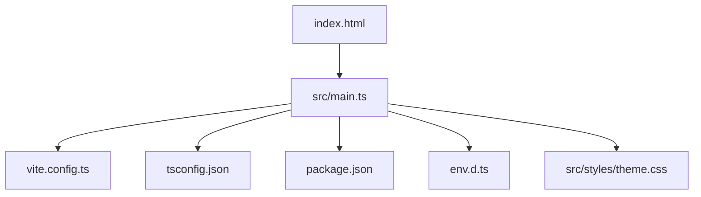
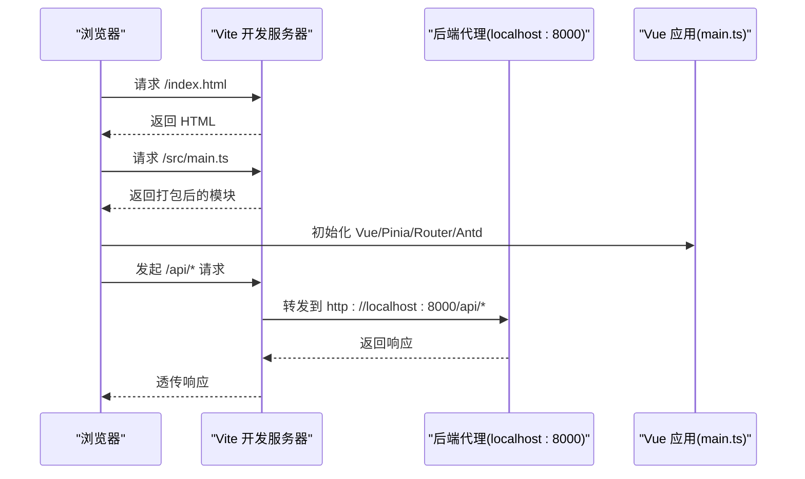
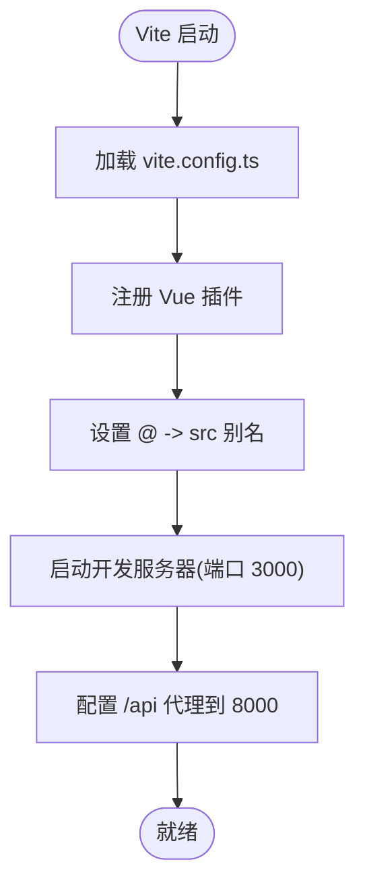
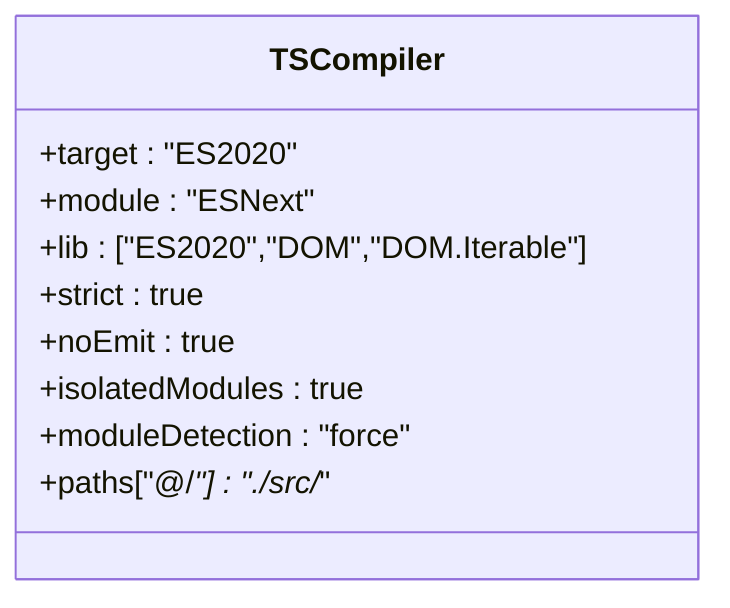
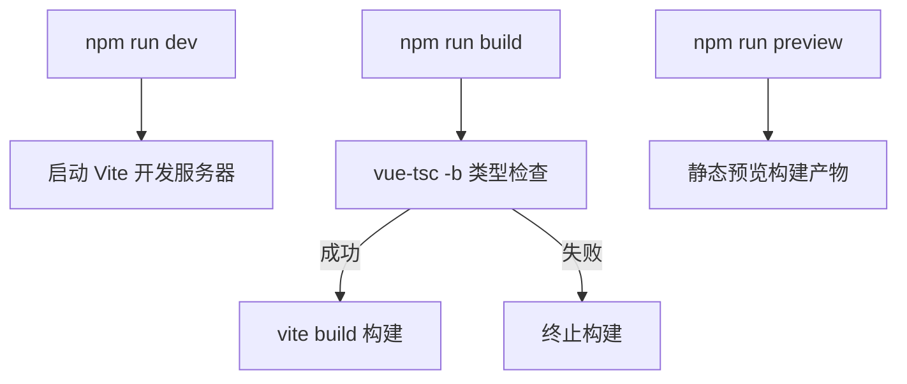
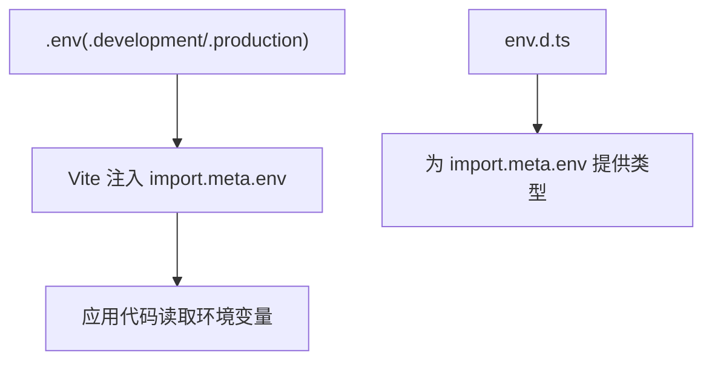
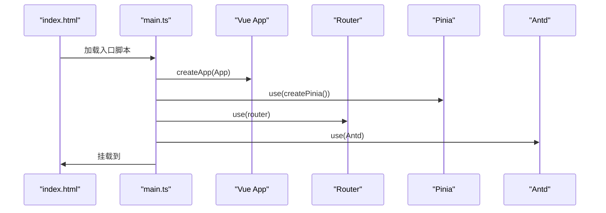
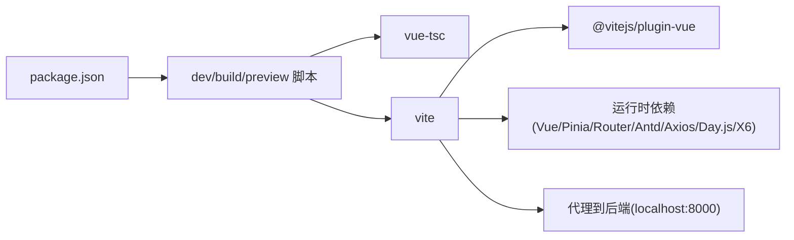
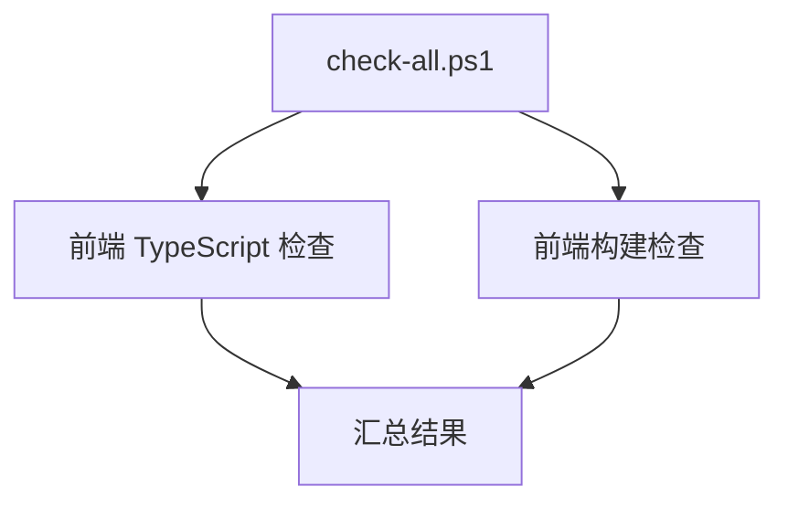

# 构建配置

<cite>
**本文引用的文件**   
- [vite.config.ts](file://frontend/vite.config.ts)
- [tsconfig.json](file://frontend/tsconfig.json)
- [package.json](file://frontend/package.json)
- [env.d.ts](file://frontend/env.d.ts)
- [index.html](file://frontend/index.html)
- [main.ts](file://frontend/src/main.ts)
- [theme.css](file://frontend/src/styles/theme.css)
- [check-all.ps1](file://scripts/check-all.ps1)
</cite>

## 目录
1. [简介](#简介)
2. [项目结构](#项目结构)
3. [核心组件](#核心组件)
4. [架构总览](#架构总览)
5. [详细组件分析](#详细组件分析)
6. [依赖关系分析](#依赖关系分析)
7. [性能与优化](#性能与优化)
8. [故障排查指南](#故障排查指南)
9. [结论](#结论)
10. [附录](#附录)

## 简介
本文件为 MetaData002 前端项目的构建配置文档，聚焦于 Vite 构建工具的配置、插件与别名设置、环境变量管理、TypeScript 编译选项、依赖管理与版本控制、开发与生产环境差异、构建优化策略（代码压缩、资源优化、缓存）、开发服务器（热重载与代理）以及构建脚本与部署流程。目标是帮助开发者快速理解并高效维护该前端的构建体系。

## 项目结构
前端工程位于 frontend 目录，核心构建相关配置文件如下：
- vite.config.ts：Vite 主配置（插件、别名、开发服务器、代理等）
- tsconfig.json：TypeScript 编译与类型检查配置
- package.json：脚本命令、依赖与版本约束
- env.d.ts：Vite 客户端类型声明与 Vue 模块类型
- index.html：应用入口 HTML
- src/main.ts：Vue 应用初始化入口
- src/styles/theme.css：全局主题变量与基础样式

**图表来源** 
- [index.html:1-14](file://frontend/index.html#L1-L14)
- [main.ts:1-14](file://frontend/src/main.ts#L1-L14)
- [vite.config.ts:1-22](file://frontend/vite.config.ts#L1-L22)
- [tsconfig.json:1-25](file://frontend/tsconfig.json#L1-L25)
- [package.json:1-29](file://frontend/package.json#L1-L29)
- [env.d.ts:1-7](file://frontend/env.d.ts#L1-L7)
- [theme.css:1-13](file://frontend/src/styles/theme.css#L1-L13)

**章节来源**
- [vite.config.ts:1-22](file://frontend/vite.config.ts#L1-L22)
- [tsconfig.json:1-25](file://frontend/tsconfig.json#L1-L25)
- [package.json:1-29](file://frontend/package.json#L1-L29)
- [env.d.ts:1-7](file://frontend/env.d.ts#L1-L7)
- [index.html:1-14](file://frontend/index.html#L1-L14)
- [main.ts:1-14](file://frontend/src/main.ts#L1-L14)
- [theme.css:1-13](file://frontend/src/styles/theme.css#L1-L13)

## 核心组件
- Vite 构建系统
  - 插件：使用 @vitejs/plugin-vue 支持 .vue 单文件组件
  - 别名：通过 resolve.alias 将 @ 映射到 src 目录，简化导入路径
  - 开发服务器：端口 3000，/api 请求代理至 http://localhost:8000，开启 changeOrigin
- TypeScript 编译
  - 目标 ES2020，模块 ESNext，解析器 bundler
  - 严格模式开启，跳过库检查，启用 isolatedModules 与 moduleDetection force
  - noEmit 表示仅做类型检查，不输出 JS
  - paths 映射 @/* 到 ./src/*，与 Vite 别名保持一致
- 包管理与脚本
  - dev/build/preview 脚本分别用于启动开发、构建与预览
  - build 先执行 vue-tsc -b 进行类型检查，再执行 vite build
  - 依赖包括 Vue 3、Ant Design Vue、X6 图编辑、Pinia、Axios、Day.js、Router 等
- 类型声明与环境
  - env.d.ts 引入 vite/client 并为 *.vue 提供类型定义
  - 当前仓库未包含 .env/.env.* 文件，环境变量可通过 Vite 运行时 API 访问（需自行创建）

**章节来源**
- [vite.config.ts:1-22](file://frontend/vite.config.ts#L1-L22)
- [tsconfig.json:1-25](file://frontend/tsconfig.json#L1-L25)
- [package.json:1-29](file://frontend/package.json#L1-L29)
- [env.d.ts:1-7](file://frontend/env.d.ts#L1-L7)

## 架构总览
下图展示了从浏览器加载入口到 Vite 构建与运行时的关键路径，以及开发服务器的代理转发机制。

**图表来源** 
- [index.html:1-14](file://frontend/index.html#L1-L14)
- [main.ts:1-14](file://frontend/src/main.ts#L1-L14)
- [vite.config.ts:12-20](file://frontend/vite.config.ts#L12-L20)

## 详细组件分析

### Vite 构建配置（vite.config.ts）
- 插件：注册 @vitejs/plugin-vue，使 Vite 能处理 .vue 文件
- 别名：@ 指向 src 根目录，统一导入风格
- 开发服务器：
  - 端口：3000
  - 代理：/api 请求转发到 http://localhost:8000，changeOrigin 保证跨域头正确
- 扩展建议：
  - 可添加 CSS 预处理器、图片优化、代码分割等插件
  - 可配置 optimizeDeps 提升冷启动速度
  - 可配置 build.rollupOptions.output.manualChunks 实现分包

**图表来源** 
- [vite.config.ts:1-22](file://frontend/vite.config.ts#L1-L22)

**章节来源**
- [vite.config.ts:1-22](file://frontend/vite.config.ts#L1-L22)

### TypeScript 配置（tsconfig.json）
- 目标与模块：target ES2020，module ESNext，lib 包含 ES2020、DOM、DOM.Iterable
- 解析与检查：moduleResolution bundler，skipLibCheck true，strict true
- 增量与隔离：isolatedModules true，moduleDetection force，noEmit true
- JSX：preserve（配合 Vue SFC）
- 路径映射：baseUrl "."，paths "@/*": ["./src/*"]
- 包含范围：src/**/*.ts, .d.ts, .tsx, .vue 与 env.d.ts

**图表来源** 
- [tsconfig.json:1-25](file://frontend/tsconfig.json#L1-L25)

**章节来源**
- [tsconfig.json:1-25](file://frontend/tsconfig.json#L1-L25)

### 依赖管理与包版本控制（package.json）
- 脚本
  - dev：启动 Vite 开发服务器
  - build：先执行 vue-tsc -b 类型检查，再执行 vite build 构建
  - preview：本地预览构建产物
- 依赖
  - 运行时：vue、pinia、vue-router、ant-design-vue、axios、dayjs、@antv/x6、@ant-design/icons-vue
  - 开发时：typescript、vite、@vitejs/plugin-vue、vue-tsc、@types/node
- 版本策略
  - 使用 ^ 允许次版本更新，锁定大版本；build 脚本强制类型检查后再构建，降低运行时风险

**图表来源** 
- [package.json:6-10](file://frontend/package.json#L6-L10)

**章节来源**
- [package.json:1-29](file://frontend/package.json#L1-L29)

### 类型声明与环境变量（env.d.ts）
- 引入 vite/client，获得 Vite 内置类型（如 import.meta.env）
- 为 *.vue 模块提供 DefineComponent 类型，便于 IDE 提示与类型检查
- 环境变量管理建议
  - 在 frontend 目录创建 .env、.env.development、.env.production
  - 以 VITE_ 前缀的环境变量可在 import.meta.env 中读取
  - 当前仓库未包含 .env 文件，需在本地或 CI 按需创建

**图表来源** 
- [env.d.ts:1-7](file://frontend/env.d.ts#L1-L7)

**章节来源**
- [env.d.ts:1-7](file://frontend/env.d.ts#L1-L7)

### 应用入口与主题（index.html、main.ts、theme.css）
- index.html：页面标题、图标与挂载点 #app，入口脚本 /src/main.ts
- main.ts：创建 Vue 应用，注册 Pinia、Router、Ant Design Vue，挂载到 #app
- theme.css：定义全局 CSS 变量（侧边栏宽度、头部高度、背景与边框色），作为主题基础

**图表来源** 
- [index.html:1-14](file://frontend/index.html#L1-L14)
- [main.ts:1-14](file://frontend/src/main.ts#L1-L14)
- [theme.css:1-13](file://frontend/src/styles/theme.css#L1-L13)

**章节来源**
- [index.html:1-14](file://frontend/index.html#L1-L14)
- [main.ts:1-14](file://frontend/src/main.ts#L1-L14)
- [theme.css:1-13](file://frontend/src/styles/theme.css#L1-L13)

## 依赖关系分析
- 构建阶段
  - vue-tsc：基于 TypeScript 的类型检查，确保构建前无类型错误
  - vite：打包与开发服务器，依赖 @vitejs/plugin-vue 处理 Vue 单文件组件
- 运行阶段
  - Vue 3、Pinia、Vue Router、Ant Design Vue、Axios、Day.js、X6 等
- 外部服务
  - 开发时通过 Vite 代理将 /api 请求转发到 Django 后端（localhost:8000）

**图表来源** 
- [package.json:6-27](file://frontend/package.json#L6-L27)
- [vite.config.ts:12-20](file://frontend/vite.config.ts#L12-L20)

**章节来源**
- [package.json:1-29](file://frontend/package.json#L1-L29)
- [vite.config.ts:1-22](file://frontend/vite.config.ts#L1-L22)

## 性能与优化
- 代码压缩与构建优化
  - 使用 Vite 默认优化（基于 Rollup），生产构建会进行 Tree Shaking、代码压缩与资源优化
  - 建议根据业务规模配置 manualChunks，拆分第三方库与路由懒加载
- 资源优化
  - 图片与字体等资源由 Vite 自动处理，可按需启用内联或外链策略
  - 静态资源放置于 public 目录，构建后直接复制到 dist
- 缓存策略
  - 利用文件名哈希与内容指纹，浏览器可长期缓存
  - 建议在服务端配置合理的 Cache-Control 与 ETag
- 开发体验
  - 热重载由 Vite 提供，修改源码即时生效
  - 通过 optimizeDeps 预构建依赖，缩短冷启动时间

[本节为通用指导，不直接分析具体文件]

## 故障排查指南
- 类型检查失败
  - 现象：npm run build 在 vue-tsc 阶段报错
  - 排查：检查 tsconfig.json 的 include 与 paths 是否覆盖所有源文件；确认 env.d.ts 是否正确引入 vite/client
- 代理无效或跨域问题
  - 现象：/api 请求无法到达后端或出现跨域错误
  - 排查：确认 vite.config.ts 中的 server.proxy.target 与 changeOrigin；检查后端服务是否在 8000 端口运行
- 构建产物异常
  - 现象：预览或部署后页面空白或样式缺失
  - 排查：检查 index.html 的入口脚本路径；确认资源路径是否为绝对路径；检查 base 配置（如需）
- 环境变量未生效
  - 现象：import.meta.env 为空或类型报错
  - 排查：确保 .env 文件存在且变量以 VITE_ 开头；重启开发服务器

**章节来源**
- [tsconfig.json:1-25](file://frontend/tsconfig.json#L1-L25)
- [env.d.ts:1-7](file://frontend/env.d.ts#L1-L7)
- [vite.config.ts:12-20](file://frontend/vite.config.ts#L12-L20)
- [index.html:1-14](file://frontend/index.html#L1-L14)

## 结论
MetaData002 前端采用 Vite + Vue 3 + TypeScript 的现代构建方案，具备清晰的插件与别名配置、严格的类型检查与稳定的依赖管理。开发服务器提供便捷的热重载与代理能力，构建流程通过 vue-tsc 前置类型检查保障质量。后续可在代码分割、依赖预构建与缓存策略方面进一步优化，以提升构建速度与运行性能。

[本节为总结性内容，不直接分析具体文件]

## 附录
- 构建脚本与全量检查
  - npm run dev：启动开发服务器
  - npm run build：类型检查 + 构建
  - npm run preview：本地预览
  - scripts/check-all.ps1：Windows 下统一执行前后端检查（含前端 TypeScript 检查与构建检查）

**图表来源** 
- [check-all.ps1:67-76](file://scripts/check-all.ps1#L67-L76)
- [package.json:6-10](file://frontend/package.json#L6-L10)

**章节来源**
- [package.json:6-10](file://frontend/package.json#L6-L10)
- [check-all.ps1:1-90](file://scripts/check-all.ps1#L1-L90)