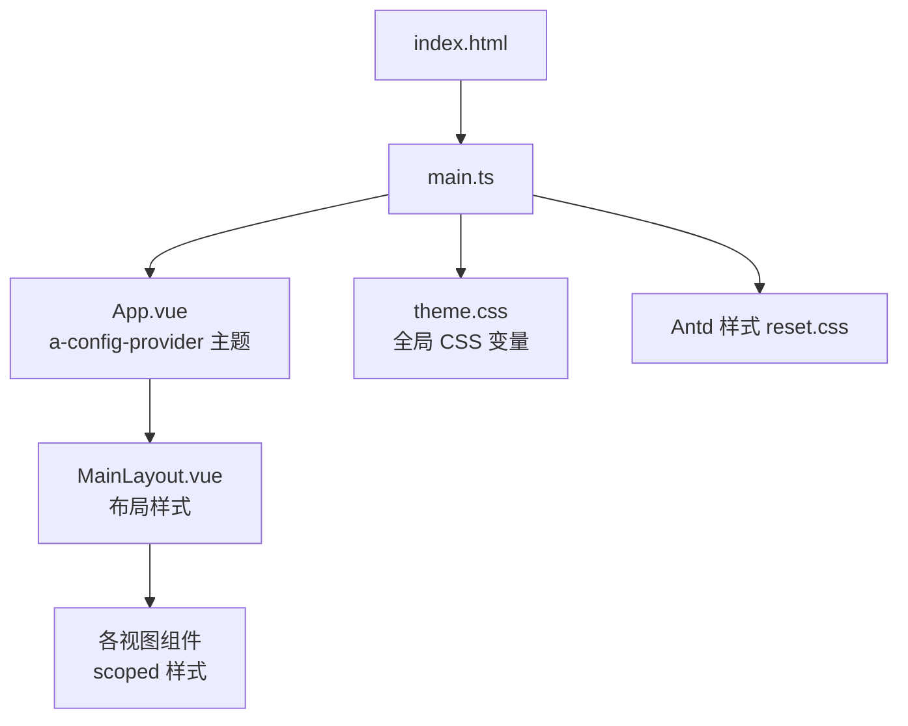
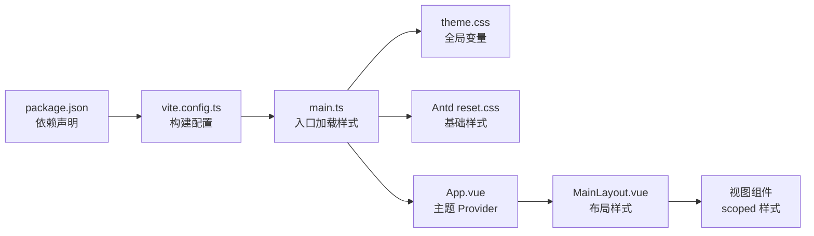

# 样式系统

<cite>
**本文引用的文件**   
- [frontend/src/styles/theme.css](file://frontend/src/styles/theme.css)
- [frontend/src/main.ts](file://frontend/src/main.ts)
- [frontend/src/App.vue](file://frontend/src/App.vue)
- [frontend/vite.config.ts](file://frontend/vite.config.ts)
- [frontend/package.json](file://frontend/package.json)
- [frontend/index.html](file://frontend/index.html)
- [frontend/src/layouts/MainLayout.vue](file://frontend/src/layouts/MainLayout.vue)
- [frontend/src/views/modeling/components/DomainStageNav.vue](file://frontend/src/views/modeling/components/DomainStageNav.vue)
- [frontend/src/views/modeling/DomainList.vue](file://frontend/src/views/modeling/DomainList.vue)
- [frontend/src/views/archive/ArchiveList.vue](file://frontend/src/views/archive/ArchiveList.vue)
- [frontend/src/views/settings/AIConfig.vue](file://frontend/src/views/settings/AIConfig.vue)
</cite>

## 目录
1. [简介](#简介)
2. [项目结构](#项目结构)
3. [核心组件](#核心组件)
4. [架构总览](#架构总览)
5. [详细组件分析](#详细组件分析)
6. [依赖分析](#依赖分析)
7. [性能考虑](#性能考虑)
8. [故障排查指南](#故障排查指南)
9. [结论](#结论)
10. [附录](#附录)

## 简介
本文件为 MetaData002 前端样式系统的权威文档，覆盖 CSS 架构设计、主题定制、CSS 变量使用与组织规范、Ant Design Vue 主题配置与覆盖策略、响应式设计与移动端适配、样式隔离方案（scoped 与 CSS Modules）、样式性能优化与打包优化，以及开发规范与最佳实践。目标是帮助开发者快速理解并统一实现一致的视觉与交互体验。

## 项目结构
前端采用 Vite + Vue 3 + Ant Design Vue 的技术栈，样式以全局主题变量与组件级 scoped 样式为主，辅以按需引入的 Ant Design 样式。入口通过 main.ts 注入全局样式与 Antd 插件，App.vue 通过 a-config-provider 提供主题上下文，布局与页面组件各自维护 scoped 样式。



图表来源
- [frontend/index.html:1-14](file://frontend/index.html#L1-L14)
- [frontend/src/main.ts:1-14](file://frontend/src/main.ts#L1-L14)
- [frontend/src/App.vue:1-15](file://frontend/src/App.vue#L1-L15)
- [frontend/src/styles/theme.css:1-13](file://frontend/src/styles/theme.css#L1-L13)
- [frontend/src/layouts/MainLayout.vue:1-162](file://frontend/src/layouts/MainLayout.vue#L1-L162)

章节来源
- [frontend/index.html:1-14](file://frontend/index.html#L1-L14)
- [frontend/src/main.ts:1-14](file://frontend/src/main.ts#L1-L14)
- [frontend/src/App.vue:1-15](file://frontend/src/App.vue#L1-L15)
- [frontend/src/styles/theme.css:1-13](file://frontend/src/styles/theme.css#L1-L13)
- [frontend/package.json:1-29](file://frontend/package.json#L1-L29)
- [frontend/vite.config.ts:1-22](file://frontend/vite.config.ts#L1-L22)

## 核心组件
- 全局主题变量：在 theme.css 中定义 CSS 变量，供全局与组件复用，如侧边栏宽度、头部高度、浅色背景与边框色等。
- 应用根组件：App.vue 通过 a-config-provider 注入 Antd 主题 token，集中控制主色、圆角等。
- 布局组件：MainLayout.vue 使用 Antd Layout 构建侧边栏与内容区，并通过 scoped 样式定义布局细节。
- 视图组件：各页面组件使用 scoped 样式，局部样式不污染全局，便于维护与迭代。

章节来源
- [frontend/src/styles/theme.css:1-13](file://frontend/src/styles/theme.css#L1-L13)
- [frontend/src/App.vue:1-15](file://frontend/src/App.vue#L1-L15)
- [frontend/src/layouts/MainLayout.vue:1-162](file://frontend/src/layouts/MainLayout.vue#L1-L162)
- [frontend/src/views/modeling/DomainList.vue:320-338](file://frontend/src/views/modeling/DomainList.vue#L320-L338)
- [frontend/src/views/archive/ArchiveList.vue:340-364](file://frontend/src/views/archive/ArchiveList.vue#L340-L364)
- [frontend/src/views/settings/AIConfig.vue:290-305](file://frontend/src/views/settings/AIConfig.vue#L290-L305)

## 架构总览
样式架构遵循“全局变量 + 组件隔离”的分层模式：
- 全局层：theme.css 提供 CSS 变量与基础重置；main.ts 引入 Antd reset 样式与主题变量。
- 应用层：App.vue 通过 a-config-provider 设置 Antd 主题 token，影响所有 Antd 组件。
- 布局层：MainLayout.vue 负责整体布局结构与样式，包含侧边栏、头部与内容区。
- 组件层：各视图组件使用 scoped 样式，避免样式冲突，提升可维护性。

```mermaid
classDiagram
class Theme {
"CSS 变量"
"--sidebar-width"
"--header-height"
"--color-bg-subtle"
"--color-border-light"
}
class AppProvider {
"a-config-provider"
"token.colorPrimary"
"token.borderRadius"
}
class Layout {
"a-layout / a-layout-sider / a-layout-header / a-layout-content"
"scoped 样式"
}
class ViewComponents {
"scoped 样式"
"页面级样式"
}
Theme <.. AppProvider : "被引用"
AppProvider --> Layout : "主题生效"
Layout --> ViewComponents : "布局容器"
```

图表来源
- [frontend/src/styles/theme.css:1-13](file://frontend/src/styles/theme.css#L1-L13)
- [frontend/src/App.vue:1-15](file://frontend/src/App.vue#L1-L15)
- [frontend/src/layouts/MainLayout.vue:1-162](file://frontend/src/layouts/MainLayout.vue#L1-L162)

章节来源
- [frontend/src/main.ts:1-14](file://frontend/src/main.ts#L1-L14)
- [frontend/src/App.vue:1-15](file://frontend/src/App.vue#L1-L15)
- [frontend/src/styles/theme.css:1-13](file://frontend/src/styles/theme.css#L1-L13)
- [frontend/src/layouts/MainLayout.vue:1-162](file://frontend/src/layouts/MainLayout.vue#L1-L162)

## 详细组件分析

### 全局主题与变量（theme.css）
- 作用：定义全局 CSS 变量，统一侧边栏宽度、头部高度、浅色背景与边框色等。
- 使用建议：在组件样式中优先使用这些变量，保证主题一致性。
- 扩展点：新增颜色或尺寸时，优先在 :root 下声明变量，避免硬编码。

章节来源
- [frontend/src/styles/theme.css:1-13](file://frontend/src/styles/theme.css#L1-L13)

### 应用主题配置（App.vue）
- 作用：通过 a-config-provider 向子树注入 Antd 主题 token，如主色与圆角。
- 覆盖策略：优先使用 token 字段进行主题定制，避免直接覆盖 Antd 内部类名。
- 扩展点：可在运行时动态切换主题对象，实现多主题能力。

章节来源
- [frontend/src/App.vue:1-15](file://frontend/src/App.vue#L1-L15)

### 布局样式（MainLayout.vue）
- 结构：使用 Antd Layout 组合侧边栏、头部与内容区，配合 scoped 样式定义间距、边框与背景。
- 样式要点：
  - 侧边栏与 Logo 区域使用固定高度与边框线，保持导航一致性。
  - 头部区域展示面包屑与用户信息，右侧对齐。
  - 内容区使用圆角卡片风格，内边距与最小高度计算确保全屏布局。
- 响应式：当前未内置断点逻辑，可通过媒体查询或 Antd 栅格进行扩展。

章节来源
- [frontend/src/layouts/MainLayout.vue:1-162](file://frontend/src/layouts/MainLayout.vue#L1-L162)

### 视图组件样式（示例）
- DomainStageNav.vue：步骤导航组件，使用 scoped 样式定义状态色、悬停态与激活态，强调流程引导。
- DomainList.vue、ArchiveList.vue、AIConfig.vue：页面头部统一样式，保持标题与间距一致。

章节来源
- [frontend/src/views/modeling/components/DomainStageNav.vue:60-169](file://frontend/src/views/modeling/components/DomainStageNav.vue#L60-L169)
- [frontend/src/views/modeling/DomainList.vue:320-338](file://frontend/src/views/modeling/DomainList.vue#L320-L338)
- [frontend/src/views/archive/ArchiveList.vue:340-364](file://frontend/src/views/archive/ArchiveList.vue#L340-L364)
- [frontend/src/views/settings/AIConfig.vue:290-305](file://frontend/src/views/settings/AIConfig.vue#L290-L305)

### 样式隔离方案
- scoped 样式：所有组件均使用 <style scoped>，避免样式泄漏与冲突。
- CSS Modules：当前仓库未启用 CSS Modules，推荐在需要强隔离或命名冲突时使用。
- 深度选择器：在需要穿透第三方组件样式时，谨慎使用 :deep()，并限制作用域。

章节来源
- [frontend/src/layouts/MainLayout.vue:116-162](file://frontend/src/layouts/MainLayout.vue#L116-L162)
- [frontend/src/views/modeling/components/DomainStageNav.vue:66-169](file://frontend/src/views/modeling/components/DomainStageNav.vue#L66-L169)
- [frontend/src/views/modeling/DomainList.vue:326-338](file://frontend/src/views/modeling/DomainList.vue#L326-L338)
- [frontend/src/views/archive/ArchiveList.vue:352-364](file://frontend/src/views/archive/ArchiveList.vue#L352-L364)
- [frontend/src/views/settings/AIConfig.vue:294-305](file://frontend/src/views/settings/AIConfig.vue#L294-L305)

### Ant Design Vue 主题配置与覆盖策略
- 主题注入：在 App.vue 中通过 a-config-provider 的 theme.token 设置主色与圆角。
- 覆盖原则：
  - 优先使用 token 字段（如 colorPrimary、borderRadius）。
  - 避免直接覆盖 Antd 内部类名，必要时使用 :deep() 限定范围。
  - 将覆盖样式集中在主题文件或组件样式中，便于追踪与维护。

章节来源
- [frontend/src/App.vue:1-15](file://frontend/src/App.vue#L1-L15)
- [frontend/src/main.ts:1-14](file://frontend/src/main.ts#L1-L14)

### 响应式设计与移动端适配
- 视口设置：index.html 中已设置 viewport，支持移动端缩放。
- 断点管理：当前未定义自定义断点，建议基于 Antd 栅格或媒体查询统一管理。
- 布局适配：MainLayout 的侧边栏与头部可采用折叠与弹性布局，结合媒体查询优化小屏体验。

章节来源
- [frontend/index.html:1-14](file://frontend/index.html#L1-L14)
- [frontend/src/layouts/MainLayout.vue:1-162](file://frontend/src/layouts/MainLayout.vue#L1-L162)

## 依赖分析
样式相关依赖与构建配置：
- 依赖包：ant-design-vue 及其样式；Vite 作为构建工具；Vue 3 与 Router/Pinia。
- 构建配置：vite.config.ts 中定义了别名与开发服务器代理，未显式配置 CSS 处理插件，默认使用 Vite 原生 CSS 能力。
- 入口加载：main.ts 引入 Antd reset 样式与全局 theme.css，确保主题变量与基础样式生效。



图表来源
- [frontend/package.json:1-29](file://frontend/package.json#L1-L29)
- [frontend/vite.config.ts:1-22](file://frontend/vite.config.ts#L1-L22)
- [frontend/src/main.ts:1-14](file://frontend/src/main.ts#L1-L14)
- [frontend/src/styles/theme.css:1-13](file://frontend/src/styles/theme.css#L1-L13)
- [frontend/src/App.vue:1-15](file://frontend/src/App.vue#L1-L15)
- [frontend/src/layouts/MainLayout.vue:1-162](file://frontend/src/layouts/MainLayout.vue#L1-L162)

章节来源
- [frontend/package.json:1-29](file://frontend/package.json#L1-L29)
- [frontend/vite.config.ts:1-22](file://frontend/vite.config.ts#L1-L22)
- [frontend/src/main.ts:1-14](file://frontend/src/main.ts#L1-L14)

## 性能考虑
- 减少重绘重排：
  - 尽量使用 transform 与 opacity 做动画，避免触发布局重排。
  - 合并样式变更，避免频繁读写 DOM 样式属性。
  - 对复杂列表使用虚拟滚动或分页，降低渲染压力。
- 样式打包优化：
  - 使用 Vite 原生 CSS 处理，按需引入 Antd 组件以减少体积。
  - 开启生产环境压缩与提取公共样式（Vite 默认行为）。
  - 避免重复导入相同样式文件，利用模块缓存。
- 主题变量与 CSS-in-JS：
  - 优先使用 CSS 变量，减少运行时样式计算开销。
  - 避免在组件内大量动态生成样式字符串。

[本节为通用指导，无需特定文件来源]

## 故障排查指南
- 主题未生效：
  - 确认 main.ts 已引入 Antd reset 样式与 theme.css。
  - 检查 App.vue 中 a-config-provider 是否正确包裹路由视图。
- 样式冲突：
  - 检查是否误用全局类名或未使用 scoped。
  - 对于第三方组件样式覆盖，使用 :deep() 限定作用域。
- 布局异常：
  - 检查 MainLayout 的高度与边距计算，确保内容区最小高度正确。
  - 移动端查看视口设置与媒体查询是否生效。

章节来源
- [frontend/src/main.ts:1-14](file://frontend/src/main.ts#L1-L14)
- [frontend/src/App.vue:1-15](file://frontend/src/App.vue#L1-L15)
- [frontend/src/layouts/MainLayout.vue:1-162](file://frontend/src/layouts/MainLayout.vue#L1-L162)
- [frontend/index.html:1-14](file://frontend/index.html#L1-L14)

## 结论
本项目样式体系以全局 CSS 变量与 Antd 主题 token 为核心，结合组件级 scoped 样式，实现了清晰的分层与良好的可维护性。建议在后续迭代中完善响应式断点管理、引入 CSS Modules 强化隔离，并持续优化样式性能与打包体积。

[本节为总结，无需特定文件来源]

## 附录
- 开发规范与最佳实践
  - 命名约定：使用 BEM 或语义化命名，避免缩写与歧义。
  - 变量优先：颜色、字号、间距等统一使用 CSS 变量。
  - 组件样式：始终使用 scoped，避免全局污染。
  - 主题定制：优先使用 Antd token，避免直接覆盖内部类名。
  - 响应式：集中管理断点，复用媒体查询规则。
  - 性能：避免过度嵌套与复杂选择器，减少重绘重排。
  - 代码审查：样式变更需关注可访问性与跨浏览器兼容性。

[本节为通用指导，无需特定文件来源]