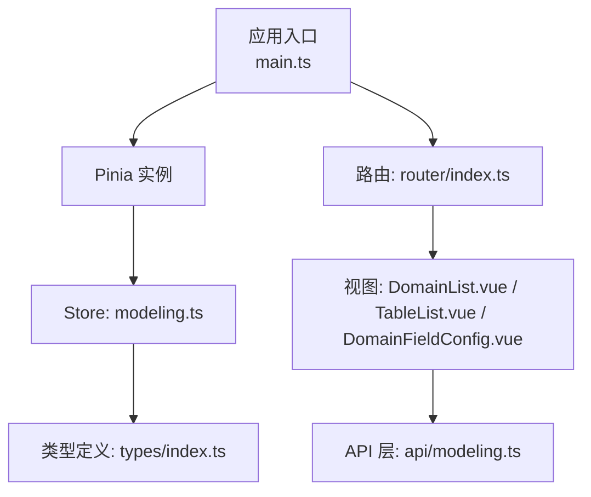
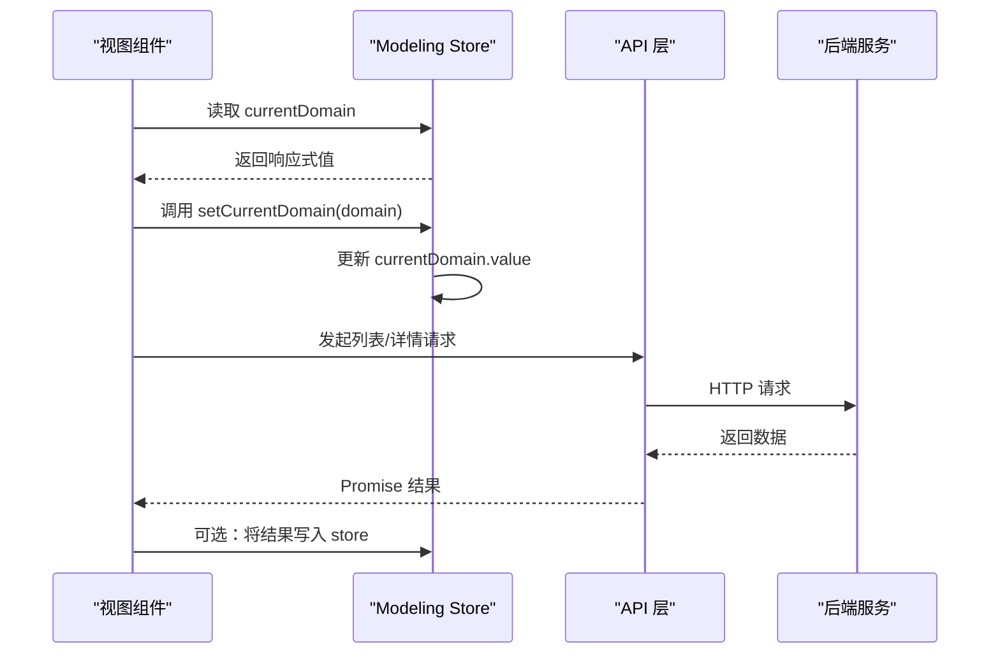
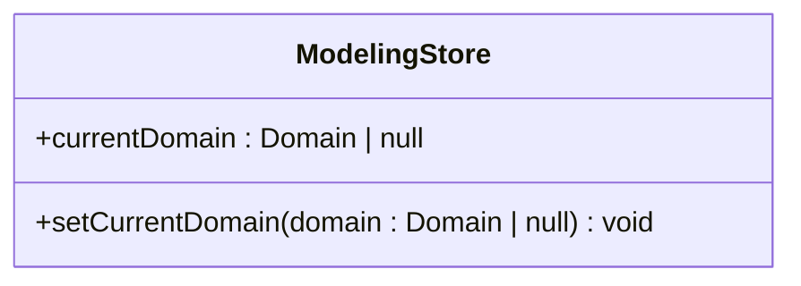
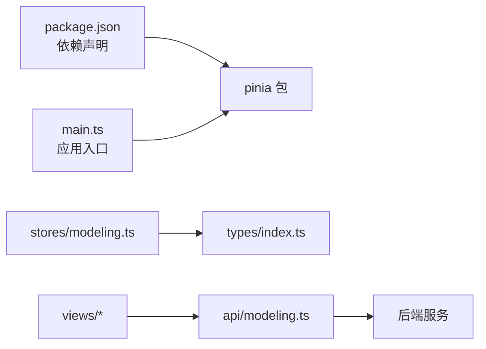

# 状态管理

<cite>
**本文引用的文件**   
- [main.ts](file://frontend/src/main.ts)
- [modeling.ts](file://frontend/src/stores/modeling.ts)
- [index.ts](file://frontend/src/types/index.ts)
- [modeling.ts](file://frontend/src/api/modeling.ts)
- [DomainList.vue](file://frontend/src/views/modeling/DomainList.vue)
- [TableList.vue](file://frontend/src/views/modeling/TableList.vue)
- [DomainFieldConfig.vue](file://frontend/src/views/modeling/DomainFieldConfig.vue)
- [package.json](file://frontend/package.json)
</cite>

## 目录
1. [简介](#简介)
2. [项目结构](#项目结构)
3. [核心组件](#核心组件)
4. [架构总览](#架构总览)
5. [详细组件分析](#详细组件分析)
6. [依赖分析](#依赖分析)
7. [性能考虑](#性能考虑)
8. [故障排查指南](#故障排查指南)
9. [结论](#结论)
10. [附录](#附录)

## 简介
本文件面向 MetaData002 前端，系统化阐述基于 Pinia 的状态管理模式与最佳实践。重点覆盖：
- Store 的创建、组织与模块化设计
- modeling store 的数据状态定义、getter 计算属性与 actions 异步操作
- 响应式数据更新机制与状态持久化策略
- 跨组件状态共享的最佳实践与一致性保障
- 状态调试工具使用、性能监控与优化技巧
- 常见模式与代码示例（以路径引用代替具体代码）

## 项目结构
前端采用 Vue 3 + TypeScript + Vite 技术栈，Pinia 作为全局状态管理库，在应用入口注册。当前建模模块已有一个 modeling store，用于跨页面共享“当前域”等轻量上下文。

**图表来源** 
- [main.ts:1-14](file://frontend/src/main.ts#L1-L14)
- [modeling.ts:1-14](file://frontend/src/stores/modeling.ts#L1-L14)
- [index.ts:1-388](file://frontend/src/types/index.ts#L1-L388)
- [modeling.ts:1-481](file://frontend/src/api/modeling.ts#L1-L481)

**章节来源**
- [main.ts:1-14](file://frontend/src/main.ts#L1-L14)
- [package.json:1-29](file://frontend/package.json#L1-L29)

## 核心组件
- Pinia 初始化：在应用启动时通过 createPinia() 注入到 Vue 应用中，使所有组件均可访问 store。
- modeling store：使用 Composition API 风格 defineStore，暴露响应式状态 currentDomain 与 setter setCurrentDomain，用于跨页面共享当前选中的领域对象。
- 类型系统：types/index.ts 中集中定义 Domain、Table、Field 等接口，保证前后端数据结构一致性与 TS 类型安全。
- API 层：api/modeling.ts 封装后端 REST 接口，提供 domain/table/field 等资源的 CRUD 与批量操作。

**章节来源**
- [main.ts:1-14](file://frontend/src/main.ts#L1-L14)
- [modeling.ts:1-14](file://frontend/src/stores/modeling.ts#L1-L14)
- [index.ts:1-388](file://frontend/src/types/index.ts#L1-L388)
- [modeling.ts:1-481](file://frontend/src/api/modeling.ts#L1-L481)

## 架构总览
下图展示了从组件到 store、再到 API 的调用链路与数据流向。store 作为单一可信源，统一维护领域级上下文；组件通过 store 获取或更新状态，避免重复请求与状态冗余。

**图表来源** 
- [modeling.ts:1-14](file://frontend/src/stores/modeling.ts#L1-L14)
- [modeling.ts:1-481](file://frontend/src/api/modeling.ts#L1-L481)

## 详细组件分析

### Modeling Store 设计与实现
- 状态定义：currentDomain 为可空 Domain 对象，表示当前激活的领域上下文。
- 方法定义：setCurrentDomain 用于设置当前域，保持单一职责与最小变更。
- 扩展建议：可补充 getter（如 isDomainActive）、actions（如 fetchDomainById），以及错误处理与缓存策略。

**图表来源** 
- [modeling.ts:1-14](file://frontend/src/stores/modeling.ts#L1-L14)

**章节来源**
- [modeling.ts:1-14](file://frontend/src/stores/modeling.ts#L1-L14)

### 类型系统与数据模型
- Domain、Table、Field 等接口定义了建模模块的核心实体，包含字段类型、枚举、时间戳等。
- PaginatedResponse<T> 统一分页响应结构，便于 API 层与组件层解耦。
- 建议在 store 中使用这些类型约束状态，确保类型安全与 IDE 提示。

**章节来源**
- [index.ts:1-388](file://frontend/src/types/index.ts#L1-L388)

### API 层与异步操作
- 封装了 domainApi、tableApi、fieldApi 等模块，提供 list/get/create/update/delete/patch 等方法。
- 支持复杂场景：Excel 预览与导入、外部表选择、批量更新属性、AI 辅助分组与语义推断等。
- 建议在 store 的 actions 中统一处理网络请求、错误捕获与乐观更新回滚。

**章节来源**
- [modeling.ts:1-481](file://frontend/src/api/modeling.ts#L1-L481)

### 视图组件与状态交互
- DomainList.vue：负责域的增删改查与配置检查，展示加载状态与错误信息。
- TableList.vue：表管理与字段管理弹窗，支持主键设置、数据预览、Excel 导入等。
- DomainFieldConfig.vue：字段分类、分组与属性配置，支持拖拽、搜索、批量操作。

这些组件目前主要使用本地 ref 管理 UI 状态，尚未广泛接入 modeling store。建议将“当前域”“用户选择”“表单草稿”等跨组件共享状态迁移至 store，减少 prop drilling 与状态冗余。

**章节来源**
- [DomainList.vue:1-338](file://frontend/src/views/modeling/DomainList.vue#L1-L338)
- [TableList.vue:1-800](file://frontend/src/views/modeling/TableList.vue#L1-L800)
- [DomainFieldConfig.vue:1-800](file://frontend/src/views/modeling/DomainFieldConfig.vue#L1-L800)

## 依赖分析
- 运行时依赖：pinia@^2.1.0 在 package.json 中声明，main.ts 中通过 app.use(createPinia()) 启用。
- 模块耦合：store 仅依赖 Vue 的 ref 与自定义类型，低耦合高内聚；API 层与后端强耦合，需关注接口稳定性。
- 潜在循环依赖：当前无循环 import；若后续引入更多 store，需注意按功能域拆分并避免相互引用。

**图表来源** 
- [package.json:1-29](file://frontend/package.json#L1-L29)
- [main.ts:1-14](file://frontend/src/main.ts#L1-L14)
- [modeling.ts:1-14](file://frontend/src/stores/modeling.ts#L1-L14)
- [index.ts:1-388](file://frontend/src/types/index.ts#L1-L388)
- [modeling.ts:1-481](file://frontend/src/api/modeling.ts#L1-L481)

**章节来源**
- [package.json:1-29](file://frontend/package.json#L1-L29)
- [main.ts:1-14](file://frontend/src/main.ts#L1-L14)

## 性能考虑
- 响应式粒度：尽量使用细粒度的 ref/computed，避免整块对象频繁替换导致不必要的重渲染。
- 懒加载与按需请求：仅在需要时触发 API 请求（如 Tab 切换、弹窗打开），避免首屏过重。
- 计算属性缓存：对过滤、排序、展示列等逻辑使用 computed，减少重复计算。
- 列表虚拟化：大数据量表格建议使用虚拟滚动（Ant Design Vue 已内置部分能力）。
- 去抖与节流：搜索输入、频繁点击等操作应加防抖/节流，降低无效请求。
- 状态持久化：对关键上下文（如当前域、用户偏好）可使用 localStorage/sessionStorage 或 pinia-plugin-persistedstate 进行持久化，注意序列化与版本兼容。

[本节为通用指导，不直接分析具体文件]

## 故障排查指南
- 常见问题
  - 状态未更新：确认是否修改了 ref.value 而非直接赋值对象；检查是否在正确的 store 实例上操作。
  - 异步失败：在 actions 中统一 try/catch，结合 extractApiError 提取错误消息并提示用户。
  - 类型不匹配：确保 store 状态与 types/index.ts 定义一致，必要时增加断言与默认值。
- 调试工具
  - Vue DevTools：查看 Pinia store 快照、状态变更历史与组件绑定关系。
  - 日志打印：在关键 actions 前后输出必要上下文，避免泄露敏感信息。
- 回滚策略
  - 乐观更新失败时及时回滚本地状态，保证 UI 与后端一致。
  - 对批量操作提供撤销/重试能力，提升用户体验。

**章节来源**
- [modeling.ts:1-481](file://frontend/src/api/modeling.ts#L1-L481)

## 结论
当前前端已具备基础的 Pinia 能力与清晰的类型与 API 分层。建议逐步将跨组件共享状态迁移至 store，完善 getter/actions，并结合持久化与调试工具提升可维护性与开发体验。通过统一的响应式更新机制与严格的类型约束，可有效避免状态冗余与不一致问题。

[本节为总结性内容，不直接分析具体文件]

## 附录

### 状态管理最佳实践清单
- 单一可信源：共享状态集中在 store，避免多处复制。
- 明确边界：按功能域拆分 store，避免单体过大。
- 类型优先：所有状态与方法均标注类型，配合 TS 编译期检查。
- 异步规范：actions 处理网络请求与错误，组件只负责触发与展示。
- 计算优先：展示逻辑使用 computed，减少模板复杂度。
- 持久化策略：对关键上下文做持久化，注意版本兼容与清理。
- 调试先行：善用 DevTools 与日志，快速定位问题。

[本节为通用指导，不直接分析具体文件]