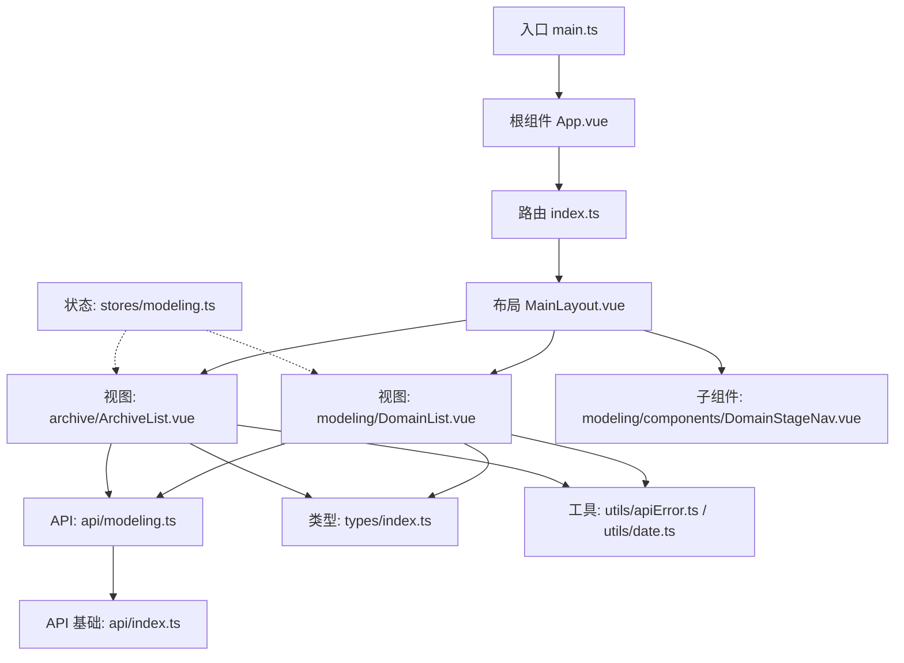
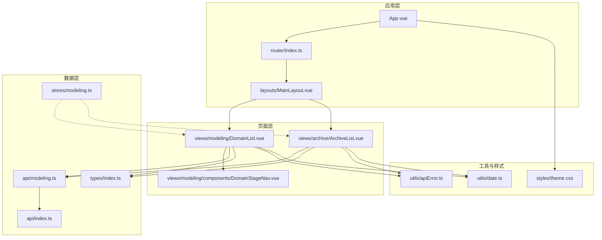
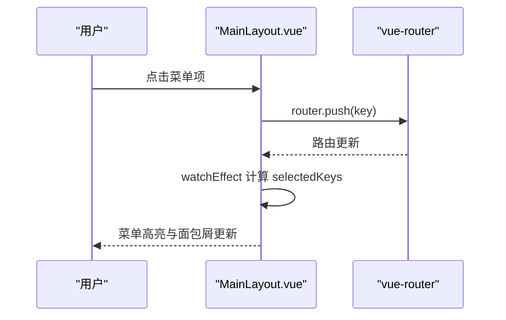
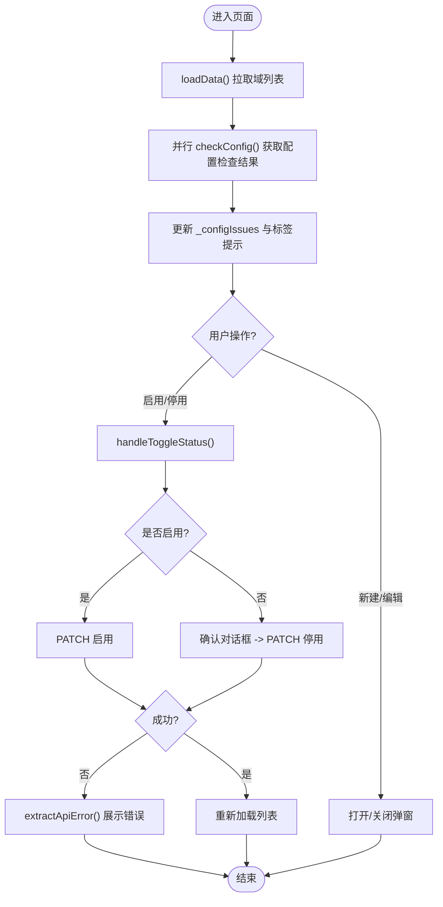
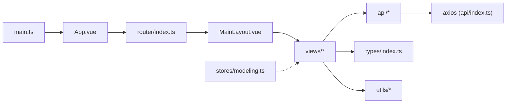

# 组件架构设计

<cite>
**本文引用的文件**   
- [main.ts](file://frontend/src/main.ts)
- [App.vue](file://frontend/src/App.vue)
- [MainLayout.vue](file://frontend/src/layouts/MainLayout.vue)
- [index.ts（路由）](file://frontend/src/router/index.ts)
- [DomainList.vue](file://frontend/src/views/modeling/DomainList.vue)
- [ArchiveList.vue](file://frontend/src/views/archive/ArchiveList.vue)
- [DomainStageNav.vue](file://frontend/src/views/modeling/components/DomainStageNav.vue)
- [modeling.ts（Pinia Store）](file://frontend/src/stores/modeling.ts)
- [index.ts（API 基础封装）](file://frontend/src/api/index.ts)
- [modeling.ts（建模 API）](file://frontend/src/api/modeling.ts)
- [index.ts（类型定义）](file://frontend/src/types/index.ts)
- [apiError.ts（错误提取工具）](file://frontend/src/utils/apiError.ts)
- [date.ts（日期工具）](file://frontend/src/utils/date.ts)
- [theme.css（主题样式）](file://frontend/src/styles/theme.css)
- [package.json](file://frontend/package.json)
- [vite.config.ts](file://frontend/vite.config.ts)
</cite>

## 目录
1. [简介](#简介)
2. [项目结构](#项目结构)
3. [核心组件](#核心组件)
4. [架构总览](#架构总览)
5. [详细组件分析](#详细组件分析)
6. [依赖关系分析](#依赖关系分析)
7. [性能考虑](#性能考虑)
8. [故障排查指南](#故障排查指南)
9. [结论](#结论)
10. [附录：开发规范与示例路径](#附录开发规范与示例路径)

## 简介
本文件为 MetaData002 前端（Vue 3 + TypeScript + Vite + Ant Design Vue）的组件架构文档。重点阐述单文件组件（SFC）的设计模式、组件层次结构、父子通信与事件处理、布局与嵌套路由、页面模块划分与命名规范、通用与业务组件的职责分离，以及生命周期管理、性能优化与调试方法。所有分析与建议均基于仓库现有代码实现进行归纳总结。

## 项目结构
前端采用按功能域划分的目录组织方式：
- layouts：全局布局容器（侧边栏、头部、内容区），承载主导航与面包屑
- views：页面级组件，按业务域（modeling、archive、settings）进一步细分
- components：可复用组件（如 DomainStageNav 等）
- api：HTTP 请求封装与各模块 API 接口
- stores：状态管理（Pinia）
- types：统一类型定义
- utils：工具函数（错误提取、日期格式化等）
- styles：全局样式与主题变量

图表来源
- [main.ts:1-14](file://frontend/src/main.ts#L1-L14)
- [App.vue:1-15](file://frontend/src/App.vue#L1-L15)
- [index.ts（路由）:1-45](file://frontend/src/router/index.ts#L1-L45)
- [MainLayout.vue:1-162](file://frontend/src/layouts/MainLayout.vue#L1-L162)
- [DomainList.vue:1-338](file://frontend/src/views/modeling/DomainList.vue#L1-L338)
- [ArchiveList.vue:1-200](file://frontend/src/views/archive/ArchiveList.vue#L1-L200)
- [DomainStageNav.vue:1-169](file://frontend/src/views/modeling/components/DomainStageNav.vue#L1-L169)
- [modeling.ts（API）:1-481](file://frontend/src/api/modeling.ts#L1-L481)
- [index.ts（API 基础）:1-22](file://frontend/src/api/index.ts#L1-L22)
- [index.ts（类型）:1-388](file://frontend/src/types/index.ts#L1-L388)
- [apiError.ts:1-29](file://frontend/src/utils/apiError.ts#L1-L29)
- [date.ts:1-27](file://frontend/src/utils/date.ts#L1-L27)

章节来源
- [main.ts:1-14](file://frontend/src/main.ts#L1-L14)
- [package.json:1-29](file://frontend/package.json#L1-L29)
- [vite.config.ts:1-21](file://frontend/vite.config.ts#L1-L21)

## 核心组件
- 应用入口与全局配置
  - main.ts：创建 Vue 应用实例，注册 Pinia、Router、Antd 主题与全局样式
  - App.vue：通过 a-config-provider 注入主题 token，并渲染 router-view
- 布局组件
  - MainLayout.vue：侧边菜单、面包屑、用户信息、内容区；菜单高亮与路由同步；点击菜单触发 router.push
- 页面组件
  - DomainList.vue：域列表 CRUD、启用/停用校验、配置检查弹窗、行内操作跳转
  - ArchiveList.vue：档案列表分页、刷新预检弹窗、新建档案表单
- 通用组件
  - DomainStageNav.vue：域内“表-关系-字段”三阶段导航，面包屑+步骤条

章节来源
- [main.ts:1-14](file://frontend/src/main.ts#L1-L14)
- [App.vue:1-15](file://frontend/src/App.vue#L1-L15)
- [MainLayout.vue:1-162](file://frontend/src/layouts/MainLayout.vue#L1-L162)
- [DomainList.vue:1-338](file://frontend/src/views/modeling/DomainList.vue#L1-L338)
- [ArchiveList.vue:1-200](file://frontend/src/views/archive/ArchiveList.vue#L1-L200)
- [DomainStageNav.vue:1-169](file://frontend/src/views/modeling/components/DomainStageNav.vue#L1-L169)

## 架构总览
整体采用“布局容器 + 嵌套路由 + 页面组件 + 共享 API/类型/工具 + Pinia 状态”的分层架构。路由将不同业务域映射到同一布局，布局内部通过 router-view 渲染具体页面。数据访问集中在 api 层，页面组件仅负责 UI 与交互编排。

图表来源
- [App.vue:1-15](file://frontend/src/App.vue#L1-L15)
- [index.ts（路由）:1-45](file://frontend/src/router/index.ts#L1-L45)
- [MainLayout.vue:1-162](file://frontend/src/layouts/MainLayout.vue#L1-L162)
- [DomainList.vue:1-338](file://frontend/src/views/modeling/DomainList.vue#L1-L338)
- [ArchiveList.vue:1-200](file://frontend/src/views/archive/ArchiveList.vue#L1-L200)
- [DomainStageNav.vue:1-169](file://frontend/src/views/modeling/components/DomainStageNav.vue#L1-L169)
- [index.ts（API 基础）:1-22](file://frontend/src/api/index.ts#L1-L22)
- [modeling.ts（建模 API）:1-481](file://frontend/src/api/modeling.ts#L1-L481)
- [index.ts（类型）:1-388](file://frontend/src/types/index.ts#L1-L388)
- [apiError.ts:1-29](file://frontend/src/utils/apiError.ts#L1-L29)
- [date.ts:1-27](file://frontend/src/utils/date.ts#L1-L27)
- [theme.css:1-13](file://frontend/src/styles/theme.css#L1-L13)

## 详细组件分析

### 布局组件 MainLayout 分析
- 职责
  - 提供侧边栏菜单、顶部面包屑、用户信息、内容区域
  - 根据当前路由自动高亮对应菜单项
  - 点击菜单项执行程序化导航
- 关键实现要点
  - 使用 watchEffect 监听 route.path，匹配最长前缀作为选中 key，保证刷新或程序化导航后高亮正确
  - 菜单项以 computed 生成，支持分组与禁用态
  - 面包屑由 route.meta.title 动态拼接
- 父子通信与事件
  - 通过 router.push(key) 驱动路由变化
  - 无显式 props/emits，属于容器型布局

图表来源
- [MainLayout.vue:1-162](file://frontend/src/layouts/MainLayout.vue#L1-L162)
- [index.ts（路由）:1-45](file://frontend/src/router/index.ts#L1-L45)

章节来源
- [MainLayout.vue:1-162](file://frontend/src/layouts/MainLayout.vue#L1-L162)

### 页面组件 DomainList 分析
- 职责
  - 展示域列表、支持新建/编辑、启用/停用、删除
  - 异步加载每个域的配置检查结果，并在表格中提示待完善项
  - 打开配置检查详情弹窗，展示 P0/P1/P2 级别结果
- 关键实现要点
  - 使用 ref 管理列表、加载态、弹窗、表单等状态
  - loadData 拉取全量数据后并行异步检查配置状态，不阻塞主列表
  - handleToggleStatus 对启用做前置检查，失败时给出明确错误提示
  - 使用 extractApiError 统一解析后端错误消息
- 父子通信与事件
  - 行内操作通过闭包调用同组件方法（goTables/goMappings/goFields）
  - 弹窗通过 v-model:open 双向绑定控制显示

图表来源
- [DomainList.vue:1-338](file://frontend/src/views/modeling/DomainList.vue#L1-L338)
- [modeling.ts（建模 API）:1-481](file://frontend/src/api/modeling.ts#L1-L481)
- [apiError.ts:1-29](file://frontend/src/utils/apiError.ts#L1-L29)

章节来源
- [DomainList.vue:1-338](file://frontend/src/views/modeling/DomainList.vue#L1-L338)

### 页面组件 ArchiveList 分析
- 职责
  - 档案列表分页展示、新建档案、从源侧刷新预览与确认更新
  - 刷新预检弹窗展示 schema 变更、数据变化样本与告警
- 关键实现要点
  - 使用分页参数 page/total 控制列表
  - previewModal 集中展示 schema_changes 与 data_changes 的结构化差异
  - 对档案维护字段被源侧刷新波及的场景进行警告提示
- 父子通信与事件
  - 按钮点击触发 openCreate/doRefreshPreview/handleCreate 等方法
  - 表格 bodyCell 插槽自定义渲染状态标签与操作列

章节来源
- [ArchiveList.vue:1-200](file://frontend/src/views/archive/ArchiveList.vue#L1-L200)

### 通用组件 DomainStageNav 分析
- 职责
  - 在域维度下提供“管理表 → 关系管理 → 字段管理”的阶段导航
  - 面包屑展示“主数据建模 > 域列表 > 域名 > 当前阶段”
- 关键实现要点
  - 通过 props.stage 与 computed.currentTitle 确定当前阶段标题
  - 点击阶段项通过 router.push 跳转到对应路径
- 父子通信与事件
  - 纯展示型组件，通过 props 接收 domainName 与 stage，无 emits

章节来源
- [DomainStageNav.vue:1-169](file://frontend/src/views/modeling/components/DomainStageNav.vue#L1-L169)

### 状态管理 modeling Store
- 职责
  - 保存当前选中的域（currentDomain）并提供设置方法
- 使用方式
  - 页面组件按需引入 useModelingStore，用于跨组件共享域上下文

章节来源
- [modeling.ts（Pinia Store）:1-14](file://frontend/src/stores/modeling.ts#L1-L14)

### API 层与错误处理
- 基础封装
  - axios.create 配置 baseURL、timeout、headers
  - 响应拦截器统一包装错误对象，保留原始 response 以便上层读取结构化错误
- 建模 API
  - 按领域划分 domainApi/tableApi/fieldApi/computedFieldApi/aiConfigApi 等
  - 统一使用 withFullPage 避免分页截断
- 错误提取工具
  - extractApiError 兼容 DRF 多种错误格式，返回可读中文文案

章节来源
- [index.ts（API 基础）:1-22](file://frontend/src/api/index.ts#L1-L22)
- [modeling.ts（建模 API）:1-481](file://frontend/src/api/modeling.ts#L1-L481)
- [apiError.ts:1-29](file://frontend/src/utils/apiError.ts#L1-L29)

### 类型系统与工具
- 类型定义
  - types/index.ts 覆盖 Domain/Table/Field/Archive/Version/ChangeLog 等核心实体
- 工具函数
  - date.ts 提供 ISO 时间格式化
  - theme.css 定义全局 CSS 变量与字体

章节来源
- [index.ts（类型）:1-388](file://frontend/src/types/index.ts#L1-L388)
- [date.ts:1-27](file://frontend/src/utils/date.ts#L1-L27)
- [theme.css:1-13](file://frontend/src/styles/theme.css#L1-L13)

## 依赖关系分析
- 组件耦合
  - 布局与路由强耦合（通过 router.push 与 route.meta 驱动 UI）
  - 页面组件与 API 层解耦（仅依赖接口契约）
  - 通用组件与路由解耦（通过 props 暴露必要上下文）
- 外部依赖
  - Vue 3 Composition API、vue-router、pinia、ant-design-vue、axios
  - Vite 构建与代理配置

图表来源
- [main.ts:1-14](file://frontend/src/main.ts#L1-L14)
- [App.vue:1-15](file://frontend/src/App.vue#L1-L15)
- [index.ts（路由）:1-45](file://frontend/src/router/index.ts#L1-L45)
- [MainLayout.vue:1-162](file://frontend/src/layouts/MainLayout.vue#L1-L162)
- [index.ts（API 基础）:1-22](file://frontend/src/api/index.ts#L1-L22)
- [modeling.ts（建模 API）:1-481](file://frontend/src/api/modeling.ts#L1-L481)
- [index.ts（类型）:1-388](file://frontend/src/types/index.ts#L1-L388)
- [modeling.ts（Pinia Store）:1-14](file://frontend/src/stores/modeling.ts#L1-L14)

章节来源
- [package.json:1-29](file://frontend/package.json#L1-L29)
- [vite.config.ts:1-21](file://frontend/vite.config.ts#L1-L21)

## 性能考虑
- 路由懒加载
  - 路由组件使用 () => import(...) 延迟加载，减少首屏体积
- 列表与异步检查
  - 列表加载完成后并行异步检查配置状态，避免阻塞主流程
- 表单与弹窗
  - 使用 v-model:open 控制弹窗，避免不必要的重渲染
- 样式与主题
  - 通过 a-config-provider 集中配置主题 token，减少重复样式
- 构建与代理
  - Vite 开发服务器开启 /api 代理，避免跨域问题与额外请求开销

[本节为通用指导，无需源码引用]

## 故障排查指南
- 网络与错误提示
  - 使用 extractApiError 统一解析后端错误，确保用户可见的错误信息清晰
  - 若出现“请求失败”，优先检查 axios 拦截器与后端返回结构
- 路由高亮异常
  - 检查 watchEffect 中的路径匹配逻辑与 allMenuKeys 是否包含目标路径
- 列表数据未更新
  - 确认 loadData 是否在 onMounted 中调用，且操作成功后有刷新逻辑
- 预览弹窗为空
  - 检查 previewData 的数据结构与条件渲染分支

章节来源
- [apiError.ts:1-29](file://frontend/src/utils/apiError.ts#L1-L29)
- [MainLayout.vue:1-162](file://frontend/src/layouts/MainLayout.vue#L1-L162)
- [DomainList.vue:1-338](file://frontend/src/views/modeling/DomainList.vue#L1-L338)
- [ArchiveList.vue:1-200](file://frontend/src/views/archive/ArchiveList.vue#L1-L200)

## 结论
MetaData002 前端采用清晰的分层架构与模块化组织，布局与路由协同提供一致的用户体验，页面组件聚焦业务交互，API 层抽象数据访问，类型与工具保障健壮性与可维护性。通过组合式 API 与 Pinia 的状态管理，组件间通信简洁可控。建议在后续迭代中继续遵循现有规范，逐步沉淀更多通用组件与页面模板，提升开发效率与一致性。

[本节为总结性内容，无需源码引用]

## 附录：开发规范与示例路径
- SFC 最佳实践
  - 使用 <script setup lang="ts"> 与 Composition API
  - 组件职责单一，布局/页面/通用组件分层清晰
  - 通过 props 传递数据，通过事件或路由驱动行为
- 父子通信与事件
  - 父传子：props（如 DomainStageNav 的 domainName、stage）
  - 子触父：emit 或路由跳转（如 MainLayout 的 onMenuClick）
- 布局与嵌套路由
  - 使用路由 meta.title 驱动面包屑
  - 路由懒加载与 children 分组
- 页面组织与命名
  - views 下按业务域分目录，文件名语义化（如 DomainList、ArchiveDetail）
- 组件复用策略
  - 通用 UI 抽取为 components（如 DomainStageNav）
  - 业务逻辑留在页面组件，避免过度抽象
- 生命周期与状态
  - 使用 onMounted 发起数据请求
  - 使用 ref/reactive 管理本地状态，Pinia 管理跨组件状态
- 性能优化
  - 列表分页与懒加载
  - 异步检查与并行请求
  - 主题与样式集中管理
- 调试方法
  - 浏览器开发者工具查看组件树与响应式数据
  - 使用 console.log 与断点定位问题
  - 利用 extractApiError 快速定位后端错误

章节来源
- [MainLayout.vue:1-162](file://frontend/src/layouts/MainLayout.vue#L1-L162)
- [DomainStageNav.vue:1-169](file://frontend/src/views/modeling/components/DomainStageNav.vue#L1-L169)
- [index.ts（路由）:1-45](file://frontend/src/router/index.ts#L1-L45)
- [modeling.ts（Pinia Store）:1-14](file://frontend/src/stores/modeling.ts#L1-L14)
- [apiError.ts:1-29](file://frontend/src/utils/apiError.ts#L1-L29)
- [date.ts:1-27](file://frontend/src/utils/date.ts#L1-L27)