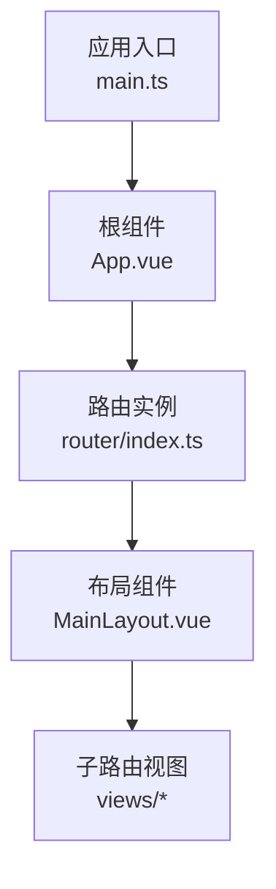
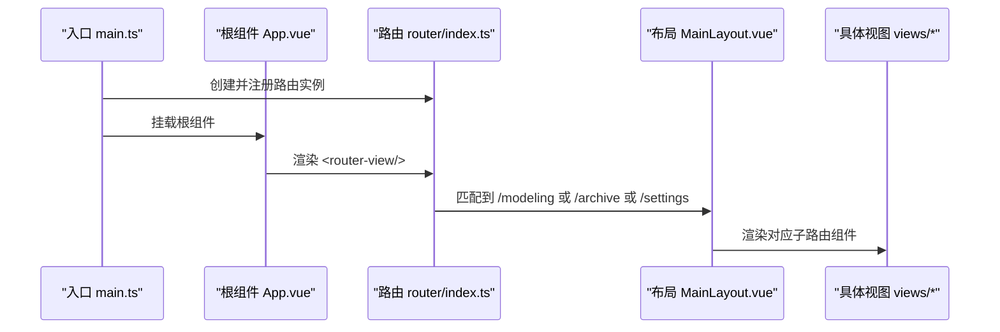
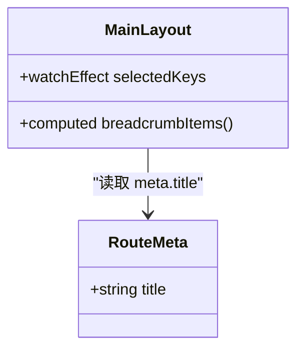
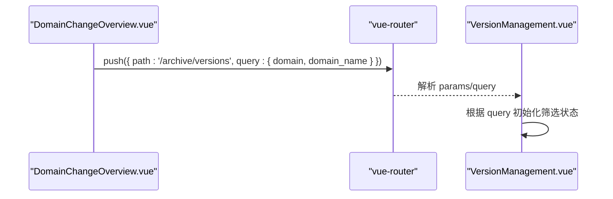
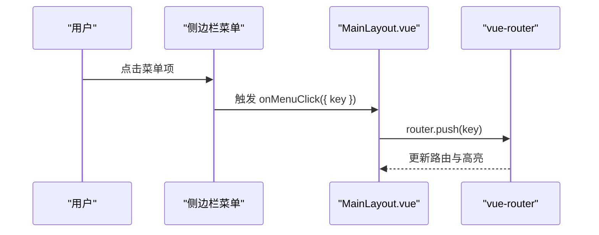
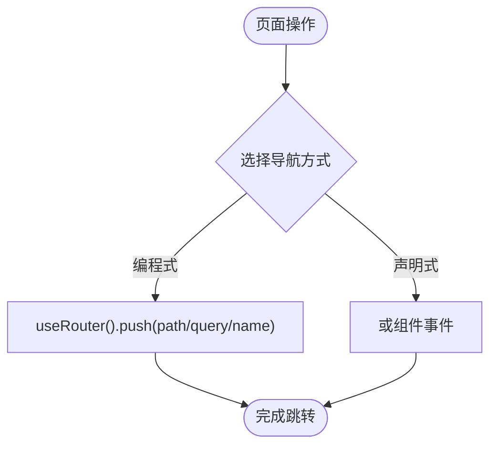
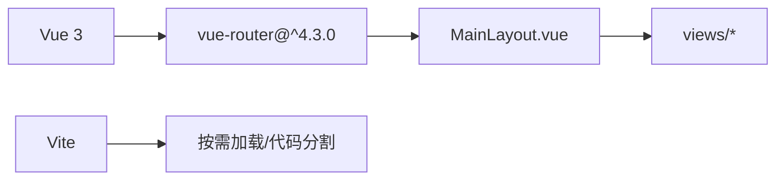

# 路由设计

<cite>
**本文引用的文件**   
- [frontend/src/router/index.ts](file://frontend/src/router/index.ts)
- [frontend/src/main.ts](file://frontend/src/main.ts)
- [frontend/src/App.vue](file://frontend/src/App.vue)
- [frontend/src/layouts/MainLayout.vue](file://frontend/src/layouts/MainLayout.vue)
- [frontend/src/views/modeling/DomainList.vue](file://frontend/src/views/modeling/DomainList.vue)
- [frontend/src/views/archive/ArchiveDetail.vue](file://frontend/src/views/archive/ArchiveDetail.vue)
- [frontend/src/views/archive/ArchiveList.vue](file://frontend/src/views/archive/ArchiveList.vue)
- [frontend/src/views/archive/DomainChangeOverview.vue](file://frontend/src/views/archive/DomainChangeOverview.vue)
- [frontend/package.json](file://frontend/package.json)
</cite>

## 目录
1. [引言](#引言)
2. [项目结构](#项目结构)
3. [核心组件](#核心组件)
4. [架构总览](#架构总览)
5. [详细组件分析](#详细组件分析)
6. [依赖分析](#依赖分析)
7. [性能考虑](#性能考虑)
8. [故障排查指南](#故障排查指南)
9. [结论](#结论)
10. [附录](#附录)

## 引言
本文件为 MetaData002 前端的路由设计文档，围绕 Vue Router 的配置与嵌套路由、路由元信息、动态参数与查询参数处理、路由守卫与权限控制、懒加载与代码分割、布局集成与侧边栏导航生成、编程式与声明式导航等主题进行系统化说明。目标是帮助开发者快速理解现有实现并在此基础上扩展安全、可维护且高性能的导航体系。

## 项目结构
当前前端采用 Vue 3 + Vue Router 4 + Vite 的技术栈，路由定义集中于 router/index.ts，布局组件 MainLayout 负责侧边栏、面包屑与内容区渲染，各业务视图通过命名路由或路径跳转访问。应用入口 main.ts 中注册路由实例，App.vue 提供全局配置与根级 <router-view/>。

**图表来源** 
- [frontend/src/main.ts:1-14](file://frontend/src/main.ts#L1-L14)
- [frontend/src/App.vue:1-15](file://frontend/src/App.vue#L1-L15)
- [frontend/src/router/index.ts:1-45](file://frontend/src/router/index.ts#L1-L45)
- [frontend/src/layouts/MainLayout.vue:1-162](file://frontend/src/layouts/MainLayout.vue#L1-L162)

**章节来源**
- [frontend/src/main.ts:1-14](file://frontend/src/main.ts#L1-L14)
- [frontend/src/App.vue:1-15](file://frontend/src/App.vue#L1-L15)
- [frontend/src/router/index.ts:1-45](file://frontend/src/router/index.ts#L1-L45)

## 核心组件
- 路由实例：使用 createWebHistory('/'), 根路径重定向至 /modeling/domains；按功能域划分模块路由（/modeling、/archive、/settings），统一挂载 MainLayout 作为布局容器。
- 布局组件：MainLayout 内嵌侧边栏菜单、面包屑与 <router-view/> 内容区，菜单高亮与路由同步，点击菜单触发程序化导航。
- 视图组件：各业务页面通过命名路由或路径拼接进行跳转，部分页面使用 onBeforeRouteLeave 等守卫钩子。

**章节来源**
- [frontend/src/router/index.ts:1-45](file://frontend/src/router/index.ts#L1-L45)
- [frontend/src/layouts/MainLayout.vue:1-162](file://frontend/src/layouts/MainLayout.vue#L1-L162)
- [frontend/src/views/modeling/DomainList.vue:1-200](file://frontend/src/views/modeling/DomainList.vue#L1-L200)
- [frontend/src/views/archive/ArchiveDetail.vue:380-579](file://frontend/src/views/archive/ArchiveDetail.vue#L380-L579)
- [frontend/src/views/archive/ArchiveList.vue:310-364](file://frontend/src/views/archive/ArchiveList.vue#L310-L364)
- [frontend/src/views/archive/DomainChangeOverview.vue:60-78](file://frontend/src/views/archive/DomainChangeOverview.vue#L60-L78)

## 架构总览
下图展示从应用启动到路由渲染的整体流程，以及布局与子视图的关系。

**图表来源** 
- [frontend/src/main.ts:1-14](file://frontend/src/main.ts#L1-L14)
- [frontend/src/App.vue:1-15](file://frontend/src/App.vue#L1-L15)
- [frontend/src/router/index.ts:1-45](file://frontend/src/router/index.ts#L1-L45)
- [frontend/src/layouts/MainLayout.vue:1-162](file://frontend/src/layouts/MainLayout.vue#L1-L162)

## 详细组件分析

### 路由配置与嵌套路由
- 根路径重定向：/ → /modeling/domains
- 模块路由：
  - /modeling：域管理、表管理、字段管理、关系管理
  - /archive：档案管理、API管理、变更日志、版本明细、一致性检查、档案详情
  - /settings：数据源配置、AI配置、技术函数
- 每个子路由均包含 meta.title，用于面包屑与页面标题显示。

```mermaid
flowchart TD
Root["根路由 /"] --> Redirect["重定向到 /modeling/domains"]
Model["模块 /modeling"] --> Domains["域管理 domains"]
Model --> Tables["表管理 domains/:id/tables"]
Model --> Fields["字段管理 domains/:id/fields"]
Model --> Mappings["关系管理 domains/:id/mappings"]
Archive["模块 /archive"] --> List["档案管理 archive"]
Archive --> Api["API管理 archive/api-management"]
Archive --> Changes["变更日志 archive/domain-changes"]
Archive --> Versions["版本明细 archive/versions"]
Archive --> Consistency["一致性检查 archive/:id/consistency"]
Archive --> Detail["档案详情 archive/:id"]
Settings["模块 /settings"] --> DataSources["数据源配置 settings/data-sources"]
Settings --> AI["AI配置 settings/ai"]
Settings --> Tech["技术函数 settings/tech-functions"]
```

**图表来源** 
- [frontend/src/router/index.ts:1-45](file://frontend/src/router/index.ts#L1-L45)

**章节来源**
- [frontend/src/router/index.ts:1-45](file://frontend/src/router/index.ts#L1-L45)

### 路由元信息与面包屑
- 所有子路由通过 meta.title 提供页面标题。
- MainLayout 根据 route.meta.title 动态构建面包屑项，提升导航可读性。

**图表来源** 
- [frontend/src/router/index.ts:14-39](file://frontend/src/router/index.ts#L14-L39)
- [frontend/src/layouts/MainLayout.vue:106-109](file://frontend/src/layouts/MainLayout.vue#L106-L109)

**章节来源**
- [frontend/src/layouts/MainLayout.vue:106-109](file://frontend/src/layouts/MainLayout.vue#L106-L109)

### 动态参数与查询参数
- 动态参数：domains/:id、archive/:id、archive/:id/consistency，在视图中通过 useRoute().params.id 获取。
- 查询参数：如 DomainChangeOverview 跳转到 versions 时携带 domain 与 domain_name，便于详情页筛选与标识。

**图表来源** 
- [frontend/src/views/archive/DomainChangeOverview.vue:60-78](file://frontend/src/views/archive/DomainChangeOverview.vue#L60-L78)
- [frontend/src/views/archive/ArchiveDetail.vue:380-400](file://frontend/src/views/archive/ArchiveDetail.vue#L380-L400)

**章节来源**
- [frontend/src/views/archive/DomainChangeOverview.vue:60-78](file://frontend/src/views/archive/DomainChangeOverview.vue#L60-L78)
- [frontend/src/views/archive/ArchiveDetail.vue:380-400](file://frontend/src/views/archive/ArchiveDetail.vue#L380-L400)

### 路由守卫与权限控制
- 当前路由层未实现全局前置守卫（beforeEach）或路由级守卫（meta.requiresAuth/roles）。
- 建议在 router/index.ts 中引入全局守卫，结合 Pinia 的用户状态进行认证与角色校验，并在无权限时重定向至登录或无权限页。
- 可在路由 meta 中扩展 requiresAuth、roles 等字段，配合守卫实现细粒度控制。

[本节为概念性建议，不直接分析具体文件]

### 路由懒加载与代码分割
- 所有子路由组件均采用 () => import('@/...') 的异步导入方式，实现按需加载与代码分割，减少首屏体积。
- 该策略与 Vite 打包机制协同，显著提升应用启动性能。

**章节来源**
- [frontend/src/router/index.ts:12-39](file://frontend/src/router/index.ts#L12-L39)

### 与布局组件集成与侧边栏导航
- MainLayout 作为所有模块路由的父组件，内部包含侧边栏菜单、面包屑与 <router-view/>。
- 菜单项与路由路径一一映射，selectedKeys 通过 watchEffect 监听 route.path 自动高亮，支持刷新与程序化导航后保持正确状态。
- 点击菜单项调用 router.push(key) 完成导航。

**图表来源** 
- [frontend/src/layouts/MainLayout.vue:41-61](file://frontend/src/layouts/MainLayout.vue#L41-L61)
- [frontend/src/layouts/MainLayout.vue:111-113](file://frontend/src/layouts/MainLayout.vue#L111-L113)

**章节来源**
- [frontend/src/layouts/MainLayout.vue:41-61](file://frontend/src/layouts/MainLayout.vue#L41-L61)
- [frontend/src/layouts/MainLayout.vue:111-113](file://frontend/src/layouts/MainLayout.vue#L111-L113)

### 编程式导航与声明式导航
- 编程式导航：在各视图中通过 useRouter().push() 进行跳转，例如 ArchiveList 跳转到档案详情与一致性检查，DomainChangeOverview 带查询参数跳转。
- 声明式导航：模板中使用 <router-link to="..."> 或在 Ant Design 等组件的事件回调中调用 router.push。

**图表来源** 
- [frontend/src/views/archive/ArchiveList.vue:310-323](file://frontend/src/views/archive/ArchiveList.vue#L310-L323)
- [frontend/src/views/archive/DomainChangeOverview.vue:60-78](file://frontend/src/views/archive/DomainChangeOverview.vue#L60-L78)

**章节来源**
- [frontend/src/views/archive/ArchiveList.vue:310-323](file://frontend/src/views/archive/ArchiveList.vue#L310-L323)
- [frontend/src/views/archive/DomainChangeOverview.vue:60-78](file://frontend/src/views/archive/DomainChangeOverview.vue#L60-L78)

### 路由与视图交互示例
- ArchiveDetail 使用 useRoute().params.id 获取档案ID，并结合 onBeforeRouteLeave 等钩子处理离开前的保存提示或数据清理。
- DomainList 通过命名路由或路径拼接进入表管理、字段管理与关系管理页面。

**章节来源**
- [frontend/src/views/archive/ArchiveDetail.vue:380-400](file://frontend/src/views/archive/ArchiveDetail.vue#L380-L400)
- [frontend/src/views/modeling/DomainList.vue:1-200](file://frontend/src/views/modeling/DomainList.vue#L1-L200)

## 依赖分析
- 运行时依赖：vue-router@^4.3.0，确保与 Vue 3 兼容。
- 构建工具：Vite 与 vue-tsc，支持 TypeScript 与按需导入优化。
- UI 库：ant-design-vue，用于布局与菜单组件。

**图表来源** 
- [frontend/package.json:1-29](file://frontend/package.json#L1-L29)
- [frontend/src/router/index.ts:1-45](file://frontend/src/router/index.ts#L1-L45)

**章节来源**
- [frontend/package.json:1-29](file://frontend/package.json#L1-L29)
- [frontend/src/router/index.ts:1-45](file://frontend/src/router/index.ts#L1-L45)

## 性能考虑
- 路由懒加载：所有子路由组件使用动态 import，避免首屏加载过多资源。
- 路由层级扁平化：将同域路由集中管理，减少深层嵌套带来的渲染开销。
- 菜单高亮计算：使用 watchEffect 与最长前缀匹配，避免频繁全量计算。
- 建议：对大型页面进一步拆分路由，结合 Suspense 与错误边界提升用户体验。

[本节为通用指导，不直接分析具体文件]

## 故障排查指南
- 面包屑不显示：检查子路由是否设置 meta.title，并确保 MainLayout 正确读取 route.meta.title。
- 菜单高亮异常：确认 allMenuKeys 列表与实际路由一致，检查 watchEffect 中的前缀匹配逻辑。
- 动态参数为空：确认路由 path 中是否包含 :id，并在视图中通过 useRoute().params.id 获取。
- 查询参数丢失：检查 router.push 的 query 对象是否正确传递，目标页面是否读取 route.query。
- 权限问题：当前未实现全局守卫，需在 router/index.ts 中添加 beforeEach，结合用户状态与角色进行拦截。

**章节来源**
- [frontend/src/layouts/MainLayout.vue:47-61](file://frontend/src/layouts/MainLayout.vue#L47-L61)
- [frontend/src/router/index.ts:14-39](file://frontend/src/router/index.ts#L14-L39)
- [frontend/src/views/archive/ArchiveDetail.vue:380-400](file://frontend/src/views/archive/ArchiveDetail.vue#L380-L400)
- [frontend/src/views/archive/DomainChangeOverview.vue:60-78](file://frontend/src/views/archive/DomainChangeOverview.vue#L60-L78)

## 结论
当前路由体系以模块化嵌套为主，结合懒加载与布局组件实现了清晰的导航结构与良好的性能表现。后续建议补充全局路由守卫与权限控制，完善 meta 字段规范，进一步提升安全性与可维护性。同时，持续优化菜单高亮与面包屑生成逻辑，确保在不同导航场景下的稳定性。

[本节为总结性内容，不直接分析具体文件]

## 附录
- 最佳实践清单：
  - 所有子路由必须设置 meta.title，便于面包屑与标题统一管理。
  - 使用命名路由与命名参数，提高跳转的可读性与可维护性。
  - 对复杂页面实施路由级懒加载，必要时结合 Suspense。
  - 在全局守卫中统一处理认证与权限校验，避免分散逻辑。
  - 菜单与路由强绑定，确保路径变更时高亮与面包屑一致。
- 常见问题解决方案：
  - 刷新后菜单高亮丢失：确保 selectedKeys 基于 route.path 重新计算。
  - 动态参数未生效：检查路由 path 定义与 useRoute().params 的使用。
  - 查询参数未传递：确认 router.push 的 query 对象结构正确。

[本节为通用指导，不直接分析具体文件]