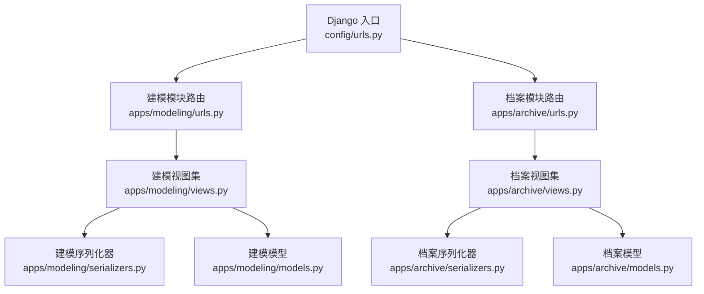
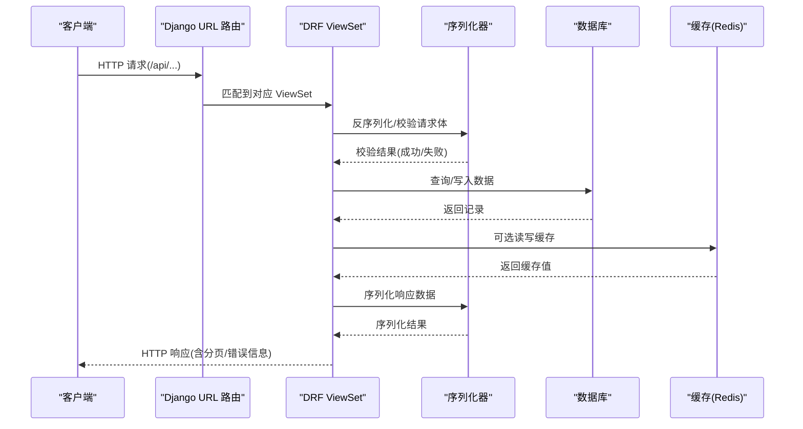
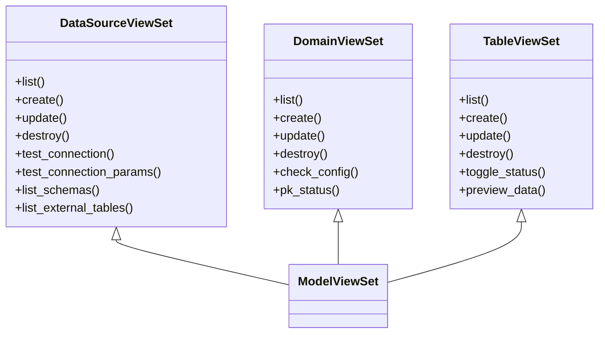
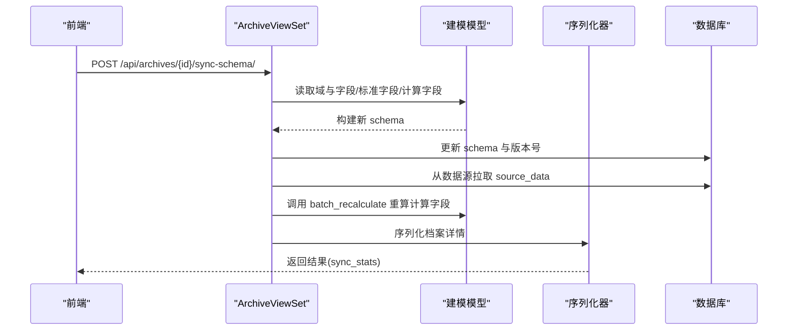
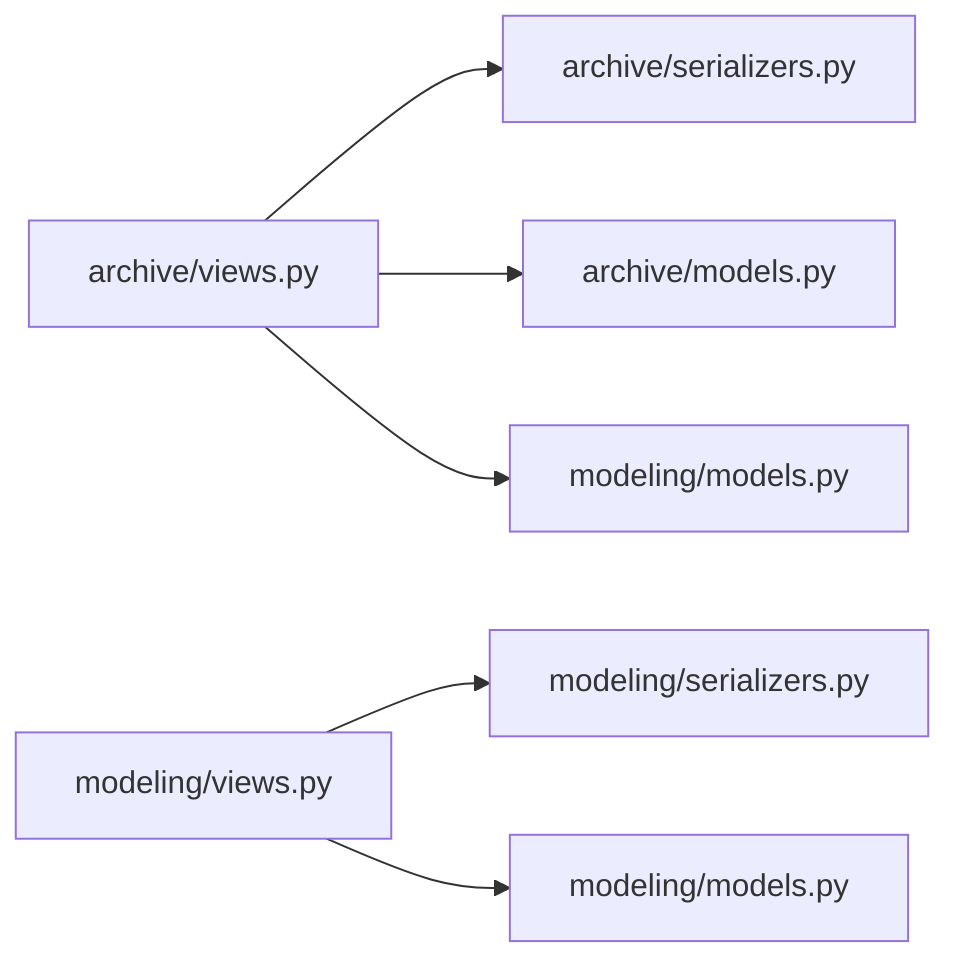

# API设计规范

<cite>
**本文引用的文件**   
- [settings.py](file://backend/config/settings.py)
- [urls.py](file://backend/config/urls.py)
- [pagination.py](file://backend/config/pagination.py)
- [modeling_urls.py](file://backend/apps/modeling/urls.py)
- [archive_urls.py](file://backend/apps/archive/urls.py)
- [modeling_views.py](file://backend/apps/modeling/views.py)
- [archive_views.py](file://backend/apps/archive/views.py)
- [modeling_serializers.py](file://backend/apps/modeling/serializers.py)
- [archive_serializers.py](file://backend/apps/archive/serializers.py)
- [modeling_models.py](file://backend/apps/modeling/models.py)
- [archive_models.py](file://backend/apps/archive/models.py)
- [test_api.py](file://backend/test_api.py)
- [api_error.ts](file://frontend/src/utils/apiError.ts)
- [api_index.ts](file://frontend/src/api/index.ts)
</cite>

## 目录
1. [引言](#引言)
2. [项目结构](#项目结构)
3. [核心组件](#核心组件)
4. [架构总览](#架构总览)
5. [详细组件分析](#详细组件分析)
6. [依赖关系分析](#依赖关系分析)
7. [性能考虑](#性能考虑)
8. [故障排查指南](#故障排查指南)
9. [结论](#结论)
10. [附录](#附录)

## 引言
本文件为 MetaData002 后端 API 设计文档，面向 RESTful 接口规范、DRF 配置、分页策略、过滤器与排序、请求响应格式、错误处理与状态码、认证授权与权限控制、CSRF 保护、API 版本管理、文档生成（drf_spectacular）与 Swagger 集成，以及最佳实践、性能优化与调试技巧。读者可据此统一前后端协作约定，提升接口质量与可维护性。

## 项目结构
后端采用 Django + DRF 分层组织：
- 全局配置：settings、URL 路由、分页类
- 应用模块：modeling（建模）、archive（档案）各自提供 ViewSet、序列化器、模型与子路由
- 前端通过 /api 前缀访问所有接口

图表来源
- [urls.py:1-9](file://backend/config/urls.py#L1-L9)
- [modeling_urls.py:1-20](file://backend/apps/modeling/urls.py#L1-L20)
- [archive_urls.py:1-21](file://backend/apps/archive/urls.py#L1-L21)
- [modeling_views.py:1-800](file://backend/apps/modeling/views.py#L1-L800)
- [archive_views.py:1-800](file://backend/apps/archive/views.py#L1-L800)
- [modeling_serializers.py:1-200](file://backend/apps/modeling/serializers.py#L1-L200)
- [archive_serializers.py:1-200](file://backend/apps/archive/serializers.py#L1-L200)
- [modeling_models.py:1-200](file://backend/apps/modeling/models.py#L1-L200)
- [archive_models.py:1-200](file://backend/apps/archive/models.py#L1-L200)

章节来源
- [settings.py:1-123](file://backend/config/settings.py#L1-L123)
- [urls.py:1-9](file://backend/config/urls.py#L1-L9)

## 核心组件
- DRF 基础能力
  - 分页：自定义 StandardPagination，默认每页 20，支持 ?page_size=N 覆盖，上限 100000
  - 过滤：DjangoFilterBackend、SearchFilter、OrderingFilter
  - Schema：drf_spectacular AutoSchema，用于自动生成 OpenAPI/Swagger
- 路由与命名空间
  - 根路由 /api 下包含 modeling 与 archive 两个子模块
  - 各模块使用 DefaultRouter 注册 ViewSet，自动暴露 CRUD 与 action 动作
- 序列化器
  - 按动作拆分 List/Detail/Create/Update 等序列化器，减少不必要字段暴露
- 模型
  - modeling：DataSource、Domain、Table、FieldGroup、Field、StandardField、ComputedField 等
  - archive：Archive、ArchiveRecord、ArchiveRecordVersion、SyncLog、OperationLog、ConsistencyIssue 等

章节来源
- [pagination.py:1-14](file://backend/config/pagination.py#L1-L14)
- [settings.py:91-107](file://backend/config/settings.py#L91-L107)
- [modeling_urls.py:1-20](file://backend/apps/modeling/urls.py#L1-L20)
- [archive_urls.py:1-21](file://backend/apps/archive/urls.py#L1-L21)
- [modeling_serializers.py:1-200](file://backend/apps/modeling/serializers.py#L1-L200)
- [archive_serializers.py:1-200](file://backend/apps/archive/serializers.py#L1-L200)
- [modeling_models.py:1-200](file://backend/apps/modeling/models.py#L1-L200)
- [archive_models.py:1-200](file://backend/apps/archive/models.py#L1-L200)

## 架构总览
整体数据流遵循“请求进入 → URL 分发 → ViewSet 处理 → 序列化器校验/转换 → ORM 操作 → Response”的标准 DRF 流程。鉴权与 CSRF 由中间件链保障；分页、过滤、排序在 ViewSet 层生效；OpenAPI 文档由 drf_spectacular 自动生成。

图表来源
- [settings.py:26-34](file://backend/config/settings.py#L26-L34)
- [urls.py:1-9](file://backend/config/urls.py#L1-L9)
- [modeling_views.py:1-800](file://backend/apps/modeling/views.py#L1-L800)
- [archive_views.py:1-800](file://backend/apps/archive/views.py#L1-L800)

## 详细组件分析

### 建模模块 API（Modeling）
- 资源与路由
  - data-sources：数据源配置（CRUD + test-connection、schemas、external-tables）
  - domains：域管理（CRUD + check-config、pk-status）
  - tables：表管理（CRUD + toggle-status、preview-data）
  - fields、field-groups、field-options、field-mappings、standard-fields、ai-config、computed-fields：字段与映射相关 CRUD
- 关键行为
  - DataSourceViewSet.test_connection_params：动态创建临时连接测试连通性
  - TableViewSet._sync_external_table_fields：创建数据源表时自动同步外部表字段结构
  - DomainViewSet.perform_update：启用 active 前进行 P0 检查拦截
- 分页/过滤/排序
  - 继承 DRF 默认分页与过滤后端，可在列表接口使用 page、page_size、search、ordering 等参数

图表来源
- [modeling_views.py:31-147](file://backend/apps/modeling/views.py#L31-L147)
- [modeling_views.py:430-503](file://backend/apps/modeling/views.py#L430-L503)
- [modeling_views.py:504-800](file://backend/apps/modeling/views.py#L504-L800)

章节来源
- [modeling_urls.py:1-20](file://backend/apps/modeling/urls.py#L1-L20)
- [modeling_views.py:31-147](file://backend/apps/modeling/views.py#L31-L147)
- [modeling_views.py:430-503](file://backend/apps/modeling/views.py#L430-L503)
- [modeling_views.py:504-800](file://backend/apps/modeling/views.py#L504-L800)
- [modeling_serializers.py:1-200](file://backend/apps/modeling/serializers.py#L1-L200)

### 档案模块 API（Archive）
- 资源与路由
  - archives：档案配置（CRUD + sync-schema、refresh-data、refresh-preview、consistency-check）
  - records：档案记录（CRUD + 版本、回滚、对比等扩展动作）
  - sync-logs、operation-logs：同步与操作日志
  - record-versions：记录版本快照
  - archive-apis：对外数据服务 API 配置
  - change-batches、change-details：变更批次与明细
  - consistency-issues、consistency-rules：一致性检查问题与规则
- 关键行为
  - ArchiveViewSet.sync_schema：同步模型变更并拉取数据，触发计算字段重算
  - ArchiveViewSet.refresh_data：仅刷新 source_data 并重算计算字段
  - ArchiveViewSet.refresh_preview：零写入预检 schema 与数据变化
  - ArchiveViewSet.consistency_check：四类一致性检查（组合成员、档案与源差异、孤儿记录、schema 漂移）
- 分页/过滤/排序
  - 列表接口支持 filterset_fields、search_fields、ordering 等通用参数

图表来源
- [archive_views.py:275-329](file://backend/apps/archive/views.py#L275-L329)
- [archive_views.py:331-343](file://backend/apps/archive/views.py#L331-L343)
- [archive_views.py:344-395](file://backend/apps/archive/views.py#L344-L395)
- [archive_views.py:396-601](file://backend/apps/archive/views.py#L396-L601)

章节来源
- [archive_urls.py:1-21](file://backend/apps/archive/urls.py#L1-L21)
- [archive_views.py:246-395](file://backend/apps/archive/views.py#L246-L395)
- [archive_views.py:396-601](file://backend/apps/archive/views.py#L396-L601)
- [archive_serializers.py:1-200](file://backend/apps/archive/serializers.py#L1-L200)
- [archive_models.py:1-200](file://backend/apps/archive/models.py#L1-L200)

### 分页策略
- 默认每页 20 条，允许前端通过 page_size 覆盖，最大不超过 100000
- 列表响应包含 results、count、next、previous 等标准分页字段

章节来源
- [pagination.py:1-14](file://backend/config/pagination.py#L1-L14)
- [settings.py:91-101](file://backend/config/settings.py#L91-L101)

### 过滤器与排序
- 过滤器后端：DjangoFilterBackend、SearchFilter、OrderingFilter
- 各 ViewSet 可通过 filterset_fields、search_fields、ordering_fields 声明支持的过滤与排序字段

章节来源
- [settings.py:95-101](file://backend/config/settings.py#L95-L101)
- [modeling_views.py:31-36](file://backend/apps/modeling/views.py#L31-L36)
- [modeling_views.py:430-435](file://backend/apps/modeling/views.py#L430-L435)
- [modeling_views.py:504-509](file://backend/apps/modeling/views.py#L504-L509)
- [archive_views.py:246-251](file://backend/apps/archive/views.py#L246-L251)

### 请求与响应格式
- 内容类型：application/json
- 列表响应：{ count, next, previous, results: [...] }
- 对象响应：按序列化器定义字段
- 批量操作：部分接口支持批量提交（如字段批量保存）

章节来源
- [test_api.py:1-155](file://backend/test_api.py#L1-L155)
- [modeling_serializers.py:1-200](file://backend/apps/modeling/serializers.py#L1-L200)
- [archive_serializers.py:1-200](file://backend/apps/archive/serializers.py#L1-L200)

### 错误处理机制与状态码规范
- 常见状态码
  - 200 OK：成功
  - 201 Created：创建成功
  - 204 No Content：删除成功
  - 400 Bad Request：参数校验失败或业务校验失败
  - 403 Forbidden：权限不足
  - 404 Not Found：资源不存在
  - 500 Internal Server Error：服务端异常
- 错误体结构
  - detail/message/error：错误描述
  - non_field_errors：非字段级错误数组
  - 字段级错误：{ field: ["错误信息"] }
- 前端错误提取
  - 优先解析 error/detail/message，其次 non_field_errors，最后字段级错误拼接

章节来源
- [archive_views.py:412-412](file://backend/apps/archive/views.py#L412-L412)
- [archive_views.py:1572-1572](file://backend/apps/archive/views.py#L1572-L1572)
- [api_error.ts:1-28](file://frontend/src/utils/apiError.ts#L1-L28)
- [api_index.ts:1-21](file://frontend/src/api/index.ts#L1-L21)

### 认证授权与权限控制、CSRF 保护
- 中间件链包含 Session、Authentication、CsrfViewMiddleware 等
- 当前未配置自定义权限类，默认基于 DRF 默认权限（匿名可访问，除非 ViewSet 内显式限制）
- CSRF 保护已启用，跨站请求需携带 CSRF Token（浏览器同源场景通常自动处理）

章节来源
- [settings.py:26-34](file://backend/config/settings.py#L26-L34)

### API 版本管理策略
- 当前未实现显式版本化（如 /v1/），建议未来通过 URL 前缀或 Accept-Version 头管理
- 保持向后兼容，新增字段避免破坏既有消费者

[本节为概念性说明，不直接分析具体文件]

### 文档生成（drf_spectacular）与 Swagger 集成
- 已启用 drf_spectacular AutoSchema，标题与版本在 SPECTACULAR_SETTINGS 中配置
- 可通过 SpectacularAPIView 暴露 /api/schema/ 或 /swagger.json 等路径（需在路由中注册）

章节来源
- [settings.py:103-107](file://backend/config/settings.py#L103-L107)

## 依赖关系分析
- 模块间耦合
  - archive 模块依赖 modeling 的 Domain、Table、Field、StandardField、ComputedField 等模型
  - ViewSet 依赖对应序列化器与模型
- 外部依赖
  - PostgreSQL、Redis（缓存）
  - drf_spectacular、django_filters、rest_framework

图表来源
- [archive_views.py:1-800](file://backend/apps/archive/views.py#L1-L800)
- [archive_serializers.py:1-200](file://backend/apps/archive/serializers.py#L1-L200)
- [archive_models.py:1-200](file://backend/apps/archive/models.py#L1-L200)
- [modeling_views.py:1-800](file://backend/apps/modeling/views.py#L1-L800)
- [modeling_serializers.py:1-200](file://backend/apps/modeling/serializers.py#L1-L200)
- [modeling_models.py:1-200](file://backend/apps/modeling/models.py#L1-L200)

章节来源
- [archive_views.py:1-800](file://backend/apps/archive/views.py#L1-L800)
- [modeling_views.py:1-800](file://backend/apps/modeling/views.py#L1-L800)

## 性能考虑
- 分页与限流
  - 合理设置 PAGE_SIZE 与 max_page_size，避免大页导致内存与网络压力
- 查询优化
  - 使用 select_related/prefetch_related 减少 N+1 查询
  - 对高频查询字段建立索引（如 archive.status、record.archive_id）
- 缓存
  - Redis 作为默认缓存后端，适合缓存字典、枚举、统计结果
- 异步与批处理
  - 大数据量同步与重算可考虑任务队列（Celery）异步执行
- 外部数据库连接
  - 动态连接应复用连接池，避免频繁创建销毁

[本节为通用指导，不直接分析具体文件]

## 故障排查指南
- 常见问题
  - 连接失败：检查数据源配置、驱动与 ODBC 参数
  - 权限不足：确认用户角色与 API 授权配置
  - CSRF 错误：确保请求携带正确 Token
  - 校验失败：查看 non_field_errors 与字段级错误
- 调试技巧
  - 使用 test_api.py 快速验证核心流程
  - 前端保留原始响应，便于定位结构化错误
  - 开启 DEBUG 模式查看详细堆栈

章节来源
- [test_api.py:1-155](file://backend/test_api.py#L1-L155)
- [api_index.ts:1-21](file://frontend/src/api/index.ts#L1-L21)
- [api_error.ts:1-28](file://frontend/src/utils/apiError.ts#L1-L28)

## 结论
本设计文档明确了 MetaData002 后端的 RESTful API 规范与 DRF 配置，涵盖分页、过滤、排序、错误处理、认证与 CSRF、文档生成等关键方面。通过统一的接口约定与最佳实践，可有效提升前后端协作效率与系统稳定性。建议在后续迭代中引入显式版本管理与更细粒度的权限控制，以增强可扩展性与安全性。

[本节为总结性内容，不直接分析具体文件]

## 附录
- 常用查询参数
  - page、page_size：分页
  - search：全文搜索
  - ordering：排序字段（支持多字段）
  - 各 ViewSet 的 filterset_fields 指定字段过滤
- 典型错误码
  - 400：参数或业务校验失败
  - 403：权限不足
  - 404：资源不存在
  - 500：服务端异常

[本节为补充说明，不直接分析具体文件]