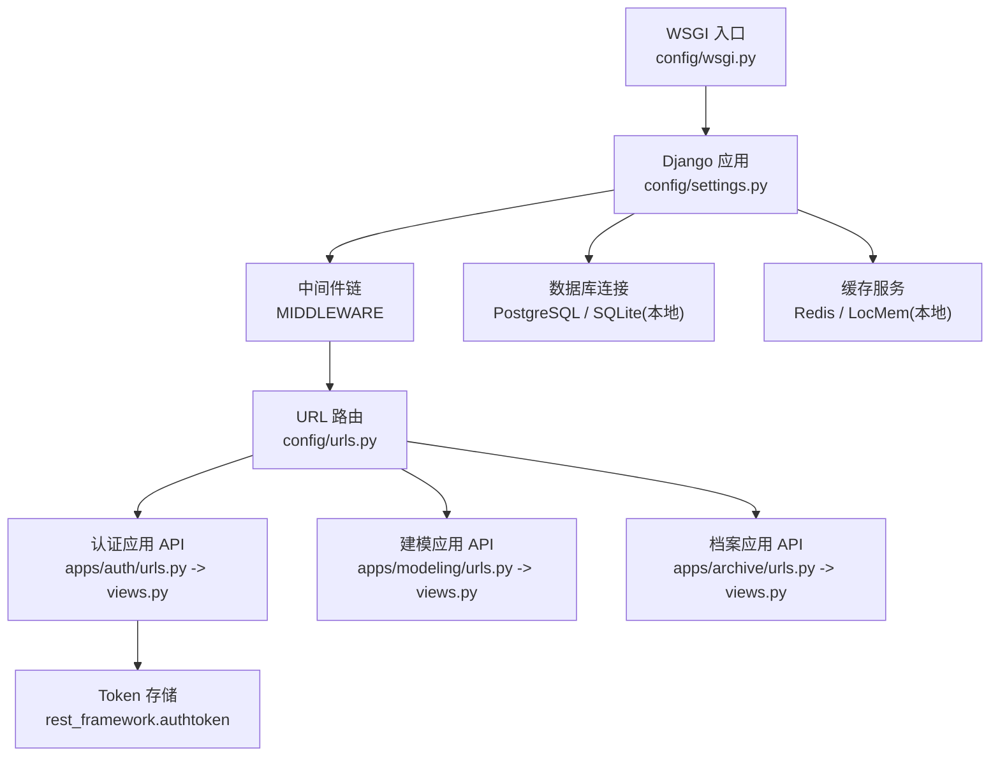
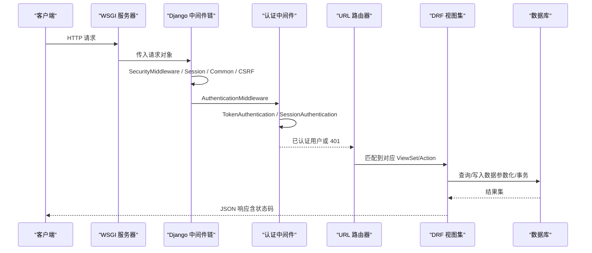
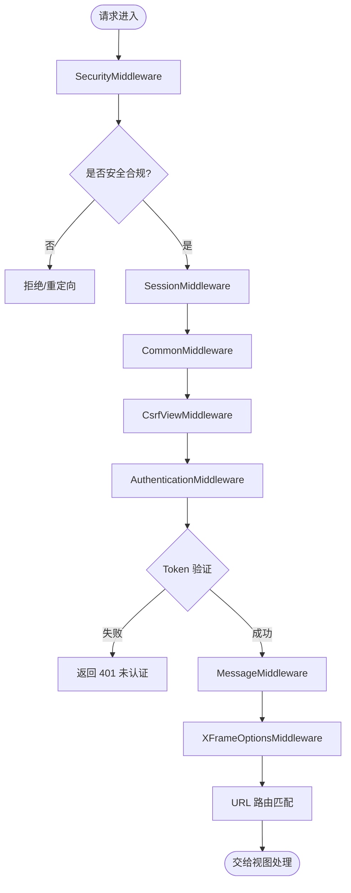
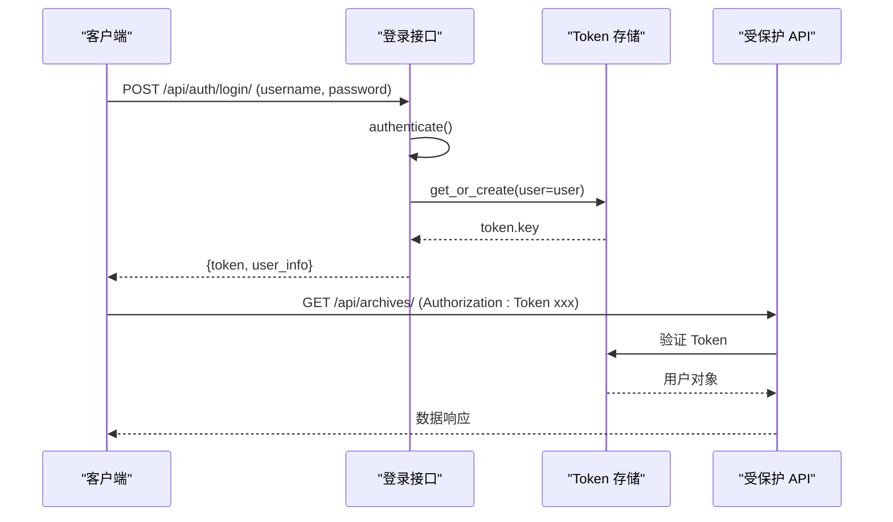
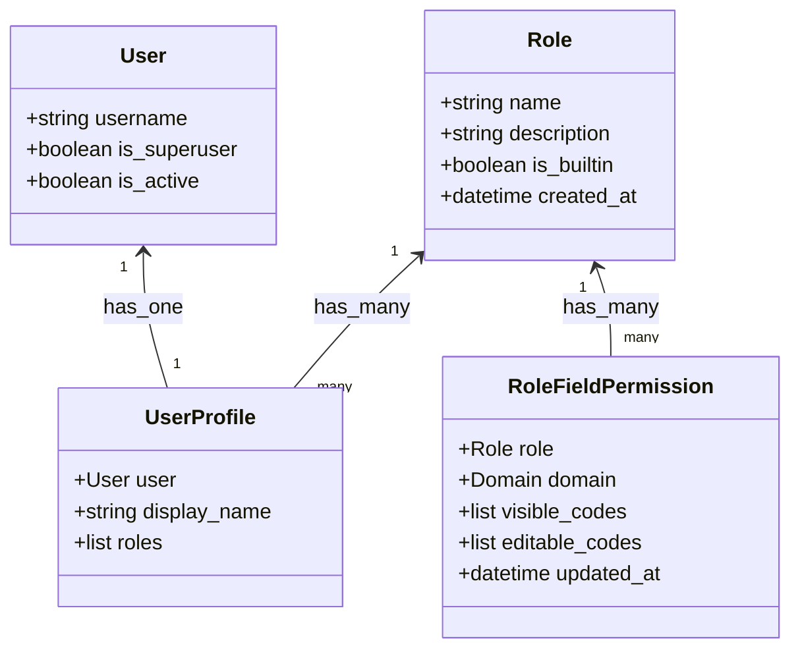
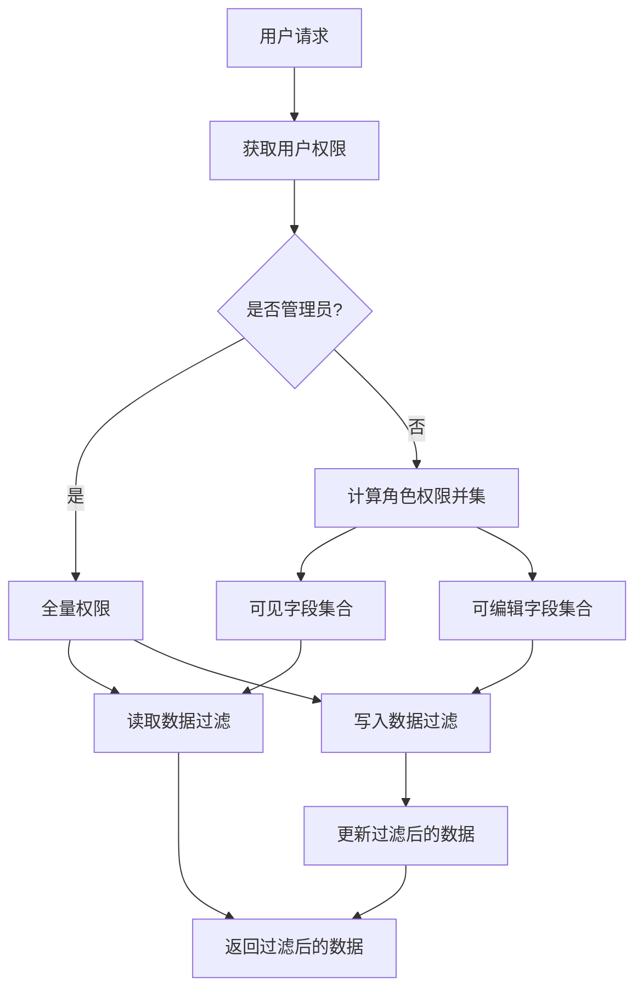
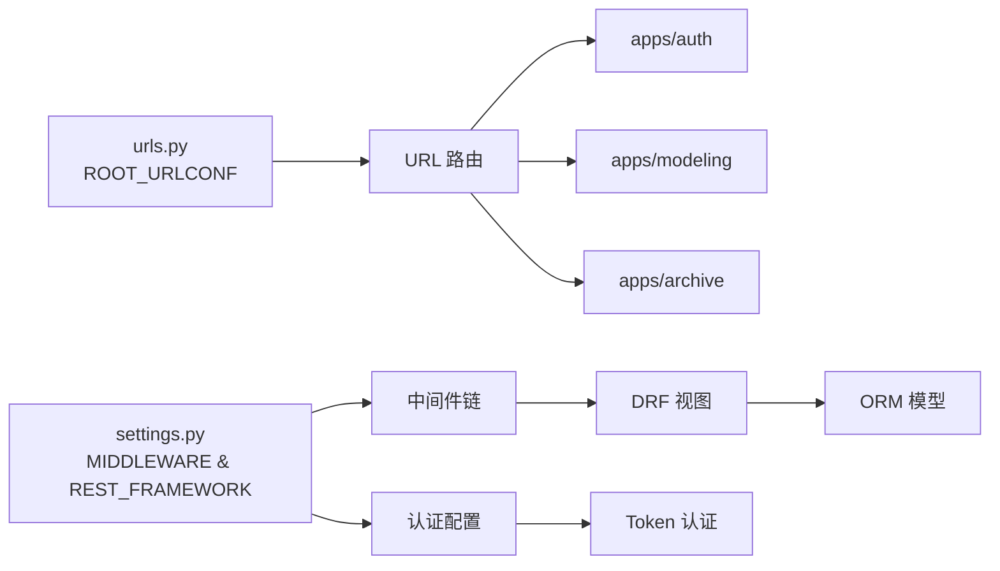

# 中间件与安全

<cite>
**本文引用的文件**   
- [settings.py](file://backend/config/settings.py)
- [urls.py](file://backend/config/urls.py)
- [local_settings.py](file://backend/local_settings.py)
- [models.py（认证）](file://backend/apps/auth/models.py)
- [views.py（认证）](file://backend/apps/auth/views.py)
- [permission.py（认证）](file://backend/apps/auth/permission.py)
- [serializers.py（认证）](file://backend/apps/auth/serializers.py)
- [urls.py（认证）](file://backend/apps/auth/urls.py)
- [init_admin.py](file://backend/apps/auth/management/commands/init_admin.py)
- [init_test_account.py](file://backend/apps/auth/management/commands/init_test_account.py)
- [views.py（建模）](file://backend/apps/modeling/views.py)
- [models.py（建模）](file://backend/apps/modeling/models.py)
- [views.py（档案）](file://backend/apps/archive/views.py)
- [models.py（档案）](file://backend/apps/archive/models.py)
- [serializers.py（档案）](file://backend/apps/archive/serializers.py)
- [refresh_archives.py](file://backend/apps/archive/management/commands/refresh_archives.py)
- [smoke_auth.py](file://backend/smoke_auth.py)
- [smoke_permission_overview.py](file://backend/smoke_permission_overview.py)
</cite>

## 更新摘要
**变更内容**   
- 新增完整认证授权系统章节，包含 JWT-like Token 认证、角色基础访问控制（RBAC）、字段级权限
- 更新中间件配置，反映全局强制登录策略
- 新增用户管理 API 和角色管理功能说明
- 增强安全配置最佳实践，包含令牌管理和会话安全
- 补充审计跟踪和安全监控内容

## 目录
1. [简介](#简介)
2. [项目结构](#项目结构)
3. [核心组件](#核心组件)
4. [架构总览](#架构总览)
5. [详细组件分析](#详细组件分析)
6. [依赖关系分析](#依赖关系分析)
7. [性能考量](#性能考量)
8. [故障排查指南](#故障排查指南)
9. [结论](#结论)
10. [附录：安全配置清单与最佳实践](#附录安全配置清单与最佳实践)

## 简介
本文件面向 MetaData002 后端，系统性梳理并完善中间件与安全体系。内容覆盖 Django 中间件链、会话管理、跨域请求处理、**完整的认证授权机制**、用户权限控制与角色管理、CSRF/XSS/SQL 注入防护策略、日志记录与审计跟踪、安全监控与应急响应，以及生产环境的安全配置最佳实践与漏洞防护措施。

**重要更新**：系统现已实现完整的认证授权框架，包括基于 Token 的身份验证、角色基础访问控制（RBAC）、字段级权限控制和用户管理 API。

## 项目结构
后端采用 Django + DRF 的模块化结构，核心安全相关配置集中在 settings 与 local_settings；路由由 urls 统一分发到各应用；业务逻辑分布在 apps.modeling、apps.archive 与新增的 apps.auth 中。

**图表来源** 
- [settings.py:28-36](file://backend/config/settings.py#L28-L36)
- [urls.py:4-8](file://backend/config/urls.py#L4-L8)
- [urls.py（认证）:6-15](file://backend/apps/auth/urls.py#L6-L15)

**章节来源**
- [settings.py:1-133](file://backend/config/settings.py#L1-L133)
- [urls.py:1-9](file://backend/config/urls.py#L1-L9)
- [urls.py（认证）:1-16](file://backend/apps/auth/urls.py#L1-L16)

## 核心组件
- **中间件链**：包含安全、会话、通用、CSRF、认证、消息、点击劫持等中间件。
- **认证授权系统**：基于 Django REST Framework 的 Token 认证，支持全局强制登录。
- **角色基础访问控制（RBAC）**：Role、UserProfile、RoleFieldPermission 三表模型实现细粒度权限控制。
- **字段级权限**：按角色×档案域配置可见字段和可编辑字段白名单。
- **用户管理 API**：提供用户创建、角色分配、密码重置等管理功能。
- **跨域支持**：开发环境通过 django-cors-headers 开启宽松策略，生产需收紧。
- **数据访问安全**：动态数据库连接与原生 SQL 执行场景需严格参数化与白名单校验。
- **日志与审计**：操作日志、同步日志、一致性检查历史等保障可追溯性。

**章节来源**
- [settings.py:28-36](file://backend/config/settings.py#L28-L36)
- [settings.py:94-111](file://backend/config/settings.py#L94-L111)
- [models.py（认证）:5-70](file://backend/apps/auth/models.py#L5-L70)
- [permission.py（认证）:1-75](file://backend/apps/auth/permission.py#L1-L75)

## 架构总览
下图展示请求从进入 WSGI 到视图处理的完整链路，以及关键安全中间件的职责边界。

**图表来源** 
- [settings.py:28-36](file://backend/config/settings.py#L28-L36)
- [settings.py:94-111](file://backend/config/settings.py#L94-L111)
- [urls.py:4-8](file://backend/config/urls.py#L4-L8)

## 详细组件分析

### 中间件链与请求处理流程
- **安全中间件**：启用后提供基础安全头设置（如 HSTS、X-Content-Type-Options 等），在生产应配合 HTTPS 与代理层加固。
- **会话中间件**：维护会话状态，默认使用 Cookie 存储，建议生产开启 Secure、HttpOnly、SameSite。
- **通用中间件**：处理常见请求头与 MIME 类型。
- **CSRF 中间件**：对写操作进行令牌校验，前后端分离场景可通过 Header 传递或禁用部分接口。
- **认证中间件**：将已认证用户注入 request.user，后续视图可据此做权限判断。**全局强制登录**确保所有 API 都需要认证。
- **消息中间件**：用于闪现消息。
- **点击劫持防护**：默认设置 X-Frame-Options 为 DENY/SAMEORIGIN。

**图表来源** 
- [settings.py:28-36](file://backend/config/settings.py#L28-L36)
- [settings.py:94-111](file://backend/config/settings.py#L94-L111)

**章节来源**
- [settings.py:28-36](file://backend/config/settings.py#L28-L36)

### 认证与授权机制

#### Token 认证系统
系统使用 Django REST Framework 的 TokenAuthentication 实现类 JWT 的无状态认证：

- **登录流程**：用户名密码验证 → 生成 Token → 返回用户信息和 Token
- **认证流程**：请求头携带 `Authorization: Token <token>` → 验证 Token → 注入用户对象
- **登出流程**：删除 Token → 立即失效

**图表来源** 
- [views.py（认证）:42-58](file://backend/apps/auth/views.py#L42-L58)
- [views.py（认证）:61-66](file://backend/apps/auth/views.py#L61-L66)

#### 角色基础访问控制（RBAC）
系统实现了完整的 RBAC 模型：

- **Role（角色）**：定义权限集合，支持内置角色和用户自定义角色
- **UserProfile（用户档案）**：关联用户与角色，支持多角色
- **RoleFieldPermission（角色字段权限）**：按角色×档案域配置字段级权限

**图表来源** 
- [models.py（认证）:5-70](file://backend/apps/auth/models.py#L5-L70)

**章节来源**
- [views.py（认证）:42-182](file://backend/apps/auth/views.py#L42-L182)
- [models.py（认证）:5-70](file://backend/apps/auth/models.py#L5-L70)

#### 字段级权限控制
系统实现了精细化的字段级权限控制：

- **可见字段（visible_codes）**：决定哪些字段对用户可见
- **可编辑字段（editable_codes）**：决定哪些字段可以修改（必须是可见字段的子集）
- **权限计算**：多角色权限取并集，管理员拥有全量权限
- **数据投影**：读取时隐藏不可见字段，写入时静默丢弃不可编辑字段

**图表来源** 
- [permission.py（认证）:22-47](file://backend/apps/auth/permission.py#L22-L47)
- [permission.py（认证）:50-75](file://backend/apps/auth/permission.py#L50-L75)

**章节来源**
- [permission.py（认证）:1-75](file://backend/apps/auth/permission.py#L1-L75)
- [serializers.py（档案）:112-150](file://backend/apps/archive/serializers.py#L112-L150)

### 用户管理 API
系统提供了完整的用户管理功能：

- **用户创建**：支持创建用户并分配角色
- **用户更新**：支持修改显示名和角色分配
- **密码重置**：管理员可重置用户密码，旧 Token 立即失效
- **用户列表**：仅管理员可访问，支持分页查询

**章节来源**
- [views.py（认证）:76-122](file://backend/apps/auth/views.py#L76-L122)
- [serializers.py（认证）:13-39](file://backend/apps/auth/serializers.py#L13-L39)

### 角色管理 API
系统提供了完整的角色管理功能：

- **角色 CRUD**：创建、读取、更新、删除角色
- **权限配置**：按角色×档案域配置字段级权限
- **权限验证**：确保可编辑字段是可见字段的子集
- **源系统保护**：防止配置源系统维护的字段为可编辑

**章节来源**
- [views.py（认证）:124-182](file://backend/apps/auth/views.py#L124-L182)

### CSRF 保护
- **默认启用**：CsrfViewMiddleware 对所有写操作进行校验
- **API 适配**：Token 认证接口可配置跳过 CSRF 校验
- **前端集成**：建议在前后端分离架构中使用 Token 认证替代 CSRF

**章节来源**
- [settings.py:28-36](file://backend/config/settings.py#L28-L36)

### XSS 防护
- **输出编码**：模板渲染与 JSON 序列化默认具备一定防护能力
- **CSP 配置**：可通过 SECURE_CSP 配置内容安全策略
- **输入过滤**：对用户输入进行白名单校验

**章节来源**
- [settings.py:103-107](file://backend/config/settings.py#L103-L107)

### SQL 注入防护
- **参数化查询**：动态数据库连接必须使用参数化查询
- **白名单校验**：表名/列名不应直接拼接用户输入
- **最小权限**：数据库账号仅授予必要权限

**章节来源**
- [views.py（建模）:40-72](file://backend/apps/modeling/views.py#L40-L72)
- [views.py（建模）:94-146](file://backend/apps/modeling/views.py#L94-L146)

### 会话管理与安全
- **会话引擎**：默认使用数据库或缓存后端，生产建议 Redis
- **Cookie 安全**：SESSION_COOKIE_SECURE、SESSION_COOKIE_HTTPONLY、SESSION_COOKIE_SAMESITE 应在生产开启
- **并发清理**：定期清理过期会话，防止会话堆积

**章节来源**
- [settings.py:68-74](file://backend/config/settings.py#L68-L74)

### 日志记录与审计跟踪
- **操作日志**：ArchiveOperationLog 记录增删改等操作摘要与操作人
- **同步日志**：ArchiveSyncLog 记录数据同步过程的状态与详情
- **一致性检查历史**：ConsistencyIssueHistory 记录差异变化历史
- **管理命令**：refresh_archives 在执行过程中输出成功/失败信息

**章节来源**
- [models.py（档案）:174-200](file://backend/apps/archive/models.py#L174-L200)
- [models.py（档案）:112-137](file://backend/apps/archive/models.py#L112-L137)
- [models.py（档案）:75-110](file://backend/apps/archive/models.py#L75-L110)

### 安全监控与应急响应
- **监控指标**：错误率、慢查询、CSRF 失败次数、CORS 拒绝次数、数据库连接异常
- **告警策略**：对敏感操作（如 schema 同步、数据刷新）进行告警与审计
- **应急响应**：快速回滚、隔离受影响接口、恢复备份数据、修复漏洞并发布补丁

## 依赖关系分析
- **中间件依赖**：SecurityMiddleware、SessionMiddleware、CommonMiddleware、CsrfViewMiddleware、AuthenticationMiddleware、MessageMiddleware、XFrameOptionsMiddleware
- **认证依赖**：rest_framework.authentication.TokenAuthentication、rest_framework.permissions.IsAuthenticated
- **路由依赖**：根路由包含 admin、modeling、archive、auth 四个子路由
- **应用依赖**：modeling、archive、auth 均依赖 Django ORM、DRF、第三方库

**图表来源** 
- [settings.py:28-36](file://backend/config/settings.py#L28-L36)
- [settings.py:94-111](file://backend/config/settings.py#L94-L111)
- [urls.py:4-8](file://backend/config/urls.py#L4-L8)

**章节来源**
- [settings.py:28-36](file://backend/config/settings.py#L28-L36)
- [settings.py:94-111](file://backend/config/settings.py#L94-L111)
- [urls.py:4-8](file://backend/config/urls.py#L4-L8)

## 性能考量
- **数据库连接池**：动态连接频繁创建可能带来开销，建议复用连接或引入连接池
- **查询优化**：使用 select_related/prefetch_related 减少 N+1 查询
- **缓存策略**：对热点数据（如 schema、枚举值）使用 Redis 缓存
- **异步任务**：大数据量同步与计算字段重算可迁移至 Celery 等异步队列
- **Token 缓存**：考虑对 Token 验证结果进行短期缓存以减少数据库查询

## 故障排查指南
- **认证失败**：检查 Token 是否正确传递，确认用户是否激活
- **权限不足**：检查用户角色配置，确认字段权限设置
- **CSRF 失败**：检查请求是否携带正确 Token，确认 CORS 与 CSRF 配置一致
- **跨域错误**：核对 allowed_origins、methods、headers，确保生产环境严格限制
- **数据库连接失败**：验证连接参数、驱动安装、网络连通性与权限
- **性能问题**：定位慢查询、锁竞争、内存占用，必要时增加索引或优化逻辑

**章节来源**
- [settings.py:28-36](file://backend/config/settings.py#L28-L36)
- [local_settings.py:17-26](file://backend/local_settings.py#L17-L26)

## 结论
MetaData002 后端现已实现完整的认证授权系统，包括基于 Token 的身份验证、角色基础访问控制（RBAC）、字段级权限控制和用户管理 API。系统在安全性方面具备以下特点：

- **全局强制登录**：所有 API 默认需要认证，确保安全基线
- **细粒度权限控制**：支持按角色×档案域配置字段级可见性和可编辑性
- **灵活的认证机制**：支持 Token 认证和会话认证
- **完善的用户管理**：提供用户创建、角色分配、密码重置等功能
- **安全的默认配置**：遵循安全最佳实践，提供生产环境安全建议

建议在生产环境中进一步强化跨域策略、会话安全、CSRF 与 XSS 防护，并对动态 SQL 执行进行严格管控。同时建立完善的监控和审计体系，制定应急响应预案，持续提升系统安全性与稳定性。

## 附录：安全配置清单与最佳实践

### 认证与授权配置
- **全局强制登录**：REST_FRAMEWORK.DEFAULT_PERMISSION_CLASSES 设置为 IsAuthenticated
- **Token 认证**：启用 rest_framework.authentication.TokenAuthentication
- **会话认证**：启用 rest_framework.authentication.SessionAuthentication
- **管理员角色**：使用 init_admin 命令初始化内置管理员角色和 admin 用户
- **测试账号**：使用 init_test_account 命令创建测试专用账号

### 密钥与环境变量
- **SECRET_KEY**：DJANGO_SECRET_KEY 环境变量，禁止硬编码
- **数据库凭据**：DB_NAME、DB_USER、DB_PASSWORD、DB_HOST、DB_PORT
- **AI API Key**：AI_API_KEY 环境变量
- **管理员密码**：MDM_ADMIN_PASSWORD 环境变量
- **测试密码**：MDM_TEST_PASSWORD 环境变量

### 安全头配置
- **HSTS**：启用 HTTP Strict Transport Security
- **X-Content-Type-Options**：防止 MIME 类型嗅探
- **X-Frame-Options**：防止点击劫持攻击
- **Referrer-Policy**：控制引用信息泄露

### 会话安全
- **SESSION_COOKIE_SECURE**：生产环境启用 HTTPS 传输
- **SESSION_COOKIE_HTTPONLY**：防止 JavaScript 访问 Cookie
- **SESSION_COOKIE_SAMESITE**：防止跨站请求伪造
- **会话过期**：合理设置会话超时时间

### CSRF 保护
- **生产环境启用**：严格校验 CSRF Token
- **API 接口豁免**：纯 API 接口可采用 Token 认证并豁免 CSRF
- **前端集成**：在前后端分离架构中正确处理 CSRF Token

### CORS 配置
- **生产环境精确配置**：allowed_origins、methods、headers 严格限制
- **禁用通配符**：避免使用 * 作为允许的来源
- **HTTPS 要求**：生产环境只允许 HTTPS 来源

### 输入校验
- **白名单校验**：对所有用户输入进行白名单校验
- **长度限制**：设置合理的输入长度限制
- **类型验证**：确保数据类型正确
- **SQL 注入防护**：使用参数化查询，避免字符串拼接

### 数据库安全
- **最小权限原则**：数据库账号仅授予必要权限
- **禁止 root/admin**：禁止使用高权限账户直连生产数据库
- **连接加密**：生产环境启用数据库连接加密
- **定期审计**：定期检查数据库访问日志

### 日志与审计
- **集中收集**：使用日志聚合系统收集应用日志
- **关键操作轨迹**：记录用户登录、权限变更、数据修改等关键操作
- **定期归档**：定期归档历史日志，保留足够时长
- **安全审计**：定期进行安全审计和日志分析

### 监控与告警
- **关键指标看板**：建立认证失败率、权限拒绝率等监控指标
- **实时告警**：对异常行为实时告警
- **性能监控**：监控 API 响应时间和数据库性能
- **安全事件**：监控潜在的安全威胁和攻击尝试

### 应急响应
- **回滚流程**：制定快速回滚方案
- **隔离措施**：能够快速隔离受影响的服务
- **修复流程**：标准化的漏洞修复流程
- **通报机制**：建立安全事件通报机制
- **定期演练**：定期进行应急响应演练

**章节来源**
- [settings.py:94-111](file://backend/config/settings.py#L94-L111)
- [init_admin.py:1-48](file://backend/apps/auth/management/commands/init_admin.py#L1-L48)
- [init_test_account.py:1-44](file://backend/apps/auth/management/commands/init_test_account.py#L1-L44)