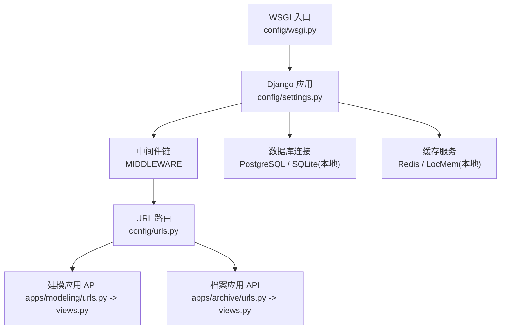
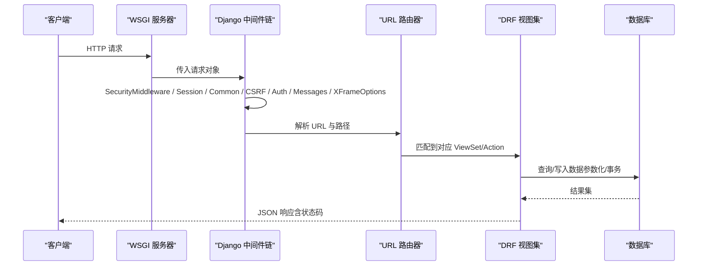
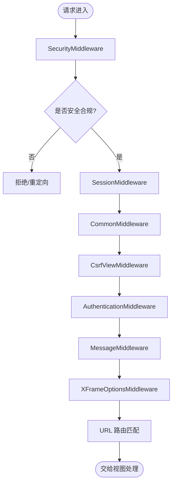
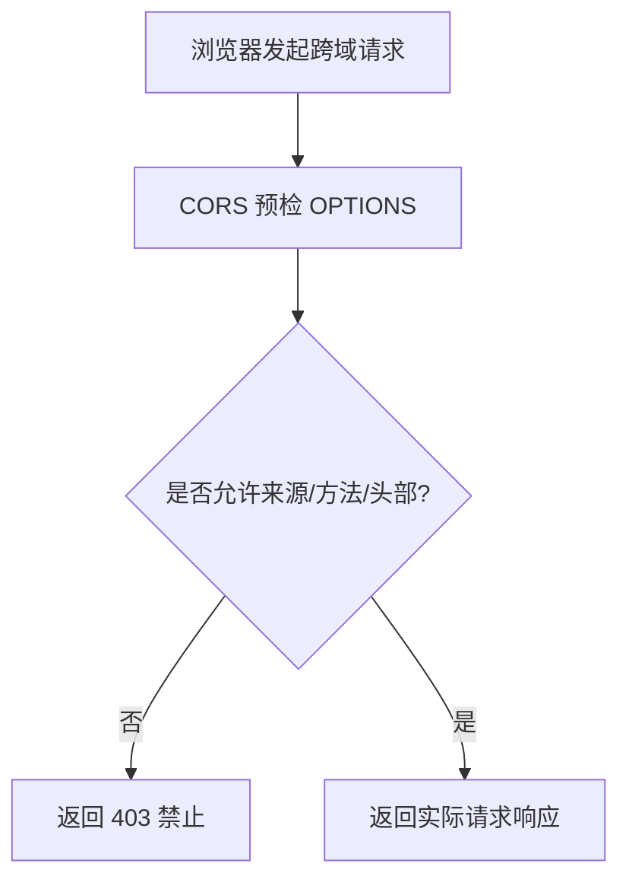
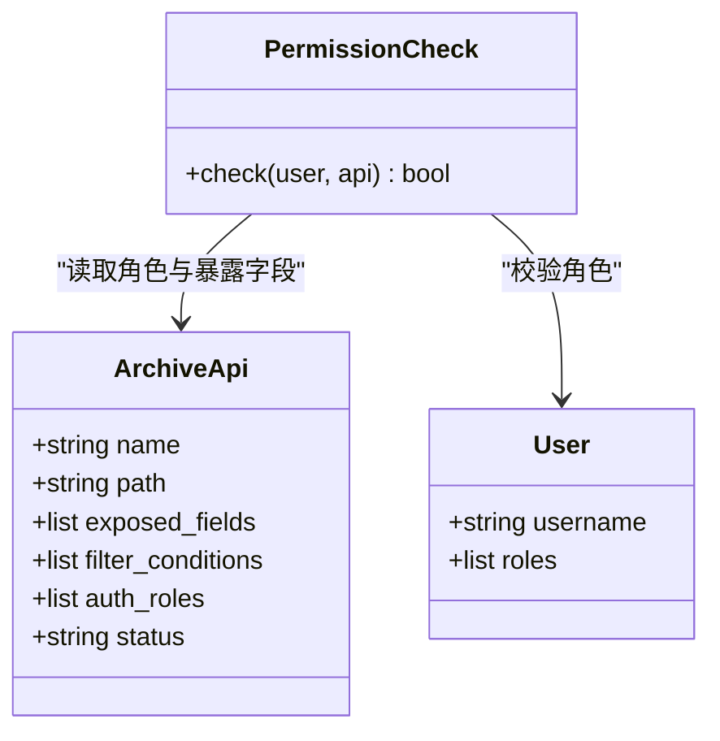
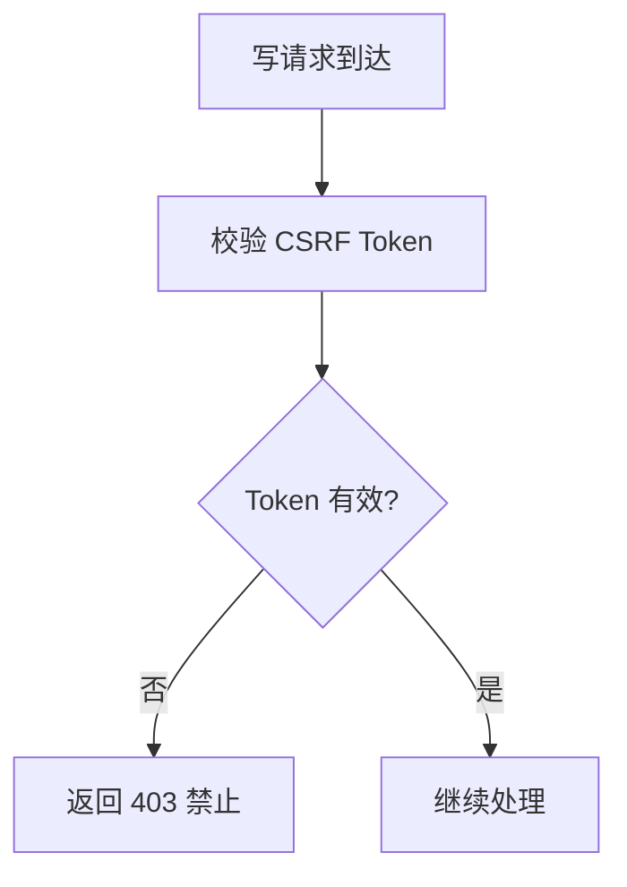
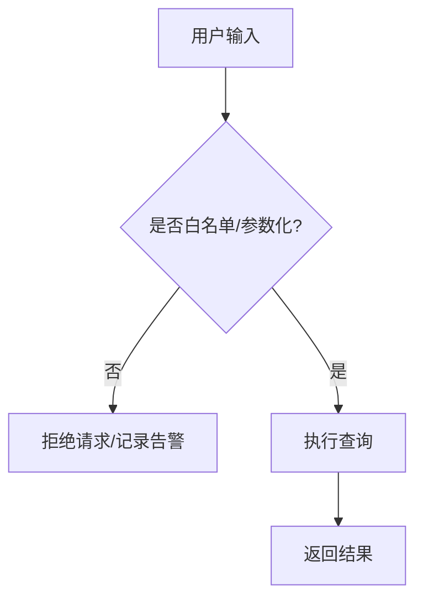
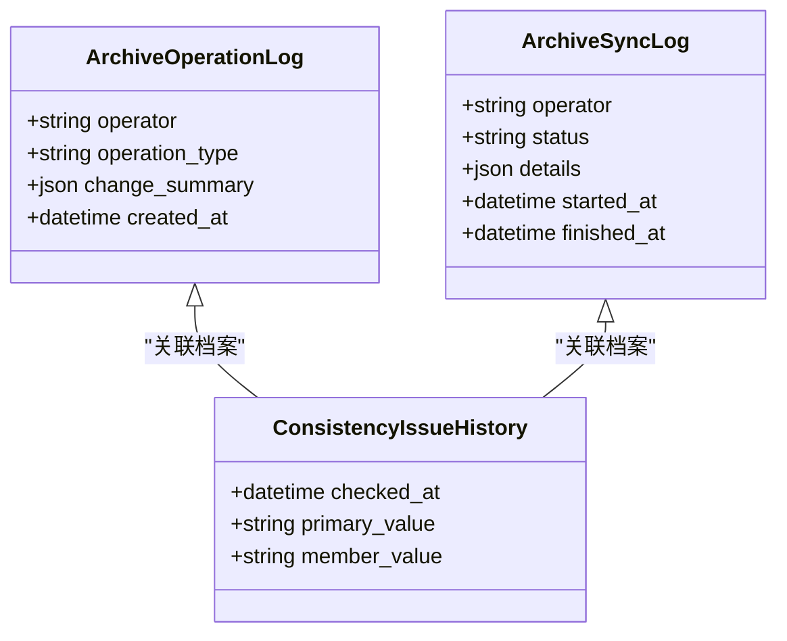
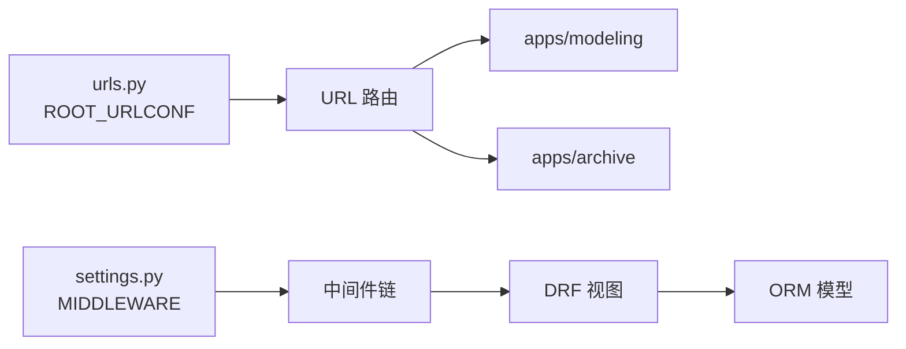

# 中间件与安全

<cite>
**本文引用的文件**   
- [settings.py](file://backend/config/settings.py)
- [urls.py](file://backend/config/urls.py)
- [local_settings.py](file://backend/local_settings.py)
- [views.py（建模）](file://backend/apps/modeling/views.py)
- [models.py（建模）](file://backend/apps/modeling/models.py)
- [views.py（档案）](file://backend/apps/archive/views.py)
- [models.py（档案）](file://backend/apps/archive/models.py)
- [refresh_archives.py](file://backend/apps/archive/management/commands/refresh_archives.py)
</cite>

## 目录
1. [简介](#简介)
2. [项目结构](#项目结构)
3. [核心组件](#核心组件)
4. [架构总览](#架构总览)
5. [详细组件分析](#详细组件分析)
6. [依赖关系分析](#依赖关系分析)
7. [性能考量](#性能考量)
8. [故障排查指南](#故障排查指南)
9. [结论](#结论)
10. [附录：安全配置清单与最佳实践](#附录安全配置清单与最佳实践)

## 简介
本文件面向 MetaData002 后端，系统性梳理并完善中间件与安全体系。内容覆盖 Django 中间件链、会话管理、跨域请求处理、认证授权机制、用户权限控制与角色管理、CSRF/XSS/SQL 注入防护策略、日志记录与审计跟踪、安全监控与应急响应，以及生产环境的安全配置最佳实践与漏洞防护措施。

## 项目结构
后端采用 Django + DRF 的模块化结构，核心安全相关配置集中在 settings 与 local_settings；路由由 urls 统一分发到各应用；业务逻辑分布在 apps.modeling 与 apps.archive 中。

**图表来源** 
- [settings.py:26-34](file://backend/config/settings.py#L26-L34)
- [urls.py:4-8](file://backend/config/urls.py#L4-L8)
- [local_settings.py:17-26](file://backend/local_settings.py#L17-L26)

**章节来源**
- [settings.py:1-123](file://backend/config/settings.py#L1-L123)
- [urls.py:1-9](file://backend/config/urls.py#L1-L9)
- [local_settings.py:1-26](file://backend/local_settings.py#L1-L26)

## 核心组件
- 中间件链：包含安全、会话、通用、CSRF、认证、消息、点击劫持等中间件。
- 跨域支持：开发环境通过 django-cors-headers 开启宽松策略，生产需收紧。
- 认证与授权：基于 Django 内置认证框架与 DRF 扩展点，结合模型中的角色字段进行细粒度授权。
- 数据访问安全：动态数据库连接与原生 SQL 执行场景需严格参数化与白名单校验。
- 日志与审计：操作日志、同步日志、一致性检查历史等保障可追溯性。

**章节来源**
- [settings.py:26-34](file://backend/config/settings.py#L26-L34)
- [local_settings.py:17-26](file://backend/local_settings.py#L17-L26)
- [models.py（档案）:139-172](file://backend/apps/archive/models.py#L139-L172)
- [models.py（档案）:174-200](file://backend/apps/archive/models.py#L174-L200)

## 架构总览
下图展示请求从进入 WSGI 到视图处理的完整链路，以及关键安全中间件的职责边界。

**图表来源** 
- [settings.py:26-34](file://backend/config/settings.py#L26-L34)
- [urls.py:4-8](file://backend/config/urls.py#L4-L8)
- [views.py（建模）:31-40](file://backend/apps/modeling/views.py#L31-L40)
- [views.py（档案）:246-260](file://backend/apps/archive/views.py#L246-L260)

## 详细组件分析

### 中间件链与请求处理流程
- 安全中间件：启用后提供基础安全头设置（如 HSTS、X-Content-Type-Options 等），在生产应配合 HTTPS 与代理层加固。
- 会话中间件：维护会话状态，默认使用 Cookie 存储，建议生产开启 Secure、HttpOnly、SameSite。
- 通用中间件：处理常见请求头与 MIME 类型。
- CSRF 中间件：对写操作进行令牌校验，前后端分离场景可通过 Header 传递或禁用部分接口。
- 认证中间件：将已认证用户注入 request.user，后续视图可据此做权限判断。
- 消息中间件：用于闪现消息。
- 点击劫持防护：默认设置 X-Frame-Options 为 DENY/SAMEORIGIN。

**图表来源** 
- [settings.py:26-34](file://backend/config/settings.py#L26-L34)

**章节来源**
- [settings.py:26-34](file://backend/config/settings.py#L26-L34)

### 跨域请求处理（CORS）
- 开发环境：在 local_settings 中引入 corsheaders 并允许所有来源，便于前端调试。
- 生产环境：必须限制允许的源、方法、头部，关闭通配符，并结合 HTTPS。

**图表来源** 
- [local_settings.py:17-26](file://backend/local_settings.py#L17-L26)

**章节来源**
- [local_settings.py:17-26](file://backend/local_settings.py#L17-L26)

### 认证与授权机制
- 认证：基于 Django 认证系统，request.user 由 AuthenticationMiddleware 注入。
- 授权：可在 DRF 中使用 permission_classes 或自定义权限类实现；当前代码未显式定义全局权限，建议在视图层按资源与角色进行控制。
- 角色管理：档案 API 模型中包含 auth_roles 字段，可用于对外暴露数据的角色级授权。

**图表来源** 
- [models.py（档案）:139-172](file://backend/apps/archive/models.py#L139-L172)

**章节来源**
- [models.py（档案）:139-172](file://backend/apps/archive/models.py#L139-L172)

### CSRF 保护
- 默认启用 CsrfViewMiddleware，对 POST/PUT/DELETE/PATCH 等写操作进行校验。
- 前后端分离时，建议使用 X-CSRFToken 头部或在 Cookie 中携带 token。
- 对于纯 API 且无状态的场景，可考虑使用 Token 认证并在中间件层跳过 CSRF。

**图表来源** 
- [settings.py:26-34](file://backend/config/settings.py#L26-L34)

**章节来源**
- [settings.py:26-34](file://backend/config/settings.py#L26-L34)

### XSS 防护
- 输出编码：模板渲染与 JSON 序列化默认具备一定防护能力，但应避免直接拼接 HTML。
- CSP：可通过 SECURE_CSP 配置内容安全策略，限制脚本来源与执行上下文。
- 输入过滤：对用户输入进行白名单校验，避免注入恶意脚本。

**章节来源**
- [settings.py:103-107](file://backend/config/settings.py#L103-L107)

### SQL 注入防护
- 动态数据库连接：建模与档案模块中存在动态创建连接与原生 SQL 执行场景，必须确保参数化与白名单校验。
- 表名/列名：不应直接拼接用户输入，应使用映射字典或枚举限定。
- 最小权限：数据库账号仅授予必要权限，避免高权限账户被滥用。

**图表来源** 
- [views.py（建模）:40-72](file://backend/apps/modeling/views.py#L40-L72)
- [views.py（建模）:94-146](file://backend/apps/modeling/views.py#L94-L146)
- [views.py（建模）:536-659](file://backend/apps/modeling/views.py#L536-L659)
- [views.py（建模）:749-800](file://backend/apps/modeling/views.py#L749-L800)

**章节来源**
- [views.py（建模）:40-72](file://backend/apps/modeling/views.py#L40-L72)
- [views.py（建模）:94-146](file://backend/apps/modeling/views.py#L94-L146)
- [views.py（建模）:536-659](file://backend/apps/modeling/views.py#L536-L659)
- [views.py（建模）:749-800](file://backend/apps/modeling/views.py#L749-L800)

### 会话管理与安全
- 会话引擎：默认使用数据库或缓存后端，生产建议 Redis 并开启加密与过期策略。
- Cookie 安全：SESSION_COOKIE_SECURE、SESSION_COOKIE_HTTPONLY、SESSION_COOKIE_SAMESITE 应在生产开启。
- 并发与会话清理：定期清理过期会话，防止会话堆积。

**章节来源**
- [settings.py:68-74](file://backend/config/settings.py#L68-L74)

### 日志记录与审计跟踪
- 操作日志：ArchiveOperationLog 记录增删改等操作摘要与操作人。
- 同步日志：ArchiveSyncLog 记录数据同步过程的状态与详情。
- 一致性检查历史：ConsistencyIssueHistory 记录差异变化历史。
- 管理命令：refresh_archives 在执行过程中输出成功/失败信息，便于运维监控。

**图表来源** 
- [models.py（档案）:174-200](file://backend/apps/archive/models.py#L174-L200)
- [models.py（档案）:112-137](file://backend/apps/archive/models.py#L112-L137)
- [models.py（档案）:75-110](file://backend/apps/archive/models.py#L75-L110)

**章节来源**
- [models.py（档案）:174-200](file://backend/apps/archive/models.py#L174-L200)
- [models.py（档案）:112-137](file://backend/apps/archive/models.py#L112-L137)
- [models.py（档案）:75-110](file://backend/apps/archive/models.py#L75-L110)
- [refresh_archives.py:31-38](file://backend/apps/archive/management/commands/refresh_archives.py#L31-L38)

### 安全监控与应急响应
- 监控指标：错误率、慢查询、CSRF 失败次数、CORS 拒绝次数、数据库连接异常。
- 告警策略：对敏感操作（如 schema 同步、数据刷新）进行告警与审计。
- 应急响应：快速回滚、隔离受影响接口、恢复备份数据、修复漏洞并发布补丁。

[本节为通用指导，不直接分析具体文件]

## 依赖关系分析
- 中间件依赖：SecurityMiddleware、SessionMiddleware、CommonMiddleware、CsrfViewMiddleware、AuthenticationMiddleware、MessageMiddleware、XFrameOptionsMiddleware。
- 路由依赖：根路由包含 admin、modeling、archive 三个子路由。
- 应用依赖：modeling 与 archive 均依赖 Django ORM、DRF、第三方库（如 django-cors-headers）。

**图表来源** 
- [settings.py:26-34](file://backend/config/settings.py#L26-L34)
- [urls.py:4-8](file://backend/config/urls.py#L4-L8)

**章节来源**
- [settings.py:26-34](file://backend/config/settings.py#L26-L34)
- [urls.py:4-8](file://backend/config/urls.py#L4-L8)

## 性能考量
- 数据库连接池：动态连接频繁创建可能带来开销，建议复用连接或引入连接池。
- 查询优化：使用 select_related/prefetch_related 减少 N+1 查询。
- 缓存策略：对热点数据（如 schema、枚举值）使用 Redis 缓存。
- 异步任务：大数据量同步与计算字段重算可迁移至 Celery 等异步队列。

[本节为通用指导，不直接分析具体文件]

## 故障排查指南
- CSRF 失败：检查请求是否携带正确 Token，确认 CORS 与 CSRF 配置一致。
- 跨域错误：核对 allowed_origins、methods、headers，确保生产环境严格限制。
- 数据库连接失败：验证连接参数、驱动安装、网络连通性与权限。
- 性能问题：定位慢查询、锁竞争、内存占用，必要时增加索引或优化逻辑。

**章节来源**
- [settings.py:26-34](file://backend/config/settings.py#L26-L34)
- [local_settings.py:17-26](file://backend/local_settings.py#L17-L26)

## 结论
MetaData002 后端已具备基础的中间件与安全能力，但在生产环境中仍需强化跨域策略、会话安全、CSRF 与 XSS 防护，并对动态 SQL 执行进行严格管控。建议引入统一的权限框架、完善审计与监控体系，制定应急响应预案，持续提升系统安全性与稳定性。

[本节为总结性内容，不直接分析具体文件]

## 附录：安全配置清单与最佳实践
- 密钥与环境变量：SECRET_KEY、数据库凭据、AI API Key 等必须通过环境变量注入，禁止硬编码。
- 安全头：启用 HSTS、X-Content-Type-Options、X-Frame-Options、Referrer-Policy。
- 会话安全：SESSION_COOKIE_SECURE、SESSION_COOKIE_HTTPONLY、SESSION_COOKIE_SAMESITE。
- CSRF：生产环境启用严格校验，API 接口可采用 Token 认证并豁免 CSRF。
- CORS：生产环境精确配置 allowed_origins、methods、headers，禁用通配符。
- 输入校验：对所有用户输入进行白名单校验与长度限制，避免注入攻击。
- 数据库权限：最小权限原则，禁止 root/admin 账户直连生产。
- 日志与审计：集中收集日志，保留关键操作轨迹，定期审计与归档。
- 监控与告警：建立关键指标看板，对异常行为实时告警。
- 应急响应：制定回滚、隔离、修复、通报流程，定期演练。

[本节为通用指导，不直接分析具体文件]