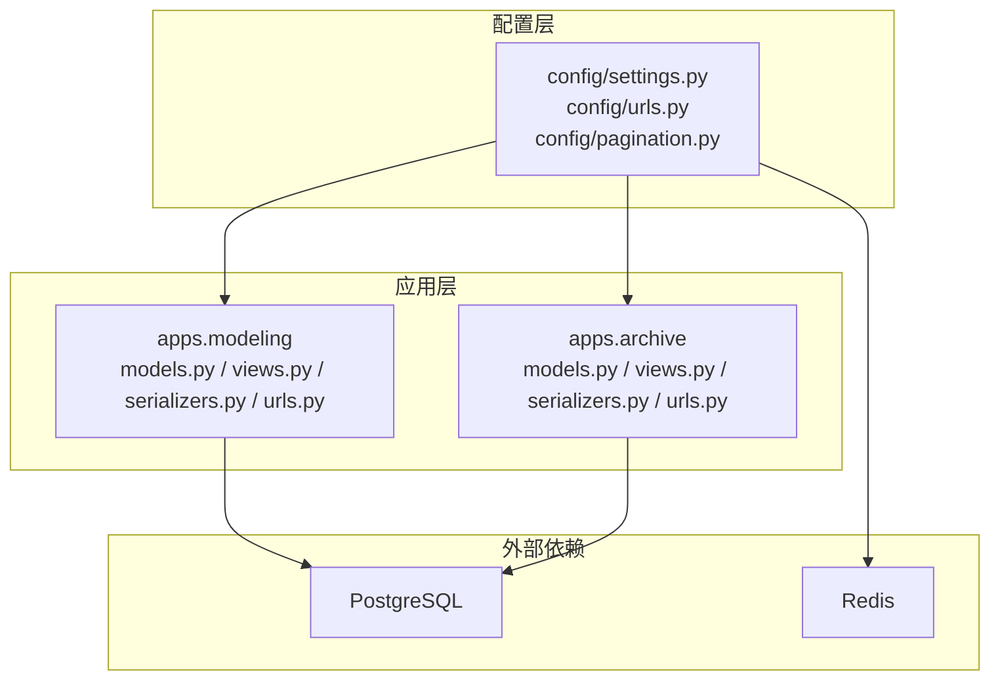
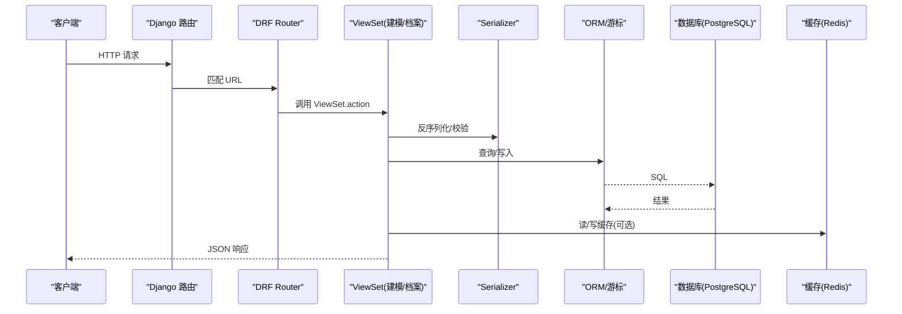
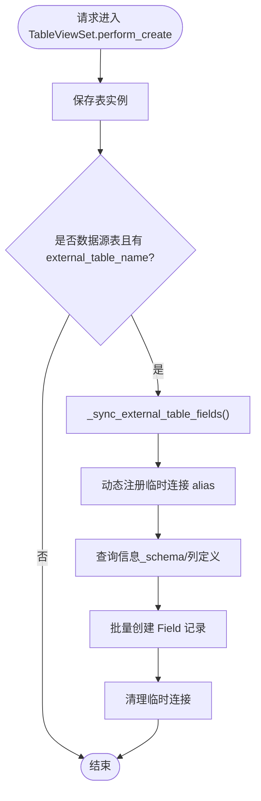
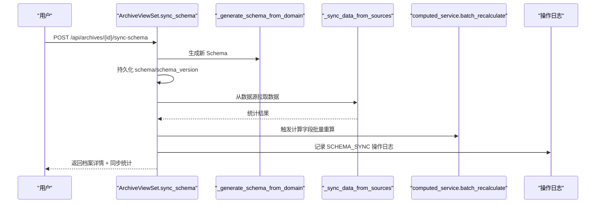
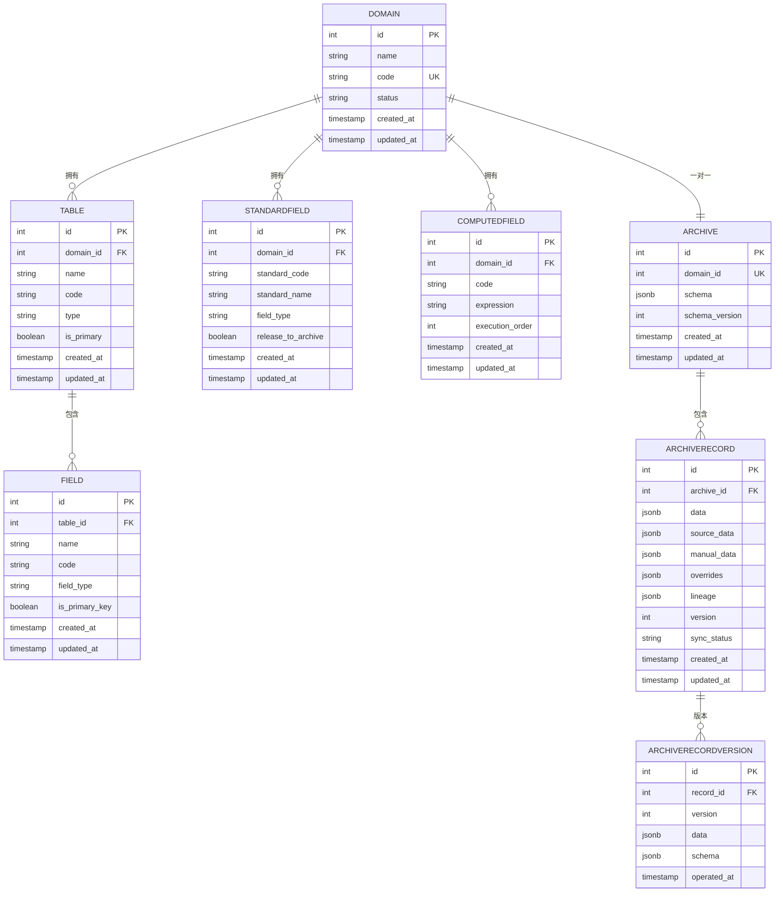
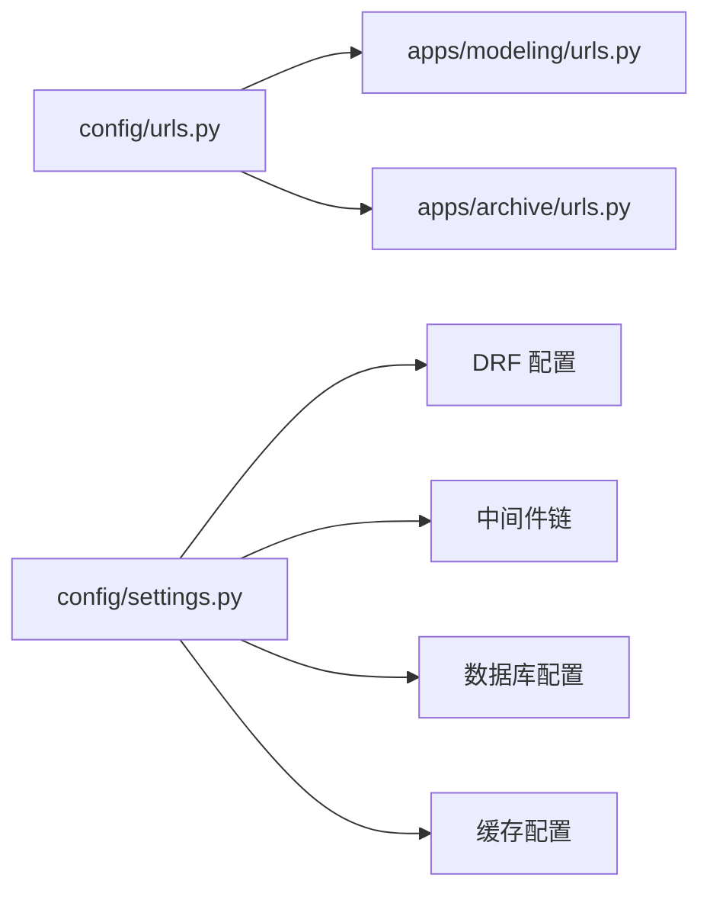

# 后端架构

<cite>
**本文引用的文件**   
- [settings.py](file://backend/config/settings.py)
- [urls.py](file://backend/config/urls.py)
- [pagination.py](file://backend/config/pagination.py)
- [local_settings.py](file://backend/local_settings.py)
- [models.py（建模）](file://backend/apps/modeling/models.py)
- [views.py（建模）](file://backend/apps/modeling/views.py)
- [serializers.py（建模）](file://backend/apps/modeling/serializers.py)
- [urls.py（建模）](file://backend/apps/modeling/urls.py)
- [models.py（档案）](file://backend/apps/archive/models.py)
- [views.py（档案）](file://backend/apps/archive/views.py)
- [serializers.py（档案）](file://backend/apps/archive/serializers.py)
- [urls.py（档案）](file://backend/apps/archive/urls.py)
</cite>

## 目录
1. [简介](#简介)
2. [项目结构](#项目结构)
3. [核心组件](#核心组件)
4. [架构总览](#架构总览)
5. [详细组件分析](#详细组件分析)
6. [依赖关系分析](#依赖关系分析)
7. [性能考虑](#性能考虑)
8. [故障排查指南](#故障排查指南)
9. [结论](#结论)
10. [附录](#附录)

## 简介
本文件为 MetaData002 后端架构文档，聚焦 Django 分层架构、RESTful API 设计（DRF）、数据访问与 ORM 模式、缓存与 Redis 集成、中间件与安全、错误处理与日志监控，以及 API 最佳实践与性能优化建议。系统包含两个核心应用：
- apps.modeling：主数据建模（域、表、字段、标准字段、计算字段、AI 配置等）
- apps.archive：主数据档案（记录、版本、同步、变更批次、一致性检查、对外数据服务 API）

## 项目结构
后端采用 Django 工程 + 多应用组织方式：
- config：全局配置（Django 设置、路由、分页、WSGI）
- apps.modeling：建模领域模型与接口
- apps.archive：档案领域模型与接口
- scripts：运维脚本
- Docker 相关：容器化部署

**图表来源** 
- [settings.py:1-123](file://backend/config/settings.py#L1-L123)
- [urls.py:1-9](file://backend/config/urls.py#L1-L9)
- [pagination.py:1-14](file://backend/config/pagination.py#L1-L14)
- [models.py（建模）:1-489](file://backend/apps/modeling/models.py#L1-L489)
- [models.py（档案）:1-379](file://backend/apps/archive/models.py#L1-L379)

**章节来源**
- [settings.py:1-123](file://backend/config/settings.py#L1-L123)
- [urls.py:1-9](file://backend/config/urls.py#L1-L9)

## 核心组件
- 应用层（apps.modeling, apps.archive）
  - 提供 RESTful 资源视图集（ViewSet），统一使用 DRF 的 ModelViewSet 能力
  - 通过序列化器（Serializer）完成输入校验、输出格式化
  - 业务逻辑集中在 View 层与独立 Service（如 computed_service、ai_service）
- 业务逻辑层
  - 建模侧：域/表/字段/标准字段/计算字段的 CRUD、AI 辅助分组与语义识别、跨库连接测试与元数据拉取
  - 档案侧：Schema 生成与同步、双层数据合并（source_data + manual_data）、版本快照、变更批次与明细、一致性检查
- 数据访问层
  - Django ORM 为主，结合原生 SQL 游标进行跨库元数据读取与预览
  - 动态数据库连接（按数据源配置临时注册 alias）
  - 索引与约束保障查询性能与数据完整性

**章节来源**
- [views.py（建模）:1-800](file://backend/apps/modeling/views.py#L1-L800)
- [views.py（档案）:1-800](file://backend/apps/archive/views.py#L1-L800)
- [models.py（建模）:1-489](file://backend/apps/modeling/models.py#L1-L489)
- [models.py（档案）:1-379](file://backend/apps/archive/models.py#L1-L379)

## 架构总览
整体采用“配置中心 + 应用模块”的分层架构，请求经 Django 路由分发到各应用的 Router，再由 DRF ViewSet 调度序列化器与业务逻辑，最终通过 ORM 或原生游标访问数据库。缓存通过 Redis 提供。

**图表来源** 
- [urls.py:1-9](file://backend/config/urls.py#L1-L9)
- [urls.py（建模）:1-20](file://backend/apps/modeling/urls.py#L1-L20)
- [urls.py（档案）:1-21](file://backend/apps/archive/urls.py#L1-L21)
- [settings.py:91-107](file://backend/config/settings.py#L91-L107)

## 详细组件分析

### 建模应用（apps.modeling）
- 模型与职责
  - DataSource：多类型数据库连接配置（PostgreSQL/MySQL/SQL Server/Oracle）
  - Domain/Table/Field/FieldGroup/FieldOption：域-表-字段层级建模
  - StandardField：概念层标准字段，聚合跨表同义字段，支持属性同步与主字段自动分配
  - ComputedField：Excel 风格公式计算字段，支持 DAG 执行顺序
  - FieldMapping：表间字段映射关系
  - AIConfig：AI 服务配置（OpenAI 兼容）
- 视图与 API
  - DataSourceViewSet：连接测试、schema/external-tables 列表、数据预览（本地/外部）
  - DomainViewSet：域配置完整性检查、主键状态检查
  - TableViewSet：创建时自动同步外部表字段、数据预览、状态切换保护
  - 其他：字段、分组、选项、映射、标准字段、AI 配置、计算字段的 CRUD
- 关键流程（示例：创建数据源表并同步字段）

**图表来源** 
- [views.py（建模）:522-659](file://backend/apps/modeling/views.py#L522-L659)

**章节来源**
- [models.py（建模）:1-489](file://backend/apps/modeling/models.py#L1-L489)
- [views.py（建模）:1-800](file://backend/apps/modeling/views.py#L1-L800)
- [serializers.py（建模）:1-310](file://backend/apps/modeling/serializers.py#L1-L310)
- [urls.py（建模）:1-20](file://backend/apps/modeling/urls.py#L1-L20)

### 档案应用（apps.archive）
- 模型与职责
  - Archive：档案配置（与 Domain 一对一），存储 Schema 快照
  - ArchiveRecord：档案记录，双层存储 source_data（源底层）+ manual_data（人工覆盖），合并物化为 data；维护 lineage、overrides、version、sync_status
  - ArchiveRecordVersion：版本快照（含 schema 快照）
  - ArchiveSyncLog/ArchiveOperationLog：同步与操作日志
  - ArchiveApi：对外数据服务 API（暴露字段、筛选条件、角色授权）
  - ArchiveChangeBatch/ArchiveChangeDetail：变更批次与明细（支持回滚版本映射）
  - ConsistencyIssue/ConsistencyCheckRule/ConsistencyIssueHistory：一致性差异与规则失效、历史轨迹
- 视图与 API
  - ArchiveViewSet：创建时生成 Schema；同步模型变更并拉取数据；刷新数据；预检变化；一致性检查（四种类型）
  - ArchiveRecordViewSet：CRUD，更新时拦截 source 维护字段，双层写入，实时重算受影响计算字段，版本与日志落盘
  - 其他：同步日志、操作日志、版本管理、数据服务 API、变更批次与明细、一致性问题与规则
- 关键流程（示例：Schema 同步与数据拉取）

**图表来源** 
- [views.py（档案）:275-329](file://backend/apps/archive/views.py#L275-L329)

**章节来源**
- [models.py（档案）:1-379](file://backend/apps/archive/models.py#L1-L379)
- [views.py（档案）:1-800](file://backend/apps/archive/views.py#L1-L800)
- [serializers.py（档案）:1-552](file://backend/apps/archive/serializers.py#L1-L552)
- [urls.py（档案）:1-21](file://backend/apps/archive/urls.py#L1-L21)

### 数据模型关系图（建模 + 档案）

**图表来源** 
- [models.py（建模）:1-489](file://backend/apps/modeling/models.py#L1-L489)
- [models.py（档案）:1-379](file://backend/apps/archive/models.py#L1-L379)

## 依赖关系分析
- 路由与控制器
  - 根路由将 /api 分发给 modeling 与 archive 子路由
  - 各应用使用 DRF DefaultRouter 注册资源
- 配置与中间件
  - settings 中启用 DRF、django_filters、drf_spectacular
  - 中间件链包含 Session、CSRF、Auth、XFrameOptions 等
- 数据库与缓存
  - 默认 PostgreSQL，开发环境可切换 SQLite3
  - 缓存默认 Redis（本地开发可用 LocMemCache）

**图表来源** 
- [urls.py:1-9](file://backend/config/urls.py#L1-L9)
- [urls.py（建模）:1-20](file://backend/apps/modeling/urls.py#L1-L20)
- [urls.py（档案）:1-21](file://backend/apps/archive/urls.py#L1-L21)
- [settings.py:26-34](file://backend/config/settings.py#L26-L34)
- [settings.py:56-74](file://backend/config/settings.py#L56-L74)

**章节来源**
- [urls.py:1-9](file://backend/config/urls.py#L1-L9)
- [urls.py（建模）:1-20](file://backend/apps/modeling/urls.py#L1-L20)
- [urls.py（档案）:1-21](file://backend/apps/archive/urls.py#L1-L21)
- [settings.py:26-34](file://backend/config/settings.py#L26-L34)
- [settings.py:56-74](file://backend/config/settings.py#L56-L74)

## 性能考虑
- 分页策略
  - 自定义 StandardPagination，默认 page_size=20，允许前端覆盖 page_size，上限 max_page_size=100000
- 过滤与排序
  - 启用 django_filters、SearchFilter、OrderingFilter
- 查询优化
  - 使用 select_related/prefetch_related 减少 N+1
  - 对高频查询字段建立索引（如 archive/status、archive/-created_at 等）
  - 大对象 JSON 字段按需只取必要字段（only/defer）
- 缓存策略
  - 默认 Redis 缓存，开发环境可回退到内存缓存
  - 去重值缓存（distinct_cache）用于字段枚举样本展示
- 连接池与连接复用
  - 动态连接 alias 在请求内使用，避免频繁创建销毁
  - 生产建议开启连接池与健康检查

**章节来源**
- [pagination.py:1-14](file://backend/config/pagination.py#L1-L14)
- [settings.py:91-107](file://backend/config/settings.py#L91-L107)
- [settings.py:68-74](file://backend/config/settings.py#L68-L74)
- [models.py（档案）:63-70](file://backend/apps/archive/models.py#L63-L70)
- [models.py（档案）:162-168](file://backend/apps/archive/models.py#L162-L168)
- [models.py（档案）:194-200](file://backend/apps/archive/models.py#L194-L200)
- [models.py（档案）:223-229](file://backend/apps/archive/models.py#L223-L229)
- [models.py（档案）:262-268](file://backend/apps/archive/models.py#L262-L268)
- [models.py（档案）:320-331](file://backend/apps/archive/models.py#L320-L331)

## 故障排查指南
- 常见错误与处理
  - 数据源连接失败：DataSourceViewSet.test_connection/test_connection_params 返回结构化错误
  - 外部表字段同步失败：TableViewSet._sync_external_table_fields 捕获异常并记录警告
  - 计算字段重算失败：不阻塞主流程，仅记录警告
  - 一致性检查异常：逐表 try/except 收集 errors，不影响整体统计
- 日志与审计
  - 操作日志：ArchiveOperationLog 记录创建/更新/删除/同步/Schema 同步等
  - 同步日志：ArchiveSyncLog 记录每次同步的状态与详情
  - 变更批次与明细：ArchiveChangeBatch/Detail 记录变更来源、统计与字段级差异
- 调试建议
  - 使用 drf_spectacular 自动生成 OpenAPI 文档
  - 开发环境启用 CORS（local_settings）
  - 通过 refresh-preview 预检 Schema 与数据变化，降低误操作风险

**章节来源**
- [views.py（建模）:74-146](file://backend/apps/modeling/views.py#L74-L146)
- [views.py（建模）:522-535](file://backend/apps/modeling/views.py#L522-L535)
- [views.py（档案）:295-312](file://backend/apps/archive/views.py#L295-L312)
- [serializers.py（档案）:174-182](file://backend/apps/archive/serializers.py#L174-L182)
- [serializers.py（档案）:313-377](file://backend/apps/archive/serializers.py#L313-L377)
- [settings.py:103-107](file://backend/config/settings.py#L103-L107)
- [local_settings.py:17-26](file://backend/local_settings.py#L17-L26)

## 结论
MetaData002 后端以 Django + DRF 为核心，采用清晰的分层架构与模块化应用组织。建模与档案两大领域职责明确，数据访问兼顾 ORM 与原生游标，满足复杂元数据管理与多源数据整合需求。通过标准化分页、过滤、排序与缓存机制，保障了 API 的可扩展性与性能。完善的日志、版本与一致性检查体系，为数据治理提供了坚实基础。

## 附录

### RESTful API 设计规范
- 路由组织
  - 根路径 /api 下按应用划分：/api/data-sources、/api/domains、/api/tables、/api/fields、/api/field-groups、/api/field-options、/api/field-mappings、/api/standard-fields、/api/ai-config、/api/computed-fields
  - 档案侧：/api/archives、/api/records、/api/sync-logs、/api/operation-logs、/api/record-versions、/api/archive-apis、/api/change-batches、/api/change-details、/api/consistency-issues、/api/consistency-rules
- 分页
  - 默认每页 20 条，支持 ?page_size=N 覆盖，上限 100000
- 过滤与搜索
  - 使用 django_filters 的 filterset_fields 与 SearchFilter/OrderingFilter
- 认证与安全
  - 启用 CSRF、Session、AuthenticationMiddleware、XFrameOptions
  - 敏感字段（如密码、API Key）write_only 不回显
- 文档
  - drf_spectacular 自动生成 OpenAPI 文档

**章节来源**
- [urls.py（建模）:1-20](file://backend/apps/modeling/urls.py#L1-L20)
- [urls.py（档案）:1-21](file://backend/apps/archive/urls.py#L1-L21)
- [pagination.py:1-14](file://backend/config/pagination.py#L1-L14)
- [settings.py:91-107](file://backend/config/settings.py#L91-L107)
- [settings.py:26-34](file://backend/config/settings.py#L26-L34)
- [serializers.py（建模）:5-12](file://backend/apps/modeling/serializers.py#L5-L12)
- [serializers.py（建模）:248-278](file://backend/apps/modeling/serializers.py#L248-L278)

### 数据库连接管理与 ORM 使用模式
- 动态连接
  - 根据 DataSource 配置动态注册临时 alias，确保连接隔离与快速释放
- 跨库元数据读取
  - 针对不同数据库类型构建专用 SQL，获取 schema、表、列信息
- 查询优化
  - 合理使用 select_related/prefetch_related
  - 针对高频查询建立索引（如 archive/status、archive/-created_at 等）
- 事务与原子性
  - ATOMIC_REQUESTS=False，业务层控制事务边界

**章节来源**
- [views.py（建模）:40-72](file://backend/apps/modeling/views.py#L40-L72)
- [views.py（建模）:94-146](file://backend/apps/modeling/views.py#L94-L146)
- [views.py（建模）:536-659](file://backend/apps/modeling/views.py#L536-L659)
- [models.py（档案）:63-70](file://backend/apps/archive/models.py#L63-L70)
- [models.py（档案）:162-168](file://backend/apps/archive/models.py#L162-L168)
- [models.py（档案）:194-200](file://backend/apps/archive/models.py#L194-L200)
- [models.py（档案）:223-229](file://backend/apps/archive/models.py#L223-L229)
- [models.py（档案）:262-268](file://backend/apps/archive/models.py#L262-L268)
- [models.py（档案）:320-331](file://backend/apps/archive/models.py#L320-L331)

### 缓存策略、Redis 集成与会话管理
- 缓存后端
  - 生产：Redis（django_redis）
  - 开发：LocMemCache
- 会话管理
  - 启用 SessionMiddleware，配合 CSRF 防护
- 典型用法
  - 去重值缓存（distinct_cache）
  - 通用 key-value 缓存（按业务需要扩展）

**章节来源**
- [settings.py:68-74](file://backend/config/settings.py#L68-L74)
- [settings.py:26-34](file://backend/config/settings.py#L26-L34)
- [local_settings.py:11-15](file://backend/local_settings.py#L11-L15)

### 错误处理机制、日志记录与监控方案
- 错误处理
  - 视图层 try/except 捕获异常，返回结构化错误响应
  - 序列化器校验失败抛出 ValidationError
- 日志记录
  - Python logging 记录警告与错误
  - 操作日志与同步日志持久化
- 监控建议
  - 基于 drf_spectacular 的 API 文档与自动化测试
  - 结合外部 APM/日志平台采集指标与链路追踪

**章节来源**
- [views.py（建模）:140-146](file://backend/apps/modeling/views.py#L140-L146)
- [views.py（建模）:528-535](file://backend/apps/modeling/views.py#L528-L535)
- [views.py（档案）:295-312](file://backend/apps/archive/views.py#L295-L312)
- [serializers.py（档案）:174-182](file://backend/apps/archive/serializers.py#L174-L182)
- [settings.py:103-107](file://backend/config/settings.py#L103-L107)

### API 设计最佳实践与性能优化建议
- 最佳实践
  - 使用 ModelViewSet 提供标准 CRUD，action 方法表达额外业务
  - 严格区分 read-only 与 write-only 字段，保护敏感信息
  - 使用 filterset_fields 与 SearchFilter/OrderingFilter 提供统一过滤与排序
  - 分页参数受控，防止极端值拖垮服务
- 性能优化
  - 合理拆分大对象 JSON 字段，按需加载
  - 使用 only/defer 限制字段加载
  - 批量写入 bulk_create/bulk_update
  - 计算字段重算按 DAG 顺序执行，避免重复计算

**章节来源**
- [settings.py:91-107](file://backend/config/settings.py#L91-L107)
- [pagination.py:1-14](file://backend/config/pagination.py#L1-L14)
- [views.py（建模）:504-521](file://backend/apps/modeling/views.py#L504-L521)
- [views.py（档案）:562-595](file://backend/apps/archive/views.py#L562-L595)
- [serializers.py（建模）:130-164](file://backend/apps/modeling/serializers.py#L130-L164)
- [serializers.py（档案）:185-377](file://backend/apps/archive/serializers.py#L185-L377)