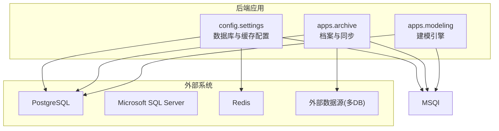
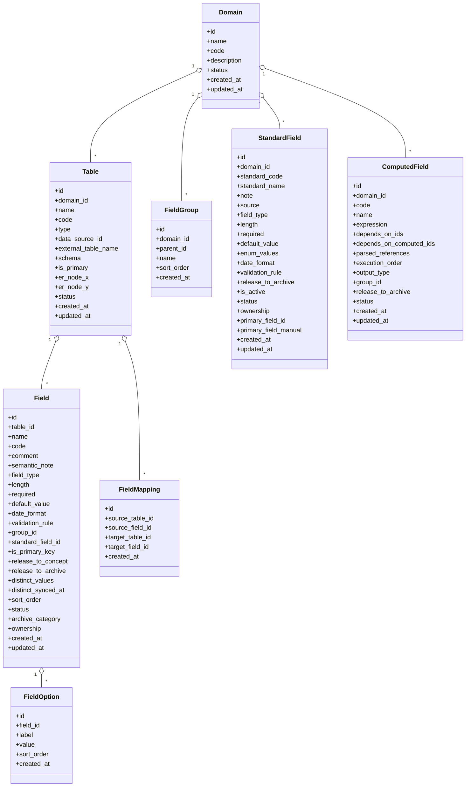
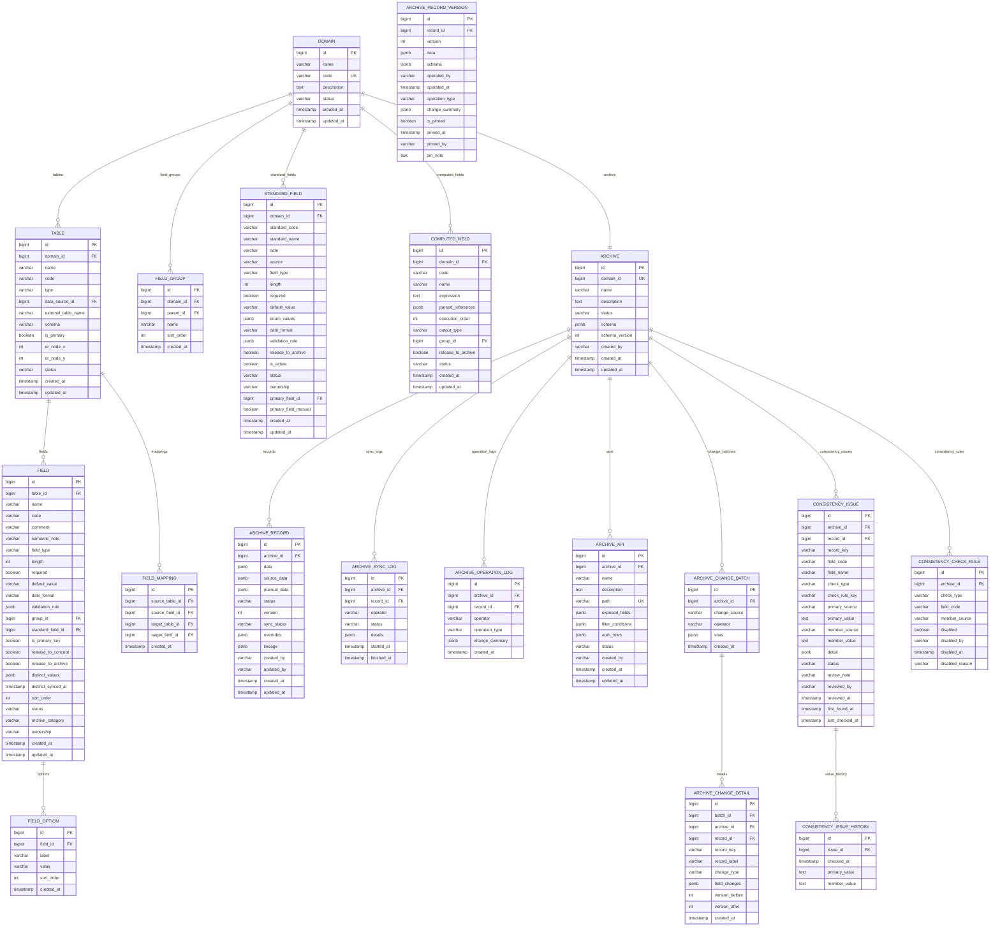
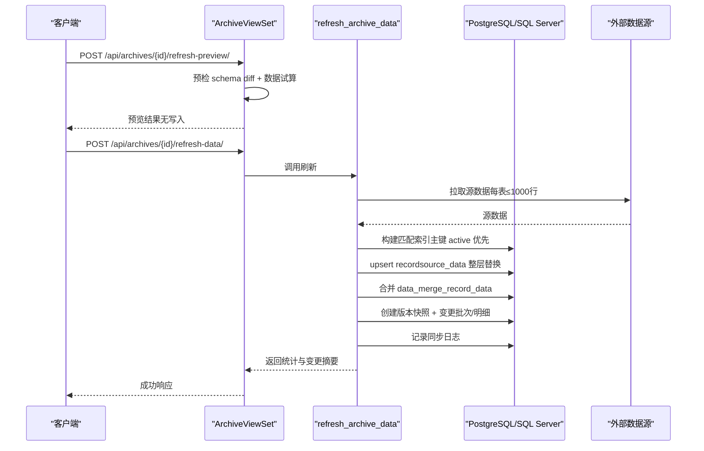
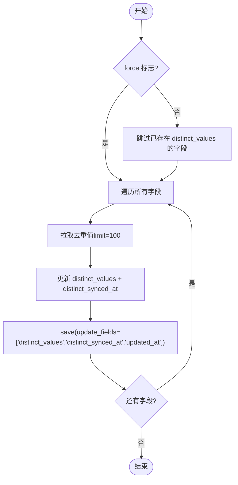
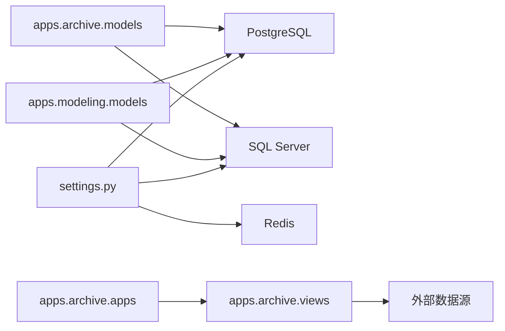

# 数据库设计

<cite>
**本文引用的文件**   
- [settings.py](file://backend/config/settings.py)
- [models.py（建模）](file://backend/apps/modeling/models.py)
- [models.py（档案）](file://backend/apps/archive/models.py)
- [0001_initial.py（建模）](file://backend/apps/modeling/migrations/0001_initial.py)
- [0001_initial.py（档案）](file://backend/apps/archive/migrations/0001_initial.py)
- [0026_standardfield_primary_field_and_more.py（建模迁移）](file://backend/apps/modeling/migrations/0026_standardfield_primary_field_and_more.py)
- [0013_consistencycheckrule_and_more.py（档案迁移）](file://backend/apps/archive/migrations/0013_consistencycheckrule_and_more.py)
- [distinct_cache.py](file://backend/apps/modeling/distinct_cache.py)
- [apps.py（档案定时刷新）](file://backend/apps/archive/apps.py)
- [views.py（档案视图，含动态数据源连接与拉数）](file://backend/apps/archive/views.py)
- [local_settings.py](file://backend/local_settings.py)
- [requirements.txt](file://backend/requirements.txt)
- [Dockerfile](file://backend/Dockerfile)
- [constitution.md](file://.ai/constitution.md)
</cite>

## 更新摘要
**所做更改**   
- 新增 Microsoft SQL Server 数据库后端支持章节
- 更新多数据库架构总览图
- 扩展数据源驱动支持说明
- 添加 SQL Server 特定配置和部署指南
- 更新性能考虑和故障排查指南

## 目录
1. [引言](#引言)
2. [项目结构](#项目结构)
3. [核心组件](#核心组件)
4. [架构总览](#架构总览)
5. [详细组件分析](#详细组件分析)
6. [多数据库支持](#多数据库支持)
7. [依赖关系分析](#依赖关系分析)
8. [性能考虑](#性能考虑)
9. [故障排查指南](#故障排查指南)
10. [结论](#结论)
11. [附录](#附录)

## 引言
本文件面向 MetaData002 后端的 PostgreSQL 数据库设计与运维，覆盖表结构设计、字段定义与类型选择、实体关系图（ERD）、主外键约束与索引策略；并阐述 ORM 使用模式、查询优化技巧、事务管理、数据迁移策略、备份恢复方案、性能监控、连接池配置、缓存策略与 Redis 集成。**重要更新**：项目现已支持 Microsoft SQL Server 作为数据库后端，适用于企业环境中使用 Microsoft 数据库基础设施的部署场景。文档基于代码仓库中的模型定义、迁移脚本与配置进行严格推导，确保与实际实现一致。

## 项目结构
后端采用 Django + DRF，默认使用 PostgreSQL 作为主数据库，同时支持 Microsoft SQL Server 作为替代数据库后端，Redis 作为缓存后端。两个核心应用：
- modeling：主数据建模（域、表、字段、标准字段、计算字段、映射等）
- archive：档案管理与同步（记录、版本、变更批次与明细、一致性检查等）



**图表来源**
- [settings.py:56-74](file://backend/config/settings.py#L56-L74)

**章节来源**
- [settings.py:1-134](file://backend/config/settings.py#L1-L134)

## 核心组件
- 建模层（modeling）
  - Domain：主数据域
  - Table：域下的实体表（本地或外部数据源）
  - FieldGroup：字段分组（支持多层嵌套）
  - StandardField：概念层标准字段（跨物理字段去重与属性统一）
  - Field：物理字段定义（归属表，可挂靠到 StandardField）
  - FieldOption：枚举选项
  - ComputedField：计算字段（Excel风格公式，依赖解析与执行顺序）
  - FieldMapping：表间字段映射
- 档案层（archive）
  - Archive：档案配置（与 Domain 一对一）
  - ArchiveRecord：档案记录（双层存储：source_data + manual_data，data 为合并物化结果）
  - ArchiveRecordVersion：版本快照
  - ArchiveSyncLog：同步日志
  - ArchiveOperationLog：操作日志
  - ArchiveApi：数据服务API配置
  - ArchiveChangeBatch / ArchiveChangeDetail：变更批次与明细
  - ConsistencyIssue / ConsistencyCheckRule / ConsistencyIssueHistory：一致性差异与规则、历史

**章节来源**
- [models.py（建模）:1-625](file://backend/apps/modeling/models.py#L1-L625)
- [models.py（档案）:1-379](file://backend/apps/archive/models.py#L1-L379)

## 架构总览
系统以"建模→档案"的单向数据流为核心：建模层定义域、表、字段及标准字段；档案层基于建模生成 Schema 快照，并从外部数据源拉取数据，合并为黄金记录，对外通过 ArchiveApi 暴露。**新增功能**：支持 PostgreSQL 和 Microsoft SQL Server 两种数据库后端，满足不同企业环境的部署需求。



**图表来源**
- [models.py（建模）:1-625](file://backend/apps/modeling/models.py#L1-L625)

**章节来源**
- [models.py（建模）:1-625](file://backend/apps/modeling/models.py#L1-L625)

## 详细组件分析

### 建模层（modeling）数据库设计
- 主数据域 Domain
  - 唯一编码 code，状态 active/deprecated
  - 时间戳 created_at/updated_at
- 实体表 Table
  - 归属 Domain，区分 local/source
  - 外部数据源关联 data_source_id（SET NULL），外部表名 external_table_name、schema
  - is_primary 标记主表（每个域仅一个主表）
  - ER 节点坐标 er_node_x/er_node_y
- 字段分组 FieldGroup
  - 自引用 parent，最多三层深度
- 标准字段 StandardField
  - 跨物理字段归一化标识 standard_code
  - 属性集中管理（类型、长度、必填、默认值、枚举、日期格式、校验规则）
  - ownership 维护方（source/archive）
  - primary_field 主字段（SET_NULL），primary_field_manual 人工指定
- 物理字段 Field
  - 归属 Table，code 唯一于表内
  - 可挂靠 StandardField，支持 distinct_values 去重样本缓存
  - release_to_archive 控制是否进入档案
  - ownership/source/archive 决定档案侧编辑权限与同步行为
- 枚举选项 FieldOption
  - 归属 Field，value 唯一于 field
- 计算字段 ComputedField
  - 表达式 expression，依赖 depends_on（物理字段）与 depends_on_computed（计算字段）
  - execution_order 拓扑排序位次
- 字段映射 FieldMapping
  - 表间字段映射，四元组唯一

索引与约束
- unique_together：Domain.code、Table(domain, code)、Field(table, code)、FieldOption(field, value)、ComputedField(domain, code)、FieldMapping(source_table, source_field, target_table, target_field)
- 外键：Table→Domain、Field→Table、Field→FieldGroup、Field→StandardField、ComputedField→Domain、FieldMapping→Table/Field

**章节来源**
- [models.py（建模）:1-625](file://backend/apps/modeling/models.py#L1-L625)
- [0001_initial.py（建模）:1-127](file://backend/apps/modeling/migrations/0001_initial.py#L1-L127)
- [0026_standardfield_primary_field_and_more.py:1-40](file://backend/apps/modeling/migrations/0026_standardfield_primary_field_and_more.py#L1-L40)

### 档案层（archive）数据库设计
- 档案配置 Archive
  - 与 Domain 一对一 OneToOneField
  - schema JSON 快照，schema_version 版本号
- 档案记录 ArchiveRecord
  - 双层存储：source_data（源同步底层，整层替换）、manual_data（人工覆盖层，仅 ownership=archive 字段允许有键）
  - data 为合并物化结果（写时合并）
  - status、version、sync_status、overrides（修正保护）、lineage（字段血缘）
  - 索引：(archive, status)
- 版本快照 ArchiveRecordVersion
  - 唯一 (record, version)，记录每次操作的快照与 schema
- 同步日志 ArchiveSyncLog
  - 记录同步过程详情 details JSON
- 操作日志 ArchiveOperationLog
  - 索引：(archive, -created_at)
- 数据服务 API ArchiveApi
  - exposed_fields、filter_conditions、auth_roles JSON
  - 索引：(archive, status)
- 变更批次与明细
  - ArchiveChangeBatch：change_source（sync/manual/consistency）、operator、stats JSON
  - ArchiveChangeDetail：change_type（created/updated/deactivated/reactivated/reviewed/ignored/rollback）、field_changes JSON、record_key、record_label、version_before/version_after
  - 索引：(archive, -created_at)
- 一致性检查
  - ConsistencyIssue：check_type、check_rule_key、primary/member 值、detail JSON、status、审核信息
  - 唯一约束：(archive, record_key, field_code, member_source, check_type)
  - 索引：(archive, status)、(archive, check_type)
  - ConsistencyCheckRule：按 check_type+field_code+member_source 唯一
  - ConsistencyIssueHistory：append 历史快照

**章节来源**
- [models.py（档案）:1-379](file://backend/apps/archive/models.py#L1-L379)
- [0001_initial.py（档案）:1-127](file://backend/apps/archive/migrations/0001_initial.py#L1-L127)
- [0013_consistencycheckrule_and_more.py:1-79](file://backend/apps/archive/migrations/0013_consistencycheckrule_and_more.py#L1-L79)

### ERD（实体关系图）


**图表来源**
- [models.py（建模）:1-625](file://backend/apps/modeling/models.py#L1-L625)
- [models.py（档案）:1-379](file://backend/apps/archive/models.py#L1-L379)

### ORM 使用模式与数据流
- 建模层
  - StandardField.save() 在保存时自动将属性同步到成员 Field（_sync_attrs_to_members），包括枚举值同步到 FieldOption
  - Table.set_as_primary() 切换主表时，自动调整 StandardField.primary_field（若未人工指定）
  - StandardField.auto_assign_primary_field() 根据主表成员校准主字段
- 档案层
  - ArchiveRecord 双层存储：source_data（刷新整层替换）、manual_data（人工覆盖，仅 ownership=archive）
  - _merge_record_data 纯函数合并 data（source 直通、archive 优先 manual，computed 保留现值）
  - refresh-archive-data 流程：拉取源数据→构建匹配索引→upsert→合并→版本快照→变更批次与明细→同步日志

**章节来源**
- [models.py（建模）:1-625](file://backend/apps/modeling/models.py#L1-L625)
- [models.py（档案）:1-379](file://backend/apps/archive/models.py#L1-L379)
- [views.py（档案视图）:811-840](file://backend/apps/archive/views.py#L811-L840)

### 关键处理流程（序列图）


**图表来源**
- [views.py（档案视图）:1291-1319](file://backend/apps/archive/views.py#L1291-L1319)
- [models.py（档案）:1-379](file://backend/apps/archive/models.py#L1-L379)

### 复杂逻辑流程图（去重缓存填充）


**图表来源**
- [distinct_cache.py:100-121](file://backend/apps/modeling/distinct_cache.py#L100-L121)

## 多数据库支持

### 支持的数据库类型
项目现已支持多种数据库后端，满足不同企业环境的部署需求：

| 数据库类型 | db_type 值 | Django 引擎 | 默认端口 | Python 驱动包 | 部署说明 |
|------------|-----------|------------|---------|-------------|----------|
| PostgreSQL | `postgresql` | `django.db.backends.postgresql` | 5432 | psycopg2-binary | 默认数据库，生产环境推荐 |
| MySQL | `mysql` | `django.db.backends.mysql` | 3306 | mysqlclient | 开发环境可选 |
| SQL Server | `sqlserver` | `mssql` | 1433 | mssql-django + pyodbc | 企业环境支持，需ODBC驱动 |
| Oracle | `oracle` | `django.db.backends.oracle` | 1521 | oracledb | 大型企业环境 |

### Microsoft SQL Server 支持详解

#### 依赖安装
项目已通过 requirements.txt 添加 SQL Server 支持：
```txt
mssql-django>=1.7,<2.0
```

#### Docker 部署配置
Dockerfile 已包含完整的 SQL Server 驱动安装：
```dockerfile
# Microsoft ODBC Driver 18（SQL Server 数据源连接；代码硬编码 'ODBC Driver 18 for SQL Server'）
RUN curl -fsSL https://packages.microsoft.com/keys/microsoft.asc | gpg --dearmor -o /usr/share/keyrings/microsoft-prod.gpg && \
    curl -fsSL https://packages.microsoft.com/config/debian/12/prod.list > /etc/apt/sources.list.d/mssql-release.list && \
    apt-get update && \
    ACCEPT_EULA=Y apt-get install -y --no-install-recommends \
        msodbcsql18 \
        unixodbc-dev && \
    rm -rf /var/lib/apt/lists/*
```

#### 动态连接配置
系统在访问外部 SQL Server 数据源时会自动配置连接参数：
```python
elif ds.db_type == 'sqlserver':
    db_config['OPTIONS'] = {
        'driver': 'ODBC Driver 18 for SQL Server',
        'extra_params': 'Encrypt=no',
    }
```

#### SQL Server 特定查询优化
针对 SQL Server 的查询语法进行了专门优化：
- 使用 `TOP` 关键字限制返回行数
- 使用方括号 `[schema].[table]` 语法引用对象
- 支持 `dbo` 默认 schema

**章节来源**
- [requirements.txt:12](file://backend/requirements.txt#L12)
- [Dockerfile:17-24](file://backend/Dockerfile#L17-L24)
- [distinct_cache.py:68-82](file://backend/apps/modeling/distinct_cache.py#L68-L82)
- [views.py:66-70](file://backend/apps/modeling/views.py#L66-L70)

### ORM 使用模式与数据流
- 建模层
  - StandardField.save() 在保存时自动将属性同步到成员 Field（_sync_attrs_to_members），包括枚举值同步到 FieldOption
  - Table.set_as_primary() 切换主表时，自动调整 StandardField.primary_field（若未人工指定）
  - StandardField.auto_assign_primary_field() 根据主表成员校准主字段
- 档案层
  - ArchiveRecord 双层存储：source_data（刷新整层替换）、manual_data（人工覆盖，仅 ownership=archive）
  - _merge_record_data 纯函数合并 data（source 直通、archive 优先 manual，computed 保留现值）
  - refresh-archive-data 流程：拉取源数据→构建匹配索引→upsert→合并→版本快照→变更批次与明细→同步日志

**章节来源**
- [models.py（建模）:1-625](file://backend/apps/modeling/models.py#L1-L625)
- [models.py（档案）:1-379](file://backend/apps/archive/models.py#L1-L379)
- [views.py（档案视图）:811-840](file://backend/apps/archive/views.py#L811-L840)

### 关键处理流程（序列图）


**图表来源**
- [views.py（档案视图）:1291-1319](file://backend/apps/archive/views.py#L1291-L1319)
- [models.py（档案）:1-379](file://backend/apps/archive/models.py#L1-L379)

### 复杂逻辑流程图（去重缓存填充）


**图表来源**
- [distinct_cache.py:100-121](file://backend/apps/modeling/distinct_cache.py#L100-L121)

## 依赖关系分析
- 模块依赖
  - archive 依赖 modeling（标准字段模型、域、表、字段）
  - 配置 settings 提供数据库与缓存配置
- 运行时依赖
  - 档案刷新线程由 apps.py 启动，周期性调用 refresh_archive_data
  - 动态数据源连接：根据 Table.data_source 动态构造 connections.databases[alias]



**图表来源**
- [settings.py:56-74](file://backend/config/settings.py#L56-L74)
- [apps.py（档案定时刷新）:1-38](file://backend/apps/archive/apps.py#L1-L38)
- [views.py（档案视图）:1291-1319](file://backend/apps/archive/views.py#L1291-L1319)

**章节来源**
- [settings.py:56-74](file://backend/config/settings.py#L56-L74)
- [apps.py（档案定时刷新）:1-38](file://backend/apps/archive/apps.py#L1-L38)
- [views.py（档案视图）:1291-1319](file://backend/apps/archive/views.py#L1291-L1319)

## 性能考虑
- 索引策略
  - ArchiveRecord：(archive, status)
  - ArchiveOperationLog：(archive, -created_at)
  - ArchiveApi：(archive, status)
  - ConsistencyIssue：(archive, status)、(archive, check_type)
  - ArchiveChangeBatch/Detail：(archive, -created_at)
- 查询优化
  - 使用 select_related/prefetch_related 减少 N+1（如版本列表 select_related('record','record__archive')）
  - 分页与过滤：DRF 内置 SearchFilter/OrderingFilter，自定义 StandardPagination
  - 去重缓存：Field.distinct_values 按需填充，避免重复拉取
  - SQL Server 优化：使用 TOP 关键字限制结果集，避免全表扫描
- 事务管理
  - ATOMIC_REQUESTS=False，业务层自行控制事务边界（如批量 upsert、版本快照、变更日志）
- 连接池与超时
  - 默认 ConnMaxAge=0（进程级复用），健康检查关闭；生产环境建议启用连接池与健康检查
  - SQL Server 连接使用 ODBC Driver 18，支持加密参数配置
- 缓存策略
  - Redis 作为默认缓存后端（django_redis）
  - 开发环境使用 LocMemCache

**章节来源**
- [models.py（档案）:1-379](file://backend/apps/archive/models.py#L1-L379)
- [distinct_cache.py:100-121](file://backend/apps/modeling/distinct_cache.py#L100-L121)
- [settings.py:56-74](file://backend/config/settings.py#L56-L74)
- [local_settings.py:1-26](file://backend/local_settings.py#L1-L26)

## 故障排查指南
- 同步失败
  - 检查 ArchiveSyncLog.details 中的错误信息
  - 确认外部数据源连接参数（host/port/db_name/user/password/schema）
  - SQL Server 连接问题：检查 ODBC Driver 18 是否正确安装
- 主字段缺失
  - 刷新预检会拦截 missing primary_field，需在 StandardField 中设置主字段
- 一致性差异
  - 查看 ConsistencyIssue 列表，按 archive/status/field_code/record_key 筛选
  - 批量审核：batch-review 动作更新状态并记录变更日志
- 缓存问题
  - 检查 Redis 连接（REDIS_HOST/REDIS_PORT）
  - 去重缓存未命中时，强制刷新 ensure_distinct_cache(force=True)
- SQL Server 特定问题
  - 检查 ODBC 驱动版本兼容性
  - 验证 Encrypt=no 参数配置
  - 确认 dbo schema 权限

**章节来源**
- [models.py（档案）:1-379](file://backend/apps/archive/models.py#L1-L379)
- [views.py（档案视图）:811-840](file://backend/apps/archive/views.py#L811-L840)
- [distinct_cache.py:100-121](file://backend/apps/modeling/distinct_cache.py#L100-L121)

## 结论
MetaData002 后端以 PostgreSQL 为核心，现已扩展支持 Microsoft SQL Server 作为替代数据库后端，结合 Redis 缓存与多数据源动态连接，构建了稳健的主数据建模与档案管理体系。通过双层存储、变更批次与一致性检查，实现了高可靠的数据治理与审计能力。**新增的 SQL Server 支持**使项目能够更好地适应企业环境中使用 Microsoft 数据库基础设施的部署需求。建议在生产环境完善连接池、健康检查与监控指标，进一步提升稳定性与可观测性。

## 附录

### 数据库连接与缓存配置
- 默认数据库：PostgreSQL（ENGINE=postgresql）
- 环境变量：DB_NAME/DB_USER/DB_PASSWORD/DB_HOST/DB_PORT
- 缓存：Redis（django_redis），环境变量 REDIS_HOST/REDIS_PORT
- 开发环境：SQLite3 + LocMemCache（local_settings.py）

**章节来源**
- [settings.py:56-74](file://backend/config/settings.py#L56-L74)
- [local_settings.py:1-26](file://backend/local_settings.py#L1-L26)

### 数据迁移策略
- 使用 Django migrations 管理结构演进
- 重要迁移：
  - 建模 0026：新增 StandardField.primary_field 与 primary_field_manual，并回填默认主字段
  - 档案 0013：新增 ConsistencyCheckRule，扩展 ConsistencyIssue 字段与唯一约束

**章节来源**
- [0026_standardfield_primary_field_and_more.py:1-40](file://backend/apps/modeling/migrations/0026_standardfield_primary_field_and_more.py#L1-L40)
- [0013_consistencycheckrule_and_more.py:1-79](file://backend/apps/archive/migrations/0013_consistencycheckrule_and_more.py#L1-L79)

### 备份恢复方案
- 全量备份：pg_dump 导出 schema + 数据（PostgreSQL）/ SQL Server Management Studio 备份（SQL Server）
- 增量备份：基于 WAL 的连续归档（PostgreSQL）/ 事务日志备份（SQL Server）
- 恢复流程：先恢复 schema，再导入数据；注意外键与索引重建顺序

### 性能监控
- 慢查询：启用 log_min_duration_statement，定期分析 pg_stat_statements（PostgreSQL）/ SQL Server Profiler（SQL Server）
- 连接池：监控连接数、等待队列、空闲连接
- 缓存命中率：Redis INFO 命令监控 hit/miss
- SQL Server 监控：sys.dm_exec_requests 活动请求监控

### SQL Server 部署指南
1. **环境准备**
   - 安装 Microsoft ODBC Driver 18 for SQL Server
   - 配置 unixodbc-dev 开发库
   - 接受微软 EULA 许可协议

2. **连接配置**
   - 使用 ODBC Driver 18 for SQL Server
   - 配置 Encrypt=no 参数（开发环境）
   - 设置正确的端口号（默认 1433）

3. **Schema 适配**
   - 默认使用 dbo schema
   - 使用方括号引用对象名称
   - 支持 TOP 关键字限制结果集

**章节来源**
- [Dockerfile:17-24](file://backend/Dockerfile#L17-L24)
- [distinct_cache.py:68-82](file://backend/apps/modeling/distinct_cache.py#L68-L82)
- [constitution.md:53-61](file://.ai/constitution.md#L53-L61)