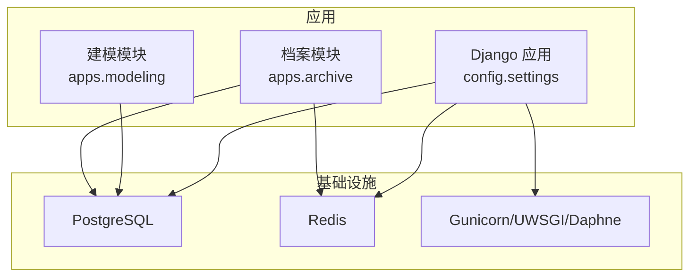
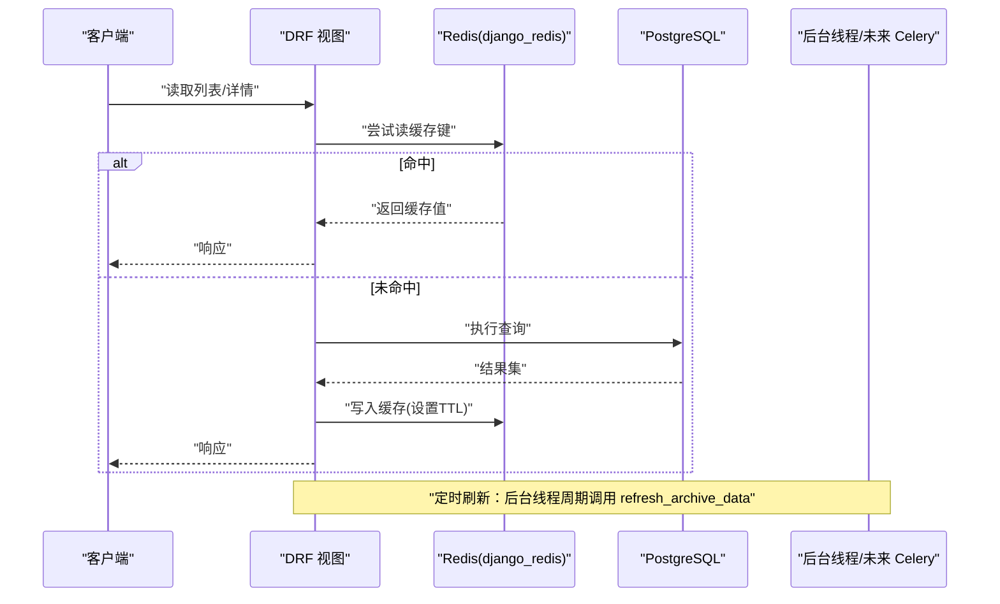
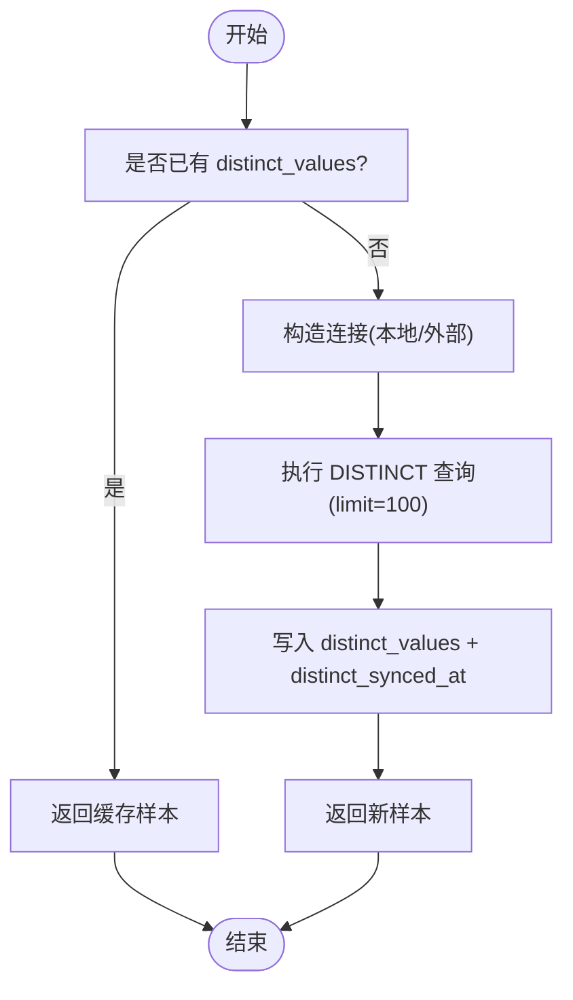
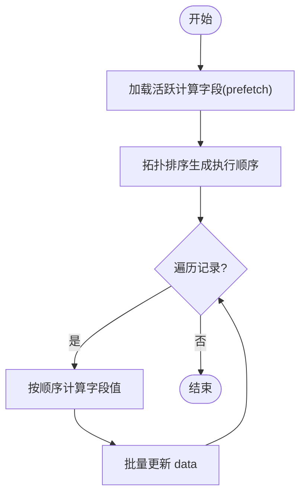
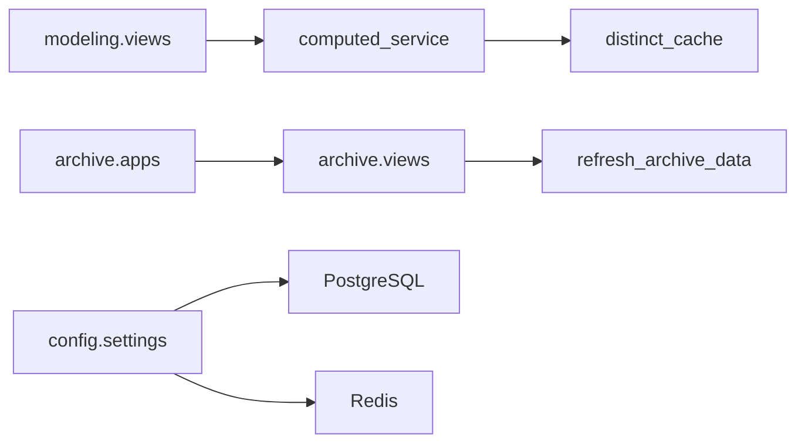

# 缓存与性能优化

<cite>
**本文引用的文件**   
- [settings.py](file://backend/config/settings.py)
- [docker-compose.yml](file://backend/docker-compose.yml)
- [requirements.txt](file://backend/requirements.txt)
- [distinct_cache.py](file://backend/apps/modeling/distinct_cache.py)
- [computed_service.py](file://backend/apps/modeling/computed_service.py)
- [views.py（modeling）](file://backend/apps/modeling/views.py)
- [apps.py（archive）](file://backend/apps/archive/apps.py)
- [views.py（archive）](file://backend/apps/archive/views.py)
</cite>

## 目录
1. [简介](#简介)
2. [项目结构](#项目结构)
3. [核心组件](#核心组件)
4. [架构总览](#架构总览)
5. [详细组件分析](#详细组件分析)
6. [依赖关系分析](#依赖关系分析)
7. [性能考量](#性能考量)
8. [故障排查指南](#故障排查指南)
9. [结论](#结论)
10. [附录](#附录)

## 简介
本文件面向 MetaData002 后端的缓存与性能优化，聚焦以下目标：
- Redis 缓存策略：数据结构设计、过期策略、分布式一致性
- 查询优化技巧：SQL 与 ORM 层面、连接池配置、内存管理
- 异步任务处理：Celery 集成与后台任务调度（现状与演进建议）
- 性能监控指标、瓶颈分析与调优建议
- 缓存一致性保证、热点数据处理与高并发场景优化方案

## 项目结构
后端采用 Django + DRF 架构，Redis 作为默认缓存后端；当前未启用 Celery 队列，但已引入依赖。定时刷新通过进程内线程实现。

图表来源
- [settings.py:56-74](file://backend/config/settings.py#L56-L74)
- [docker-compose.yml:22-31](file://backend/docker-compose.yml#L22-L31)

章节来源
- [settings.py:1-123](file://backend/config/settings.py#L1-L123)
- [docker-compose.yml:1-57](file://backend/docker-compose.yml#L1-L57)

## 核心组件
- 缓存后端：使用 django_redis 对接 Redis，默认库索引为 1
- 去重取值缓存：字段 distinct_values 持久化到数据库，限制样本上限，按需回填
- 计算字段重算：按 DAG 拓扑排序批量重算，写入合并层 data
- 定时刷新：进程内 daemon 线程周期性触发档案数据刷新

章节来源
- [settings.py:68-74](file://backend/config/settings.py#L68-L74)
- [distinct_cache.py:100-122](file://backend/apps/modeling/distinct_cache.py#L100-L122)
- [computed_service.py:195-227](file://backend/apps/modeling/computed_service.py#L195-L227)
- [apps.py（archive）:15-58](file://backend/apps/archive/apps.py#L15-L58)

## 架构总览
下图展示请求路径中缓存与数据库的交互点，以及后台定时刷新流程。

图表来源
- [settings.py:68-74](file://backend/config/settings.py#L68-L74)
- [apps.py（archive）:40-58](file://backend/apps/archive/apps.py#L40-L58)

## 详细组件分析

### Redis 缓存策略与数据结构
- 后端缓存后端：django_redis.cache.RedisCache，LOCATION 由环境变量 REDIS_HOST/REDIS_PORT 决定，默认库索引为 1
- 当前代码未直接调用 cache.get/set 等接口，属于“预留型”配置；建议在高频只读接口（如域/表/字段元数据、字典项、公式函数清单）增加缓存
- 建议的数据结构设计
  - 元数据类：key=md5("domain:{id}"), value=JSON, TTL=分钟级
  - 字典/枚举：key=md5("dict:{code}"), value=数组或映射, TTL=小时级
  - 计算字段依赖图：key=md5("dep:{domain_id}"), value=邻接表 JSON, TTL=分钟级
  - 去重取值样本：key=md5("distinct:{table}:{field}"), value=字符串数组, TTL=小时级
- 过期策略
  - 短生命周期（秒~分钟）用于热查询聚合结果
  - 中生命周期（小时）用于字典、函数清单、去重样本
  - 长生命周期（天）用于静态配置，配合版本号 key 前缀便于失效
- 分布式一致性
  - 写后删除：更新元数据后删除对应 key，避免脏读
  - 版本化 key：key 包含版本号或时间戳，降低并发竞争
  - 降级回退：缓存不可用时直接查库并记录告警

章节来源
- [settings.py:68-74](file://backend/config/settings.py#L68-L74)
- [docker-compose.yml:22-31](file://backend/docker-compose.yml#L22-L31)

### 去重取值缓存（distinct_values）
- 机制：字段模型存储 distinct_values 与 distinct_synced_at，limit 默认 100，按需回填
- 适用场景：公式编辑器参数空间、AI 推断提示词样本、组合字段成员去重预览
- 性能影响：减少外部库 DISTINCT 查询次数，降低网络与解析开销
- 一致性：当底层数据变化时，应重置 distinct_synced_at 或强制刷新

图表来源
- [distinct_cache.py:27-98](file://backend/apps/modeling/distinct_cache.py#L27-L98)
- [distinct_cache.py:100-122](file://backend/apps/modeling/distinct_cache.py#L100-L122)

章节来源
- [distinct_cache.py:1-122](file://backend/apps/modeling/distinct_cache.py#L1-L122)

### 计算字段重算与 DAG 执行
- 拓扑排序：按 depends_on 构建有向无环图，计算 execution_order
- 批量重算：遍历域下所有 ArchiveRecord，按顺序计算并写入合并层 data
- 性能要点：prefetch_related 减少 N+1；批量 update 减少事务开销

图表来源
- [computed_service.py:195-227](file://backend/apps/modeling/computed_service.py#L195-L227)

章节来源
- [computed_service.py:187-227](file://backend/apps/modeling/computed_service.py#L187-L227)

### 动态数据库连接与连接池
- 动态连接：根据 DataSource 配置在运行时注入 connections.databases，CONN_MAX_AGE=0 表示每次请求新建连接
- 风险：频繁建连在高并发下可能成为瓶颈；建议在生产环境开启连接复用与健康检查
- 建议配置
  - CONN_MAX_AGE：适当增大（如 600），配合连接池复用
  - CONN_HEALTH_CHECKS：True，自动检测断线并重连
  - 连接池：psycopg2 连接池参数（min/max/timeout）结合 WSGI worker 数调整

章节来源
- [views.py（modeling）:97-130](file://backend/apps/modeling/views.py#L97-L130)
- [views.py（archive）:1291-1319](file://backend/apps/archive/views.py#L1291-L1319)

### 定时刷新与异步任务
- 现状：ArchiveConfig.ready() 启动 daemon 线程，按 ARCHIVE_AUTO_REFRESH_MINUTES 间隔循环调用 refresh_archive_data
- 问题：进程内线程无法横向扩展，且受限于单进程生命周期
- 演进建议：迁移至 Celery 任务队列
  - 安装依赖：redis>=5.0, celery>=5.3（已存在）
  - 定义任务：@app.task 包装 refresh_archive_data
  - 调度：使用 Celery Beat 或外部调度器（如 cron/K8s CronJob）
  - 结果与重试：支持失败重试、结果持久化、监控告警

章节来源
- [apps.py（archive）:15-58](file://backend/apps/archive/apps.py#L15-L58)
- [requirements.txt:6-8](file://backend/requirements.txt#L6-L8)

## 依赖关系分析
- 组件耦合
  - modeling.views 依赖 computed_service 进行依赖解析与重算
  - archive.apps 依赖 archive.views 的 refresh_archive_data
  - distinct_cache 被 modeling.views 与 computed_service 共用，避免反向依赖
- 外部依赖
  - PostgreSQL：主数据存储
  - Redis：缓存后端（当前未直接使用）
  - Celery：依赖已引入但未启用

图表来源
- [views.py（modeling）:1905-2005](file://backend/apps/modeling/views.py#L1905-L2005)
- [computed_service.py:195-227](file://backend/apps/modeling/computed_service.py#L195-L227)
- [distinct_cache.py:100-122](file://backend/apps/modeling/distinct_cache.py#L100-L122)
- [apps.py（archive）:40-58](file://backend/apps/archive/apps.py#L40-L58)
- [settings.py:56-74](file://backend/config/settings.py#L56-L74)

章节来源
- [views.py（modeling）:1905-2005](file://backend/apps/modeling/views.py#L1905-L2005)
- [computed_service.py:195-227](file://backend/apps/modeling/computed_service.py#L195-L227)
- [distinct_cache.py:100-122](file://backend/apps/modeling/distinct_cache.py#L100-L122)
- [apps.py（archive）:40-58](file://backend/apps/archive/apps.py#L40-L58)
- [settings.py:56-74](file://backend/config/settings.py#L56-L74)

## 性能考量
- 查询优化
  - 使用 select_related/prefetch_related 减少 N+1
  - 对大结果集分页（StandardPagination max_page_size=100000）
  - 针对高频查询建立合适索引（外键、过滤字段、排序字段）
- 连接池与并发
  - 生产环境启用 CONN_MAX_AGE 与 CONN_HEALTH_CHECKS
  - 根据 Gunicorn/UWSGI worker 数量与数据库最大连接数调优
- 内存管理
  - 控制 distinct_values 样本上限（默认 100）
  - 避免在视图层组装超大对象，必要时流式处理
- 缓存命中率
  - 热点数据优先入缓存（字典、函数清单、依赖图）
  - 合理设置 TTL，避免雪崩（随机抖动）

[本节为通用指导，不直接分析具体文件]

## 故障排查指南
- Redis 不可用
  - 现象：缓存读写异常或超时
  - 排查：检查 docker-compose 中 redis 服务健康检查与端口映射
  - 处理：降级直连数据库，记录错误日志
- 动态连接失败
  - 现象：测试连接报错或查询失败
  - 排查：确认 db_type 引擎映射、用户名密码、schema/owner 配置
  - 处理：修正连接参数，确保 finally 清理临时 alias
- 定时刷新未生效
  - 现象：档案数据未自动刷新
  - 排查：ARCHIVE_AUTO_REFRESH_MINUTES 是否为 0；是否在 runserver 主进程误启
  - 处理：设置为非 0 值，确认仅在 RUN_MAIN=true 子进程启动

章节来源
- [docker-compose.yml:22-31](file://backend/docker-compose.yml#L22-L31)
- [views.py（modeling）:97-130](file://backend/apps/modeling/views.py#L97-L130)
- [apps.py（archive）:27-38](file://backend/apps/archive/apps.py#L27-L38)

## 结论
- 当前 Redis 缓存已配置但未实际使用，建议优先在高频只读接口落地缓存
- 去重取值缓存有效降低外部库查询压力，可进一步扩展到更多场景
- 计算字段重算采用 DAG 拓扑排序，具备良好可扩展性；建议后续将重算任务迁移至 Celery
- 动态连接需在生产环境启用连接复用与健康检查，提升稳定性与吞吐

[本节为总结，不直接分析具体文件]

## 附录
- 关键环境变量
  - REDIS_HOST/REDIS_PORT：Redis 地址与端口
  - DB_*：PostgreSQL 连接信息
  - ARCHIVE_AUTO_REFRESH_MINUTES：定时刷新间隔（分钟）
- 依赖清单
  - redis>=5.0、celery>=5.3：缓存与异步任务基础依赖

章节来源
- [settings.py:68-74](file://backend/config/settings.py#L68-L74)
- [requirements.txt:6-8](file://backend/requirements.txt#L6-L8)