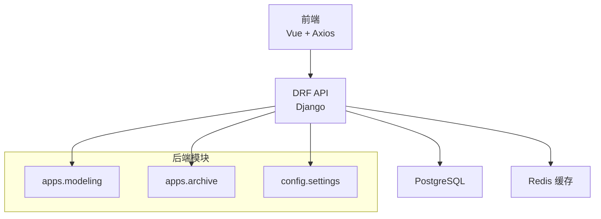
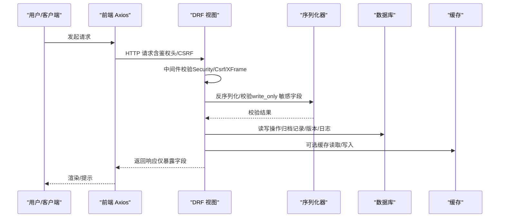
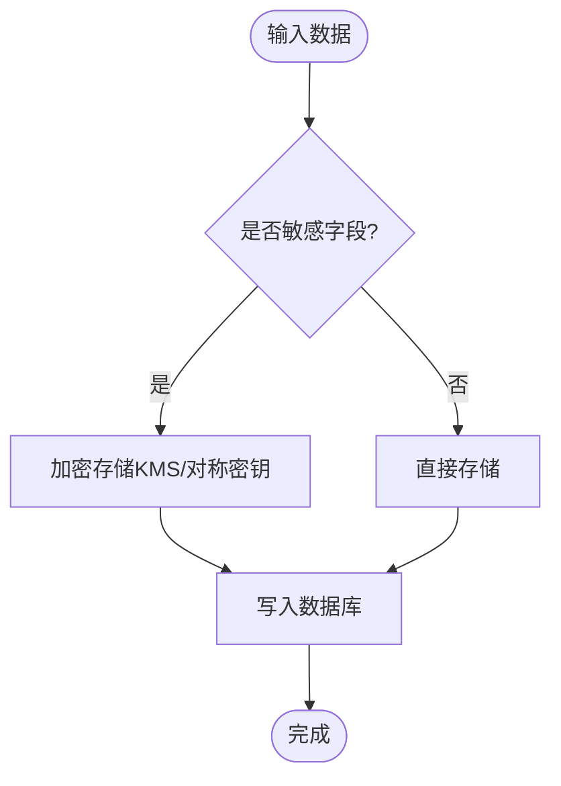
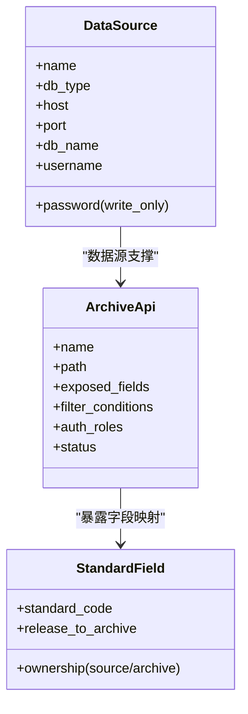
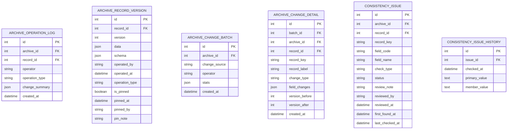
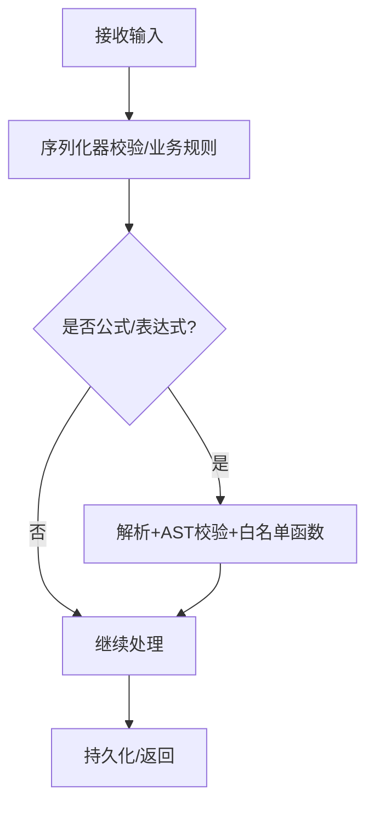
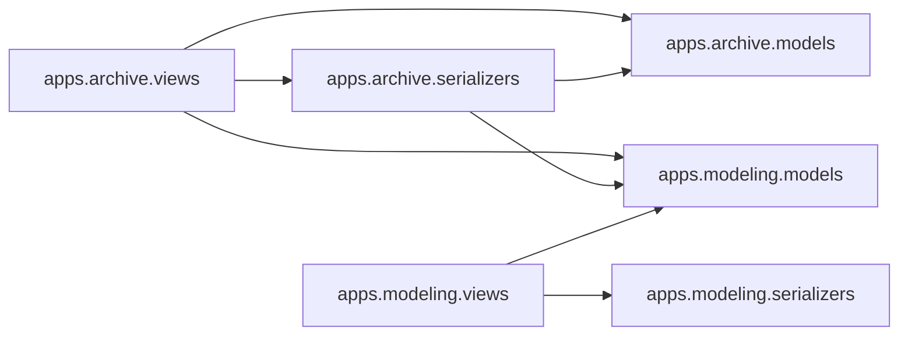

# 数据安全

<cite>
**本文引用的文件**   
- [backend/config/settings.py](file://backend/config/settings.py)
- [backend/apps/modeling/models.py](file://backend/apps/modeling/models.py)
- [backend/apps/archive/models.py](file://backend/apps/archive/models.py)
- [backend/apps/archive/views.py](file://backend/apps/archive/views.py)
- [backend/apps/modeling/views.py](file://backend/apps/modeling/views.py)
- [backend/apps/modeling/serializers.py](file://backend/apps/modeling/serializers.py)
- [backend/apps/archive/serializers.py](file://backend/apps/archive/serializers.py)
- [backend/apps/modeling/custom_functions.py](file://backend/apps/modeling/custom_functions.py)
- [frontend/src/api/index.ts](file://frontend/src/api/index.ts)
- [frontend/src/api/archive.ts](file://frontend/src/api/archive.ts)
- [frontend/src/views/archive/ApiManagement.vue](file://frontend/src/views/archive/ApiManagement.vue)
- [.ai/constitution.md](file://.ai/constitution.md)
</cite>

## 目录
1. [引言](#引言)
2. [项目结构](#项目结构)
3. [核心组件](#核心组件)
4. [架构总览](#架构总览)
5. [详细组件分析](#详细组件分析)
6. [依赖关系分析](#依赖关系分析)
7. [性能与安全特性](#性能与安全特性)
8. [故障排查指南](#故障排查指南)
9. [结论](#结论)
10. [附录](#附录)

## 引言
本文件为 MetaData002 系统的数据安全设计文档，围绕数据加密、访问控制、审计日志、备份恢复、脱敏与隐私保护、漏洞防护与输入验证、合规与治理等维度进行系统化说明。内容基于仓库现有实现与配置进行归纳，并对缺失能力给出可落地的增强建议，确保非技术读者也能理解整体安全策略与落地路径。

## 项目结构
后端采用 Django + DRF，包含建模（modeling）与档案（archive）两大应用；前端使用 Vue 3 + TypeScript，通过 Axios 调用 API。关键安全相关位置：
- 全局安全中间件与密码校验在 settings 中配置
- 数据源连接参数序列化器对敏感字段设置 write_only
- 公式引擎内置哈希函数用于脱敏/对账
- 前端 Axios 统一错误处理并保留结构化响应
- 档案 API 暴露字段与角色授权配置

**图表来源**
- [backend/config/settings.py:26-34](file://backend/config/settings.py#L26-L34)
- [backend/config/settings.py:56-74](file://backend/config/settings.py#L56-L74)

**章节来源**
- [backend/config/settings.py:26-34](file://backend/config/settings.py#L26-L34)
- [backend/config/settings.py:56-74](file://backend/config/settings.py#L56-L74)

## 核心组件
- 数据源配置与连接：支持多数据库类型，动态创建连接，测试连通性
- 档案模型与双层存储：source_data（源同步底层）+ manual_data（人工覆盖层），data 写时合并
- 版本与变更日志：ArchiveRecordVersion、ArchiveChangeBatch、ArchiveChangeDetail、ArchiveOperationLog、ConsistencyIssue/Histroy
- 数据服务 API：按档案维度暴露字段、筛选条件与角色授权
- 公式引擎与技术函数：内置 HASH_MD5 等函数，插件化扩展

**章节来源**
- [backend/apps/modeling/models.py:4-29](file://backend/apps/modeling/models.py#L4-L29)
- [backend/apps/archive/models.py:33-73](file://backend/apps/archive/models.py#L33-L73)
- [backend/apps/archive/models.py:75-110](file://backend/apps/archive/models.py#L75-L110)
- [backend/apps/archive/models.py:112-137](file://backend/apps/archive/models.py#L112-L137)
- [backend/apps/archive/models.py:139-172](file://backend/apps/archive/models.py#L139-L172)
- [backend/apps/archive/models.py:174-204](file://backend/apps/archive/models.py#L174-L204)
- [backend/apps/archive/models.py:206-233](file://backend/apps/archive/models.py#L206-L233)
- [backend/apps/archive/models.py:235-272](file://backend/apps/archive/models.py#L235-L272)
- [backend/apps/archive/models.py:274-332](file://backend/apps/archive/models.py#L274-L332)
- [backend/apps/archive/models.py:334-362](file://backend/apps/archive/models.py#L334-L362)
- [backend/apps/archive/models.py:364-379](file://backend/apps/archive/models.py#L364-L379)
- [backend/apps/modeling/custom_functions.py:96-107](file://backend/apps/modeling/custom_functions.py#L96-L107)

## 架构总览
下图展示请求从前端到后端的流转，以及涉及的安全控制点（CSRF、XFrameOptions、密码校验、序列化器 write_only、API 暴露字段与授权）。

**图表来源**
- [backend/config/settings.py:26-34](file://backend/config/settings.py#L26-L34)
- [backend/apps/modeling/serializers.py:5-12](file://backend/apps/modeling/serializers.py#L5-L12)
- [backend/apps/archive/views.py:2417-2448](file://backend/apps/archive/views.py#L2417-L2448)
- [frontend/src/api/index.ts:9-19](file://frontend/src/api/index.ts#L9-L19)

## 详细组件分析

### 数据加密策略
- 传输加密
  - 生产环境应启用 HTTPS（反向代理/TLS 终止），当前未在后端强制 TLS，需由部署层保障。
- 敏感字段加密存储
  - 数据源密码字段在序列化器中标记 write_only，避免回显；但明文落库，建议在入库前进行加密（如对称密钥或 KMS），并在需要时解密。
  - AI 配置中的 api_key 同样标记 write_only，建议同策略加密存储。
- 传输层与缓存
  - Redis 连接地址通过环境变量注入，建议启用认证与 TLS（若部署支持）。
- 脱敏与哈希
  - 公式引擎提供 HASH_MD5 函数，可用于对敏感标识做不可逆摘要，便于对账与去重。

**图表来源**
- [backend/apps/modeling/serializers.py:5-12](file://backend/apps/modeling/serializers.py#L5-L12)
- [backend/apps/modeling/models.py:387-418](file://backend/apps/modeling/models.py#L387-L418)
- [backend/apps/modeling/custom_functions.py:96-107](file://backend/apps/modeling/custom_functions.py#L96-L107)

**章节来源**
- [backend/apps/modeling/serializers.py:5-12](file://backend/apps/modeling/serializers.py#L5-L12)
- [backend/apps/modeling/models.py:387-418](file://backend/apps/modeling/models.py#L387-L418)
- [backend/apps/modeling/custom_functions.py:96-107](file://backend/apps/modeling/custom_functions.py#L96-L107)

### 访问控制机制
- 用户权限管理
  - 当前未实现统一鉴权模块，API 的 auth_roles 字段仅用于展示与未来集成预留。
  - 建议引入 RBAC/ABAC 中间件，结合 DRF 的 Permission 类实现接口级与资源级控制。
- 数据隔离
  - 档案 API 支持 exposed_fields 与 filter_conditions，限制对外暴露的字段与数据范围。
  - 多租户场景可按 domain 或 archive 维度进行行级过滤。
- CSRF 与点击劫持防护
  - 已启用 CsrfViewMiddleware 与 XFrameOptionsMiddleware，建议生产环境开启 CSRF_COOKIE_SECURE 与严格同源策略。

**图表来源**
- [backend/apps/archive/models.py:139-172](file://backend/apps/archive/models.py#L139-L172)
- [backend/apps/modeling/models.py:162-228](file://backend/apps/modeling/models.py#L162-L228)
- [backend/apps/modeling/serializers.py:5-12](file://backend/apps/modeling/serializers.py#L5-L12)

**章节来源**
- [backend/apps/archive/models.py:139-172](file://backend/apps/archive/models.py#L139-L172)
- [backend/apps/modeling/models.py:162-228](file://backend/apps/modeling/models.py#L162-L228)
- [backend/apps/modeling/serializers.py:5-12](file://backend/apps/modeling/serializers.py#L5-L12)

### 审计日志记录
- 操作日志
  - ArchiveOperationLog：记录新增、修改、删除、回滚、定版、同步等操作，含 operator、operation_type、change_summary、created_at。
- 版本快照
  - ArchiveRecordVersion：每次重要操作生成快照，支持 pin/unpin、rollback。
- 变更批次与明细
  - ArchiveChangeBatch：按批次聚合变更（sync/manual/consistency），stats 统计新增/更新/停用/复活数量。
  - ArchiveChangeDetail：字段级旧值→新值，record_label 快照便于识别具体记录。
- 一致性差异与历史
  - ConsistencyIssue：记录主字段与成员值不一致等问题，支持状态流转与审核。
  - ConsistencyIssueHistory：每次检查追加历史快照，形成时间线。

**图表来源**
- [backend/apps/archive/models.py:174-204](file://backend/apps/archive/models.py#L174-L204)
- [backend/apps/archive/models.py:75-110](file://backend/apps/archive/models.py#L75-L110)
- [backend/apps/archive/models.py:206-233](file://backend/apps/archive/models.py#L206-L233)
- [backend/apps/archive/models.py:235-272](file://backend/apps/archive/models.py#L235-L272)
- [backend/apps/archive/models.py:274-332](file://backend/apps/archive/models.py#L274-L332)
- [backend/apps/archive/models.py:364-379](file://backend/apps/archive/models.py#L364-L379)

**章节来源**
- [backend/apps/archive/models.py:174-204](file://backend/apps/archive/models.py#L174-L204)
- [backend/apps/archive/models.py:75-110](file://backend/apps/archive/models.py#L75-L110)
- [backend/apps/archive/models.py:206-233](file://backend/apps/archive/models.py#L206-L233)
- [backend/apps/archive/models.py:235-272](file://backend/apps/archive/models.py#L235-L272)
- [backend/apps/archive/models.py:274-332](file://backend/apps/archive/models.py#L274-L332)
- [backend/apps/archive/models.py:364-379](file://backend/apps/archive/models.py#L364-L379)

### 数据备份恢复策略与灾难恢复计划
- 现状
  - 变更日志与版本快照持久化于数据库，具备回溯基础。
  - 无内置备份/恢复脚本或调度任务。
- 建议
  - 定期全量+增量备份 PostgreSQL（pg_dump/pg_basebackup），保留期按合规要求设定。
  - 对 ArchiveRecordVersion、ArchiveChangeDetail、ConsistencyIssueHistory 建立独立导出通道，便于快速恢复关键审计轨迹。
  - 制定 RPO/RTO 目标，演练恢复流程，确保灾难恢复有效性。

[本节为通用指导，不直接分析具体文件]

### 数据脱敏与隐私保护方案
- 输出脱敏
  - 档案 API 通过 exposed_fields 控制暴露字段集合，减少不必要的数据泄露面。
  - 可在序列化层增加脱敏规则（如手机号、身份证号的掩码显示）。
- 计算字段脱敏
  - 使用 HASH_MD5 对敏感标识生成摘要，用于对账与关联而不暴露明文。
- 隐私合规
  - 针对个人信息字段，建议标注敏感等级，实施最小化暴露与访问审批。

**章节来源**
- [backend/apps/archive/models.py:139-172](file://backend/apps/archive/models.py#L139-L172)
- [backend/apps/modeling/custom_functions.py:96-107](file://backend/apps/modeling/custom_functions.py#L96-L107)

### 安全漏洞防护与输入验证机制
- 中间件防护
  - SecurityMiddleware、CsrfViewMiddleware、XFrameOptionsMiddleware 已启用，防范常见 Web 攻击。
- 输入校验
  - DRF 序列化器负责字段类型、必填、默认值等校验；标准字段支持 validation_rule JSON 约束。
  - 公式表达式解析与求值在引擎内执行，避免 eval/exec 等危险操作。
- 插件安全
  - 技术函数插件通过 AST 白名单校验，禁止危险导入与内建函数，降低恶意代码风险。

**图表来源**
- [backend/config/settings.py:26-34](file://backend/config/settings.py#L26-L34)
- [backend/apps/modeling/models.py:310-357](file://backend/apps/modeling/models.py#L310-L357)
- [backend/apps/modeling/formula_engine.py](file://backend/apps/modeling/formula_engine.py)
- [backend/apps/modeling/plugin_loader.py](file://backend/apps/modeling/plugin_loader.py)

**章节来源**
- [backend/config/settings.py:26-34](file://backend/config/settings.py#L26-L34)
- [backend/apps/modeling/models.py:310-357](file://backend/apps/modeling/models.py#L310-L357)

### 合规性要求与数据治理规范
- 数据所有权与维护方
  - ownership=source 表示源系统维护，档案侧只读；ownership=archive 表示档案维护，允许编辑。
  - 主字段机制确保组合字段以单一权威来源为准，其他成员用于一致性检查。
- 变更与审计
  - 所有关键操作均落库留痕，支持回滚与对比，满足审计与追溯需求。
- 数据质量
  - 一致性检查规则与差异清单，支持批量审核与历史记录，持续监控数据漂移。

**章节来源**
- [backend/apps/modeling/models.py:162-228](file://backend/apps/modeling/models.py#L162-L228)
- [backend/apps/modeling/models.py:310-357](file://backend/apps/modeling/models.py#L310-L357)
- [backend/apps/archive/models.py:206-272](file://backend/apps/archive/models.py#L206-L272)
- [backend/apps/archive/models.py:274-332](file://backend/apps/archive/models.py#L274-L332)

## 依赖关系分析
- 模块耦合
  - archive 依赖 modeling 的 Domain/Table/Field/StandardField 等概念模型，用于生成 schema 与合并数据。
  - views 层通过 serializers 进行输入输出转换，models 层承载数据与审计。
- 外部依赖
  - PostgreSQL、Redis 作为数据存储与缓存。
  - 第三方 AI 服务（OpenAI 兼容）用于字段推断与公式生成。

**图表来源**
- [backend/apps/archive/views.py:1-22](file://backend/apps/archive/views.py#L1-L22)
- [backend/apps/archive/serializers.py:1-7](file://backend/apps/archive/serializers.py#L1-L7)
- [backend/apps/modeling/views.py:1-21](file://backend/apps/modeling/views.py#L1-L21)
- [backend/apps/modeling/serializers.py:1-12](file://backend/apps/modeling/serializers.py#L1-L12)

**章节来源**
- [backend/apps/archive/views.py:1-22](file://backend/apps/archive/views.py#L1-L22)
- [backend/apps/archive/serializers.py:1-7](file://backend/apps/archive/serializers.py#L1-L7)
- [backend/apps/modeling/views.py:1-21](file://backend/apps/modeling/views.py#L1-L21)
- [backend/apps/modeling/serializers.py:1-12](file://backend/apps/modeling/serializers.py#L1-L12)

## 性能与安全特性
- 双层存储与写时合并
  - source_data 整层替换，manual_data 仅覆盖受保护字段，data 合并计算，提升同步效率与一致性。
- 分页与限流
  - DRF 分页类支持 page_size_query_param，max_page_size 较大，建议在生产环境限制最大页大小。
- 缓存
  - Redis 用于缓存去重取值与热点数据，注意缓存穿透与雪崩防护。

**章节来源**
- [backend/config/settings.py:92-101](file://backend/config/settings.py#L92-L101)
- [backend/config/settings.py:68-74](file://backend/config/settings.py#L68-L74)

## 故障排查指南
- 常见问题
  - 连接失败：DataSourceViewSet.test_connection 返回错误详情，检查主机、端口、用户名、密码与驱动。
  - 权限不足：同步到数据源时探测写权限失败，需授予相应表 UPDATE/INSERT 权限。
  - CSRF 失败：确认前端携带正确 CSRF Token，生产环境启用 CSRF_COOKIE_SECURE。
  - 公式错误：validate_expression 返回语法错误与引用列表，修正表达式后重试。
- 定位方法
  - 查看 ArchiveSyncLog、ArchiveOperationLog、ArchiveChangeDetail 获取操作与变更轨迹。
  - 使用 ConsistencyIssue 与 History 追踪数据差异与修复过程。

**章节来源**
- [backend/apps/modeling/views.py:74-146](file://backend/apps/modeling/views.py#L74-L146)
- [backend/apps/archive/models.py:112-137](file://backend/apps/archive/models.py#L112-L137)
- [backend/apps/archive/models.py:174-204](file://backend/apps/archive/models.py#L174-L204)
- [backend/apps/archive/models.py:235-272](file://backend/apps/archive/models.py#L235-L272)
- [backend/apps/archive/models.py:274-332](file://backend/apps/archive/models.py#L274-L332)

## 结论
MetaData002 在数据建模与档案管理方面具备完善的审计与一致性保障能力。当前安全能力集中在中间件防护、序列化器 write_only、API 字段暴露控制与公式引擎安全校验。建议在生产环境中补充传输加密、敏感字段加密存储、统一鉴权与细粒度权限控制、备份恢复与合规治理流程，以提升整体数据安全水位。

[本节为总结性内容，不直接分析具体文件]

## 附录
- 关键决策与演进要点（摘录）
  - Hub 式单向数据流：源→档案→API，永不回写，字段所有权明确。
  - 双层存储与写时合并：source_data 与 manual_data 分层，提升同步与编辑体验。
  - 变更日志与版本快照：支持回滚、对比与审计追溯。
  - 一致性检查：差异清单与历史记录，支持批量审核。
  - 技术函数插件：AST 白名单校验，防止恶意代码。

**章节来源**
- [.ai/constitution.md:64-102](file://.ai/constitution.md#L64-L102)