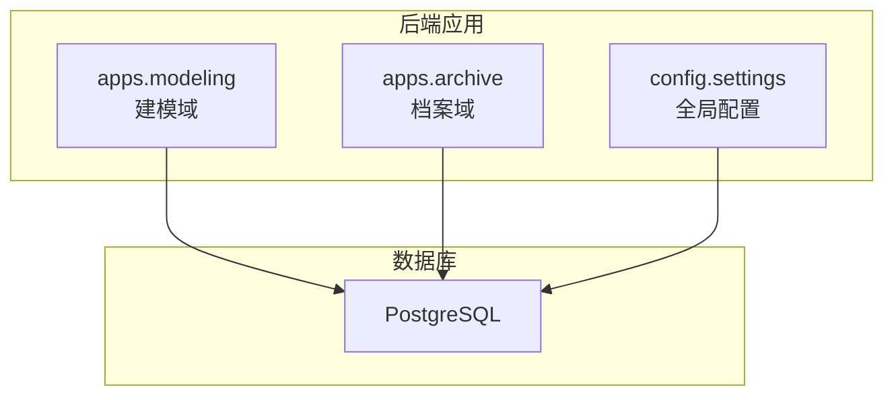
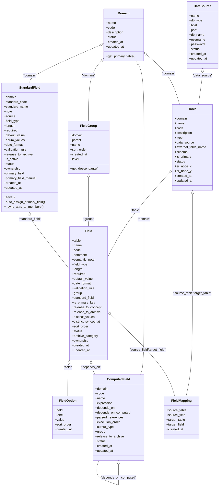
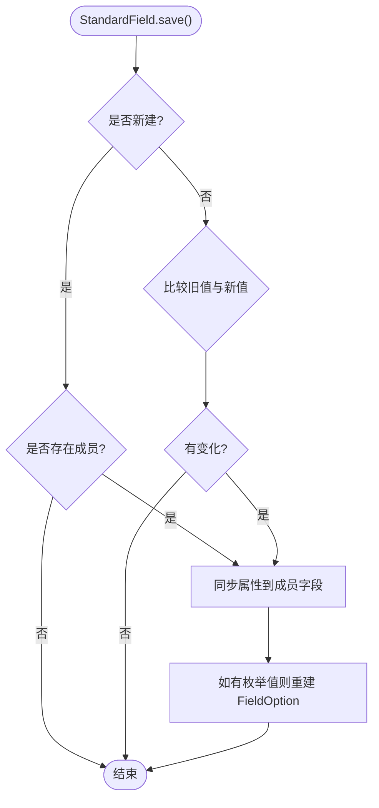
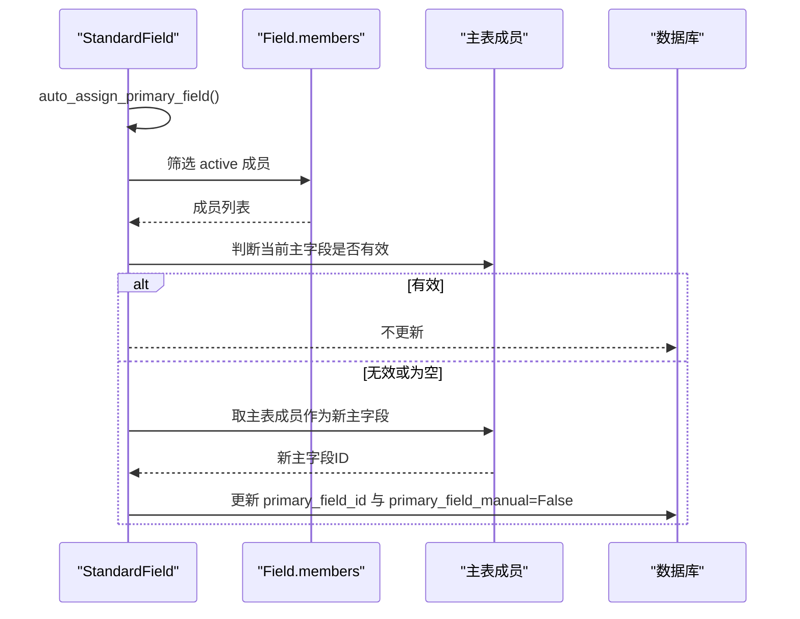
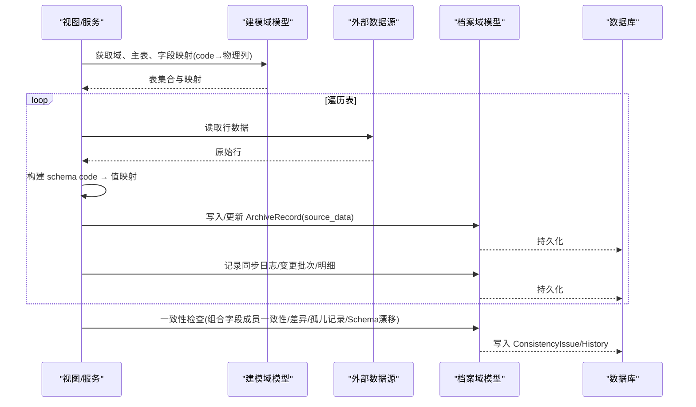
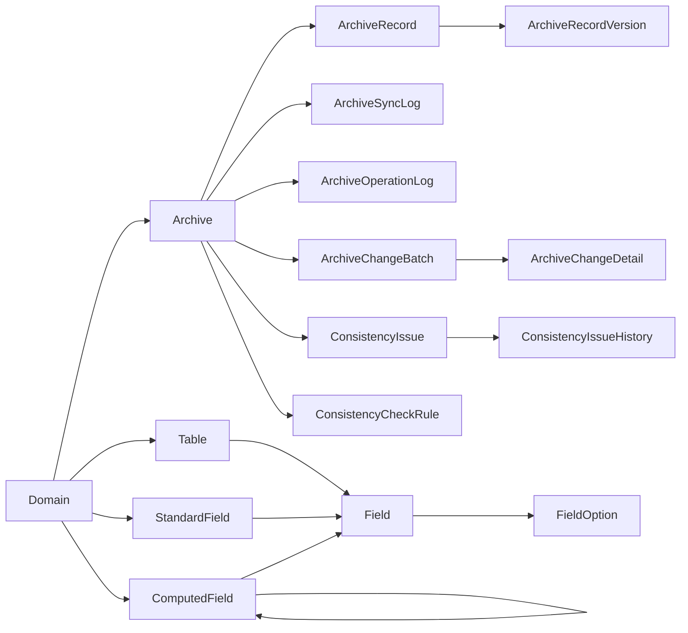
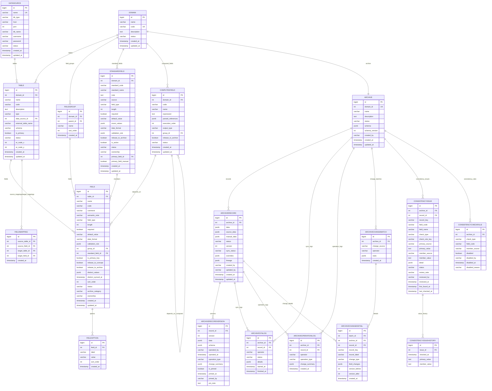

# 关系映射设计

<cite>
**本文引用的文件**   
- [backend/apps/modeling/models.py](file://backend/apps/modeling/models.py)
- [backend/apps/archive/models.py](file://backend/apps/archive/models.py)
- [backend/config/settings.py](file://backend/config/settings.py)
- [backend/apps/modeling/migrations/0001_initial.py](file://backend/apps/modeling/migrations/0001_initial.py)
- [backend/apps/modeling/migrations/0002_datasource_table_external_table_name_and_more.py](file://backend/apps/modeling/migrations/0002_datasource_table_external_table_name_and_more.py)
- [backend/apps/modeling/migrations/0008_add_is_primary_key_to_field.py](file://backend/apps/modeling/migrations/0008_add_is_primary_key_to_field.py)
- [backend/apps/modeling/migrations/0026_standardfield_primary_field_and_more.py](file://backend/apps/modeling/migrations/0026_standardfield_primary_field_and_more.py)
- [backend/apps/archive/migrations/0001_initial.py](file://backend/apps/archive/migrations/0001_initial.py)
- [backend/apps/archive/migrations/0013_consistencycheckrule_and_more.py](file://backend/apps/archive/migrations/0013_consistencycheckrule_and_more.py)
</cite>

## 目录
1. [简介](#简介)
2. [项目结构](#项目结构)
3. [核心组件](#核心组件)
4. [架构总览](#架构总览)
5. [详细组件分析](#详细组件分析)
6. [依赖关系分析](#依赖关系分析)
7. [性能与索引策略](#性能与索引策略)
8. [常见问题与排错指南](#常见问题与排错指南)
9. [结论](#结论)
10. [附录：ER图与SQL示例](#附录er图与sql示例)

## 简介
本文件为 MetaData002 系统的数据关系映射设计文档，聚焦建模域（modeling）与档案域（archive）两大应用的数据模型、实体关联、外键约束、级联策略、索引与查询优化、跨应用数据访问模式及 N+1 问题解决方案。文档提供 ER 图、类关系图、关键流程时序图，并给出常见查询场景的 SQL 示例与优化建议，帮助读者快速理解并高效使用该系统的数据层。

## 项目结构
后端采用 Django 多应用架构：
- apps.modeling：主数据建模（域、表、字段、标准字段、计算字段、字段分组、字段映射、数据源配置等）
- apps.archive：档案（一个域一个档案）、档案记录、版本快照、同步日志、操作日志、变更批次与明细、一致性检查与规则等
- config.settings：数据库连接、缓存、DRF 等全局配置

图表来源
- [backend/apps/modeling/models.py:1-489](file://backend/apps/modeling/models.py#L1-L489)
- [backend/apps/archive/models.py:1-379](file://backend/apps/archive/models.py#L1-L379)
- [backend/config/settings.py:56-66](file://backend/config/settings.py#L56-L66)

章节来源
- [backend/config/settings.py:10-24](file://backend/config/settings.py#L10-L24)
- [backend/config/settings.py:56-66](file://backend/config/settings.py#L56-L66)

## 核心组件
- 建模域（modeling）
  - DataSource：数据源配置（支持 PostgreSQL/MySQL/SQL Server/Oracle）
  - Domain：主数据域
  - Table：域下的实体表（本地或外部数据源表），含主表标记与 ER 节点坐标
  - FieldGroup：字段分类分组（支持多层嵌套）
  - StandardField：概念层标准字段（跨物理字段去重与统一属性）
  - Field：物理字段定义（归属表、分组、标准字段、主键标记、归档释放等）
  - FieldOption：枚举选项
  - ComputedField：计算字段（表达式、依赖物理字段与计算字段、DAG 执行顺序）
  - FieldMapping：表间字段映射（实现表间关系）
- 档案域（archive）
  - Archive：档案配置（与 Domain 一对一）
  - ArchiveRecord：档案记录（JSON 双层存储：source_data + manual_data）
  - ArchiveRecordVersion：版本快照（含 Schema 快照）
  - ArchiveSyncLog：同步日志
  - ArchiveOperationLog：操作日志
  - ArchiveChangeBatch / ArchiveChangeDetail：变更批次与明细
  - ConsistencyIssue / ConsistencyCheckRule / ConsistencyIssueHistory：一致性差异与规则、历史

章节来源
- [backend/apps/modeling/models.py:4-489](file://backend/apps/modeling/models.py#L4-L489)
- [backend/apps/archive/models.py:5-379](file://backend/apps/archive/models.py#L5-L379)

## 架构总览
系统以“域”为中心组织建模元数据，通过“标准字段”将跨表同义字段归一化；档案域对每个域生成一份档案，记录合并后的实例数据与版本、同步与一致性审计信息。

图表来源
- [backend/apps/modeling/models.py:4-489](file://backend/apps/modeling/models.py#L4-L489)

章节来源
- [backend/apps/modeling/models.py:4-489](file://backend/apps/modeling/models.py#L4-L489)

## 详细组件分析

### 建模域（modeling）实体关系与约束
- 一对一
  - Domain ↔ Archive：通过 OneToOneField 绑定，确保一个域仅对应一个档案
- 一对多
  - Domain → Table、FieldGroup、StandardField、ComputedField
  - Table → Field、FieldMapping(source_table/target_table)
  - Field → FieldOption
  - FieldGroup → Field
  - StandardField → Field(members)
  - DataSource → Table(data_source)
  - Archive → ArchiveRecord、ArchiveApi、ArchiveSyncLog、ArchiveOperationLog、ArchiveChangeBatch、ConsistencyIssue、ConsistencyCheckRule
  - ArchiveRecord → ArchiveRecordVersion、ArchiveSyncLog、ArchiveOperationLog、ArchiveChangeDetail
  - ArchiveChangeBatch → ArchiveChangeDetail
  - ConsistencyIssue → ConsistencyIssueHistory
- 多对多
  - ComputedField ↔ Field(depends_on)
  - ComputedField ↔ ComputedField(depends_on_computed, 自引用非对称)
  - FieldMapping：四元唯一约束保证映射唯一性
- 外键与级联
  - 多数删除行为为 CASCADE，保证强一致；部分 SET_NULL（如 Field.group、Table.data_source、ArchiveRecord.sync_logs.record 等）用于保留历史可追溯
- 唯一性与约束
  - unique_together：Domain.code、Table(domain, code)、Field(table, code)、FieldOption(field, value)、FieldMapping(source_table, source_field, target_table, target_field)、ArchiveRecordVersion(record, version)
  - 自定义 UniqueConstraint：ConsistencyIssue(archive, record_key, field_code, member_source, check_type)、ConsistencyCheckRule(archive, check_type, field_code, member_source)

章节来源
- [backend/apps/modeling/models.py:4-489](file://backend/apps/modeling/models.py#L4-L489)
- [backend/apps/archive/models.py:5-379](file://backend/apps/archive/models.py#L5-L379)
- [backend/apps/modeling/migrations/0001_initial.py:15-126](file://backend/apps/modeling/migrations/0001_initial.py#L15-L126)
- [backend/apps/modeling/migrations/0002_datasource_table_external_table_name_and_more.py:35-50](file://backend/apps/modeling/migrations/0002_datasource_table_external_table_name_and_more.py#L35-L50)
- [backend/apps/modeling/migrations/0008_add_is_primary_key_to_field.py:12-18](file://backend/apps/modeling/migrations/0008_add_is_primary_key_to_field.py#L12-L18)
- [backend/apps/modeling/migrations/0026_standardfield_primary_field_and_more.py:27-39](file://backend/apps/modeling/migrations/0026_standardfield_primary_field_and_more.py#L27-L39)
- [backend/apps/archive/migrations/0001_initial.py:16-126](file://backend/apps/archive/migrations/0001_initial.py#L16-L126)
- [backend/apps/archive/migrations/0013_consistencycheckrule_and_more.py:14-78](file://backend/apps/archive/migrations/0013_consistencycheckrule_and_more.py#L14-L78)

### 档案域（archive）实体关系与约束
- 一对一
  - Archive.domain 与 Domain 一对一，保障“一域一档案”
- 一对多
  - Archive → ArchiveRecord、ArchiveApi、ArchiveSyncLog、ArchiveOperationLog、ArchiveChangeBatch、ConsistencyIssue、ConsistencyCheckRule
  - ArchiveRecord → ArchiveRecordVersion、ArchiveSyncLog、ArchiveOperationLog、ArchiveChangeDetail
  - ArchiveChangeBatch → ArchiveChangeDetail
  - ConsistencyIssue → ConsistencyIssueHistory
- 多对多
  - ComputedField.depends_on 与 depends_on_computed（建模域内）
- 外键与级联
  - 删除多为 CASCADE；部分 SET_NULL 用于保留历史（如 sync_logs.record、operation_logs.record、change_details.record）
- 唯一性与约束
  - unique_together：ArchiveRecordVersion(record, version)
  - UniqueConstraint：ConsistencyIssue、ConsistencyCheckRule

章节来源
- [backend/apps/archive/models.py:5-379](file://backend/apps/archive/models.py#L5-L379)
- [backend/apps/archive/migrations/0001_initial.py:16-126](file://backend/apps/archive/migrations/0001_initial.py#L16-L126)
- [backend/apps/archive/migrations/0013_consistencycheckrule_and_more.py:14-78](file://backend/apps/archive/migrations/0013_consistencycheckrule_and_more.py#L14-L78)

### 关键处理逻辑与数据流

#### 标准字段属性同步到成员字段（保存时触发）

图表来源
- [backend/apps/modeling/models.py:230-299](file://backend/apps/modeling/models.py#L230-L299)

章节来源
- [backend/apps/modeling/models.py:230-299](file://backend/apps/modeling/models.py#L230-L299)

#### 主字段自动分配与跟随主表切换

图表来源
- [backend/apps/modeling/models.py:255-274](file://backend/apps/modeling/models.py#L255-L274)
- [backend/apps/modeling/migrations/0026_standardfield_primary_field_and_more.py:27-39](file://backend/apps/modeling/migrations/0026_standardfield_primary_field_and_more.py#L27-L39)

章节来源
- [backend/apps/modeling/models.py:255-274](file://backend/apps/modeling/models.py#L255-L274)
- [backend/apps/modeling/migrations/0026_standardfield_primary_field_and_more.py:27-39](file://backend/apps/modeling/migrations/0026_standardfield_primary_field_and_more.py#L27-L39)

#### 档案数据同步与一致性检查（简化流程）

图表来源
- [backend/apps/archive/views.py:436-460](file://backend/apps/archive/views.py#L436-L460)
- [backend/apps/archive/views.py:673-702](file://backend/apps/archive/views.py#L673-L702)
- [backend/apps/archive/views.py:958-990](file://backend/apps/archive/views.py#L958-L990)
- [backend/apps/archive/views.py:1181-1208](file://backend/apps/archive/views.py#L1181-L1208)

章节来源
- [backend/apps/archive/views.py:436-460](file://backend/apps/archive/views.py#L436-L460)
- [backend/apps/archive/views.py:673-702](file://backend/apps/archive/views.py#L673-L702)
- [backend/apps/archive/views.py:958-990](file://backend/apps/archive/views.py#L958-L990)
- [backend/apps/archive/views.py:1181-1208](file://backend/apps/archive/views.py#L1181-L1208)

## 依赖关系分析
- 应用耦合
  - archive 依赖 modeling 的 Domain、Table、Field 等元数据
  - modeling 内部通过 ForeignKey 形成清晰的层级：Domain → Table/FieldGroup/StandardField/ComputedField → Field → FieldOption
- 直接依赖
  - Archive.domain → Domain（OneToOne）
  - ArchiveRecord.archive → Archive（ForeignKey）
  - ArchiveRecordVersion.record → ArchiveRecord（ForeignKey）
  - ArchiveSyncLog.archive/record → Archive/ArchiveRecord
  - ArchiveOperationLog.archive/record → Archive/ArchiveRecord
  - ArchiveChangeBatch.archive → Archive
  - ArchiveChangeDetail.batch/archive/record → ArchiveChangeBatch/Archive/ArchiveRecord
  - ConsistencyIssue.archive/record → Archive/ArchiveRecord
  - ConsistencyCheckRule.archive → Archive
  - ConsistencyIssueHistory.issue → ConsistencyIssue
- 间接依赖
  - 计算字段依赖链（depends_on、depends_on_computed）形成 DAG，影响批处理执行顺序
- 循环依赖
  - 无循环外键；自引用为非对称多对多（depends_on_computed）

图表来源
- [backend/apps/modeling/models.py:4-489](file://backend/apps/modeling/models.py#L4-L489)
- [backend/apps/archive/models.py:5-379](file://backend/apps/archive/models.py#L5-L379)

章节来源
- [backend/apps/modeling/models.py:4-489](file://backend/apps/modeling/models.py#L4-L489)
- [backend/apps/archive/models.py:5-379](file://backend/apps/archive/models.py#L5-L379)

## 性能与索引策略
- 现有索引
  - ArchiveRecord：(archive, status)
  - ArchiveOperationLog：(archive, -created_at)
  - ArchiveSyncLog：按 started_at 排序（默认索引未显式声明，但 ordering 有助于分页）
  - ArchiveChangeBatch：(archive, -created_at)
  - ArchiveChangeDetail：(archive, -created_at)
  - ConsistencyIssue：(archive, status)、(archive, check_type)
- 建议索引
  - ArchiveRecord：(archive, version)、(archive, created_at)、(archive, updated_at)
  - ArchiveRecordVersion：(record, version) 已存在 unique_together，通常自动生成索引
  - ArchiveSyncLog：(archive, status)、(started_at)
  - ArchiveOperationLog：(record, operation_type)
  - ArchiveChangeBatch：(archive, change_source)
  - ArchiveChangeDetail：(batch, change_type)、(record, created_at)
  - ConsistencyIssue：(record_key, check_type)、(member_source, check_type)
  - FieldMapping：(source_table, target_table)、(source_field, target_field)
  - StandardField：(domain, standard_code) 已存在 unique_together
  - Table：(domain, is_primary)
- 查询优化建议
  - 使用 select_related 预加载单向外键（如 ArchiveRecord.archive、ArchiveRecordVersion.record）
  - 使用 prefetch_related 批量加载反向集合（如 Archive.records、ArchiveRecord.versions）
  - 避免在 JSONField 上频繁过滤；必要时使用 GIN 索引（PostgreSQL）
  - 分页查询结合 ordering 与 limit，减少全表扫描
  - 对高频过滤字段建立复合索引（如 (archive, status, created_at)）

章节来源
- [backend/apps/archive/models.py:67-70](file://backend/apps/archive/models.py#L67-L70)
- [backend/apps/archive/models.py:166-168](file://backend/apps/archive/models.py#L166-L168)
- [backend/apps/archive/models.py:198-200](file://backend/apps/archive/models.py#L198-L200)
- [backend/apps/archive/models.py:227-229](file://backend/apps/archive/models.py#L227-L229)
- [backend/apps/archive/models.py:266-268](file://backend/apps/archive/models.py#L266-L268)
- [backend/apps/archive/models.py:328-331](file://backend/apps/archive/models.py#L328-L331)
- [backend/apps/modeling/models.py:96](file://backend/apps/modeling/models.py#L96)
- [backend/apps/modeling/models.py:224](file://backend/apps/modeling/models.py#L224)
- [backend/apps/modeling/models.py:362](file://backend/apps/modeling/models.py#L362)
- [backend/apps/modeling/models.py:380](file://backend/apps/modeling/models.py#L380)
- [backend/apps/modeling/models.py:467](file://backend/apps/modeling/models.py#L467)
- [backend/apps/modeling/models.py:485](file://backend/apps/modeling/models.py#L485)

## 常见问题与排错指南
- N+1 查询问题
  - 现象：遍历 Archive.records 时逐条访问 versions/sync_logs/operation_logs 导致大量查询
  - 解决：使用 select_related('archive')、prefetch_related('versions', 'sync_logs', 'operation_logs')
- 外键删除一致性
  - 现象：删除 Domain 后 Table/FieldGroup/StandardField 被级联删除，需确认业务允许
  - 解决：必要时改为 SET_NULL 并在上层做清理逻辑
- JSON 字段查询性能
  - 现象：对 data/source_data/manual_data 进行复杂条件过滤慢
  - 解决：提取热点字段到结构化列并加索引；或使用 PostgreSQL GIN 索引
- 一致性检查误报
  - 现象：组合字段成员不一致告警过多
  - 解决：通过 ConsistencyCheckRule 禁用特定规则，或修正主字段选择
- 迁移冲突
  - 现象：unique_together 与 UniqueConstraint 重复导致迁移失败
  - 解决：核对 migrations 中约束定义，确保与 models 一致

章节来源
- [backend/apps/archive/models.py:67-70](file://backend/apps/archive/models.py#L67-L70)
- [backend/apps/archive/models.py:166-168](file://backend/apps/archive/models.py#L166-L168)
- [backend/apps/archive/models.py:198-200](file://backend/apps/archive/models.py#L198-200)
- [backend/apps/archive/models.py:227-229](file://backend/apps/archive/models.py#L227-229)
- [backend/apps/archive/models.py:266-268](file://backend/apps/archive/models.py#L266-268)
- [backend/apps/archive/models.py:328-331](file://backend/apps/archive/models.py#L328-331)

## 结论
MetaData002 的数据模型围绕“域—表—字段—标准字段”的层次展开，并通过档案域实现跨源数据的合并、版本化与一致性审计。外键约束与级联策略保证了数据完整性，合理的索引与查询优化提升了性能。通过 select_related/prefetch_related 与结构化索引可有效避免 N+1 问题与 JSON 查询瓶颈。建议在后续迭代中持续完善索引策略与一致性规则管理，提升系统的可扩展性与稳定性。

## 附录：ER图与SQL示例

### ER图（概念模型）

[此图为概念 ER 图，展示完整数据模型结构与关系]

### 常见查询场景与优化建议（示例）
- 查询某域下所有启用表及其字段数
  - 思路：JOIN Table 与 Field，按 domain 与 status 过滤，GROUP BY 计数
  - 优化：确保 (domain, status) 与 (table_id) 索引可用
- 获取某档案最近一次同步详情
  - 思路：按 archive 与 started_at 降序 LIMIT 1
  - 优化：(archive, started_at) 复合索引
- 查找某记录的版本历史
  - 思路：WHERE record_id = ? ORDER BY version DESC
  - 优化：(record_id, version) 索引（由 unique_together 生成）
- 一致性差异统计
  - 思路：按 archive、check_type、status 聚合
  - 优化：(archive, check_type, status) 复合索引

[本节为通用指导，不直接分析具体文件]