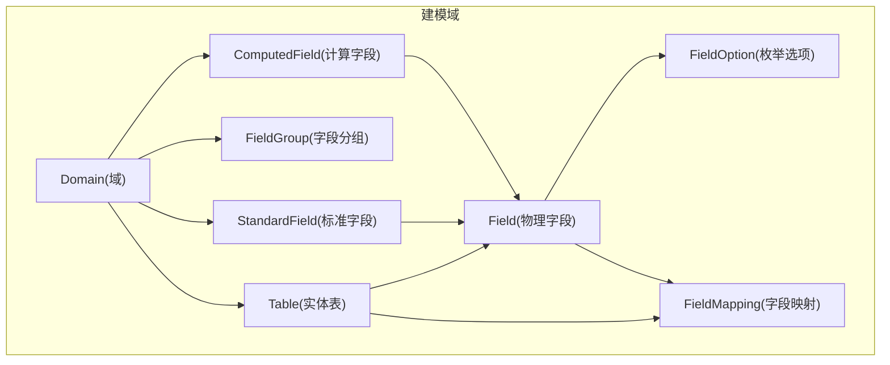
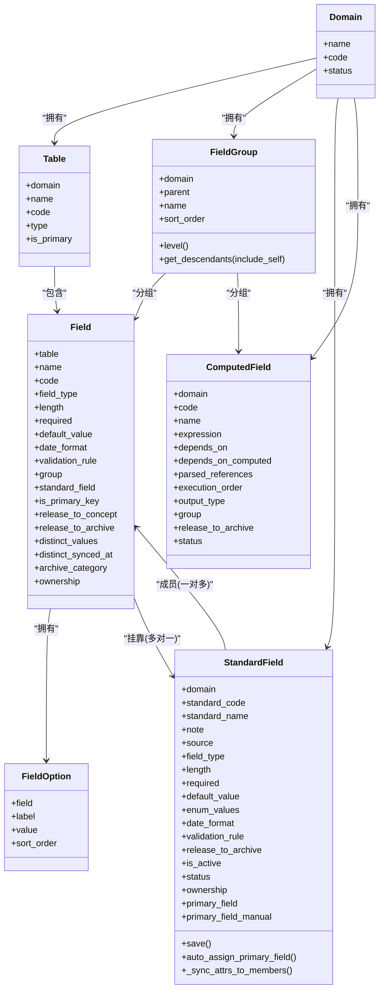
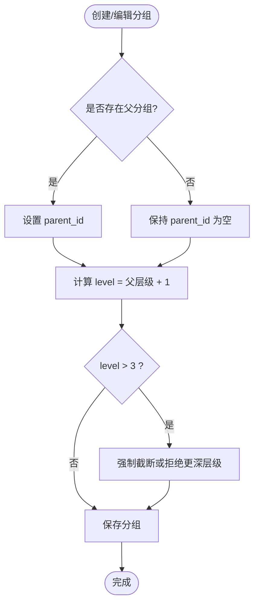
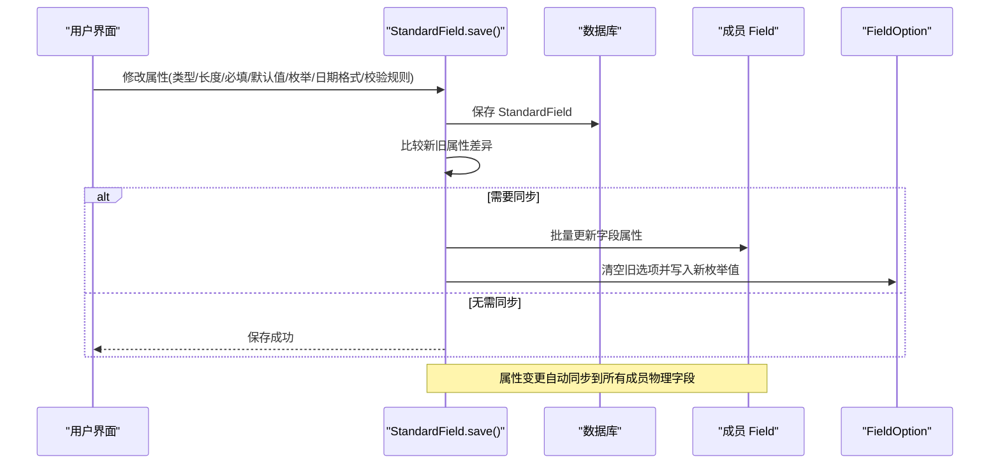
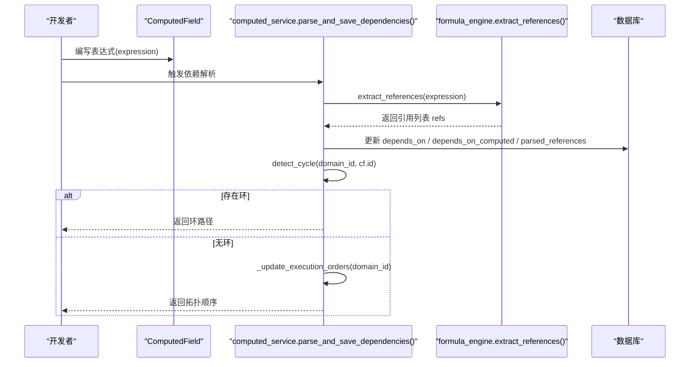
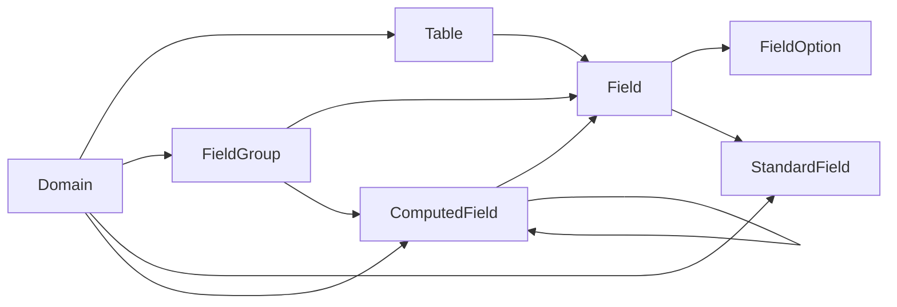

# 字段模型设计

<cite>
**本文引用的文件**   
- [models.py](file://backend/apps/modeling/models.py)
- [computed_service.py](file://backend/apps/modeling/computed_service.py)
- [formula_engine.py](file://backend/apps/modeling/formula_engine.py)
- [custom_functions.py](file://backend/apps/modeling/custom_functions.py)
- [0001_initial.py](file://backend/apps/modeling/migrations/0001_initial.py)
- [0022_add_parent_to_fieldgroup.py](file://backend/apps/modeling/migrations/0022_add_parent_to_fieldgroup.py)
- [0024_computedfield_group.py](file://backend/apps/modeling/migrations/0024_computedfield_group.py)
- [0026_standardfield_primary_field_and_more.py](file://backend/apps/modeling/migrations/0026_standardfield_primary_field_and_more.py)
</cite>

## 目录
1. [引言](#引言)
2. [项目结构](#项目结构)
3. [核心组件](#核心组件)
4. [架构总览](#架构总览)
5. [详细组件分析](#详细组件分析)
6. [依赖关系分析](#依赖关系分析)
7. [性能考虑](#性能考虑)
8. [故障排查指南](#故障排查指南)
9. [结论](#结论)
10. [附录](#附录)

## 引言
本设计文档围绕 MetaData002 系统的“字段模型”展开，聚焦以下目标：
- 详细说明 Field（物理字段）、StandardField（标准字段）、FieldGroup（字段分组）、FieldOption（枚举选项）等实体的表结构设计。
- 解释概念层与物理层的映射关系，包括字段归并、去重和同步机制。
- 描述字段分组的多层级结构与继承关系。
- 说明计算字段的依赖关系和执行顺序管理。
- 提供字段类型系统的设计说明与扩展机制。

该文档旨在帮助数据建模人员、后端工程师与前端开发者统一理解字段模型的语义、存储形态与运行时行为。

## 项目结构
与字段模型相关的核心代码位于 backend/apps/modeling 模块中，关键文件如下：
- models.py：定义 Domain、Table、FieldGroup、StandardField、Field、FieldOption、ComputedField、FieldMapping 等模型。
- computed_service.py：计算字段的依赖解析、DAG 构建、执行顺序更新与批量重算。
- formula_engine.py：Excel 风格公式引擎（词法分析、语法分析、函数库、求值器）。
- custom_functions.py：技术函数插件注册入口，用于扩展公式函数。
- migrations/*：数据库迁移脚本，体现模型演进过程（如 FieldGroup.parent、ComputedField.group、StandardField.primary_field 等）。

图表来源
- [models.py:1-489](file://backend/apps/modeling/models.py#L1-L489)

章节来源
- [models.py:1-489](file://backend/apps/modeling/models.py#L1-L489)

## 核心组件
本节概述字段相关核心实体及其职责：
- Domain：主数据域，作为所有表、字段、分组的顶层组织单元。
- Table：域下的实体表，支持本地表与外部数据源表两种类型。
- FieldGroup：字段分类分组，支持多层嵌套（最多3层），用于字段组织与展示。
- Field：表的物理字段定义，承载具体数据类型、校验规则、分组归属、是否释放到档案等。
- StandardField：概念层一等公民，跨表编码相同/语义相同的冗余字段归并到一个标准字段，属性变更自动同步到成员物理字段。
- FieldOption：枚举类型的选项值，依附于物理字段。
- ComputedField：通过 Excel 风格公式从其他字段推导的计算字段，支持依赖解析与 DAG 执行顺序。
- FieldMapping：表间字段映射关系，支撑跨表关联与数据流转。

章节来源
- [models.py:1-489](file://backend/apps/modeling/models.py#L1-L489)

## 架构总览
字段模型在概念层与物理层之间建立清晰映射：
- 概念层：StandardField 作为“标准字段”，承载统一的业务语义与属性配置。
- 物理层：Field 表示具体表中的物理字段，可被多个 StandardField 成员引用（多对一挂靠）。
- 同步机制：StandardField 的属性变更时，自动同步到其成员 Field；枚举值同步至 FieldOption。
- 分组体系：FieldGroup 支持多级树形结构，Field 与 ComputedField 均可归属分组。
- 计算字段：ComputedField 通过表达式引用物理字段与其他计算字段，系统自动构建 DAG 并维护 execution_order。

图表来源
- [models.py:1-489](file://backend/apps/modeling/models.py#L1-L489)

章节来源
- [models.py:1-489](file://backend/apps/modeling/models.py#L1-L489)

## 详细组件分析

### 字段分组 FieldGroup（多层级设计与继承）
- 设计要点：
  - 支持 parent 自引用实现树形结构，限制最大层级为3层。
  - 提供 level 属性动态计算当前层级。
  - get_descendants 方法递归获取后代分组，支持包含自身。
- 演进历史：
  - 初始创建 FieldGroup（无 parent）。
  - 后续迁移添加 parent 字段，形成父子关系。
- 使用场景：
  - 将 Field 与 ComputedField 按业务维度进行分组展示与管理。

图表来源
- [models.py:125-160](file://backend/apps/modeling/models.py#L125-L160)
- [0022_add_parent_to_fieldgroup.py:1-19](file://backend/apps/modeling/migrations/0022_add_parent_to_fieldgroup.py#L1-L19)

章节来源
- [models.py:125-160](file://backend/apps/modeling/models.py#L125-L160)
- [0022_add_parent_to_fieldgroup.py:1-19](file://backend/apps/modeling/migrations/0022_add_parent_to_fieldgroup.py#L1-L19)

### 标准字段 StandardField（概念层一等公民）
- 设计要点：
  - standard_code 作为标准字段的唯一标识，与 domain 联合唯一。
  - 属性字段涵盖 field_type、length、required、default_value、enum_values、date_format、validation_rule 等。
  - release_to_archive 控制是否释放到档案；is_active 控制启用状态；status 支持 active/discarded。
  - ownership 区分“源系统维护”与“档案维护”。
  - primary_field 指定档案更新的数据源头成员字段；primary_field_manual 标记是否人工指定。
- 同步机制：
  - save() 钩子检测属性变化，调用 _sync_attrs_to_members() 批量更新成员 Field。
  - enum_values 同步时清空旧 FieldOption，重建新选项。
- 主字段分配：
  - auto_assign_primary_field() 根据成员状态与主表优先级自动校准 primary_field，并清除人工指定标记。

图表来源
- [models.py:162-300](file://backend/apps/modeling/models.py#L162-L300)

章节来源
- [models.py:162-300](file://backend/apps/modeling/models.py#L162-L300)
- [0026_standardfield_primary_field_and_more.py:1-40](file://backend/apps/modeling/migrations/0026_standardfield_primary_field_and_more.py#L1-L40)

### 物理字段 Field（数据落点与归档控制）
- 设计要点：
  - 绑定所属表 table，具备 name/code/comment/semantic_note 等元信息。
  - field_type/length/required/default_value/date_format/validation_rule 与 StandardField 对齐。
  - group 归属分组；standard_field 挂靠标准字段；is_primary_key 标记主键。
  - release_to_concept/release_to_archive 控制概念层与档案的释放策略。
  - distinct_values/distinct_synced_at 缓存去重取值样本，供标准字段匹配与人工识别。
  - archive_category 标注基础/计算/未分配；ownership 区分维护方。
- 与 StandardField 的关系：
  - 多对一挂靠，支持“组合字段”场景（多个物理字段归并为一个标准字段）。

章节来源
- [models.py:301-367](file://backend/apps/modeling/models.py#L301-L367)

### 枚举选项 FieldOption（字段值域约束）
- 设计要点：
  - 依附于 Field，包含 label/value/sort_order。
  - unique_together(field, value) 保证同一字段内选项值唯一。
- 与 StandardField 的同步：
  - StandardField 的 enum_values 变更时，自动重建成员的 FieldOption。

章节来源
- [models.py:369-385](file://backend/apps/modeling/models.py#L369-L385)

### 计算字段 ComputedField（依赖解析与执行顺序）
- 设计要点：
  - expression 为 Excel 风格公式，支持 {表名.字段名} 引用语法。
  - depends_on 依赖物理字段；depends_on_computed 依赖其他计算字段。
  - parsed_references 存储解析后的引用列表；execution_order 由 DAG 拓扑排序生成。
  - output_type 指定输出类型；group 支持分组；release_to_archive 控制是否释放到档案。
- 依赖解析流程：
  - parse_and_save_dependencies() 提取引用，区分物理字段与计算字段依赖，更新 M2M 关系。
  - detect_cycle() 检测循环依赖，返回环路径。
  - _update_execution_orders() 基于拓扑排序批量更新 execution_order。
- 重算调度：
  - batch_recalculate() 按 execution_order 遍历记录，计算并写入 ArchiveRecord.data。
  - recalculate_affected() 增量重算受影响的计算字段。

图表来源
- [computed_service.py:21-84](file://backend/apps/modeling/computed_service.py#L21-L84)
- [formula_engine.py:61-64](file://backend/apps/modeling/formula_engine.py#L61-L64)

章节来源
- [models.py:421-472](file://backend/apps/modeling/models.py#L421-L472)
- [computed_service.py:21-208](file://backend/apps/modeling/computed_service.py#L21-L208)
- [0024_computedfield_group.py:1-20](file://backend/apps/modeling/migrations/0024_computedfield_group.py#L1-L20)

### 字段映射 FieldMapping（跨表关系）
- 设计要点：
  - source_table/source_field → target_table/target_field 四元组唯一约束。
  - 用于表达表间字段映射关系，支撑数据流转与一致性检查。

章节来源
- [models.py:474-489](file://backend/apps/modeling/models.py#L474-L489)

## 依赖关系分析
字段模型的核心依赖关系如下：
- Domain 作为根节点，组织 Table、FieldGroup、StandardField、ComputedField。
- Table 包含 Field，Field 可挂靠 StandardField 并拥有 FieldOption。
- ComputedField 依赖 Field 与 ComputedField（自身），通过 M2M 关系表达依赖图。
- FieldGroup 通过 parent 自引用形成树形结构，Field 与 ComputedField 可归属分组。

图表来源
- [models.py:1-489](file://backend/apps/modeling/models.py#L1-L489)

章节来源
- [models.py:1-489](file://backend/apps/modeling/models.py#L1-L489)

## 性能考虑
- 标准字段属性同步：
  - 使用批量 update 减少数据库往返，避免逐条更新成员 Field。
  - 枚举值同步时先清空再插入，确保一致性。
- 计算字段重算：
  - 按 execution_order 顺序处理，避免重复计算与依赖缺失。
  - 支持增量重算（recalculate_affected），仅处理受影响字段。
- 去重缓存：
  - Field.distinct_values 缓存去重取值样本，降低实时查询开销。
  - 按需填充缓存，失败不阻断业务流程。

[本节为通用性能建议，不直接分析具体文件]

## 故障排查指南
- 公式语法错误：
  - 使用 validate_expression() 验证表达式语法，定位 Token 位置与错误原因。
- 字段引用未找到：
  - 检查 parsed_references 是否正确解析，确认上下文 context 是否包含所需字段。
- 循环依赖：
  - detect_cycle() 返回环路径，需调整表达式依赖关系以消除环路。
- 除零与类型不匹配：
  - 公式引擎抛出 FormulaRuntimeError，需在表达式中使用 IFERROR 等函数捕获并降级。

章节来源
- [formula_engine.py:23-52](file://backend/apps/modeling/formula_engine.py#L23-L52)
- [formula_engine.py:775-800](file://backend/apps/modeling/formula_engine.py#L775-L800)
- [computed_service.py:110-161](file://backend/apps/modeling/computed_service.py#L110-L161)

## 结论
MetaData002 的字段模型通过 StandardField 与 Field 的概念-物理分层设计，实现了跨表字段归并与属性同步；FieldGroup 的多层级结构提供了灵活的字段组织方式；ComputedField 的依赖解析与 DAG 执行顺序确保了复杂计算的可靠性与可扩展性。配合公式引擎与自定义函数扩展机制，系统能够支持丰富的业务逻辑与数据处理需求。

[本节为总结性内容，不直接分析具体文件]

## 附录

### 字段类型系统与扩展机制
- 内置类型：string、number、date、boolean、enum。
- 扩展机制：
  - 公式函数通过 @register_function 装饰器注册，支持逻辑、文本、数学、判空、日期等类别。
  - 自定义函数在 custom_functions.py 中实现，遵循固定签名 (args, ctx)，业务错误抛 FormulaRuntimeError。
  - 函数注册后自动纳入语法校验、求值执行与前端函数库展示。

章节来源
- [models.py:173-179](file://backend/apps/modeling/models.py#L173-L179)
- [formula_engine.py:375-387](file://backend/apps/modeling/formula_engine.py#L375-L387)
- [custom_functions.py:1-108](file://backend/apps/modeling/custom_functions.py#L1-L108)

### 初始迁移与模型演进
- 0001_initial.py：创建 Domain、FieldGroup、Table、Field、FieldOption、FieldMapping 等基础表。
- 0022_add_parent_to_fieldgroup.py：为 FieldGroup 添加 parent 字段，支持树形结构。
- 0024_computedfield_group.py：为 ComputedField 添加 group 字段，支持分组。
- 0026_standardfield_primary_field_and_more.py：为 StandardField 添加 primary_field 与 primary_field_manual，并初始化默认主字段。

章节来源
- [0001_initial.py:1-127](file://backend/apps/modeling/migrations/0001_initial.py#L1-L127)
- [0022_add_parent_to_fieldgroup.py:1-19](file://backend/apps/modeling/migrations/0022_add_parent_to_fieldgroup.py#L1-L19)
- [0024_computedfield_group.py:1-20](file://backend/apps/modeling/migrations/0024_computedfield_group.py#L1-L20)
- [0026_standardfield_primary_field_and_more.py:1-40](file://backend/apps/modeling/migrations/0026_standardfield_primary_field_and_more.py#L1-L40)