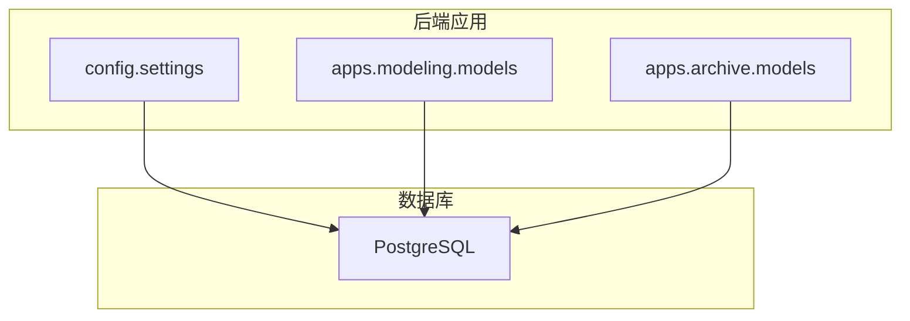
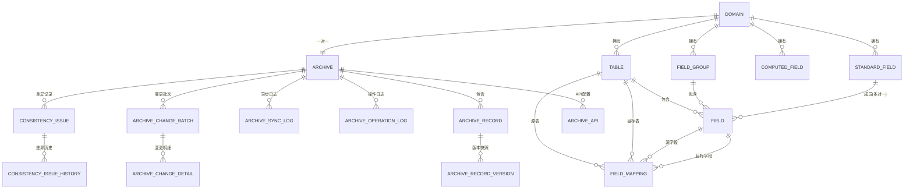
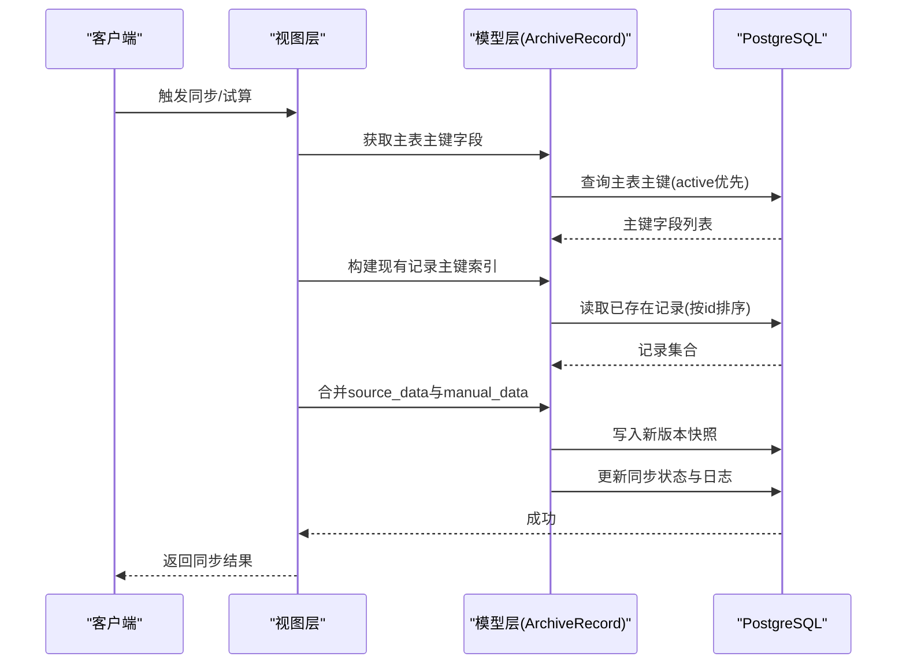

# 数据库设计

<cite>
**本文引用的文件**   
- [backend/config/settings.py](file://backend/config/settings.py)
- [backend/apps/modeling/models.py](file://backend/apps/modeling/models.py)
- [backend/apps/archive/models.py](file://backend/apps/archive/models.py)
- [backend/apps/modeling/migrations/0001_initial.py](file://backend/apps/modeling/migrations/0001_initial.py)
- [backend/apps/modeling/migrations/0002_datasource_table_external_table_name_and_more.py](file://backend/apps/modeling/migrations/0002_datasource_table_external_table_name_and_more.py)
- [backend/apps/modeling/migrations/0006_alter_datasource_db_type.py](file://backend/apps/modeling/migrations/0006_alter_datasource_db_type.py)
- [backend/apps/modeling/migrations/0008_add_is_primary_key_to_field.py](file://backend/apps/modeling/migrations/0008_add_is_primary_key_to_field.py)
- [backend/apps/modeling/migrations/0010_remove_field_equivalence_group_standardfield_and_more.py](file://backend/apps/modeling/migrations/0010_remove_field_equivalence_group_standardfield_and_more.py)
- [backend/apps/modeling/migrations/0016_field_distinct_synced_at_field_distinct_values.py](file://backend/apps/modeling/migrations/0016_field_distinct_synced_at_field_distinct_values.py)
- [backend/apps/modeling/migrations/0026_standardfield_primary_field_and_more.py](file://backend/apps/modeling/migrations/0026_standardfield_primary_field_and_more.py)
</cite>

## 目录
1. [引言](#引言)
2. [项目结构](#项目结构)
3. [核心组件](#核心组件)
4. [架构总览](#架构总览)
5. [详细组件分析](#详细组件分析)
6. [依赖关系分析](#依赖关系分析)
7. [性能与索引策略](#性能与索引策略)
8. [数据流图](#数据流图)
9. [迁移与版本管理](#迁移与版本管理)
10. [故障排查指南](#故障排查指南)
11. [结论](#结论)

## 引言
本文件为 MetaData002 系统的数据库设计文档，聚焦 PostgreSQL 主数据库的表结构设计、实体模型（DataSource、Domain、Table、Field、StandardField 等）、外键约束与级联删除、字段类型选择与验证规则、索引策略与优化方案、ER 图与数据流图，以及数据迁移策略与版本管理。系统采用 Django ORM + PostgreSQL 作为主存储，结合 JSON 字段实现灵活的元数据与档案记录结构，并通过迁移脚本进行结构化演进。

## 项目结构
- 后端使用 Django 应用分层：
  - modeling：建模域的核心模型（DataSource、Domain、Table、Field、FieldGroup、StandardField、ComputedField、FieldMapping、AIConfig 等）
  - archive：档案与同步相关模型（Archive、ArchiveRecord、ArchiveRecordVersion、ArchiveSyncLog、ArchiveOperationLog、ArchiveChangeBatch、ArchiveChangeDetail、ConsistencyIssue、ConsistencyCheckRule、ConsistencyIssueHistory）
- 数据库配置位于 settings.py，默认引擎为 PostgreSQL，连接参数通过环境变量注入。

图表来源
- [backend/config/settings.py:56-66](file://backend/config/settings.py#L56-L66)
- [backend/apps/modeling/models.py:1-489](file://backend/apps/modeling/models.py#L1-L489)
- [backend/apps/archive/models.py:1-379](file://backend/apps/archive/models.py#L1-L379)

章节来源
- [backend/config/settings.py:1-123](file://backend/config/settings.py#L1-L123)

## 核心组件
本节概述核心实体及其职责：
- DataSource：外部数据源配置（支持 PostgreSQL、MySQL、SQL Server、Oracle），用于映射外部表到建模域。
- Domain：主数据域，组织 Table、Field、StandardField 等概念与物理对象。
- Table：域下的实体表，区分本地表与外部数据源表，支持 ER 节点坐标持久化。
- Field：表的字段定义，包含数据类型、长度、必填、默认值、校验规则、分组、标准字段归属、是否主键、释放策略等。
- StandardField：概念层“标准字段”，跨表去重后的统一语义承载体，属性变更自动同步到成员 Field。
- FieldGroup：字段分类分组，支持多层嵌套。
- ComputedField：计算字段，基于 Excel 风格公式推导，支持 DAG 执行顺序。
- FieldMapping：表间字段映射，支撑跨表关联与数据合并。
- Archive 系列：档案配置、记录、版本、同步日志、操作日志、变更批次与明细、一致性检查与历史。

章节来源
- [backend/apps/modeling/models.py:1-489](file://backend/apps/modeling/models.py#L1-L489)
- [backend/apps/archive/models.py:1-379](file://backend/apps/archive/models.py#L1-L379)

## 架构总览
下图展示建模与档案两大模块在数据库中的整体关系，包括域、表、字段、标准字段、档案记录与版本、同步与一致性检查等关键实体。

图表来源
- [backend/apps/modeling/models.py:1-489](file://backend/apps/modeling/models.py#L1-L489)
- [backend/apps/archive/models.py:1-379](file://backend/apps/archive/models.py#L1-L379)

## 详细组件分析

### DataSource（数据源配置）
- 作用：集中管理外部数据源连接信息，支持多种数据库类型。
- 关键字段：名称、数据库类型、主机、端口、库名、用户名、密码、状态、时间戳。
- 约束与验证：名称唯一；数据库类型枚举限制；状态默认 active。
- 用途：Table.data_source 外键指向，用于标识外部表来源。

章节来源
- [backend/apps/modeling/models.py:4-30](file://backend/apps/modeling/models.py#L4-L30)
- [backend/apps/modeling/migrations/0006_alter_datasource_db_type.py:1-26](file://backend/apps/modeling/migrations/0006_alter_datasource_db_type.py#L1-L26)

### Domain（主数据域）
- 作用：业务域边界，聚合表、字段、标准字段等建模对象。
- 关键字段：名称、编码（唯一）、描述、状态、时间戳。
- 方法：get_primary_table() 返回该域的主表（is_primary=True）。

章节来源
- [backend/apps/modeling/models.py:32-58](file://backend/apps/modeling/models.py#L32-L58)

### Table（实体表）
- 作用：表示域内的具体表，区分本地表与外部数据源表。
- 关键字段：所属域、名称、编码、描述、类型、数据源外键、外部表名、schema、是否主表、ER 节点坐标、状态、时间戳。
- 约束：domain+code 唯一；data_source 存在时 type 强制 SOURCE，否则 LOCAL。
- 行为：set_as_primary() 设置主表并自动调整组合字段主字段。

章节来源
- [backend/apps/modeling/models.py:60-123](file://backend/apps/modeling/models.py#L60-L123)
- [backend/apps/modeling/migrations/0002_datasource_table_external_table_name_and_more.py:25-50](file://backend/apps/modeling/migrations/0002_datasource_table_external_table_name_and_more.py#L25-L50)
- [backend/apps/modeling/migrations/0005_table_er_node_x_table_er_node_y.py:1-21](file://backend/apps/modeling/migrations/0005_table_er_node_x_table_er_node_y.py#L1-L21)

### Field（字段定义）
- 作用：描述表字段的数据类型、长度、必填、默认值、日期格式、校验规则、分组、标准字段归属、是否主键、释放策略、排序、状态等。
- 关键字段：table 外键、name、code、comment、semantic_note、field_type、length、required、default_value、date_format、validation_rule、group、standard_field、is_primary_key、release_to_concept、release_to_archive、distinct_values、distinct_synced_at、sort_order、status、ownership、时间戳。
- 约束：table+code 唯一；enum 选项由 FieldOption 维护。
- 行为：与 StandardField 双向关联，支持属性同步与去重样本缓存。

章节来源
- [backend/apps/modeling/models.py:301-367](file://backend/apps/modeling/models.py#L301-L367)
- [backend/apps/modeling/migrations/0008_add_is_primary_key_to_field.py:1-18](file://backend/apps/modeling/migrations/0008_add_is_primary_key_to_field.py#L1-L18)
- [backend/apps/modeling/migrations/0016_field_distinct_synced_at_field_distinct_values.py:1-24](file://backend/apps/modeling/migrations/0016_field_distinct_synced_at_field_distinct_values.py#L1-L24)

### FieldGroup（字段分组）
- 作用：字段分类分组，支持最多三层嵌套。
- 关键字段：domain 外键、parent 自引用、name、sort_order、时间戳。
- 方法：level 计算层级；get_descendants() 递归获取后代。

章节来源
- [backend/apps/modeling/models.py:125-160](file://backend/apps/modeling/models.py#L125-L160)

### StandardField（标准字段）
- 作用：概念层一等公民，跨表去重后统一语义承载体，属性变更自动同步到成员 Field。
- 关键字段：domain 外键、standard_code（唯一）、standard_name、note、source、field_type、length、required、default_value、enum_values、date_format、validation_rule、release_to_archive、is_active、status、ownership、primary_field、primary_field_manual、时间戳。
- 行为：save() 触发属性同步；auto_assign_primary_field() 自动分配主字段；_sync_attrs_to_members() 同步到成员 Field 与 FieldOption。

章节来源
- [backend/apps/modeling/models.py:162-299](file://backend/apps/modeling/models.py#L162-L299)
- [backend/apps/modeling/migrations/0010_remove_field_equivalence_group_standardfield_and_more.py:1-140](file://backend/apps/modeling/migrations/0010_remove_field_equivalence_group_standardfield_and_more.py#L1-L140)
- [backend/apps/modeling/migrations/0026_standardfield_primary_field_and_more.py:1-40](file://backend/apps/modeling/migrations/0026_standardfield_primary_field_and_more.py#L1-L40)

### FieldOption（枚举选项）
- 作用：枚举类型的选项值，与 Field 一对多。
- 关键字段：field 外键、label、value、sort_order、时间戳。
- 约束：field+value 唯一。

章节来源
- [backend/apps/modeling/models.py:369-385](file://backend/apps/modeling/models.py#L369-L385)

### ComputedField（计算字段）
- 作用：通过 Excel 风格公式从其他字段推导，支持依赖解析与 DAG 执行顺序。
- 关键字段：domain 外键、code、name、expression、depends_on、depends_on_computed、parsed_references、execution_order、output_type、group、release_to_archive、status、时间戳。
- 约束：domain+code 唯一。

章节来源
- [backend/apps/modeling/models.py:421-472](file://backend/apps/modeling/models.py#L421-L472)

### FieldMapping（字段映射）
- 作用：表间字段映射，支撑跨表关联与数据合并。
- 关键字段：source_table、source_field、target_table、target_field、时间戳。
- 约束：四元组唯一。

章节来源
- [backend/apps/modeling/models.py:474-489](file://backend/apps/modeling/models.py#L474-L489)

### AIConfig（AI 服务配置）
- 作用：OpenAI 兼容接口连接参数，供 ai_service 优先读取。
- 关键字段：name、provider、api_base、api_key、model、temperature、timeout、enabled、提示词字段、时间戳。

章节来源
- [backend/apps/modeling/models.py:387-419](file://backend/apps/modeling/models.py#L387-L419)

### Archive 系列（档案与同步）
- Archive：档案配置，与 Domain 一对一，包含 schema 快照与版本号。
- ArchiveRecord：档案记录，双层存储（source_data + manual_data），JSON 字段存储合并结果。
- ArchiveRecordVersion：版本快照，记录每次操作的完整数据与 Schema 快照。
- ArchiveSyncLog：同步日志，记录同步过程详情。
- ArchiveOperationLog：操作日志，记录用户操作与变更摘要。
- ArchiveChangeBatch/Detail：变更批次与明细，记录增量变更与字段级旧值→新值。
- ConsistencyIssue/CheckRule/History：一致性差异记录、失效规则与历史轨迹。
- ArchiveApi：对外暴露的档案数据 API 配置。

章节来源
- [backend/apps/archive/models.py:1-379](file://backend/apps/archive/models.py#L1-L379)

## 依赖关系分析
- 外键与级联：
  - Table.domain → CASCADE；Field.table → CASCADE；Field.group → SET_NULL；Field.standard_field → SET_NULL；StandardField.primary_field → SET_NULL。
  - Archive.record → CASCADE；ArchiveRecordVersion.record → CASCADE；ArchiveSyncLog.archive → CASCADE；ArchiveOperationLog.archive → CASCADE；ArchiveChangeBatch.archive → CASCADE；ArchiveChangeDetail.batch → CASCADE；ConsistencyIssue.archive → CASCADE；ConsistencyIssueHistory.issue → CASCADE。
- 唯一约束：
  - Domain.code 唯一；Table.domain+code 唯一；Field.table+code 唯一；FieldOption.field+value 唯一；StandardField.domain+standard_code 唯一；Archive.path 唯一；ArchiveRecordVersion.record+version 唯一；ConsistencyIssue 复合唯一约束；ConsistencyCheckRule 复合唯一约束。
- 索引：
  - ArchiveRecord.archive+status；ArchiveApi.archive+status；ArchiveOperationLog.archive+-created_at；ArchiveChangeBatch.archive+-created_at；ArchiveChangeDetail.archive+-created_at；ConsistencyIssue.archive+status、archive+check_type。

章节来源
- [backend/apps/modeling/models.py:1-489](file://backend/apps/modeling/models.py#L1-L489)
- [backend/apps/archive/models.py:1-379](file://backend/apps/archive/models.py#L1-L379)

## 性能与索引策略
- 复合索引：
  - ArchiveRecord(archive, status) 加速按档案与状态查询。
  - ArchiveApi(archive, status) 加速 API 列表过滤。
  - ArchiveOperationLog(archive, -created_at)、ArchiveChangeBatch(archive, -created_at)、ArchiveChangeDetail(archive, -created_at) 加速按档案分页与时间倒序查询。
  - ConsistencyIssue(archive, status)、ConsistencyIssue(archive, check_type) 加速一致性检查统计与筛选。
- 唯一约束：
  - 领域内编码唯一性（Domain.code、Table.domain+code、Field.table+code、StandardField.domain+standard_code）避免重复建模。
  - FieldOption.field+value 防止枚举重复。
  - ArchiveRecordVersion.record+version 保证版本唯一。
  - ConsistencyIssue 与 ConsistencyCheckRule 的复合唯一约束确保规则与差异记录幂等。
- JSON 字段优化：
  - ArchiveRecord.source_data、manual_data、lineage、overrides 使用 JSON 存储，适合灵活结构与快速写入；建议对常用查询条件建立 GIN 索引（如 data->>'field_code'）以提升检索性能。
  - Field.distinct_values 缓存去重样本，减少实时采样开销。
- 查询优化建议：
  - 针对频繁过滤的字段（如 status、archive、check_type）使用 B-Tree 索引。
  - 对 JSON 字段中热点键使用 GIN 或表达式索引。
  - 避免全表扫描，合理拆分大表与归档历史。

章节来源
- [backend/apps/archive/models.py:63-70](file://backend/apps/archive/models.py#L63-L70)
- [backend/apps/archive/models.py:162-169](file://backend/apps/archive/models.py#L162-L169)
- [backend/apps/archive/models.py:194-201](file://backend/apps/archive/models.py#L194-L201)
- [backend/apps/archive/models.py:223-230](file://backend/apps/archive/models.py#L223-L230)
- [backend/apps/archive/models.py:262-269](file://backend/apps/archive/models.py#L262-L269)
- [backend/apps/archive/models.py:324-332](file://backend/apps/archive/models.py#L324-L332)

## 数据流图
以下序列图展示档案同步过程中，系统如何根据主表主键识别记录、合并 source_data 与 manual_data、生成版本快照与同步日志的关键流程。

图表来源
- [backend/apps/archive/views.py:811-843](file://backend/apps/archive/views.py#L811-L843)
- [backend/apps/archive/models.py:33-73](file://backend/apps/archive/models.py#L33-L73)

## 迁移与版本管理
- 初始结构：
  - 0001_initial.py：创建 Domain、FieldGroup、Table、Field、FieldOption、FieldMapping。
- 演进与重构：
  - 0002：引入 DataSource 外键与 external_table_name，废弃旧 source_config。
  - 0006：扩展 DataSource.db_type 枚举（支持 MySQL、SQL Server、Oracle）。
  - 0008：为 Field 增加 is_primary_key 标记。
  - 0010：将 FieldEquivalenceGroup 重命名为 StandardField，并新增大量属性字段（field_type、length、required、default_value、enum_values、date_format、validation_rule、updated_at），同时重命名字段 equivalence_group → standard_field。
  - 0016：为 Field 增加 distinct_values 与 distinct_synced_at，用于去重样本缓存。
  - 0026：为 StandardField 增加 primary_field 与 primary_field_manual，并执行数据迁移以默认分配主字段。
- 版本管理策略：
  - 使用 Django migrations 管理数据库结构演进，每个迁移文件对应一次结构变更。
  - 对于破坏性变更（重命名、字段类型变更）提供 RunPython 数据迁移脚本，确保存量数据平滑过渡。
  - 通过 unique_together 与 constraints 保证数据一致性与幂等性。

章节来源
- [backend/apps/modeling/migrations/0001_initial.py:1-127](file://backend/apps/modeling/migrations/0001_initial.py#L1-L127)
- [backend/apps/modeling/migrations/0002_datasource_table_external_table_name_and_more.py:25-50](file://backend/apps/modeling/migrations/0002_datasource_table_external_table_name_and_more.py#L25-L50)
- [backend/apps/modeling/migrations/0006_alter_datasource_db_type.py:1-26](file://backend/apps/modeling/migrations/0006_alter_datasource_db_type.py#L1-L26)
- [backend/apps/modeling/migrations/0008_add_is_primary_key_to_field.py:1-18](file://backend/apps/modeling/migrations/0008_add_is_primary_key_to_field.py#L1-L18)
- [backend/apps/modeling/migrations/0010_remove_field_equivalence_group_standardfield_and_more.py:1-140](file://backend/apps/modeling/migrations/0010_remove_field_equivalence_group_standardfield_and_more.py#L1-L140)
- [backend/apps/modeling/migrations/0016_field_distinct_synced_at_field_distinct_values.py:1-24](file://backend/apps/modeling/migrations/0016_field_distinct_synced_at_field_distinct_values.py#L1-L24)
- [backend/apps/modeling/migrations/0026_standardfield_primary_field_and_more.py:1-40](file://backend/apps/modeling/migrations/0026_standardfield_primary_field_and_more.py#L1-L40)

## 故障排查指南
- 常见错误：
  - 未配置主键字段导致无法试算或同步：需确保主表至少一个 is_primary_key=True 的活跃字段。
  - 数据源连接失败：检查 DataSource.host/port/db_name/username/password 及驱动包安装。
  - JSON 字段查询性能问题：为热点键添加 GIN 索引或表达式索引。
  - 一致性差异告警过多：检查组合字段主字段与成员值一致性规则，必要时禁用特定规则。
- 定位方法：
  - 查看 ArchiveSyncLog.details 与 ArchiveOperationLog.change_summary 获取同步与操作详情。
  - 检查 ConsistencyIssue.status 与 review_note 了解差异处理状态。
  - 使用 ArchiveRecord.lineage 追踪字段值来源与更新时间。

章节来源
- [backend/apps/archive/views.py:811-843](file://backend/apps/archive/views.py#L811-L843)
- [backend/apps/archive/models.py:112-137](file://backend/apps/archive/models.py#L112-L137)
- [backend/apps/archive/models.py:174-204](file://backend/apps/archive/models.py#L174-L204)
- [backend/apps/archive/models.py:274-332](file://backend/apps/archive/models.py#L274-L332)

## 结论
MetaData002 的数据库设计以 Domain 为核心组织单元，通过 Table、Field、StandardField 等实体实现概念与物理模型的解耦与统一。借助 JSON 字段与丰富的约束、索引策略，系统在保持灵活性的同时兼顾了性能与一致性。迁移脚本确保了结构的平滑演进，档案与同步模块提供了完整的版本管理与一致性保障。建议在后续迭代中持续优化 JSON 字段索引与查询路径，并结合业务负载调整索引与分区策略。