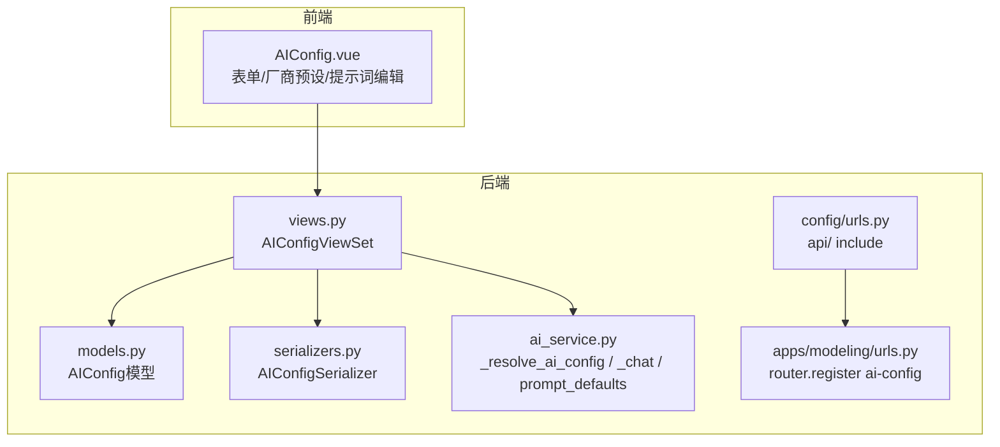
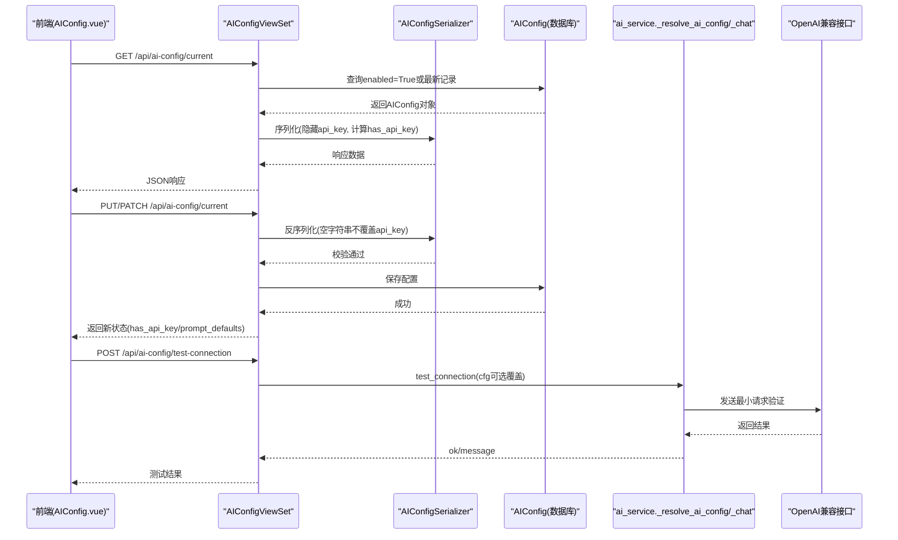
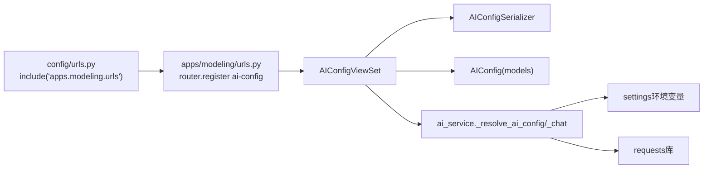

# AI配置模型

<cite>
**本文引用的文件**   
- [backend/apps/modeling/models.py](file://backend/apps/modeling/models.py)
- [backend/apps/modeling/serializers.py](file://backend/apps/modeling/serializers.py)
- [backend/apps/modeling/views.py](file://backend/apps/modeling/views.py)
- [backend/apps/modeling/ai_service.py](file://backend/apps/modeling/ai_service.py)
- [backend/apps/modeling/migrations/0017_aiconfig.py](file://backend/apps/modeling/migrations/0017_aiconfig.py)
- [backend/apps/modeling/migrations/0018_aiconfig_prompt_auto_group_aiconfig_prompt_dedup_and_more.py](file://backend/apps/modeling/migrations/0018_aiconfig_prompt_auto_group_aiconfig_prompt_dedup_and_more.py)
- [backend/apps/modeling/urls.py](file://backend/apps/modeling/urls.py)
- [backend/config/urls.py](file://backend/config/urls.py)
- [frontend/src/views/settings/AIConfig.vue](file://frontend/src/views/settings/AIConfig.vue)
</cite>

## 目录
1. [简介](#简介)
2. [项目结构](#项目结构)
3. [核心组件](#核心组件)
4. [架构总览](#架构总览)
5. [详细组件分析](#详细组件分析)
6. [依赖关系分析](#依赖关系分析)
7. [性能考量](#性能考量)
8. [故障排查指南](#故障排查指南)
9. [结论](#结论)
10. [附录](#附录)

## 简介
本文件面向AI服务配置（AIConfig）实体的数据库设计，围绕OpenAI兼容接口的配置管理进行系统化说明。内容涵盖：
- 服务厂商预设、接口地址配置、API密钥管理
- 提示词模板配置（字段分组、语义识别、跨表去重检测、Excel字段推断）
- 采样参数设置与超时控制
- 单例配置管理模式与多厂商支持机制
- 完整字段说明、配置示例与安全注意事项

该设计确保系统以“单条生效”的配置驱动AI能力，并在无LLM或调用失败时自动降级到启发式方案，保证功能可用性与稳定性。

## 项目结构
AIConfig相关代码分布在后端模型、序列化器、视图集、AI服务层以及前端配置页面中，路由通过Django REST Framework注册。

图表来源
- [backend/apps/modeling/models.py:387-419](file://backend/apps/modeling/models.py#L387-L419)
- [backend/apps/modeling/serializers.py:248-279](file://backend/apps/modeling/serializers.py#L248-L279)
- [backend/apps/modeling/views.py:1780-1805](file://backend/apps/modeling/views.py#L1780-L1805)
- [backend/apps/modeling/ai_service.py:19-48](file://backend/apps/modeling/ai_service.py#L19-L48)
- [backend/apps/modeling/urls.py:14](file://backend/apps/modeling/urls.py#L14)
- [backend/config/urls.py:6](file://backend/config/urls.py#L6)
- [frontend/src/views/settings/AIConfig.vue:114-128](file://frontend/src/views/settings/AIConfig.vue#L114-L128)

章节来源
- [backend/apps/modeling/models.py:387-419](file://backend/apps/modeling/models.py#L387-L419)
- [backend/apps/modeling/serializers.py:248-279](file://backend/apps/modeling/serializers.py#L248-L279)
- [backend/apps/modeling/views.py:1780-1805](file://backend/apps/modeling/views.py#L1780-L1805)
- [backend/apps/modeling/ai_service.py:19-48](file://backend/apps/modeling/ai_service.py#L19-L48)
- [backend/apps/modeling/urls.py:14](file://backend/apps/modeling/urls.py#L14)
- [backend/config/urls.py:6](file://backend/config/urls.py#L6)
- [frontend/src/views/settings/AIConfig.vue:114-128](file://frontend/src/views/settings/AIConfig.vue#L114-L128)

## 核心组件
- 数据模型：AIConfig（单例配置，存储连接参数、采样参数、超时、提示词模板等）
- 序列化器：AIConfigSerializer（保护API Key回显，提供has_api_key标识与prompt_defaults）
- 视图集：AIConfigViewSet（current获取/更新生效配置；test-connection测试连接）
- AI服务层：_resolve_ai_config（优先DB配置，回退环境变量）、_chat（OpenAI兼容调用）、prompt_defaults（内置提示词默认值）
- 前端页面：AIConfig.vue（厂商预设、接口地址、模型选择、提示词编辑、保存与测试）

章节来源
- [backend/apps/modeling/models.py:387-419](file://backend/apps/modeling/models.py#L387-L419)
- [backend/apps/modeling/serializers.py:248-279](file://backend/apps/modeling/serializers.py#L248-L279)
- [backend/apps/modeling/views.py:1780-1805](file://backend/apps/modeling/views.py#L1780-L1805)
- [backend/apps/modeling/ai_service.py:19-48](file://backend/apps/modeling/ai_service.py#L19-L48)
- [frontend/src/views/settings/AIConfig.vue:114-128](file://frontend/src/views/settings/AIConfig.vue#L114-L128)

## 架构总览
AIConfig作为系统级单例配置，被AI服务层在运行时解析并用于OpenAI兼容接口调用。前端通过REST API进行配置管理与测试。

图表来源
- [backend/apps/modeling/views.py:1780-1805](file://backend/apps/modeling/views.py#L1780-L1805)
- [backend/apps/modeling/serializers.py:248-279](file://backend/apps/modeling/serializers.py#L248-L279)
- [backend/apps/modeling/ai_service.py:78-89](file://backend/apps/modeling/ai_service.py#L78-L89)
- [backend/apps/modeling/ai_service.py:56-75](file://backend/apps/modeling/ai_service.py#L56-L75)

## 详细组件分析

### 数据模型：AIConfig
- 字段说明
  - id: 自增主键
  - name: 配置名称（默认“默认AI配置”）
  - provider: 服务厂商（deepseek/openai/qwen/zhipu/moonshot/custom），影响默认接口地址与模型
  - api_base: OpenAI兼容Base URL（默认指向DeepSeek）
  - api_key: API密钥（写保护，序列化器不返回明文）
  - model: 模型名称（默认与provider匹配）
  - temperature: 采样温度（默认0.2）
  - timeout: 超时时间（秒，默认30）
  - enabled: 启用标志（true则优先使用此配置）
  - prompt_auto_group: 字段分组提示词（仅指令部分）
  - prompt_semantic: 语义识别提示词
  - prompt_dedup: 跨表去重检测提示词
  - prompt_infer: Excel字段推断提示词
  - created_at/updated_at: 审计时间戳

- 复杂度与约束
  - 单例模式：系统只取enabled=True的一条作为生效配置；若无记录则自动创建默认
  - 字段类型：字符型、浮点、整型、布尔、文本、JSON（迁移阶段未使用JSON）
  - 默认排序：按更新时间倒序

章节来源
- [backend/apps/modeling/models.py:387-419](file://backend/apps/modeling/models.py#L387-L419)
- [backend/apps/modeling/migrations/0017_aiconfig.py:12-33](file://backend/apps/modeling/migrations/0017_aiconfig.py#L12-L33)
- [backend/apps/modeling/migrations/0018_aiconfig_prompt_auto_group_aiconfig_prompt_dedup_and_more.py:12-48](file://backend/apps/modeling/migrations/0018_aiconfig_prompt_auto_group_aiconfig_prompt_dedup_and_more.py#L12-L48)

### 序列化器：AIConfigSerializer
- 关键行为
  - api_key为write_only，避免明文回显；提供has_api_key布尔标识是否已配置
  - prompt_defaults返回内置提示词默认值，供前端展示/恢复默认
  - update逻辑：若传入空字符串的api_key则忽略，防止误清空

章节来源
- [backend/apps/modeling/serializers.py:248-279](file://backend/apps/modeling/serializers.py#L248-L279)

### 视图集：AIConfigViewSet
- current端点
  - GET：返回生效配置（优先enabled=True，否则按更新时间排序首条）
  - PUT/PATCH：部分更新生效配置（支持partial）
- test-connection端点
  - POST：可传入临时配置覆盖测试，不传则使用当前生效配置

章节来源
- [backend/apps/modeling/views.py:1780-1805](file://backend/apps/modeling/views.py#L1780-L1805)

### AI服务层：ai_service
- _resolve_ai_config
  - 优先读取数据库AIConfig（enabled=True）
  - 回退到settings环境变量（AI_API_BASE/AI_API_KEY/AI_MODEL/AI_TIMEOUT）
  - 返回统一字典：api_base/api_key/model/temperature/timeout
- _chat
  - 构造OpenAI兼容请求（chat/completions），携带model、messages、temperature、response_format=json_object
  - 使用Authorization Bearer与Content-Type application/json
- prompt_defaults
  - 返回四个提示词的内置默认值（字段分组、语义识别、跨表去重检测、Excel字段推断）

章节来源
- [backend/apps/modeling/ai_service.py:19-48](file://backend/apps/modeling/ai_service.py#L19-L48)
- [backend/apps/modeling/ai_service.py:56-75](file://backend/apps/modeling/ai_service.py#L56-L75)
- [backend/apps/modeling/ai_service.py:164-166](file://backend/apps/modeling/ai_service.py#L164-L166)

### 前端：AIConfig.vue
- 厂商预设
  - deepseek/openai/qwen/zhipu/moonshot/custom，切换后自动填充api_base与模型列表
- 模型选择
  - 扁平化模型索引，选择预设模型自动带出provider与api_base
- 提示词编辑
  - 支持恢复默认（从prompt_defaults加载）
- 保存与测试
  - 保存时若enabled且未配置api_key则提示必填
  - 测试连接支持临时覆盖配置

章节来源
- [frontend/src/views/settings/AIConfig.vue:114-128](file://frontend/src/views/settings/AIConfig.vue#L114-L128)
- [frontend/src/views/settings/AIConfig.vue:207-231](file://frontend/src/views/settings/AIConfig.vue#L207-L231)
- [frontend/src/views/settings/AIConfig.vue:256-273](file://frontend/src/views/settings/AIConfig.vue#L256-L273)
- [frontend/src/views/settings/AIConfig.vue:275-289](file://frontend/src/views/settings/AIConfig.vue#L275-L289)

## 依赖关系分析
- 路由注册
  - apps/modeling/urls.py将ai-config注册到DefaultRouter
  - config/urls.py将api路径包含apps.modeling.urls
- 运行时依赖
  - ai_service依赖requests库发起HTTP请求
  - settings环境变量作为回退配置源

图表来源
- [backend/config/urls.py:6](file://backend/config/urls.py#L6)
- [backend/apps/modeling/urls.py:14](file://backend/apps/modeling/urls.py#L14)
- [backend/apps/modeling/views.py:1780-1805](file://backend/apps/modeling/views.py#L1780-L1805)
- [backend/apps/modeling/serializers.py:248-279](file://backend/apps/modeling/serializers.py#L248-L279)
- [backend/apps/modeling/models.py:387-419](file://backend/apps/modeling/models.py#L387-L419)
- [backend/apps/modeling/ai_service.py:19-48](file://backend/apps/modeling/ai_service.py#L19-L48)

章节来源
- [backend/config/urls.py:6](file://backend/config/urls.py#L6)
- [backend/apps/modeling/urls.py:14](file://backend/apps/modeling/urls.py#L14)
- [backend/apps/modeling/views.py:1780-1805](file://backend/apps/modeling/views.py#L1780-L1805)
- [backend/apps/modeling/serializers.py:248-279](file://backend/apps/modeling/serializers.py#L248-L279)
- [backend/apps/modeling/models.py:387-419](file://backend/apps/modeling/models.py#L387-L419)
- [backend/apps/modeling/ai_service.py:19-48](file://backend/apps/modeling/ai_service.py#L19-L48)

## 性能考量
- 配置解析开销：_resolve_ai_config每次调用均查询数据库（enabled=True），建议在应用启动时缓存生效配置，减少频繁查询
- HTTP调用超时：timeout默认30秒，可根据网络与服务端响应调整，避免阻塞请求
- 降级策略：当LLM不可用时自动回退启发式算法，保障功能可用性
- 序列化优化：AIConfigSerializer避免回显api_key，降低敏感信息泄露风险

[本节为通用指导，无需具体文件引用]

## 故障排查指南
- 连接失败
  - 检查api_key是否正确配置（has_api_key=false表示未配置）
  - 检查api_base是否为OpenAI兼容接口地址
  - 检查network连通性与防火墙规则
- 调用异常
  - 查看ai_service._chat抛出的异常信息（如HTTP状态码、JSON解析错误）
  - 确认requests库已安装
- 提示词无效
  - 确认prompt_*字段是否填写正确（留空则使用内置默认）
  - 使用“恢复默认”按钮回填内置提示词后再微调

章节来源
- [backend/apps/modeling/ai_service.py:78-89](file://backend/apps/modeling/ai_service.py#L78-L89)
- [backend/apps/modeling/serializers.py:267-278](file://backend/apps/modeling/serializers.py#L267-L278)
- [frontend/src/views/settings/AIConfig.vue:256-273](file://frontend/src/views/settings/AIConfig.vue#L256-L273)

## 结论
AIConfig实体实现了OpenAI兼容接口的集中化管理，支持多厂商预设、灵活提示词定制与严格的密钥保护。通过单例配置模式与降级策略，系统在具备LLM时获得更智能的能力，在无LLM或调用失败时仍能稳定运行。建议在生产环境启用配置缓存、合理设置超时与重试策略，并严格管理API密钥。

[本节为总结性内容，无需具体文件引用]

## 附录

### 字段说明表
- id: 主键
- name: 配置名称
- provider: 服务厂商（deepseek/openai/qwen/zhipu/moonshot/custom）
- api_base: OpenAI兼容Base URL
- api_key: API密钥（写保护）
- model: 模型名称
- temperature: 采样温度（0~2）
- timeout: 超时时间（秒）
- enabled: 启用标志
- prompt_auto_group: 字段分组提示词
- prompt_semantic: 语义识别提示词
- prompt_dedup: 跨表去重检测提示词
- prompt_infer: Excel字段推断提示词
- created_at/updated_at: 审计时间戳

章节来源
- [backend/apps/modeling/models.py:387-419](file://backend/apps/modeling/models.py#L387-L419)

### 配置示例
- 基础配置（DeepSeek）
  - provider: deepseek
  - api_base: https://api.deepseek.com/v1
  - model: deepseek-chat
  - temperature: 0.2
  - timeout: 30
  - enabled: true
- 自定义厂商
  - provider: custom
  - api_base: 自定义OpenAI兼容接口地址
  - model: 自定义模型名
  - temperature/timeout: 根据需求调整
  - enabled: true/false

章节来源
- [backend/apps/modeling/models.py:394-401](file://backend/apps/modeling/models.py#L394-L401)
- [frontend/src/views/settings/AIConfig.vue:114-121](file://frontend/src/views/settings/AIConfig.vue#L114-L121)

### 安全注意事项
- API密钥保护
  - api_key为write_only，序列化器不返回明文
  - has_api_key用于前端显示是否已配置
- 最小权限原则
  - 限制访问AIConfig的管理权限
- 传输加密
  - 确保HTTPS传输，避免中间人攻击
- 日志脱敏
  - 禁止在日志中输出api_key与敏感请求体

章节来源
- [backend/apps/modeling/serializers.py:254-278](file://backend/apps/modeling/serializers.py#L254-L278)