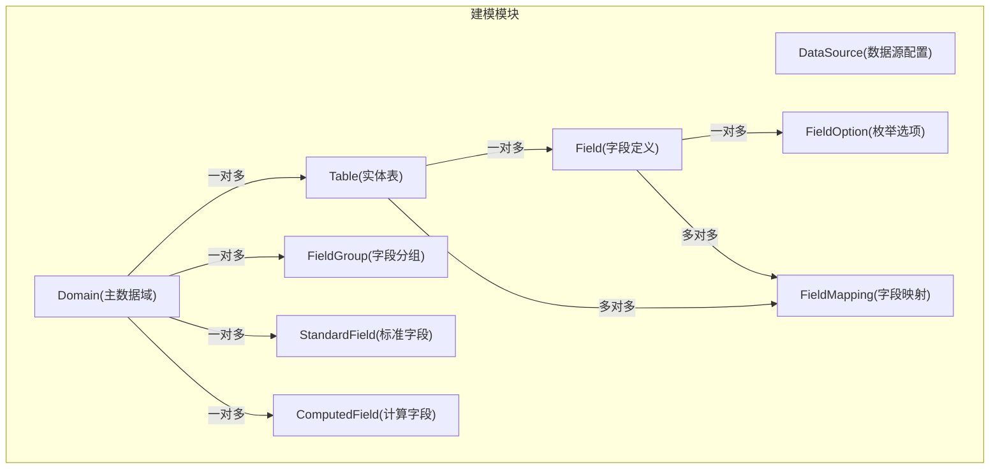
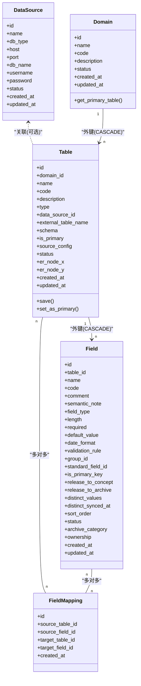
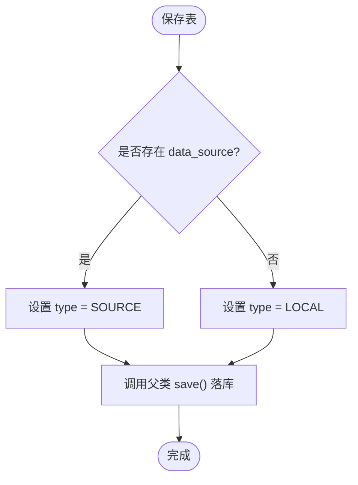
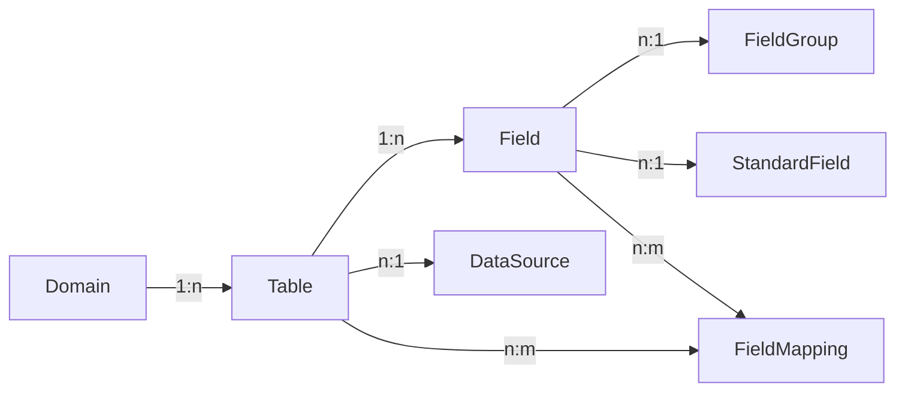

# 域与表模型

<cite>
**本文引用的文件**   
- [models.py](file://backend/apps/modeling/models.py)
- [0001_initial.py](file://backend/apps/modeling/migrations/0001_initial.py)
- [0002_datasource_table_external_table_name_and_more.py](file://backend/apps/modeling/migrations/0002_datasource_table_external_table_name_and_more.py)
- [0012_table_is_primary.py](file://backend/apps/modeling/migrations/0012_table_is_primary.py)
- [0026_standardfield_primary_field_and_more.py](file://backend/apps/modeling/migrations/0026_standardfield_primary_field_and_more.py)
- [views.py](file://backend/apps/modeling/views.py)
- [tests.py](file://backend/apps/modeling/tests.py)
</cite>

## 目录
1. [简介](#简介)
2. [项目结构](#项目结构)
3. [核心组件](#核心组件)
4. [架构总览](#架构总览)
5. [详细组件分析](#详细组件分析)
6. [依赖关系分析](#依赖关系分析)
7. [性能考量](#性能考量)
8. [故障排查指南](#故障排查指南)
9. [结论](#结论)
10. [附录](#附录)

## 简介
本文件围绕 Domain（主数据域）与 Table（实体表）两个核心实体，给出面向数据库设计的完整说明。内容涵盖：
- 域的层次结构管理策略与现状
- 表的分类（本地数据表 vs 数据源表）及其业务含义、使用场景
- 主表标识机制与级联删除策略
- 域与表的一对多关系、字段归属与映射
- 完整的字段说明、关系映射与关键业务规则

该设计服务于“主数据建模”与“档案化”的上下游流程，确保跨系统、跨库的数据在概念层与物理层的一致性与可追溯性。

## 项目结构
- 领域模型定义位于后端应用 modeling 的 models.py 中，包含 DataSource、Domain、Table、FieldGroup、StandardField、Field、FieldOption、ComputedField、FieldMapping 等模型。
- 数据库迁移文件记录了各字段的演进历史，包括新增数据源关联、外部表名、模式、主表标识、标准字段主字段等。
- 视图层提供域配置完整性检查与 API 访问入口，测试用例覆盖主表获取与唯一性约束。

图表来源
- [models.py:4-122](file://backend/apps/modeling/models.py#L4-L122)
- [models.py:125-160](file://backend/apps/modeling/models.py#L125-L160)
- [models.py:162-300](file://backend/apps/modeling/models.py#L162-L300)
- [models.py:301-385](file://backend/apps/modeling/models.py#L301-L385)
- [models.py:421-489](file://backend/apps/modeling/models.py#L421-L489)

章节来源
- [models.py:1-489](file://backend/apps/modeling/models.py#L1-L489)
- [0001_initial.py:1-127](file://backend/apps/modeling/migrations/0001_initial.py#L1-L127)
- [0002_datasource_table_external_table_name_and_more.py:1-51](file://backend/apps/modeling/migrations/0002_datasource_table_external_table_name_and_more.py#L1-L51)
- [0012_table_is_primary.py:1-19](file://backend/apps/modeling/migrations/0012_table_is_primary.py#L1-L19)
- [0026_standardfield_primary_field_and_more.py:1-40](file://backend/apps/modeling/migrations/0026_standardfield_primary_field_and_more.py#L1-L40)

## 核心组件
- DataSource（数据源配置）：集中管理外部数据库连接信息，供“数据源表”引用。
- Domain（主数据域）：概念上的主数据集合，作为表与字段的组织边界。
- Table（实体表）：域下的具体物理或逻辑表，支持本地表与数据源表两类。
- Field（字段定义）：表级别的物理字段，承载类型、校验、归档策略等。
- StandardField（标准字段）：概念层字段，用于跨表去重与统一属性管理。
- FieldGroup（字段分组）：支持多层嵌套的字段分组，便于组织与管理。
- FieldOption（枚举选项）：枚举字段的取值项。
- ComputedField（计算字段）：基于表达式从其他字段推导的新字段。
- FieldMapping（字段映射）：表间字段映射，支撑多表关系与数据合并。

章节来源
- [models.py:4-122](file://backend/apps/modeling/models.py#L4-L122)
- [models.py:125-160](file://backend/apps/modeling/models.py#L125-L160)
- [models.py:162-300](file://backend/apps/modeling/models.py#L162-L300)
- [models.py:301-385](file://backend/apps/modeling/models.py#L301-L385)
- [models.py:421-489](file://backend/apps/modeling/models.py#L421-L489)

## 架构总览
下图展示 Domain 与 Table 的核心关系及关键外键策略，以及它们与 Field、FieldMapping 的交互。

图表来源
- [models.py:4-122](file://backend/apps/modeling/models.py#L4-L122)
- [models.py:125-160](file://backend/apps/modeling/models.py#L125-L160)
- [models.py:162-300](file://backend/apps/modeling/models.py#L162-L300)
- [models.py:301-385](file://backend/apps/modeling/models.py#L301-L385)
- [models.py:421-489](file://backend/apps/modeling/models.py#L421-L489)

## 详细组件分析

### Domain（主数据域）
- 作用：作为主数据的组织边界，所有表、字段、标准字段、计算字段均归属于某个域。
- 关键字段：名称、编码（唯一）、描述、状态、时间戳。
- 层次结构：当前模型未实现层级（parent/children），通过 code/name 进行扁平化管理；如需层次化，可在 Domain 上扩展 parent 自引用外键并限制深度。
- 主表查询：提供 get_primary_table() 方法，返回该域下 is_primary=True 且状态为 active 的主表。

章节来源
- [models.py:32-57](file://backend/apps/modeling/models.py#L32-L57)
- [0001_initial.py:15-31](file://backend/apps/modeling/migrations/0001_initial.py#L15-L31)

### Table（实体表）
- 作用：域下的具体实体表，分为本地数据表与数据源表两类。
- 表类型与业务含义：
  - 本地数据表（local）：由本系统维护的物理表，通常用于档案落库或中间处理。
  - 数据源表（source）：指向外部数据库中的表，需关联 DataSource，并指定 external_table_name 与 schema。
- 主表标识：is_primary 标记该域的主表，每个域仅一个主表；变更主表时自动调整组合字段的主字段归属。
- 外键策略：
  - domain 外键采用 CASCADE 删除，即删除域时级联删除其所有表。
  - data_source 外键采用 SET_NULL，删除数据源不影响表记录，但会清空关联。
- 保存约束：save() 中强制 type 与 data_source 的一致性（有 data_source 则 type=SOURCE，否则 LOCAL）。
- ER 图坐标：er_node_x、er_node_y 用于前端可视化持久化。

图表来源
- [models.py:102-108](file://backend/apps/modeling/models.py#L102-L108)

章节来源
- [models.py:60-122](file://backend/apps/modeling/models.py#L60-L122)
- [0001_initial.py:47-67](file://backend/apps/modeling/migrations/0001_initial.py#L47-L67)
- [0002_datasource_table_external_table_name_and_more.py:35-50](file://backend/apps/modeling/migrations/0002_datasource_table_external_table_name_and_more.py#L35-L50)
- [0012_table_is_primary.py:12-18](file://backend/apps/modeling/migrations/0012_table_is_primary.py#L12-L18)

### Field（字段定义）
- 作用：表级别的物理字段，承载数据类型、长度、必填、默认值、日期格式、校验规则、分组、标准字段挂靠、主键标记、归档策略、所有权等。
- 与标准字段的关系：standard_field 外键将物理字段归并到概念层标准字段，实现跨表去重与属性同步。
- 归档策略：release_to_archive 控制是否进入档案；ownership 控制源系统与档案侧的维护权限。
- 排序与分组：sort_order 与 group 外键用于 UI 展示与组织。

章节来源
- [models.py:301-385](file://backend/apps/modeling/models.py#L301-L385)
- [0001_initial.py:68-92](file://backend/apps/modeling/migrations/0001_initial.py#L68-L92)

### StandardField（标准字段）
- 作用：概念层一等公民，聚合跨表语义相同的字段，统一属性配置与同步。
- 主字段策略：primary_field 指定档案更新的数据源头成员字段；primary_field_manual 标记是否人工指定。
- 自动分配：当主表变更时，自动分配的 primary_field 跟随新主表成员切换；人工指定的保持不变。

章节来源
- [models.py:162-300](file://backend/apps/modeling/models.py#L162-L300)
- [0026_standardfield_primary_field_and_more.py:7-39](file://backend/apps/modeling/migrations/0026_standardfield_primary_field_and_more.py#L7-L39)

### FieldGroup（字段分组）
- 作用：支持最多三层嵌套的分组结构，便于组织字段。
- 层级计算：level 属性动态计算当前分组层级。
- 后代查询：get_descendants() 递归获取所有后代分组。

章节来源
- [models.py:125-160](file://backend/apps/modeling/models.py#L125-L160)
- [0001_initial.py:32-46](file://backend/apps/modeling/migrations/0001_initial.py#L32-L46)

### FieldMapping（字段映射）
- 作用：定义表间字段映射关系，支撑多表关系与数据合并。
- 约束：唯一性约束保证同一源表-源字段-目标表-目标字段组合不重复。

章节来源
- [models.py:474-489](file://backend/apps/modeling/models.py#L474-L489)
- [0001_initial.py:110-126](file://backend/apps/modeling/migrations/0001_initial.py#L110-L126)

## 依赖关系分析
- 域与表：一对多，删除域时级联删除其所有表。
- 表与字段：一对多，删除表时级联删除其所有字段。
- 表与数据源：多对一（可选），删除数据源时表记录保留但关联置空。
- 字段与标准字段：多对一（可选），删除标准字段不影响物理字段。
- 字段映射：多对多，删除源/目标表或字段时级联删除映射。

图表来源
- [models.py:4-122](file://backend/apps/modeling/models.py#L4-L122)
- [models.py:125-160](file://backend/apps/modeling/models.py#L125-L160)
- [models.py:162-300](file://backend/apps/modeling/models.py#L162-L300)
- [models.py:301-385](file://backend/apps/modeling/models.py#L301-L385)
- [models.py:421-489](file://backend/apps/modeling/models.py#L421-L489)

章节来源
- [models.py:1-489](file://backend/apps/modeling/models.py#L1-L489)

## 性能考量
- 外键级联删除：Domain 与 Table 的 CASCADE 删除在大体量数据时需评估事务开销与锁竞争，建议在批量操作前进行预检与分批删除。
- 查询优化：Domain.get_primary_table() 通过过滤 is_primary 与 status 获取主表，建议为 (domain, is_primary, status) 建立复合索引以提升查询效率。
- 同步成本：StandardField 属性同步到成员 Field 时涉及批量更新与枚举选项重建，应结合事务与批量操作减少 IO。
- 数据源表：外部表名与 schema 的解析与访问可能带来网络延迟，建议在缓存与批处理层面优化。

[本节为通用指导，不直接分析具体文件]

## 故障排查指南
- 域启用失败：检查 P0 级配置完整性（主表存在、主表主键非空、字段编码非空、标准字段编码唯一等）。
- 数据源表无法同步：确认 data_source 已正确关联，external_table_name 与 schema 与实际一致。
- 主表变更异常：验证 set_as_primary() 是否正确执行，检查 StandardField.primary_field 是否按预期切换。
- 唯一性冲突：Table.domain_code 唯一约束、Field.table_code 唯一约束、FieldMapping 四元组唯一约束可能导致写入失败。

章节来源
- [views.py:328-427](file://backend/apps/modeling/views.py#L328-L427)
- [tests.py:109-146](file://backend/apps/modeling/tests.py#L109-L146)

## 结论
Domain 与 Table 的设计以“域”为组织边界，以“表”为实体载体，通过类型区分本地与外部数据源，并通过主表标识与标准字段机制保障跨表一致性与档案化质量。外键策略明确，级联删除与置空策略兼顾数据完整性与可用性。建议在大规模数据场景下关注索引与批量操作的优化，并在业务层加强配置完整性校验。

[本节为总结性内容，不直接分析具体文件]

## 附录

### 字段说明（Domain）
- id：自增主键
- name：域名称
- code：域编码（唯一）
- description：描述
- status：状态（启用/已废弃）
- created_at：创建时间
- updated_at：更新时间

章节来源
- [models.py:32-57](file://backend/apps/modeling/models.py#L32-L57)
- [0001_initial.py:15-31](file://backend/apps/modeling/migrations/0001_initial.py#L15-L31)

### 字段说明（Table）
- id：自增主键
- domain_id：所属域（CASCADE）
- name：表名称
- code：表编码（与 domain 唯一）
- description：描述
- type：表类型（local/source）
- data_source_id：关联数据源（SET_NULL）
- external_table_name：外部表名（数据源表时使用）
- schema：数据库模式（数据源表时使用）
- is_primary：主表标识（每域仅一个）
- source_config：旧版数据源配置（已废弃）
- status：状态（启用/已废弃）
- er_node_x：ER图节点X坐标
- er_node_y：ER图节点Y坐标
- created_at：创建时间
- updated_at：更新时间

章节来源
- [models.py:60-122](file://backend/apps/modeling/models.py#L60-L122)
- [0001_initial.py:47-67](file://backend/apps/modeling/migrations/0001_initial.py#L47-L67)
- [0002_datasource_table_external_table_name_and_more.py:35-50](file://backend/apps/modeling/migrations/0002_datasource_table_external_table_name_and_more.py#L35-L50)
- [0012_table_is_primary.py:12-18](file://backend/apps/modeling/migrations/0012_table_is_primary.py#L12-L18)

### 字段说明（Field）
- id：自增主键
- table_id：所属表（CASCADE）
- name：字段名称
- code：字段编码（与 table 唯一）
- comment：字段注释
- semantic_note：语义标识
- field_type：数据类型
- length：长度
- required：必填
- default_value：默认值
- date_format：日期格式
- validation_rule：校验规则（JSON）
- group_id：所属分组（SET_NULL）
- standard_field_id：所属标准字段（SET_NULL）
- is_primary_key：主键标记
- release_to_concept：释放到概念层
- release_to_archive：释放到档案
- distinct_values：数据去重内容缓存（JSON）
- distinct_synced_at：去重内容读取时间
- sort_order：排序号
- status：状态（启用/已废弃）
- archive_category：档案分类（基础/计算/未分配）
- ownership：字段维护方（源系统维护/档案维护）
- created_at：创建时间
- updated_at：更新时间

章节来源
- [models.py:301-385](file://backend/apps/modeling/models.py#L301-L385)
- [0001_initial.py:68-92](file://backend/apps/modeling/migrations/0001_initial.py#L68-L92)

### 业务规则摘要
- 域与表：一对多，删除域级联删除表。
- 表类型约束：有 data_source 则 type=SOURCE，否则 LOCAL。
- 主表唯一性：每域仅一个 is_primary=True 的主表。
- 标准字段主字段：自动分配随主表切换，人工指定不跟随。
- 字段编码唯一性：table+code 唯一。
- 数据源表必须关联数据源（建议校验）。
- 多表域建议配置字段映射（建议校验）。

章节来源
- [models.py:102-122](file://backend/apps/modeling/models.py#L102-L122)
- [views.py:328-427](file://backend/apps/modeling/views.py#L328-L427)
- [tests.py:109-146](file://backend/apps/modeling/tests.py#L109-L146)