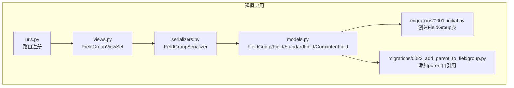
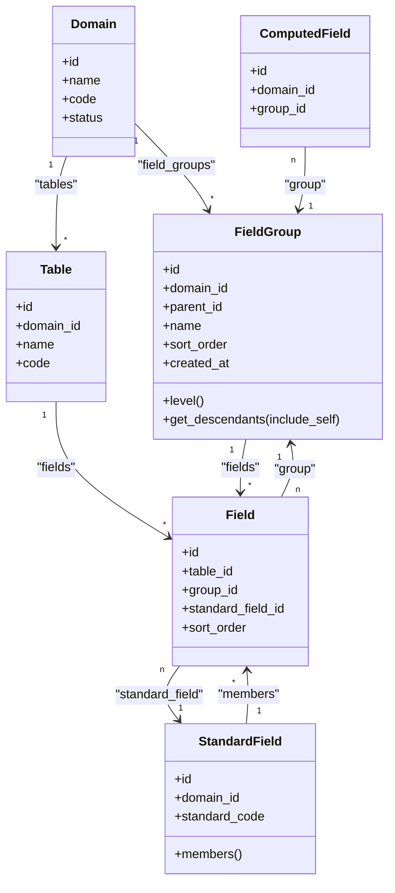
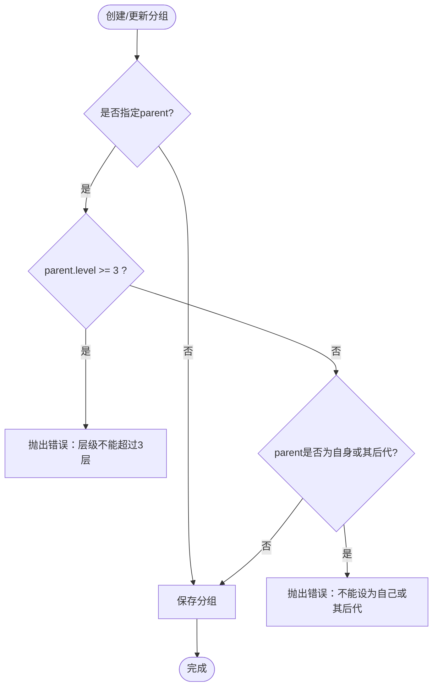
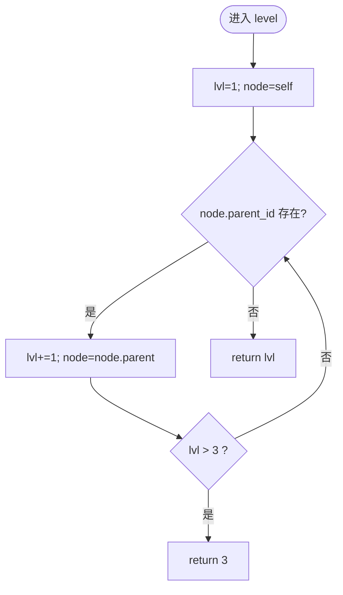
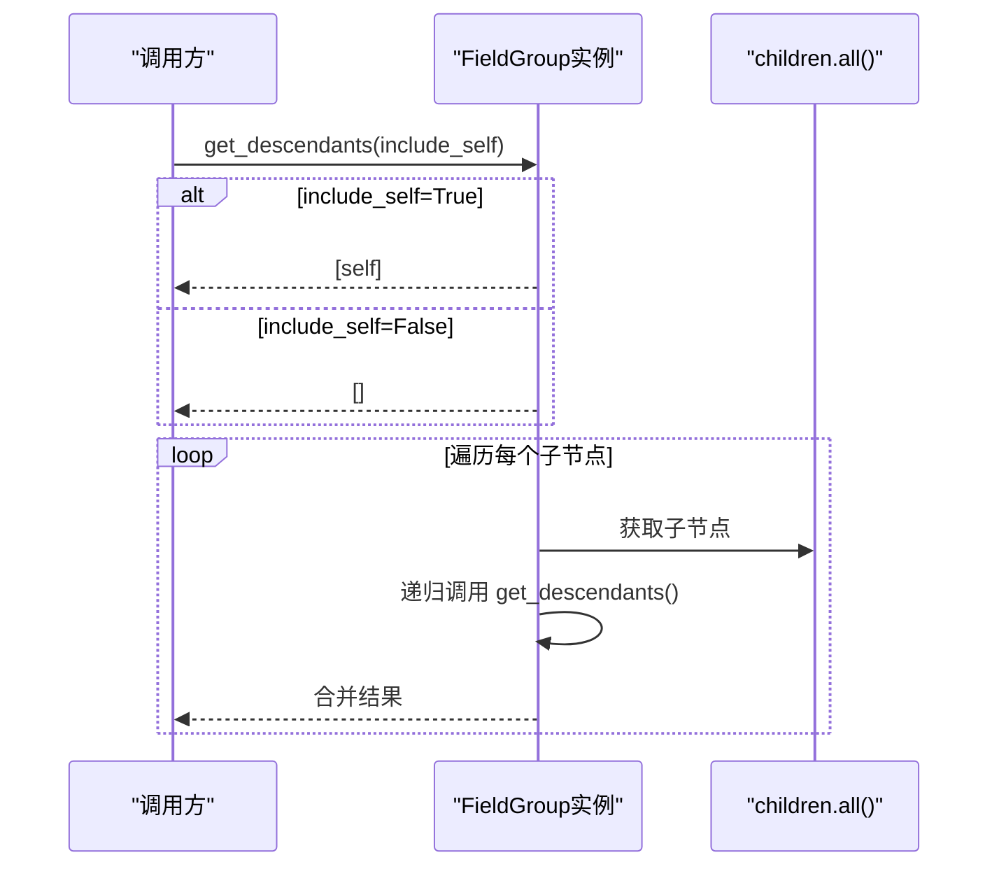
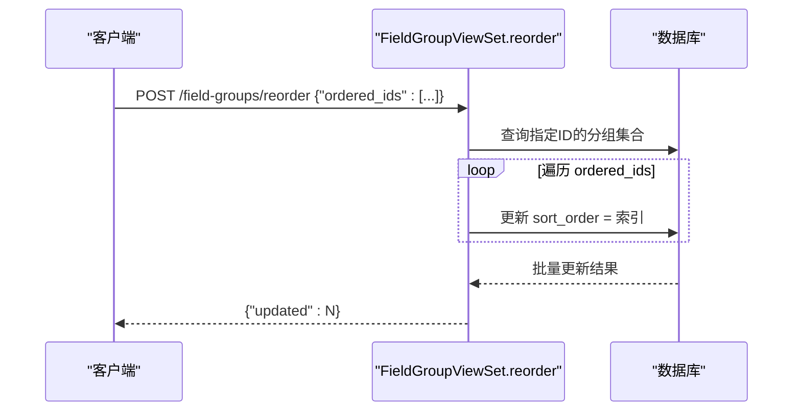
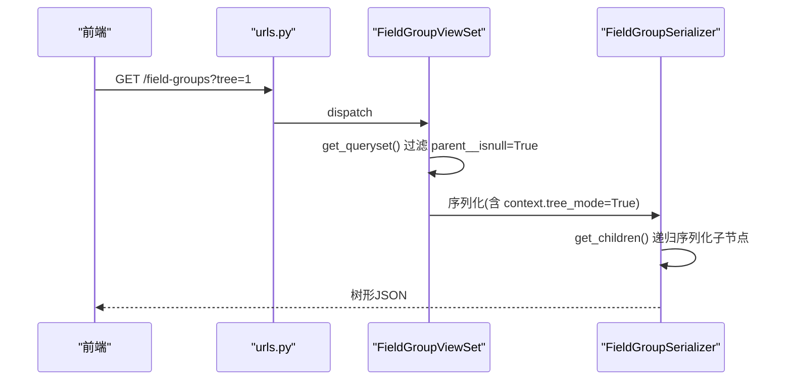
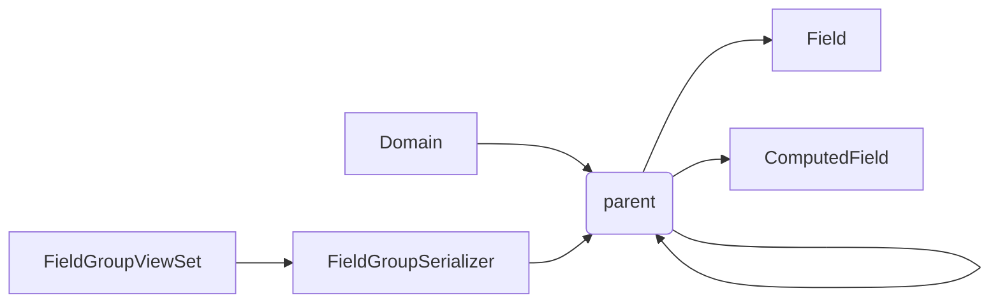

# 字段分组模型

<cite>
**本文引用的文件**   
- [models.py](file://backend/apps/modeling/models.py)
- [serializers.py](file://backend/apps/modeling/serializers.py)
- [views.py](file://backend/apps/modeling/views.py)
- [urls.py](file://backend/apps/modeling/urls.py)
- [0022_add_parent_to_fieldgroup.py](file://backend/apps/modeling/migrations/0022_add_parent_to_fieldgroup.py)
- [0001_initial.py](file://backend/apps/modeling/migrations/0001_initial.py)
</cite>

## 目录
1. [简介](#简介)
2. [项目结构](#项目结构)
3. [核心组件](#核心组件)
4. [架构总览](#架构总览)
5. [详细组件分析](#详细组件分析)
6. [依赖关系分析](#依赖关系分析)
7. [性能考量](#性能考量)
8. [故障排查指南](#故障排查指南)
9. [结论](#结论)
10. [附录](#附录)

## 简介
本文件围绕 FieldGroup（字段分组）实体，给出面向数据库与后端实现的完整设计文档。重点包括：
- 支持多层嵌套的分组结构（最多3层）
- 父子关系设计与层级计算方法
- 排序机制、递归查询实现与后代节点获取逻辑
- 完整的字段说明、树形结构操作示例与性能优化建议

该设计基于 Django ORM 模型与 DRF 序列化器/视图集，提供 RESTful API 能力，便于前端构建分组树与执行批量重排等操作。

## 项目结构
FieldGroup 相关代码位于 modeling 应用内，关键文件如下：
- 模型定义：models.py
- 序列化器：serializers.py
- 视图集与接口：views.py
- URL 路由注册：urls.py
- 迁移脚本：0001_initial.py（初始表）、0022_add_parent_to_fieldgroup.py（添加 parent 自引用）

图表来源
- [models.py:125-160](file://backend/apps/modeling/models.py#L125-L160)
- [serializers.py:71-106](file://backend/apps/modeling/serializers.py#L71-L106)
- [views.py:919-966](file://backend/apps/modeling/views.py#L919-L966)
- [urls.py:10](file://backend/apps/modeling/urls.py#L10)
- [0001_initial.py:33-46](file://backend/apps/modeling/migrations/0001_initial.py#L33-L46)
- [0022_add_parent_to_fieldgroup.py:13-19](file://backend/apps/modeling/migrations/0022_add_parent_to_fieldgroup.py#L13-L19)

章节来源
- [models.py:125-160](file://backend/apps/modeling/models.py#L125-L160)
- [serializers.py:71-106](file://backend/apps/modeling/serializers.py#L71-L106)
- [views.py:919-966](file://backend/apps/modeling/views.py#L919-L966)
- [urls.py:10](file://backend/apps/modeling/urls.py#L10)
- [0001_initial.py:33-46](file://backend/apps/modeling/migrations/0001_initial.py#L33-L46)
- [0022_add_parent_to_fieldgroup.py:13-19](file://backend/apps/modeling/migrations/0022_add_parent_to_fieldgroup.py#L13-L19)

## 核心组件
- FieldGroup：字段分组模型，支持自引用 parent 形成树形结构，限制最大深度为3层；提供 level 属性计算层级，get_descendants() 递归获取后代节点。
- Field：物理字段，通过 group 外键归属到某个 FieldGroup。
- StandardField：概念层标准字段，与 Field 一对多成员关系。
- ComputedField：计算字段，同样可通过 group 归属到 FieldGroup。
- FieldOption：枚举选项，属于 Field。

这些组件共同支撑“分组—字段”的组织方式，并允许在概念层与物理层之间进行映射与同步。

章节来源
- [models.py:125-160](file://backend/apps/modeling/models.py#L125-L160)
- [models.py:301-367](file://backend/apps/modeling/models.py#L301-L367)
- [models.py:162-300](file://backend/apps/modeling/models.py#L162-L300)
- [models.py:421-472](file://backend/apps/modeling/models.py#L421-L472)
- [models.py:369-385](file://backend/apps/modeling/models.py#L369-L385)

## 架构总览
下图展示 FieldGroup 在领域模型中的位置及其与 Field、StandardField、ComputedField 的关系，以及 API 访问路径。

图表来源
- [models.py:125-160](file://backend/apps/modeling/models.py#L125-L160)
- [models.py:301-367](file://backend/apps/modeling/models.py#L301-L367)
- [models.py:162-300](file://backend/apps/modeling/models.py#L162-L300)
- [models.py:421-472](file://backend/apps/modeling/models.py#L421-L472)

## 详细组件分析

### FieldGroup 数据模型与约束
- 字段说明
  - id：主键
  - domain：所属域（外键，级联删除）
  - parent：父分组（自引用外键，可空），用于构建树形结构
  - name：分组名称
  - sort_order：排序号（同父级内顺序）
  - created_at：创建时间
- 约束与行为
  - 层级限制：通过序列化器校验，确保 parent.level < 3，即最大深度为3层
  - 循环引用保护：禁止将分组设为自己或其任何后代的子分组
  - 默认排序：按 sort_order, id 排序
  - 删除策略：删除分组时，子分组上浮至原父级，直属字段变为未分组

图表来源
- [serializers.py:94-106](file://backend/apps/modeling/serializers.py#L94-L106)
- [models.py:141-159](file://backend/apps/modeling/models.py#L141-L159)

章节来源
- [models.py:125-160](file://backend/apps/modeling/models.py#L125-L160)
- [serializers.py:71-106](file://backend/apps/modeling/serializers.py#L71-L106)
- [0022_add_parent_to_fieldgroup.py:13-19](file://backend/apps/modeling/migrations/0022_add_parent_to_fieldgroup.py#L13-L19)

### 层级计算方法
- level 属性：从当前节点向上遍历 parent，直到根节点，计数得到层级；若超过3层则截断返回3。
- 复杂度：O(h)，h 为实际层级深度（≤3）。

图表来源
- [models.py:141-151](file://backend/apps/modeling/models.py#L141-L151)

章节来源
- [models.py:141-151](file://backend/apps/modeling/models.py#L141-L151)

### 递归查询与后代节点获取
- get_descendants(include_self=False)：递归收集所有子节点及子孙节点；可选包含自身。
- 使用场景：树形渲染、批量操作、权限继承等。
- 复杂度：O(n)，n 为子树节点数。

图表来源
- [models.py:153-159](file://backend/apps/modeling/models.py#L153-L159)

章节来源
- [models.py:153-159](file://backend/apps/modeling/models.py#L153-L159)

### 排序机制
- 组内排序：FieldGroup.sort_order 决定同父级内的显示顺序；默认查询按 sort_order, id 排序。
- 字段排序：Field.sort_order 决定字段在分组内的顺序；Field 的默认排序包含 group__sort_order, sort_order, id。
- 批量重排：API reorder 接收 ordered_ids 列表，按索引写入 sort_order，使用 bulk_update 提升性能。

图表来源
- [views.py:946-966](file://backend/apps/modeling/views.py#L946-L966)
- [models.py:133-136](file://backend/apps/modeling/models.py#L133-L136)
- [models.py:359-363](file://backend/apps/modeling/models.py#L359-L363)

章节来源
- [views.py:946-966](file://backend/apps/modeling/views.py#L946-L966)
- [models.py:133-136](file://backend/apps/modeling/models.py#L133-L136)
- [models.py:359-363](file://backend/apps/modeling/models.py#L359-L363)

### 树形结构 API 与序列化
- 端点：/field-groups
- 树形模式：请求参数 tree=1 时，仅返回顶层分组，children 由序列化器递归展开。
- 序列化字段：id, domain, parent, name, sort_order, field_count, level, children, created_at。
- 上下文控制：tree_mode 控制是否返回 children，避免无限递归。

图表来源
- [urls.py:10](file://backend/apps/modeling/urls.py#L10)
- [views.py:919-936](file://backend/apps/modeling/views.py#L919-L936)
- [serializers.py:71-93](file://backend/apps/modeling/serializers.py#L71-L93)

章节来源
- [urls.py:10](file://backend/apps/modeling/urls.py#L10)
- [views.py:919-936](file://backend/apps/modeling/views.py#L919-L936)
- [serializers.py:71-93](file://backend/apps/modeling/serializers.py#L71-L93)

### 删除与清理策略
- 删除分组时：
  - 子分组上浮至原父级（保持层级连续性）
  - 直属字段 group 置空（变为未分组）
- 目的：保证数据一致性与可用性，避免孤儿节点与悬空字段。

章节来源
- [views.py:938-944](file://backend/apps/modeling/views.py#L938-L944)

### 与 Field、StandardField、ComputedField 的关联
- Field.group：物理字段归属分组
- ComputedField.group：计算字段归属分组
- StandardField.members：标准字段的成员字段集合（概念层聚合）
- 排序影响：Field 列表排序受 group__sort_order 与自身 sort_order 共同影响

章节来源
- [models.py:301-367](file://backend/apps/modeling/models.py#L301-L367)
- [models.py:421-472](file://backend/apps/modeling/models.py#L421-L472)

## 依赖关系分析
- 模型依赖
  - FieldGroup.domain：外键到 Domain
  - FieldGroup.parent：自引用外键到 FieldGroup
  - Field.group：外键到 FieldGroup
  - ComputedField.group：外键到 FieldGroup
- 序列化依赖
  - FieldGroupSerializer 引用 FieldGroup 模型，并在 tree_mode 下递归序列化 children
- 视图依赖
  - FieldGroupViewSet 提供 CRUD、reorder、tree 模式查询

图表来源
- [models.py:125-160](file://backend/apps/modeling/models.py#L125-L160)
- [models.py:301-367](file://backend/apps/modeling/models.py#L301-L367)
- [models.py:421-472](file://backend/apps/modeling/models.py#L421-L472)
- [serializers.py:71-93](file://backend/apps/modeling/serializers.py#L71-L93)
- [views.py:919-936](file://backend/apps/modeling/views.py#L919-L936)

章节来源
- [models.py:125-160](file://backend/apps/modeling/models.py#L125-L160)
- [serializers.py:71-93](file://backend/apps/modeling/serializers.py#L71-L93)
- [views.py:919-936](file://backend/apps/modeling/views.py#L919-L936)

## 性能考量
- 递归查询
  - get_descendants() 为 Python 层递归，适合小中型树；当树规模较大时，建议在数据库层使用 CTE（WITH RECURSIVE）实现高效后代查询。
- 序列化开销
  - tree_mode 下 children 递归序列化可能产生 N+1 查询；可使用 select_related/prefetch_related 预加载父子关系，减少查询次数。
- 排序更新
  - reorder 使用 bulk_update 批量更新 sort_order，避免逐条 save，提高性能。
- 索引建议
  - 对 parent_id、domain_id、sort_order 建立索引以加速树查询与排序。
  - 对 Field.group_id、sort_order 建立索引以优化分组内字段排序。

[本节为通用性能建议，不直接分析具体文件]

## 故障排查指南
- 层级超限错误
  - 现象：提交 parent 时报错“分组层级不能超过3层”
  - 原因：parent.level >= 3
  - 处理：检查目标分组的层级，确保不超过3层
- 循环引用错误
  - 现象：提交 parent 时报错“不能将分组设为自己或其后代的子分组”
  - 原因：parent 为自身或其任意后代
  - 处理：重新选择父分组，避免形成环
- 删除后字段未分组
  - 现象：删除分组后，字段 group 为空
  - 原因：删除策略将直属字段 group 置空
  - 处理：在业务层重新分配字段到新分组

章节来源
- [serializers.py:94-106](file://backend/apps/modeling/serializers.py#L94-L106)
- [views.py:938-944](file://backend/apps/modeling/views.py#L938-L944)

## 结论
FieldGroup 通过自引用 parent 实现了最多3层的树形分组结构，配合 level 计算与 get_descendants 递归方法，满足常见的分类组织需求。排序机制与批量重排 API 提供了良好的交互体验。通过合理的索引与预加载策略，可在大规模数据下保持良好性能。建议在后续迭代中引入数据库层递归查询以提升扩展性。

[本节为总结，不直接分析具体文件]

## 附录

### 字段分组字段说明
- id：主键
- domain：所属域（外键）
- parent：父分组（自引用外键，可空）
- name：分组名称
- sort_order：排序号
- created_at：创建时间

章节来源
- [models.py:125-140](file://backend/apps/modeling/models.py#L125-L140)
- [0001_initial.py:33-46](file://backend/apps/modeling/migrations/0001_initial.py#L33-L46)
- [0022_add_parent_to_fieldgroup.py:13-19](file://backend/apps/modeling/migrations/0022_add_parent_to_fieldgroup.py#L13-L19)

### 树形结构操作示例
- 获取树形分组
  - 请求：GET /field-groups?tree=1
  - 响应：顶层分组数组，每个节点包含 children（递归）
- 批量重排序
  - 请求：POST /field-groups/reorder {"ordered_ids":[id1,id2,...]}
  - 响应：{"updated": N}
- 删除分组
  - 行为：子分组上浮，直属字段变未分组

章节来源
- [views.py:919-966](file://backend/apps/modeling/views.py#L919-L966)
- [serializers.py:71-93](file://backend/apps/modeling/serializers.py#L71-L93)