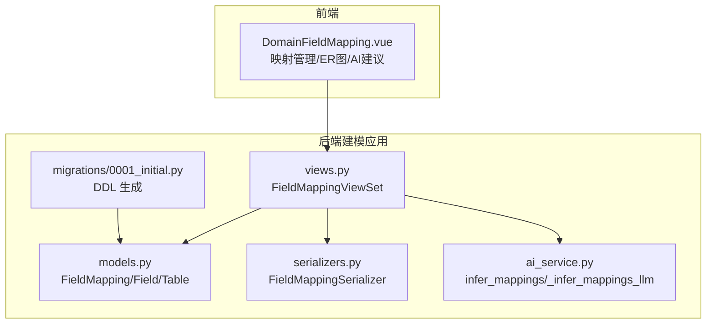
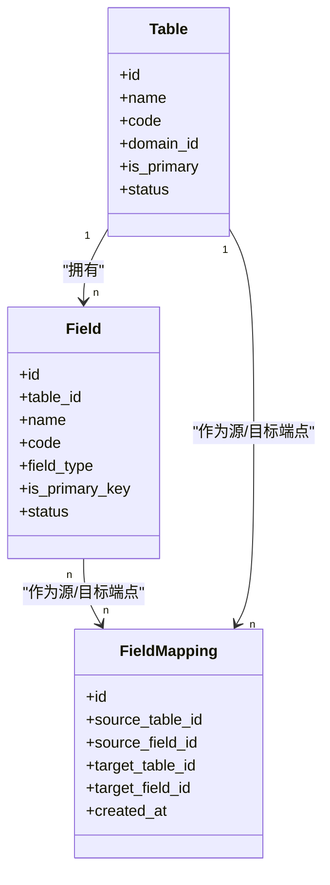
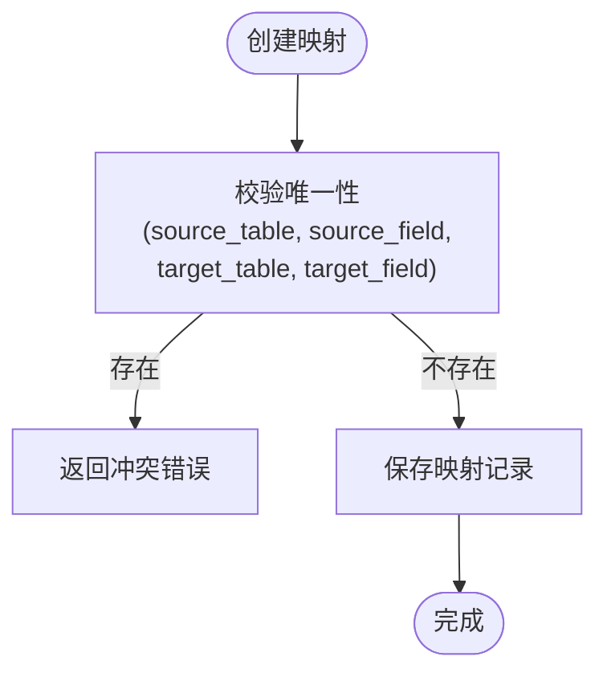
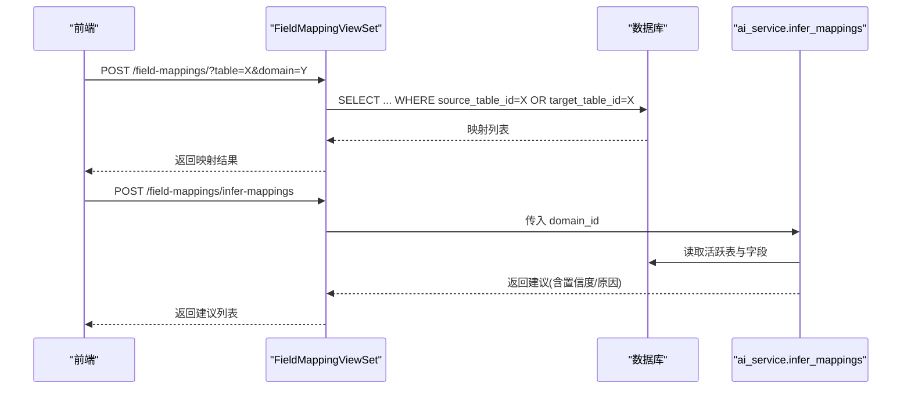
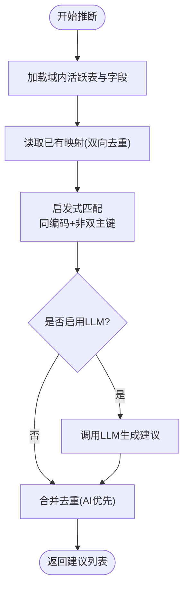
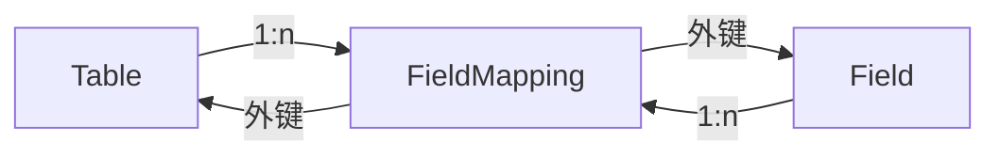

# 字段映射模型

<cite>
**本文引用的文件**   
- [models.py](file://backend/apps/modeling/models.py)
- [serializers.py](file://backend/apps/modeling/serializers.py)
- [views.py](file://backend/apps/modeling/views.py)
- [ai_service.py](file://backend/apps/modeling/ai_service.py)
- [0001_initial.py](file://backend/apps/modeling/migrations/0001_initial.py)
- [DomainFieldMapping.vue](file://frontend/src/views/modeling/DomainFieldMapping.vue)
</cite>

## 目录
1. [简介](#简介)
2. [项目结构](#项目结构)
3. [核心组件](#核心组件)
4. [架构总览](#架构总览)
5. [详细组件分析](#详细组件分析)
6. [依赖关系分析](#依赖关系分析)
7. [性能考量](#性能考量)
8. [故障排查指南](#故障排查指南)
9. [结论](#结论)
10. [附录](#附录)

## 简介
本文件围绕 FieldMapping（字段映射）实体，给出面向数据库设计的完整说明。内容涵盖：
- 源表/源字段到目标表/目标字段的映射配置与约束
- 唯一性约束、双向查询支持与级联删除策略
- 在数据同步与转换中的作用与使用场景
- 完整的字段说明、映射配置示例与常见问题处理

该设计用于主数据建模域内不同表之间的字段关联表达，支撑 AI 推断、人工维护、以及后续的数据同步与一致性校验等流程。

## 项目结构
FieldMapping 属于 modeling 应用的核心模型之一，其定义位于 models.py；序列化器、视图集、迁移脚本分别位于 serializers.py、views.py、migrations/0001_initial.py；AI 推断逻辑位于 ai_service.py；前端交互页面位于 frontend/src/views/modeling/DomainFieldMapping.vue。

图表来源
- [models.py:474-489](file://backend/apps/modeling/models.py#L474-L489)
- [serializers.py:230-241](file://backend/apps/modeling/serializers.py#L230-L241)
- [views.py:1824-1843](file://backend/apps/modeling/views.py#L1824-L1843)
- [ai_service.py:760-836](file://backend/apps/modeling/ai_service.py#L760-L836)
- [0001_initial.py:111-127](file://backend/apps/modeling/migrations/0001_initial.py#L111-L127)
- [DomainFieldMapping.vue:1-200](file://frontend/src/views/modeling/DomainFieldMapping.vue#L1-L200)

章节来源
- [models.py:474-489](file://backend/apps/modeling/models.py#L474-L489)
- [serializers.py:230-241](file://backend/apps/modeling/serializers.py#L230-L241)
- [views.py:1824-1843](file://backend/apps/modeling/views.py#L1824-L1843)
- [ai_service.py:760-836](file://backend/apps/modeling/ai_service.py#L760-L836)
- [0001_initial.py:111-127](file://backend/apps/modeling/migrations/0001_initial.py#L111-L127)
- [DomainFieldMapping.vue:1-200](file://frontend/src/views/modeling/DomainFieldMapping.vue#L1-L200)

## 核心组件
- FieldMapping：表间字段映射关系记录，包含源表/源字段与目标表/目标字段的外键引用，并设置唯一性约束与级联删除。
- Field：物理字段定义，作为映射的端点。
- Table：实体表定义，作为映射的端点。
- FieldMappingSerializer：API 序列化器，提供可读的表名/字段名展示字段。
- FieldMappingViewSet：REST API 视图集，支持按表或域过滤、双向查询、以及 AI 推断接口。
- ai_service.infer_mappings：AI 推断映射关系，结合启发式匹配与 LLM 建议，避免重复。

章节来源
- [models.py:474-489](file://backend/apps/modeling/models.py#L474-L489)
- [serializers.py:230-241](file://backend/apps/modeling/serializers.py#L230-L241)
- [views.py:1824-1843](file://backend/apps/modeling/views.py#L1824-L1843)
- [ai_service.py:760-836](file://backend/apps/modeling/ai_service.py#L760-L836)

## 架构总览
FieldMapping 在建模域中承担“跨表字段关系”的元数据角色，既可用于可视化 ER 关系，也可作为数据同步与一致性检查的依据。

图表来源
- [models.py:60-108](file://backend/apps/modeling/models.py#L60-L108)
- [models.py:301-366](file://backend/apps/modeling/models.py#L301-L366)
- [models.py:474-489](file://backend/apps/modeling/models.py#L474-L489)

## 详细组件分析

### 字段映射模型（FieldMapping）
- 字段说明
  - source_table：外键指向 Table，表示映射的源表
  - source_field：外键指向 Field，表示映射的源字段
  - target_table：外键指向 Table，表示映射的目标表
  - target_field：外键指向 Field，表示映射的目标字段
  - created_at：创建时间
- 唯一性约束
  - 通过 unique_together 对 (source_table, source_field, target_table, target_field) 进行唯一性约束，确保同一组映射不会重复创建
- 级联删除策略
  - 所有外键均设置为 on_delete=CASCADE，当源/目标表或字段被删除时，对应的映射记录也会被级联删除，保证数据一致性
- 反向查询支持
  - 通过 related_name='source_mappings' 和 'target_mappings'，可从 Field 和 Table 反向查询与其相关的映射集合，便于构建双向查询能力

图表来源
- [models.py:474-489](file://backend/apps/modeling/models.py#L474-L489)
- [0001_initial.py:111-127](file://backend/apps/modeling/migrations/0001_initial.py#L111-L127)

章节来源
- [models.py:474-489](file://backend/apps/modeling/models.py#L474-L489)
- [0001_initial.py:111-127](file://backend/apps/modeling/migrations/0001_initial.py#L111-L127)

### API 与序列化（FieldMappingSerializer & FieldMappingViewSet）
- 序列化器
  - 提供只读字段 source_table_name、source_field_name、target_table_name、target_field_name，便于前端展示
  - 输入仅需 source_table、source_field、target_table、target_field，其他为只读
- 视图集
  - 默认 select_related 预加载四个外键，提升查询性能
  - 支持按 table 参数进行双向过滤（source_table_id=table 或 target_table_id=table）
  - 支持按 domain 参数进行域级别过滤（source_table__domain_id 或 target_table__domain_id）
  - 提供 infer-mappings 动作，调用 AI 服务推断映射建议

图表来源
- [serializers.py:230-241](file://backend/apps/modeling/serializers.py#L230-L241)
- [views.py:1824-1843](file://backend/apps/modeling/views.py#L1824-L1843)
- [ai_service.py:760-836](file://backend/apps/modeling/ai_service.py#L760-L836)

章节来源
- [serializers.py:230-241](file://backend/apps/modeling/serializers.py#L230-L241)
- [views.py:1824-1843](file://backend/apps/modeling/views.py#L1824-L1843)

### AI 推断映射（ai_service.infer_mappings）
- 功能概述
  - 收集域内所有活跃表与字段
  - 获取已存在的映射（去重），避免重复建议
  - 启发式匹配：同编码且非双主键的字段组合优先建议
  - 可选 LLM 智能分析：根据表结构与字段信息生成更丰富的建议，合并去重后返回
- 输出结构
  - 每条建议包含 source_table_id、source_field_id、target_table_id、target_field_id、confidence、reason

图表来源
- [ai_service.py:760-836](file://backend/apps/modeling/ai_service.py#L760-L836)

章节来源
- [ai_service.py:760-836](file://backend/apps/modeling/ai_service.py#L760-L836)

### 前端交互（DomainFieldMapping.vue）
- 功能要点
  - 映射列表展示，支持新建、编辑、删除
  - 支持 ER 全屏模式，可视化表与字段连线标注映射关系
  - 支持 AI 自动建立关系，弹窗展示建议并批量创建选中映射
  - 联合主键支持：允许选择 composite 作为源/目标端点

章节来源
- [DomainFieldMapping.vue:1-200](file://frontend/src/views/modeling/DomainFieldMapping.vue#L1-L200)

## 依赖关系分析
FieldMapping 与 Table、Field 之间存在强耦合的外键关系，同时通过相关名称实现双向查询。

图表来源
- [models.py:60-108](file://backend/apps/modeling/models.py#L60-L108)
- [models.py:301-366](file://backend/apps/modeling/models.py#L301-L366)
- [models.py:474-489](file://backend/apps/modeling/models.py#L474-L489)

章节来源
- [models.py:60-108](file://backend/apps/modeling/models.py#L60-L108)
- [models.py:301-366](file://backend/apps/modeling/models.py#L301-L366)
- [models.py:474-489](file://backend/apps/modeling/models.py#L474-L489)

## 性能考量
- 查询优化
  - 视图集使用 select_related 预加载四个外键，减少 N+1 查询
  - 过滤条件基于索引友好的字段（如 table_id、domain_id）
- 写入优化
  - 唯一性约束由数据库层保障，避免业务层重复判断开销
  - 批量创建映射时建议分批提交，降低事务压力
- 缓存与降级
  - AI 推断失败时回退到启发式匹配，保证可用性

[本节为通用指导，不直接分析具体文件]

## 故障排查指南
- 唯一性冲突
  - 现象：创建映射时报唯一性冲突
  - 排查：确认是否存在相同 (source_table, source_field, target_table, target_field) 的记录
  - 解决：删除重复映射或调整映射端点
- 级联删除影响
  - 现象：删除表或字段后映射丢失
  - 原因：外键 on_delete=CASCADE
  - 解决：在删除前清理相关映射或采用软删除策略（需扩展模型）
- 双向查询为空
  - 现象：按 table 参数查询无结果
  - 排查：确认 table 是否为 source_table 或 target_table
  - 解决：检查过滤条件与数据是否正确

章节来源
- [models.py:474-489](file://backend/apps/modeling/models.py#L474-L489)
- [views.py:1824-1843](file://backend/apps/modeling/views.py#L1824-L1843)

## 结论
FieldMapping 以简洁而严谨的模型设计，实现了表间字段映射的持久化与查询能力。通过唯一性约束与级联删除，保证了数据一致性与完整性；通过反向查询与 API 过滤，提供了灵活的双向检索能力；结合 AI 推断与前端交互，显著降低了人工配置成本。该设计为后续数据同步、转换与一致性校验奠定了坚实基础。

[本节为总结性内容，不直接分析具体文件]

## 附录

### 字段映射字段说明
- source_table：源表 ID（外键）
- source_field：源字段 ID（外键）
- target_table：目标表 ID（外键）
- target_field：目标字段 ID（外键）
- created_at：创建时间

章节来源
- [models.py:474-489](file://backend/apps/modeling/models.py#L474-L489)

### 映射配置示例
- 示例一：单字段映射
  - 源表：orders，源字段：customer_id
  - 目标表：customers，目标字段：id
  - 用途：订单与客户的一对多关联
- 示例二：联合主键映射
  - 源表：order_items，源字段：composite（联合主键）
  - 目标表：products，目标字段：composite（联合主键）
  - 用途：商品与订单项的多对多拆分映射

[本节为概念性示例，不直接分析具体文件]

### 使用场景
- 数据同步
  - 依据映射关系将源系统数据同步至档案侧，确保字段对应一致
- 一致性校验
  - 对比源侧与档案侧字段值，发现差异并记录不一致项
- 关系可视化
  - 在 ER 图中展示表与字段间的映射连线，辅助建模与维护

[本节为概念性内容，不直接分析具体文件]