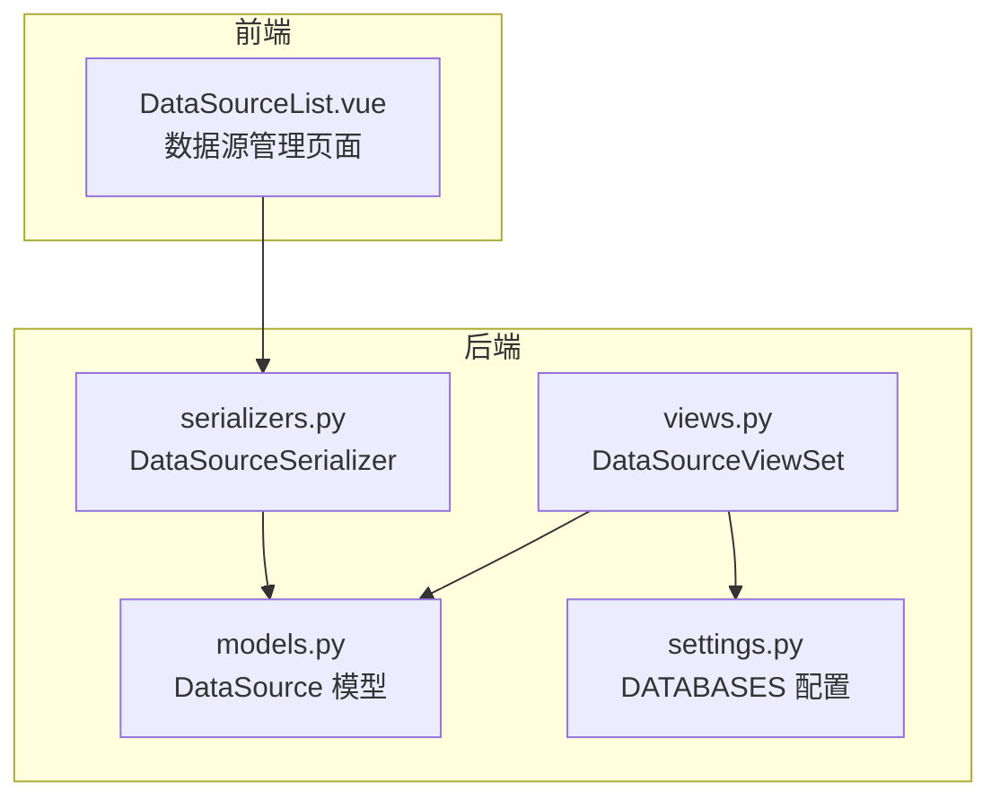
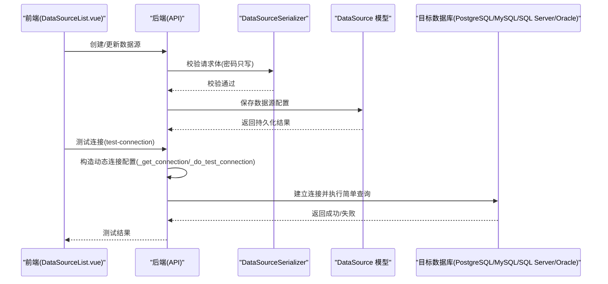
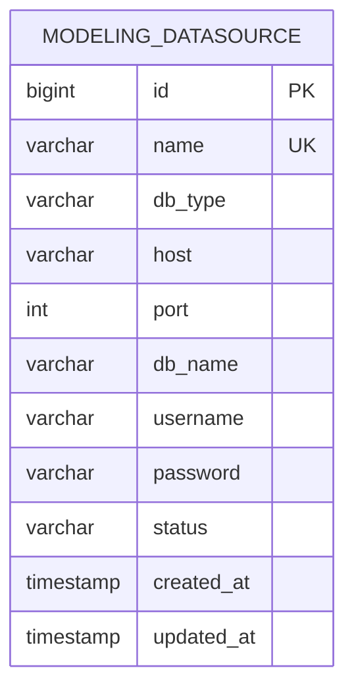
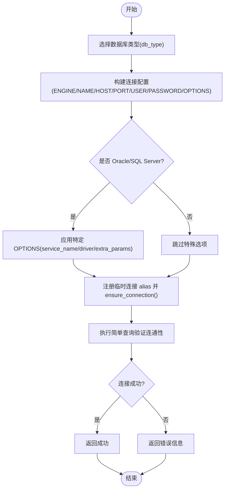
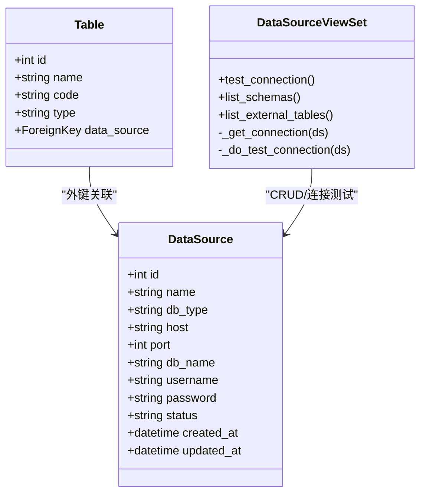

# 数据源配置模型

<cite>
**本文引用的文件**   
- [models.py](file://backend/apps/modeling/models.py)
- [serializers.py](file://backend/apps/modeling/serializers.py)
- [views.py](file://backend/apps/modeling/views.py)
- [0006_alter_datasource_db_type.py](file://backend/apps/modeling/migrations/0006_alter_datasource_db_type.py)
- [settings.py](file://backend/config/settings.py)
- [DataSourceList.vue](file://frontend/src/views/settings/DataSourceList.vue)
</cite>

## 目录
1. [简介](#简介)
2. [项目结构](#项目结构)
3. [核心组件](#核心组件)
4. [架构总览](#架构总览)
5. [详细组件分析](#详细组件分析)
6. [依赖关系分析](#依赖关系分析)
7. [性能考虑](#性能考虑)
8. [故障排查指南](#故障排查指南)
9. [结论](#结论)
10. [附录](#附录)

## 简介
本文件围绕 DataSource（数据源配置）实体，提供面向数据库设计的完整说明。内容涵盖：
- 表结构与字段定义（支持 PostgreSQL、MySQL、SQL Server、Oracle）
- 连接参数字段的数据类型与约束
- 状态管理机制
- 安全性考虑
- 使用示例与最佳实践

该设计基于 Django ORM 模型与迁移，结合前后端 API 交互流程，确保可维护性与可扩展性。

## 项目结构
与 DataSource 相关的关键代码位置如下：
- 模型定义：backend/apps/modeling/models.py
- API 序列化器：backend/apps/modeling/serializers.py
- API 视图与动态连接逻辑：backend/apps/modeling/views.py
- 数据库迁移（扩展 db_type 枚举）：backend/apps/modeling/migrations/0006_alter_datasource_db_type.py
- 全局数据库配置（默认引擎与环境变量）：backend/config/settings.py
- 前端数据源管理界面：frontend/src/views/settings/DataSourceList.vue

**图表来源**
- [models.py:4-29](file://backend/apps/modeling/models.py#L4-L29)
- [serializers.py:5-12](file://backend/apps/modeling/serializers.py#L5-L12)
- [views.py:31-72](file://backend/apps/modeling/views.py#L31-L72)
- [settings.py:56-66](file://backend/config/settings.py#L56-L66)
- [DataSourceList.vue:101-126](file://frontend/src/views/settings/DataSourceList.vue#L101-L126)

**章节来源**
- [models.py:4-29](file://backend/apps/modeling/models.py#L4-L29)
- [serializers.py:5-12](file://backend/apps/modeling/serializers.py#L5-L12)
- [views.py:31-72](file://backend/apps/modeling/views.py#L31-L72)
- [settings.py:56-66](file://backend/config/settings.py#L56-L66)
- [DataSourceList.vue:101-126](file://frontend/src/views/settings/DataSourceList.vue#L101-L126)

## 核心组件
- DataSource 模型：定义数据源配置的表结构与字段约束，包含支持的数据库类型枚举、连接参数与状态字段。
- DataSourceSerializer：API 层对 DataSource 的序列化与校验，密码字段写保护。
- DataSourceViewSet：提供 CRUD 接口、连接测试、Schema/外部表查询等能力，并实现动态数据库连接。
- 迁移 0006：将 db_type 的可选值扩展为四种数据库类型。
- settings.py：系统默认数据库配置（与 DataSource 不同，后者是运行时动态连接）。
- 前端 DataSourceList.vue：数据源的创建、编辑、删除与连接测试交互。

**章节来源**
- [models.py:4-29](file://backend/apps/modeling/models.py#L4-L29)
- [serializers.py:5-12](file://backend/apps/modeling/serializers.py#L5-L12)
- [views.py:31-146](file://backend/apps/modeling/views.py#L31-L146)
- [0006_alter_datasource_db_type.py:10-26](file://backend/apps/modeling/migrations/0006_alter_datasource_db_type.py#L10-L26)
- [settings.py:56-66](file://backend/config/settings.py#L56-L66)
- [DataSourceList.vue:101-126](file://frontend/src/views/settings/DataSourceList.vue#L101-L126)

## 架构总览
下图展示了 DataSource 在系统中的角色与交互：
- 前端通过 API 进行数据源的增删改查与连接测试
- 后端 Serializer 负责输入校验与敏感字段处理
- ViewSet 根据 db_type 动态构建连接配置，执行连接测试与元数据查询
- 模型层持久化配置到数据库

**图表来源**
- [views.py:74-146](file://backend/apps/modeling/views.py#L74-L146)
- [serializers.py:5-12](file://backend/apps/modeling/serializers.py#L5-L12)
- [models.py:4-29](file://backend/apps/modeling/models.py#L4-L29)

## 详细组件分析

### 数据源配置表结构设计
- 表名：由 Django 自动映射为 modeling_datasource（遵循 app_label + 小写模型名约定）
- 主键：id（BigAutoField，Django 默认）
- 字段清单与约束：
  - name：数据源名称，CharField(max_length=100)，唯一约束
  - db_type：数据库类型，CharField(max_length=20)，choices 限定为 postgresql/mysql/sqlserver/oracle，默认 postgresql
  - host：主机地址，CharField(max_length=200)
  - port：端口，IntegerField，默认 5432
  - db_name：数据库名，CharField(max_length=100)
  - username：用户名，CharField(max_length=100)，允许空串
  - password：密码，CharField(max_length=200)，允许空串；API 层 write_only
  - status：状态，CharField(max_length=20)，默认 active
  - created_at：创建时间，DateTimeField(auto_now_add=True)
  - updated_at：更新时间，DateTimeField(auto_now=True)
- 排序与显示：按 created_at 降序；__str__ 输出“名称 (类型:主机/库名)”

**图表来源**
- [models.py:4-29](file://backend/apps/modeling/models.py#L4-L29)
- [0006_alter_datasource_db_type.py:10-26](file://backend/apps/modeling/migrations/0006_alter_datasource_db_type.py#L10-L26)

**章节来源**
- [models.py:4-29](file://backend/apps/modeling/models.py#L4-L29)
- [0006_alter_datasource_db_type.py:10-26](file://backend/apps/modeling/migrations/0006_alter_datasource_db_type.py#L10-L26)

### 支持的数据库类型与连接参数
- 支持的类型：PostgreSQL、MySQL、SQL Server、Oracle
- 连接参数：host、port、db_name、username、password
- 特殊选项：
  - Oracle：OPTIONS.service_name=db_name
  - SQL Server：OPTIONS.driver="ODBC Driver 18 for SQL Server"，extra_params="Encrypt=no"
- 动态连接：
  - 使用 connections.databases[alias] 注入临时连接配置
  - 连接后执行 SELECT 1（或 Oracle 的 SELECT 1 FROM DUAL）验证连通性

**图表来源**
- [views.py:40-72](file://backend/apps/modeling/views.py#L40-L72)
- [views.py:94-146](file://backend/apps/modeling/views.py#L94-L146)

**章节来源**
- [views.py:40-72](file://backend/apps/modeling/views.py#L40-L72)
- [views.py:94-146](file://backend/apps/modeling/views.py#L94-L146)

### 状态管理机制
- 状态字段：status（默认 active）
- 当前实现中，状态主要用于展示与筛选，未内置启用/停用时的业务拦截逻辑
- 建议：可在保存前增加可用性检查（如连接测试），或在停用前检查是否有表引用该数据源

**章节来源**
- [models.py:4-29](file://backend/apps/modeling/models.py#L4-L29)

### 安全性考虑
- 密码字段：
  - 数据库层以明文存储（CharField）
  - API 层通过 Serializer 设置 write_only，避免响应中回显密码
- 传输安全：
  - 生产环境应启用 HTTPS，防止凭据在网络中被窃听
- 访问控制：
  - 建议引入认证与权限控制（如 DRF 的 IsAuthenticated/IsAdminUser）
- 密钥管理：
  - 建议使用环境变量或密钥管理服务注入敏感信息，减少硬编码风险
- 连接安全：
  - SQL Server 已禁用加密（Encrypt=no），生产环境建议启用 TLS/SSL 加密通道

**章节来源**
- [serializers.py:5-12](file://backend/apps/modeling/serializers.py#L5-L12)
- [views.py:119-125](file://backend/apps/modeling/views.py#L119-L125)

### 使用示例与最佳实践
- 创建数据源
  - 必填字段：name、db_type、host、db_name
  - 可选字段：port（默认 5432）、username、password
  - 建议：创建后立即调用 test-connection 验证连通性
- 更新数据源
  - 若仅更新密码，可不传 password 字段以避免覆盖
  - 建议：更新后再次测试连接
- 删除数据源
  - 删除前确认无表引用该数据源，避免档案刷新失败
- 最佳实践
  - 使用最小权限账户连接外部数据库
  - 生产环境启用 HTTPS 与数据库连接加密
  - 定期轮换密码并记录审计日志

**章节来源**
- [views.py:74-146](file://backend/apps/modeling/views.py#L74-L146)
- [DataSourceList.vue:170-193](file://frontend/src/views/settings/DataSourceList.vue#L170-L193)

## 依赖关系分析
- 模型依赖：DataSource 独立存在，Table 通过外键关联 DataSource（当 type=source 时）
- API 依赖：DataSourceViewSet 依赖 ENGINE_MAP（与 distinct_cache 共用）
- 配置依赖：settings.py 中的 DATABASES 用于系统默认数据库，不影响 DataSource 的动态连接

**图表来源**
- [models.py:4-29](file://backend/apps/modeling/models.py#L4-L29)
- [models.py:60-108](file://backend/apps/modeling/models.py#L60-L108)
- [views.py:31-146](file://backend/apps/modeling/views.py#L31-L146)

**章节来源**
- [models.py:4-29](file://backend/apps/modeling/models.py#L4-L29)
- [models.py:60-108](file://backend/apps/modeling/models.py#L60-L108)
- [views.py:31-146](file://backend/apps/modeling/views.py#L31-L146)

## 性能考虑
- 连接池：
  - 当前连接为临时别名，CONN_MAX_AGE=0，适合短生命周期操作
  - 高并发场景建议启用连接池（CONN_MAX_AGE>0）并合理设置超时
- 查询优化：
  - 列表 Schema/外部表时按需过滤（如 has_data=true）
  - 限制预览行数（默认 100，最大 500）
- 索引与约束：
  - name 唯一约束避免重复配置
  - 建议在常用查询字段（如 db_type、status）上添加索引以提升筛选性能

**章节来源**
- [views.py:148-224](file://backend/apps/modeling/views.py#L148-L224)
- [views.py:226-324](file://backend/apps/modeling/views.py#L226-L324)

## 故障排查指南
- 连接失败
  - 检查 host/port/db_name/username/password 是否正确
  - 查看 test-connection 返回的错误信息
  - 确认网络可达与防火墙策略
- 不支持的数据库类型
  - 确认 db_type 属于 postgresql/mysql/sqlserver/oracle
- 权限不足
  - 确保用户具备读取 information_schema/all_tables 等元数据的权限
- 密码问题
  - 确认密码未过期且符合数据库复杂度要求
  - 生产环境启用加密传输与连接加密

**章节来源**
- [views.py:94-146](file://backend/apps/modeling/views.py#L94-L146)

## 结论
DataSource 模型提供了灵活、可扩展的数据源管理能力，支持主流数据库类型并通过动态连接机制实现运行时连接。当前实现注重易用性与基本安全，生产环境建议增强加密、权限与连接池配置。通过完善的字段约束与 API 校验，可有效降低配置错误风险。

## 附录
- 字段说明速查
  - name：数据源名称（唯一）
  - db_type：数据库类型（postgresql/mysql/sqlserver/oracle）
  - host：主机地址
  - port：端口（默认 5432）
  - db_name：数据库名
  - username：用户名
  - password：密码（API 写保护）
  - status：状态（默认 active）
  - created_at/updated_at：时间戳

**章节来源**
- [models.py:4-29](file://backend/apps/modeling/models.py#L4-L29)