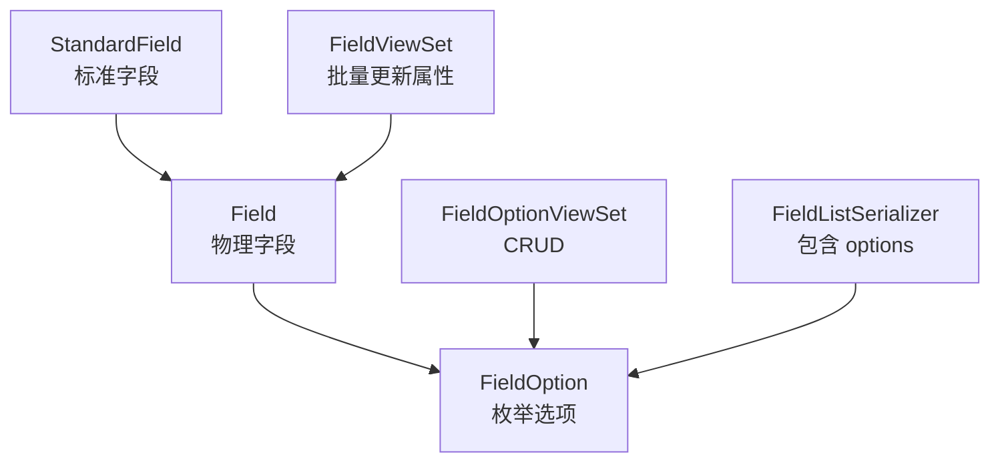
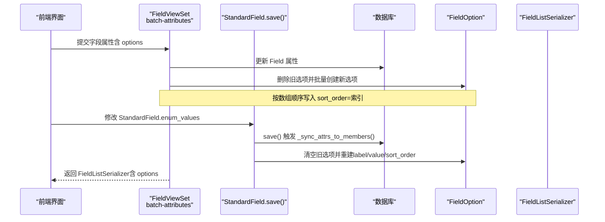
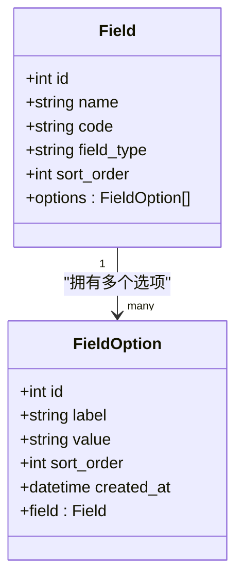
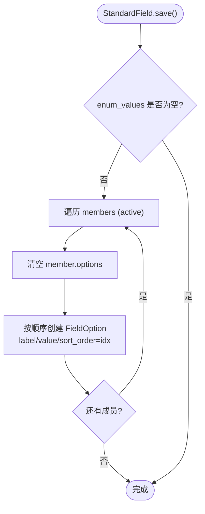
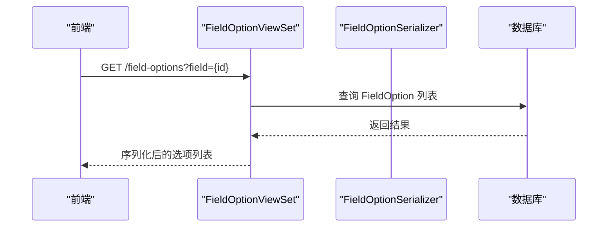

# 枚举选项模型

<cite>
**本文引用的文件**   
- [models.py](file://backend/apps/modeling/models.py)
- [serializers.py](file://backend/apps/modeling/serializers.py)
- [views.py](file://backend/apps/modeling/views.py)
- [urls.py](file://backend/apps/modeling/urls.py)
- [admin.py](file://backend/apps/modeling/admin.py)
- [0001_initial.py](file://backend/apps/modeling/migrations/0001_initial.py)
- [migrate_standard_field_attrs.py](file://backend/scripts/migrate_standard_field_attrs.py)
- [FieldProperties.vue](file://frontend/src/views/modeling/legacy/FiledProperties.vue)
</cite>

## 目录
1. [简介](#简介)
2. [项目结构](#项目结构)
3. [核心组件](#核心组件)
4. [架构总览](#架构总览)
5. [详细组件分析](#详细组件分析)
6. [依赖关系分析](#依赖关系分析)
7. [性能考量](#性能考量)
8. [故障排查指南](#故障排查指南)
9. [结论](#结论)
10. [附录](#附录)

## 简介
本文件围绕 FieldOption（枚举选项）实体，给出面向数据库与后端实现的完整设计文档。重点说明：
- 枚举类型字段的选项值管理、排序机制与唯一性约束
- 选项与字段的关联关系
- 显示名 label 与存储值 value 的分离设计
- 字段说明、使用示例与最佳实践

## 项目结构
FieldOption 属于建模域（modeling）应用中的核心数据模型之一，与 Field（物理字段）、StandardField（标准字段）紧密协作，形成“概念层属性配置 → 物理字段 → 枚举选项”的数据流。



图表来源
- [models.py:162-300](file://backend/apps/modeling/models.py#L162-L300)
- [models.py:301-385](file://backend/apps/modeling/models.py#L301-L385)
- [serializers.py:109-127](file://backend/apps/modeling/serializers.py#L109-L127)
- [views.py:969-974](file://backend/apps/modeling/views.py#L969-L974)
- [views.py:1066-1100](file://backend/apps/modeling/views.py#L1066-L1100)

章节来源
- [models.py:162-300](file://backend/apps/modeling/models.py#L162-L300)
- [models.py:301-385](file://backend/apps/modeling/models.py#L301-L385)
- [serializers.py:109-127](file://backend/apps/modeling/serializers.py#L109-L127)
- [views.py:969-974](file://backend/apps/modeling/views.py#L969-L974)
- [views.py:1066-1100](file://backend/apps/modeling/views.py#L1066-L1100)

## 核心组件
- FieldOption 模型：定义枚举选项的表结构与约束
- Field 模型：通过外键与 FieldOption 建立一对多关系
- StandardField 模型：在概念层维护 enum_values JSON 字段，并在保存时同步到 FieldOption
- FieldListSerializer：在返回字段详情时附带 options（FieldOption 列表）
- FieldOptionViewSet：提供 FieldOption 的 RESTful CRUD
- 批量更新接口：支持对单个字段的 options 进行全量替换

章节来源
- [models.py:369-385](file://backend/apps/modeling/models.py#L369-L385)
- [models.py:301-367](file://backend/apps/modeling/models.py#L301-L367)
- [models.py:162-300](file://backend/apps/modeling/models.py#L162-L300)
- [serializers.py:109-127](file://backend/apps/modeling/serializers.py#L109-L127)
- [views.py:969-974](file://backend/apps/modeling/views.py#L969-L974)
- [views.py:1066-1100](file://backend/apps/modeling/views.py#L1066-L1100)

## 架构总览
下图展示从概念层到物理层再到枚举选项的数据流转与控制路径。



图表来源
- [views.py:1066-1100](file://backend/apps/modeling/views.py#L1066-L1100)
- [models.py:230-299](file://backend/apps/modeling/models.py#L230-L299)
- [serializers.py:116-127](file://backend/apps/modeling/serializers.py#L116-L127)

## 详细组件分析

### FieldOption 模型设计
- 字段说明
  - field：外键指向 Field，级联删除；related_name=options
  - label：选项显示名（最大长度 100）
  - value：选项值（最大长度 100），用于业务存储与校验
  - sort_order：排序号（整数，默认 0）
  - created_at：创建时间（自动填充）
- 约束与排序
  - unique_together：(field, value)，保证同一字段下 value 唯一
  - ordering：['sort_order', 'id']，优先按 sort_order 升序，再按 id 稳定排序
- 设计要点
  - 显示名与存储值分离：label 用于展示，value 用于持久化与比对
  - 排序由 sort_order 控制，便于前端拖拽后重排
  - 删除 Field 时级联删除其所有选项



图表来源
- [models.py:301-367](file://backend/apps/modeling/models.py#L301-L367)
- [models.py:369-385](file://backend/apps/modeling/models.py#L369-L385)

章节来源
- [models.py:369-385](file://backend/apps/modeling/models.py#L369-L385)
- [0001_initial.py:94-109](file://backend/apps/modeling/migrations/0001_initial.py#L94-L109)

### 与 Field 的关联关系
- 一对多关系：一个 Field 对应多个 FieldOption
- 级联删除：删除 Field 会删除其所有选项
- 反向查询：Field.options.all() 获取该字段的所有选项

章节来源
- [models.py:301-367](file://backend/apps/modeling/models.py#L301-L367)
- [models.py:369-385](file://backend/apps/modeling/models.py#L369-L385)

### 与 StandardField 的同步机制
- StandardField.enum_values：JSON 字段，存储 [{label, value}] 列表
- StandardField.save() 中调用 _sync_attrs_to_members()：
  - 遍历成员 Field
  - 清空 member.options 旧记录
  - 按枚举值数组顺序创建 FieldOption，sort_order=索引
- 迁移脚本 migrate_standard_field_attrs.py：
  - 从现有 FieldOption 聚合为 StandardField.enum_values
  - 写入 StandardField 后触发 save() 同步回 FieldOption



图表来源
- [models.py:230-299](file://backend/apps/modeling/models.py#L230-L299)
- [migrate_standard_field_attrs.py:35-85](file://backend/scripts/migrate_standard_field_attrs.py#L35-L85)

章节来源
- [models.py:230-299](file://backend/apps/modeling/models.py#L230-L299)
- [migrate_standard_field_attrs.py:35-85](file://backend/scripts/migrate_standard_field_attrs.py#L35-L85)

### API 与序列化
- FieldOptionSerializer：暴露 id、field、label、value、sort_order、created_at
- FieldListSerializer：在字段详情中包含 options（只读）
- FieldOptionViewSet：提供 FieldOption 的增删改查，支持按 field 过滤
- 批量更新接口 batch-attributes：
  - 接收 fields 列表，每个元素可包含 options
  - 若存在 options，先删除旧选项，再按数组顺序创建新选项



图表来源
- [serializers.py:109-114](file://backend/apps/modeling/serializers.py#L109-L114)
- [views.py:969-974](file://backend/apps/modeling/views.py#L969-L974)

章节来源
- [serializers.py:109-127](file://backend/apps/modeling/serializers.py#L109-L127)
- [views.py:969-974](file://backend/apps/modeling/views.py#L969-L974)
- [views.py:1066-1100](file://backend/apps/modeling/views.py#L1066-L1100)

### 数据库表结构与约束
- 表名：modeling_fieldoption（Django 默认命名规则）
- 主键：id（自增 BigAutoField）
- 外键：field_id 引用 modeling_field.id，级联删除
- 唯一约束：(field_id, value) 组合唯一
- 排序：ordering 基于 sort_order 与 id

章节来源
- [0001_initial.py:94-109](file://backend/apps/modeling/migrations/0001_initial.py#L94-L109)
- [models.py:369-385](file://backend/apps/modeling/models.py#L369-L385)

## 依赖关系分析
- 模型依赖
  - FieldOption 依赖 Field（外键）
  - StandardField 通过 save() 钩子影响 FieldOption
- 序列化依赖
  - FieldListSerializer 依赖 FieldOptionSerializer
- 视图依赖
  - FieldOptionViewSet 依赖 FieldOptionSerializer
  - FieldViewSet.batch_update_attributes 直接操作 FieldOption

```mermaid
graph LR
SF["StandardField"] --> |save() 同步| FO["FieldOption"]
F["Field"] --> |一对多| FO
S["FieldOptionSerializer"] --> FO
V["FieldOptionViewSet"] --> S
B["FieldViewSet.batch-attributes"] --> FO
```

图表来源
- [models.py:230-299](file://backend/apps/modeling/models.py#L230-L299)
- [models.py:301-385](file://backend/apps/modeling/models.py#L301-L385)
- [serializers.py:109-127](file://backend/apps/modeling/serializers.py#L109-L127)
- [views.py:969-974](file://backend/apps/modeling/views.py#L969-L974)
- [views.py:1066-1100](file://backend/apps/modeling/views.py#L1066-L1100)

章节来源
- [models.py:230-299](file://backend/apps/modeling/models.py#L230-L299)
- [models.py:301-385](file://backend/apps/modeling/models.py#L301-L385)
- [serializers.py:109-127](file://backend/apps/modeling/serializers.py#L109-L127)
- [views.py:969-974](file://backend/apps/modeling/views.py#L969-L974)
- [views.py:1066-1100](file://backend/apps/modeling/views.py#L1066-L1100)

## 性能考量
- 批量更新 options 时采用“先删后建”策略，避免逐条比较带来的 N+1 问题
- 使用 ordering=['sort_order','id'] 保证查询稳定性，减少前端二次排序开销
- 在 FieldListSerializer 中使用 prefetch_related('options') 提升读取性能（见 views.py 中 queryset 设置）
- StandardField._sync_attrs_to_members() 对每个成员执行 delete + bulk create，建议在大批量场景下分批处理或合并事务

[本节为通用指导，不直接分析具体文件]

## 故障排查指南
- 重复 value 报错
  - 现象：插入相同 field 下的重复 value 抛出唯一约束错误
  - 排查：检查 unique_together=(field,value) 是否被违反
- 排序异常
  - 现象：前端拖拽后排序未生效
  - 排查：确认传入的 options 数组顺序是否正确，后端是否按索引写入 sort_order
- 选项未同步
  - 现象：修改 StandardField.enum_values 后 FieldOption 未更新
  - 排查：确认 StandardField.save() 是否触发 _sync_attrs_to_members()，是否存在 active 成员
- 级联删除导致选项丢失
  - 现象：删除 Field 后选项消失
  - 排查：预期行为，如需保留需调整 on_delete 策略

章节来源
- [models.py:369-385](file://backend/apps/modeling/models.py#L369-L385)
- [models.py:230-299](file://backend/apps/modeling/models.py#L230-L299)
- [views.py:1066-1100](file://backend/apps/modeling/views.py#L1066-L1100)

## 结论
FieldOption 以简洁的表结构实现了枚举选项的灵活管理与严格约束。通过 label/value 分离、sort_order 排序以及 (field,value) 唯一性约束，既满足前端展示与交互需求，又保障数据一致性。配合 StandardField 的概念层配置与批量更新接口，形成了从概念到物理再到选项的闭环数据流。

[本节为总结，不直接分析具体文件]

## 附录

### 字段说明
- FieldOption
  - id：主键
  - field：所属字段（外键）
  - label：选项显示名
  - value：选项值（存储值）
  - sort_order：排序号
  - created_at：创建时间

章节来源
- [models.py:369-385](file://backend/apps/modeling/models.py#L369-L385)
- [0001_initial.py:94-109](file://backend/apps/modeling/migrations/0001_initial.py#L94-L109)

### 使用示例
- 新增字段选项（批量更新接口）
  - 请求体 fields[].options 为数组，每项包含 label 与 value
  - 后端将按数组顺序写入 sort_order
- 读取字段选项
  - 通过 FieldListSerializer 返回的 options 字段获取
- 管理端操作
  - Django Admin 中可按 field 过滤查看选项

章节来源
- [views.py:1066-1100](file://backend/apps/modeling/views.py#L1066-L1100)
- [serializers.py:116-127](file://backend/apps/modeling/serializers.py#L116-L127)
- [admin.py:46-50](file://backend/apps/modeling/admin.py#L46-L50)

### 最佳实践
- 保持 value 的稳定性与语义明确，避免频繁变更
- 使用 label 承载本地化文本，value 作为系统内部标识
- 合理设置 sort_order，确保展示顺序符合业务期望
- 批量更新 options 时，尽量一次性提交完整列表，避免多次增量更新
- 在 StandardField 层面集中维护 enum_values，利用自动同步机制降低不一致风险

[本节为通用指导，不直接分析具体文件]