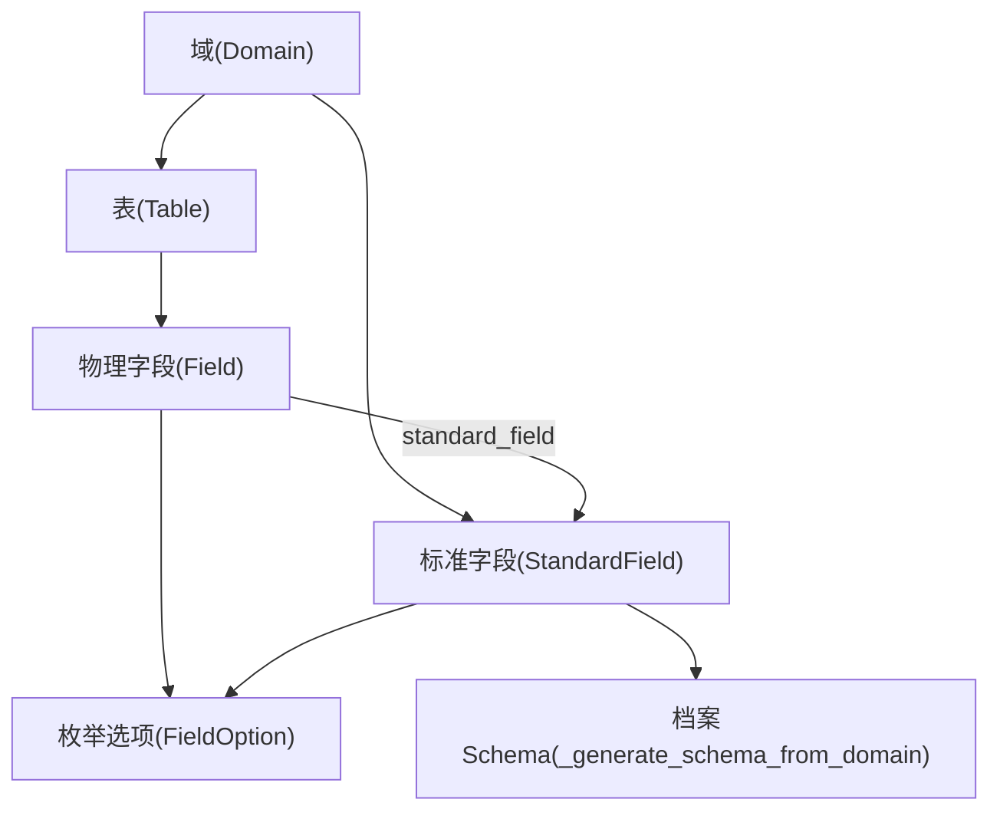
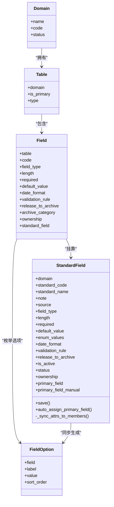
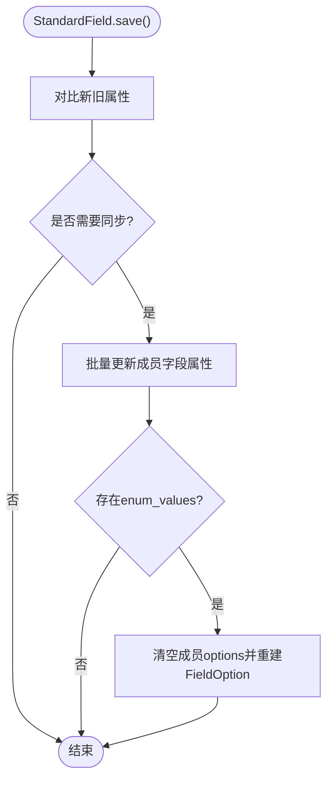
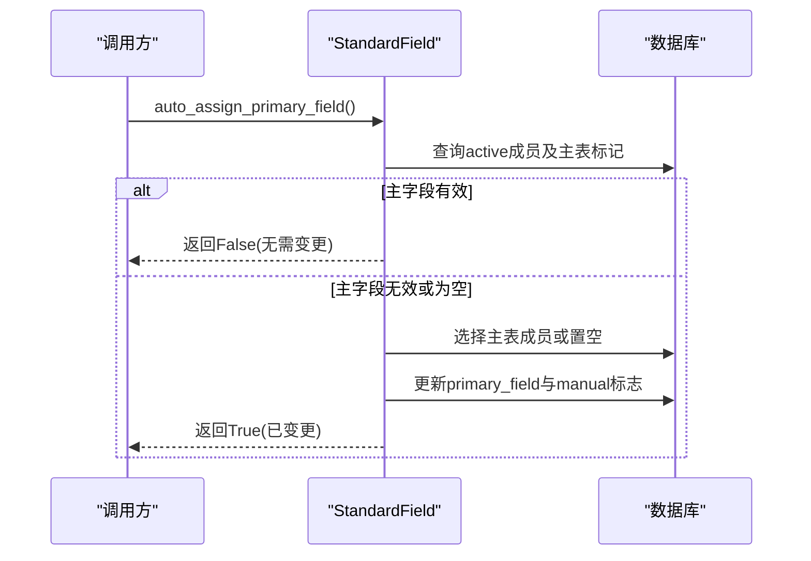
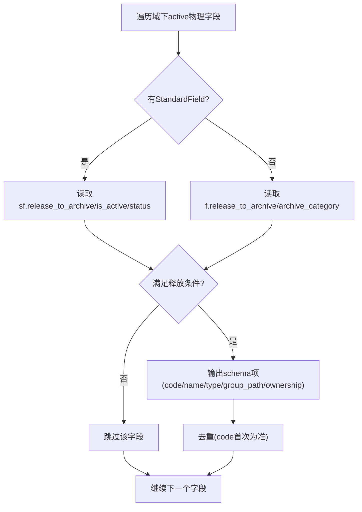
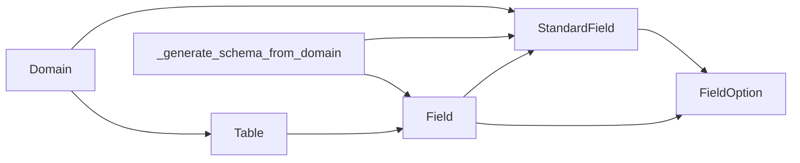

# 标准字段模型

<cite>
**本文引用的文件**   
- [models.py](file://backend/apps/modeling/models.py)
- [0010_remove_field_equivalence_group_standardfield_and_more.py](file://backend/apps/modeling/migrations/0010_remove_field_equivalence_group_standardfield_and_more.py)
- [0026_standardfield_primary_field_and_more.py](file://backend/apps/modeling/migrations/0026_standardfield_primary_field_and_more.py)
- [migrate_standard_field_attrs.py](file://backend/scripts/migrate_standard_field_attrs.py)
- [serializers.py](file://backend/apps/modeling/serializers.py)
- [views.py](file://backend/apps/modeling/views.py)
- [archive_views.py](file://backend/apps/archive/views.py)
</cite>

## 目录
1. [引言](#引言)
2. [项目结构](#项目结构)
3. [核心组件](#核心组件)
4. [架构总览](#架构总览)
5. [详细组件分析](#详细组件分析)
6. [依赖关系分析](#依赖关系分析)
7. [性能考量](#性能考量)
8. [故障排查指南](#故障排查指南)
9. [结论](#结论)
10. [附录](#附录)

## 引言
本文件围绕 StandardField（标准字段）实体，给出概念层字段的完整数据库设计说明。内容涵盖：
- 字段类型系统与属性配置同步机制
- 主字段自动分配逻辑与人工指定保护
- 标准字段与物理字段的关联关系、属性变更传播
- 枚举值管理、校验规则配置
- 释放到档案的控制逻辑与最终 schema 生成
- 字段说明、同步机制示例与最佳实践

## 项目结构
StandardField 属于建模域（modeling）的核心模型之一，与 Field（物理字段）、FieldOption（枚举选项）、Table（表）、Domain（域）等共同构成“概念层—实现层—归档”的数据治理链路。迁移脚本与序列化器、视图负责在 API 层暴露能力并驱动数据流转。

图表来源 
- [models.py:162-226](file://backend/apps/modeling/models.py#L162-L226)
- [models.py:301-367](file://backend/apps/modeling/models.py#L301-L367)
- [models.py:369-385](file://backend/apps/modeling/models.py#L369-L385)
- [archive_views.py:47-158](file://backend/apps/archive/views.py#L47-L158)

章节来源
- [models.py:162-226](file://backend/apps/modeling/models.py#L162-L226)
- [models.py:301-367](file://backend/apps/modeling/models.py#L301-L367)
- [models.py:369-385](file://backend/apps/modeling/models.py#L369-L385)
- [archive_views.py:47-158](file://backend/apps/archive/views.py#L47-L158)

## 核心组件
- StandardField：概念层一等公民，承载跨表去重后的统一字段定义与属性配置源。
- Field：物理字段，保留实际表结构；通过 standard_field 外键挂靠到标准字段。
- FieldOption：枚举选项，由 StandardField 的 enum_values 同步生成。
- Table/Domains：组织维度，决定主表与归属域。

关键职责
- StandardField.save() 触发属性同步至成员 Field，并在需要时重建 FieldOption。
- StandardField.auto_assign_primary_field() 维护主字段，支持人工指定保护。
- 档案侧 _generate_schema_from_domain() 基于 StandardField 优先输出最终 schema。

章节来源
- [models.py:162-226](file://backend/apps/modeling/models.py#L162-L226)
- [models.py:230-299](file://backend/apps/modeling/models.py#L230-L299)
- [models.py:301-367](file://backend/apps/modeling/models.py#L301-L367)
- [models.py:369-385](file://backend/apps/modeling/models.py#L369-L385)

## 架构总览
概念层（StandardField）作为属性配置唯一来源，向下同步到实现层（Field/FieldOption），向上被归档模块消费以生成 schema。主字段用于确定组合字段在档案更新时的数据来源。

图表来源 
- [models.py:32-52](file://backend/apps/modeling/models.py#L32-L52)
- [models.py:60-123](file://backend/apps/modeling/models.py#L60-L123)
- [models.py:301-367](file://backend/apps/modeling/models.py#L301-L367)
- [models.py:369-385](file://backend/apps/modeling/models.py#L369-L385)
- [models.py:162-226](file://backend/apps/modeling/models.py#L162-L226)

## 详细组件分析

### StandardField 概念字段设计
- 标识与归属
  - domain：所属域
  - standard_code：归一化编码，唯一标识
  - standard_name/note/source：名称、说明、来源（AI/手动）
- 类型系统
  - field_type：string/number/date/boolean/enum
  - length/date_format：长度与日期格式
- 属性配置（概念层配置源）
  - required/default_value/validation_rule：必填、默认值、校验规则（JSON）
  - enum_values：枚举值列表（JSON），同步到 FieldOption
  - ownership：维护方（source/archive）
- 状态与发布
  - is_active/status/release_to_archive：启用/状态/是否释放到档案
- 主字段
  - primary_field：主字段成员（SET NULL）
  - primary_field_manual：是否人工指定（影响自动跟随）

章节来源
- [models.py:162-226](file://backend/apps/modeling/models.py#L162-L226)

### 字段类型系统与属性同步机制
- 保存钩子
  - save() 比较旧值与新值，若属性变化则调用 _sync_attrs_to_members()
- 同步范围
  - 同步字段：field_type、length、required、default_value、date_format、validation_rule
  - 枚举值：清空成员 Field 的 options，按顺序重建 FieldOption
- 仅对 active 状态的成员生效

图表来源 
- [models.py:230-299](file://backend/apps/modeling/models.py#L230-L299)

章节来源
- [models.py:230-299](file://backend/apps/modeling/models.py#L230-L299)

### 主字段自动分配与人工指定保护
- 自动分配策略
  - 当前主字段仍为 active 成员 → 不动
  - 否则取主表成员兜底；无主表成员则置空（强制人工设置）
  - 绕过 save() 直接落库，避免重复同步
- 人工指定保护
  - primary_field_manual=True 后，主表切换不自动跟随
  - 自动分配的随主表切换

图表来源 
- [models.py:255-274](file://backend/apps/modeling/models.py#L255-L274)

章节来源
- [models.py:255-274](file://backend/apps/modeling/models.py#L255-L274)

### 标准字段与物理字段的关联与传播
- 关联关系
  - Field.standard_field 指向 StandardField
  - StandardField.members 反向关联所有成员 Field
- 传播机制
  - 概念层属性变更 → 自动同步到成员 Field
  - 枚举值变更 → 重建 FieldOption
  - 主字段变更 → 影响档案更新的数据源头

章节来源
- [models.py:301-367](file://backend/apps/modeling/models.py#L301-L367)
- [models.py:162-226](file://backend/apps/modeling/models.py#L162-L226)

### 枚举值管理与校验规则配置
- 枚举值
  - StandardField.enum_values 为 JSON 列表，每项含 label/value
  - 同步时清空成员 options 并按 sort_order 重建
- 校验规则
  - validation_rule 为 JSON，包含 pattern/message 等
  - 同步到成员 Field.validation_rule

章节来源
- [models.py:193-198](file://backend/apps/modeling/models.py#L193-L198)
- [models.py:276-299](file://backend/apps/modeling/models.py#L276-L299)

### 释放到档案的控制逻辑
- 两层门控
  - 概念层：StandardField.release_to_archive/is_active/status
  - 物理层：Field.release_to_archive/archive_category
- Schema 生成
  - _generate_schema_from_domain() 优先使用 StandardField 的 name/type
  - 应用 release_to_archive 过滤，按分组 DFS 序排序，去重输出 code

图表来源 
- [archive_views.py:47-158](file://backend/apps/archive/views.py#L47-L158)

章节来源
- [archive_views.py:47-158](file://backend/apps/archive/views.py#L47-L158)

### 迁移与初始化
- 历史迁移
  - 将 FieldEquivalenceGroup 重命名为 StandardField，新增属性字段
  - 增加 primary_field 与 primary_field_manual，并回填默认主字段
- 属性迁移脚本
  - 从第一个成员 Field 聚合属性到 StandardField，冲突记录日志
  - 保存后自动同步回所有成员

章节来源
- [0010_remove_field_equivalence_group_standardfield_and_more.py:1-140](file://backend/apps/modeling/migrations/0010_remove_field_equivalence_group_standardfield_and_more.py#L1-L140)
- [0026_standardfield_primary_field_and_more.py:1-40](file://backend/apps/modeling/migrations/0026_standardfield_primary_field_and_more.py#L1-L40)
- [migrate_standard_field_attrs.py:1-85](file://backend/scripts/migrate_standard_field_attrs.py#L1-L85)

## 依赖关系分析
- 模型依赖
  - StandardField 依赖 Domain、Field（主字段）、FieldOption（枚举）
  - Field 依赖 Table、FieldGroup、StandardField
- 服务依赖
  - 档案模块依赖 StandardField 与 Field 生成 schema
  - 视图提供标准字段聚合、刷新去重、预览等功能

图表来源 
- [models.py:162-226](file://backend/apps/modeling/models.py#L162-L226)
- [models.py:301-367](file://backend/apps/modeling/models.py#L301-L367)
- [archive_views.py:47-158](file://backend/apps/archive/views.py#L47-L158)

章节来源
- [models.py:162-226](file://backend/apps/modeling/models.py#L162-L226)
- [models.py:301-367](file://backend/apps/modeling/models.py#L301-L367)
- [archive_views.py:47-158](file://backend/apps/archive/views.py#L47-L158)

## 性能考量
- 批量更新
  - 属性同步使用 update(**updates) 减少 N+1 查询
- 预加载
  - members.select_related('table') 与 prefetch_related('members__table') 降低查询开销
- 缓存
  - Field.distinct_values 缓存去重样本，避免频繁查库
- 事务与一致性
  - 同步过程尽量在单事务内完成，避免中间态不一致

[本节为通用指导，不直接分析具体文件]

## 故障排查指南
- 主字段未设置
  - 现象：档案拉取前校验失败，提示缺少主字段
  - 处理：调用 auto_assign_primary_field() 或人工指定 primary_field
- 枚举不同步
  - 现象：成员 Field 的 options 与 StandardField.enum_values 不一致
  - 处理：检查 StandardField.save() 是否触发，确认 enum_values 非空且结构正确
- 释放到档案异常
  - 现象：字段未出现在档案 schema
  - 处理：核查 StandardField.release_to_archive/is_active/status 与 Field.release_to_archive/archive_category

章节来源
- [archive_views.py:225-243](file://backend/apps/archive/views.py#L225-L243)
- [models.py:255-274](file://backend/apps/modeling/models.py#L255-L274)
- [models.py:276-299](file://backend/apps/modeling/models.py#L276-L299)

## 结论
StandardField 作为概念层一等公民，集中承载字段类型、属性与校验规则，并通过自动同步机制确保实现层一致性与可维护性。结合主字段策略与双层释放门控，系统在档案 schema 生成与数据合并中具备清晰口径与可控性。建议在生产环境遵循以下最佳实践：
- 优先在概念层配置属性，避免分散修改
- 合理设置主字段，保障档案更新数据来源唯一
- 谨慎调整 release_to_archive 与 ownership，确保数据治理策略落地

[本节为总结，不直接分析具体文件]

## 附录

### API 与序列化器要点
- StandardFieldSerializer
  - 暴露 members/member_count/first_member_distinct_values 等辅助信息
  - primary_field 与 primary_field_manual 只读，通过专用端点维护
- StandardFieldAggregateSerializer
  - 聚合标准字段与独立物理字段，便于前端分组与拖拽
  - 携带 release_to_archive、distinct_values、tables、is_primary_key、primary_field_* 等展示字段

章节来源
- [serializers.py:130-164](file://backend/apps/modeling/serializers.py#L130-L164)
- [serializers.py:166-205](file://backend/apps/modeling/serializers.py#L166-L205)

### 视图行为参考
- standard_fields：返回领域下的标准字段聚合与独立物理字段
- refresh_distinct：刷新域下 active 字段的去重缓存
- archive_preview：只读预览最终释放到档案的 schema

章节来源
- [views.py:1306-1418](file://backend/apps/modeling/views.py#L1306-L1418)
- [views.py:1420-1441](file://backend/apps/modeling/views.py#L1420-L1441)
- [views.py:1476-1489](file://backend/apps/modeling/views.py#L1476-L1489)