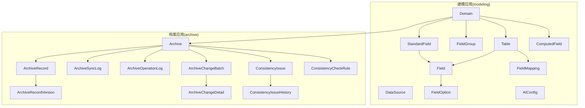
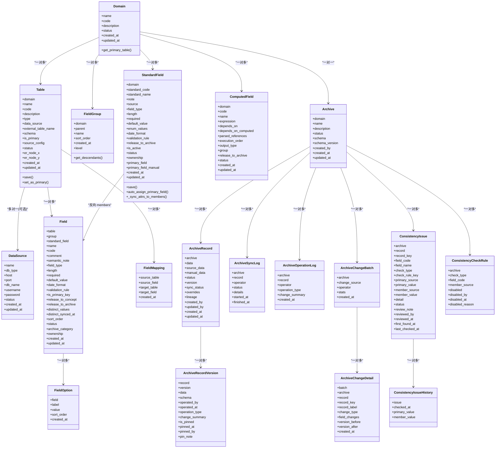

# 核心实体模型

<cite>
**本文引用的文件**   
- [backend/apps/modeling/models.py](file://backend/apps/modeling/models.py)
- [backend/apps/archive/models.py](file://backend/apps/archive/models.py)
- [backend/config/settings.py](file://backend/config/settings.py)
- [backend/apps/modeling/migrations/0001_initial.py](file://backend/apps/modeling/migrations/0001_initial.py)
- [backend/apps/modeling/migrations/0026_standardfield_primary_field_and_more.py](file://backend/apps/modeling/migrations/0026_standardfield_primary_field_and_more.py)
- [backend/apps/archive/migrations/0001_initial.py](file://backend/apps/archive/migrations/0001_initial.py)
- [backend/apps/archive/migrations/0013_consistencycheckrule_and_more.py](file://backend/apps/archive/migrations/0013_consistencycheckrule_and_more.py)
</cite>

## 目录
1. [简介](#简介)
2. [项目结构与范围](#项目结构与范围)
3. [核心实体与表结构](#核心实体与表结构)
4. [架构总览](#架构总览)
5. [详细组件分析](#详细组件分析)
6. [依赖关系与约束](#依赖关系与约束)
7. [性能与索引建议](#性能与索引建议)
8. [故障排查指南](#故障排查指南)
9. [结论](#结论)
10. [附录：字段说明与使用示例](#附录字段说明与使用示例)

## 简介
本文件为 MetaData002 系统的“核心实体模型”数据库设计文档，聚焦建模（modeling）与档案（archive）两大应用的核心数据模型。内容涵盖 DataSource（数据源配置）、Domain（主数据域）、Table（实体表）、Field（物理字段）、StandardField（标准字段）、ComputedField（计算字段）、FieldMapping（字段映射），以及档案侧的 Archive、ArchiveRecord、版本与日志等关键实体的表结构设计、字段含义、数据类型选择、约束条件、状态管理与数据验证规则，并给出关系映射、级联策略与关联查询建议。

## 项目结构与范围
- 后端采用 Django ORM，数据库默认 PostgreSQL，通过 settings 配置连接参数。
- modeling 应用负责主数据建模：域、表、字段、分组、标准字段、计算字段、字段映射、AI 配置等。
- archive 应用负责档案配置、记录、版本、同步日志、操作日志、一致性检查等。

图表来源
- [backend/apps/modeling/models.py:1-489](file://backend/apps/modeling/models.py#L1-L489)
- [backend/apps/archive/models.py:1-379](file://backend/apps/archive/models.py#L1-L379)

章节来源
- [backend/config/settings.py:56-66](file://backend/config/settings.py#L56-L66)

## 核心实体与表结构
本节对核心实体进行逐表说明，包含字段定义、类型、约束与业务含义。

### DataSource（数据源配置）
- 用途：集中管理外部数据库连接信息，供 Table 作为“数据源表”时引用。
- 关键字段
  - name: 唯一标识数据源名称
  - db_type: 枚举（PostgreSQL/MySQL/SQL Server/Oracle）
  - host/port/db_name: 连接地址与库名
  - username/password: 认证信息
  - status: 状态（如 active）
  - created_at/updated_at: 审计时间戳
- 约束与索引
  - name 唯一
  - 默认排序按创建时间倒序
- 业务含义
  - 用于将 Table.type=SOURCE 的表指向真实外部数据库实例，实现跨库元数据建模与同步。

章节来源
- [backend/apps/modeling/models.py:4-30](file://backend/apps/modeling/models.py#L4-L30)

### Domain（主数据域）
- 用途：划分主数据的业务边界，一个域可包含多个实体表与档案。
- 关键字段
  - name/code/description/status
  - created_at/updated_at
- 约束与索引
  - code 唯一
  - 提供 get_primary_table() 辅助方法获取该域的主表
- 业务含义
  - 域是概念层组织单元；每个域对应一个档案（OneToOne）。

章节来源
- [backend/apps/modeling/models.py:32-58](file://backend/apps/modeling/models.py#L32-L58)

### Table（实体表）
- 用途：描述域下的具体实体表，支持本地表与外部数据源表两种类型。
- 关键字段
  - domain: 所属域（外键，级联删除）
  - name/code/description/type
  - data_source: 关联数据源（可为空，为空则为本地表）
  - external_table_name/schema: 外部表名与模式（仅 SOURCE 类型有效）
  - is_primary: 是否为主表（每域仅一个）
  - source_config: 旧版数据源配置（已废弃）
  - er_node_x/er_node_y: ER图节点坐标
  - status/created_at/updated_at
- 约束与索引
  - (domain, code) 唯一
  - save() 中强制 type 与 data_source 的一致性
  - set_as_primary() 保证每域唯一主表，并自动调整组合字段主字段归属
- 业务含义
  - 主表决定档案合并基准；SOURCE 类型表通过 data_source + external_table_name 定位外部表。

章节来源
- [backend/apps/modeling/models.py:60-123](file://backend/apps/modeling/models.py#L60-L123)

### FieldGroup（字段分组）
- 用途：对字段进行多层分类（最多三层），便于 UI 展示与批量配置。
- 关键字段
  - domain/parent/name/sort_order/created_at
- 约束与索引
  - 自引用 parent（SET NULL）
  - 提供 level 与 get_descendants() 工具方法
- 业务含义
  - 支撑字段分组树形结构，限制层级深度。

章节来源
- [backend/apps/modeling/models.py:125-160](file://backend/apps/modeling/models.py#L125-L160)

### StandardField（标准字段）
- 用途：概念层一等公民，跨表去重后的统一字段定义，承载属性、分组、API 开放、档案表单、质量规则等。
- 关键字段
  - domain/standard_code/standard_name/note/source
  - field_type/length/required/default_value/enum_values/date_format/validation_rule
  - release_to_archive/is_active/status
  - ownership: 维护方（source/archive）
  - primary_field/primary_field_manual: 主字段及人工指定标记
  - created_at/updated_at
- 约束与索引
  - (domain, standard_code) 唯一
  - save() 自动同步属性到成员 Field（含 enum_values 到 FieldOption）
  - auto_assign_primary_field() 自动校准主字段
- 业务含义
  - 标准字段变更会同步到所有成员物理字段；主字段决定档案更新的数据源头。

章节来源
- [backend/apps/modeling/models.py:162-300](file://backend/apps/modeling/models.py#L162-L300)
- [backend/apps/modeling/migrations/0026_standardfield_primary_field_and_more.py:1-40](file://backend/apps/modeling/migrations/0026_standardfield_primary_field_and_more.py#L1-L40)

### Field（物理字段）
- 用途：表的物理列定义，挂靠到 StandardField（可选），支持分组、枚举选项、归档控制等。
- 关键字段
  - table/group/standard_field
  - name/code/comment/semantic_note
  - field_type/length/required/default_value/date_format/validation_rule
  - is_primary_key/release_to_concept/release_to_archive
  - distinct_values/distinct_synced_at
  - sort_order/status/archive_category/ownership
  - created_at/updated_at
- 约束与索引
  - (table, code) 唯一
  - options 子表（FieldOption）一对一值集
- 业务含义
  - 物理字段是实际存储列；release_to_archive 控制是否进入档案；ownership 控制拉取覆盖策略。

章节来源
- [backend/apps/modeling/models.py:301-367](file://backend/apps/modeling/models.py#L301-L367)

### FieldOption（枚举选项）
- 用途：枚举字段的取值集合。
- 关键字段
  - field/label/value/sort_order/created_at
- 约束与索引
  - (field, value) 唯一

章节来源
- [backend/apps/modeling/models.py:369-385](file://backend/apps/modeling/models.py#L369-L385)

### AIConfig（AI 服务配置）
- 用途：OpenAI 兼容接口配置，单例生效（enabled=True 的记录优先）。
- 关键字段
  - name/provider/api_base/api_key/model/temperature/timeout/enabled
  - prompt_*: 可配置提示词
  - created_at/updated_at

章节来源
- [backend/apps/modeling/models.py:387-419](file://backend/apps/modeling/models.py#L387-L419)

### ComputedField（计算字段）
- 用途：基于 Excel 风格公式从其他字段推导，支持依赖解析与 DAG 执行顺序。
- 关键字段
  - domain/code/name/expression
  - depends_on/depends_on_computed/parsed_references/execution_order
  - output_type/group/release_to_archive/status
  - created_at/updated_at
- 约束与索引
  - (domain, code) 唯一

章节来源
- [backend/apps/modeling/models.py:421-472](file://backend/apps/modeling/models.py#L421-L472)

### FieldMapping（字段映射）
- 用途：表间字段映射关系，驱动数据转换与同步。
- 关键字段
  - source_table/source_field/target_table/target_field
  - created_at
- 约束与索引
  - (source_table, source_field, target_table, target_field) 唯一

章节来源
- [backend/apps/modeling/models.py:474-489](file://backend/apps/modeling/models.py#L474-L489)

### Archive（档案配置）
- 用途：一个域一个档案，保存 Schema 快照与版本。
- 关键字段
  - domain(name/description/status/schema/schema_version/created_by/created_at/updated_at)
- 约束与索引
  - OneToOne 到 Domain，级联删除

章节来源
- [backend/apps/archive/models.py:5-31](file://backend/apps/archive/models.py#L5-L31)
- [backend/apps/archive/migrations/0001_initial.py:16-35](file://backend/apps/archive/migrations/0001_initial.py#L16-L35)

### ArchiveRecord（档案记录）
- 用途：主数据实例，双层存储（source_data + manual_data），合并生成 data。
- 关键字段
  - archive/data/source_data/manual_data/status/version/sync_status
  - overrides/lineage（字段级修正保护与血缘）
  - created_by/updated_by/created_at/updated_at
- 约束与索引
  - 复合索引 (archive, status)

章节来源
- [backend/apps/archive/models.py:33-73](file://backend/apps/archive/models.py#L33-L73)
- [backend/apps/archive/migrations/0001_initial.py:36-55](file://backend/apps/archive/migrations/0001_initial.py#L36-L55)

### ArchiveRecordVersion（版本快照）
- 用途：记录每次操作的完整数据快照与 Schema 快照，支持定版。
- 关键字段
  - record/version/data/schema/operated_by/operated_at/operation_type/change_summary
  - is_pinned/pinned_at/pinned_by/pin_note
- 约束与索引
  - (record, version) 唯一

章节来源
- [backend/apps/archive/models.py:75-110](file://backend/apps/archive/models.py#L75-L110)
- [backend/apps/archive/migrations/0001_initial.py:73-95](file://backend/apps/archive/migrations/0001_initial.py#L73-L95)

### ArchiveSyncLog（同步日志）
- 用途：记录一次同步任务的开始、详情与结果。
- 关键字段
  - archive/record/operator/status/details/started_at/finished_at

章节来源
- [backend/apps/archive/models.py:112-137](file://backend/apps/archive/models.py#L112-L137)
- [backend/apps/archive/migrations/0001_initial.py:96-113](file://backend/apps/archive/migrations/0001_initial.py#L96-L113)

### ArchiveOperationLog（操作日志）
- 用途：记录用户对档案与记录的各类操作。
- 关键字段
  - archive/record/operator/operation_type/change_summary/created_at
- 约束与索引
  - 索引 (archive, -created_at)

章节来源
- [backend/apps/archive/models.py:174-204](file://backend/apps/archive/models.py#L174-L204)
- [backend/apps/archive/migrations/0001_initial.py:56-72](file://backend/apps/archive/migrations/0001_initial.py#L56-L72)

### ArchiveChangeBatch / ArchiveChangeDetail（变更批次与明细）
- 用途：记录一次刷新或编辑产生的变更记录，明细包含字段级新旧值。
- 关键字段
  - Batch: archive/change_source/operator/stats/created_at
  - Detail: batch/archive/record/record_key/record_label/change_type/field_changes/version_before/version_after/created_at
- 约束与索引
  - 多索引优化查询（archive, -created_at）

章节来源
- [backend/apps/archive/models.py:206-272](file://backend/apps/archive/models.py#L206-L272)

### ConsistencyIssue / ConsistencyCheckRule / ConsistencyIssueHistory（一致性检查）
- 用途：记录与处理多种一致性差异，支持规则失效与历史轨迹。
- 关键字段
  - Issue: archive/record/record_key/field_code/field_name/check_type/check_rule_key/detail/status/review_* / first_found_at/last_checked_at
  - Rule: archive/check_type/field_code/member_source/disabled/*
  - History: issue/checked_at/primary_value/member_value
- 约束与索引
  - UniqueConstraint 确保唯一性；多索引提升查询效率

章节来源
- [backend/apps/archive/models.py:274-379](file://backend/apps/archive/models.py#L274-L379)
- [backend/apps/archive/migrations/0013_consistencycheckrule_and_more.py:1-79](file://backend/apps/archive/migrations/0013_consistencycheckrule_and_more.py#L1-L79)

## 架构总览
下图展示了建模与档案两个应用之间的核心关系与数据流向。

图表来源
- [backend/apps/modeling/models.py:1-489](file://backend/apps/modeling/models.py#L1-L489)
- [backend/apps/archive/models.py:1-379](file://backend/apps/archive/models.py#L1-L379)

## 详细组件分析

### 关系映射与级联策略
- Domain → Table：外键 CASCADE，域删除时级联删除其下所有表。
- Table → Field：CASCADE，表删除时级联删除字段及其选项。
- Table → DataSource：SET NULL，解除数据源后保留表定义。
- Archive → Domain：OneToOne CASCADE，域删除时档案一并删除。
- ArchiveRecord → Archive：CASCADE，档案删除时记录级联删除。
- ArchiveRecordVersion → ArchiveRecord：CASCADE，记录删除时版本快照级联删除。
- ArchiveChangeBatch → Archive：CASCADE，批次随档案删除。
- ArchiveChangeDetail → ArchiveChangeBatch：CASCADE，批次删除时明细级联删除。
- ConsistencyIssue/Rule/History → Archive：CASCADE，档案删除时一致性相关数据清理。

章节来源
- [backend/apps/modeling/models.py:60-123](file://backend/apps/modeling/models.py#L60-L123)
- [backend/apps/archive/models.py:5-31](file://backend/apps/archive/models.py#L5-L31)
- [backend/apps/archive/models.py:33-73](file://backend/apps/archive/models.py#L33-L73)
- [backend/apps/archive/models.py:75-110](file://backend/apps/archive/models.py#L75-L110)
- [backend/apps/archive/models.py:206-272](file://backend/apps/archive/models.py#L206-L272)
- [backend/apps/archive/models.py:274-379](file://backend/apps/archive/models.py#L274-L379)

### 状态管理机制
- Domain/Table/Field/StandardField/Archive/ArciveRecord/ConsistencyIssue 等均使用 TextChoices 明确状态枚举，便于前端渲染与后端校验。
- 典型状态流转
  - Domain/Table/Field：active ↔ deprecated
  - Archive：draft → active → archived
  - ArchiveRecord：active ↔ deleted
  - ArchiveSyncLog：pending → success/partial/failed
  - ConsistencyIssue：open → reviewed/ignored/resolved

章节来源
- [backend/apps/modeling/models.py:32-58](file://backend/apps/modeling/models.py#L32-L58)
- [backend/apps/modeling/models.py:60-123](file://backend/apps/modeling/models.py#L60-L123)
- [backend/apps/modeling/models.py:301-367](file://backend/apps/modeling/models.py#L301-L367)
- [backend/apps/modeling/models.py:162-300](file://backend/apps/modeling/models.py#L162-L300)
- [backend/apps/archive/models.py:5-31](file://backend/apps/archive/models.py#L5-L31)
- [backend/apps/archive/models.py:33-73](file://backend/apps/archive/models.py#L33-L73)
- [backend/apps/archive/models.py:112-137](file://backend/apps/archive/models.py#L112-L137)
- [backend/apps/archive/models.py:274-379](file://backend/apps/archive/models.py#L274-L379)

### 数据验证规则
- 字段级校验
  - Field.validation_rule：JSON 格式 {"pattern":"","message":""}，用于正则或自定义校验。
  - StandardField.validation_rule：同 Field，且保存时同步至成员。
  - StandardField.enum_values：JSON 数组 [{"label":"...","value":"..."}]，保存时同步到 FieldOption。
- 表级约束
  - Table.save() 强制 type 与 data_source 一致（有 data_source 则 type=SOURCE，否则 LOCAL）。
  - unique_together 保障编码唯一性（如 (domain, code)、(table, code) 等）。
- 逻辑校验
  - StandardField.auto_assign_primary_field() 自动校准主字段。
  - Table.set_as_primary() 保证每域唯一主表并联动主字段。

章节来源
- [backend/apps/modeling/models.py:301-367](file://backend/apps/modeling/models.py#L301-L367)
- [backend/apps/modeling/models.py:162-300](file://backend/apps/modeling/models.py#L162-L300)
- [backend/apps/modeling/models.py:60-123](file://backend/apps/modeling/models.py#L60-L123)

### 关联查询策略
- 常用查询
  - 域主表：Domain.get_primary_table()
  - 标准字段成员：StandardField.members.all()
  - 字段选项：Field.options.all()
  - 计算字段依赖：ComputedField.depends_on / depends_on_computed
  - 档案记录与版本：ArchiveRecord.versions.all()
  - 一致性差异：Archive.consistency_issues.filter(status='open')
- 性能建议
  - 使用 select_related()/prefetch_related() 减少 N+1 查询。
  - 利用已有索引（如 archive.status、archive.-created_at）加速列表与分页。

章节来源
- [backend/apps/modeling/models.py:32-58](file://backend/apps/modeling/models.py#L32-L58)
- [backend/apps/modeling/models.py:162-300](file://backend/apps/modeling/models.py#L162-L300)
- [backend/apps/modeling/models.py:421-472](file://backend/apps/modeling/models.py#L421-L472)
- [backend/apps/archive/models.py:33-73](file://backend/apps/archive/models.py#L33-L73)
- [backend/apps/archive/models.py:274-379](file://backend/apps/archive/models.py#L274-L379)

## 依赖关系与约束
- 外键与级联
  - 多数关系采用 CASCADE 保证数据一致性，避免孤儿记录。
  - 部分弱关联（如 Table.data_source）采用 SET NULL 以保留元数据。
- 唯一性与约束
  - 编码唯一：(domain, code)、(table, code)、(domain, standard_code)、(domain, computedfield.code)。
  - 一致性约束：ConsistencyIssue 与 ConsistencyCheckRule 的 UniqueConstraint。
- 索引
  - 高频查询字段建立索引（如 archive.status、archive.-created_at、consistency.archive-status 等）。

章节来源
- [backend/apps/modeling/migrations/0001_initial.py:15-127](file://backend/apps/modeling/migrations/0001_initial.py#L15-L127)
- [backend/apps/archive/migrations/0001_initial.py:16-127](file://backend/apps/archive/migrations/0001_initial.py#L16-L127)
- [backend/apps/archive/migrations/0013_consistencycheckrule_and_more.py:1-79](file://backend/apps/archive/migrations/0013_consistencycheckrule_and_more.py#L1-L79)

## 性能与索引建议
- 读写热点
  - 档案记录列表与分页：依赖 (archive, status) 索引。
  - 操作日志与同步日志：依赖 (archive, -created_at) 索引。
  - 一致性问题统计：依赖 (archive, check_type) 与 (archive, status) 索引。
- JSON 字段
  - data/source_data/manual_data/overrides/lineage 等 JSON 字段适合用 GIN 索引（PostgreSQL）加速 key 查询。
- 大对象与快照
  - ArchiveRecordVersion.data/schema 可能较大，建议按需加载与归档清理。

[本节为通用性能建议，不直接分析具体文件]

## 故障排查指南
- 常见错误
  - 外键约束失败：检查被删父记录是否存在，确认级联策略是否符合预期。
  - 唯一约束冲突：检查 domain/code、table/code 等编码是否重复。
  - JSON 校验失败：检查 validation_rule/enum_values 等 JSON 结构是否符合约定。
- 诊断步骤
  - 查看迁移历史与当前模型定义是否一致。
  - 使用 Django shell 检查关联对象是否存在。
  - 针对 JSON 字段，打印 key 集合与样例值定位异常。
- 日志与审计
  - 通过 ArchiveOperationLog/ArchiveSyncLog 追踪操作与同步过程。
  - 通过 ArchiveChangeDetail 查看字段级变更前后值。

章节来源
- [backend/apps/archive/models.py:174-204](file://backend/apps/archive/models.py#L174-L204)
- [backend/apps/archive/models.py:112-137](file://backend/apps/archive/models.py#L112-L137)
- [backend/apps/archive/models.py:206-272](file://backend/apps/archive/models.py#L206-L272)

## 结论
本设计围绕“域-表-字段-标准字段-档案”的主数据建模与归档体系展开，通过严格的状态机、约束与级联策略保障数据一致性与可追溯性。结合 JSON 字段与版本快照机制，系统既能灵活表达复杂语义，又能满足审计与回滚需求。建议在大规模部署时关注 JSON 字段索引与 N+1 查询优化，以提升整体性能。

[本节为总结性内容，不直接分析具体文件]

## 附录：字段说明与使用示例

### 字段说明（节选）
- DataSource
  - name: 数据源名称（唯一）
  - db_type: 数据库类型（PostgreSQL/MySQL/SQL Server/Oracle）
  - host/port/db_name: 连接信息
  - username/password: 认证信息
  - status: 状态（如 active）
- Domain
  - name/code/description/status: 域基本信息与状态
- Table
  - domain/name/code/type/data_source/external_table_name/schema/is_primary/status
- Field
  - table/name/code/field_type/length/required/default_value/date_format/validation_rule/is_primary_key/release_to_archive/ownership
- StandardField
  - domain/standard_code/standard_name/source/field_type/length/required/default_value/enum_values/date_format/validation_rule/release_to_archive/is_active/status/ownership/primary_field/primary_field_manual
- Archive
  - domain/name/description/status/schema/schema_version/created_by
- ArchiveRecord
  - archive/data/source_data/manual_data/status/version/sync_status/overrides/lineage/created_by/updated_by

章节来源
- [backend/apps/modeling/models.py:4-30](file://backend/apps/modeling/models.py#L4-L30)
- [backend/apps/modeling/models.py:32-58](file://backend/apps/modeling/models.py#L32-L58)
- [backend/apps/modeling/models.py:60-123](file://backend/apps/modeling/models.py#L60-L123)
- [backend/apps/modeling/models.py:301-367](file://backend/apps/modeling/models.py#L301-L367)
- [backend/apps/modeling/models.py:162-300](file://backend/apps/modeling/models.py#L162-L300)
- [backend/apps/archive/models.py:5-31](file://backend/apps/archive/models.py#L5-L31)
- [backend/apps/archive/models.py:33-73](file://backend/apps/archive/models.py#L33-L73)

### 使用示例（概念性）
- 创建数据源与域
  - 新建 DataSource，设置 db_type/host/port/db_name 等。
  - 新建 Domain，分配 code 与 description。
- 定义表与字段
  - 在 Domain 下创建 Table（LOCAL/SOURCE），若 SOURCE 需指定 data_source 与 external_table_name。
  - 为 Table 添加 Field，设置 field_type/length/required/default_value 等。
  - 将语义相同的 Field 归并为 StandardField，配置 enum_values 与 validation_rule。
- 构建档案
  - 为 Domain 创建 Archive，生成 schema 快照。
  - 同步数据到 ArchiveRecord，观察 sync_status 与 lineage。
- 一致性检查
  - 运行一致性检查，查看 ConsistencyIssue 与 ConsistencyCheckRule，必要时禁用特定规则。

[本节为概念性示例，不直接分析具体文件]