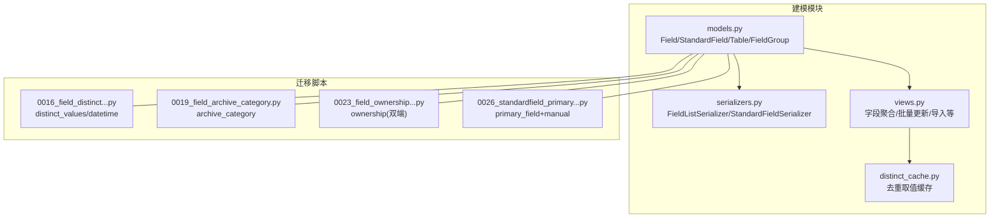
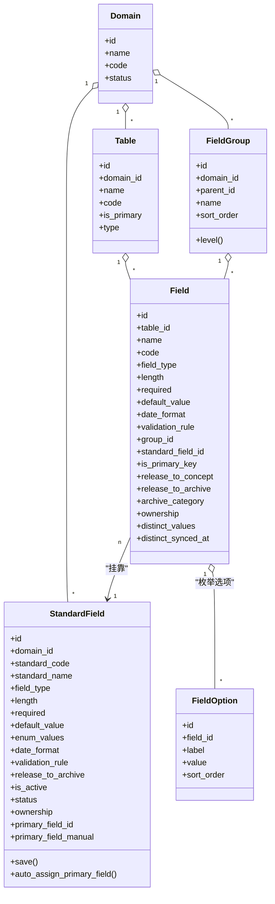
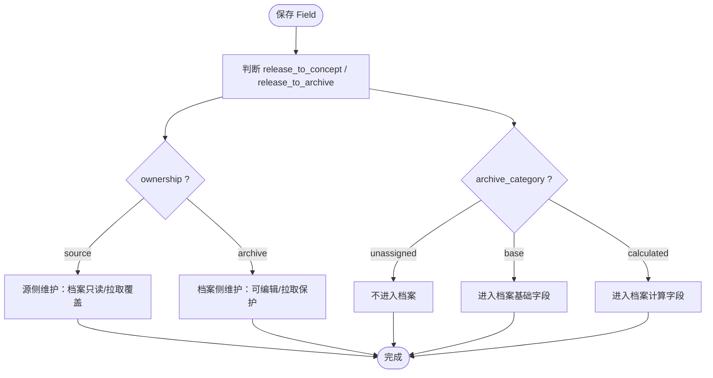
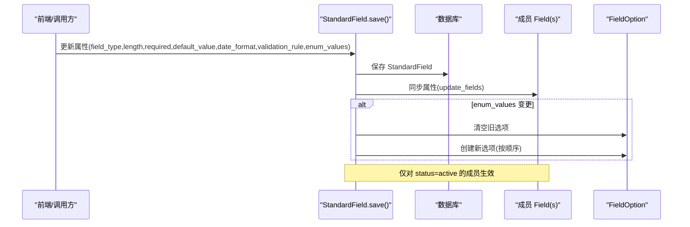
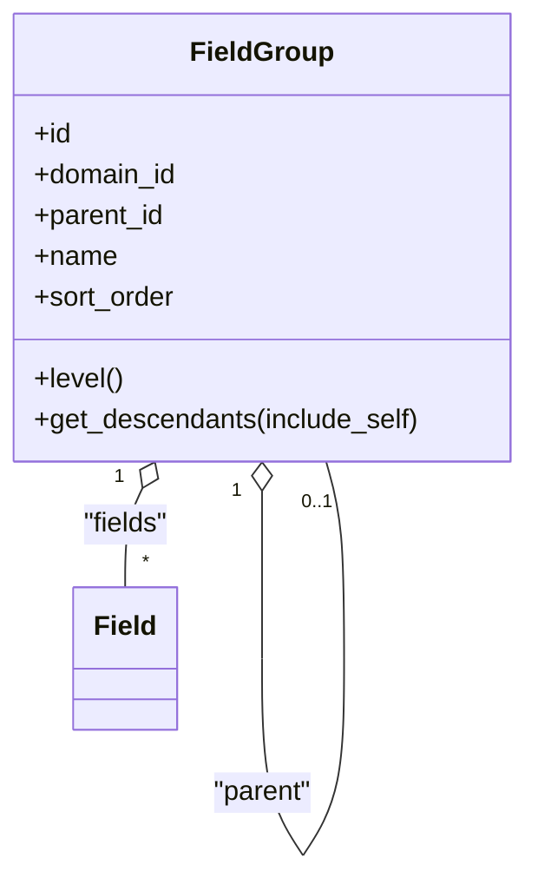
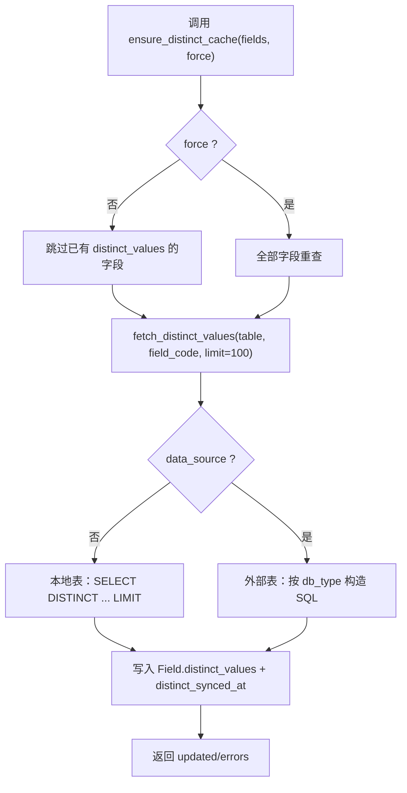
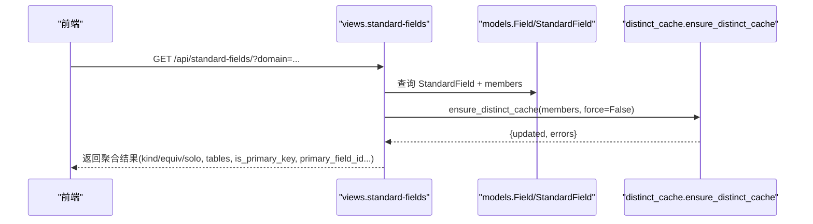

# 物理字段模型

<cite>
**本文引用的文件**   
- [models.py](file://backend/apps/modeling/models.py)
- [distinct_cache.py](file://backend/apps/modeling/distinct_cache.py)
- [serializers.py](file://backend/apps/modeling/serializers.py)
- [views.py](file://backend/apps/modeling/views.py)
- [0016_field_distinct_synced_at_field_distinct_values.py](file://backend/apps/modeling/migrations/0016_field_distinct_synced_at_field_distinct_values.py)
- [0019_field_archive_category.py](file://backend/apps/modeling/migrations/0019_field_archive_category.py)
- [0023_field_ownership_standardfield_ownership.py](file://backend/apps/modeling/migrations/0023_field_ownership_standardfield_ownership.py)
- [0026_standardfield_primary_field_and_more.py](file://backend/apps/modeling/migrations/0026_standardfield_primary_field_and_more.py)
</cite>

## 目录
1. [引言](#引言)
2. [项目结构](#项目结构)
3. [核心组件](#核心组件)
4. [架构总览](#架构总览)
5. [详细组件分析](#详细组件分析)
6. [依赖关系分析](#依赖关系分析)
7. [性能考量](#性能考量)
8. [故障排查指南](#故障排查指南)
9. [结论](#结论)
10. [附录：字段说明与映射示例](#附录字段说明与映射示例)

## 引言
本文件面向“Field（物理字段）”实体，系统化阐述其数据库设计、状态管理、去重缓存机制、档案分类控制、字段维护方策略、主键标识与数据样本缓存，以及与标准字段的挂靠关系。文档同时提供可视化图示与使用示例路径，帮助读者快速理解并正确使用该模型。

## 项目结构
围绕 Field 的核心代码集中在建模模块中，包含模型定义、序列化器、视图与去重缓存工具；迁移脚本用于演进字段属性与约束。



**图表来源** 
- [models.py](file://backend/apps/modeling/models.py)
- [serializers.py](file://backend/apps/modeling/serializers.py)
- [views.py](file://backend/apps/modeling/views.py)
- [distinct_cache.py](file://backend/apps/modeling/distinct_cache.py)
- [0016_field_distinct_synced_at_field_distinct_values.py](file://backend/apps/modeling/migrations/0016_field_distinct_synced_at_field_distinct_values.py)
- [0019_field_archive_category.py](file://backend/apps/modeling/migrations/0019_field_archive_category.py)
- [0023_field_ownership_standardfield_ownership.py](file://backend/apps/modeling/migrations/0023_field_ownership_standardfield_ownership.py)
- [0026_standardfield_primary_field_and_more.py](file://backend/apps/modeling/migrations/0026_standardfield_primary_field_and_more.py)

**章节来源**
- [models.py](file://backend/apps/modeling/models.py)
- [serializers.py](file://backend/apps/modeling/serializers.py)
- [views.py](file://backend/apps/modeling/views.py)
- [distinct_cache.py](file://backend/apps/modeling/distinct_cache.py)

## 核心组件
- 物理字段 Field：表级字段定义，承载类型、长度、必填、默认值、日期格式、校验规则、分组、是否主键、释放到概念层/档案、档案分类、维护方、去重样本缓存等。
- 标准字段 StandardField：概念层一等公民，跨表同义/同码字段归一化后的统一配置源，自动同步属性至成员（物理字段），支持枚举值同步、主字段选择与维护方策略。
- 字段分组 FieldGroup：多层嵌套分组（最多3层），支撑字段组织与展示。
- 枚举选项 FieldOption：枚举类型的选项值集合。
- 去重缓存 distinct_cache：按表与字段抽取去重取值样本（上限100条），写入 Field.distinct_values 与时间戳。

关键要点
- Field 通过 standard_field 外键挂靠到 StandardField，实现“多物理→一概念”的归并。
- StandardField.save() 在属性变更时自动同步到所有 active 成员 Field，并同步枚举选项。
- Field.archive_category 控制“基础/计算/未分配”，影响是否进入档案与后续流程。
- Field.ownership 与 StandardField.ownership 共同决定“源系统维护/档案维护”的数据流向与编辑权限。
- Field.is_primary_key 标记主键，参与主键识别与一致性检查。
- Field.distinct_values 与 distinct_synced_at 记录去重样本与读取时间，供匹配与人工识别。

**章节来源**
- [models.py:301-367](file://backend/apps/modeling/models.py#L301-L367)
- [models.py:162-300](file://backend/apps/modeling/models.py#L162-L300)
- [models.py:125-161](file://backend/apps/modeling/models.py#L125-L161)
- [models.py:369-385](file://backend/apps/modeling/models.py#L369-L385)
- [distinct_cache.py:27-122](file://backend/apps/modeling/distinct_cache.py#L27-L122)

## 架构总览
下图展示了 Field 与相关实体的关系及数据流：Field 挂靠 StandardField，受 FieldGroup 分组；去重缓存由 distinct_cache 填充；视图层暴露聚合接口，供前端展示与操作。



**图表来源** 
- [models.py:32-124](file://backend/apps/modeling/models.py#L32-L124)
- [models.py:125-161](file://backend/apps/modeling/models.py#L125-L161)
- [models.py:162-300](file://backend/apps/modeling/models.py#L162-L300)
- [models.py:301-367](file://backend/apps/modeling/models.py#L301-L367)
- [models.py:369-385](file://backend/apps/modeling/models.py#L369-L385)

## 详细组件分析

### Field（物理字段）模型
- 字段类型系统：string/number/date/boolean/enum，配合 length、date_format、validation_rule、enum_values（经 FieldOption 持久化）。
- 分组关联：group 外键指向 FieldGroup，支持多级分组树形展示与排序。
- 标准字段挂靠：standard_field 外键指向 StandardField，实现跨表同义/同码字段的统一管理与属性同步。
- 状态管理：status 为 active/deprecated；release_to_concept/release_to_archive 控制是否进入概念层与档案。
- 档案分类控制：archive_category 为 unassigned/base/calculated，影响归档与后续处理。
- 维护方策略：ownership 为 source/archive，决定拉取覆盖或保护策略。
- 主键标识：is_primary_key 标记主键，参与主键识别与一致性检查。
- 数据样本缓存：distinct_values 存储去重取值样本（上限100条），distinct_synced_at 记录读取时间。



**图表来源** 
- [models.py:301-367](file://backend/apps/modeling/models.py#L301-L367)

**章节来源**
- [models.py:301-367](file://backend/apps/modeling/models.py#L301-L367)

### StandardField（标准字段）与 Field 的挂靠关系
- 标准字段作为概念层统一配置源，属性变更后自动同步至所有 active 成员 Field。
- 主字段 primary_field 指定档案更新的唯一数据源头；primary_field_manual 标记是否人工指定。
- 自动分配逻辑：当主表变更或成员变化时，优先选择主表成员为主字段；无主表成员则留空强制人工设置。
- 枚举值同步：StandardField.enum_values 变更会清空并重建成员的 FieldOption。



**图表来源** 
- [models.py:230-299](file://backend/apps/modeling/models.py#L230-L299)

**章节来源**
- [models.py:162-300](file://backend/apps/modeling/models.py#L162-L300)

### 字段分组 FieldGroup
- 支持 parent 自引用，层级最多3层；提供 level 计算与 get_descendants 递归获取后代。
- 字段可按 group 归属任意层级，便于树形展示与二级表头渲染。



**图表来源** 
- [models.py:125-161](file://backend/apps/modeling/models.py#L125-L161)

**章节来源**
- [models.py:125-161](file://backend/apps/modeling/models.py#L125-L161)

### 去重缓存机制（distinct_cache）
- fetch_distinct_values：针对本地表或外部数据源表，动态构造 SQL 抽取去重样本（上限 limit 条）。
- ensure_distinct_cache：按需或强制刷新 Field.distinct_values 与 distinct_synced_at，返回统计与错误信息。
- 支持 PostgreSQL/MySQL/SQL Server/Oracle 多种引擎，按 db_type 生成差异化 SQL。



**图表来源** 
- [distinct_cache.py:27-122](file://backend/apps/modeling/distinct_cache.py#L27-L122)

**章节来源**
- [distinct_cache.py:27-122](file://backend/apps/modeling/distinct_cache.py#L27-L122)

### 视图与序列化器（API 视角）
- FieldListSerializer：暴露 Field 的基础属性、分组名、选项、去重样本等。
- StandardFieldSerializer：暴露成员列表、成员去重样本、主字段信息等。
- views.py 中的 standard-fields 聚合接口：返回 equiv/solo 两类字段，含 tables、is_primary_key、primary_field_id 等元信息，供前端展示与操作。



**图表来源** 
- [serializers.py:116-200](file://backend/apps/modeling/serializers.py#L116-L200)
- [views.py:1352-1412](file://backend/apps/modeling/views.py#L1352-L1412)

**章节来源**
- [serializers.py:116-200](file://backend/apps/modeling/serializers.py#L116-L200)
- [views.py:1352-1412](file://backend/apps/modeling/views.py#L1352-L1412)

## 依赖关系分析
- Field 依赖 Table、FieldGroup、StandardField、FieldOption。
- StandardField 依赖 Domain、Field（primary_field）、FieldOption（通过成员同步）。
- 视图依赖 models 与 distinct_cache 工具。
- 迁移脚本驱动字段属性的演进与默认值设置。

```mermaid
graph LR
Field --> Table
Field --> FieldGroup
Field --> StandardField
Field --> FieldOption
StandardField --> Domain
StandardField --> Field : "primary_field"
Views --> Models
Views --> DistinctCache
```

**图表来源** 
- [models.py:32-385](file://backend/apps/modeling/models.py#L32-L385)
- [views.py:1-200](file://backend/apps/modeling/views.py#L1-L200)
- [distinct_cache.py:1-122](file://backend/apps/modeling/distinct_cache.py#L1-L122)

**章节来源**
- [models.py:32-385](file://backend/apps/modeling/models.py#L32-L385)
- [views.py:1-200](file://backend/apps/modeling/views.py#L1-L200)
- [distinct_cache.py:1-122](file://backend/apps/modeling/distinct_cache.py#L1-L122)

## 性能考量
- 去重样本限制：limit=100，避免大表全量扫描；按需刷新减少 IO。
- 外部数据源连接：动态 alias 连接，用完即清理，避免连接泄漏。
- 批量更新：StandardField 属性同步采用 update_fields 批量更新，减少往返。
- 索引建议：对 table.code、field.code、standard_field_id、archive_category、status 建立合适索引以提升查询效率。

[本节为通用指导，无需具体文件引用]

## 故障排查指南
- 去重样本为空或过期：检查 distinct_synced_at 是否为空或较旧；调用 ensure_distinct_cache(force=True) 强制刷新。
- 标准字段属性未同步：确认成员 Field.status=active；查看 StandardField.save() 是否触发同步。
- 主字段缺失：若 StandardField.primary_field 为空，需人工设置；主表切换后自动分配的会跟随，人工指定的不会改变。
- 档案分类异常：确认 archive_category 是否正确设置为 base/calculated/unassigned；release_to_concept/release_to_archive 开关是否符合预期。
- 维护方策略冲突：ownership=source 时档案侧不可编辑；ownership=archive 时档案侧可编辑且拉取保护。

**章节来源**
- [distinct_cache.py:100-122](file://backend/apps/modeling/distinct_cache.py#L100-L122)
- [models.py:230-299](file://backend/apps/modeling/models.py#L230-L299)
- [models.py:255-274](file://backend/apps/modeling/models.py#L255-L274)

## 结论
Field（物理字段）模型以“多物理→一概念”的挂靠为核心，结合分组、状态、档案分类、维护方策略与去重缓存，构建了灵活而严谨的字段管理体系。通过 StandardField 的属性同步与主字段机制，确保档案数据的一致性与可控性；distinct_cache 提供高效的数据样本能力，支撑匹配与人工识别。整体设计兼顾扩展性与性能，适合复杂主数据建模场景。

[本节为总结，无需具体文件引用]

## 附录：字段说明与映射示例
- 字段类型系统：string/number/date/boolean/enum，配合 length、date_format、validation_rule、enum_values（FieldOption）。
- 分组关联：Field.group → FieldGroup，支持多级树形展示。
- 标准字段挂靠：Field.standard_field → StandardField，实现跨表同义/同码归并。
- 状态管理：Field.status（active/deprecated）、release_to_concept/release_to_archive、archive_category（unassigned/base/calculated）。
- 维护方策略：Field.ownership/StandardField.ownership（source/archive）。
- 主键标识：Field.is_primary_key。
- 数据样本缓存：Field.distinct_values（上限100条）、distinct_synced_at。

使用示例（路径参考）
- 字段聚合接口：views.py 中 standard-fields action（返回 equiv/solo 两类字段，含 tables、is_primary_key、primary_field_id）。
- 去重缓存刷新：distinct_cache.ensure_distinct_cache(fields, force=False/True)。
- 标准字段属性同步：StandardField.save() 自动同步至成员 Field，并重建 FieldOption。

**章节来源**
- [models.py:301-367](file://backend/apps/modeling/models.py#L301-L367)
- [models.py:162-300](file://backend/apps/modeling/models.py#L162-L300)
- [distinct_cache.py:100-122](file://backend/apps/modeling/distinct_cache.py#L100-L122)
- [views.py:1352-1412](file://backend/apps/modeling/views.py#L1352-L1412)