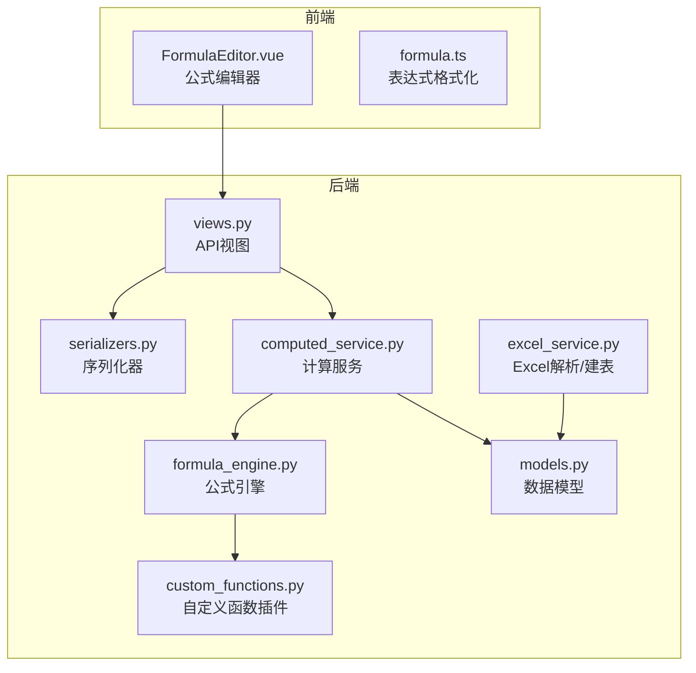
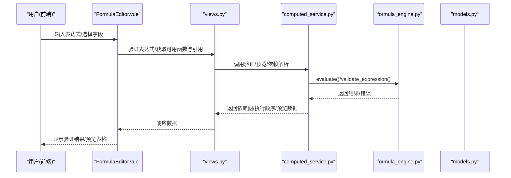
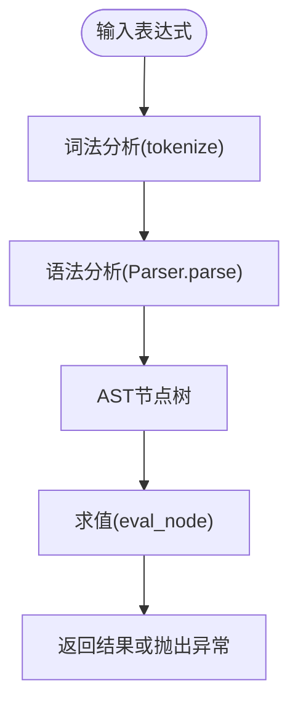
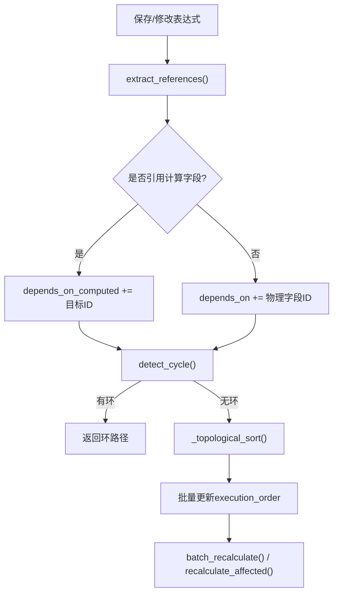
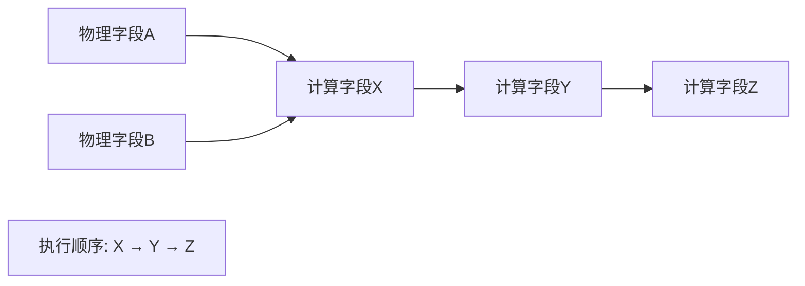

# 计算字段模型

<cite>
**本文引用的文件**   
- [models.py](file://backend/apps/modeling/models.py)
- [formula_engine.py](file://backend/apps/modeling/formula_engine.py)
- [computed_service.py](file://backend/apps/modeling/computed_service.py)
- [serializers.py](file://backend/apps/modeling/serializers.py)
- [views.py](file://backend/apps/modeling/views.py)
- [custom_functions.py](file://backend/apps/modeling/custom_functions.py)
- [excel_service.py](file://backend/apps/modeling/excel_service.py)
- [FormulaEditor.vue](file://frontend/src/views/modeling/components/FormulaEditor.vue)
- [formula.ts](file://frontend/src/utils/formula.ts)
</cite>

## 目录
1. [简介](#简介)
2. [项目结构](#项目结构)
3. [核心组件](#核心组件)
4. [架构总览](#架构总览)
5. [详细组件分析](#详细组件分析)
6. [依赖关系与DAG执行](#依赖关系与dag执行)
7. [性能考量](#性能考量)
8. [故障排查指南](#故障排查指南)
9. [结论](#结论)
10. [附录：字段说明与公式语法示例](#附录字段说明与公式语法示例)

## 简介
本文件围绕“计算字段（ComputedField）”实体，给出面向数据库设计与实现的完整文档。内容覆盖：
- Excel风格公式的解析、求值与函数扩展机制
- 依赖关系管理与DAG拓扑排序的执行顺序
- 与物理字段的依赖、与其他计算字段的引用关系
- 输出类型控制、分组管理、释放到档案的配置
- 完整的字段说明、公式语法示例与执行流程

## 项目结构
后端以Django应用“modeling”为核心，提供数据模型、公式引擎、计算服务、序列化器与视图；前端通过Vue组件提供公式编辑器、函数库、字段引用与数据预览能力。



图表来源
- [models.py:421-472](file://backend/apps/modeling/models.py#L421-L472)
- [formula_engine.py:1-10](file://backend/apps/modeling/formula_engine.py#L1-L10)
- [computed_service.py:1-20](file://backend/apps/modeling/computed_service.py#L1-L20)
- [serializers.py:281-310](file://backend/apps/modeling/serializers.py#L281-L310)
- [views.py:1-25](file://backend/apps/modeling/views.py#L1-L25)
- [custom_functions.py:1-20](file://backend/apps/modeling/custom_functions.py#L1-L20)
- [excel_service.py:1-20](file://backend/apps/modeling/excel_service.py#L1-L20)
- [FormulaEditor.vue:1-40](file://frontend/src/views/modeling/components/FormulaEditor.vue#L1-L40)
- [formula.ts:1-20](file://frontend/src/utils/formula.ts#L1-L20)

章节来源
- [models.py:421-472](file://backend/apps/modeling/models.py#L421-L472)
- [formula_engine.py:1-10](file://backend/apps/modeling/formula_engine.py#L1-L10)
- [computed_service.py:1-20](file://backend/apps/modeling/computed_service.py#L1-L20)
- [serializers.py:281-310](file://backend/apps/modeling/serializers.py#L281-L310)
- [views.py:1-25](file://backend/apps/modeling/views.py#L1-L25)
- [custom_functions.py:1-20](file://backend/apps/modeling/custom_functions.py#L1-L20)
- [excel_service.py:1-20](file://backend/apps/modeling/excel_service.py#L1-L20)
- [FormulaEditor.vue:1-40](file://frontend/src/views/modeling/components/FormulaEditor.vue#L1-L40)
- [formula.ts:1-20](file://frontend/src/utils/formula.ts#L1-L20)

## 核心组件
- ComputedField 模型：定义计算字段的存储结构与元信息（编码、名称、表达式、依赖、执行顺序、输出类型、分组、是否释放到档案等）。
- 公式引擎：词法分析、语法分析、AST构建与求值，内置丰富函数族，支持IFERROR惰性求值与错误处理。
- 计算服务：依赖解析、DAG构建、循环检测、拓扑排序、批量重算、受影响字段定位、枚举试算与表达式预览。
- 序列化器与视图：对外暴露CRUD、验证、预览、可用函数/引用列表、插件管理等接口。
- 自定义函数插件：通过装饰器注册Python函数，无缝接入校验、求值与前端函数库展示。
- Excel服务：从Excel推断字段类型并创建本地表与字段记录，为计算字段提供物理字段基础。
- 前端公式编辑器：可视化编辑、实时验证、数据预览、AI生成表达式、函数库与字段引用面板、技术函数插件管理。

章节来源
- [models.py:421-472](file://backend/apps/modeling/models.py#L421-L472)
- [formula_engine.py:1-10](file://backend/apps/modeling/formula_engine.py#L1-L10)
- [computed_service.py:1-20](file://backend/apps/modeling/computed_service.py#L1-L20)
- [serializers.py:281-310](file://backend/apps/modeling/serializers.py#L281-L310)
- [views.py:1-25](file://backend/apps/modeling/views.py#L1-L25)
- [custom_functions.py:1-20](file://backend/apps/modeling/custom_functions.py#L1-L20)
- [excel_service.py:1-20](file://backend/apps/modeling/excel_service.py#L1-L20)
- [FormulaEditor.vue:1-40](file://frontend/src/views/modeling/components/FormulaEditor.vue#L1-L40)

## 架构总览
计算字段的核心链路：
- 用户在前端输入Excel风格公式 → 后端公式引擎进行词法/语法分析 → AST求值 → 结果写入档案记录。
- 依赖解析阶段自动抽取对物理字段与计算字段的引用，构建DAG并计算执行顺序。
- 批量重算按DAG顺序逐条记录执行，受影响的计算字段仅重算相关部分。



图表来源
- [FormulaEditor.vue:686-754](file://frontend/src/views/modeling/components/FormulaEditor.vue#L686-L754)
- [views.py:1-25](file://backend/apps/modeling/views.py#L1-L25)
- [computed_service.py:21-85](file://backend/apps/modeling/computed_service.py#L21-L85)
- [formula_engine.py:775-796](file://backend/apps/modeling/formula_engine.py#L775-L796)
- [models.py:421-472](file://backend/apps/modeling/models.py#L421-L472)

## 详细组件分析

### 数据模型：ComputedField
- 关键字段
  - domain: 所属域
  - code/name: 编码与名称
  - expression: Excel风格公式
  - depends_on: 多对多依赖的物理字段
  - depends_on_computed: 多对多依赖的其他计算字段（非对称）
  - parsed_references: 解析后的引用列表（JSON）
  - execution_order: DAG拓扑排序位次
  - output_type: 输出类型（文本/数字/日期/布尔）
  - group: 字段分组
  - release_to_archive: 是否释放到档案
  - status: 启用/废弃
- 约束与索引
  - 域内code唯一
  - 按execution_order、code、id排序

```mermaid
classDiagram
class Domain {
+id
+name
+code
}
class FieldGroup {
+id
+name
+sort_order
}
class Field {
+id
+table_id
+code
+name
+status
}
class ComputedField {
+id
+domain_id
+code
+name
+expression
+parsed_references
+execution_order
+output_type
+group_id
+release_to_archive
+status
}
Domain "1" --> "*" ComputedField : "拥有"
FieldGroup "1" --> "*" ComputedField : "分组"
Field "1" --o{ ComputedField : "被依赖"
ComputedField "1" --o{ ComputedField : "依赖其他计算字段"
```

图表来源
- [models.py:421-472](file://backend/apps/modeling/models.py#L421-L472)

章节来源
- [models.py:421-472](file://backend/apps/modeling/models.py#L421-L472)

### 公式引擎：词法/语法/求值
- 词法分析：识别数字、字符串、布尔、字段引用{表名.字段名}、函数名、运算符、括号、逗号。
- 语法分析：递归下降解析，优先级从低到高（比较→加减拼接→乘除→一元→原子），产出AST。
- 求值器：递归求值AST节点，支持二元运算、一元负号、函数调用、IFERROR惰性求值。
- 函数注册：register_function装饰器统一注册，支持参数数量校验与分类描述。
- 内置函数族：逻辑、字符串、数字、判空、日期等，覆盖常用场景。



图表来源
- [formula_engine.py:99-197](file://backend/apps/modeling/formula_engine.py#L99-L197)
- [formula_engine.py:253-366](file://backend/apps/modeling/formula_engine.py#L253-L366)
- [formula_engine.py:669-768](file://backend/apps/modeling/formula_engine.py#L669-L768)

章节来源
- [formula_engine.py:99-197](file://backend/apps/modeling/formula_engine.py#L99-L197)
- [formula_engine.py:253-366](file://backend/apps/modeling/formula_engine.py#L253-L366)
- [formula_engine.py:669-768](file://backend/apps/modeling/formula_engine.py#L669-L768)

### 计算服务：依赖解析、DAG与重算
- 依赖解析：从表达式提取引用，区分物理字段与计算字段依赖，更新M2M与parsed_references。
- 循环检测：DFS检测DAG环，返回路径以便提示修复。
- 拓扑排序：Kahn算法计算execution_order，确保批处理顺序正确。
- 批量重算：按execution_order遍历记录，构建上下文并调用evaluate，增量更新record.data。
- 受影响字段定位：基于parsed_references传播依赖，最小化重算范围。
- 枚举试算与预览：根据去重值构建参数空间，采样组合计算输出，限制最大组合数。



图表来源
- [computed_service.py:21-85](file://backend/apps/modeling/computed_service.py#L21-L85)
- [computed_service.py:110-162](file://backend/apps/modeling/computed_service.py#L110-L162)
- [computed_service.py:164-208](file://backend/apps/modeling/computed_service.py#L164-L208)
- [computed_service.py:215-278](file://backend/apps/modeling/computed_service.py#L215-L278)
- [computed_service.py:280-330](file://backend/apps/modeling/computed_service.py#L280-L330)

章节来源
- [computed_service.py:21-85](file://backend/apps/modeling/computed_service.py#L21-L85)
- [computed_service.py:110-162](file://backend/apps/modeling/computed_service.py#L110-L162)
- [computed_service.py:164-208](file://backend/apps/modeling/computed_service.py#L164-L208)
- [computed_service.py:215-278](file://backend/apps/modeling/computed_service.py#L215-L278)
- [computed_service.py:280-330](file://backend/apps/modeling/computed_service.py#L280-L330)

### 序列化器与视图：API契约
- ComputedFieldSerializer：暴露依赖图、分组名、执行顺序、输出类型、是否释放到档案等。
- 视图层：提供CRUD、验证表达式、预览数据、可用函数/引用列表、插件管理等动作。
- 依赖图：upstream包含物理字段与计算字段，downstream列出下游依赖的计算字段。

章节来源
- [serializers.py:281-310](file://backend/apps/modeling/serializers.py#L281-L310)
- [views.py:1-25](file://backend/apps/modeling/views.py#L1-L25)

### 自定义函数插件：扩展机制
- 使用@register_function装饰器注册函数，统一纳入校验、求值与前端函数库。
- 内置示例：PAD_LEFT、REGEX_EXTRACT/REPLACE、SPLIT_INDEX、MAP_VALUE、HASH_MD5等。
- 运行时重载：前端上传.py插件后动态加载，无需重启服务。

章节来源
- [custom_functions.py:1-108](file://backend/apps/modeling/custom_functions.py#L1-L108)

### Excel服务：物理字段基础
- 解析Excel列名与前若干行样本数据，推断字段类型（优先AI，失败回退启发式）。
- 在本地PostgreSQL中CREATE TABLE并创建Table/Field记录，供计算字段引用。

章节来源
- [excel_service.py:1-156](file://backend/apps/modeling/excel_service.py#L1-L156)

### 前端公式编辑器：交互与预览
- 公式编辑区：支持格式化、验证、插入字段引用与函数。
- 侧边栏：字段引用（按表分组）、函数库（按分类分组）、技术函数插件管理。
- 数据预览：基于去重值组合计算输出，支持切换全部/前N条。
- AI生成：自然语言描述自动生成编码、名称、输出类型与表达式，附带解释与风险提示。

章节来源
- [FormulaEditor.vue:1-800](file://frontend/src/views/modeling/components/FormulaEditor.vue#L1-L800)
- [formula.ts:1-95](file://frontend/src/utils/formula.ts#L1-L95)

## 依赖关系与DAG执行
- 依赖来源
  - 物理字段：通过{表名.字段名}引用，解析为depends_on。
  - 计算字段：通过计算字段code引用，解析为depends_on_computed。
- 执行顺序
  - 无环时，Kahn算法计算拓扑序，写入execution_order。
  - 批处理按execution_order递增执行，保证依赖先于被依赖计算。
- 受影响字段
  - 变更物理字段后，基于parsed_references传播影响，仅重算相关计算字段。
- 循环依赖
  - DFS检测环，返回路径提示用户修正。



图表来源
- [computed_service.py:21-85](file://backend/apps/modeling/computed_service.py#L21-L85)
- [computed_service.py:164-208](file://backend/apps/modeling/computed_service.py#L164-L208)

章节来源
- [computed_service.py:21-85](file://backend/apps/modeling/computed_service.py#L21-L85)
- [computed_service.py:164-208](file://backend/apps/modeling/computed_service.py#L164-L208)

## 性能考量
- 表达式验证与预览：默认限制最大组合数，避免笛卡尔积爆炸；支持采样策略保证多样性。
- 批量重算：按execution_order顺序执行，减少重复查询；记录级更新，避免全表扫描。
- 去重值缓存：按需填充distinct_values，失败不阻断，降级为占位。
- 函数求值：IFERROR惰性求值，降低错误分支开销。

[本节为通用指导，不直接分析具体文件]

## 故障排查指南
- 语法错误：检查字段引用格式{表名.字段名}、字符串闭合、括号匹配。
- 引用未找到：确认表名与字段编码存在且处于active状态。
- 运行时错误：除零、类型不匹配、函数参数数量不符等。
- 循环依赖：查看返回的环路径，调整引用关系。
- 预览为空：检查去重值缓存是否已填充，必要时触发刷新。

章节来源
- [formula_engine.py:23-52](file://backend/apps/modeling/formula_engine.py#L23-L52)
- [computed_service.py:110-162](file://backend/apps/modeling/computed_service.py#L110-L162)

## 结论
计算字段模型通过Excel风格公式提供了灵活的推导能力，配合完善的依赖解析、DAG执行与丰富的函数生态，能够满足复杂业务场景下的字段计算需求。前端编辑器与AI辅助进一步降低了使用门槛，提升了效率与可维护性。

[本节为总结，不直接分析具体文件]

## 附录：字段说明与公式语法示例

### ComputedField字段说明
- domain: 所属域
- code: 字段编码（域内唯一）
- name: 字段名称
- expression: Excel风格公式
- depends_on: 依赖的物理字段
- depends_on_computed: 依赖的其他计算字段
- parsed_references: 解析后的引用列表
- execution_order: 执行顺序
- output_type: 输出类型（text/number/date/boolean）
- group: 字段分组
- release_to_archive: 是否释放到档案
- status: 启用/废弃

章节来源
- [models.py:421-472](file://backend/apps/modeling/models.py#L421-L472)

### 公式语法示例
- 条件判断：IF({员工表.等级}="A",{员工表.基本工资}*1.5,{员工表.基本工资})
- 文本拼接：CONCAT({门店表.简称},"-",{部门表.编号})
- 数学运算：ROUND({订单表.金额}*1.1,2)
- 日期差：DATEDIF({入职表.入职日期},{当前日期},D)
- 判空处理：IFERROR({订单表.折扣}/{订单表.数量},0)

章节来源
- [formula_engine.py:392-443](file://backend/apps/modeling/formula_engine.py#L392-L443)
- [formula_engine.py:447-516](file://backend/apps/modeling/formula_engine.py#L447-L516)
- [formula_engine.py:520-570](file://backend/apps/modeling/formula_engine.py#L520-L570)
- [formula_engine.py:598-631](file://backend/apps/modeling/formula_engine.py#L598-L631)

### 执行机制说明
- 新建/编辑表达式时，前端触发验证与预览，后端调用validate_expression与preview_expression。
- 保存后，parse_and_save_dependencies解析依赖并更新execution_order。
- 数据变更时，recalculate_affected定位受影响字段并按顺序重算，结果写入ArchiveRecord.data。

章节来源
- [computed_service.py:21-85](file://backend/apps/modeling/computed_service.py#L21-L85)
- [computed_service.py:280-330](file://backend/apps/modeling/computed_service.py#L280-L330)
- [formula_engine.py:775-796](file://backend/apps/modeling/formula_engine.py#L775-L796)