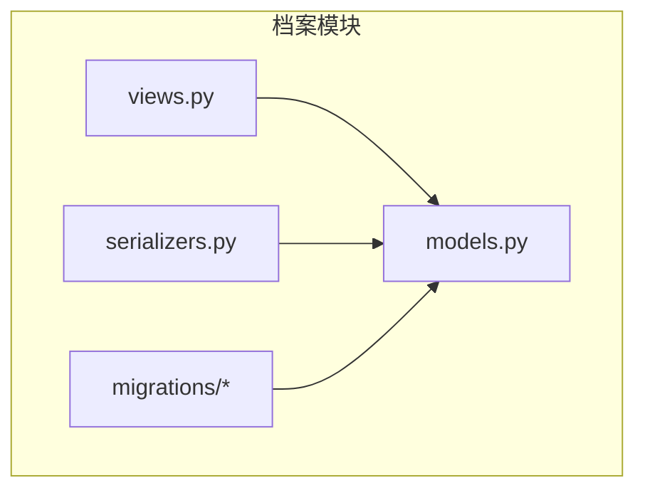
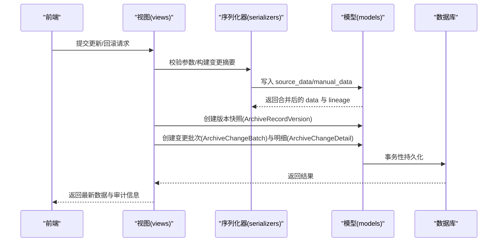
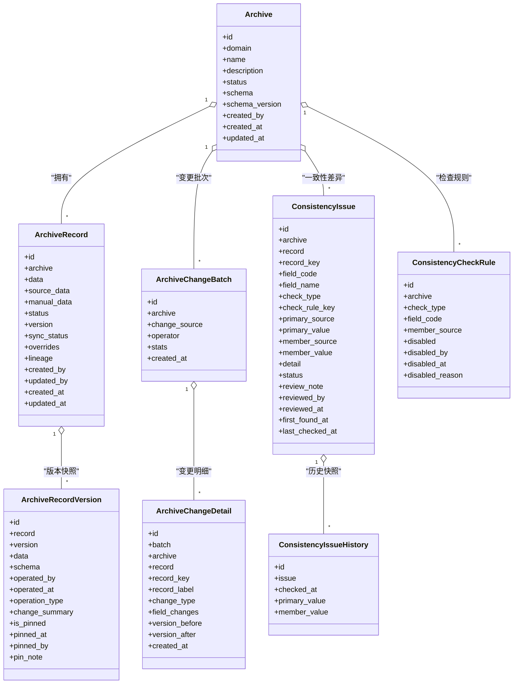
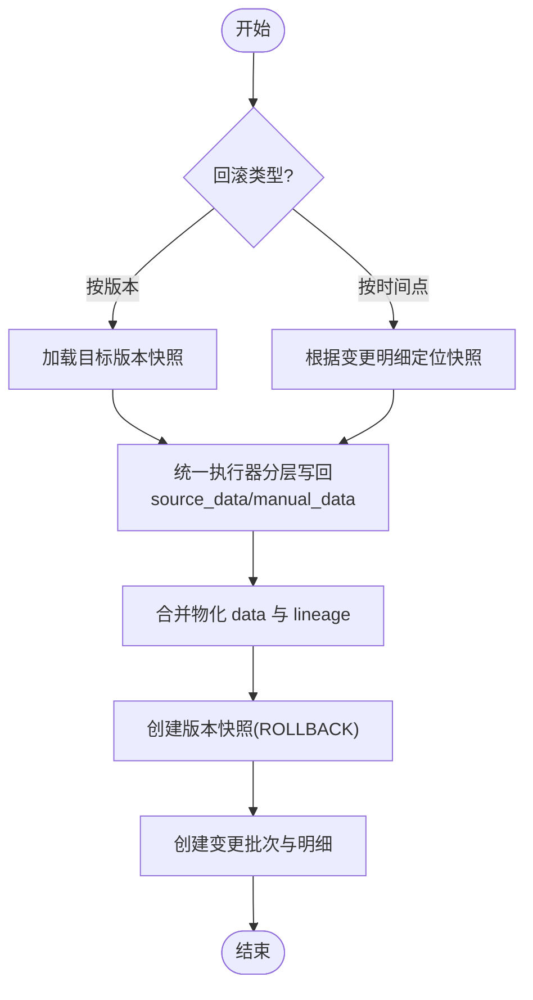
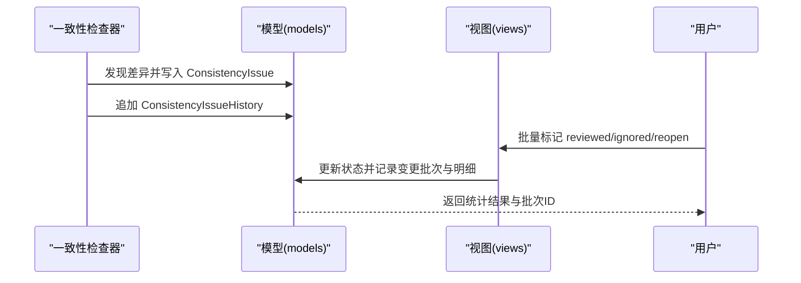
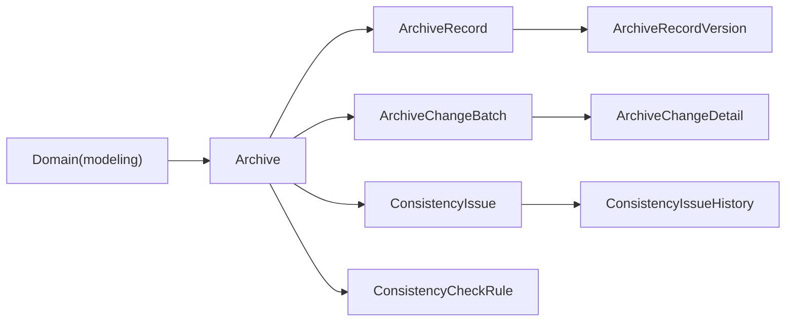

# 档案模型设计

<cite>
**本文引用的文件**   
- [models.py](file://backend/apps/archive/models.py)
- [0001_initial.py](file://backend/apps/archive/migrations/0001_initial.py)
- [0006_archivechangebatch_archivechangedetail_and_more.py](file://backend/apps/archive/migrations/0006_archivechangebatch_archivechangedetail_and_more.py)
- [0009_consistencyissuehistory.py](file://backend/apps/archive/migrations/0009_consistencyissuehistory.py)
- [0010_add_rollback_change_type.py](file://backend/apps/archive/migrations/0010_add_rollback_change_type.py)
- [0011_add_change_detail_version_mapping.py](file://backend/apps/archive/migrations/0011_add_change_detail_version_mapping.py)
- [0012_alter_archivechangedetail_change_type.py](file://backend/apps/archive/migrations/0012_alter_archivechangedetail_change_type.py)
- [0013_consistencycheckrule_and_more.py](file://backend/apps/archive/migrations/0013_consistencycheckrule_and_more.py)
- [views.py](file://backend/apps/archive/views.py)
- [serializers.py](file://backend/apps/archive/serializers.py)
</cite>

## 目录
1. [引言](#引言)
2. [项目结构](#项目结构)
3. [核心组件](#核心组件)
4. [架构总览](#架构总览)
5. [详细组件分析](#详细组件分析)
6. [依赖关系分析](#依赖关系分析)
7. [性能考虑](#性能考虑)
8. [故障排查指南](#故障排查指南)
9. [结论](#结论)
10. [附录](#附录)

## 引言
本设计文档面向 MetaData002 系统的“档案”模块，聚焦数据库层面的实体与表结构设计、版本控制机制、变更历史存储策略、一致性检查问题记录与处理流程，以及档案数据的生命周期管理与归档策略。文档以代码级事实为依据，结合迁移演进过程，给出可落地的数据模型与实现要点说明，帮助读者快速理解并正确使用该模块。

## 项目结构
档案模块位于后端 apps/archive 下，核心由 Django ORM 模型定义（models.py）与一系列迁移脚本构成；视图与序列化器负责 API 行为与数据流转。关键文件如下：
- models.py：定义 Archive、ArchiveRecord、ArchiveRecordVersion、ArchiveChangeBatch、ArchiveChangeDetail、ConsistencyIssue、ConsistencyCheckRule、ConsistencyIssueHistory 等实体。
- migrations/*：描述各实体的创建与字段演进，体现版本控制、变更批次、一致性检查规则等能力的逐步完善。
- views.py：提供版本管理、回滚、差异对比、同步日志、操作日志、一致性审核等接口逻辑。
- serializers.py：封装数据校验、变更记录生成、版本快照与标签计算等序列化逻辑。

图表来源 
- [models.py](file://backend/apps/archive/models.py)
- [views.py](file://backend/apps/archive/views.py)
- [serializers.py](file://backend/apps/archive/serializers.py)
- [0001_initial.py](file://backend/apps/archive/migrations/0001_initial.py)

章节来源
- [models.py](file://backend/apps/archive/models.py)
- [0001_initial.py](file://backend/apps/archive/migrations/0001_initial.py)

## 核心组件
本节概述档案相关核心实体及其职责：
- Archive（档案配置）：一个域对应一个档案，维护名称、状态、Schema 快照与版本号。
- ArchiveRecord（档案记录）：主数据实例，采用双层存储（source_data + manual_data），合并为 data，并维护 lineage 与 overrides。
- ArchiveRecordVersion（版本快照）：每次变更的完整数据快照，支持定版与操作类型标记。
- ArchiveChangeBatch（变更批次）：一次源侧同步或一次人工编辑产生的批次，聚合多条变更明细。
- ArchiveChangeDetail（变更明细）：单条记录的字段级旧值→新值，支持新增、修改、停用、复活、审核、忽略、回滚等类型。
- ConsistencyIssue（一致性差异记录）：记录多种检查类型的差异，支持状态流转与历史快照。
- ConsistencyCheckRule（一致性检查规则失效配置）：允许对特定规则失效，影响统计口径。
- ConsistencyIssueHistory（一致性差异历史）：按检查时间追加的历史轨迹。

章节来源
- [models.py](file://backend/apps/archive/models.py)

## 架构总览
档案模块的数据流围绕“源同步 → 合并物化 → 版本快照 → 变更批次与明细 → 一致性检查 → 回滚修复”展开。视图层通过序列化器完成输入校验与输出组装，模型层保证数据一致性与审计留痕。

图表来源 
- [views.py](file://backend/apps/archive/views.py)
- [serializers.py](file://backend/apps/archive/serializers.py)
- [models.py](file://backend/apps/archive/models.py)

章节来源
- [views.py](file://backend/apps/archive/views.py)
- [serializers.py](file://backend/apps/archive/serializers.py)
- [models.py](file://backend/apps/archive/models.py)

## 详细组件分析

### 实体关系图（类图）

图表来源 
- [models.py](file://backend/apps/archive/models.py)

章节来源
- [models.py](file://backend/apps/archive/models.py)

### 版本控制机制（数据快照、差异追踪、回滚）
- 数据快照：每次变更（创建、更新、删除、回滚、定版、模型同步）都会生成 ArchiveRecordVersion 快照，包含该版本的数据 data、当时的 schema 快照、操作人、时间与操作类型，并可定版锁定。
- 差异追踪：通过 ArchiveChangeDetail 记录字段级 old/new 变化，并关联到 ArchiveChangeBatch 批次；v18 引入 version_before/version_after 映射，便于按时间点定位快照。
- 回滚功能：支持两种回滚方式
  - 按版本回滚：根据目标版本快照恢复数据，统一执行器按 ownership 分层写回 source_data/manual_data，确保下次合并/刷新不丢失效果。
  - 按时间点回滚：基于变更明细的 version_after 定位快照进行恢复；存量明细无版本映射时降级为字段级回滚。

图表来源 
- [views.py](file://backend/apps/archive/views.py)
- [serializers.py](file://backend/apps/archive/serializers.py)
- [models.py](file://backend/apps/archive/models.py)

章节来源
- [views.py](file://backend/apps/archive/views.py)
- [serializers.py](file://backend/apps/archive/serializers.py)
- [models.py](file://backend/apps/archive/models.py)

### 变更历史记录存储策略与查询优化
- 存储策略：
  - 零变更不建批次：定时刷新无变更时不产生噪声。
  - 批次聚合：一次源侧同步或一次人工编辑产生一个 ArchiveChangeBatch，内含多条 ArchiveChangeDetail。
  - 字段级差异：field_changes 保存每个字段的 old/new，便于展示与回滚。
  - 版本映射：version_before/version_after 支撑按时间点回滚与快照定位。
- 查询优化：
  - 索引：在 archive+created_at 上建立索引，加速按档案与时间的查询。
  - 排序：默认按 id 或 created_at 降序，便于最近变更优先展示。
  - 过滤：API 支持按 archive、status、check_type、record_key 等维度过滤。

章节来源
- [models.py](file://backend/apps/archive/models.py)
- [0006_archivechangebatch_archivechangedetail_and_more.py](file://backend/apps/archive/migrations/0006_archivechangebatch_archivechangedetail_and_more.py)
- [0010_add_rollback_change_type.py](file://backend/apps/archive/migrations/0010_add_rollback_change_type.py)
- [0011_add_change_detail_version_mapping.py](file://backend/apps/archive/migrations/0011_add_change_detail_version_mapping.py)
- [0012_alter_archivechangedetail_change_type.py](file://backend/apps/archive/migrations/0012_alter_archivechangedetail_change_type.py)

### 一致性检查问题的记录与解决流程
- 检查类型：组合字段成员一致性、档案侧与源侧差异、源侧孤立记录、Schema 结构漂移。
- 记录结构：ConsistencyIssue 记录差异详情（主字段值、成员值、来源、补充详情），支持状态流转（待审核/已审核/已忽略/已消失）。
- 历史轨迹：ConsistencyIssueHistory 按检查时间追加快照，保留变化轨迹。
- 规则失效：ConsistencyCheckRule 允许对特定 check_type+field_code+member_source 失效，影响统计口径。
- 批量处理：支持批量标记 reviewed/ignored/reopen，并生成变更批次与明细（change_source='consistency'）。

图表来源 
- [models.py](file://backend/apps/archive/models.py)
- [views.py](file://backend/apps/archive/views.py)
- [0009_consistencyissuehistory.py](file://backend/apps/archive/migrations/0009_consistencyissuehistory.py)
- [0013_consistencycheckrule_and_more.py](file://backend/apps/archive/migrations/0013_consistencycheckrule_and_more.py)

章节来源
- [models.py](file://backend/apps/archive/models.py)
- [views.py](file://backend/apps/archive/views.py)
- [0009_consistencyissuehistory.py](file://backend/apps/archive/migrations/0009_consistencyissuehistory.py)
- [0013_consistencycheckrule_and_more.py](file://backend/apps/archive/migrations/0013_consistencycheckrule_and_more.py)

### 档案数据的生命周期管理与归档策略
- 生命周期阶段：
  - 草稿（draft）：初始创建，未发布。
  - 已发布（active）：对外可用，支持同步与变更。
  - 已归档（archived）：停止更新，仅读访问。
- 记录状态：启用（active）/已删除（deleted，软删除，保留快照可回滚）。
- Schema 管理：每次模型变更递增 schema_version，并在版本快照中保留当时 schema，用于回溯与兼容性处理。
- 同步状态：unsynced/synced/partial/error，反映源侧同步情况。

章节来源
- [models.py](file://backend/apps/archive/models.py)
- [0001_initial.py](file://backend/apps/archive/migrations/0001_initial.py)

## 依赖关系分析
- 模型依赖：
  - Archive 依赖 Domain（来自 modeling 应用），形成一对一关系。
  - ArchiveRecord 依赖 Archive，一对多版本快照与变更明细。
  - ArchiveChangeBatch 依赖 Archive，一对多变更明细。
  - ConsistencyIssue 依赖 Archive 与可选 Record，支持唯一约束与索引。
- 迁移依赖：
  - 从初始创建到后续增强（变更批次、一致性规则、版本映射等），迁移顺序清晰，体现能力演进。

图表来源 
- [models.py](file://backend/apps/archive/models.py)
- [0001_initial.py](file://backend/apps/archive/migrations/0001_initial.py)
- [0006_archivechangebatch_archivechangedetail_and_more.py](file://backend/apps/archive/migrations/0006_archivechangebatch_archivechangedetail_and_more.py)
- [0009_consistencyissuehistory.py](file://backend/apps/archive/migrations/0009_consistencyissuehistory.py)
- [0013_consistencycheckrule_and_more.py](file://backend/apps/archive/migrations/0013_consistencycheckrule_and_more.py)

章节来源
- [models.py](file://backend/apps/archive/models.py)
- [0001_initial.py](file://backend/apps/archive/migrations/0001_initial.py)
- [0006_archivechangebatch_archivechangedetail_and_more.py](file://backend/apps/archive/migrations/0006_archivechangebatch_archivechangedetail_and_more.py)
- [0009_consistencyissuehistory.py](file://backend/apps/archive/migrations/0009_consistencyissuehistory.py)
- [0013_consistencycheckrule_and_more.py](file://backend/apps/archive/migrations/0013_consistencycheckrule_and_more.py)

## 性能考虑
- 索引设计：
  - ArchiveRecord：archive+status 索引，加速按档案与状态的查询。
  - ArchiveOperationLog：archive+-created_at 索引，加速操作日志列表。
  - ArchiveChangeBatch/Detail：archive+-created_at 索引，加速变更历史查询。
  - ConsistencyIssue：archive+status、archive+check_type 索引，提升筛选效率。
- JSON 字段：
  - data/source_data/manual_data/lineage/overrides 使用 JSONField，适合灵活结构，但需注意查询条件尽量走索引列。
- 事务与原子性：
  - 回滚、版本快照、操作日志、变更批次与明细写入均在事务内完成，保证一致性。
- 分页与排序：
  - 列表接口默认按时间倒序，配合分页减少大数据量传输。

[本节为通用指导，不直接分析具体文件]

## 故障排查指南
- 常见错误与定位：
  - 回滚失败：检查目标版本是否存在、是否已定版不可修改、是否缺少版本映射（存量明细需降级字段级回滚）。
  - 同步状态异常：查看 sync_status 与同步日志（ArchiveSyncLog），确认源侧数据与合并逻辑。
  - 一致性差异持续存在：检查 ConsistencyCheckRule 是否失效、差异状态是否正确流转（OPEN→REVIEWED/IGNORED/RESOLVED）。
- 调试建议：
  - 查看版本快照与变更明细，确认 field_changes 与 version_before/version_after 是否正确。
  - 使用 compare_versions 接口对比两个版本的差异，定位具体字段变化。
  - 检查 lineage 与 overrides，确认字段来源与保护标记是否符合预期。

章节来源
- [views.py](file://backend/apps/archive/views.py)
- [serializers.py](file://backend/apps/archive/serializers.py)
- [models.py](file://backend/apps/archive/models.py)

## 结论
MetaData002 档案模型通过清晰的实体设计与严格的迁移演进，实现了完整的版本控制、变更追踪、一致性检查与回滚能力。双层存储与合并物化确保了源系统与档案侧数据的解耦与可控覆盖；批次与明细机制提供了高效的审计与回溯；一致性检查与规则失效机制增强了数据治理的灵活性。整体设计兼顾性能与可维护性，适用于企业级主数据管理场景。

[本节为总结性内容，不直接分析具体文件]

## 附录
- 术语表：
  - Schema：字段结构定义，包含 code、name、type、group、ownership 等元信息。
  - 双层存储：source_data（源侧底层）与 manual_data（人工覆盖层），合并为 data。
  - 版本快照：每次变更的完整数据快照，支持定版与回滚。
  - 变更批次：一次同步或编辑产生的批次，聚合多条变更明细。
  - 一致性检查：针对组合字段、源侧差异、孤立记录、Schema 漂移的检查。

[本节为概念性内容，不直接分析具体文件]