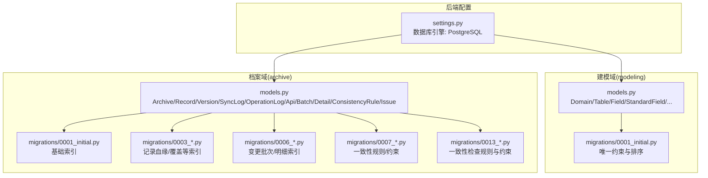
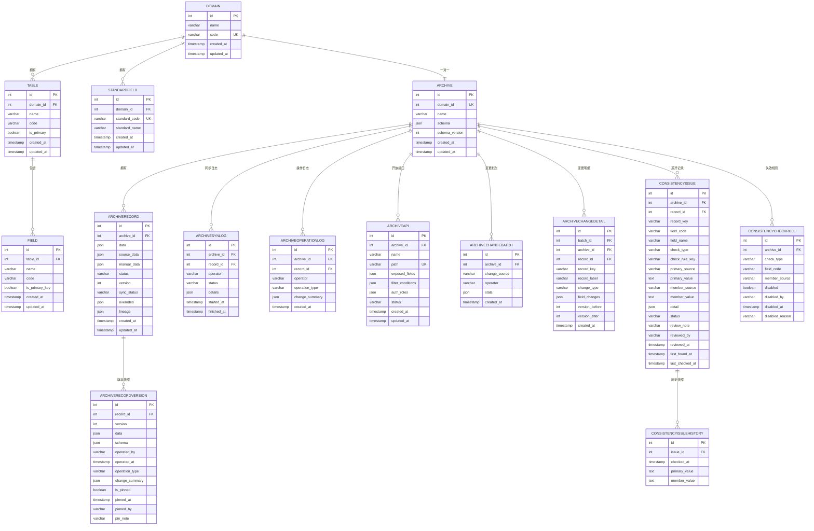
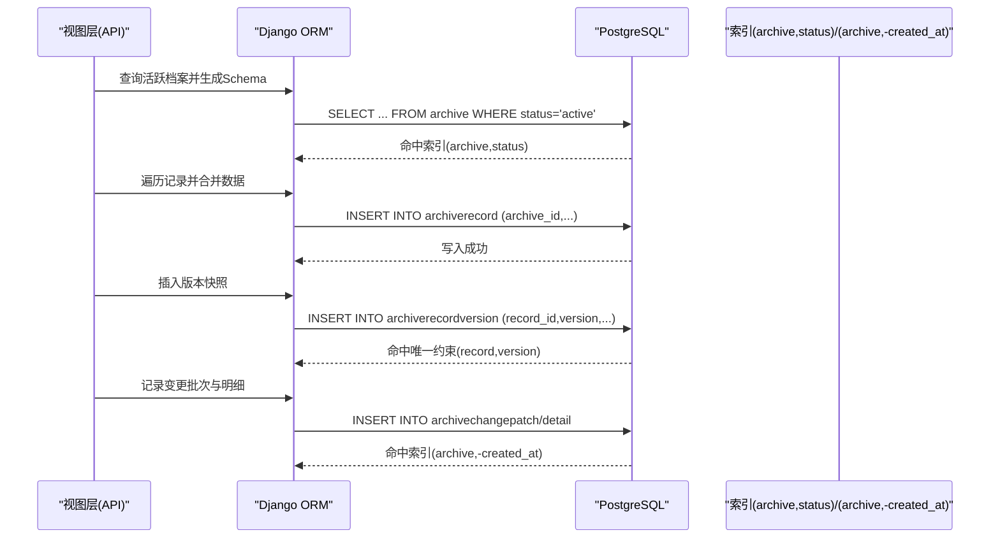
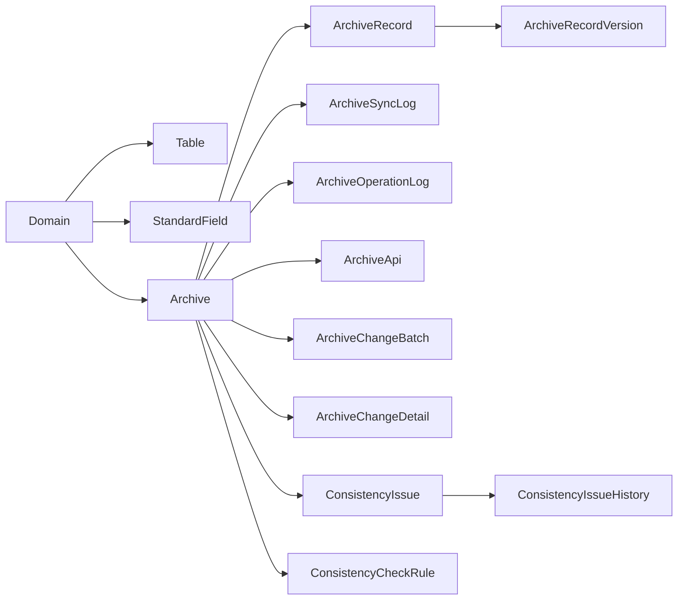

# 索引策略设计

<cite>
**本文引用的文件**   
- [backend/config/settings.py](file://backend/config/settings.py)
- [backend/apps/modeling/models.py](file://backend/apps/modeling/models.py)
- [backend/apps/archive/models.py](file://backend/apps/archive/models.py)
- [backend/apps/archive/migrations/0001_initial.py](file://backend/apps/archive/migrations/0001_initial.py)
- [backend/apps/archive/migrations/0003_archiverecord_lineage_archiverecord_overrides_and_more.py](file://backend/apps/archive/migrations/0003_archiverecord_lineage_archiverecord_overrides_and_more.py)
- [backend/apps/archive/migrations/0006_archivechangebatch_archivechangedetail_and_more.py](file://backend/apps/archive/migrations/0006_archivechangebatch_archivechangedetail_and_more.py)
- [backend/apps/archive/migrations/0007_alter_archivechangebatch_change_source_and_more.py](file://backend/apps/archive/migrations/0007_alter_archivechangebatch_change_source_and_more.py)
- [backend/apps/archive/migrations/0013_consistencycheckrule_and_more.py](file://backend/apps/archive/migrations/0013_consistencycheckrule_and_more.py)
- [backend/apps/modeling/migrations/0001_initial.py](file://backend/apps/modeling/migrations/0001_initial.py)
- [backend/apps/archive/views.py](file://backend/apps/archive/views.py)
- [backend/apps/modeling/views.py](file://backend/apps/modeling/views.py)
</cite>

## 目录
1. [引言](#引言)
2. [项目结构](#项目结构)
3. [核心组件](#核心组件)
4. [架构总览](#架构总览)
5. [详细组件分析](#详细组件分析)
6. [依赖关系分析](#依赖关系分析)
7. [性能考虑](#性能考虑)
8. [故障排查指南](#故障排查指南)
9. [结论](#结论)
10. [附录](#附录)

## 引言
本文件为 MetaData002 系统的数据库索引策略设计文档，聚焦 PostgreSQL 作为默认数据库引擎的索引设计与优化。内容涵盖：
- 各表的主键、唯一、复合与全文索引的使用场景
- 查询性能优化的索引策略（覆盖索引、部分索引、函数索引）
- 索引维护最佳实践（重建、统计信息更新、空间回收）
- 慢查询分析与优化建议
- PostgreSQL 特定索引类型与调优参数
- 监控索引使用与识别冗余索引的方法

## 项目结构
系统采用 Django ORM 建模，索引通过模型 Meta.indexes 或迁移文件定义。核心数据域包括“建模（modeling）”和“档案（archive）”两个应用模块，分别承载主数据建模元数据与档案化后的主数据实例及审计日志。

图表来源
- [backend/config/settings.py:56-66](file://backend/config/settings.py#L56-L66)
- [backend/apps/modeling/models.py:1-489](file://backend/apps/modeling/models.py#L1-L489)
- [backend/apps/archive/models.py:1-379](file://backend/apps/archive/models.py#L1-L379)
- [backend/apps/archive/migrations/0001_initial.py:110-127](file://backend/apps/archive/migrations/0001_initial.py#L110-L127)
- [backend/apps/archive/migrations/0003_archiverecord_lineage_archiverecord_overrides_and_more.py:45-45](file://backend/apps/archive/migrations/0003_archiverecord_lineage_archiverecord_overrides_and_more.py#L45-L45)
- [backend/apps/archive/migrations/0006_archivechangebatch_archivechangedetail_and_more.py:50-54](file://backend/apps/archive/migrations/0006_archivechangebatch_archivechangedetail_and_more.py#L50-L54)
- [backend/apps/archive/migrations/0007_alter_archivechangebatch_change_source_and_more.py:48-49](file://backend/apps/archive/migrations/0007_alter_archivechangebatch_change_source_and_more.py#L48-L49)
- [backend/apps/archive/migrations/0013_consistencycheckrule_and_more.py:63-76](file://backend/apps/archive/migrations/0013_consistencycheckrule_and_more.py#L63-L76)

章节来源
- [backend/config/settings.py:56-66](file://backend/config/settings.py#L56-L66)

## 核心组件
- 建模域（modeling）
  - Domain、Table、Field、StandardField、FieldGroup、ComputedField、FieldMapping、AIConfig 等
  - 主要使用唯一约束（unique_together）保障概念层与物理层的编码唯一性
- 档案域（archive）
  - Archive、ArchiveRecord、ArchiveRecordVersion、ArchiveSyncLog、ArchiveOperationLog、ArchiveApi、ArchiveChangeBatch、ArchiveChangeDetail、ConsistencyCheckRule、ConsistencyIssue、ConsistencyIssueHistory
  - 大量复合索引用于按 archive 分片的高效过滤与分页排序

章节来源
- [backend/apps/modeling/models.py:1-489](file://backend/apps/modeling/models.py#L1-L489)
- [backend/apps/archive/models.py:1-379](file://backend/apps/archive/models.py#L1-L379)

## 架构总览
下图展示建模与档案两大域的实体关系，以及关键约束与索引位置。

图表来源
- [backend/apps/modeling/models.py:1-489](file://backend/apps/modeling/models.py#L1-L489)
- [backend/apps/archive/models.py:1-379](file://backend/apps/archive/models.py#L1-L379)

## 详细组件分析

### 建模域（modeling）索引与约束
- 唯一约束
  - Table(domain, code) 唯一：保证域内表编码唯一
  - Field(table, code) 唯一：保证表内字段编码唯一
  - FieldOption(field, value) 唯一：枚举值唯一
  - StandardField(domain, standard_code) 唯一：标准字段编码唯一
  - ComputedField(domain, code) 唯一：计算字段编码唯一
  - FieldMapping(source_table, source_field, target_table, target_field) 唯一：映射唯一
- 排序与访问模式
  - 多表通过 ordering 指定默认排序，利于分页与列表渲染
- 索引建议
  - 对频繁外键关联列（如 table_id、domain_id）可考虑 B-Tree 索引（ORM 通常自动为外键建索引）
  - 若存在按 status、created_at 的过滤与排序，可在对应列上建立复合索引以提升分页性能

章节来源
- [backend/apps/modeling/migrations/0001_initial.py:60-127](file://backend/apps/modeling/migrations/0001_initial.py#L60-L127)
- [backend/apps/modeling/models.py:1-489](file://backend/apps/modeling/models.py#L1-L489)

### 档案域（archive）索引与约束
- 复合索引
  - ArchiveRecord(archive, status)：按档案与状态过滤，常见于列表与统计
  - ArchiveOperationLog(archive, -created_at)：按档案时间倒序分页
  - ArchiveChangeBatch(archive, -created_at)：批次列表分页
  - ArchiveChangeDetail(archive, -created_at)：明细列表分页
  - ConsistencyIssue(archive, status)、ConsistencyIssue(archive, check_type)：问题列表与分类筛选
- 唯一约束
  - ArchiveRecordVersion(record, version) 唯一：同一记录版本号唯一
  - ConsistencyIssue(archive, record_key, field_code, member_source, check_type) 唯一：避免重复差异记录
  - ConsistencyCheckRule(archive, check_type, field_code, member_source) 唯一：规则唯一
- 迁移演进
  - 0001_initial：基础索引与唯一约束
  - 0003：增加记录血缘与覆盖相关索引
  - 0006：变更批次与明细索引
  - 0007/0013：一致性规则与约束完善

章节来源
- [backend/apps/archive/models.py:63-70](file://backend/apps/archive/models.py#L63-L70)
- [backend/apps/archive/models.py:101-106](file://backend/apps/archive/models.py#L101-L106)
- [backend/apps/archive/models.py:162-169](file://backend/apps/archive/models.py#L162-L169)
- [backend/apps/archive/models.py:194-201](file://backend/apps/archive/models.py#L194-L201)
- [backend/apps/archive/models.py:223-230](file://backend/apps/archive/models.py#L223-L230)
- [backend/apps/archive/models.py:262-269](file://backend/apps/archive/models.py#L262-L269)
- [backend/apps/archive/models.py:320-332](file://backend/apps/archive/models.py#L320-L332)
- [backend/apps/archive/migrations/0001_initial.py:110-127](file://backend/apps/archive/migrations/0001_initial.py#L110-L127)
- [backend/apps/archive/migrations/0003_archiverecord_lineage_archiverecord_overrides_and_more.py:45-45](file://backend/apps/archive/migrations/0003_archiverecord_lineage_archiverecord_overrides_and_more.py#L45-L45)
- [backend/apps/archive/migrations/0006_archivechangebatch_archivechangedetail_and_more.py:50-54](file://backend/apps/archive/migrations/0006_archivechangebatch_archivechangedetail_and_more.py#L50-L54)
- [backend/apps/archive/migrations/0007_alter_archivechangebatch_change_source_and_more.py:48-49](file://backend/apps/archive/migrations/0007_alter_archivechangebatch_change_source_and_more.py#L48-L49)
- [backend/apps/archive/migrations/0013_consistencycheckrule_and_more.py:63-76](file://backend/apps/archive/migrations/0013_consistencycheckrule_and_more.py#L63-L76)

### 查询路径与索引匹配（序列图）
以下以“档案记录同步创建”为例，展示关键查询如何命中索引。

图表来源
- [backend/apps/archive/views.py:1482-1515](file://backend/apps/archive/views.py#L1482-L1515)
- [backend/apps/archive/models.py:63-70](file://backend/apps/archive/models.py#L63-L70)
- [backend/apps/archive/models.py:101-106](file://backend/apps/archive/models.py#L101-L106)
- [backend/apps/archive/models.py:223-230](file://backend/apps/archive/models.py#L223-L230)
- [backend/apps/archive/models.py:262-269](file://backend/apps/archive/models.py#L262-L269)

## 依赖关系分析
- 建模域与档案域通过 Domain 关联；档案域内的 Archive 与 Domain 一对一
- 档案域内大量表以 archive_id 作为分片键，配合状态与时间戳形成高频查询模式
- 一致性检查与变更记录围绕 archive_id 组织，便于按档案维度进行审计与分析

图表来源
- [backend/apps/modeling/models.py:1-489](file://backend/apps/modeling/models.py#L1-L489)
- [backend/apps/archive/models.py:1-379](file://backend/apps/archive/models.py#L1-L379)

## 性能考虑

### 索引策略总览
- 主键索引
  - 所有表默认自增主键（BigAutoField），PostgreSQL 自动生成 B-Tree 主键索引
- 唯一索引
  - 通过 unique_together 或 UniqueConstraint 实现，PostgreSQL 自动创建唯一索引
- 复合索引
  - 针对高频过滤+排序组合（如 archive+status、archive+-created_at）建立复合索引
- 全文索引
  - 当前模型未显式使用 PostgreSQL 全文检索；如需对 JSON 文本字段做搜索，可考虑 gin 索引 + pg_trgm 扩展

### 覆盖索引（Covering Index）
- 目标：使查询仅通过索引完成，避免回表
- 适用场景：只读取少量列且过滤条件固定
- 示例思路：对 ArchiveOperationLog(archive, -created_at) 若常只取 id、created_at，可考虑 INCLUDE 列（PostgreSQL 11+）

### 部分索引（Partial Index）
- 目标：缩小索引体积，提升写性能与扫描速度
- 适用场景：仅对活跃子集查询（如 status='active'）
- 示例思路：为 ArchiveRecord 建立 (archive_id, status) 的部分索引 WHERE status='active'

### 函数索引（Expression Index）
- 目标：加速基于表达式或函数的查询
- 适用场景：大小写不敏感搜索、JSON 字段提取、日期截断等
- 示例思路：对 JSON 字段 key 的提取建立函数索引，或使用 gin 索引支持 JSONB 操作符

### PostgreSQL 特定索引类型
- B-Tree：默认，适用于等值与范围查询
- Hash：适合等值查询（PG15 起稳定）
- GiN：适合数组、JSONB、全文检索
- Gist：适合几何、范围类型
- BRIN：适合超大表顺序分布列（如时间戳）

### 查询优化建议
- 优先使用复合索引匹配查询前缀（左前缀原则）
- 避免在索引列上使用函数导致索引失效
- 合理使用 EXPLAIN/EXPLAIN ANALYZE 验证执行计划
- 对大表分页尽量使用游标或基于主键的延迟关联

### 监控与调优
- 监控索引使用率：pg_stat_user_indexes
- 识别冗余索引：比较索引前缀与查询模式，删除未被使用的索引
- 统计信息更新：定期 VACUUM ANALYZE，确保规划器准确估算
- 空间回收：VACUUM FULL 谨慎使用，常规 VACUUM 即可释放死元组

章节来源
- [backend/config/settings.py:56-66](file://backend/config/settings.py#L56-L66)
- [backend/apps/modeling/models.py:1-489](file://backend/apps/modeling/models.py#L1-L489)
- [backend/apps/archive/models.py:1-379](file://backend/apps/archive/models.py#L1-L379)

## 故障排查指南
- 慢查询定位
  - 启用 log_min_duration_statement，捕获慢查询
  - 使用 EXPLAIN/EXPLAIN ANALYZE 查看执行计划，关注全表扫描与索引缺失
- 常见问题
  - 索引未命中：查询条件与索引列顺序不一致、函数包裹列导致失效
  - 统计信息过期：ANALYZE 后重新评估
  - 锁竞争：长事务或批量写入导致锁等待，需拆分事务或调整并发
- 工具与脚本
  - 使用 pg_stat_statements 统计热点 SQL
  - 使用 pg_index_usage_stats 识别未用索引

章节来源
- [backend/apps/modeling/views.py:159-181](file://backend/apps/modeling/views.py#L159-L181)

## 结论
本设计基于 Django ORM 的模型与迁移文件，明确了建模与档案域的索引策略与约束。通过复合索引与唯一约束支撑高频查询与数据完整性，结合 PostgreSQL 的多种索引类型与调优手段，可有效提升系统性能与稳定性。后续应持续监控索引使用情况，依据实际查询模式迭代优化。

## 附录

### 索引清单与建议（按表）
- ArchiveRecord
  - 现有：(archive, status)
  - 建议：部分索引 WHERE status='active'；覆盖索引 INCLUDE(data, sync_status) 视查询而定
- ArchiveOperationLog
  - 现有：(archive, -created_at)
  - 建议：覆盖索引 INCLUDE(id, operator) 若常取这些列
- ArchiveChangeBatch
  - 现有：(archive, -created_at)
  - 建议：覆盖索引 INCLUDE(operator, created_at)
- ArchiveChangeDetail
  - 现有：(archive, -created_at)
  - 建议：覆盖索引 INCLUDE(record_key, change_type)
- ConsistencyIssue
  - 现有：(archive, status)、(archive, check_type)
  - 建议：部分索引 WHERE status IN ('open','reviewed')
- ArchiveRecordVersion
  - 现有：唯一约束(record, version)
  - 建议：覆盖索引 INCLUDE(data, operated_at) 若常取快照与操作时间

章节来源
- [backend/apps/archive/models.py:63-70](file://backend/apps/archive/models.py#L63-L70)
- [backend/apps/archive/models.py:194-201](file://backend/apps/archive/models.py#L194-L201)
- [backend/apps/archive/models.py:223-230](file://backend/apps/archive/models.py#L223-L230)
- [backend/apps/archive/models.py:262-269](file://backend/apps/archive/models.py#L262-269)
- [backend/apps/archive/models.py:320-332](file://backend/apps/archive/models.py#L320-332)