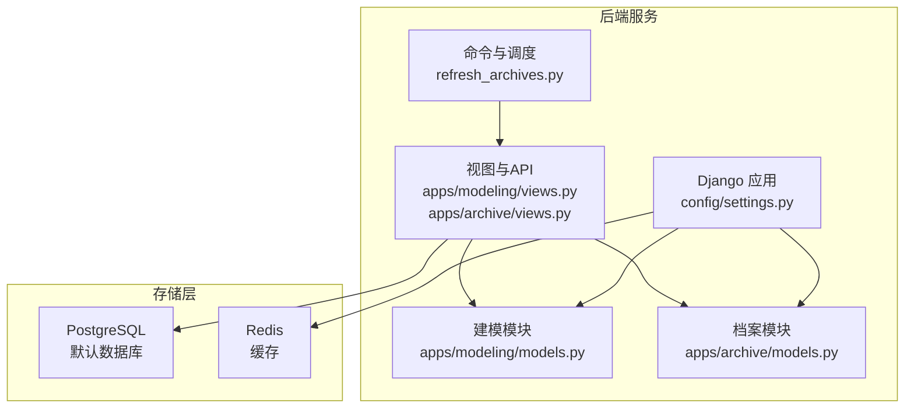
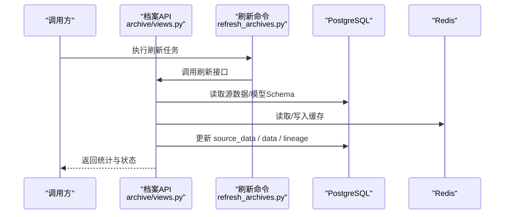
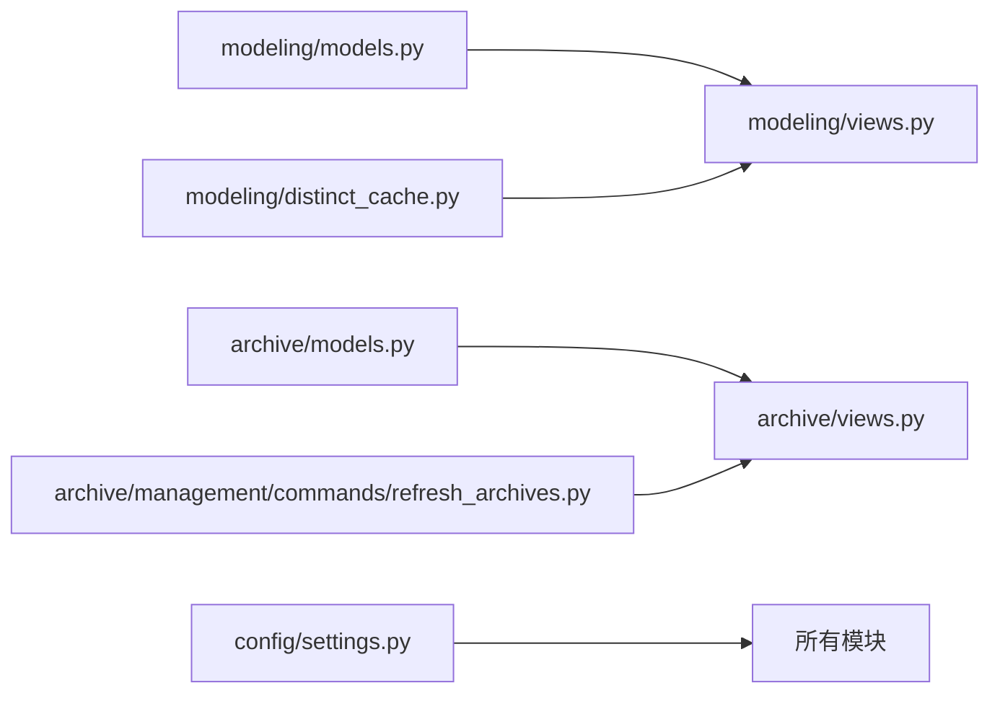

# 数据架构

<cite>
**本文引用的文件**   
- [backend/config/settings.py](file://backend/config/settings.py)
- [backend/local_settings.py](file://backend/local_settings.py)
- [backend/apps/modeling/models.py](file://backend/apps/modeling/models.py)
- [backend/apps/archive/models.py](file://backend/apps/archive/models.py)
- [backend/apps/modeling/migrations/0001_initial.py](file://backend/apps/modeling/migrations/0001_initial.py)
- [backend/apps/archive/migrations/0001_initial.py](file://backend/apps/archive/migrations/0001_initial.py)
- [backend/apps/modeling/distinct_cache.py](file://backend/apps/modeling/distinct_cache.py)
- [backend/apps/modeling/views.py](file://backend/apps/modeling/views.py)
- [backend/apps/archive/views.py](file://backend/apps/archive/views.py)
- [backend/apps/archive/management/commands/refresh_archives.py](file://backend/apps/archive/management/commands/refresh_archives.py)
</cite>

## 目录
1. [引言](#引言)
2. [项目结构](#项目结构)
3. [核心组件](#核心组件)
4. [架构总览](#架构总览)
5. [详细组件分析](#详细组件分析)
6. [依赖关系分析](#依赖关系分析)
7. [性能考量](#性能考量)
8. [故障排查指南](#故障排查指南)
9. [结论](#结论)
10. [附录](#附录)

## 引言
本文件为 MetaData002 系统的数据架构文档，聚焦 PostgreSQL 主数据存储与 Redis 缓存的架构设计、数据模型（实体关系、字段类型与约束）、索引策略、迁移与版本管理、备份恢复与灾难恢复、安全性与审计、一致性保证与事务策略。文档面向技术与非技术读者，提供分层说明与可视化图示，帮助快速理解系统的数据流转与治理机制。

## 项目结构
后端采用 Django + DRF 架构，数据库使用 PostgreSQL，缓存使用 Redis（开发环境可切换为内存缓存）。应用按领域划分为 modeling（建模域：数据源、域、表、字段、标准字段、计算字段等）与 archive（档案域：档案配置、记录、版本、同步日志、操作日志、变更批次与明细、一致性检查等）。



图表来源
- [backend/config/settings.py:56-74](file://backend/config/settings.py#L56-L74)
- [backend/local_settings.py:3-15](file://backend/local_settings.py#L3-L15)

章节来源
- [backend/config/settings.py:1-123](file://backend/config/settings.py#L1-L123)
- [backend/local_settings.py:1-26](file://backend/local_settings.py#L1-L26)

## 核心组件
- 数据源与域模型：DataSource、Domain、Table、FieldGroup、Field、StandardField、ComputedField、FieldMapping、AIConfig
- 档案模型：Archive、ArchiveRecord、ArchiveRecordVersion、ArchiveSyncLog、ArchiveOperationLog、ArchiveApi、ArchiveChangeBatch、ArchiveChangeDetail、ConsistencyIssue、ConsistencyCheckRule、ConsistencyIssueHistory
- 缓存与去重：Redis 缓存（全局默认缓存），字段去重取值缓存（distinct_values）
- 同步与刷新：外部命令 refresh_archives 驱动整层刷新与合并

章节来源
- [backend/apps/modeling/models.py:1-489](file://backend/apps/modeling/models.py#L1-L489)
- [backend/apps/archive/models.py:1-379](file://backend/apps/archive/models.py#L1-L379)
- [backend/apps/modeling/distinct_cache.py:1-122](file://backend/apps/modeling/distinct_cache.py#L1-L122)
- [backend/apps/archive/management/commands/refresh_archives.py:1-39](file://backend/apps/archive/management/commands/refresh_archives.py#L1-L39)

## 架构总览
系统以“建模-档案”双域为核心：建模域定义数据源、域、表、字段及概念层标准字段；档案域基于建模结果生成 Schema 快照，维护记录双层存储（source_data + manual_data），并通过合并逻辑输出最终 data。Redis 用于通用缓存与部分查询加速（如分页、列表过滤等），字段去重取值通过 distinct_cache 按需拉取并落库缓存。



图表来源
- [backend/apps/archive/management/commands/refresh_archives.py:1-39](file://backend/apps/archive/management/commands/refresh_archives.py#L1-L39)
- [backend/apps/archive/views.py:1-200](file://backend/apps/archive/views.py#L1-L200)
- [backend/config/settings.py:68-74](file://backend/config/settings.py#L68-L74)

## 详细组件分析

### PostgreSQL 主数据存储设计
- 数据源与域
  - DataSource：支持多数据库类型（PostgreSQL、MySQL、SQL Server、Oracle），包含连接信息与状态。
  - Domain：主数据域，含编码唯一性约束与状态。
- 表与字段
  - Table：区分本地表与外部数据源表，支持 schema 与外部表名，标记主表（is_primary）。
  - FieldGroup：多层分组（最多3层），排序与层级计算。
  - Field：物理字段，含类型、长度、必填、默认值、校验规则、分组、标准字段关联、是否主键、释放到概念/档案控制、去重取值缓存等。
  - StandardField：概念层一等公民，跨表归一化字段，属性变更自动同步至成员 Field。
  - ComputedField：Excel风格公式计算字段，支持依赖解析与执行顺序。
  - FieldOption：枚举选项。
  - FieldMapping：表间字段映射。
- 档案模型
  - Archive：与 Domain 一对一，保存 Schema 快照与版本号。
  - ArchiveRecord：双层存储（source_data + manual_data），合并后 data，版本、同步状态、修正保护、血缘。
  - ArchiveRecordVersion：版本快照，支持定版。
  - ArchiveSyncLog / ArchiveOperationLog：同步与操作日志。
  - ArchiveApi：对外暴露字段、筛选条件、角色授权。
  - ArchiveChangeBatch / ArchiveChangeDetail：变更批次与明细，支持回滚与版本映射。
  - ConsistencyIssue / ConsistencyCheckRule / ConsistencyIssueHistory：一致性差异与规则、历史轨迹。

ER 图（概念层）
```mermaid
erDiagram
DOMAIN {
int id PK
varchar name
varchar code UK
text description
varchar status
timestamp created_at
timestamp updated_at
}
DATASOURCE {
int id PK
varchar name UK
varchar db_type
varchar host
int port
varchar db_name
varchar username
varchar password
varchar status
timestamp created_at
timestamp updated_at
}
TABLE {
int id PK
int domain_id FK
varchar name
varchar code
text description
varchar type
int data_source_id FK
varchar external_table_name
varchar schema
boolean is_primary
varchar status
timestamp created_at
timestamp updated_at
}
FIELDGROUP {
int id PK
int domain_id FK
int parent_id FK
varchar name
int sort_order
timestamp created_at
}
FIELD {
int id PK
int table_id FK
varchar name
varchar code
varchar comment
varchar semantic_note
varchar field_type
int length
boolean required
varchar default_value
varchar date_format
json validation_rule
int group_id FK
int standard_field_id FK
boolean is_primary_key
boolean release_to_concept
boolean release_to_archive
json distinct_values
timestamp distinct_synced_at
int sort_order
varchar status
varchar archive_category
varchar ownership
timestamp created_at
timestamp updated_at
}
STANDARDFIELD {
int id PK
int domain_id FK
varchar standard_code
varchar standard_name
varchar note
varchar source
varchar field_type
int length
boolean required
varchar default_value
json enum_values
varchar date_format
json validation_rule
boolean release_to_archive
boolean is_active
varchar status
varchar ownership
int primary_field_id FK
boolean primary_field_manual
timestamp created_at
timestamp updated_at
}
COMPUTEDFIELD {
int id PK
int domain_id FK
varchar code
varchar name
text expression
json parsed_references
int execution_order
varchar output_type
int group_id FK
boolean release_to_archive
varchar status
timestamp created_at
timestamp updated_at
}
ARCHIVE {
int id PK
int domain_id FK UK
varchar name
text description
varchar status
json schema
int schema_version
varchar created_by
timestamp created_at
timestamp updated_at
}
ARCHIVERECORD {
int id PK
int archive_id FK
json data
json source_data
json manual_data
varchar status
int version
varchar sync_status
json overrides
json lineage
varchar created_by
varchar updated_by
timestamp created_at
timestamp updated_at
}
DOMAIN ||--o{ TABLE : "拥有"
DOMAIN ||--o{ FIELDGROUP : "拥有"
DOMAIN ||--o{ STANDARDFIELD : "拥有"
DOMAIN ||--o{ COMPUTEDFIELD : "拥有"
DOMAIN ||--|| ARCHIVE : "一对一"
TABLE ||--o{ FIELD : "包含"
FIELDGROUP ||--o{ FIELD : "分组"
STANDARDFIELD ||--o{ FIELD : "成员"
ARCHIVE ||--o{ ARCHIVERECORD : "包含"
```

图表来源
- [backend/apps/modeling/models.py:1-489](file://backend/apps/modeling/models.py#L1-L489)
- [backend/apps/archive/models.py:1-379](file://backend/apps/archive/models.py#L1-L379)

索引策略
- ArchiveRecord：对 (archive, status) 建立索引，提升按档案与状态查询效率。
- ArchiveOperationLog：对 (archive, -created_at) 建立索引，优化按档案时间倒序查询。
- ArchiveChangeDetail：对 (archive, -created_at) 建立索引，便于变更明细检索。
- ArchiveApi：对 (archive, status) 建立索引，提高按档案与状态筛选。
- 其他：根据业务查询模式，可在常用外键与过滤字段上补充索引（例如 StandardField.standard_code、Field.table_id 等）。

约束与数据类型
- 唯一约束：Domain.code、Table(domain, code)、Field(table, code)、FieldOption(field, value)、ArchiveApi.path、ConsistencyIssue(archive, record_key, field_code, member_source, check_type)、ConsistencyCheckRule(archive, check_type, field_code, member_source)。
- JSON 字段：大量使用 JSON 存储灵活结构（校验规则、枚举值、去重样本、Schema 快照、血缘、覆盖保护等）。
- 外键：广泛使用 CASCADE/SET_NULL 策略，确保数据一致性与可追溯性。

章节来源
- [backend/apps/modeling/models.py:1-489](file://backend/apps/modeling/models.py#L1-L489)
- [backend/apps/archive/models.py:1-379](file://backend/apps/archive/models.py#L1-L379)

### Redis 缓存架构
- 缓存后端：默认使用 django_redis.cache.RedisCache，位置由环境变量 REDIS_HOST/REDIS_PORT 决定。
- 开发环境：local_settings.py 将缓存切换为 LocMemCache，便于本地调试。
- 用途：通用缓存（分页、列表过滤、字典查询等），以及可能的会话或限流扩展点。
- 失效策略：建议结合业务键前缀与 TTL 管理，避免脏读；对于强一致场景优先读库。

章节来源
- [backend/config/settings.py:68-74](file://backend/config/settings.py#L68-L74)
- [backend/local_settings.py:11-15](file://backend/local_settings.py#L11-L15)

### 数据模型设计与字段选择
- 概念层与物理层解耦：StandardField 作为概念层统一承载，Field 作为物理实现，二者通过外键关联，属性变更自动同步。
- 计算字段：ComputedField 支持表达式与依赖解析，执行顺序保障 DAG 计算。
- 档案双层存储：source_data（源侧整层替换）+ manual_data（人工覆盖），合并后 data 保持计算字段不变，血缘 lineage 记录来源与更新时间。
- 一致性检查：ConsistencyIssue 记录多种检查类型的差异，支持规则失效与历史轨迹。

章节来源
- [backend/apps/modeling/models.py:162-300](file://backend/apps/modeling/models.py#L162-L300)
- [backend/apps/modeling/models.py:421-472](file://backend/apps/modeling/models.py#L421-L472)
- [backend/apps/archive/models.py:33-110](file://backend/apps/archive/models.py#L33-L110)
- [backend/apps/archive/models.py:274-379](file://backend/apps/archive/models.py#L274-L379)

### 数据迁移策略与版本管理
- Django Migrations：每个 app 的 migrations 目录维护增量变更，初始迁移定义基础表结构与约束。
- 版本快照：ArchiveRecordVersion 记录每次操作的快照与 Schema 快照，支持定版与回滚。
- Schema 版本：Archive.schema_version 随模型变更递增，确保档案结构与建模一致。

章节来源
- [backend/apps/modeling/migrations/0001_initial.py:1-127](file://backend/apps/modeling/migrations/0001_initial.py#L1-L127)
- [backend/apps/archive/migrations/0001_initial.py:1-127](file://backend/apps/archive/migrations/0001_initial.py#L1-L127)
- [backend/apps/archive/models.py:75-110](file://backend/apps/archive/models.py#L75-L110)

### 数据备份恢复与灾难恢复
- 备份策略：建议定期全量备份 PostgreSQL 数据库（pg_dump/pg_basebackup），并结合 WAL 归档实现时间点恢复（PITR）。
- 恢复演练：制定恢复流程与 RTO/RPO 目标，定期演练验证恢复有效性。
- 缓存与持久化：Redis 作为缓存，不承载关键持久化；必要时可开启 AOF 与持久化策略，但应以数据库为主。

[本节为通用指导，不直接分析具体文件]

### 数据安全性与访问控制
- 认证与权限：Django 内置认证中间件，DRF 可通过权限类与角色授权（ArchiveApi.auth_roles）控制接口访问。
- 密码策略：AUTH_PASSWORD_VALIDATORS 启用多项密码强度校验。
- 审计日志：ArchiveOperationLog 记录操作类型、操作人、变更摘要；ArchiveSyncLog 记录同步过程与详情。
- 敏感信息：DataSource.password 等敏感字段应加密存储并在传输中加密（TLS）。

章节来源
- [backend/config/settings.py:76-81](file://backend/config/settings.py#L76-L81)
- [backend/apps/archive/models.py:174-204](file://backend/apps/archive/models.py#L174-L204)
- [backend/apps/archive/models.py:139-172](file://backend/apps/archive/models.py#L139-L172)

### 数据一致性与事务处理
- 一致性检查：ConsistencyIssue 支持组合字段成员一致性、档案与源侧差异、孤立记录、Schema 漂移等检查类型。
- 事务策略：Django 默认事务边界可按请求或代码块控制；ATOMIC_REQUESTS 在 settings 中关闭，需业务层保证关键写操作的事务性。
- 合并与覆盖：_merge_record_data 明确 ownership 与合并优先级，确保 source 与 archive 侧数据一致性。

章节来源
- [backend/apps/archive/models.py:274-379](file://backend/apps/archive/models.py#L274-L379)
- [backend/config/settings.py:56-66](file://backend/config/settings.py#L56-L66)
- [backend/apps/archive/views.py:161-200](file://backend/apps/archive/views.py#L161-L200)

## 依赖关系分析
- 建模与档案模块通过 Domain 与 StandardField 形成概念-物理映射。
- 视图层依赖 models 进行 CRUD 与业务逻辑，distinct_cache 提供去重取值能力。
- 命令层通过 manage.py 触发批量刷新，调用 views 中的刷新逻辑。



图表来源
- [backend/apps/modeling/models.py:1-489](file://backend/apps/modeling/models.py#L1-L489)
- [backend/apps/archive/models.py:1-379](file://backend/apps/archive/models.py#L1-L379)
- [backend/apps/modeling/distinct_cache.py:1-122](file://backend/apps/modeling/distinct_cache.py#L1-L122)
- [backend/apps/modeling/views.py:1-200](file://backend/apps/modeling/views.py#L1-L200)
- [backend/apps/archive/views.py:1-200](file://backend/apps/archive/views.py#L1-L200)
- [backend/apps/archive/management/commands/refresh_archives.py:1-39](file://backend/apps/archive/management/commands/refresh_archives.py#L1-L39)
- [backend/config/settings.py:1-123](file://backend/config/settings.py#L1-L123)

章节来源
- [backend/apps/modeling/views.py:1-200](file://backend/apps/modeling/views.py#L1-L200)
- [backend/apps/archive/views.py:1-200](file://backend/apps/archive/views.py#L1-L200)

## 性能考量
- 索引优化：针对高频查询字段建立索引（如 ArchiveRecord.archive/status、ArchiveOperationLog.archive/-created_at）。
- 缓存策略：合理使用 Redis 缓存热点数据，设置合理 TTL，避免雪崩。
- 去重取值：distinct_cache 限制上限（limit=100），减少大字段扫描开销。
- 批量操作：刷新命令批量处理，减少往返次数，注意分片与重试。

[本节为通用指导，不直接分析具体文件]

## 故障排查指南
- 连接测试：DataSourceViewSet.test_connection 与 test_connection_params 用于验证数据源连通性。
- 刷新失败：refresh_archives 命令输出成功/失败统计，查看错误列表定位问题。
- 一致性差异：ConsistencyIssue 记录差异详情与审核状态，结合 ConsistencyCheckRule 调整规则。
- 缓存异常：检查 Redis 连接与 local_settings 切换，确认缓存键与过期策略。

章节来源
- [backend/apps/modeling/views.py:74-146](file://backend/apps/modeling/views.py#L74-L146)
- [backend/apps/archive/management/commands/refresh_archives.py:18-39](file://backend/apps/archive/management/commands/refresh_archives.py#L18-L39)
- [backend/apps/archive/models.py:274-379](file://backend/apps/archive/models.py#L274-L379)
- [backend/local_settings.py:11-15](file://backend/local_settings.py#L11-L15)

## 结论
MetaData002 通过建模与档案双域分离，实现了概念层与物理层的解耦与统一管理。PostgreSQL 作为主存储，配合合理的索引与约束，确保数据一致性与查询性能；Redis 作为缓存层提升响应速度。迁移与版本管理保障演进可控，审计与一致性检查强化治理与安全。建议在生产环境中完善备份恢复与灾难恢复演练，持续优化索引与缓存策略，确保系统稳定高效运行。

## 附录
- 环境变量：DB_*、REDIS_*、AI_* 等配置项详见 settings.py。
- 开发环境：local_settings.py 提供 SQLite 与内存缓存配置，便于本地调试。

章节来源
- [backend/config/settings.py:1-123](file://backend/config/settings.py#L1-L123)
- [backend/local_settings.py:1-26](file://backend/local_settings.py#L1-L26)