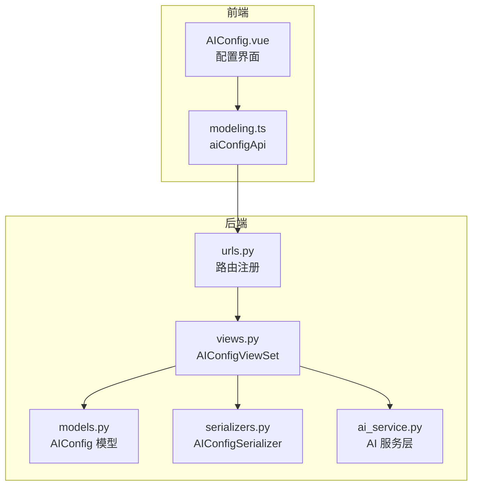
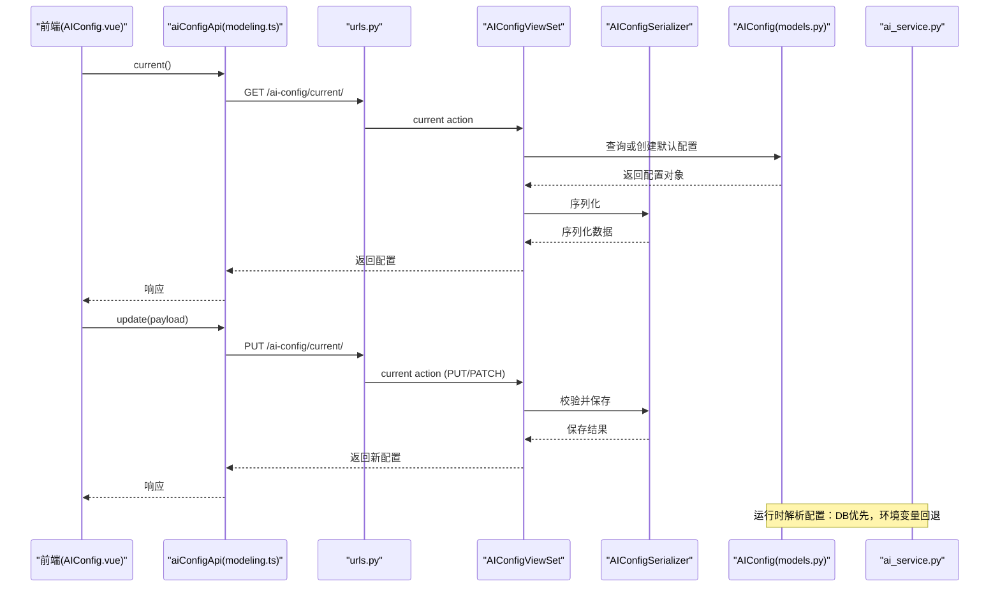
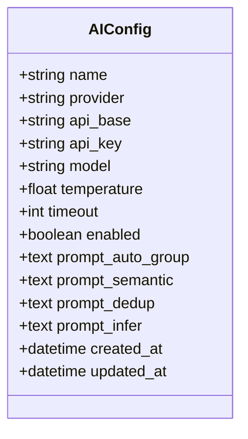
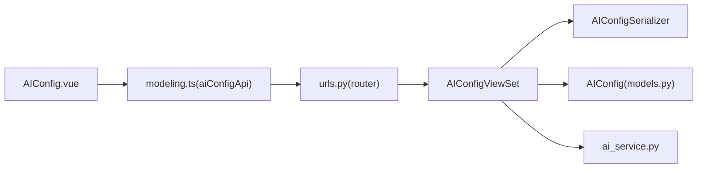

# AI配置模型

<cite>
**本文引用的文件**   
- [backend/apps/modeling/models.py](file://backend/apps/modeling/models.py)
- [backend/apps/modeling/ai_service.py](file://backend/apps/modeling/ai_service.py)
- [backend/apps/modeling/views.py](file://backend/apps/modeling/views.py)
- [backend/apps/modeling/serializers.py](file://backend/apps/modeling/serializers.py)
- [backend/apps/modeling/urls.py](file://backend/apps/modeling/urls.py)
- [frontend/src/views/settings/AIConfig.vue](file://frontend/src/views/settings/AIConfig.vue)
- [frontend/src/api/modeling.ts](file://frontend/src/api/modeling.ts)
</cite>

## 目录
1. [简介](#简介)
2. [项目结构](#项目结构)
3. [核心组件](#核心组件)
4. [架构总览](#架构总览)
5. [详细组件分析](#详细组件分析)
6. [依赖关系分析](#依赖关系分析)
7. [性能与超时控制](#性能与超时控制)
8. [安全与密钥管理](#安全与密钥管理)
9. [热更新与回退机制](#热更新与回退机制)
10. [错误处理与降级策略](#错误处理与降级策略)
11. [最佳实践](#最佳实践)
12. [故障排查指南](#故障排查指南)
13. [结论](#结论)

## 简介
本文件为 MetaData002 系统的 AI 配置模型提供完整、深入的技术文档。重点围绕 AIConfig 模型类的设计与实现，涵盖多厂商支持（DeepSeek、OpenAI、通义千问等）、接口配置管理、提示词定制、单例模式实现、环境变量回退机制、API 调用安全、热更新、超时控制和错误处理策略，并给出 AI 服务集成的最佳实践与故障排查指南。

## 项目结构
AI 配置相关代码主要分布在建模应用 backend/apps/modeling 中，包括数据模型、序列化器、视图集、路由以及前端配置页面和 API 客户端封装。



图表来源
- [backend/apps/modeling/models.py:387-418](file://backend/apps/modeling/models.py#L387-L418)
- [backend/apps/modeling/serializers.py:248-279](file://backend/apps/modeling/serializers.py#L248-L279)
- [backend/apps/modeling/views.py:1780-1822](file://backend/apps/modeling/views.py#L1780-L1822)
- [backend/apps/modeling/urls.py:14](file://backend/apps/modeling/urls.py#L14)
- [backend/apps/modeling/ai_service.py:19-48](file://backend/apps/modeling/ai_service.py#L19-L48)
- [frontend/src/views/settings/AIConfig.vue:114-121](file://frontend/src/views/settings/AIConfig.vue#L114-L121)
- [frontend/src/api/modeling.ts:440-445](file://frontend/src/api/modeling.ts#L440-L445)

章节来源
- [backend/apps/modeling/models.py:387-418](file://backend/apps/modeling/models.py#L387-L418)
- [backend/apps/modeling/serializers.py:248-279](file://backend/apps/modeling/serializers.py#L248-L279)
- [backend/apps/modeling/views.py:1780-1822](file://backend/apps/modeling/views.py#L1780-L1822)
- [backend/apps/modeling/urls.py:14](file://backend/apps/modeling/urls.py#L14)
- [backend/apps/modeling/ai_service.py:19-48](file://backend/apps/modeling/ai_service.py#L19-L48)
- [frontend/src/views/settings/AIConfig.vue:114-121](file://frontend/src/views/settings/AIConfig.vue#L114-L121)
- [frontend/src/api/modeling.ts:440-445](file://frontend/src/api/modeling.ts#L440-L445)

## 核心组件
- AIConfig 模型：存储 AI 服务连接参数与提示词模板，支持多厂商预设与启用开关，作为系统设置单例使用。
- AIConfigSerializer：序列化器保护 api_key 不回显，并提供 has_api_key 标识与 prompt_defaults 默认值。
- AIConfigViewSet：提供 current（获取/更新生效配置）与 test-connection（测试连接）端点，实现单例语义。
- ai_service：统一封装 AI 调用逻辑，包含配置解析、提示词解析、LLM 调用、JSON 解析与启发式降级。
- 前端 AIConfig.vue：提供多厂商模型选择、接口地址自动填充、提示词编辑、保存与连接测试。
- modeling.ts 中的 aiConfigApi：封装 current、update、testConnection 三个 API 调用。

章节来源
- [backend/apps/modeling/models.py:387-418](file://backend/apps/modeling/models.py#L387-L418)
- [backend/apps/modeling/serializers.py:248-279](file://backend/apps/modeling/serializers.py#L248-L279)
- [backend/apps/modeling/views.py:1780-1822](file://backend/apps/modeling/views.py#L1780-L1822)
- [backend/apps/modeling/ai_service.py:19-48](file://backend/apps/modeling/ai_service.py#L19-L48)
- [frontend/src/views/settings/AIConfig.vue:114-121](file://frontend/src/views/settings/AIConfig.vue#L114-L121)
- [frontend/src/api/modeling.ts:440-445](file://frontend/src/api/modeling.ts#L440-L445)

## 架构总览
AI 配置从前端到后端的整体流程如下：
- 前端通过 aiConfigApi.current() 获取当前生效配置；若不存在则后端自动创建默认记录。
- 用户修改配置（含 provider、api_base、model、temperature、timeout、enabled、prompt_*），通过 update 提交。
- 业务调用 AI 能力时，ai_service._resolve_ai_config() 优先读取数据库 enabled=True 的配置，否则回退到 settings 环境变量。
- 实际 LLM 调用通过 OpenAI 兼容接口 /chat/completions，失败时按功能降级到启发式算法。



图表来源
- [backend/apps/modeling/views.py:1788-1822](file://backend/apps/modeling/views.py#L1788-L1822)
- [backend/apps/modeling/serializers.py:248-279](file://backend/apps/modeling/serializers.py#L248-L279)
- [backend/apps/modeling/models.py:387-418](file://backend/apps/modeling/models.py#L387-L418)
- [backend/apps/modeling/ai_service.py:19-48](file://backend/apps/modeling/ai_service.py#L19-L48)
- [frontend/src/api/modeling.ts:440-445](file://frontend/src/api/modeling.ts#L440-L445)

## 详细组件分析

### AIConfig 模型设计
- 字段说明：
  - name：配置名称，默认“默认AI配置”。
  - provider：服务厂商，支持 deepseek/openai/qwen/zhipu/moonshot/custom。
  - api_base：OpenAI 兼容 Base URL。
  - api_key：API Key，仅用于写入，不暴露明文。
  - model：模型名称。
  - temperature：采样温度。
  - timeout：超时时间（秒）。
  - enabled：是否启用，作为生效配置的唯一标志。
  - prompt_auto_group/prompt_semantic/prompt_dedup/prompt_infer：可配置提示词（仅指令部分，字段数据由后端自动追加）。
- 单例语义：
  - 通过 views 的 current action 保证只存在一条生效配置（按 enabled 排序取第一条，不存在则自动创建）。
- 提示词扩展：
  - 支持在数据库中覆盖内置默认提示词，便于针对不同厂商/场景微调。



图表来源
- [backend/apps/modeling/models.py:387-418](file://backend/apps/modeling/models.py#L387-L418)

章节来源
- [backend/apps/modeling/models.py:387-418](file://backend/apps/modeling/models.py#L387-L418)

### 序列化器与安全
- AIConfigSerializer：
  - api_key 写-only，避免回显明文。
  - has_api_key 表示是否已配置密钥。
  - prompt_defaults 返回各提示词的内置默认值，供前端展示与恢复默认。
  - 更新时若 api_key 为空字符串则保持原值不变，防止误清空。

章节来源
- [backend/apps/modeling/serializers.py:248-279](file://backend/apps/modeling/serializers.py#L248-L279)

### 视图与单例模式
- AIConfigViewSet：
  - current action：GET/PUT/PATCH 获取或更新生效配置；不存在则自动创建默认记录。
  - test-connection action：支持传入临时配置覆盖测试，不传则使用当前生效配置。
- 单例实现要点：
  - 查询时按 -enabled 排序取第一条，确保只有一个生效配置。
  - 首次访问自动创建默认记录，简化初始化流程。

章节来源
- [backend/apps/modeling/views.py:1780-1822](file://backend/apps/modeling/views.py#L1780-L1822)

### 配置解析与环境变量回退
- _resolve_ai_config()：
  - 优先读取数据库 enabled=True 的 AIConfig 配置。
  - 未找到或异常时回退到 settings 环境变量（AI_API_BASE、AI_API_KEY、AI_MODEL、AI_TIMEOUT）。
  - 返回 dict：api_base、api_key、model、temperature、timeout。
- 该函数被 _chat、test_connection、提示词解析等复用，确保一致性与健壮性。

章节来源
- [backend/apps/modeling/ai_service.py:19-48](file://backend/apps/modeling/ai_service.py#L19-L48)

### 提示词管理与默认值
- PROMPT_META 定义四类提示词键与标签。
- DEFAULT_PROMPT_* 提供内置默认提示词文本。
- _resolve_prompt(key, default)：
  - 优先读取数据库 AIConfig 对应字段（enabled=True），为空则返回内置默认。
- prompt_defaults()：返回各提示词的内置默认值，供前端展示与恢复默认。

章节来源
- [backend/apps/modeling/ai_service.py:101-167](file://backend/apps/modeling/ai_service.py#L101-L167)

### 多厂商支持与前端交互
- 前端 PROVIDERS 预设 DeepSeek、OpenAI、通义千问、智谱 GLM、Moonshot、自定义。
- 选择模型或厂商时自动填充 api_base 与模型列表。
- 支持自定义接口地址，便于接入其他 OpenAI 兼容服务。

章节来源
- [frontend/src/views/settings/AIConfig.vue:114-121](file://frontend/src/views/settings/AIConfig.vue#L114-L121)

### API 调用与 JSON 解析
- _chat(messages, cfg)：
  - 构造 OpenAI 兼容请求，发送 /chat/completions。
  - 使用 response_format: json_object 要求返回 JSON。
  - 超时使用 cfg.timeout。
- _parse_json(text)：
  - 容忍代码块包裹（```json ... ```），提取 JSON 内容并解析。

章节来源
- [backend/apps/modeling/ai_service.py:56-76](file://backend/apps/modeling/ai_service.py#L56-L76)
- [backend/apps/modeling/ai_service.py:92-99](file://backend/apps/modeling/ai_service.py#L92-L99)

### 连接测试
- test_connection(cfg=None)：
  - 检查是否存在 requests 依赖与 api_key。
  - 发送最小请求验证配置可用性，返回 ok 与 message。

章节来源
- [backend/apps/modeling/ai_service.py:78-90](file://backend/apps/modeling/ai_service.py#L78-L90)

## 依赖关系分析
- 前端 aiConfigApi 调用后端 /ai-config/current/ 与 /ai-config/test-connection/。
- 后端路由 urls.py 注册 ai-config 路由。
- 视图集 AIConfigViewSet 依赖序列化器与模型。
- 业务调用 ai_service 进行 LLM 调用与提示词解析。



图表来源
- [frontend/src/api/modeling.ts:440-445](file://frontend/src/api/modeling.ts#L440-L445)
- [backend/apps/modeling/urls.py:14](file://backend/apps/modeling/urls.py#L14)
- [backend/apps/modeling/views.py:1780-1822](file://backend/apps/modeling/views.py#L1780-L1822)
- [backend/apps/modeling/serializers.py:248-279](file://backend/apps/modeling/serializers.py#L248-L279)
- [backend/apps/modeling/models.py:387-418](file://backend/apps/modeling/models.py#L387-L418)
- [backend/apps/modeling/ai_service.py:19-48](file://backend/apps/modeling/ai_service.py#L19-L48)

章节来源
- [backend/apps/modeling/urls.py:14](file://backend/apps/modeling/urls.py#L14)
- [backend/apps/modeling/views.py:1780-1822](file://backend/apps/modeling/views.py#L1780-L1822)
- [backend/apps/modeling/serializers.py:248-279](file://backend/apps/modeling/serializers.py#L248-L279)
- [backend/apps/modeling/models.py:387-418](file://backend/apps/modeling/models.py#L387-L418)
- [backend/apps/modeling/ai_service.py:19-48](file://backend/apps/modeling/ai_service.py#L19-L48)
- [frontend/src/api/modeling.ts:440-445](file://frontend/src/api/modeling.ts#L440-L445)

## 性能与超时控制
- 超时控制：
  - 每个 LLM 请求使用 cfg.timeout（默认 30 秒），可通过配置调整。
- 缓存与样本值：
  - 计算表达式生成时，优先使用 distinct_values 缓存，必要时临时采样（不写回数据库）。
- 降级策略：
  - 当 LLM 不可用或调用失败时，自动回退到启发式算法，保证功能可用。

章节来源
- [backend/apps/modeling/ai_service.py:56-76](file://backend/apps/modeling/ai_service.py#L56-L76)
- [backend/apps/modeling/ai_service.py:558-747](file://backend/apps/modeling/ai_service.py#L558-L747)

## 安全与密钥管理
- api_key 写-only，序列化器不返回明文。
- has_api_key 标识是否已配置密钥。
- 更新时空字符串不覆盖已有密钥，防止误清空。
- 连接测试支持临时配置覆盖，但不持久化。

章节来源
- [backend/apps/modeling/serializers.py:248-279](file://backend/apps/modeling/serializers.py#L248-L279)
- [backend/apps/modeling/views.py:1801-1822](file://backend/apps/modeling/views.py#L1801-L1822)

## 热更新与回退机制
- 热更新：
  - 通过 current action 实时更新生效配置，无需重启服务。
- 回退机制：
  - 运行时优先读取数据库 enabled=True 配置，未启用或未找到时回退到 settings 环境变量。
- 提示词热更新：
  - 支持在数据库中覆盖内置默认提示词，实时生效。

章节来源
- [backend/apps/modeling/views.py:1788-1822](file://backend/apps/modeling/views.py#L1788-L1822)
- [backend/apps/modeling/ai_service.py:19-48](file://backend/apps/modeling/ai_service.py#L19-L48)
- [backend/apps/modeling/ai_service.py:150-167](file://backend/apps/modeling/ai_service.py#L150-L167)

## 错误处理与降级策略
- LLM 调用异常：
  - 捕获异常并回退到启发式算法，保证功能可用。
- JSON 解析异常：
  - _parse_json 容忍代码块包裹，提升容错性。
- 连接测试失败：
  - 返回明确错误信息，便于前端提示。

章节来源
- [backend/apps/modeling/ai_service.py:78-90](file://backend/apps/modeling/ai_service.py#L78-L90)
- [backend/apps/modeling/ai_service.py:92-99](file://backend/apps/modeling/ai_service.py#L92-L99)

## 最佳实践
- 配置管理：
  - 在生产环境优先使用数据库配置，环境变量作为兜底。
  - 合理设置 timeout 与 temperature，平衡稳定性与创造性。
- 提示词定制：
  - 根据厂商特性与业务需求微调提示词，提升输出质量。
- 安全策略：
  - 定期轮换 api_key，避免泄露。
  - 使用 HTTPS 与最小权限原则。
- 监控与诊断：
  - 启用连接测试，定期检查配置有效性。
  - 记录 LLM 调用失败率与降级次数，评估服务质量。

[本节为通用指导，不直接分析具体文件]

## 故障排查指南
- 无法连接 LLM：
  - 检查 api_key 是否正确配置。
  - 确认 api_base 与 model 匹配。
  - 使用 test-connection 端点验证配置。
- 输出格式异常：
  - 检查提示词是否要求返回 JSON。
  - 查看 _parse_json 日志，确认返回内容。
- 功能降级：
  - 确认 LLM 是否可用，若不可用将自动降级到启发式算法。
- 配置未生效：
  - 确认 enabled=True 的记录存在且唯一。
  - 检查 current action 是否正确更新。

章节来源
- [backend/apps/modeling/views.py:1801-1822](file://backend/apps/modeling/views.py#L1801-L1822)
- [backend/apps/modeling/ai_service.py:78-90](file://backend/apps/modeling/ai_service.py#L78-L90)
- [backend/apps/modeling/ai_service.py:92-99](file://backend/apps/modeling/ai_service.py#L92-L99)

## 结论
AIConfig 模型为 MetaData002 提供了灵活、安全的 AI 配置管理能力，支持多厂商接入、提示词定制与热更新。通过单例模式与环境变量回退机制，确保系统在多种部署环境下稳定运行。结合完善的错误处理与降级策略，保障 AI 功能的可用性与鲁棒性。建议在生产环境中严格管理密钥、优化提示词与超时参数，并建立监控与诊断机制，持续提升 AI 服务的质量与可靠性。

[本节为总结，不直接分析具体文件]