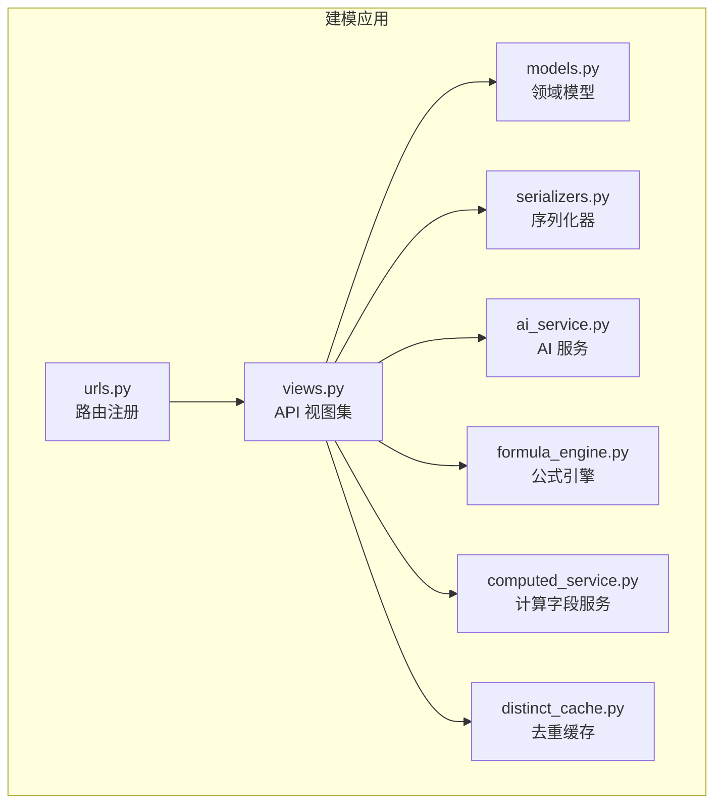
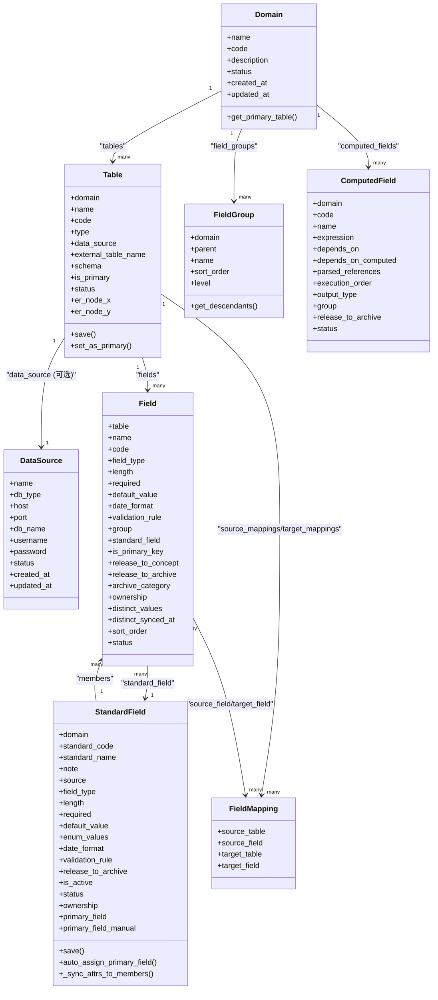
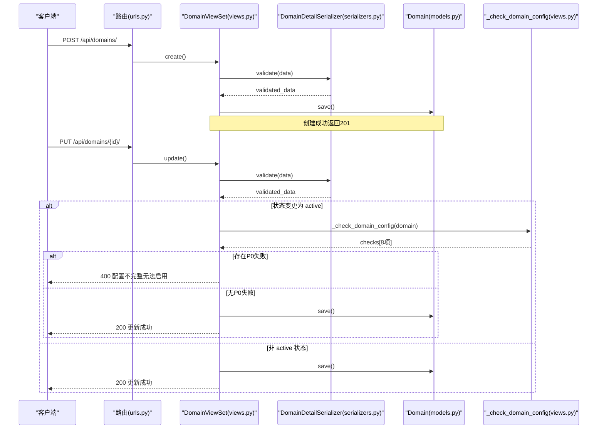
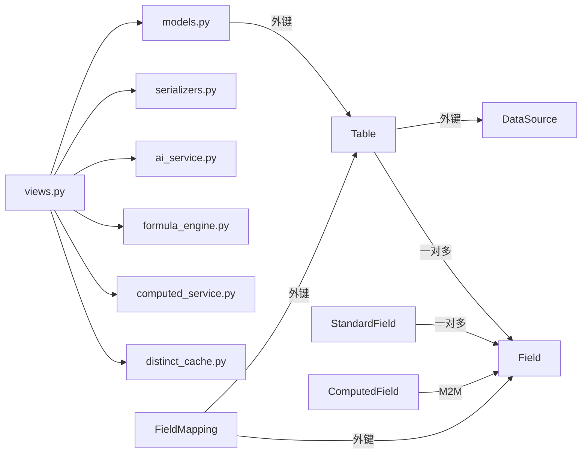

# 域模型

<cite>
**本文引用的文件**   
- [models.py](file://backend/apps/modeling/models.py)
- [views.py](file://backend/apps/modeling/views.py)
- [serializers.py](file://backend/apps/modeling/serializers.py)
- [urls.py](file://backend/apps/modeling/urls.py)
- [ai_service.py](file://backend/apps/modeling/ai_service.py)
- [formula_engine.py](file://backend/apps/modeling/formula_engine.py)
- [computed_service.py](file://backend/apps/modeling/computed_service.py)
- [distinct_cache.py](file://backend/apps/modeling/distinct_cache.py)
</cite>

## 目录
1. [简介](#简介)
2. [项目结构](#项目结构)
3. [核心组件](#核心组件)
4. [架构总览](#架构总览)
5. [详细组件分析](#详细组件分析)
6. [依赖关系分析](#依赖关系分析)
7. [性能考量](#性能考量)
8. [故障排查指南](#故障排查指南)
9. [结论](#结论)
10. [附录](#附录)

## 简介
本文件为 MetaData002 系统的“域模型”提供系统化、可操作的技术文档。围绕 Domain（域）这一核心概念，阐述其设计理念、编码规范、状态管理、层次结构以及与表、字段、标准字段、计算字段的关系；说明主表标识机制与域级业务规则；给出域的 CRUD 流程、状态转换与校验逻辑，并提供最佳实践与使用示例路径，帮助读者快速掌握并正确使用该模型。

## 项目结构
后端建模应用位于 backend/apps/modeling，核心由数据模型、视图集、序列化器、URL 路由以及若干服务模块组成：
- 数据模型：定义域、表、字段、分组、标准字段、计算字段、映射等实体及约束
- 视图集：实现 RESTful API，包含域、表、字段等的增删改查与扩展动作
- 序列化器：负责输入校验与输出格式化
- URL 路由：注册各 ViewSet 的端点
- 服务层：AI 能力、公式引擎、计算字段服务、去重缓存工具等

图表来源
- [urls.py:1-20](file://backend/apps/modeling/urls.py#L1-L20)
- [views.py:1-20](file://backend/apps/modeling/views.py#L1-L20)

章节来源
- [urls.py:1-20](file://backend/apps/modeling/urls.py#L1-L20)

## 核心组件
- 域（Domain）：主数据域，承载一组相关的表与字段，具备启用/废弃状态与唯一编码
- 表（Table）：域下的实体表，支持本地表与外部数据源表，具备主表标识
- 字段（Field）：表的物理字段，支持类型、必填、默认值、枚举、归档分类、维护方等
- 标准字段（StandardField）：跨表归一化的概念层字段，聚合等价物理字段，统一属性配置与同步
- 字段分组（FieldGroup）：多层嵌套的字段分组（最多3层），用于组织 UI 与配置
- 计算字段（ComputedField）：基于 Excel 风格公式从其他字段推导，支持 DAG 执行顺序与批量重算
- 字段映射（FieldMapping）：表间关系的字段级映射，支撑多表域的数据关联
- 数据源（DataSource）：系统设置，描述外部数据库连接信息

章节来源
- [models.py:32-52](file://backend/apps/modeling/models.py#L32-L52)
- [models.py:60-123](file://backend/apps/modeling/models.py#L60-L123)
- [models.py:162-300](file://backend/apps/modeling/models.py#L162-L300)
- [models.py:301-367](file://backend/apps/modeling/models.py#L301-L367)
- [models.py:125-160](file://backend/apps/modeling/models.py#L125-L160)
- [models.py:421-472](file://backend/apps/modeling/models.py#L421-L472)
- [models.py:474-489](file://backend/apps/modeling/models.py#L474-L489)
- [models.py:4-30](file://backend/apps/modeling/models.py#L4-L30)

## 架构总览
下图展示域模型在系统中的交互关系：域作为顶层容器，包含多个表；表下有多字段；标准字段将跨表等价字段聚合；计算字段通过表达式引用物理字段与其他计算字段；字段映射建立表间关系；视图集暴露 API，串联序列化器与模型；AI 服务辅助分组、语义识别与去重检测；公式引擎解析与求值表达式；计算字段服务构建 DAG、重算与试算；去重缓存工具提供样本值。

图表来源
- [models.py:32-52](file://backend/apps/modeling/models.py#L32-L52)
- [models.py:60-123](file://backend/apps/modeling/models.py#L60-L123)
- [models.py:162-300](file://backend/apps/modeling/models.py#L162-L300)
- [models.py:301-367](file://backend/apps/modeling/models.py#L301-L367)
- [models.py:125-160](file://backend/apps/modeling/models.py#L125-L160)
- [models.py:421-472](file://backend/apps/modeling/models.py#L421-L472)
- [models.py:474-489](file://backend/apps/modeling/models.py#L474-L489)
- [models.py:4-30](file://backend/apps/modeling/models.py#L4-L30)

## 详细组件分析

### 域（Domain）设计
- 设计理念：域是主数据的边界与命名空间，所有表、字段、标准字段、计算字段均归属一个域，便于权限隔离与生命周期管理
- 编码规范：code 唯一且不可重复，建议采用大写字母+下划线，体现业务主题（如 SUPPLIER、CUSTOMER）
- 状态管理：ACTIVE（启用）、DEPRECATED（已废弃），仅 ACTIVE 状态的域参与业务流转
- 主表标识：域通过 get_primary_table() 获取 is_primary=True 且 ACTIVE 的主表，用于档案合并基准
- 业务规则：启用前需通过 P0 检查（主表存在、主键设置、字段编码非空、标准编码唯一性等）

章节来源
- [models.py:32-52](file://backend/apps/modeling/models.py#L32-L52)
- [views.py:327-428](file://backend/apps/modeling/views.py#L327-L428)
- [views.py:430-469](file://backend/apps/modeling/views.py#L430-L469)

### 表（Table）设计
- 类型：LOCAL（本地数据表）、SOURCE（外部数据源表）
- 主表标识：每个域只能有一个 is_primary=True 的主表，变更时自动清理其他表的主表标记
- 数据源关联：SOURCE 类型必须关联 data_source，并指定 external_table_name 与 schema
- 状态管理：ACTIVE/DEPRECATED，停用前若存在字段映射则禁止停用
- 坐标持久化：ER 图节点位置 er_node_x/er_node_y 用于前端布局保存

章节来源
- [models.py:60-123](file://backend/apps/modeling/models.py#L60-L123)
- [views.py:504-535](file://backend/apps/modeling/views.py#L504-L535)
- [views.py:690-722](file://backend/apps/modeling/views.py#L690-L722)

### 字段（Field）设计
- 数据类型：string/number/date/boolean/enum，支持长度、必填、默认值、日期格式、校验规则
- 分组与标准字段：可通过 group 归属分组，通过 standard_field 挂靠到概念层标准字段
- 主键标记：is_primary_key 标识主键字段，支持联合主键
- 归档策略：release_to_concept/release_to_archive 控制是否释放到概念层与档案
- 维护方：ownership 区分源系统维护或档案维护，影响拉取覆盖策略
- 去重缓存：distinct_values 存储取值样本（上限 100 条），供 AI 查重与试算

章节来源
- [models.py:301-367](file://backend/apps/modeling/models.py#L301-L367)
- [distinct_cache.py:27-97](file://backend/apps/modeling/distinct_cache.py#L27-L97)

### 标准字段（StandardField）设计
- 概念层一等公民：跨表等价字段归并为一个标准字段，统一属性配置与同步
- 属性同步：保存时自动将 field_type、length、required、default_value、date_format、validation_rule 等同步到成员 Field
- 枚举选项：enum_values 同步到 FieldOption，清空旧选项后写入新选项
- 主字段分配：auto_assign_primary_field() 根据主表成员自动分配 primary_field，人工指定后不随主表切换
- 状态与归档：is_active/status/release_to_archive 控制是否参与归档与显示

章节来源
- [models.py:162-300](file://backend/apps/modeling/models.py#L162-L300)

### 字段分组（FieldGroup）设计
- 层级限制：最多3层，防止过深嵌套导致 UI 复杂
- 树形遍历：level 属性计算当前层级，get_descendants() 递归获取后代分组
- 校验规则：不能设为自己或其子分组的父节点

章节来源
- [models.py:125-160](file://backend/apps/modeling/models.py#L125-L160)
- [serializers.py:94-106](file://backend/apps/modeling/serializers.py#L94-L106)

### 计算字段（ComputedField）设计
- 表达式语法：Excel 风格公式，支持函数、运算符、字段引用 {表名.字段名}
- 依赖解析：extract_references() 提取引用，区分物理字段与计算字段依赖
- DAG 构建：拓扑排序确定 execution_order，避免循环依赖
- 批量重算：按执行顺序对档案记录重新计算，结果写入 ArchiveRecord.data
- 试算功能：trial_calculate() 支持参数枚举与组合采样，preview_expression() 免实例预览

章节来源
- [models.py:421-472](file://backend/apps/modeling/models.py#L421-L472)
- [formula_engine.py:61-64](file://backend/apps/modeling/formula_engine.py#L61-L64)
- [computed_service.py:21-85](file://backend/apps/modeling/computed_service.py#L21-L85)
- [computed_service.py:215-278](file://backend/apps/modeling/computed_service.py#L215-L278)
- [computed_service.py:373-439](file://backend/apps/modeling/computed_service.py#L373-L439)
- [computed_service.py:508-589](file://backend/apps/modeling/computed_service.py#L508-L589)

### 字段映射（FieldMapping）设计
- 表间关系：通过 source_table/source_field → target_table/target_field 建立映射
- 用途：支撑多表域的数据关联与合并，停用表前需解除相关映射

章节来源
- [models.py:474-489](file://backend/apps/modeling/models.py#L474-L489)
- [views.py:690-722](file://backend/apps/modeling/views.py#L690-L722)

### 数据源（DataSource）设计
- 支持数据库类型：postgresql/mysql/sqlserver/oracle
- 动态连接：视图集中根据 db_type 构造连接配置，测试连接与查询元数据
- 安全：password 只写不回显，连接 alias 临时创建并在 finally 中清理

章节来源
- [models.py:4-30](file://backend/apps/modeling/models.py#L4-L30)
- [views.py:31-147](file://backend/apps/modeling/views.py#L31-L147)

## 架构总览
下图展示域管理的 API 调用序列，包括创建、更新、启用检查与配置完整性校验。

图表来源
- [urls.py:1-20](file://backend/apps/modeling/urls.py#L1-L20)
- [views.py:430-469](file://backend/apps/modeling/views.py#L430-L469)
- [serializers.py:27-31](file://backend/apps/modeling/serializers.py#L27-L31)
- [models.py:32-52](file://backend/apps/modeling/models.py#L32-L52)
- [views.py:327-428](file://backend/apps/modeling/views.py#L327-L428)

## 详细组件分析

### 域的CRUD与状态转换
- 创建：POST /api/domains/，返回 DomainDetailSerializer 数据
- 列表：GET /api/domains/，返回 DomainSerializer，含 table_count
- 详情：GET /api/domains/{id}/，返回 DomainDetailSerializer
- 更新：PUT /api/domains/{id}/，perform_update 中拦截状态变更为 active 时的 P0 检查
- 删除：DELETE /api/domains/{id}/，遵循 Django ORM 级联删除策略

章节来源
- [serializers.py:15-24](file://backend/apps/modeling/serializers.py#L15-L24)
- [serializers.py:27-31](file://backend/apps/modeling/serializers.py#L27-L31)
- [views.py:430-469](file://backend/apps/modeling/views.py#L430-L469)

### 域配置完整性检查
_check_domain_config 返回 8 项检查结果，涵盖：
- P0（阻断启用）：主表存在、主表有主键、字段编码非空、标准编码唯一
- P1（警告）：组合字段主字段设置、档案字段编码与名称区分、数据源表关联数据源
- P2（建议）：多表域字段映射配置

章节来源
- [views.py:327-428](file://backend/apps/modeling/views.py#L327-L428)

### 表的状态切换与前置校验
- toggle_status：切换启用/停用，停用前检查是否存在字段映射，存在则拒绝并返回映射详情

章节来源
- [views.py:690-722](file://backend/apps/modeling/views.py#L690-L722)

### 标准字段属性同步与主字段分配
- save：新建或更新时比较旧值，若属性变化则调用 _sync_attrs_to_members() 同步到成员 Field
- auto_assign_primary_field：根据主表成员自动分配 primary_field，人工指定后不跟随切换

章节来源
- [models.py:230-299](file://backend/apps/modeling/models.py#L230-L299)

### 计算字段的DAG与重算
- parse_and_save_dependencies：解析表达式，更新 depends_on/depends_on_computed/parsed_references/execution_order
- detect_cycle：DFS 检测循环依赖
- batch_recalculate：按 execution_order 批量重算，结果写入 ArchiveRecord.data
- trial_calculate：参数枚举与组合采样，支持自动枚举 distinct_values

章节来源
- [computed_service.py:21-85](file://backend/apps/modeling/computed_service.py#L21-L85)
- [computed_service.py:110-162](file://backend/apps/modeling/computed_service.py#L110-L162)
- [computed_service.py:215-278](file://backend/apps/modeling/computed_service.py#L215-L278)
- [computed_service.py:373-439](file://backend/apps/modeling/computed_service.py#L373-L439)

### 公式引擎与表达式验证
- tokenize：词法分析，支持数字、字符串、布尔、引用、函数、运算符
- Parser：递归下降解析为 AST
- evaluate：求值 AST，支持 IF/AND/OR/NOT/IFS/SWITCH/IFERROR 等函数
- validate_expression：语法验证，含函数参数数量校验

章节来源
- [formula_engine.py:99-197](file://backend/apps/modeling/formula_engine.py#L99-L197)
- [formula_engine.py:253-366](file://backend/apps/modeling/formula_engine.py#L253-L366)
- [formula_engine.py:669-768](file://backend/apps/modeling/formula_engine.py#L669-L768)
- [formula_engine.py:798-800](file://backend/apps/modeling/formula_engine.py#L798-L800)

### 去重缓存与样本值采集
- fetch_distinct_values：从本地或外部数据源读取字段去重取值样本（上限 limit 条）
- ensure_distinct_cache：按需填充 distinct_values 缓存，记录 distinct_synced_at

章节来源
- [distinct_cache.py:27-97](file://backend/apps/modeling/distinct_cache.py#L27-L97)
- [distinct_cache.py:100-122](file://backend/apps/modeling/distinct_cache.py#L100-L122)

## 依赖关系分析
- 模型层：Domain → Table → Field；StandardField ↔ Field（一对多）；ComputedField → Field（M2M）；FieldMapping → Table/Field（双向）
- 视图层：ViewSet 依赖 Serializer 进行输入输出处理，调用 Model 进行数据操作
- 服务层：AI 服务、公式引擎、计算字段服务、去重缓存被视图层调用，形成松耦合的服务化架构

图表来源
- [models.py:32-52](file://backend/apps/modeling/models.py#L32-L52)
- [models.py:60-123](file://backend/apps/modeling/models.py#L60-L123)
- [models.py:162-300](file://backend/apps/modeling/models.py#L162-L300)
- [models.py:301-367](file://backend/apps/modeling/models.py#L301-L367)
- [models.py:421-472](file://backend/apps/modeling/models.py#L421-L472)
- [models.py:474-489](file://backend/apps/modeling/models.py#L474-L489)
- [models.py:4-30](file://backend/apps/modeling/models.py#L4-L30)

## 性能考量
- 去重缓存：distinct_values 缓存减少频繁查询，ensure_distinct_cache 按需填充，limit 限制为 100 条
- 批量操作：batch_recalculate 按 execution_order 批量更新，减少数据库往返
- 连接复用：动态连接 alias 在请求结束后清理，避免连接泄漏
- 索引建议：为 domain.code、table.domain_id、field.table_id、standard_field.domain_id 等高频查询字段添加索引

## 故障排查指南
- 域启用失败：检查 _check_domain_config 返回的 P0 失败项，确保主表、主键、字段编码、标准编码唯一性
- 表停用失败：检查是否存在字段映射，先解除映射再停用
- 计算字段报错：查看 formula_engine 抛出的 FormulaError 类型（语法错误、引用未找到、运行时错误），修正表达式或上下文
- 去重缓存为空：调用 ensure_distinct_cache(force=True) 强制刷新，检查数据源连接与表结构

章节来源
- [views.py:327-428](file://backend/apps/modeling/views.py#L327-L428)
- [views.py:690-722](file://backend/apps/modeling/views.py#L690-L722)
- [formula_engine.py:23-52](file://backend/apps/modeling/formula_engine.py#L23-L52)
- [distinct_cache.py:100-122](file://backend/apps/modeling/distinct_cache.py#L100-L122)

## 结论
MetaData002 的域模型以 Domain 为核心，构建了从概念层（标准字段）到物理层（字段、表）再到计算层（计算字段）的完整体系。通过严格的编码规范、状态管理与业务规则，结合 AI 辅助与公式引擎，实现了灵活、可扩展的主数据建模能力。遵循本文的最佳实践与使用示例，可有效提升建模效率与数据质量。

## 附录

### 域管理的最佳实践
- 编码规范：域、表、字段编码统一采用大写字母+下划线，语义清晰、避免歧义
- 主表选择：优先选择业务主键稳定、数据完整的表作为主表，确保档案合并一致性
- 标准字段：充分利用 StandardField 的属性同步与主字段自动分配，减少重复配置
- 计算字段：合理拆分表达式，避免过长公式；利用 preview_expression 提前验证
- 状态管理：启用域前完成 P0 检查，停用表前解除字段映射

### 使用示例路径
- 创建域：POST /api/domains/，参考 [test_api.py:32-40](file://backend/test_api.py#L32-L40)
- 更新域状态：PUT /api/domains/{id}/，触发 P0 检查，参考 [views.py:441-452](file://backend/apps/modeling/views.py#L441-L452)
- 切换表状态：PUT /api/tables/{id}/toggle-status/，参考 [views.py:690-722](file://backend/apps/modeling/views.py#L690-L722)
- 计算字段试算：POST /api/computed-fields/{id}/trial-calculate/，参考 [computed_service.py:373-439](file://backend/apps/modeling/computed_service.py#L373-L439)
- 预览表达式：POST /api/computed-fields/preview-expression/，参考 [computed_service.py:508-589](file://backend/apps/modeling/computed_service.py#L508-L589)

章节来源
- [test_api.py:32-40](file://backend/test_api.py#L32-L40)
- [views.py:441-452](file://backend/apps/modeling/views.py#L441-L452)
- [views.py:690-722](file://backend/apps/modeling/views.py#L690-L722)
- [computed_service.py:373-439](file://backend/apps/modeling/computed_service.py#L373-L439)
- [computed_service.py:508-589](file://backend/apps/modeling/computed_service.py#L508-L589)