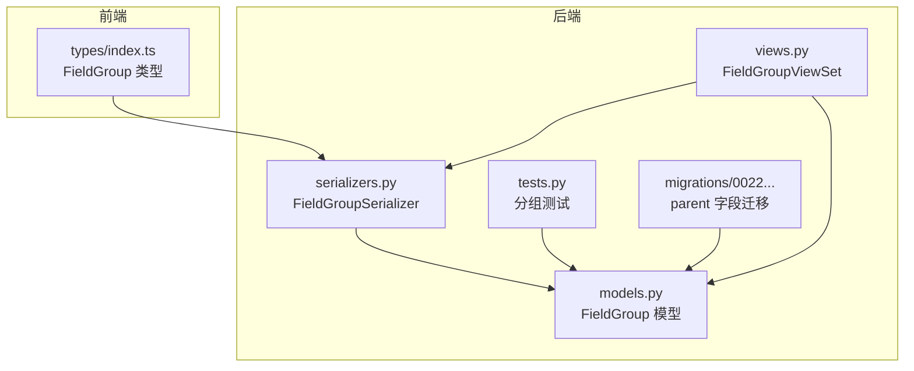
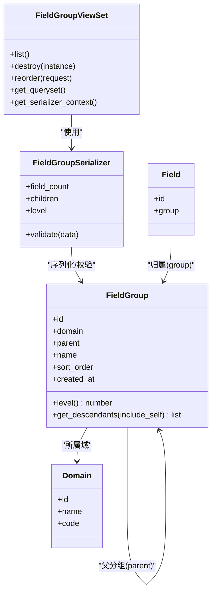
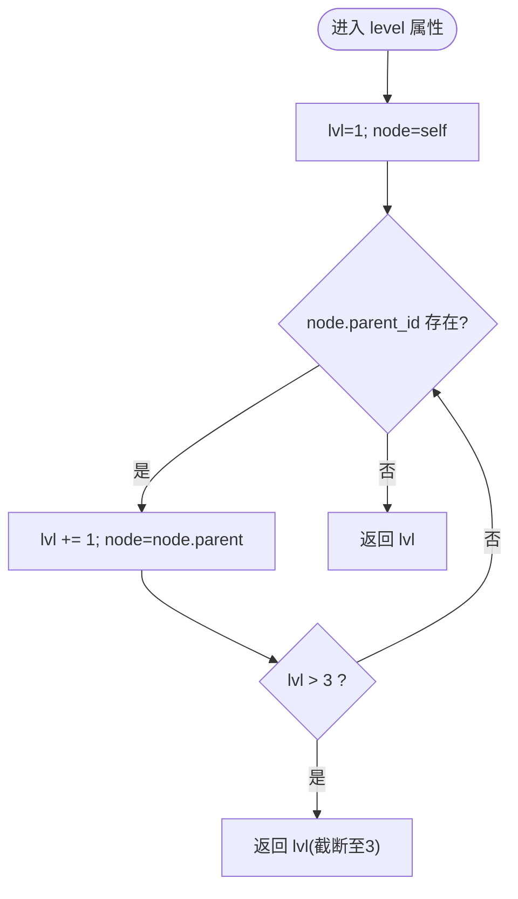
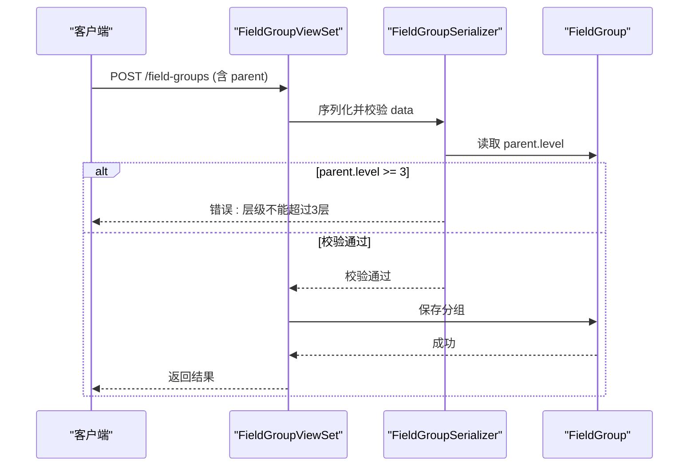
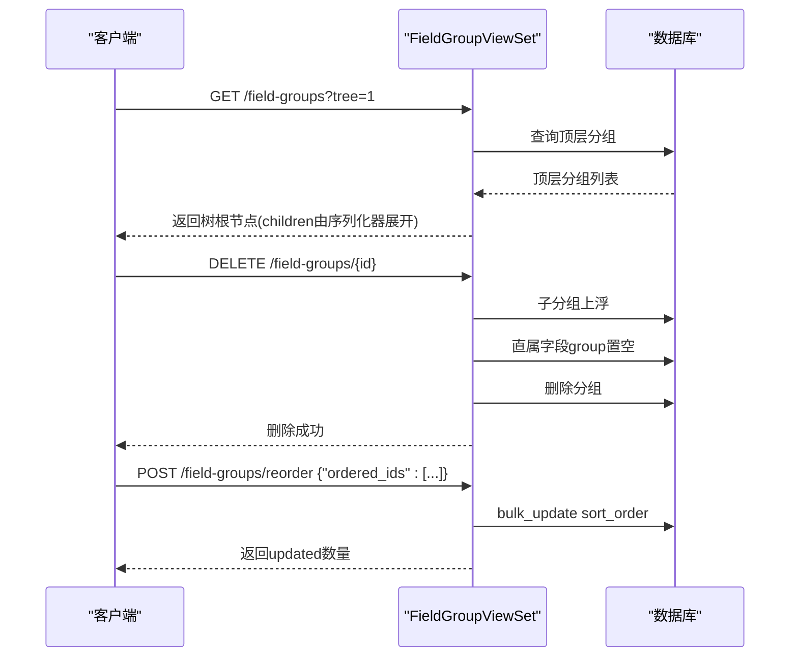
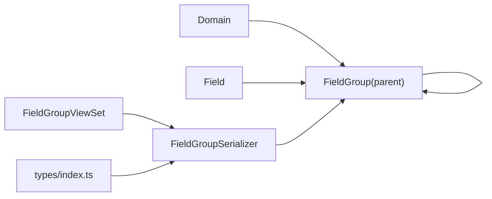

# 字段分组模型

<cite>
**本文引用的文件**   
- [models.py](file://backend/apps/modeling/models.py)
- [serializers.py](file://backend/apps/modeling/serializers.py)
- [views.py](file://backend/apps/modeling/views.py)
- [0022_add_parent_to_fieldgroup.py](file://backend/apps/modeling/migrations/0022_add_parent_to_fieldgroup.py)
- [tests.py](file://backend/apps/modeling/tests.py)
- [index.ts](file://frontend/src/types/index.ts)
</cite>

## 目录
1. [简介](#简介)
2. [项目结构](#项目结构)
3. [核心组件](#核心组件)
4. [架构总览](#架构总览)
5. [详细组件分析](#详细组件分析)
6. [依赖关系分析](#依赖关系分析)
7. [性能考量](#性能考量)
8. [故障排查指南](#故障排查指南)
9. [结论](#结论)
10. [附录](#附录)

## 简介
本文件围绕 MetaData002 系统中的“字段分组”能力，对 FieldGroup 模型及其在序列化、视图层与前端类型中的实现进行系统化说明。重点包括：
- 树形结构设计（父子关系、层级限制最多3层）
- 排序机制与层级计算算法
- 后代节点获取逻辑
- CRUD 操作与完整性约束
- 性能优化策略
- 字段分组的最佳实践与组织模式

## 项目结构
FieldGroup 相关的代码分布在后端模型、序列化器、视图以及前端类型定义中：
- 模型层：定义 FieldGroup 的字段、层级属性与递归查询方法
- 序列化层：提供树形序列化、层级校验与计数扩展
- 视图层：提供列表、删除、重排序等接口，支持 tree 模式
- 迁移层：引入 parent 自引用外键以支持树形结构
- 前端类型：定义 FieldGroup 的数据结构与可选字段

图表来源
- [models.py:125-159](file://backend/apps/modeling/models.py#L125-L159)
- [serializers.py:71-106](file://backend/apps/modeling/serializers.py#L71-L106)
- [views.py:919-966](file://backend/apps/modeling/views.py#L919-L966)
- [tests.py:190-212](file://backend/apps/modeling/tests.py#L190-L212)
- [0022_add_parent_to_fieldgroup.py:1-20](file://backend/apps/modeling/migrations/0022_add_parent_to_fieldgroup.py#L1-L20)
- [index.ts:49-59](file://frontend/src/types/index.ts#L49-L59)

章节来源
- [models.py:125-159](file://backend/apps/modeling/models.py#L125-L159)
- [serializers.py:71-106](file://backend/apps/modeling/serializers.py#L71-L106)
- [views.py:919-966](file://backend/apps/modeling/views.py#L919-L966)
- [tests.py:190-212](file://backend/apps/modeling/tests.py#L190-L212)
- [0022_add_parent_to_fieldgroup.py:1-20](file://backend/apps/modeling/migrations/0022_add_parent_to_fieldgroup.py#L1-L20)
- [index.ts:49-59](file://frontend/src/types/index.ts#L49-L59)

## 核心组件
- FieldGroup 模型
  - 字段：domain（所属域）、parent（父分组，自引用外键）、name、sort_order、created_at
  - 元数据：默认排序 sort_order, id；字符串表示包含 domain.name/name
  - 属性 level：从自身向上遍历 parent 计算层级，上限为3
  - 方法 get_descendants(include_self=False)：递归收集所有后代节点
- FieldGroupSerializer
  - 输出字段：id, domain, parent, name, sort_order, field_count, level, children, created_at
  - 树形展开：当 context.tree_mode=True 时，children 按 sort_order,id 递归序列化
  - 校验规则：parent.level >= 3 不允许；禁止将分组设为自己或其任意后代
- FieldGroupViewSet
  - 列表过滤：domain, parent
  - 树形模式：tree=1 时仅返回顶层分组（parent__isnull=True），children 由序列化器展开
  - 删除行为：子分组上浮到父级，直属字段 group 置空
  - 批量重排序：reorder 接口接收 ordered_ids，批量更新 sort_order
- 前端类型 FieldGroup
  - 包含 id, domain, parent, name, sort_order, level?, field_count?, children?, created_at

章节来源
- [models.py:125-159](file://backend/apps/modeling/models.py#L125-L159)
- [serializers.py:71-106](file://backend/apps/modeling/serializers.py#L71-L106)
- [views.py:919-966](file://backend/apps/modeling/views.py#L919-L966)
- [index.ts:49-59](file://frontend/src/types/index.ts#L49-L59)

## 架构总览
下图展示了 FieldGroup 在模型、序列化器与视图之间的交互关系，以及树形模式的请求处理流程。

图表来源
- [models.py:125-159](file://backend/apps/modeling/models.py#L125-L159)
- [serializers.py:71-106](file://backend/apps/modeling/serializers.py#L71-L106)
- [views.py:919-966](file://backend/apps/modeling/views.py#L919-L966)

## 详细组件分析

### FieldGroup 模型：树形结构与层级算法
- 父子关系
  - parent 为自引用外键，允许 null（顶层分组）
  - related_name='children' 便于向下遍历
- 层级限制
  - level 属性通过向上遍历 parent 计算，最大值为3
  - 序列化器 validate 中强制 parent.level < 3，防止超过3层
- 排序机制
  - 模型 Meta.ordering = ['sort_order', 'id']
  - 视图层 reorder 接口按传入顺序写入 0,1,2,...
- 后代节点获取
  - get_descendants 递归收集 children 及其后代，支持 include_self

图表来源
- [models.py:141-151](file://backend/apps/modeling/models.py#L141-L151)

章节来源
- [models.py:125-159](file://backend/apps/modeling/models.py#L125-L159)

### FieldGroupSerializer：树形序列化与约束校验
- 树形展开
  - 当 context.tree_mode=True 时，children 按 sort_order,id 递归序列化
  - 非树形模式 children 返回 None，避免无限递归
- 层级与计数
  - level 直接调用 model.level
  - field_count 统计该分组下 fields 的数量
- 约束校验
  - parent.level >= 3 拒绝创建
  - 禁止将分组设为自己或其后代（通过 instance.get_descendants() 检查）

图表来源
- [serializers.py:94-106](file://backend/apps/modeling/serializers.py#L94-L106)
- [models.py:141-151](file://backend/apps/modeling/models.py#L141-L151)

章节来源
- [serializers.py:71-106](file://backend/apps/modeling/serializers.py#L71-L106)

### FieldGroupViewSet：CRUD、树形模式与重排序
- 列表与过滤
  - filterset_fields=['domain','parent']
  - tree=1 时只返回顶层分组（parent__isnull=True）
- 删除行为
  - 子分组上浮到父级（instance.children.update(parent=instance.parent)）
  - 直属字段 group 置空（instance.fields.update(group=None)）
- 批量重排序
  - reorder 接口接收 ordered_ids，批量更新 sort_order

图表来源
- [views.py:919-966](file://backend/apps/modeling/views.py#L919-L966)

章节来源
- [views.py:919-966](file://backend/apps/modeling/views.py#L919-L966)

### 前端类型 FieldGroup
- 字段映射
  - id, domain, parent, name, sort_order, created_at
  - 可选：level, field_count, children
- 用途
  - 用于前端渲染分组树、展示层级与计数、维护 children 结构

章节来源
- [index.ts:49-59](file://frontend/src/types/index.ts#L49-L59)

### 迁移与演进
- 0022_add_parent_to_fieldgroup.py
  - 为 FieldGroup 添加 parent 自引用外键，开启树形结构能力

章节来源
- [0022_add_parent_to_fieldgroup.py:1-20](file://backend/apps/modeling/migrations/0022_add_parent_to_fieldgroup.py#L1-L20)

### 测试用例验证
- 创建与层级
  - 顶层 level=1；二级 level=2；三级 level=3
- 后代获取
  - get_descendants() 正确返回子与孙节点数量

章节来源
- [tests.py:190-212](file://backend/apps/modeling/tests.py#L190-L212)

## 依赖关系分析
- 模型依赖
  - FieldGroup 依赖 Domain（所属域）
  - FieldGroup 自引用 parent（父分组）
  - Field.group 指向 FieldGroup（字段归属）
- 序列化依赖
  - FieldGroupSerializer 依赖 FieldGroup 模型与 Field 计数
- 视图依赖
  - FieldGroupViewSet 依赖 FieldGroupSerializer 与数据库查询
- 前端依赖
  - types/index.ts 定义 FieldGroup 数据结构，供 UI 消费

图表来源
- [models.py:125-159](file://backend/apps/modeling/models.py#L125-L159)
- [serializers.py:71-106](file://backend/apps/modeling/serializers.py#L71-L106)
- [views.py:919-966](file://backend/apps/modeling/views.py#L919-L966)
- [index.ts:49-59](file://frontend/src/types/index.ts#L49-L59)

章节来源
- [models.py:125-159](file://backend/apps/modeling/models.py#L125-L159)
- [serializers.py:71-106](file://backend/apps/modeling/serializers.py#L71-L106)
- [views.py:919-966](file://backend/apps/modeling/views.py#L919-L966)
- [index.ts:49-59](file://frontend/src/types/index.ts#L49-L59)

## 性能考量
- 查询优化
  - 列表过滤使用 filterset_fields['domain','parent']，减少不必要数据
  - 树形模式仅返回顶层分组，children 由序列化器按需展开，避免一次性加载整棵树
- 序列化优化
  - 非树形模式 children 返回 None，避免深度递归带来的 N+1 问题
  - field_count 使用 count() 聚合，避免全量加载
- 批量更新
  - reorder 使用 bulk_update 批量写入 sort_order，降低数据库往返
- 建议
  - 在需要完整树结构的场景，可考虑使用 Django 的 TreeQuerySet 或物化路径字段（如 path/closure table）进一步优化祖先/后代查询
  - 对频繁访问的分组计数，可增加缓存层（如 Redis）存储 field_count

[本节为通用性能指导，不直接分析具体文件]

## 故障排查指南
- 层级超限
  - 现象：创建或修改 parent 时报错“分组层级不能超过3层”
  - 原因：parent.level >= 3 被序列化器校验拦截
  - 解决：确保新 parent 的层级小于3
- 循环引用
  - 现象：设置 parent 为自身或其后代时报错
  - 原因：validate 中通过 get_descendants() 检测并拒绝
  - 解决：选择合法的父分组
- 删除后数据异常
  - 现象：删除分组后字段未归位
  - 原因：perform_destroy 应执行子分组上浮与字段 group 置空
  - 解决：确认删除流程是否被自定义覆盖或未调用默认实现
- 排序无效
  - 现象：reorder 后排序未生效
  - 原因：ordered_ids 为空或非数组，或 bulk_update 未触发
  - 解决：检查请求体格式与数据库事务提交

章节来源
- [serializers.py:94-106](file://backend/apps/modeling/serializers.py#L94-L106)
- [views.py:938-966](file://backend/apps/modeling/views.py#L938-L966)

## 结论
FieldGroup 通过自引用外键实现了最多3层的树形分组结构，配合序列化器的树形展开与严格校验，确保了数据完整性与一致性。视图层提供了便捷的 CRUD 与重排序接口，满足常见的分组管理需求。建议在大规模数据场景下结合物化路径或缓存策略进一步优化祖先/后代查询与计数性能。

[本节为总结性内容，不直接分析具体文件]

## 附录
- 字段分组最佳实践
  - 顶层分组代表业务大类（如“基本信息”、“联系方式”）
  - 第二层细化分类（如“个人”、“企业”）
  - 第三层用于更细粒度划分（如“证件信息”、“地址信息”）
  - 保持层级不超过3层，避免过深导致管理与查询复杂度上升
- 组织模式
  - 按业务域划分顶层分组，再按实体维度细分
  - 同一域内分组命名规范统一，便于前端展示与搜索
  - 使用 sort_order 控制显示顺序，保证用户体验一致

[本节为概念性内容，不直接分析具体文件]