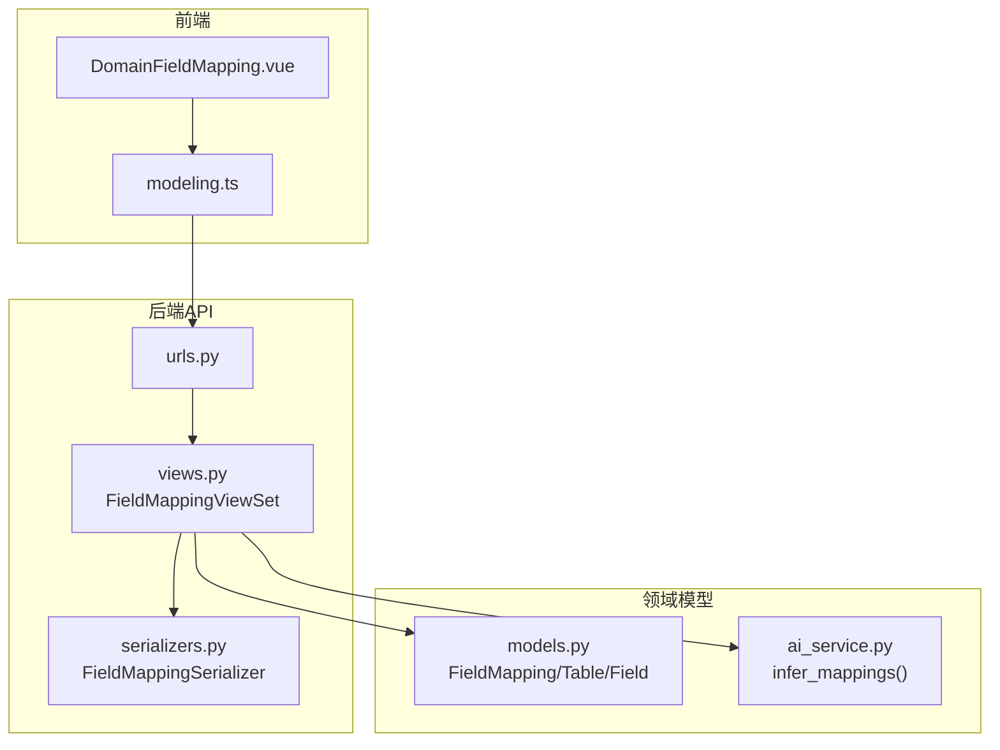
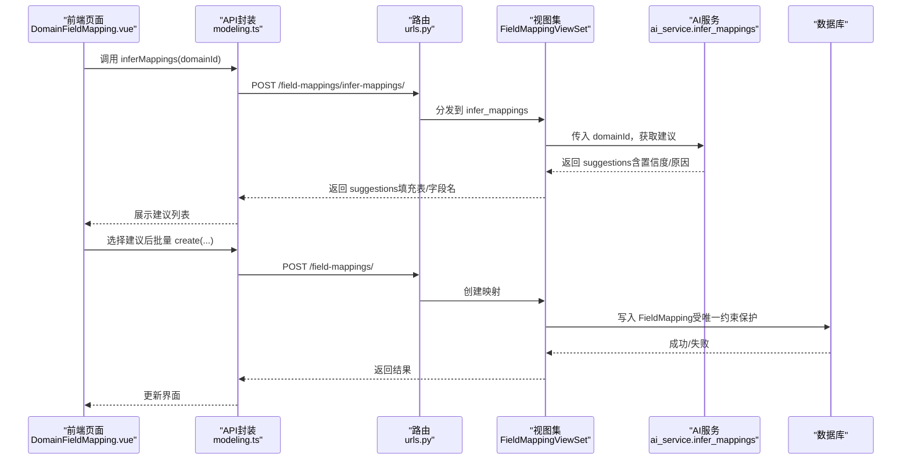
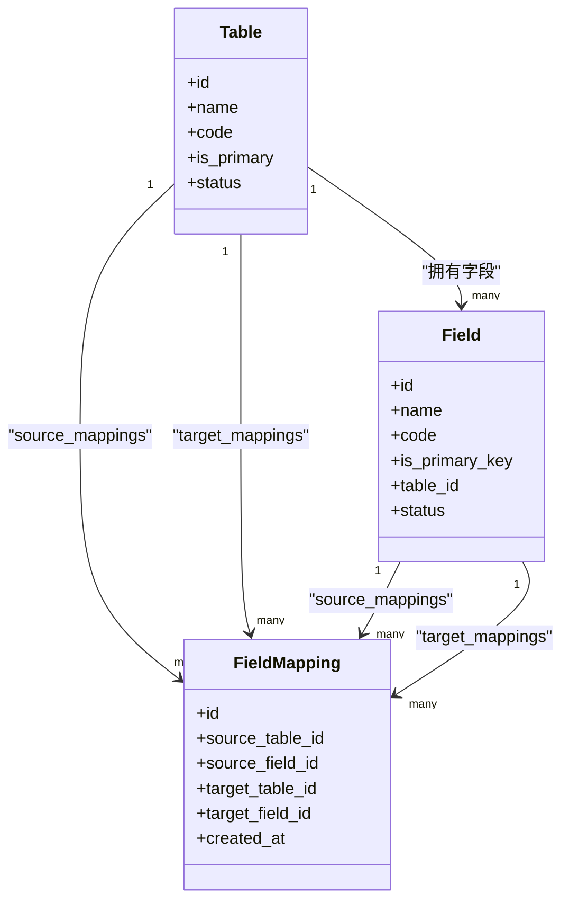
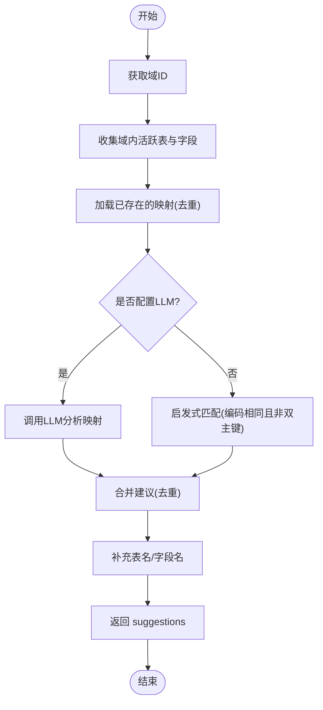
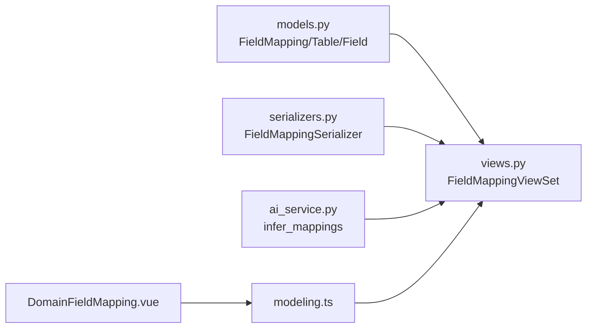

# 字段映射模型

<cite>
**本文引用的文件**   
- [models.py](file://backend/apps/modeling/models.py)
- [serializers.py](file://backend/apps/modeling/serializers.py)
- [views.py](file://backend/apps/modeling/views.py)
- [urls.py](file://backend/apps/modeling/urls.py)
- [ai_service.py](file://backend/apps/modeling/ai_service.py)
- [DomainFieldMapping.vue](file://frontend/src/views/modeling/DomainFieldMapping.vue)
- [modeling.ts](file://frontend/src/api/modeling.ts)
</cite>

## 目录
1. [引言](#引言)
2. [项目结构](#项目结构)
3. [核心组件](#核心组件)
4. [架构总览](#架构总览)
5. [详细组件分析](#详细组件分析)
6. [依赖关系分析](#依赖关系分析)
7. [性能考虑](#性能考虑)
8. [故障排查指南](#故障排查指南)
9. [结论](#结论)
10. [附录](#附录)

## 引言
本文件围绕 MetaData002 系统的“字段映射模型”进行系统化文档化，重点解释 FieldMapping 模型类的设计与使用，包括表间关系的定义、字段级映射规则、双向关联管理、CRUD 操作、唯一性约束与完整性校验、查询优化、批量操作与一致性检查机制，并给出最佳实践与复杂关系处理方案。该模型用于在多表域中通过“源表.源字段 → 目标表.目标字段”的映射表达表间关系，支撑档案合并、数据同步与一致性校验等上层能力。

## 项目结构
字段映射功能涉及后端模型、序列化器、视图集、路由以及前端交互与 AI 推断服务：
- 模型层：FieldMapping 及其相关实体（Table、Field）
- 序列化层：FieldMappingSerializer
- API 层：FieldMappingViewSet（含 infer-mappings 自定义动作）
- 路由层：field-mappings 路由注册
- 前端：DomainFieldMapping.vue 页面与 modeling.ts API 封装
- AI 服务：ai_service.infer_mappings 提供智能建议

图表来源
- [urls.py:12](file://backend/apps/modeling/urls.py#L12)
- [views.py:1824-1879](file://backend/apps/modeling/views.py#L1824-L1879)
- [serializers.py:230-241](file://backend/apps/modeling/serializers.py#L230-L241)
- [models.py:474-489](file://backend/apps/modeling/models.py#L474-L489)
- [ai_service.py:754-836](file://backend/apps/modeling/ai_service.py#L754-L836)
- [DomainFieldMapping.vue:711-738](file://frontend/src/views/modeling/DomainFieldMapping.vue#L711-L738)
- [modeling.ts:467-480](file://frontend/src/api/modeling.ts#L467-L480)

章节来源
- [urls.py:12](file://backend/apps/modeling/urls.py#L12)
- [views.py:1824-1879](file://backend/apps/modeling/views.py#L1824-L1879)
- [serializers.py:230-241](file://backend/apps/modeling/serializers.py#L230-L241)
- [models.py:474-489](file://backend/apps/modeling/models.py#L474-L489)
- [ai_service.py:754-836](file://backend/apps/modeling/ai_service.py#L754-L836)
- [DomainFieldMapping.vue:711-738](file://frontend/src/views/modeling/DomainFieldMapping.vue#L711-L738)
- [modeling.ts:467-480](file://frontend/src/api/modeling.ts#L467-L480)

## 核心组件
- FieldMapping 模型：定义“源表.源字段 → 目标表.目标字段”的映射关系，包含时间戳与复合唯一约束。
- Table/Field 模型：作为映射的两端实体，分别承载表与字段的元数据。
- FieldMappingSerializer：序列化/反序列化映射记录，附带可读名称字段。
- FieldMappingViewSet：提供标准 CRUD 与按表/域过滤，以及 infer-mappings 智能推断接口。
- ai_service.infer_mappings：基于 LLM 或启发式算法生成映射建议，避免重复。

章节来源
- [models.py:474-489](file://backend/apps/modeling/models.py#L474-L489)
- [models.py:60-123](file://backend/apps/modeling/models.py#L60-L123)
- [models.py:301-367](file://backend/apps/modeling/models.py#L301-L367)
- [serializers.py:230-241](file://backend/apps/modeling/serializers.py#L230-L241)
- [views.py:1824-1879](file://backend/apps/modeling/views.py#L1824-L1879)
- [ai_service.py:754-836](file://backend/apps/modeling/ai_service.py#L754-L836)

## 架构总览
字段映射的整体调用链路如下：
- 前端在 DomainFieldMapping.vue 发起“AI 自动映射”请求，调用 modeling.ts 封装的 inferMappings。
- 后端 urls.py 将 /field-mappings/infer-mappings/ 路由到 FieldMappingViewSet.infer_mappings。
- 视图调用 ai_service.infer_mappings 获取建议，补充表名/字段名后返回。
- 用户确认后，前端循环调用 create 创建映射；若涉及组合主键，会批量创建多条映射。

图表来源
- [DomainFieldMapping.vue:711-738](file://frontend/src/views/modeling/DomainFieldMapping.vue#L711-L738)
- [modeling.ts:467-480](file://frontend/src/api/modeling.ts#L467-L480)
- [urls.py:12](file://backend/apps/modeling/urls.py#L12)
- [views.py:1824-1879](file://backend/apps/modeling/views.py#L1824-L1879)
- [ai_service.py:754-836](file://backend/apps/modeling/ai_service.py#L754-L836)

## 详细组件分析

### FieldMapping 模型设计
- 字段说明
  - source_table/target_table：外键指向 Table，表示映射的源/目标表。
  - source_field/target_field：外键指向 Field，表示映射的源/目标字段。
  - created_at：创建时间。
- 唯一性约束
  - unique_together = (source_table, source_field, target_table, target_field)，确保同一对源/目标字段映射唯一。
- 反向关联
  - source_mappings：Table → FieldMapping（作为源表）
  - target_mappings：Table → FieldMapping（作为目标表）
  - Field 侧也有 source_mappings/target_mappings 反向访问。
- 业务语义
  - 通过字段级映射表达表间关系，支持一对一、一对多、多对一、多对多（由多个映射组合实现）。
  - 结合 StandardField 概念层去重与主字段策略，可驱动档案合并与一致性校验。

图表来源
- [models.py:60-123](file://backend/apps/modeling/models.py#L60-L123)
- [models.py:301-367](file://backend/apps/modeling/models.py#L301-L367)
- [models.py:474-489](file://backend/apps/modeling/models.py#L474-L489)

章节来源
- [models.py:474-489](file://backend/apps/modeling/models.py#L474-L489)

### 字段映射的 CRUD 与查询
- 标准 CRUD
  - 列表：支持按 source_table/target_table 过滤，支持按 table/domain 参数筛选（get_queryset 扩展）。
  - 详情/创建/更新/删除：由 ModelViewSet 默认提供。
- 序列化
  - FieldMappingSerializer 暴露 id、source/target 表与字段 ID，以及对应的 name 只读字段，便于前端展示。
- 过滤与检索
  - filterset_fields 支持 source_table/target_table。
  - get_queryset 支持 table 与 domain 查询参数，提升前端列表性能。

章节来源
- [views.py:1824-1843](file://backend/apps/modeling/views.py#L1824-L1843)
- [serializers.py:230-241](file://backend/apps/modeling/serializers.py#L230-L241)

### 智能推断映射（AI 辅助）
- 入口
  - FieldMappingViewSet.infer_mappings：接收 domainId，调用 ai_service.infer_mappings。
- 逻辑
  - 收集域内活跃表与字段，读取已存在映射避免重复建议。
  - 优先 LLM 智能分析，失败回退到启发式匹配（编码相同且非双主键）。
  - 返回 suggestions（source/target 字段ID、置信度、原因），视图层补充表名/字段名。
- 前端交互
  - DomainFieldMapping.vue 调用 inferMappings，展示建议并允许批量确认创建。
  - 针对组合主键场景，前端会按最小主键数批量创建映射。

图表来源
- [views.py:1845-1879](file://backend/apps/modeling/views.py#L1845-L1879)
- [ai_service.py:754-836](file://backend/apps/modeling/ai_service.py#L754-L836)
- [DomainFieldMapping.vue:711-738](file://frontend/src/views/modeling/DomainFieldMapping.vue#L711-L738)

章节来源
- [views.py:1845-1879](file://backend/apps/modeling/views.py#L1845-L1879)
- [ai_service.py:754-836](file://backend/apps/modeling/ai_service.py#L754-L836)
- [DomainFieldMapping.vue:711-738](file://frontend/src/views/modeling/DomainFieldMapping.vue#L711-L738)

### 唯一性约束与关系完整性验证
- 唯一性
  - FieldMapping.unique_together(source_table, source_field, target_table, target_field) 保证映射唯一。
- 完整性
  - 停用表前检查是否存在映射关系（toggle_status 动作），防止破坏关系。
  - 域配置检查（_check_domain_config）提示多表域缺少映射的风险。
- 一致性
  - 档案一致性检查利用映射将物理列映射到 schema code，进行差异比对。

章节来源
- [models.py:474-489](file://backend/apps/modeling/models.py#L474-L489)
- [views.py:690-721](file://backend/apps/modeling/views.py#L690-L721)
- [views.py:327-427](file://backend/apps/modeling/views.py#L327-L427)
- [archive/views.py:673-702](file://backend/apps/archive/views.py#L673-L702)

### 批量操作与一致性检查
- 批量创建
  - 前端根据 AI 建议或组合主键情况，循环调用 create，后端逐条落库并由唯一约束保障一致性。
- 一致性检查
  - 域配置检查输出 P0/P1/P2 级别问题清单，其中 P2 提示多表域未配置映射。
  - 档案一致性检查通过映射将源表字段映射到 schema code，对比档案与源数据差异。

章节来源
- [DomainFieldMapping.vue:820-870](file://frontend/src/views/modeling/DomainFieldMapping.vue#L820-L870)
- [views.py:327-427](file://backend/apps/modeling/views.py#L327-L427)
- [archive/views.py:673-702](file://backend/apps/archive/views.py#L673-L702)

## 依赖关系分析
- 模型依赖
  - FieldMapping 依赖 Table 与 Field，形成强一致的外键关系。
- 视图依赖
  - FieldMappingViewSet 依赖 FieldMappingSerializer 与 models，并在 infer_mappings 中调用 ai_service。
- 前端依赖
  - DomainFieldMapping.vue 依赖 modeling.ts 提供的 API 封装，调用 inferMappings 与 create/delete。

图表来源
- [models.py:474-489](file://backend/apps/modeling/models.py#L474-L489)
- [serializers.py:230-241](file://backend/apps/modeling/serializers.py#L230-L241)
- [views.py:1824-1879](file://backend/apps/modeling/views.py#L1824-L1879)
- [ai_service.py:754-836](file://backend/apps/modeling/ai_service.py#L754-L836)
- [DomainFieldMapping.vue:711-738](file://frontend/src/views/modeling/DomainFieldMapping.vue#L711-L738)
- [modeling.ts:467-480](file://frontend/src/api/modeling.ts#L467-L480)

章节来源
- [models.py:474-489](file://backend/apps/modeling/models.py#L474-L489)
- [serializers.py:230-241](file://backend/apps/modeling/serializers.py#L230-L241)
- [views.py:1824-1879](file://backend/apps/modeling/views.py#L1824-L1879)
- [ai_service.py:754-836](file://backend/apps/modeling/ai_service.py#L754-L836)
- [DomainFieldMapping.vue:711-738](file://frontend/src/views/modeling/DomainFieldMapping.vue#L711-L738)
- [modeling.ts:467-480](file://frontend/src/api/modeling.ts#L467-L480)

## 性能考虑
- 查询优化
  - 使用 select_related('source_table','source_field','target_table','target_field') 减少 N+1 查询。
  - 列表过滤支持 table/domain 参数，缩小结果集。
- 批量操作
  - 前端批量创建映射时注意网络往返开销，可在服务端增加批量接口（当前为逐条创建）。
- 缓存与样本值
  - 字段 distinct_values 缓存可用于 AI 推断与一致性检查，降低实时采样成本。

[本节为通用指导，不直接分析具体文件]

## 故障排查指南
- 常见错误
  - 唯一性冲突：创建映射时报 400，检查是否已存在相同映射。
  - 停用表失败：表存在映射关系时不允许停用，需先解除映射。
  - AI 推断失败：未配置 API Key 或网络异常，回退到启发式匹配。
- 定位步骤
  - 查看 FieldMapping 列表，确认映射是否存在。
  - 检查域配置检查结果（P0/P1/P2），关注“多表已配置关系映射”项。
  - 核对表的主键配置与状态，确保映射两端有效。

章节来源
- [views.py:690-721](file://backend/apps/modeling/views.py#L690-L721)
- [views.py:327-427](file://backend/apps/modeling/views.py#L327-L427)
- [ai_service.py:754-836](file://backend/apps/modeling/ai_service.py#L754-L836)

## 结论
FieldMapping 模型以简洁的字段级映射表达表间关系，配合唯一性约束与视图层的过滤/推断能力，为多表域的数据治理提供了坚实基础。通过 AI 辅助推断与前端批量操作，显著降低人工配置成本；结合域配置检查与档案一致性校验，保障关系完整性与数据一致性。建议在复杂关系中优先使用主键映射，并结合 StandardField 主字段策略，确保档案合并与同步的正确性与可维护性。

[本节为总结，不直接分析具体文件]

## 附录
- 最佳实践
  - 优先为主表主键建立映射，明确数据源头。
  - 对组合主键场景，按最小主键数批量创建映射，避免遗漏。
  - 定期运行域配置检查，及时修复缺失映射与主键配置。
- 复杂关系处理
  - 多对多关系通过多条映射组合表达，注意唯一性约束避免重复。
  - 跨域映射需谨慎评估，建议在同一域内建模后再做跨域集成。

[本节为通用指导，不直接分析具体文件]