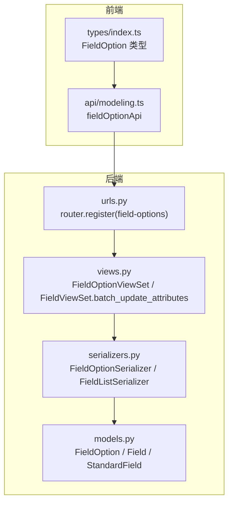
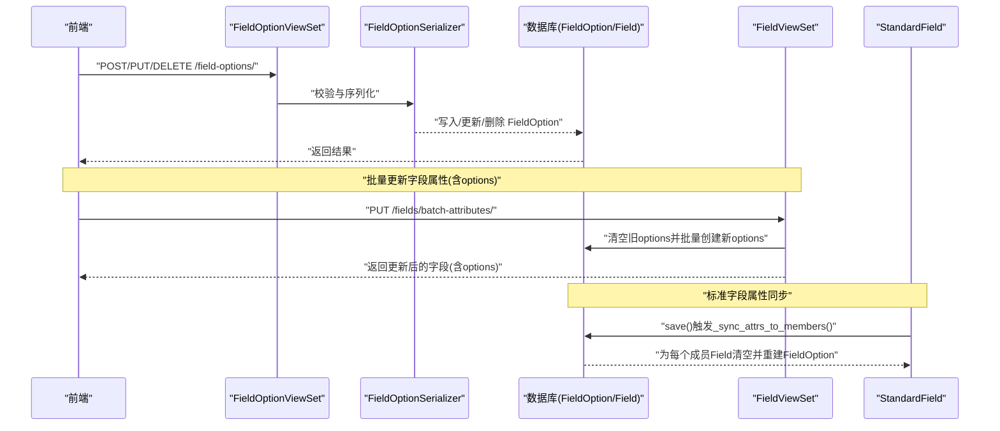
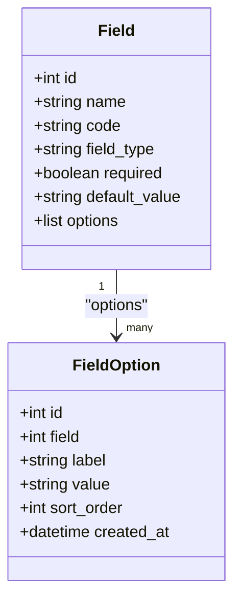
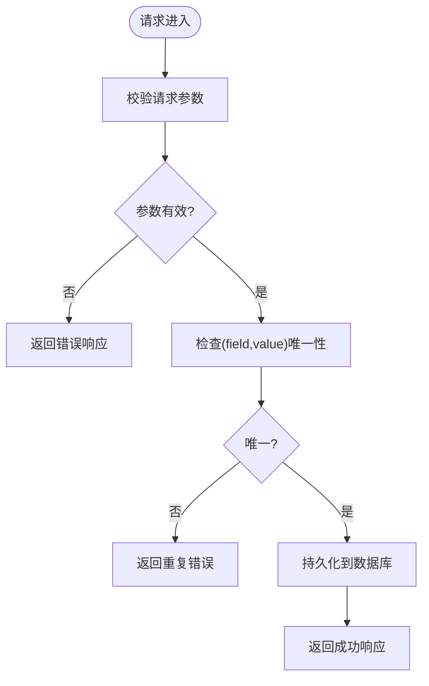
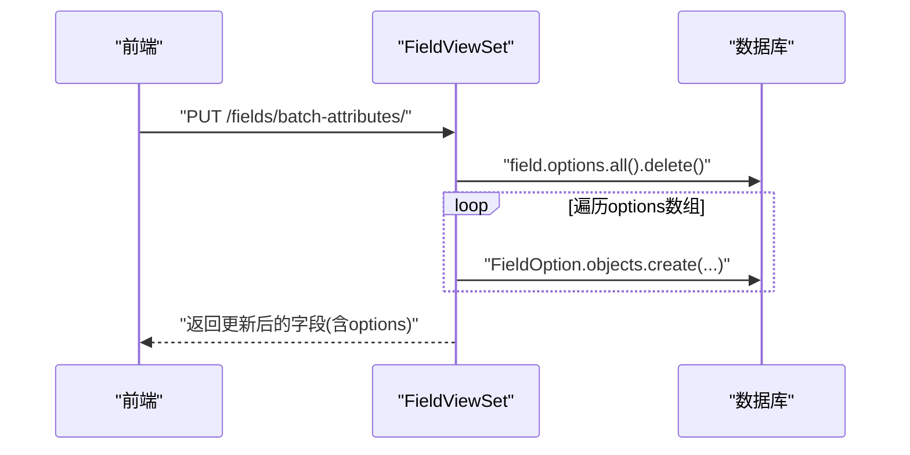
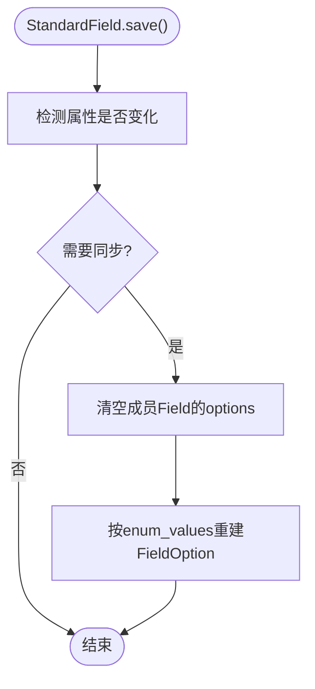
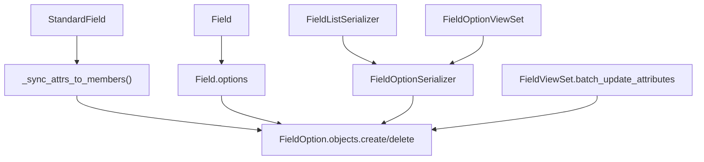

# 字段选项模型

<cite>
**本文引用的文件**   
- [models.py](file://backend/apps/modeling/models.py)
- [serializers.py](file://backend/apps/modeling/serializers.py)
- [views.py](file://backend/apps/modeling/views.py)
- [urls.py](file://backend/apps/modeling/urls.py)
- [index.ts](file://frontend/src/types/index.ts)
- [modeling.ts](file://frontend/src/api/modeling.ts)
</cite>

## 目录
1. [简介](#简介)
2. [项目结构](#项目结构)
3. [核心组件](#核心组件)
4. [架构总览](#架构总览)
5. [详细组件分析](#详细组件分析)
6. [依赖关系分析](#依赖关系分析)
7. [性能考虑](#性能考虑)
8. [故障排查指南](#故障排查指南)
9. [结论](#结论)
10. [附录](#附录)

## 简介
本文件聚焦于 MetaData002 系统的“字段选项模型”，围绕 FieldOption 模型类的设计与使用进行系统化说明，包括：
- 枚举值的定义、排序机制以及与物理字段的关联关系
- 选项值的 CRUD 操作、唯一性约束与批量管理策略
- 与标准字段（StandardField）枚举配置的同步机制
- 前端展示优化与最佳实践建议

该文档面向后端与前端开发者及数据建模人员，帮助理解并正确使用枚举选项能力。

## 项目结构
与字段选项相关的代码主要分布在以下模块：
- 模型层：FieldOption、Field、StandardField 等实体定义
- 序列化层：FieldOptionSerializer、FieldListSerializer 等
- 视图层：FieldOptionViewSet、FieldViewSet 的批量更新接口
- 路由层：field-options 资源注册
- 前端类型与 API：FieldOption 类型定义与 fieldOptionApi

**图表来源**
- [models.py:369-385](file://backend/apps/modeling/models.py#L369-L385)
- [serializers.py:109-127](file://backend/apps/modeling/serializers.py#L109-L127)
- [views.py:969-974](file://backend/apps/modeling/views.py#L969-L974)
- [urls.py:11](file://backend/apps/modeling/urls.py#L11)
- [index.ts:84-91](file://frontend/src/types/index.ts#L84-L91)
- [modeling.ts:458-462](file://frontend/src/api/modeling.ts#L458-L462)

**章节来源**
- [models.py:369-385](file://backend/apps/modeling/models.py#L369-L385)
- [serializers.py:109-127](file://backend/apps/modeling/serializers.py#L109-L127)
- [views.py:969-974](file://backend/apps/modeling/views.py#L969-L974)
- [urls.py:11](file://backend/apps/modeling/urls.py#L11)
- [index.ts:84-91](file://frontend/src/types/index.ts#L84-L91)
- [modeling.ts:458-462](file://frontend/src/api/modeling.ts#L458-L462)

## 核心组件
- FieldOption：枚举选项实体，绑定到物理字段 Field，提供 label/value/sort_order 三要素，并通过 unique_together 保证同一字段内 value 的唯一性。
- Field：物理字段定义，拥有 options 反向关联，用于承载枚举选项集合；在列表序列化中通过 FieldListSerializer 将 options 一并返回。
- StandardField：概念层标准字段，保存 enum_values 配置，并在属性变更时自动同步到成员 Field 的 FieldOption 集合。
- FieldOptionSerializer：仅暴露必要字段，id/created_at 只读，便于前后端一致交互。
- FieldOptionViewSet：提供标准的 ModelViewSet CRUD，支持按 field 过滤。
- 批量更新：FieldViewSet.batch_update_attributes 支持对单个字段一次性覆盖其 options，实现高效批量管理。

**章节来源**
- [models.py:369-385](file://backend/apps/modeling/models.py#L369-L385)
- [models.py:301-367](file://backend/apps/modeling/models.py#L301-L367)
- [models.py:162-300](file://backend/apps/modeling/models.py#L162-L300)
- [serializers.py:109-127](file://backend/apps/modeling/serializers.py#L109-L127)
- [views.py:969-974](file://backend/apps/modeling/views.py#L969-L974)
- [views.py:1066-1099](file://backend/apps/modeling/views.py#L1066-L1099)

## 架构总览
下图展示了从前端到后端的完整调用链路，以及 FieldOption 与 Field、StandardField 的数据流转关系。

**图表来源**
- [views.py:969-974](file://backend/apps/modeling/views.py#L969-L974)
- [views.py:1066-1099](file://backend/apps/modeling/views.py#L1066-L1099)
- [models.py:276-299](file://backend/apps/modeling/models.py#L276-L299)
- [serializers.py:109-127](file://backend/apps/modeling/serializers.py#L109-L127)

## 详细组件分析

### FieldOption 模型设计
- 字段说明
  - field：外键指向 Field，表示所属物理字段
  - label：显示名，用于前端展示
  - value：实际值，业务逻辑使用
  - sort_order：排序号，决定下拉/选择框的顺序
  - created_at：创建时间
- 约束与排序
  - unique_together = (field, value)：确保同一字段下 value 唯一
  - ordering = (sort_order, id)：默认按排序号升序，次级按 id 稳定排序
- 关联关系
  - 通过 Field.options 反向访问，支持查询、清空、批量创建

**图表来源**
- [models.py:301-367](file://backend/apps/modeling/models.py#L301-L367)
- [models.py:369-385](file://backend/apps/modeling/models.py#L369-L385)

**章节来源**
- [models.py:369-385](file://backend/apps/modeling/models.py#L369-L385)

### 选项值的 CRUD 与唯一性约束
- 创建：POST /field-options/，由 FieldOptionSerializer 校验并持久化
- 读取：GET /field-options/?field=...，支持按 field 过滤
- 更新：PATCH/PUT /field-options/{id}/，更新 label/value/sort_order
- 删除：DELETE /field-options/{id}/，删除指定选项
- 唯一性：unique_together(field, value) 保证同一字段内 value 不重复

**图表来源**
- [views.py:969-974](file://backend/apps/modeling/views.py#L969-L974)
- [serializers.py:109-114](file://backend/apps/modeling/serializers.py#L109-L114)
- [models.py:377-381](file://backend/apps/modeling/models.py#L377-L381)

**章节来源**
- [views.py:969-974](file://backend/apps/modeling/views.py#L969-L974)
- [serializers.py:109-114](file://backend/apps/modeling/serializers.py#L109-L114)
- [models.py:377-381](file://backend/apps/modeling/models.py#L377-L381)

### 批量管理策略
- 批量更新字段属性（含 options）：PUT /fields/batch-attributes/
  - 对每个字段，先清空旧 options，再按传入数组顺序重建 FieldOption
  - 适合前端一次提交整个 options 列表，避免多次往返
- 优点
  - 原子性强：清空+重建在同一请求内完成
  - 顺序可控：sort_order 与数组索引一一对应
- 注意事项
  - 若未传 options，不会修改现有选项
  - 大量选项时注意请求体大小与网络开销

**图表来源**
- [views.py:1066-1099](file://backend/apps/modeling/views.py#L1066-L1099)

**章节来源**
- [views.py:1066-1099](file://backend/apps/modeling/views.py#L1066-L1099)

### 与标准字段枚举配置的同步机制
- StandardField.enum_values：概念层枚举配置源，格式为 [{label, value}, ...]
- 同步触发点：StandardField.save() 检测到属性变化时，调用 _sync_attrs_to_members()
- 同步行为：
  - 对每个 active 成员 Field，清空其 options
  - 按 enum_values 顺序重建 FieldOption，保持 sort_order 与数组索引一致
- 适用场景：当多个物理字段归并为一个标准字段时，统一维护枚举值，避免分散管理

**图表来源**
- [models.py:230-299](file://backend/apps/modeling/models.py#L230-L299)

**章节来源**
- [models.py:230-299](file://backend/apps/modeling/models.py#L230-L299)

### 前端展示优化
- 类型定义：FieldOption 包含 id/field/label/value/sort_order/created_at，便于渲染下拉/单选组件
- API 封装：fieldOptionApi 提供 list/create/delete 方法，简化调用
- 展示建议：
  - 优先使用 label 作为显示文本，value 作为业务值
  - 利用 sort_order 控制展示顺序
  - 对于大列表，结合分页或懒加载提升性能

**图表来源**
- [index.ts:84-91](file://frontend/src/types/index.ts#L84-L91)
- [modeling.ts:458-462](file://frontend/src/api/modeling.ts#L458-L462)
- [urls.py:11](file://backend/apps/modeling/urls.py#L11)
- [views.py:969-974](file://backend/apps/modeling/views.py#L969-L974)
- [serializers.py:109-114](file://backend/apps/modeling/serializers.py#L109-L114)

**章节来源**
- [index.ts:84-91](file://frontend/src/types/index.ts#L84-L91)
- [modeling.ts:458-462](file://frontend/src/api/modeling.ts#L458-L462)

## 依赖关系分析
- 模型依赖
  - FieldOption.field → Field.id（外键，级联删除）
  - StandardField._sync_attrs_to_members() → Field.options → FieldOption
- 序列化依赖
  - FieldListSerializer.options → FieldOptionSerializer
- 视图依赖
  - FieldOptionViewSet 依赖 FieldOptionSerializer
  - FieldViewSet.batch_update_attributes 直接操作 FieldOption.objects

**图表来源**
- [models.py:276-299](file://backend/apps/modeling/models.py#L276-L299)
- [serializers.py:116-127](file://backend/apps/modeling/serializers.py#L116-L127)
- [views.py:969-974](file://backend/apps/modeling/views.py#L969-L974)
- [views.py:1066-1099](file://backend/apps/modeling/views.py#L1066-L1099)

**章节来源**
- [models.py:276-299](file://backend/apps/modeling/models.py#L276-L299)
- [serializers.py:116-127](file://backend/apps/modeling/serializers.py#L116-L127)
- [views.py:969-974](file://backend/apps/modeling/views.py#L969-L974)
- [views.py:1066-1099](file://backend/apps/modeling/views.py#L1066-L1099)

## 性能考虑
- 查询优化
  - FieldViewSet 使用 select_related('group','table') 与 prefetch_related('options') 减少 N+1 查询
- 批量操作
  - 使用 batch_update_attributes 一次性覆盖 options，避免多次单条插入
- 排序与索引
  - 数据库层面通过 unique_together(field, value) 与 ordering(sort_order, id) 保障一致性与检索效率
- 前端优化
  - 合理分页与缓存，避免一次性加载过多选项

[本节为通用指导，无需特定文件引用]

## 故障排查指南
- 常见错误
  - 重复 value：违反 unique_together(field, value)，需检查前端是否重复提交或并发冲突
  - 空 options：batch_update_attributes 未传 options 时不会修改现有选项，确认请求体
  - 同步失效：StandardField 属性未变化时不会触发同步，确认 save() 前属性确有变更
- 定位步骤
  - 查看 FieldOptionViewSet 日志与异常
  - 检查 FieldListSerializer 返回的 options 是否与预期一致
  - 验证 StandardField._sync_attrs_to_members() 的执行路径

**章节来源**
- [views.py:969-974](file://backend/apps/modeling/views.py#L969-L974)
- [views.py:1066-1099](file://backend/apps/modeling/views.py#L1066-L1099)
- [models.py:276-299](file://backend/apps/modeling/models.py#L276-L299)

## 结论
FieldOption 模型以简洁的数据结构与严格的唯一性约束，提供了可靠的枚举选项管理能力。通过与 Field 和 StandardField 的联动，既支持物理字段的独立管理，也支持概念层的集中同步。配合批量更新接口与前端类型/API 封装，可实现高效、一致的枚举配置体验。建议在复杂场景中优先采用 StandardField.enum_values 进行集中管理，并结合 batch_update_attributes 进行批量维护。

[本节为总结性内容，无需特定文件引用]

## 附录
- 枚举字段设计最佳实践
  - 明确 label/value 语义：label 用于展示，value 用于业务逻辑
  - 固定排序：通过 sort_order 控制展示顺序，避免依赖 id
  - 唯一性保护：确保 value 在同一字段内唯一，避免歧义
  - 集中管理：多表同义字段使用 StandardField.enum_values 统一维护
  - 批量更新：使用 batch_update_attributes 一次性覆盖 options，减少网络往返
  - 前端优化：按需加载、缓存与分页，提升用户体验

[本节为通用指导，无需特定文件引用]