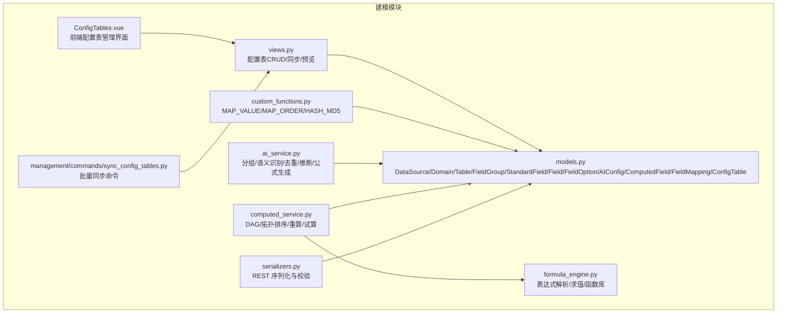
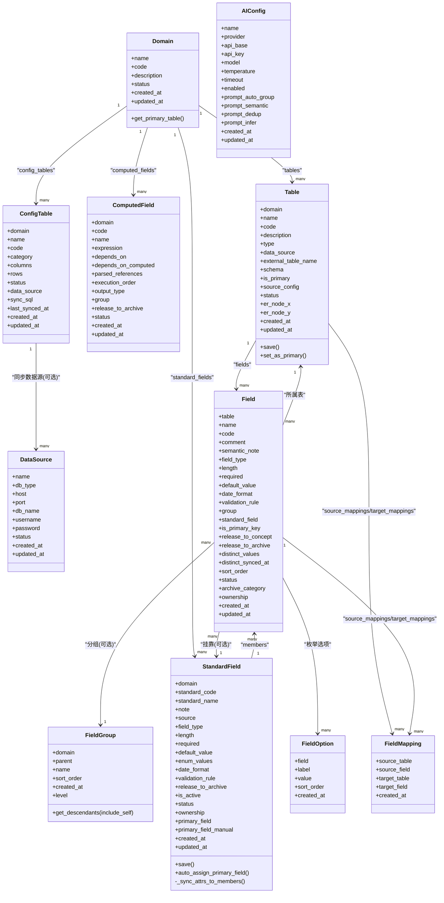
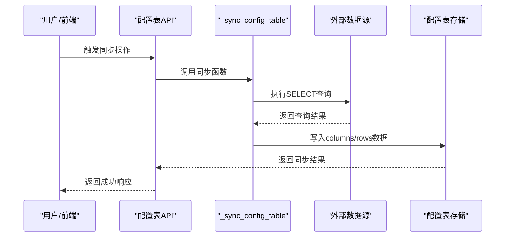

# 数据建模模块模型

<cite>
**本文引用的文件**   
- [models.py](file://backend/apps/modeling/models.py)
- [computed_service.py](file://backend/apps/modeling/computed_service.py)
- [formula_engine.py](file://backend/apps/modeling/formula_engine.py)
- [ai_service.py](file://backend/apps/modeling/ai_service.py)
- [serializers.py](file://backend/apps/modeling/serializers.py)
- [custom_functions.py](file://backend/apps/modeling/custom_functions.py)
- [views.py](file://backend/apps/modeling/views.py)
- [sync_config_tables.py](file://backend/apps/modeling/management/commands/sync_config_tables.py)
- [0027_configtable.py](file://backend/apps/modeling/migrations/0027_configtable.py)
- [0028_configtable_datasource_sync.py](file://backend/apps/modeling/migrations/0028_configtable_datasource_sync.py)
- [ConfigTables.vue](file://frontend/src/views/modeling/ConfigTables.vue)
</cite>

## 更新摘要
**变更内容**   
- 新增 ConfigTable 配置表模型，支持域内轻量级查找表功能
- 添加数据源同步能力，支持从外部数据库执行SQL查询并填充配置数据
- 扩展 MAP_VALUE 和 MAP_ORDER 函数，支持配置表引用和多位置模式
- 新增配置表管理API端点和前端界面
- 提供批量同步命令和自动调度机制

## 目录
1. [简介](#简介)
2. [项目结构](#项目结构)
3. [核心组件](#核心组件)
4. [架构总览](#架构总览)
5. [详细组件分析](#详细组件分析)
6. [依赖关系分析](#依赖关系分析)
7. [性能考量](#性能考量)
8. [故障排查指南](#故障排查指南)
9. [结论](#结论)
10. [附录：使用示例与最佳实践](#附录使用示例与最佳实践)

## 简介
本文件面向 MetaData002 系统的数据建模模块，聚焦于数据模型层的设计与实现。文档围绕 DataSource、Domain、Table、FieldGroup、StandardField、Field、FieldOption、AIConfig、ComputedField、FieldMapping 以及新增的 ConfigTable 等核心模型展开，解释其属性、方法、继承与关联关系（含外键约束、唯一性约束与业务规则），并深入阐述标准字段的概念层设计思想、物理字段与标准字段的映射关系及属性自动同步机制；同时说明计算字段的 DAG 依赖解析与执行顺序确定逻辑，覆盖模型生命周期管理、状态转换与业务验证规则，并提供使用示例与最佳实践建议。

## 项目结构
数据建模模块位于 backend/apps/modeling，核心模型定义在 models.py，计算字段服务与公式引擎分别在 computed_service.py 与 formula_engine.py，AI 能力封装在 ai_service.py，序列化器在 serializers.py，迁移脚本包含对标准字段主字段的初始化逻辑。新增的配置表系统包括模型定义、视图API、管理命令和前端界面。

**图表来源**
- [models.py:1-614](file://backend/apps/modeling/models.py#L1-L614)
- [serializers.py:1-485](file://backend/apps/modeling/serializers.py#L1-L485)
- [custom_functions.py:80-241](file://backend/apps/modeling/custom_functions.py#L80-L241)
- [views.py:2549-2699](file://backend/apps/modeling/views.py#L2549-L2699)
- [sync_config_tables.py:1-59](file://backend/apps/modeling/management/commands/sync_config_tables.py#L1-L59)
- [ConfigTables.vue:1-200](file://frontend/src/views/modeling/ConfigTables.vue#L1-L200)

## 核心组件
本节概述各模型职责与关键属性/方法，后续章节将逐一深入。

- DataSource：系统级数据源配置，支持多数据库类型，提供连接参数与状态。
- Domain：主数据域，作为表与标准字段的组织边界，具备启用/废弃状态。
- Table：域下的实体表，区分本地表与外部数据源表，支持主表标记与 ER 图坐标持久化。
- FieldGroup：字段分类分组，支持最多三层嵌套的树形结构。
- StandardField：概念层一等公民，跨表归一化的"标准字段"，承载属性配置、分组、档案释放策略与主字段选择。
- Field：物理字段定义，归属具体表，可挂靠到标准字段，支持枚举选项、去重缓存、归档分类与维护方。
- FieldOption：枚举类型的选项值，按排序维护。
- AIConfig：AI 服务配置单例，支持提示词模板与连接参数。
- ComputedField：计算字段，基于 Excel 风格公式从其他字段推导，支持依赖解析与 DAG 执行顺序。
- FieldMapping：表间字段映射关系，支撑数据集成与一致性检查。
- **ConfigTable**：**新增** 域内轻量级查找表，用于 MAP_VALUE 等函数的映射配置，支持结构化数据存储和JSON行数据，无需修改schema即可灵活配置。

**章节来源**
- [models.py:1-614](file://backend/apps/modeling/models.py#L1-L614)

## 架构总览
数据建模模块以"概念层（StandardField）+ 物理层（Field）"的双层抽象为核心，辅以计算字段（ComputedField）与字段映射（FieldMapping）扩展业务能力。**新增的配置表系统（ConfigTable）** 提供了轻量级的查找表能力，支持通过SQL从外部数据源同步配置数据，为公式计算提供灵活的映射配置。AI 能力贯穿分组、语义识别、去重检测与公式生成，计算字段通过公式引擎进行表达式解析与求值，并由服务层完成 DAG 构建与批量重算。

**图表来源**
- [models.py:1-614](file://backend/apps/modeling/models.py#L1-L614)

## 详细组件分析

### DataSource 数据源配置
- 作用：集中管理多数据库连接信息，供外部表引用与数据采样。
- 关键字段：名称、数据库类型、主机、端口、库名、用户名、密码、状态、时间戳。
- 约束：名称唯一；状态用于控制可用性。
- 典型用法：创建外部表时绑定数据源，配合 external_table_name 与 schema 定位目标表。

**章节来源**
- [models.py:4-30](file://backend/apps/modeling/models.py#L4-L30)

### Domain 主数据域
- 作用：划分业务域，表与标准字段均归属域。
- 关键字段：名称、编码（唯一）、描述、状态、时间戳。
- 方法：get_primary_table() 返回该域的主表（is_primary=True 且启用）。
- 业务规则：每个域仅允许一个主表；主表变更会触发标准字段主字段自动跟随。

**章节来源**
- [models.py:32-58](file://backend/apps/modeling/models.py#L32-L58)

### Table 实体表
- 作用：表示域内的实体表，支持本地表与外部数据源表两种类型。
- 关键字段：所属域、名称、编码、描述、类型、数据源、外部表名、模式、是否主表、状态、ER 图坐标、时间戳。
- 约束：域内编码唯一；类型由 data_source 存在与否强制决定（有则 SOURCE，无则 LOCAL）。
- 方法：
  - save()：根据 data_source 设置 type。
  - set_as_primary()：设置为主表并取消同域其他表的主表标识；随后自动调整标准字段的主字段成员（人工指定除外）。
- 业务规则：主表用于档案合并基准；ER 坐标用于前端可视化持久化。

**章节来源**
- [models.py:60-123](file://backend/apps/modeling/models.py#L60-L123)

### FieldGroup 字段分组
- 作用：为字段提供多层级分组（最多3层），便于管理与展示。
- 关键字段：所属域、父分组、名称、排序号、创建时间。
- 方法：
  - level：计算当前层级（1=顶层）。
  - get_descendants(include_self)：递归获取后代分组。
- 约束：层级不超过3；禁止循环父子关系。

**章节来源**
- [models.py:125-160](file://backend/apps/modeling/models.py#L125-L160)

### StandardField 标准字段（概念层一等公民）
- 作用：跨表归一化的"标准字段"，统一承载属性配置、分组、档案释放策略、主字段选择与状态管理。
- 关键字段：
  - 标识：domain、standard_code（域内唯一）、standard_name、note、source（AI/手动）。
  - 属性：field_type、length、required、default_value、enum_values、date_format、validation_rule。
  - 策略：release_to_archive、is_active、status、ownership。
  - 主字段：primary_field（指向 Field）、primary_field_manual（人工指定标记）。
- 方法：
  - save()：保存时比较新旧属性，若变化则同步到所有成员 Physical Field（包括 enum_values 同步到 FieldOption）。
  - auto_assign_primary_field()：自动分配/校准主字段（优先主表成员，无则置空并清除人工标记）。
  - _sync_attrs_to_members()：批量更新成员字段属性与枚举选项。
- 约束：域内 standard_code 唯一；主字段可由系统自动或人工指定。
- 业务规则：
  - 属性变更自动同步至成员，确保概念层与物理层一致。
  - 主字段变更影响档案写入与一致性检查策略。

**章节来源**
- [models.py:162-300](file://backend/apps/modeling/models.py#L162-L300)

### Field 物理字段
- 作用：表的字段定义，可挂靠到标准字段，支持枚举选项、去重缓存、归档分类与维护方。
- 关键字段：所属表、名称、编码、注释、语义标识、类型、长度、必填、默认值、日期格式、校验规则、分组、标准字段、主键标记、释放策略、去重缓存、排序、状态、归档分类、维护方、时间戳。
- 约束：表内编码唯一；枚举选项 value 唯一。
- 典型用法：
  - 未归并（solo）字段：独立参与档案 schema 与记录。
  - 组合字段：通过 standard_field 外键挂靠，遵循标准字段策略。

**章节来源**
- [models.py:301-367](file://backend/apps/modeling/models.py#L301-L367)

### FieldOption 枚举选项
- 作用：为枚举类型字段提供选项值与排序。
- 关键字段：所属字段、显示名、值、排序号、创建时间。
- 约束：同一字段的 value 唯一。

**章节来源**
- [models.py:369-385](file://backend/apps/modeling/models.py#L369-L385)

### AIConfig AI 服务配置
- 作用：存储 OpenAI 兼容接口的连接参数与提示词模板，供 ai_service 优先读取（回退环境变量）。
- 关键字段：名称、厂商、接口地址、API Key、模型、温度、超时、启用标志、提示词模板、时间戳。
- 业务规则：仅 enabled=True 的一条生效；提示词模板为空时使用内置默认。

**章节来源**
- [models.py:387-419](file://backend/apps/modeling/models.py#L387-L419)

### ComputedField 计算字段
- 作用：通过 Excel 风格公式从其他字段推导，支持依赖其他计算字段，系统自动构建 DAG 确定执行顺序。
- 关键字段：所属域、编码、名称、表达式、依赖物理字段、依赖计算字段、解析后的引用列表、执行顺序、输出类型、分组、释放策略、状态、时间戳。
- 约束：域内编码唯一；执行顺序由 DAG 拓扑排序自动生成。
- 典型用法：
  - 表达式引用语法：{表名.字段名} 或 {$computed.计算字段编码}。
  - 依赖解析后更新 depends_on/depends_on_computed/parsed_references/execution_order。
  - 批量重算按 execution_order 依次求值，结果写入档案记录。

**章节来源**
- [models.py:421-472](file://backend/apps/modeling/models.py#L421-L472)

### ConfigTable 配置表（新增）
- **作用**：域内轻量级查找表，用于 MAP_VALUE 等函数的映射配置，支持结构化数据存储和JSON行数据，无需修改schema即可灵活配置。
- **关键字段**：
  - 标识：domain（所属域）、name（表名称）、code（表编码，公式中引用的标识）、category（类别，如"映射配置"、"参数表"等）。
  - 数据：columns（列定义，JSON数组，如 ["原始值", "目标值"]）、rows（行数据，JSON数组，每行为 {列名: 值} 字典）。
  - 状态：status（启用/停用）。
  - **同步能力**：data_source（同步数据源，FK→DataSource）、sync_sql（同步SQL查询语句）、last_synced_at（最后同步时间）。
- **约束**：域内 code 唯一；状态用于控制配置表可用性。
- **同步机制**：
  - 支持从外部数据源执行SELECT查询，结果前两列作为Key-Value映射。
  - 安全检查：仅允许SELECT查询，限制危险关键字，设置超时保护。
  - 数据转换：自动处理Decimal、日期时间等类型，转换为安全格式。
- **业务规则**：
  - 不参与同步/ER图/字段映射，仅存储键值映射数据供公式引用。
  - 支持手动编辑和自动同步两种方式维护配置数据。
  - 配置表状态影响公式函数的查找行为。

**章节来源**
- [models.py:476-517](file://backend/apps/modeling/models.py#L476-L517)
- [0027_configtable.py:1-35](file://backend/apps/modeling/migrations/0027_configtable.py#L1-L35)
- [0028_configtable_datasource_sync.py:1-30](file://backend/apps/modeling/migrations/0028_configtable_datasource_sync.py#L1-L30)

### FieldMapping 字段映射
- 作用：定义表间字段映射关系，支撑数据集成与一致性检查。
- 关键字段：源表、源字段、目标表、目标字段、创建时间。
- 约束：四元组唯一（源表、源字段、目标表、目标字段）。

**章节来源**
- [models.py:519-567](file://backend/apps/modeling/models.py#L519-L567)

## 依赖关系分析
- 概念层与物理层解耦：StandardField 通过 members 反向关联多个 Field，属性变更自动同步，保证概念层权威性与物理层一致性。
- 计算字段依赖：ComputedField.depends_on 指向物理字段，depends_on_computed 指向其他计算字段，形成 DAG；execution_order 由拓扑排序确定。
- **配置表依赖**：ConfigTable 通过 data_source 关联 DataSource，支持从外部数据源同步配置数据；被 custom_functions 中的 MAP_VALUE 和 MAP_ORDER 函数引用。
- AI 能力集成：ai_service 提供分组、语义识别、去重检测、Excel 推断与公式生成，增强建模效率与准确性。
- 序列化与校验：serializers 提供 REST API 的数据结构与校验规则，保障前后端契约稳定。

**图表来源**
- [views.py:2549-2649](file://backend/apps/modeling/views.py#L2549-L2649)

**章节来源**
- [computed_service.py:1-630](file://backend/apps/modeling/computed_service.py#L1-L630)
- [formula_engine.py:1-800](file://backend/apps/modeling/formula_engine.py#L1-L800)
- [custom_functions.py:80-241](file://backend/apps/modeling/custom_functions.py#L80-L241)

## 性能考量
- 标准字段属性同步：采用批量 update 与选择性同步字段集合，避免全量扫描；enum_values 同步时清空旧选项再插入，减少冗余。
- 计算字段重算：按 execution_order 顺序批量处理，限制错误数量，避免单次请求过大；上下文构建复用 code→table 映射，降低重复查询。
- **配置表同步性能**：
  - SQL查询限制：最大返回10000行，防止大数据量导致内存溢出。
  - 超时保护：PostgreSQL设置statement_timeout='30s'，MySQL设置MAX_EXECUTION_TIME=30000ms。
  - 连接管理：动态创建临时连接别名，使用后及时清理，避免连接泄漏。
  - 数据类型转换：自动处理Decimal、日期时间等复杂类型，转换为安全的JSON格式。
- 去重缓存：Field.distinct_values 缓存样本值，减少实时采样开销；必要时按需填充，失败不阻断流程。
- AI 调用：优先数据库配置，回退环境变量；失败降级为启发式算法，保证功能可用。

## 故障排查指南
- 计算字段表达式错误：
  - 语法错误：检查 {表名.字段名} 闭合与函数参数个数。
  - 字段引用未找到：确认上下文已注入对应字段值。
  - 运行时错误：除零、类型不匹配等，需增加 IFERROR 或判空逻辑。
- 循环依赖：
  - 使用 detect_cycle 返回环路径，调整依赖关系消除环路。
- 标准字段主字段未设置：
  - 调用 auto_assign_primary_field() 自动分配；若无主表成员，需人工指定 primary_field。
- AI 连接失败：
  - 检查 AIConfig.enabled 与 api_key；测试连接接口定位问题。
- **配置表同步问题**：
  - SQL语法错误：检查SELECT语句语法，确保只包含允许的函数。
  - 权限不足：确认数据源连接配置正确，具有查询权限。
  - 超时问题：优化SQL查询，添加适当的索引和WHERE条件。
  - 数据格式异常：检查查询结果列数和数据类型，确保前两列可作为Key-Value。

**章节来源**
- [formula_engine.py:23-52](file://backend/apps/modeling/formula_engine.py#L23-L52)
- [computed_service.py:110-161](file://backend/apps/modeling/computed_service.py#L110-L161)
- [models.py:255-274](file://backend/apps/modeling/models.py#L255-L274)
- [ai_service.py:78-90](file://backend/apps/modeling/ai_service.py#L78-L90)
- [views.py:2567-2573](file://backend/apps/modeling/views.py#L2567-L2573)

## 结论
MetaData002 数据建模模块通过标准字段与物理字段的双层抽象，实现了概念层与实现层的解耦与自动同步；计算字段借助公式引擎与 DAG 依赖解析，提供了强大的衍生能力；**新增的配置表系统** 为公式计算提供了灵活的映射配置能力，支持从外部数据源同步配置数据，增强了系统的可扩展性和灵活性；AI 服务贯穿建模全流程，提升效率与准确性。整体设计兼顾灵活性、一致性与可扩展性，适合复杂主数据治理场景。

## 附录：使用示例与最佳实践

### 标准字段属性同步机制
- 新建 StandardField 时，若已有成员，立即同步属性至成员。
- 更新 StandardField 属性时，仅同步变更字段，避免不必要写操作。
- enum_values 同步时清空旧选项并重建，确保选项一致性。

**章节来源**
- [models.py:230-299](file://backend/apps/modeling/models.py#L230-L299)

### 计算字段 DAG 依赖解析与执行顺序
- 表达式解析：extract_references 提取 {表名.字段名} 引用。
- 依赖分类：区分物理字段与计算字段依赖，更新 M2M 关系。
- 环检测：DFS 检测循环依赖，返回环路径。
- 拓扑排序：Kahn 算法计算 execution_order，批量更新。

**章节来源**
- [computed_service.py:21-84](file://backend/apps/modeling/computed_service.py#L21-L84)
- [computed_service.py:164-207](file://backend/apps/modeling/computed_service.py#L164-L207)

### 配置表数据源同步机制（新增）
- **同步流程**：
  1. 配置数据源连接信息（data_source）和同步SQL（sync_sql）。
  2. 执行安全检查：验证SQL语句只包含SELECT关键字。
  3. 建立临时数据库连接，执行查询并限制结果行数。
  4. 转换数据类型为安全格式，写入columns和rows字段。
  5. 更新last_synced_at时间戳，返回同步结果。
- **安全特性**：
  - SQL白名单：仅允许SELECT查询，阻止INSERT/UPDATE/DELETE等操作。
  - 超时保护：针对不同数据库设置合理的查询超时时间。
  - 行数限制：最大返回10000行，防止内存溢出。
  - 连接隔离：使用临时连接别名，避免影响主应用连接池。
- **最佳实践**：
  - SQL优化：使用DISTINCT、SUBSTRING等函数优化查询性能。
  - 索引设计：在外部数据源上为查询字段建立适当索引。
  - 增量同步：通过WHERE条件实现增量数据同步。
  - 错误处理：捕获并记录同步过程中的异常情况。

**章节来源**
- [views.py:2549-2649](file://backend/apps/modeling/views.py#L2549-L2649)
- [sync_config_tables.py:1-59](file://backend/apps/modeling/management/commands/sync_config_tables.py#L1-L59)

### 字段分组与语义识别
- 自动分组：LLM 优先，失败回退启发式（关键词聚类）。
- 语义识别：补全注释、标注同义/歧义字段，提升可读性。
- 去重检测：三维度（编码、名称、去重值）综合判断等价字段。

**章节来源**
- [ai_service.py:171-236](file://backend/apps/modeling/ai_service.py#L171-L236)
- [ai_service.py:240-310](file://backend/apps/modeling/ai_service.py#L240-L310)
- [ai_service.py:326-433](file://backend/apps/modeling/ai_service.py#L326-L433)

### 自然语言生成计算表达式
- 输入：域 ID、自然语言描述、可选选中字段、当前表达式。
- 过程：收集可用字段与样本值，调用 LLM 生成表达式并验证，失败重试一次。
- 输出：表达式、解释、推理、风险、建议编码/名称/输出类型。

**章节来源**
- [ai_service.py:558-747](file://backend/apps/modeling/ai_service.py#L558-L747)

### 配置表函数使用示例（新增）
- **MAP_VALUE函数**：
  - 基本用法：`MAP_VALUE(值, "配置表编码", 默认值)`
  - 配置表查找：自动从域内配置表读取映射关系
  - 向后兼容：支持旧的映射串格式
- **MAP_ORDER函数**：
  - 单值模式：`MAP_ORDER(值, "表编码1", "表编码2", ..., ["默认值"])`
  - 多位置模式：`MAP_ORDER(文本, "分隔符", "位置1,2,...", "配置表编码1", ...)`
  - 多字段多位置：支持"/"分隔不同字段的位罝组
- **HASH_MD5函数**：
  - 生成MD5摘要：`HASH_MD5(文本, [长度])`
  - 常用于迁移对账和数据完整性检查

**章节来源**
- [custom_functions.py:80-241](file://backend/apps/modeling/custom_functions.py#L80-L241)

### 最佳实践建议
- 标准字段命名：使用清晰、一致的 standard_code，便于跨表归一化。
- 主字段选择：优先主表成员，人工指定需谨慎，避免主表切换导致不一致。
- 计算字段设计：保持表达式简洁，合理使用 IFERROR 与判空，避免运行时错误。
- AI 配置：合理设置 temperature 与 timeout，平衡创造性与稳定性。
- 性能优化：利用 distinct_values 缓存，减少实时采样；批量操作优先。
- **配置表设计**：
  - 表编码规范：使用有意义的英文编码，便于在公式中引用。
  - 数据结构设计：columns定义清晰的列名，rows保持扁平化结构。
  - 同步策略：选择合适的同步频率，避免频繁查询影响性能。
  - 数据质量：定期验证配置数据的完整性和准确性。
  - 版本管理：重要配置变更应记录变更日志，便于追溯和回滚。