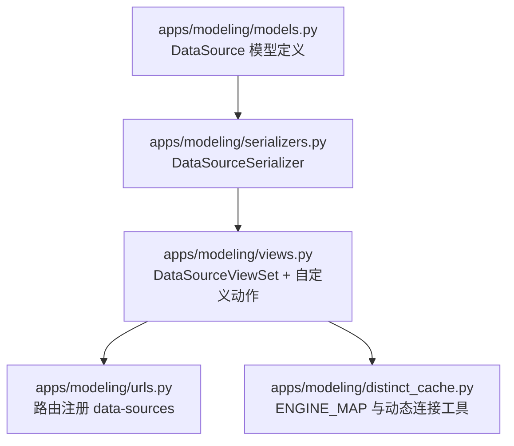
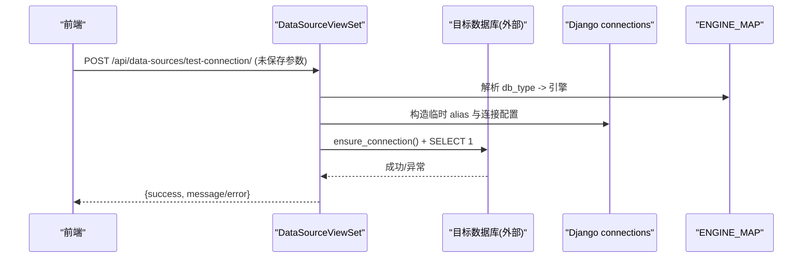
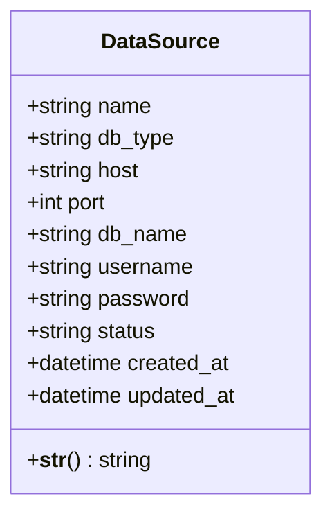
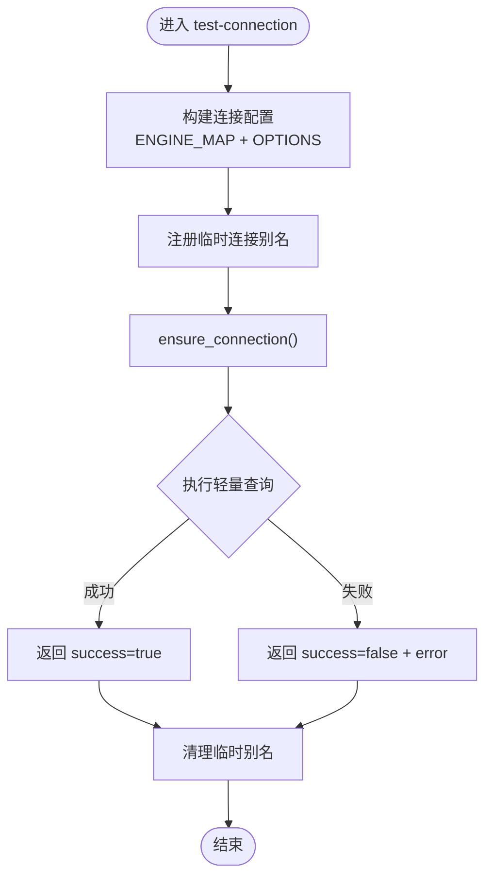
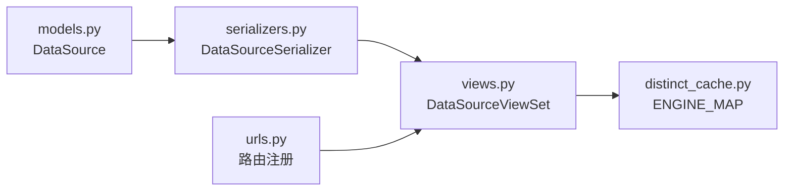

# 数据源模型

<cite>
**本文引用的文件**   
- [models.py](file://backend/apps/modeling/models.py)
- [serializers.py](file://backend/apps/modeling/serializers.py)
- [views.py](file://backend/apps/modeling/views.py)
- [urls.py](file://backend/apps/modeling/urls.py)
- [distinct_cache.py](file://backend/apps/modeling/distinct_cache.py)
- [tests.py](file://backend/apps/modeling/tests.py)
</cite>

## 目录
1. [简介](#简介)
2. [项目结构](#项目结构)
3. [核心组件](#核心组件)
4. [架构总览](#架构总览)
5. [详细组件分析](#详细组件分析)
6. [依赖关系分析](#依赖关系分析)
7. [性能考量](#性能考量)
8. [故障排查指南](#故障排查指南)
9. [结论](#结论)
10. [附录：使用示例与最佳实践](#附录使用示例与最佳实践)

## 简介
本文件围绕 MetaData002 系统的“数据源模型”进行系统化文档化，重点解释 DataSource 模型类的结构与行为、支持的数据库类型（PostgreSQL、MySQL、SQL Server、Oracle）、连接配置参数（主机地址、端口、数据库名、用户名、密码）和状态管理。同时覆盖数据源的 CRUD 操作、连接验证机制、安全考虑、生命周期管理、错误处理与性能优化建议，并提供具体使用示例与最佳实践，帮助开发者快速理解并正确使用数据源能力。

## 项目结构
与数据源相关的后端代码集中在 modeling 应用内，包含模型定义、序列化器、视图集与路由注册等关键文件。

图表来源
- [models.py:4-29](file://backend/apps/modeling/models.py#L4-L29)
- [serializers.py:5-13](file://backend/apps/modeling/serializers.py#L5-L13)
- [views.py:31-146](file://backend/apps/modeling/views.py#L31-L146)
- [urls.py:6](file://backend/apps/modeling/urls.py#L6)
- [distinct_cache.py:8-13](file://backend/apps/modeling/distinct_cache.py#L8-L13)

章节来源
- [models.py:4-29](file://backend/apps/modeling/models.py#L4-L29)
- [serializers.py:5-13](file://backend/apps/modeling/serializers.py#L5-L13)
- [views.py:31-146](file://backend/apps/modeling/views.py#L31-L146)
- [urls.py:6](file://backend/apps/modeling/urls.py#L6)
- [distinct_cache.py:8-13](file://backend/apps/modeling/distinct_cache.py#L8-L13)

## 核心组件
- DataSource 模型：定义数据源元数据与连接参数，支持多数据库类型，维护状态与时间戳。
- DataSourceSerializer：序列化/反序列化数据源对象，隐藏敏感字段（如密码），限制只读字段。
- DataSourceViewSet：提供标准 CRUD 与扩展动作（测试连接、列出 schema、列出外部表等）。
- distinct_cache.ENGINE_MAP：统一映射 db_type 到 Django 数据库引擎，供动态连接复用。

章节来源
- [models.py:4-29](file://backend/apps/modeling/models.py#L4-L29)
- [serializers.py:5-13](file://backend/apps/modeling/serializers.py#L5-L13)
- [views.py:31-146](file://backend/apps/modeling/views.py#L31-L146)
- [distinct_cache.py:8-13](file://backend/apps/modeling/distinct_cache.py#L8-L13)

## 架构总览
下图展示了数据源在系统中的角色与交互流程：前端通过 REST API 调用 DataSourceViewSet；视图根据请求构建临时连接别名，使用 ENGINE_MAP 选择引擎，执行连接测试或查询外部库元数据；结果返回给前端。

图表来源
- [views.py:80-146](file://backend/apps/modeling/views.py#L80-L146)
- [distinct_cache.py:8-13](file://backend/apps/modeling/distinct_cache.py#L8-L13)

章节来源
- [views.py:80-146](file://backend/apps/modeling/views.py#L80-L146)
- [distinct_cache.py:8-13](file://backend/apps/modeling/distinct_cache.py#L8-L13)

## 详细组件分析

### DataSource 模型
- 字段说明
  - name：数据源名称（唯一）
  - db_type：数据库类型（PostgreSQL、MySQL、SQL Server、Oracle）
  - host：主机地址
  - port：端口（默认 5432）
  - db_name：数据库名
  - username：用户名（可选）
  - password：密码（可选，写时加密存储由框架负责）
  - status：状态（默认 active）
  - created_at/updated_at：创建与更新时间
- 行为
  - __str__：便于日志与调试输出
  - Meta：排序与显示名
- 复杂度
  - 读写均为 O(1)，无复杂计算逻辑

图表来源
- [models.py:4-29](file://backend/apps/modeling/models.py#L4-L29)

章节来源
- [models.py:4-29](file://backend/apps/modeling/models.py#L4-L29)

### DataSourceSerializer
- 作用：将 DataSource 模型序列化为 JSON，控制读写权限
- 关键点
  - fields='__all__'：暴露所有字段
  - read_only_fields：id、status、created_at、updated_at 只读
  - extra_kwargs：password 仅写不回显（write_only）

章节来源
- [serializers.py:5-13](file://backend/apps/modeling/serializers.py#L5-L13)

### DataSourceViewSet
- 功能概览
  - 标准 CRUD：list/retrieve/create/update/delete
  - 搜索：name、db_type、host
  - 自定义动作
    - GET /data-sources/{id}/test-connection/：测试已保存数据源连接
    - POST /data-sources/test-connection/：测试未保存的连接参数
    - GET /data-sources/{id}/schemas?include_counts=true/false：列出 schema 及可选的表数量统计
    - GET /data-sources/{id}/external-tables?schema=&has_data=true/false：列出外部表及可选过滤
- 连接机制
  - _get_connection：按 ds.db_type 从 ENGINE_MAP 获取引擎，构造临时连接别名（_ds_{id}），设置 Oracle/SQL Server 特殊选项，确保连接可用
  - _do_test_connection：构造临时别名（_test_{type}_{id}），尝试建立连接并执行轻量查询验证连通性
- 外部表元数据读取
  - list_schemas：按不同数据库方言查询 schema 列表与表数统计
  - list_external_tables：按不同数据库方言查询表名、注释与行数估计，支持 has_data 过滤

图表来源
- [views.py:40-72](file://backend/apps/modeling/views.py#L40-L72)
- [views.py:94-146](file://backend/apps/modeling/views.py#L94-L146)
- [distinct_cache.py:8-13](file://backend/apps/modeling/distinct_cache.py#L8-L13)

章节来源
- [views.py:31-146](file://backend/apps/modeling/views.py#L31-L146)
- [distinct_cache.py:8-13](file://backend/apps/modeling/distinct_cache.py#L8-L13)

### 数据库类型支持与连接配置
- 支持的数据库类型
  - PostgreSQL：django.db.backends.postgresql
  - MySQL：django.db.backends.mysql
  - SQL Server：mssql（ODBC Driver 18，Encrypt=no）
  - Oracle：django.db.backends.oracle（service_name 方式）
- 连接参数
  - ENGINE、NAME、HOST、PORT、USER、PASSWORD
  - ATOMIC_REQUESTS=False、AUTOCOMMIT=True、CONN_MAX_AGE=0、CONN_HEALTH_CHECKS=False
  - Oracle：OPTIONS.service_name=db_name
  - SQL Server：OPTIONS.driver、extra_params.Encrypt=no

章节来源
- [distinct_cache.py:8-13](file://backend/apps/modeling/distinct_cache.py#L8-L13)
- [views.py:47-72](file://backend/apps/modeling/views.py#L47-L72)
- [views.py:105-126](file://backend/apps/modeling/views.py#L105-L126)

### 状态管理与生命周期
- 状态字段
  - status：默认 active，用于标识数据源是否启用
- 生命周期
  - 创建：POST /api/data-sources/
  - 更新：PUT/PATCH /api/data-sources/{id}/
  - 删除：DELETE /api/data-sources/{id}/
  - 测试连接：GET/POST 对应端点
  - 元数据探索：schemas、external-tables
- 约束与校验
  - name 唯一
  - db_type 受限于 TextChoices
  - 密码字段 write_only，避免回显

章节来源
- [models.py:4-29](file://backend/apps/modeling/models.py#L4-L29)
- [serializers.py:5-13](file://backend/apps/modeling/serializers.py#L5-L13)
- [views.py:31-146](file://backend/apps/modeling/views.py#L31-L146)

### 错误处理
- 不支持的数据库类型：返回 400 并提示
- 连接失败：捕获异常，返回 success=false 与错误信息
- 资源不存在：DRF 默认 404
- 参数校验失败：DRF 默认 400

章节来源
- [views.py:94-146](file://backend/apps/modeling/views.py#L94-L146)

## 依赖关系分析
- 模块耦合
  - views.py 依赖 models.py（DataSource）、serializers.py（DataSourceSerializer）、distinct_cache.py（ENGINE_MAP）
  - urls.py 注册 DataSourceViewSet 路由
- 外部依赖
  - Django ORM 与 connections
  - DRF ViewSet/Router
  - 各数据库驱动（postgresql、mysql、mssql、oracle）

图表来源
- [models.py:4-29](file://backend/apps/modeling/models.py#L4-L29)
- [serializers.py:5-13](file://backend/apps/modeling/serializers.py#L5-L13)
- [views.py:31-146](file://backend/apps/modeling/views.py#L31-L146)
- [urls.py:6](file://backend/apps/modeling/urls.py#L6)
- [distinct_cache.py:8-13](file://backend/apps/modeling/distinct_cache.py#L8-L13)

章节来源
- [models.py:4-29](file://backend/apps/modeling/models.py#L4-L29)
- [serializers.py:5-13](file://backend/apps/modeling/serializers.py#L5-L13)
- [views.py:31-146](file://backend/apps/modeling/views.py#L31-L146)
- [urls.py:6](file://backend/apps/modeling/urls.py#L6)
- [distinct_cache.py:8-13](file://backend/apps/modeling/distinct_cache.py#L8-L13)

## 性能考量
- 连接池与复用
  - 当前实现为每次请求构造临时连接别名，CONN_MAX_AGE=0，适合短时任务但频繁连接可能带来开销
  - 建议在高并发场景下评估连接池策略（例如基于连接池中间件或调整 CONN_MAX_AGE）
- 查询优化
  - schemas/external-tables 查询尽量按需加载（include_counts、has_data 开关）
  - 对大库的元数据查询应限制范围（指定 schema 或 owner）
- 序列化与响应体
  - 避免返回过多无关字段，必要时定制 SerializerMethodField
- 缓存
  - 可引入 Redis 缓存 schema/tables 列表，降低重复查询压力

[本节为通用指导，不直接分析具体文件]

## 故障排查指南
- 常见问题
  - 连接失败：检查主机、端口、用户名、密码、数据库名是否正确；确认防火墙与网络可达
  - Oracle 连接：确认 service_name 配置正确
  - SQL Server 连接：确认 ODBC 驱动安装与 Encrypt=no 参数生效
  - 不支持的 db_type：检查 ENGINE_MAP 映射是否完整
- 定位方法
  - 使用 test-connection 端点验证连通性
  - 查看服务端日志中的异常堆栈
  - 逐步缩小问题范围（先连通再查元数据）

章节来源
- [views.py:94-146](file://backend/apps/modeling/views.py#L94-L146)
- [distinct_cache.py:8-13](file://backend/apps/modeling/distinct_cache.py#L8-L13)

## 结论
DataSource 模型提供了统一的元数据与连接配置抽象，结合 DataSourceViewSet 实现了跨数据库类型的连接测试与元数据探索能力。通过 ENGINE_MAP 与动态连接机制，系统能够灵活对接 PostgreSQL、MySQL、SQL Server、Oracle 等多种数据库。建议在部署中关注连接池与缓存策略，提升高并发下的稳定性与性能。

[本节为总结性内容，不直接分析具体文件]

## 附录：使用示例与最佳实践

### API 端点与用法
- 基础 CRUD
  - 列表：GET /api/data-sources/
  - 详情：GET /api/data-sources/{id}/
  - 创建：POST /api/data-sources/
  - 更新：PUT/PATCH /api/data-sources/{id}/
  - 删除：DELETE /api/data-sources/{id}/
- 连接测试
  - 测试已保存数据源：GET /api/data-sources/{id}/test-connection/
  - 测试未保存参数：POST /api/data-sources/test-connection/
- 元数据探索
  - 列出 schema：GET /api/data-sources/{id}/schemas?include_counts=true/false
  - 列出外部表：GET /api/data-sources/{id}/external-tables?schema=<schema>&has_data=true/false

章节来源
- [urls.py:6](file://backend/apps/modeling/urls.py#L6)
- [views.py:74-146](file://backend/apps/modeling/views.py#L74-L146)

### 连接配置参数示例
- PostgreSQL
  - db_type=postgresql，host、port=5432，db_name、username、password
- MySQL
  - db_type=mysql，host、port=3306，db_name、username、password
- SQL Server
  - db_type=sqlserver，driver=ODBC Driver 18 for SQL Server，Encrypt=no
- Oracle
  - db_type=oracle，service_name=db_name

章节来源
- [distinct_cache.py:8-13](file://backend/apps/modeling/distinct_cache.py#L8-L13)
- [views.py:105-126](file://backend/apps/modeling/views.py#L105-L126)

### 最佳实践
- 安全
  - 密码字段 write_only，避免回显；生产环境建议使用密钥管理服务
  - 最小权限原则：为数据源账号授予必要的最小权限
- 可用性
  - 上线前务必执行 test-connection 验证
  - 对 Oracle/SQL Server 的特殊选项保持与驱动一致
- 性能
  - 合理设置 include_counts/has_data 减少不必要的数据量
  - 对高频访问的 schema/tables 列表引入缓存
- 可维护性
  - 规范命名与注释，便于运维与审计
  - 记录连接失败日志，便于问题追踪

[本节为通用指导，不直接分析具体文件]

### 单元测试参考
- 模型导入与基本断言
- URL 路由解析
- 数据源创建与字符串表示

章节来源
- [tests.py:25-31](file://backend/apps/modeling/tests.py#L25-L31)
- [tests.py:56-58](file://backend/apps/modeling/tests.py#L56-L58)
- [tests.py:174-180](file://backend/apps/modeling/tests.py#L174-L180)