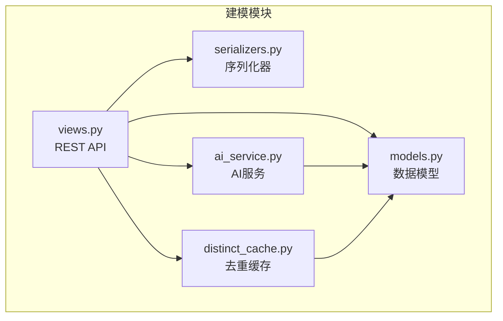
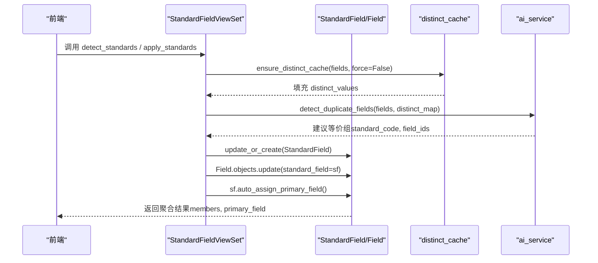
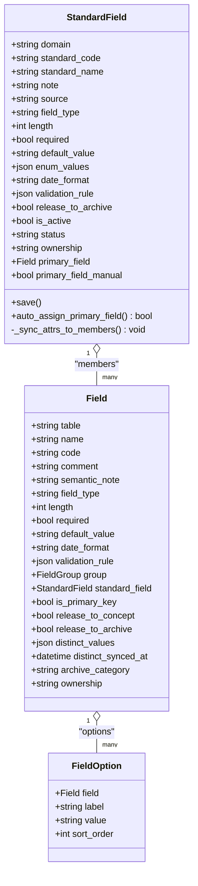
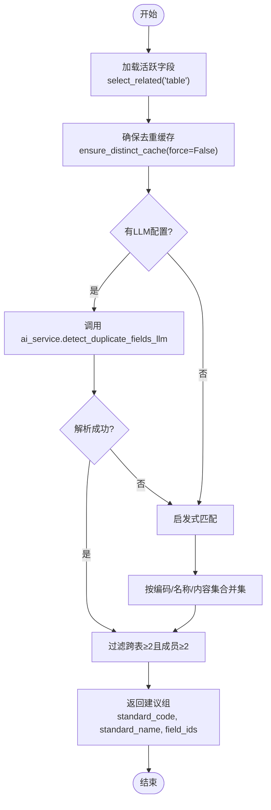
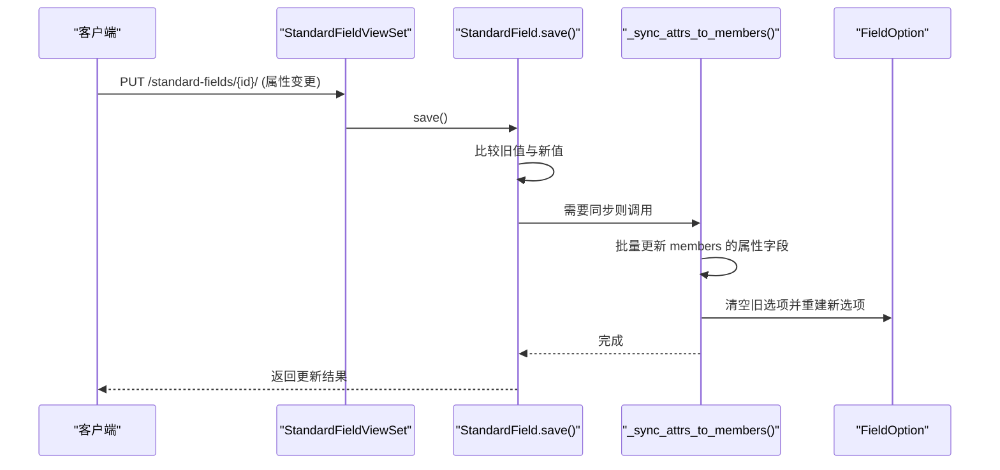
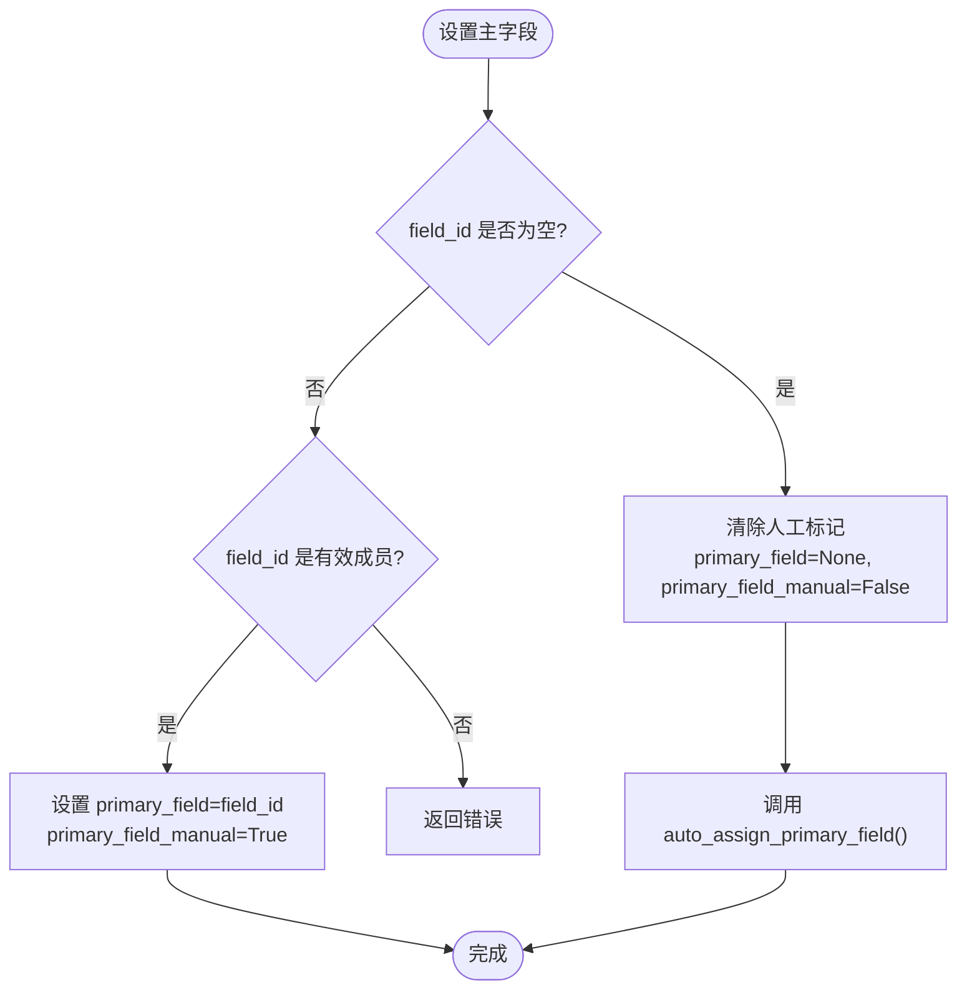
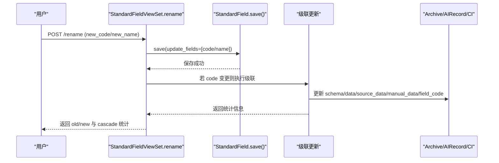
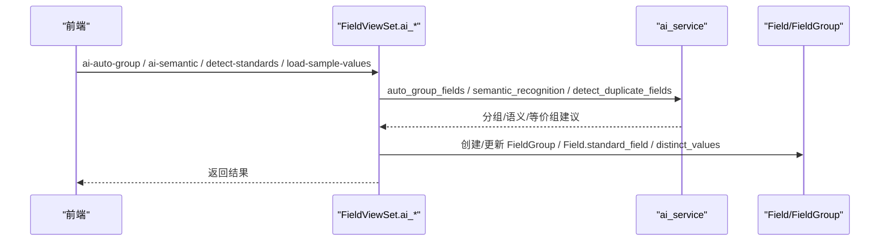
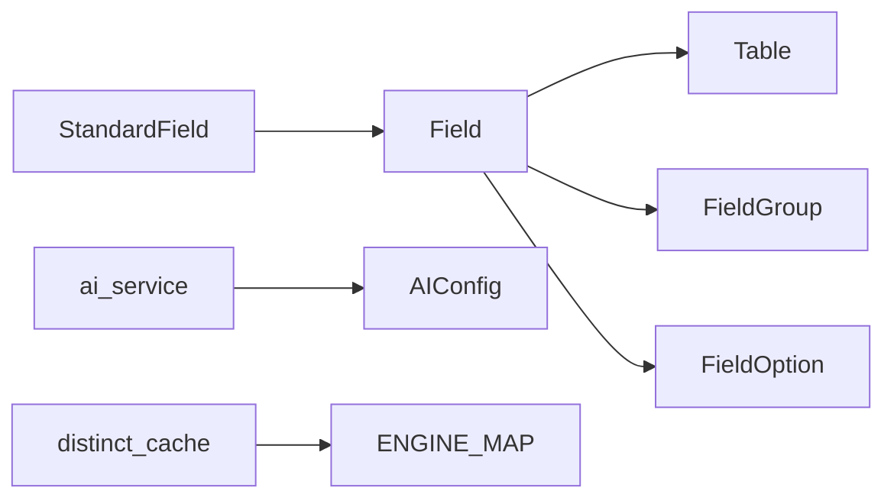

# 标准字段模型

<cite>
**本文引用的文件**   
- [models.py](file://backend/apps/modeling/models.py)
- [views.py](file://backend/apps/modeling/views.py)
- [serializers.py](file://backend/apps/modeling/serializers.py)
- [ai_service.py](file://backend/apps/modeling/ai_service.py)
- [distinct_cache.py](file://backend/apps/modeling/distinct_cache.py)
</cite>

## 目录
1. [引言](#引言)
2. [项目结构](#项目结构)
3. [核心组件](#核心组件)
4. [架构总览](#架构总览)
5. [详细组件分析](#详细组件分析)
6. [依赖关系分析](#依赖关系分析)
7. [性能考量](#性能考量)
8. [故障排查指南](#故障排查指南)
9. [结论](#结论)
10. [附录](#附录)

## 引言
本文件围绕 MetaData002 系统的“标准字段模型”进行系统化文档化，重点解释 StandardField 的核心设计理念：概念层一等公民、跨表去重机制与属性自动同步。文档覆盖以下主题：
- 概念层字段设计（StandardField）与物理字段（Field）的关系
- 跨表去重（等价组检测）与成员挂靠
- 属性配置与枚举值管理
- 主字段分配算法与人工指定标记
- 自动同步机制与变更追踪
- AI 辅助识别流程（分组、语义识别、去重检测、Excel 推断）
- 最佳实践与复杂业务场景处理方案

## 项目结构
后端建模模块位于 backend/apps/modeling，核心数据模型定义在 models.py；API 视图集中在 views.py；序列化器在 serializers.py；AI 能力封装在 ai_service.py；去重取值缓存工具在 distinct_cache.py。

图表来源
- [models.py:162-300](file://backend/apps/modeling/models.py#L162-L300)
- [views.py:1493-1778](file://backend/apps/modeling/views.py#L1493-L1778)
- [serializers.py:130-205](file://backend/apps/modeling/serializers.py#L130-L205)
- [ai_service.py:326-433](file://backend/apps/modeling/ai_service.py#L326-L433)
- [distinct_cache.py:27-122](file://backend/apps/modeling/distinct_cache.py#L27-L122)

章节来源
- [models.py:162-300](file://backend/apps/modeling/models.py#L162-L300)
- [views.py:1493-1778](file://backend/apps/modeling/views.py#L1493-L1778)
- [serializers.py:130-205](file://backend/apps/modeling/serializers.py#L130-L205)
- [ai_service.py:326-433](file://backend/apps/modeling/ai_service.py#L326-L433)
- [distinct_cache.py:27-122](file://backend/apps/modeling/distinct_cache.py#L27-L122)

## 核心组件
- StandardField（标准字段）：概念层一等公民，承载统一属性配置、分组、档案释放、质量规则等。通过 standard_code 唯一标识，跨表冗余字段归并到同一标准字段。
- Field（物理字段）：表的字段定义，保留全部物理列，通过 standard_field 外键挂靠到标准字段。
- FieldOption（枚举选项）：枚举类型的选项值，随标准字段 enum_values 同步到各成员。
- Table（实体表）、Domain（主数据域）：组织与归属上下文。
- AIConfig（AI 配置）：OpenAI 兼容接口参数与提示词模板。
- ComputedField（计算字段）：基于 Excel 风格公式推导的字段，与标准字段共同构成完整的数据模型体系。

章节来源
- [models.py:162-300](file://backend/apps/modeling/models.py#L162-L300)
- [models.py:301-385](file://backend/apps/modeling/models.py#L301-L385)
- [models.py:387-419](file://backend/apps/modeling/models.py#L387-L419)
- [models.py:421-472](file://backend/apps/modeling/models.py#L421-L472)

## 架构总览
标准字段模型贯穿“物理字段 → 概念字段 → 档案释放”的全链路：
- 物理字段（Field）：来自本地或外部数据源，支持去重取值缓存（distinct_values）。
- 概念字段（StandardField）：跨表去重后的等价组，集中维护属性与枚举。
- 档案释放：根据 StandardField.release_to_archive 与 is_active 控制是否进入档案 schema 与记录。

图表来源
- [views.py:1227-1304](file://backend/apps/modeling/views.py#L1227-L1304)
- [distinct_cache.py:100-122](file://backend/apps/modeling/distinct_cache.py#L100-L122)
- [ai_service.py:326-433](file://backend/apps/modeling/ai_service.py#L326-L433)
- [models.py:255-274](file://backend/apps/modeling/models.py#L255-L274)

## 详细组件分析

### StandardField 模型与属性同步
- 概念层属性：field_type、length、required、default_value、enum_values、date_format、validation_rule、release_to_archive、is_active、status、ownership、primary_field、primary_field_manual。
- 保存钩子：save() 中比较旧值与新值，若属性变更则触发 _sync_attrs_to_members() 批量更新所有 active 成员 Field。
- 枚举同步：enum_values 清空成员旧选项后重建 FieldOption。
- 主字段分配：auto_assign_primary_field() 优先保持人工指定；否则回退到主表成员；无主表成员则置空并清除人工标记。

图表来源
- [models.py:162-300](file://backend/apps/modeling/models.py#L162-L300)
- [models.py:301-385](file://backend/apps/modeling/models.py#L301-L385)

章节来源
- [models.py:162-300](file://backend/apps/modeling/models.py#L162-L300)
- [models.py:230-299](file://backend/apps/modeling/models.py#L230-L299)

### 跨表去重机制（等价组检测）
- 三层匹配策略：
  1) 编码归一化相似（去除下划线/空格/连字符并转小写）
  2) 名称（comment）归一化相似
  3) 去重内容集合完全相同（排序后作为 key）
- LLM 优先：若具备 OpenAI 兼容接口，使用 prompt_dedup 生成等价组；失败降级为启发式。
- 仅跨 2+ 张表且成员数 ≥2 的组才视为真正冗余。

图表来源
- [ai_service.py:326-433](file://backend/apps/modeling/ai_service.py#L326-L433)
- [distinct_cache.py:100-122](file://backend/apps/modeling/distinct_cache.py#L100-L122)

章节来源
- [ai_service.py:326-433](file://backend/apps/modeling/ai_service.py#L326-L433)
- [distinct_cache.py:100-122](file://backend/apps/modeling/distinct_cache.py#L100-L122)

### 属性配置与枚举值管理
- 属性配置集中在 StandardField，保存时自动同步到所有 active 成员 Field。
- 枚举值 enum_values 以 JSON 存储，同步时清空成员旧选项并重建 FieldOption。
- 批量更新 Field 属性通过 FieldBatchUpdateSerializer 支持，含 options 重置逻辑。

图表来源
- [models.py:230-299](file://backend/apps/modeling/models.py#L230-L299)
- [views.py:1066-1099](file://backend/apps/modeling/views.py#L1066-L1099)

章节来源
- [models.py:230-299](file://backend/apps/modeling/models.py#L230-L299)
- [views.py:1066-1099](file://backend/apps/modeling/views.py#L1066-L1099)

### 主字段分配算法与人工指定
- auto_assign_primary_field() 逻辑：
  - 当前主字段仍为 active 成员 → 不动（人工指定天然保留）
  - 当前主字段为空或失效 → 取主表成员兜底；无主表成员则置空（留待人工设置），并清除人工指定标记
- set-primary-field 端点支持：
  - 传入 field_id → 人工指定（primary_field_manual=True）
  - 传入 null → 清除人工标记，按主表成员自动重分配

图表来源
- [views.py:1566-1586](file://backend/apps/modeling/views.py#L1566-L1586)
- [models.py:255-274](file://backend/apps/modeling/models.py#L255-L274)

章节来源
- [views.py:1566-1586](file://backend/apps/modeling/views.py#L1566-L1586)
- [models.py:255-274](file://backend/apps/modeling/models.py#L255-L274)

### 自动同步机制与变更追踪
- StandardField.save() 中对比旧值与新值，若属性变更则触发 _sync_attrs_to_members() 批量更新 members。
- 主表切换时，Table.set_as_primary() 会重新校准未人工指定的主字段，使其跟随新主表成员。
- 级联改名（rename/rename_solo）会更新 Archive.schema、ArchiveRecord.data/source_data/manual_data、ConsistencyIssue.field_code。

图表来源
- [views.py:1616-1695](file://backend/apps/modeling/views.py#L1616-L1695)
- [views.py:1697-1777](file://backend/apps/modeling/views.py#L1697-L1777)
- [models.py:110-123](file://backend/apps/modeling/models.py#L110-L123)

章节来源
- [views.py:1616-1695](file://backend/apps/modeling/views.py#L1616-L1695)
- [views.py:1697-1777](file://backend/apps/modeling/views.py#L1697-L1777)
- [models.py:110-123](file://backend/apps/modeling/models.py#L110-L123)

### AI 辅助识别流程
- 自动分组：auto_group_fields() 优先 LLM，失败回退启发式（关键词聚类）。
- 语义识别：semantic_recognition() 补全注释、翻译英文注释、标注同义/歧义。
- 去重检测：detect_duplicate_fields() 三层匹配，LLM 优先。
- Excel 推断：infer_fields_from_excel() 根据样本值推断类型、长度、必填、注释。

图表来源
- [ai_service.py:171-236](file://backend/apps/modeling/ai_service.py#L171-L236)
- [ai_service.py:240-310](file://backend/apps/modeling/ai_service.py#L240-L310)
- [ai_service.py:326-433](file://backend/apps/modeling/ai_service.py#L326-L433)
- [views.py:1154-1225](file://backend/apps/modeling/views.py#L1154-L1225)
- [views.py:1420-1441](file://backend/apps/modeling/views.py#L1420-L1441)

章节来源
- [ai_service.py:171-236](file://backend/apps/modeling/ai_service.py#L171-L236)
- [ai_service.py:240-310](file://backend/apps/modeling/ai_service.py#L240-L310)
- [ai_service.py:326-433](file://backend/apps/modeling/ai_service.py#L326-L433)
- [views.py:1154-1225](file://backend/apps/modeling/views.py#L1154-L1225)
- [views.py:1420-1441](file://backend/apps/modeling/views.py#L1420-L1441)

### 标准字段聚合与独立字段展示
- standard_fields() 返回两类行：
  - kind='equiv'：标准字段聚合，携带 physical_field_ids、tables、distinct_values、primary_field 等
  - kind='solo'：独立物理字段（archive_category='base' 且未归并），携带自身属性与去重值
- 用于拖拽分组、批量更新 group、属性配置 Tab 展示。

章节来源
- [views.py:1306-1418](file://backend/apps/modeling/views.py#L1306-L1418)
- [serializers.py:166-205](file://backend/apps/modeling/serializers.py#L166-L205)

## 依赖关系分析
- StandardField 依赖 Field（members）与 FieldOption（options）
- Field 依赖 Table、FieldGroup、StandardField
- AI 服务依赖 AIConfig 与 settings 环境变量
- 去重缓存依赖数据库连接映射 ENGINE_MAP

图表来源
- [models.py:162-385](file://backend/apps/modeling/models.py#L162-L385)
- [ai_service.py:19-48](file://backend/apps/modeling/ai_service.py#L19-L48)
- [distinct_cache.py:7-13](file://backend/apps/modeling/distinct_cache.py#L7-L13)

章节来源
- [models.py:162-385](file://backend/apps/modeling/models.py#L162-L385)
- [ai_service.py:19-48](file://backend/apps/modeling/ai_service.py#L19-L48)
- [distinct_cache.py:7-13](file://backend/apps/modeling/distinct_cache.py#L7-L13)

## 性能考量
- 去重取值缓存：distinct_values 上限 100 条，按需刷新（force=False）减少查询压力。
- 批量更新：_sync_attrs_to_members() 使用 bulk update，避免 N+1 问题。
- 枚举重建：enum_values 同步时先清空再重建，避免脏数据累积。
- LLM 降级：当请求失败或未配置时，自动回退启发式算法，保证可用性。

[本节为通用指导，不直接分析具体文件]

## 故障排查指南
- 去重缓存刷新失败：检查数据源连接与 SQL 语法，确认 distinct_cache.fetch_distinct_values 异常信息。
- 主字段分配异常：确认成员状态为 active，主表 has_pk，且 auto_assign_primary_field() 被正确调用。
- 属性同步未生效：检查 StandardField.save() 中的属性差异判断与 sync_fields 列表。
- AI 服务不可用：确认 AIConfig.enabled=True 且 api_key 已配置，或回退启发式模式。

章节来源
- [distinct_cache.py:27-97](file://backend/apps/modeling/distinct_cache.py#L27-L97)
- [models.py:255-274](file://backend/apps/modeling/models.py#L255-L274)
- [models.py:230-299](file://backend/apps/modeling/models.py#L230-L299)
- [ai_service.py:19-48](file://backend/apps/modeling/ai_service.py#L19-L48)

## 结论
StandardField 作为概念层一等公民，实现了跨表去重、属性集中管理与自动同步，结合 AI 辅助识别与去重缓存，显著提升了主数据建模的效率与一致性。通过主字段分配算法与人工指定标记，系统在自动化与可控性之间取得平衡。建议在复杂业务场景中优先使用 LLM 增强识别，同时保留启发式降级保障稳定性。

[本节为总结性内容，不直接分析具体文件]

## 附录
- 最佳实践
  - 合理命名 standard_code，确保跨表一致性与可读性
  - 启用 release_to_archive 与 is_active 控制档案释放范围
  - 对组合字段明确 primary_field，必要时人工指定以避免误切换
  - 定期刷新 distinct_values，提升去重检测准确性
- 复杂场景处理
  - 多表域：配合 FieldMapping 建立表间关系，确保主键与映射完整性
  - 计算字段：使用 ComputedField 与 DAG 拓扑顺序，避免循环依赖
  - 级联改名：谨慎操作，关注 Archive/AIRecord/CI 的联动更新

[本节为补充说明，不直接分析具体文件]