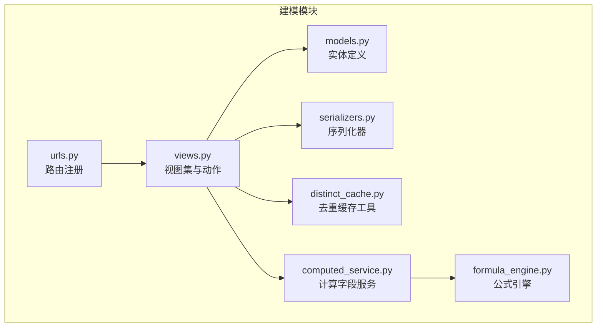
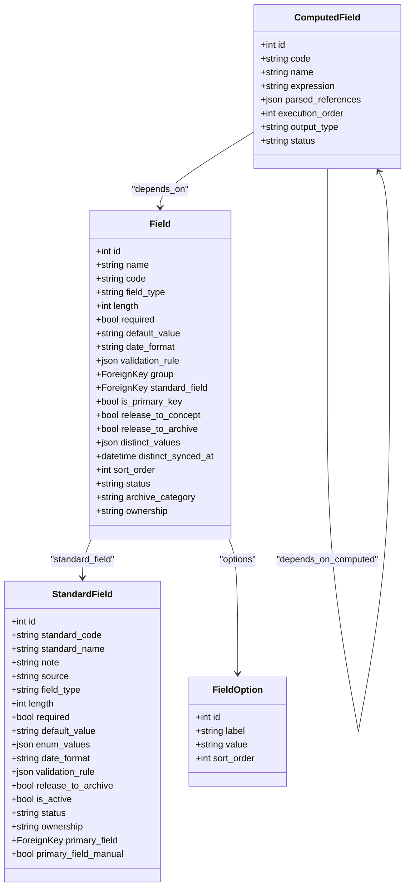
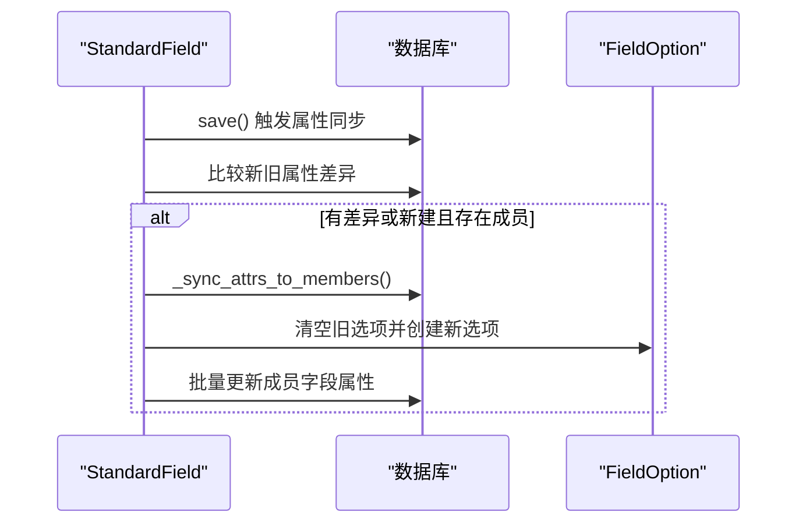
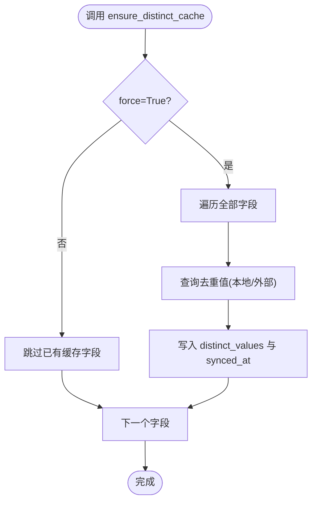
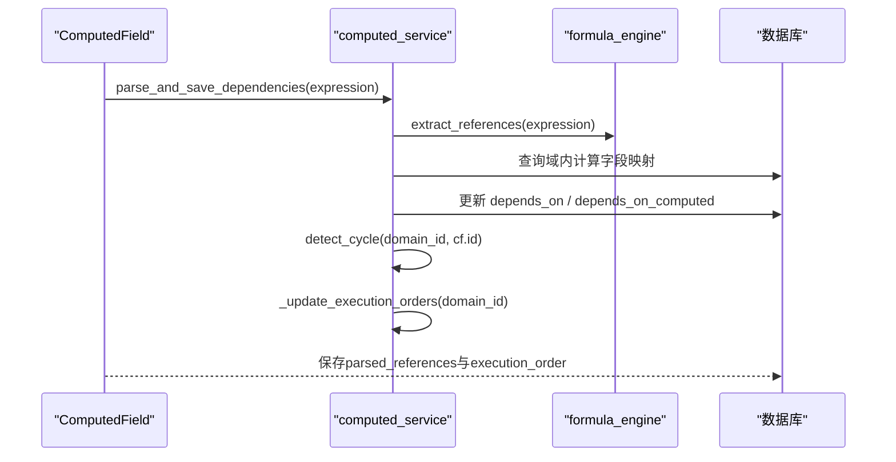
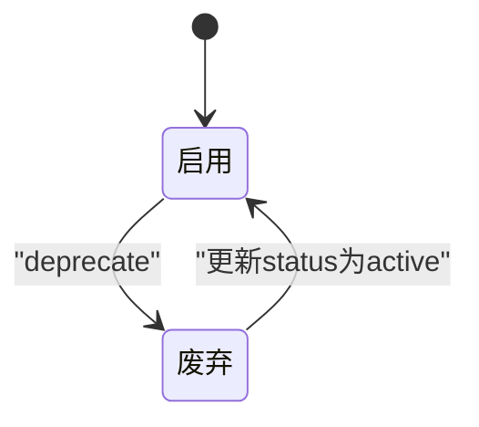
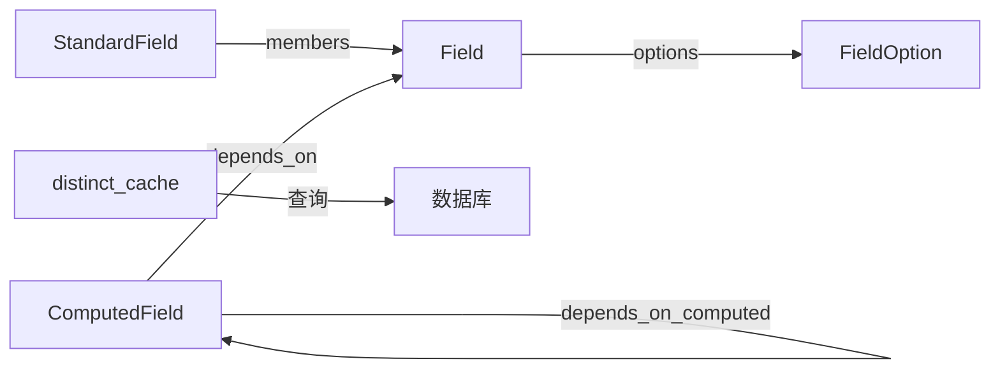

# 物理字段模型

<cite>
**本文引用的文件**   
- [models.py](file://backend/apps/modeling/models.py)
- [serializers.py](file://backend/apps/modeling/serializers.py)
- [views.py](file://backend/apps/modeling/views.py)
- [distinct_cache.py](file://backend/apps/modeling/distinct_cache.py)
- [computed_service.py](file://backend/apps/modeling/computed_service.py)
- [formula_engine.py](file://backend/apps/modeling/formula_engine.py)
- [urls.py](file://backend/apps/modeling/urls.py)
</cite>

## 目录
1. [引言](#引言)
2. [项目结构](#项目结构)
3. [核心组件](#核心组件)
4. [架构总览](#架构总览)
5. [详细组件分析](#详细组件分析)
6. [依赖关系分析](#依赖关系分析)
7. [性能考量](#性能考量)
8. [故障排查指南](#故障排查指南)
9. [结论](#结论)
10. [附录](#附录)

## 引言
本文件面向MetaData002系统的“物理字段模型”，围绕Field模型类及其相关概念（标准字段、枚举选项、去重缓存、计算字段）进行系统化说明。文档覆盖字段类型系统、状态管理、档案分类与维护方控制；字段与标准字段的关联关系；选项值管理与去重内容缓存机制；字段的CRUD操作、状态转换规则以及与计算字段的依赖关系；并提供字段管理的最佳实践与数据治理策略。

## 项目结构
建模模块采用Django REST Framework的ModelViewSet组织API，核心实体定义在models.py，序列化器在serializers.py，业务逻辑与视图在views.py，去重缓存工具独立为distinct_cache.py，计算字段服务与公式引擎分别在computed_service.py与formula_engine.py，路由注册在urls.py。

图表来源
- [models.py:1-489](file://backend/apps/modeling/models.py#L1-L489)
- [serializers.py:1-310](file://backend/apps/modeling/serializers.py#L1-L310)
- [views.py:1-2253](file://backend/apps/modeling/views.py#L1-L2253)
- [distinct_cache.py:1-122](file://backend/apps/modeling/distinct_cache.py#L1-L122)
- [computed_service.py:1-630](file://backend/apps/modeling/computed_service.py#L1-L630)
- [formula_engine.py:1-867](file://backend/apps/modeling/formula_engine.py#L1-L867)
- [urls.py:1-20](file://backend/apps/modeling/urls.py#L1-L20)

章节来源
- [models.py:1-489](file://backend/apps/modeling/models.py#L1-L489)
- [urls.py:1-20](file://backend/apps/modeling/urls.py#L1-L20)

## 核心组件
- Field：表的字段定义，承载数据类型、长度、必填、默认值、日期格式、校验规则、分组、是否主键、释放到概念层/档案、去重内容缓存、排序、状态、档案分类、维护方等属性。
- StandardField：跨表归一化的“标准字段”，作为概念层一等公民，统一属性配置并自动同步到成员物理字段；支持主字段选择与人工指定标记。
- FieldOption：枚举类型的选项值，与Field一对多关联。
- ComputedField：通过Excel风格公式从其他字段推导的计算字段，支持依赖解析、DAG拓扑排序、批量重算与试算。
- distinct_cache：提供跨数据库的去重取值采样与缓存填充能力。
- formula_engine：表达式词法/语法解析、函数库与求值器。

章节来源
- [models.py:301-385](file://backend/apps/modeling/models.py#L301-L385)
- [models.py:162-300](file://backend/apps/modeling/models.py#L162-L300)
- [models.py:369-385](file://backend/apps/modeling/models.py#L369-L385)
- [models.py:421-472](file://backend/apps/modeling/models.py#L421-L472)
- [distinct_cache.py:1-122](file://backend/apps/modeling/distinct_cache.py#L1-L122)
- [formula_engine.py:1-867](file://backend/apps/modeling/formula_engine.py#L1-L867)

## 架构总览
Field是物理层的“原子”单元，StandardField是概念层的“聚合”单元，二者通过外键建立归属关系。FieldOption为枚举扩展，ComputedField基于Field或已保存的计算字段构建依赖图，distinct_cache为字段样本值提供高效读取与缓存。

图表来源
- [models.py:301-385](file://backend/apps/modeling/models.py#L301-L385)
- [models.py:162-300](file://backend/apps/modeling/models.py#L162-L300)
- [models.py:369-385](file://backend/apps/modeling/models.py#L369-L385)
- [models.py:421-472](file://backend/apps/modeling/models.py#L421-L472)

## 详细组件分析

### Field模型设计要点
- 字段类型系统：支持字符串、数字、日期、布尔、枚举五类，配合length、date_format、validation_rule等约束。
- 状态管理：启用/废弃两种状态，废弃后不再参与常规流程。
- 档案分类：未分配、基础字段、计算字段三类，用于归档时的分类与展示。
- 维护方控制：源系统维护（档案侧只读拉取覆盖）、档案维护（档案可编辑拉取保护），仅对未归并（solo）字段生效。
- 去重内容缓存：JSON字段存储去重后的取值样本（上限100条），记录读取时间，供AI查重与试算使用。
- 与标准字段关联：通过standard_field外键挂靠，被纳入概念层统一管理。

章节来源
- [models.py:301-385](file://backend/apps/modeling/models.py#L301-L385)

### StandardField与Field的关联关系
- 标准字段作为概念层聚合，属性变更时自动同步至所有成员物理字段（field_type、length、required、default_value、date_format、validation_rule）。
- 枚举值enum_values同步到各成员的FieldOption，清空旧选项后写入新选项。
- 主字段primary_field用于档案更新的数据源头；支持自动分配（优先主表成员）与人工指定（切换主表不跟随）。

图表来源
- [models.py:230-299](file://backend/apps/modeling/models.py#L230-L299)

章节来源
- [models.py:162-300](file://backend/apps/modeling/models.py#L162-L300)

### 选项值管理（FieldOption）
- 每个枚举字段拥有多个选项，包含显示名、值、排序号。
- 标准字段属性变更时，会清空并重建成员字段的选项，保证一致性。
- 批量更新接口支持直接传入选项数组，内部执行删除与重建。

章节来源
- [models.py:369-385](file://backend/apps/modeling/models.py#L369-L385)
- [views.py:1066-1099](file://backend/apps/modeling/views.py#L1066-L1099)

### 去重内容缓存机制
- 工具函数fetch_distinct_values按本地表或外部数据源动态构造SQL，返回去重样本（上限limit=100）。
- ensure_distinct_cache按需或强制刷新缓存，记录distinct_synced_at时间戳。
- 视图提供刷新域内active字段缓存、单个字段加载样本值的接口。

图表来源
- [distinct_cache.py:27-122](file://backend/apps/modeling/distinct_cache.py#L27-L122)

章节来源
- [distinct_cache.py:1-122](file://backend/apps/modeling/distinct_cache.py#L1-L122)
- [views.py:1420-1441](file://backend/apps/modeling/views.py#L1420-L1441)

### 计算字段与依赖关系
- 表达式解析：提取{表名.字段名}引用，区分物理字段与计算字段依赖。
- DAG构建与循环检测：确保无环依赖，计算execution_order以决定重算顺序。
- 批量重算：按拓扑序遍历域内记录，计算结果写入ArchiveRecord.data。
- 试算与预览：支持参数空间枚举与截断策略，便于公式调试。

图表来源
- [computed_service.py:21-84](file://backend/apps/modeling/computed_service.py#L21-L84)
- [formula_engine.py:61-64](file://backend/apps/modeling/formula_engine.py#L61-L64)

章节来源
- [computed_service.py:1-630](file://backend/apps/modeling/computed_service.py#L1-L630)
- [formula_engine.py:1-867](file://backend/apps/modeling/formula_engine.py#L1-L867)

### 字段CRUD与状态转换
- CRUD：FieldViewSet提供列表、详情、批量保存名称、批量更新属性、作废（deprecate）等操作。
- 状态转换：启用→废弃（deprecate），废弃→恢复（通过普通更新接口将status改回active）。
- 分组与选项：支持批量更新group与options，选项重建保证与标准字段一致。
- 去重刷新：refresh-distinct与load-sample-values接口支持按需刷新样本值。

图表来源
- [views.py:1101-1107](file://backend/apps/modeling/views.py#L1101-L1107)

章节来源
- [views.py:976-1107](file://backend/apps/modeling/views.py#L976-L1107)

### 字段与标准字段的关联与主字段管理
- 应用去重建议：detect-standards返回建议组，apply-standards创建/复用StandardField并回写成员。
- 主字段设置：set-primary-field支持人工指定或清除人工标记后自动重分配。
- 成员去重值对比：members-distinct接口按需填充缓存并返回各成员样本值，便于核对一致性。

章节来源
- [views.py:1227-1304](file://backend/apps/modeling/views.py#L1227-L1304)
- [views.py:1566-1614](file://backend/apps/modeling/views.py#L1566-L1614)

### 档案分类与维护方控制
- 档案分类：archive_category用于标识基础字段、计算字段或未分配，影响归档Schema生成与展示。
- 维护方：ownership控制源系统与档案侧的读写策略，仅对未归并字段生效。

章节来源
- [models.py:301-385](file://backend/apps/modeling/models.py#L301-L385)

## 依赖关系分析
- Field与StandardField：一对多（一个标准字段对应多个成员物理字段），通过standard_field外键关联。
- Field与FieldOption：一对多，枚举选项由FieldOption承载。
- ComputedField与Field/ComputedField：多对多，depends_on与depends_on_computed分别指向物理字段与其他计算字段。
- distinct_cache与数据库：根据表类型（本地/外部）动态连接并执行去重查询。

图表来源
- [models.py:162-300](file://backend/apps/modeling/models.py#L162-L300)
- [models.py:301-385](file://backend/apps/modeling/models.py#L301-L385)
- [models.py:421-472](file://backend/apps/modeling/models.py#L421-L472)
- [distinct_cache.py:1-122](file://backend/apps/modeling/distinct_cache.py#L1-L122)

章节来源
- [models.py:162-472](file://backend/apps/modeling/models.py#L162-L472)
- [distinct_cache.py:1-122](file://backend/apps/modeling/distinct_cache.py#L1-L122)

## 性能考量
- 去重缓存：避免频繁查询大表，限制样本数量（100条），支持按需与强制刷新。
- 批量操作：批量更新属性与选项，减少往返次数。
- 依赖解析：仅在表达式变更时重新解析并更新execution_order，降低开销。
- 外部数据源：动态连接与临时别名，避免连接泄漏。

[本节为通用指导，无需特定文件引用]

## 故障排查指南
- 去重缓存为空：检查distinct_synced_at是否为空，调用refresh-distinct或load-sample-values刷新。
- 标准字段不同步：确认save钩子是否触发，检查属性差异字段是否在同步列表中。
- 计算字段循环依赖：使用validate-formula接口检测，查看cycle路径并调整表达式。
- 外部数据源连接失败：检查db_type与驱动配置，确认schema与表名正确。

章节来源
- [distinct_cache.py:100-122](file://backend/apps/modeling/distinct_cache.py#L100-L122)
- [computed_service.py:110-161](file://backend/apps/modeling/computed_service.py#L110-L161)
- [views.py:1958-2010](file://backend/apps/modeling/views.py#L1958-L2010)

## 结论
Field模型在MetaData002中承担物理字段的核心职责，结合StandardField实现概念层统一治理，辅以FieldOption与distinct_cache完善枚举与样本值管理，并通过ComputedField与formula_engine支撑复杂计算。通过清晰的CRUD与状态转换、严格的依赖解析与DAG调度，系统实现了高可用、可扩展的字段管理能力。遵循本文的最佳实践与数据治理策略，可有效提升字段质量与一致性。

[本节为总结性内容，无需特定文件引用]

## 附录
- API路由：见urls.py注册的各ViewSet，涵盖数据源、域、表、字段、分组、选项、映射、标准字段、AI配置、计算字段等。
- 序列化器：FieldListSerializer、StandardFieldSerializer、ComputedFieldSerializer等提供统一的输入输出结构。

章节来源
- [urls.py:1-20](file://backend/apps/modeling/urls.py#L1-L20)
- [serializers.py:1-310](file://backend/apps/modeling/serializers.py#L1-L310)