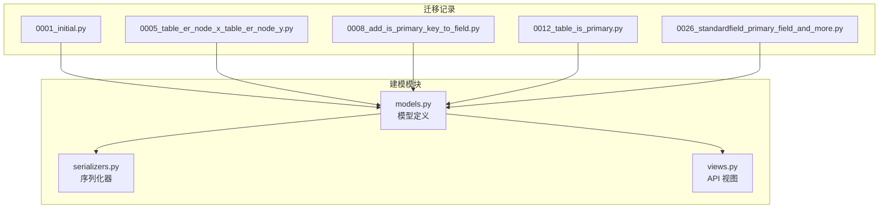
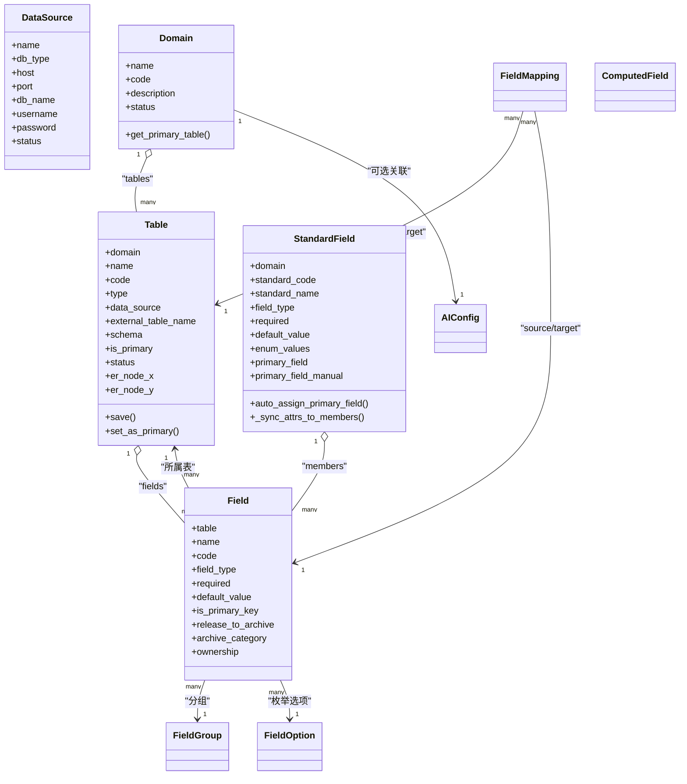
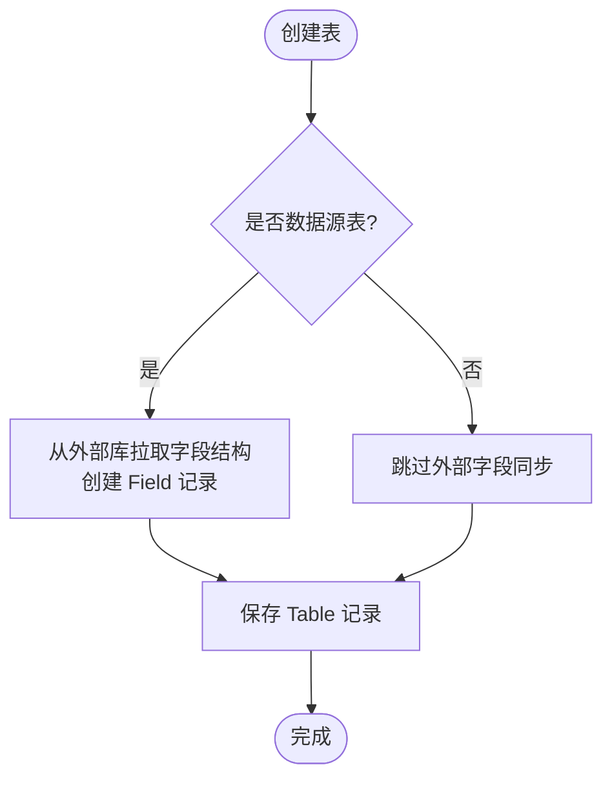
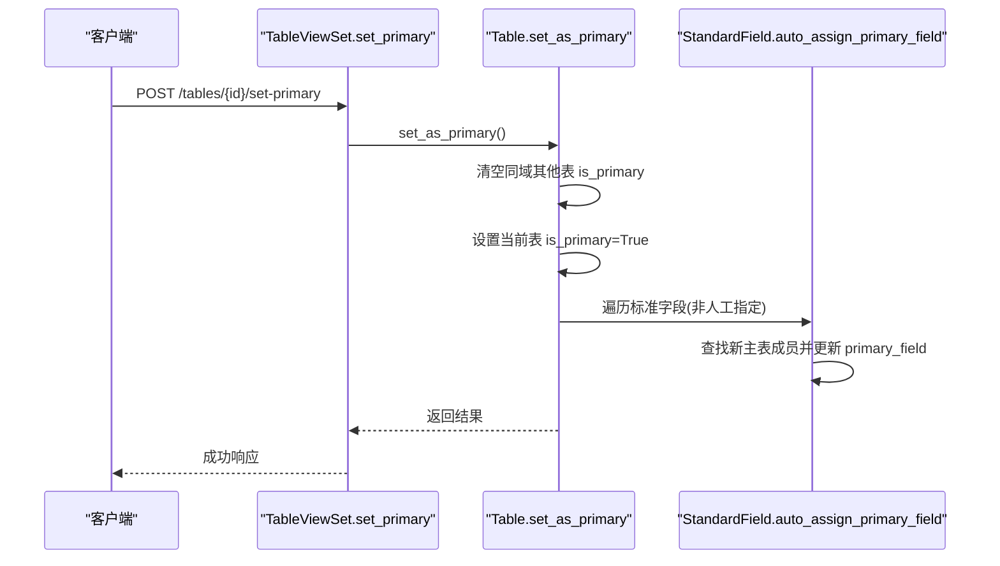
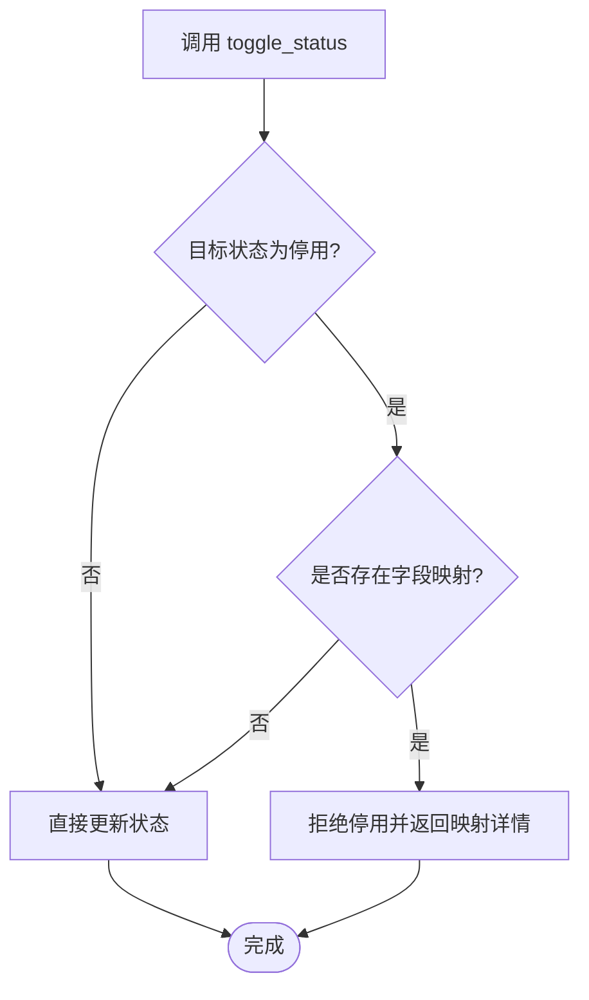
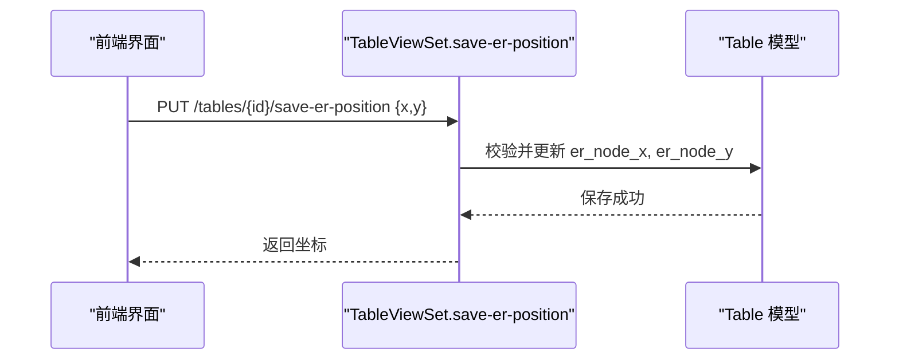
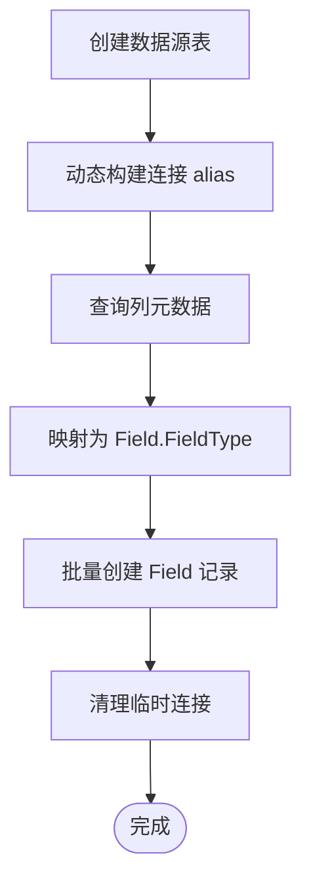
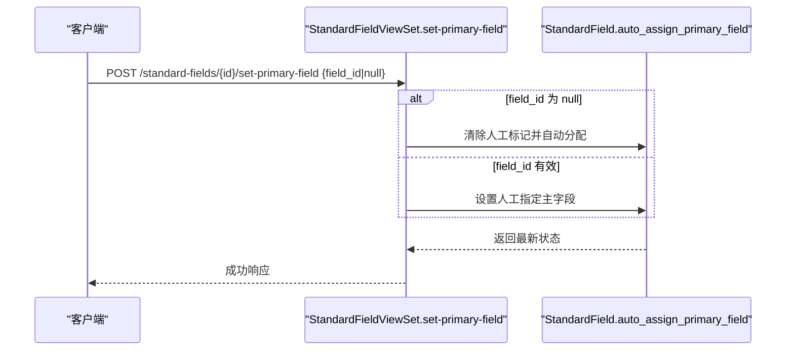
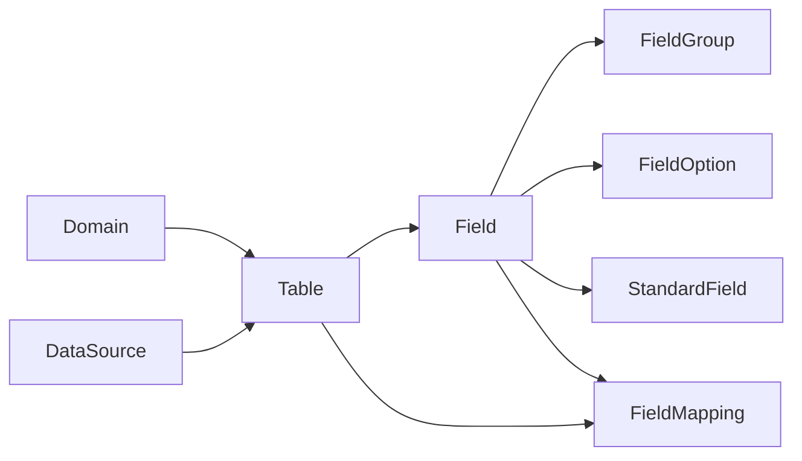

# 表模型

<cite>
**本文引用的文件**   
- [models.py](file://backend/apps/modeling/models.py)
- [serializers.py](file://backend/apps/modeling/serializers.py)
- [views.py](file://backend/apps/modeling/views.py)
- [0001_initial.py](file://backend/apps/modeling/migrations/0001_initial.py)
- [0005_table_er_node_x_table_er_node_y.py](file://backend/apps/modeling/migrations/0005_table_er_node_x_table_er_node_y.py)
- [0008_add_is_primary_key_to_field.py](file://backend/apps/modeling/migrations/0008_add_is_primary_key_to_field.py)
- [0012_table_is_primary.py](file://backend/apps/modeling/migrations/0012_table_is_primary.py)
- [0026_standardfield_primary_field_and_more.py](file://backend/apps/modeling/migrations/0026_standardfield_primary_field_and_more.py)
</cite>

## 目录
1. [简介](#简介)
2. [项目结构](#项目结构)
3. [核心组件](#核心组件)
4. [架构总览](#架构总览)
5. [详细组件分析](#详细组件分析)
6. [依赖关系分析](#依赖关系分析)
7. [性能考量](#性能考量)
8. [故障排查指南](#故障排查指南)
9. [结论](#结论)
10. [附录](#附录)

## 简介
本文件围绕 MetaData002 系统的“表模型”进行系统化文档化，重点解释 Table 模型类的设计与约束、本地表与外部数据源表的区分机制、主表标识与切换逻辑、ER 图坐标存储、字段主字段的跟随机制，以及表状态的生命周期与业务规则。同时提供表管理的最佳实践与复杂场景处理方案，帮助读者在建模、归档与跨系统对接中正确运用该模型。

## 项目结构
- 建模模块位于 backend/apps/modeling，核心模型定义在 models.py，序列化器在 serializers.py，API 视图在 views.py。
- 迁移文件记录了表模型的演进：初始建表、主键标记、主表标识、ER 坐标、标准字段主字段等。

**图表来源** 
- [models.py:1-489](file://backend/apps/modeling/models.py#L1-L489)
- [serializers.py:1-310](file://backend/apps/modeling/serializers.py#L1-L310)
- [views.py:1-800](file://backend/apps/modeling/views.py#L1-L800)
- [0001_initial.py:1-127](file://backend/apps/modeling/migrations/0001_initial.py#L1-L127)
- [0005_table_er_node_x_table_er_node_y.py:1-22](file://backend/apps/modeling/migrations/0005_table_er_node_x_table_er_node_y.py#L1-L22)
- [0008_add_is_primary_key_to_field.py:1-19](file://backend/apps/modeling/migrations/0008_add_is_primary_key_to_field.py#L1-L19)
- [0012_table_is_primary.py:1-19](file://backend/apps/modeling/migrations/0012_table_is_primary.py#L1-L19)
- [0026_standardfield_primary_field_and_more.py:1-40](file://backend/apps/modeling/migrations/0026_standardfield_primary_field_and_more.py#L1-L40)

**章节来源**
- [models.py:1-489](file://backend/apps/modeling/models.py#L1-L489)
- [serializers.py:1-310](file://backend/apps/modeling/serializers.py#L1-L310)
- [views.py:1-800](file://backend/apps/modeling/views.py#L1-L800)

## 核心组件
- DataSource：数据源配置（系统设置），用于连接外部数据库。
- Domain：主数据域，聚合其下的表集合，并提供获取主表的方法。
- Table：实体表，支持本地表与外部数据源表两种类型，包含主表标识、ER 坐标、状态等。
- Field：物理字段，归属某张表，具备类型、必填、默认值、分组、是否主键、释放到档案等属性。
- StandardField：概念层标准字段，跨表去重后的统一抽象，承载属性配置并自动同步到成员物理字段。
- FieldGroup：字段分组（支持多层嵌套）。
- FieldOption：枚举选项。
- FieldMapping：表间字段映射关系（通过字段映射实现表关系）。
- ComputedField：计算字段（基于 Excel 风格公式推导）。
- AIConfig：AI 服务配置（单例）。

**章节来源**
- [models.py:1-489](file://backend/apps/modeling/models.py#L1-L489)

## 架构总览
Table 模型处于建模体系的核心位置，向上支撑领域（Domain）的主表选择与归档策略，向下驱动字段（Field）的元数据与释放到档案的规则；对外通过 API 暴露创建、预览、状态切换、ER 坐标保存等操作。

**图表来源** 
- [models.py:1-489](file://backend/apps/modeling/models.py#L1-L489)

**章节来源**
- [models.py:1-489](file://backend/apps/modeling/models.py#L1-L489)

## 详细组件分析

### Table 模型设计与约束
- 表类型区分：
  - LOCAL：本地数据表（无 data_source 关联）。
  - SOURCE：外部数据源表（必须关联 data_source）。
  - save() 中强制：存在 data_source 时 type=SOURCE；否则 type=LOCAL。
- 主表标识：
  - is_primary：每个域只能有一个主表。
  - set_as_primary()：将当前表设为主表，并取消同域其他表的主表标识；随后触发标准字段主字段自动跟随新主表成员（人工指定不动）。
- ER 图坐标：
  - er_node_x、er_node_y：持久化 ER 图中节点位置，支持保存与批量重置。
- 数据源关联：
  - data_source：外键指向 DataSource。
  - external_table_name、schema：外部表名与模式（如 public/dbo/用户模式）。
- 状态生命周期：
  - ACTIVE/DEPRECATED：停用前检查是否存在字段映射，若存在则阻止停用。
- 创建流程增强：
  - perform_create()：当为数据源表且指定 external_table_name 时，自动从外部库拉取字段结构并创建 Field 记录。

**图表来源** 
- [views.py:522-535](file://backend/apps/modeling/views.py#L522-L535)
- [views.py:536-660](file://backend/apps/modeling/views.py#L536-L660)

**章节来源**
- [models.py:60-123](file://backend/apps/modeling/models.py#L60-L123)
- [views.py:522-535](file://backend/apps/modeling/views.py#L522-L535)
- [views.py:536-660](file://backend/apps/modeling/views.py#L536-L660)
- [views.py:681-721](file://backend/apps/modeling/views.py#L681-L721)

### 主表切换与主字段跟随机制
- 主表切换：
  - set_as_primary() 会先清空同域其他表的主表标识，再设置当前表为主表。
- 主字段跟随：
  - 对 StandardField 中未人工指定（primary_field_manual=False）的成员，自动将 primary_field 切换到新主表的对应成员（若存在）。
  - auto_assign_primary_field() 负责校准：若当前主字段失效或为空，则按主表成员兜底；若无主表成员则置空并清除人工标记。

**图表来源** 
- [models.py:110-123](file://backend/apps/modeling/models.py#L110-L123)
- [models.py:255-274](file://backend/apps/modeling/models.py#L255-L274)
- [views.py:911-916](file://backend/apps/modeling/views.py#L911-L916)

**章节来源**
- [models.py:110-123](file://backend/apps/modeling/models.py#L110-L123)
- [models.py:255-274](file://backend/apps/modeling/models.py#L255-L274)
- [views.py:911-916](file://backend/apps/modeling/views.py#L911-L916)

### 表状态生命周期与业务规则
- 启用/停用：
  - toggle_status()：停用前检查是否存在字段映射（作为源表或目标表），若有则拒绝停用并返回相关映射信息。
- 主键与关系：
  - pk-status：检查域下各表的主键配置与关系配置状态，辅助确认是否可启用。
- 域级配置完整性检查：
  - check-config：P0/P1/P2 级别检查项，包括主表、主键、字段编码唯一性、组合字段主字段、数据源表关联、多表关系映射等。

**图表来源** 
- [views.py:690-721](file://backend/apps/modeling/views.py#L690-L721)
- [views.py:470-502](file://backend/apps/modeling/views.py#L470-L502)
- [views.py:327-427](file://backend/apps/modeling/views.py#L327-L427)

**章节来源**
- [views.py:690-721](file://backend/apps/modeling/views.py#L690-L721)
- [views.py:470-502](file://backend/apps/modeling/views.py#L470-L502)
- [views.py:327-427](file://backend/apps/modeling/views.py#L327-L427)

### ER 图坐标存储与操作
- 保存坐标：
  - save-er-position：接收 x、y 整数坐标，校验后写入 Table 记录。
- 批量重置：
  - batch-reset-er-position：清空某域下所有表的 ER 坐标，便于重新布局。

**图表来源** 
- [views.py:886-900](file://backend/apps/modeling/views.py#L886-L900)
- [views.py:902-909](file://backend/apps/modeling/views.py#L902-L909)

**章节来源**
- [views.py:886-900](file://backend/apps/modeling/views.py#L886-L900)
- [views.py:902-909](file://backend/apps/modeling/views.py#L902-L909)

### 数据源表字段同步与类型映射
- 创建数据源表时自动同步字段结构：
  - _sync_external_table_fields()：根据 db_type 查询 information_schema 或系统视图，提取列名、类型、长度、可空、注释等信息，映射为 Field.FieldType 并创建 Field 记录。
- 类型映射：
  - _map_db_type()：将不同数据库的类型字符串映射为统一的 string/number/date/boolean。

**图表来源** 
- [views.py:536-660](file://backend/apps/modeling/views.py#L536-L660)
- [views.py:661-679](file://backend/apps/modeling/views.py#L661-L679)

**章节来源**
- [views.py:536-660](file://backend/apps/modeling/views.py#L536-L660)
- [views.py:661-679](file://backend/apps/modeling/views.py#L661-L679)

### 标准字段主字段与成员管理
- 主字段设置：
  - set-primary-field：支持人工指定主字段（保留人工标记）或清除人工标记后自动按主表成员分配。
- 成员变更：
  - add-member/remove-member：添加/移除成员后自动校准主字段。
- 属性同步：
  - _sync_attrs_to_members()：标准字段属性变更时批量同步到成员物理字段（含枚举选项同步）。

**图表来源** 
- [views.py:1566-1586](file://backend/apps/modeling/views.py#L1566-L1586)
- [models.py:255-274](file://backend/apps/modeling/models.py#L255-L274)
- [models.py:276-299](file://backend/apps/modeling/models.py#L276-L299)

**章节来源**
- [views.py:1566-1586](file://backend/apps/modeling/views.py#L1566-L1586)
- [models.py:255-274](file://backend/apps/modeling/models.py#L255-L274)
- [models.py:276-299](file://backend/apps/modeling/models.py#L276-L299)

## 依赖关系分析
- Table 依赖 Domain、DataSource、Field、FieldMapping。
- StandardField 依赖 Field（成员）、Domain。
- Field 依赖 Table、FieldGroup、FieldOption、StandardField。
- 视图层通过 serializers 暴露 API，并在 perform_create/update 中执行业务逻辑（如外部字段同步、状态切换校验）。

**图表来源** 
- [models.py:1-489](file://backend/apps/modeling/models.py#L1-L489)

**章节来源**
- [models.py:1-489](file://backend/apps/modeling/models.py#L1-L489)

## 性能考量
- 外部字段同步：
  - 创建数据源表时执行跨库查询，建议控制并发与重试，避免阻塞请求。
- 主字段自动分配：
  - auto_assign_primary_field() 使用批量 update，减少 N+1 查询。
- 去重缓存：
  - distinct_values 缓存降低重复采样成本，刷新接口支持强制重查。
- ER 坐标批量重置：
  - 使用 bulk update 提升效率。

[本节为通用指导，不直接分析具体文件]

## 故障排查指南
- 停用失败：
  - 检查是否存在字段映射（source_mappings/target_mappings），需先解除映射。
- 主字段未跟随：
  - 确认 standard_field.primary_field_manual 是否为 True；若为 True 则不会自动跟随。
- 外部字段同步失败：
  - 检查数据源连接参数、schema 是否正确；查看日志中的警告信息。
- ER 坐标无效：
  - 确保传入 x、y 为整数；若批量重置无效，检查 domain 参数。

**章节来源**
- [views.py:690-721](file://backend/apps/modeling/views.py#L690-L721)
- [views.py:886-900](file://backend/apps/modeling/views.py#L886-L900)
- [views.py:522-535](file://backend/apps/modeling/views.py#L522-L535)

## 结论
Table 模型在 MetaData002 系统中承担核心角色，通过严格的类型约束、主表标识与状态管理，结合标准字段的主字段跟随机制，实现了灵活的建模与稳定的归档能力。配合 ER 坐标持久化与外部数据源字段同步，系统在可视化与跨系统集成方面具备良好扩展性。遵循本文的最佳实践与故障排查建议，可有效提升建模质量与运维稳定性。

[本节为总结，不直接分析具体文件]

## 附录
- 迁移要点回顾：
  - 0001_initial.py：初始建表（Domain/Table/Field/FieldGroup/FieldOption/FieldMapping）。
  - 0005_table_er_node_x_table_er_node_y.py：增加 ER 坐标字段。
  - 0008_add_is_primary_key_to_field.py：增加 Field.is_primary_key。
  - 0012_table_is_primary.py：增加 Table.is_primary。
  - 0026_standardfield_primary_field_and_more.py：增加 StandardField.primary_field 与 primary_field_manual，并回填默认主字段。

**章节来源**
- [0001_initial.py:1-127](file://backend/apps/modeling/migrations/0001_initial.py#L1-L127)
- [0005_table_er_node_x_table_er_node_y.py:1-22](file://backend/apps/modeling/migrations/0005_table_er_node_x_table_er_node_y.py#L1-L22)
- [0008_add_is_primary_key_to_field.py:1-19](file://backend/apps/modeling/migrations/0008_add_is_primary_key_to_field.py#L1-L19)
- [0012_table_is_primary.py:1-19](file://backend/apps/modeling/migrations/0012_table_is_primary.py#L1-L19)
- [0026_standardfield_primary_field_and_more.py:1-40](file://backend/apps/modeling/migrations/0026_standardfield_primary_field_and_more.py#L1-L40)