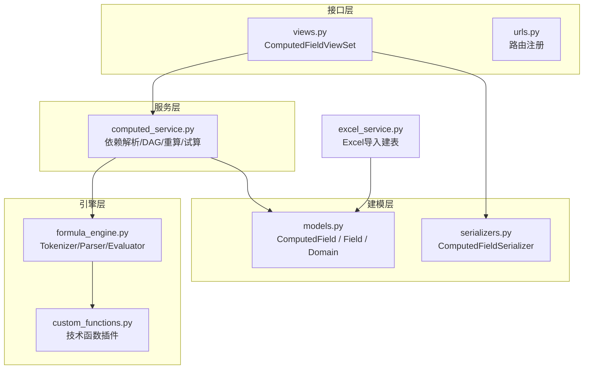
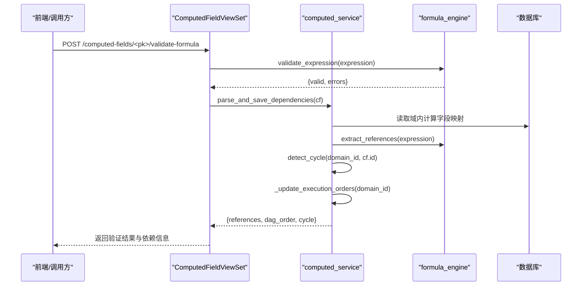
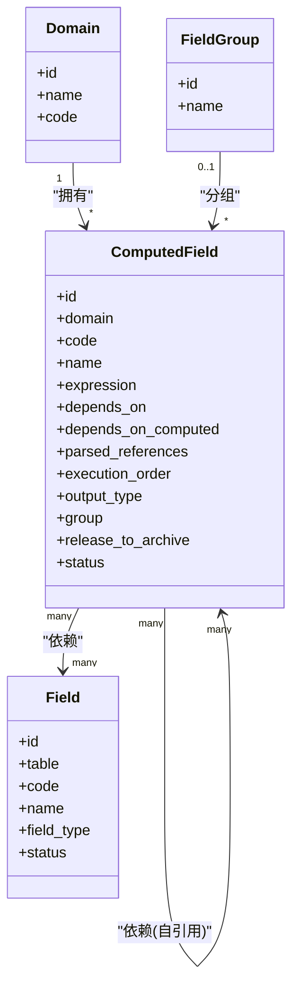
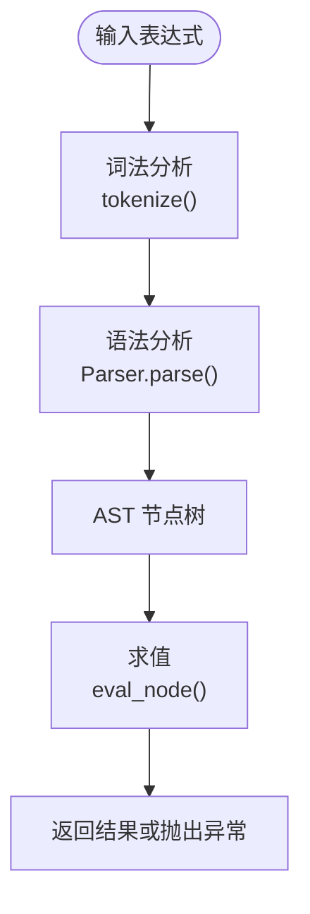
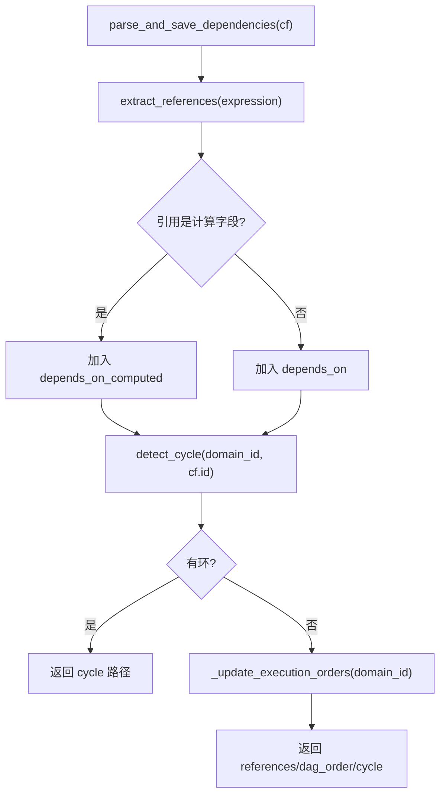
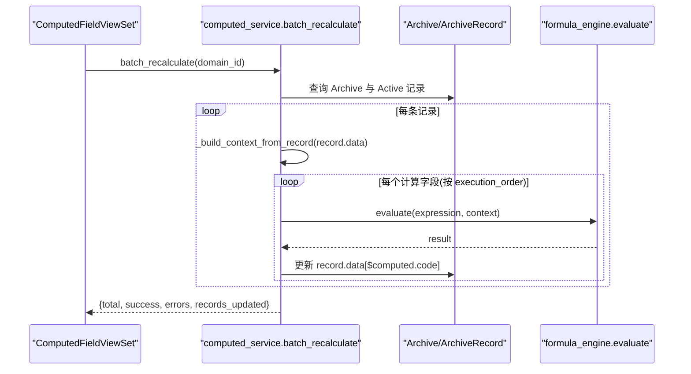
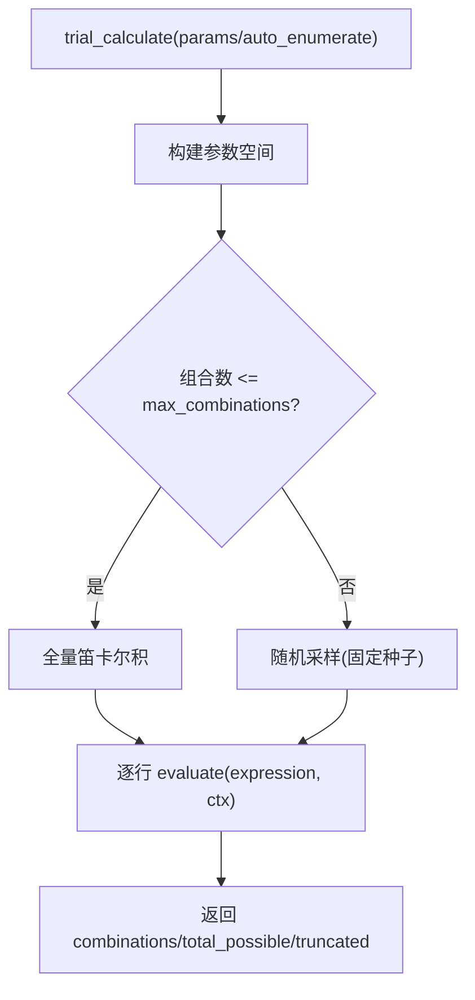
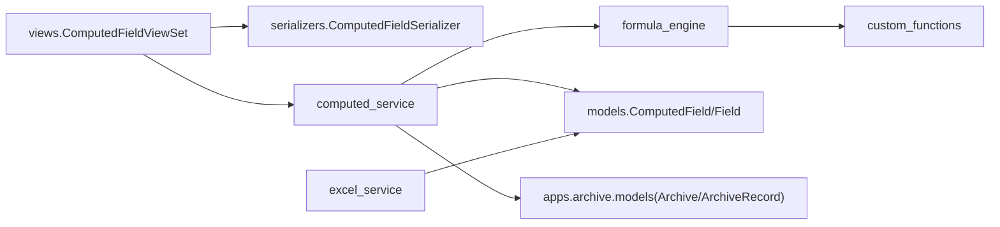

# 计算字段模型

<cite>
**本文引用的文件**   
- [models.py](file://backend/apps/modeling/models.py)
- [computed_service.py](file://backend/apps/modeling/computed_service.py)
- [formula_engine.py](file://backend/apps/modeling/formula_engine.py)
- [custom_functions.py](file://backend/apps/modeling/custom_functions.py)
- [serializers.py](file://backend/apps/modeling/serializers.py)
- [views.py](file://backend/apps/modeling/views.py)
- [urls.py](file://backend/apps/modeling/urls.py)
- [excel_service.py](file://backend/apps/modeling/excel_service.py)
- [0020_add_computed_field_and_standard_field_status.py](file://backend/apps/modeling/migrations/0020_add_computed_field_and_standard_field_status.py)
- [0021_computed_field_engine_extension.py](file://backend/apps/modeling/migrations/0021_computed_field_engine_extension.py)
</cite>

## 目录
1. [简介](#简介)
2. [项目结构](#项目结构)
3. [核心组件](#核心组件)
4. [架构总览](#架构总览)
5. [详细组件分析](#详细组件分析)
6. [依赖关系分析](#依赖关系分析)
7. [性能考量](#性能考量)
8. [故障排查指南](#故障排查指南)
9. [结论](#结论)
10. [附录](#附录)

## 简介
本文件为 MetaData002 系统的“计算字段”模型与能力提供系统化文档。重点覆盖：
- ComputedField 模型设计与字段语义
- Excel 风格公式语法、解析与求值机制
- 依赖解析与 DAG 构建、循环检测与执行顺序确定
- 批量重算与增量受影响字段重算
- CRUD 接口、状态管理与与基础字段的关联
- 最佳实践与性能优化策略

## 项目结构
计算字段相关代码集中在 backend/apps/modeling 下，关键文件职责如下：
- models.py：定义 ComputedField 及其与 Domain、Field、FieldGroup 的关系
- formula_engine.py：Excel 风格表达式词法/语法解析、函数库与求值器
- computed_service.py：依赖解析、DAG 构建、拓扑排序、批量重算、试算与预览
- custom_functions.py：技术函数插件注册入口（扩展公式函数）
- serializers.py：ComputedField 序列化器，含依赖图输出
- views.py：ComputedFieldViewSet 提供 CRUD、验证、预览、生成公式、批量重算等 API
- urls.py：路由注册 computed-fields
- excel_service.py：Excel 导入建表（为计算字段提供物理字段来源）
- migrations：计算字段模型的演进（增加 depends_on_computed、execution_order、parsed_references、output_type 等）

图表来源
- [models.py:421-472](file://backend/apps/modeling/models.py#L421-L472)
- [formula_engine.py:1-120](file://backend/apps/modeling/formula_engine.py#L1-L120)
- [computed_service.py:21-108](file://backend/apps/modeling/computed_service.py#L21-L108)
- [serializers.py:281-310](file://backend/apps/modeling/serializers.py#L281-L310)
- [views.py:1882-2253](file://backend/apps/modeling/views.py#L1882-L2253)
- [urls.py:1-20](file://backend/apps/modeling/urls.py#L1-L20)
- [excel_service.py:1-156](file://backend/apps/modeling/excel_service.py#L1-L156)

章节来源
- [models.py:421-472](file://backend/apps/modeling/models.py#L421-L472)
- [urls.py:1-20](file://backend/apps/modeling/urls.py#L1-L20)

## 核心组件
- ComputedField 模型
  - 关键字段：domain、code、name、expression、depends_on（物理字段）、depends_on_computed（其他计算字段）、parsed_references、execution_order、output_type、group、release_to_archive、status
  - 约束：(domain, code) 唯一；按 execution_order、code、id 排序
- 公式引擎
  - 支持 {表名.字段名} 引用语法、常见运算符、括号、字符串、数字、布尔
  - 内置函数：逻辑、文本、数学、判空、日期等；支持 IFERROR 惰性求值
  - 自定义函数通过 @register_function 注册，统一纳入校验与求值
- 计算服务
  - 依赖解析：从表达式提取引用，区分物理字段与计算字段依赖
  - 循环检测：基于 DFS 的环检测，返回路径
  - DAG 与拓扑排序：Kahn 算法确定 execution_order
  - 批量重算：按 execution_order 遍历记录，更新 ArchiveRecord.data
  - 试算与预览：笛卡尔积采样 + 错误收集

章节来源
- [models.py:421-472](file://backend/apps/modeling/models.py#L421-L472)
- [formula_engine.py:1-120](file://backend/apps/modeling/formula_engine.py#L1-L120)
- [computed_service.py:21-108](file://backend/apps/modeling/computed_service.py#L21-L108)

## 架构总览
计算字段从“表达式 → 依赖解析 → DAG → 执行顺序 → 求值”的全链路如下：

图表来源
- [views.py:1958-2010](file://backend/apps/modeling/views.py#L1958-L2010)
- [computed_service.py:21-85](file://backend/apps/modeling/computed_service.py#L21-L85)
- [formula_engine.py:775-796](file://backend/apps/modeling/formula_engine.py#L775-L796)

## 详细组件分析

### ComputedField 模型设计
- 字段说明
  - expression：Excel 风格公式，如 IF({表名.字段名}="A","是","否")
  - depends_on：依赖的物理字段（多对多）
  - depends_on_computed：依赖的其他计算字段（自引用，非对称）
  - parsed_references：解析后的引用列表 JSON
  - execution_order：DAG 拓扑排序位次，用于批量重算顺序
  - output_type：输出类型（text/number/date/boolean）
  - group：分组归属
  - release_to_archive：是否释放到档案
  - status：启用/废弃
- 关系
  - 属于 Domain
  - 可归属于 FieldGroup
  - 与 Field 存在双向依赖（depends_on 与 computed_dependents）
  - 与自身存在反向依赖（computed_dependents_reverse）

图表来源
- [models.py:421-472](file://backend/apps/modeling/models.py#L421-L472)

章节来源
- [models.py:421-472](file://backend/apps/modeling/models.py#L421-L472)
- [0021_computed_field_engine_extension.py:1-48](file://backend/apps/modeling/migrations/0021_computed_field_engine_extension.py#L1-L48)

### 公式引擎与 Excel 风格语法
- 语法要点
  - 引用：{表名.字段名}
  - 函数：FUNC_NAME(arg1, arg2, ...)
  - 运算符：+,-,*,/,>,<,>=,<=,=,<>,&(文本拼接)
  - 常量：数字、字符串、布尔
- 解析流程
  - tokenize：词法分析，识别 Token（NUMBER/STRING/BOOL/REF/FUNC/OPERATOR/...）
  - Parser：递归下降，产出 AST（Number/String/Bool/Ref/BinaryOp/FuncCall/UnaryMinus）
  - evaluate：递归求值，支持 IFERROR 惰性求值
- 内置函数类别
  - 逻辑：IF、AND、OR、NOT、IFS、SWITCH、IFERROR
  - 文本：CONCAT、LEFT、RIGHT、MID、LEN、TRIM、UPPER、LOWER、SUBSTITUTE
  - 数学：ABS、ROUND、CEILING、FLOOR、MOD、MAX、MIN
  - 判空：ISBLANK、ISNA、ISNUMBER、ISTEXT
  - 日期：TODAY、YEAR、MONTH、DAY、DATEDIF
- 自定义函数
  - 使用 @register_function 装饰器注册，category 固定为“技术函数”
  - 统一参与语法校验、参数个数校验、求值执行与函数清单展示

图表来源
- [formula_engine.py:99-197](file://backend/apps/modeling/formula_engine.py#L99-L197)
- [formula_engine.py:253-366](file://backend/apps/modeling/formula_engine.py#L253-L366)
- [formula_engine.py:669-796](file://backend/apps/modeling/formula_engine.py#L669-L796)

章节来源
- [formula_engine.py:1-120](file://backend/apps/modeling/formula_engine.py#L1-L120)
- [custom_functions.py:1-108](file://backend/apps/modeling/custom_functions.py#L1-L108)

### 依赖解析与 DAG 执行顺序
- 依赖解析
  - 从表达式中提取引用 extract_references
  - 区分物理字段与计算字段依赖（若 field_code 匹配域内计算字段 code，则视为计算字段依赖）
  - 更新 depends_on、depends_on_computed、parsed_references
- 循环检测
  - 基于 DFS 的三色标记法检测环，返回环路径（如 ["A","B","C","A"]）
- 拓扑排序
  - Kahn 算法计算入度，得到执行顺序 topo_order
  - 批量更新 ComputedField.execution_order
- 影响范围
  - 任一计算字段表达式变更，将触发域内所有计算字段的 execution_order 重算

图表来源
- [computed_service.py:21-85](file://backend/apps/modeling/computed_service.py#L21-L85)
- [computed_service.py:110-162](file://backend/apps/modeling/computed_service.py#L110-L162)
- [computed_service.py:164-208](file://backend/apps/modeling/computed_service.py#L164-L208)

章节来源
- [computed_service.py:21-85](file://backend/apps/modeling/computed_service.py#L21-L85)
- [computed_service.py:110-162](file://backend/apps/modeling/computed_service.py#L110-L162)
- [computed_service.py:164-208](file://backend/apps/modeling/computed_service.py#L164-L208)

### 批量重算与受影响字段重算
- 批量重算 batch_recalculate
  - 获取域内启用的计算字段（release_to_archive=True），按 execution_order 排序
  - 对每条 ArchiveRecord 构建上下文 context（表名.字段码→值），逐字段 evaluate
  - 将计算结果写入 record.data，并追加 $computed.code 供后续字段引用
  - 统计 total/success/errors/records_updated
- 受影响字段重算 recalculate_affected
  - 根据 changed_fields 找到直接/间接依赖的计算字段集合
  - 按 execution_order 重算，返回 recalculated/new_values/errors

图表来源
- [computed_service.py:215-278](file://backend/apps/modeling/computed_service.py#L215-L278)
- [computed_service.py:280-330](file://backend/apps/modeling/computed_service.py#L280-L330)
- [computed_service.py:597-630](file://backend/apps/modeling/computed_service.py#L597-L630)

章节来源
- [computed_service.py:215-278](file://backend/apps/modeling/computed_service.py#L215-L278)
- [computed_service.py:280-330](file://backend/apps/modeling/computed_service.py#L280-L330)

### 试算与表达式预览
- trial_calculate
  - 支持手动指定参数或自动从 distinct_values 构建参数空间
  - 限制最大组合数，避免笛卡尔积爆炸
  - 返回 combinations/total_possible/truncated
- preview_expression
  - 无需保存实例即可预览表达式效果
  - 语法错误时仍尝试提取引用并展示输入列
  - 返回 valid/errors/columns/rows/total_possible/truncated

图表来源
- [computed_service.py:373-440](file://backend/apps/modeling/computed_service.py#L373-L440)
- [computed_service.py:508-590](file://backend/apps/modeling/computed_service.py#L508-L590)

章节来源
- [computed_service.py:373-440](file://backend/apps/modeling/computed_service.py#L373-L440)
- [computed_service.py:508-590](file://backend/apps/modeling/computed_service.py#L508-L590)

### CRUD 与状态管理
- ComputedFieldViewSet
  - create/update：自动解析依赖（perform_create/perform_update）
  - validate-expression：纯语法验证（无需保存实例）
  - validate-formula：语法验证 + 依赖解析 + 循环检测（失败回滚表达式）
  - preview-data：免实例数据预览
  - generate-formula：AI 自然语言生成表达式
  - trial-calculate：枚举试算
  - dependency-graph：域内完整 DAG
  - batch-recalculate：手动触发批量重算
  - available-functions：函数库清单
  - plugins/*：技术函数插件上传/卸载/重载/模板
  - available-references：域内可引用字段与计算字段
- 状态管理
  - status：active/discarded
  - release_to_archive：控制是否释放到档案
  - execution_order：由服务层维护，用户不可写

章节来源
- [views.py:1882-2253](file://backend/apps/modeling/views.py#L1882-L2253)
- [serializers.py:281-310](file://backend/apps/modeling/serializers.py#L281-L310)

### 与基础字段的关联
- 物理字段来源
  - Field 模型包含 table、code、name、field_type、status、archive_category 等
  - 计算字段通过 depends_on 指向 Field，并通过 parsed_references 缓存引用
- 基础字段与计算字段在档案中的角色
  - archive_category：base（基础字段）/calculated（计算字段）/unassigned（未分配）
  - release_to_archive：控制是否进入档案 schema 与记录

章节来源
- [models.py:301-367](file://backend/apps/modeling/models.py#L301-L367)
- [models.py:421-472](file://backend/apps/modeling/models.py#L421-L472)

## 依赖关系分析
- 模块耦合
  - views 依赖 serializers 与 computed_service
  - computed_service 依赖 formula_engine 与 models
  - formula_engine 依赖 custom_functions（通过装饰器注册）
- 外部依赖
  - Excel 导入建表（excel_service）为计算字段提供物理字段来源
  - 档案模型（Archive/ArchiveRecord）用于存储计算结果

图表来源
- [views.py:1882-2253](file://backend/apps/modeling/views.py#L1882-L2253)
- [computed_service.py:21-108](file://backend/apps/modeling/computed_service.py#L21-L108)
- [formula_engine.py:1-120](file://backend/apps/modeling/formula_engine.py#L1-L120)
- [excel_service.py:1-156](file://backend/apps/modeling/excel_service.py#L1-L156)

章节来源
- [views.py:1882-2253](file://backend/apps/modeling/views.py#L1882-L2253)
- [computed_service.py:21-108](file://backend/apps/modeling/computed_service.py#L21-L108)

## 性能考量
- 表达式解析与求值
  - 词法/语法解析 O(n)，AST 求值线性于节点数
  - 建议避免过深嵌套与过多函数调用
- 依赖解析与 DAG
  - 每次表达式变更会触发域内所有计算字段的 execution_order 重算
  - 建议减少跨域/跨表的复杂依赖链
- 批量重算
  - 复杂度 O(R × C)，R 为记录数，C 为计算字段数
  - 建议分批处理、限制并发、监控错误率
- 试算与预览
  - 笛卡尔积可能爆炸，需设置 max_combinations 限制
  - 优先使用 distinct_values 采样，避免全量扫描

[本节为通用指导，不直接分析具体文件]

## 故障排查指南
- 常见错误类型
  - FormulaSyntaxError：语法错误（位置提示）
  - FormulaReferenceError：字段引用未找到
  - FormulaRuntimeError：运行时错误（除零、类型不匹配等）
  - CircularDependencyError：循环依赖
- 定位方法
  - 使用 validate-expression 快速检查语法
  - 使用 validate-formula 检查依赖与循环
  - 查看 preview-data 的输出与错误行
  - 检查 parsed_references 是否正确解析
- 恢复策略
  - 表达式验证失败时，回滚旧表达式并重新解析
  - 循环依赖时，调整依赖方向或拆分计算字段

章节来源
- [formula_engine.py:23-52](file://backend/apps/modeling/formula_engine.py#L23-L52)
- [views.py:1931-2010](file://backend/apps/modeling/views.py#L1931-L2010)

## 结论
计算字段模型以 Excel 风格公式为核心，结合强大的公式引擎与完善的依赖解析、DAG 构建与执行顺序管理，实现了灵活且可控的数据推导能力。通过批量重算、试算与预览，开发者可以快速验证与优化表达式。遵循最佳实践与性能策略，可在大规模数据场景下稳定运行。

[本节为总结性内容，不直接分析具体文件]

## 附录
- 迁移历史
  - 0020：创建 ComputedField 初始模型
  - 0021：增加 depends_on_computed、execution_order、parsed_references、output_type 等字段

章节来源
- [0020_add_computed_field_and_standard_field_status.py:1-41](file://backend/apps/modeling/migrations/0020_add_computed_field_and_standard_field_status.py#L1-L41)
- [0021_computed_field_engine_extension.py:1-48](file://backend/apps/modeling/migrations/0021_computed_field_engine_extension.py#L1-L48)