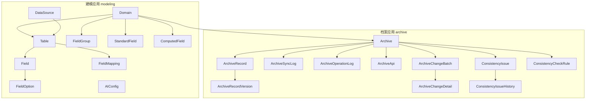
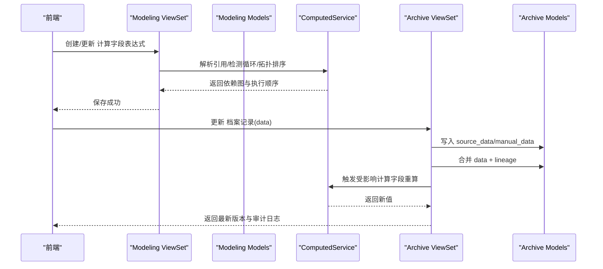
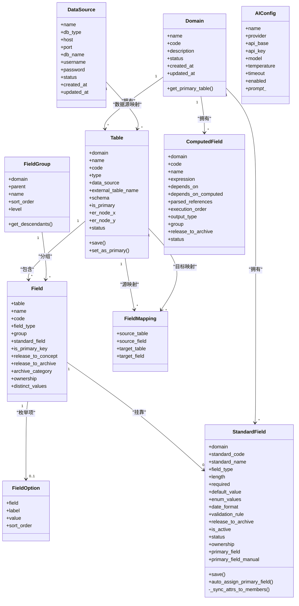
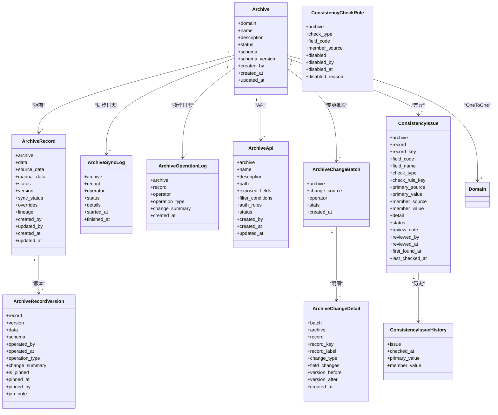
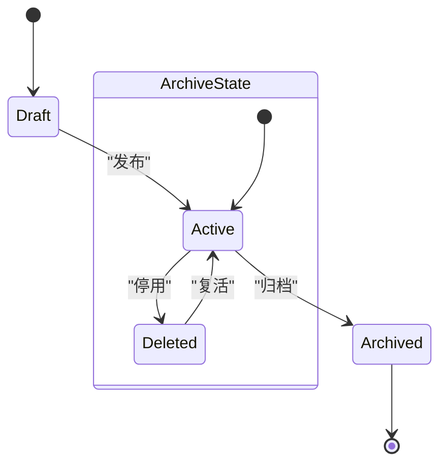
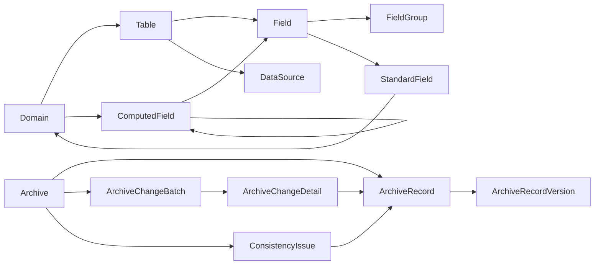

# 数据模型

<cite>
**本文引用的文件**   
- [backend/apps/modeling/models.py](file://backend/apps/modeling/models.py)
- [backend/apps/archive/models.py](file://backend/apps/archive/models.py)
- [backend/apps/modeling/serializers.py](file://backend/apps/modeling/serializers.py)
- [backend/apps/archive/serializers.py](file://backend/apps/archive/serializers.py)
- [backend/config/settings.py](file://backend/config/settings.py)
- [backend/apps/modeling/views.py](file://backend/apps/modeling/views.py)
- [backend/apps/archive/views.py](file://backend/apps/archive/views.py)
- [backend/apps/modeling/computed_service.py](file://backend/apps/modeling/computed_service.py)
- [backend/apps/archive/management/commands/refresh_archives.py](file://backend/apps/archive/management/commands/refresh_archives.py)
</cite>

## 目录
1. [简介](#简介)
2. [项目结构](#项目结构)
3. [核心组件](#核心组件)
4. [架构总览](#架构总览)
5. [详细组件分析](#详细组件分析)
6. [依赖关系分析](#依赖关系分析)
7. [性能考量](#性能考量)
8. [故障排查指南](#故障排查指南)
9. [结论](#结论)
10. [附录](#附录)

## 简介
本文件为 MetaData002 系统的数据模型文档，聚焦于建模（modeling）与档案（archive）两大模块的 Django 模型。内容涵盖：
- 所有模型类的结构与属性、方法
- 模型间的继承与关联关系
- 数据验证规则与业务约束
- 序列化格式与 API 接口规范
- 生命周期管理与状态转换
- 使用示例与最佳实践
- 数据一致性保证机制与事务处理策略

## 项目结构
后端采用 Django + DRF 的多应用架构，核心模型分布在两个应用中：
- apps.modeling：主数据建模（域、表、字段、标准字段、计算字段、AI 配置等）
- apps.archive：档案管理（档案配置、记录、版本、同步日志、操作日志、变更批次与明细、一致性检查等）

图表来源
- [backend/apps/modeling/models.py:1-489](file://backend/apps/modeling/models.py#L1-L489)
- [backend/apps/archive/models.py:1-379](file://backend/apps/archive/models.py#L1-L379)

章节来源
- [backend/config/settings.py:10-24](file://backend/config/settings.py#L10-L24)

## 核心组件
本节概述建模与档案的核心模型及其职责边界。

- 建模侧
  - DataSource：外部数据源连接配置
  - Domain：主数据域，承载表与标准字段
  - Table：实体表（本地或数据源映射），支持 ER 图坐标
  - FieldGroup：字段分组树（最多三层）
  - StandardField：概念层标准字段，跨物理字段去重与统一属性
  - Field：物理字段定义，归属表与分组，可挂靠标准字段
  - FieldOption：枚举选项
  - ComputedField：Excel 风格公式计算字段，支持 DAG 执行顺序
  - FieldMapping：表间字段映射
  - AIConfig：AI 服务配置（单例启用）

- 档案侧
  - Archive：域级档案配置，含 schema 快照与版本
  - ArchiveRecord：档案记录，双层存储（source_data + manual_data），合并物化 data
  - ArchiveRecordVersion：版本快照，支持定版与回滚
  - ArchiveSyncLog：同步过程日志
  - ArchiveOperationLog：操作审计日志
  - ArchiveApi：对外数据服务 API 配置
  - ArchiveChangeBatch / ArchiveChangeDetail：变更批次与明细（源同步/人工编辑/一致性审核）
  - ConsistencyIssue / ConsistencyCheckRule / ConsistencyIssueHistory：一致性差异与规则、历史轨迹

章节来源
- [backend/apps/modeling/models.py:1-489](file://backend/apps/modeling/models.py#L1-L489)
- [backend/apps/archive/models.py:1-379](file://backend/apps/archive/models.py#L1-L379)

## 架构总览
建模与档案通过“域”进行解耦：建模侧负责领域建模（域-表-字段-标准字段-计算字段），档案侧基于建模产出的 Schema 生成档案结构并维护实例数据。两者通过序列化器与视图暴露 RESTful 接口，配合计算字段服务实现公式推导与 DAG 调度。

图表来源
- [backend/apps/modeling/views.py:1934-2005](file://backend/apps/modeling/views.py#L1934-L2005)
- [backend/apps/modeling/computed_service.py:21-84](file://backend/apps/modeling/computed_service.py#L21-L84)
- [backend/apps/archive/serializers.py:185-377](file://backend/apps/archive/serializers.py#L185-L377)

## 详细组件分析

### 建模侧模型族
- DataSource
  - 用途：多数据库类型连接配置（PostgreSQL/MySQL/SQLServer/Oracle）
  - 关键字段：名称、类型、主机、端口、库名、用户名、密码、状态、时间戳
  - 校验：DRF 序列化器对 password 写保护；视图提供测试连接端点

- Domain
  - 用途：主数据域，唯一编码，状态管理
  - 方法：get_primary_table() 获取域内主表（is_primary=True 且 active）

- Table
  - 用途：域下实体表，区分本地与数据源映射
  - 约束：unique_together(domain, code)；type 由 data_source 存在性自动推断
  - 方法：set_as_primary() 设置主表并联动标准字段主字段分配

- FieldGroup
  - 用途：字段分组树（最多三层），支持层级计算与后代遍历
  - 校验：序列化器限制父节点层级不超过 3 且不能形成环

- StandardField
  - 用途：概念层标准字段，跨物理字段去重与统一属性
  - 关键逻辑：save() 时自动同步属性到成员 Field；auto_assign_primary_field() 自动校准主字段；_sync_attrs_to_members() 同步枚举选项到 FieldOption

- Field
  - 用途：物理字段定义，支持分组、标准字段挂靠、主键标记、释放门控
  - 关键字段：code/name/type/required/default_value/date_format/validation_rule/group/standard_field/is_primary_key/release_to_concept/release_to_archive/archive_category/ownership/distinct_values

- FieldOption
  - 用途：枚举选项，唯一约束(field, value)

- ComputedField
  - 用途：Excel 风格公式，依赖物理字段与其他计算字段，DAG 拓扑排序
  - 关键字段：expression/depends_on/depends_on_computed/parsed_references/execution_order/output_type/group/release_to_archive/status

- FieldMapping
  - 用途：表间字段映射，唯一约束(source_table, source_field, target_table, target_field)

- AIConfig
  - 用途：AI 服务配置（单例启用），支持提示词模板

图表来源
- [backend/apps/modeling/models.py:1-489](file://backend/apps/modeling/models.py#L1-L489)

章节来源
- [backend/apps/modeling/models.py:1-489](file://backend/apps/modeling/models.py#L1-L489)

### 档案侧模型族
- Archive
  - 用途：域级档案配置，OneToOne 绑定域，schema 快照与版本号
  - 状态：草稿/已发布/已归档

- ArchiveRecord
  - 用途：档案记录，双层存储（source_data/source 层、manual_data/覆盖层），合并结果 data
  - 关键字段：overrides（修正保护）、lineage（血缘）、sync_status、version

- ArchiveRecordVersion
  - 用途：版本快照，支持定版（pin）与回滚，记录变更摘要

- ArchiveSyncLog / ArchiveOperationLog
  - 用途：同步日志与操作审计

- ArchiveApi
  - 用途：对外数据服务 API，暴露字段、筛选条件、角色授权

- ArchiveChangeBatch / ArchiveChangeDetail
  - 用途：变更批次与明细，支持源同步、人工编辑、一致性审核三类来源

- ConsistencyIssue / ConsistencyCheckRule / ConsistencyIssueHistory
  - 用途：一致性差异记录、规则失效配置、历史轨迹

图表来源
- [backend/apps/archive/models.py:1-379](file://backend/apps/archive/models.py#L1-L379)

章节来源
- [backend/apps/archive/models.py:1-379](file://backend/apps/archive/models.py#L1-L379)

### 序列化格式与 API 接口规范
- 建模侧序列化器
  - DataSourceSerializer：只读 id/status/时间戳，password 写保护
  - DomainSerializer/TableListSerializer/FieldGroupSerializer/FieldListSerializer/StandardFieldSerializer/AIConfigSerializer/ComputedFieldSerializer：提供聚合字段、嵌套 children、依赖图、成员列表等扩展字段
  - 批量更新与确认分类：FieldBatchUpdateSerializer、ClassificationConfirmSerializer

- 档案侧序列化器
  - ArchiveListSerializer/DetailSerializer/CreateSerializer：记录数、API 数、Schema 快照
  - ArchiveRecordCreateSerializer/UpdateSerializer：双层拆分（source_data/manual_data）、owner 拦截、版本快照、操作日志、变更批次与明细
  - VersionSerializer/RollbackSerializer/GlobalVersionSerializer：版本查看与回滚
  - SyncLogSerializer/OperationLogSerializer：日志查询
  - ChangeBatchSerializer/ChangeDetailSerializer：变更批次与明细
  - ConsistencyIssueSerializer/ConsistencyCheckRuleSerializer：一致性差异与规则

- API 端点（节选）
  - 数据源连接测试：POST /test-connection（未保存参数）与 GET /{id}/test-connection
  - 计算字段公式验证：POST validate-formula（语法+依赖+循环检测）
  - 档案记录更新：PUT/PATCH 携带 data，自动合并与重算计算字段

章节来源
- [backend/apps/modeling/serializers.py:1-310](file://backend/apps/modeling/serializers.py#L1-L310)
- [backend/apps/archive/serializers.py:1-552](file://backend/apps/archive/serializers.py#L1-L552)
- [backend/apps/modeling/views.py:1-200](file://backend/apps/modeling/views.py#L1-L200)
- [backend/apps/modeling/views.py:1934-2005](file://backend/apps/modeling/views.py#L1934-L2005)

### 数据验证规则与业务约束
- 建模侧
  - Table.type 自动推断：有 data_source → SOURCE，否则 LOCAL
  - FieldGroup 层级 ≤ 3，禁止自环
  - StandardField.save() 属性同步至成员 Field，枚举值同步至 FieldOption
  - ComputedField 表达式需通过 validate_expression，避免循环依赖

- 档案侧
  - Archive.domain 唯一 OneToOne
  - ArchiveRecord.update 中 ownership=source 字段不可编辑（Hub 式只读）
  - 双层存储合并：computed 字段不覆盖，source 维护字段取 source_data
  - 变更批次与明细：人工编辑与源同步统一落表，便于追溯

章节来源
- [backend/apps/modeling/models.py:102-123](file://backend/apps/modeling/models.py#L102-L123)
- [backend/apps/modeling/serializers.py:94-106](file://backend/apps/modeling/serializers.py#L94-L106)
- [backend/apps/modeling/models.py:230-299](file://backend/apps/modeling/models.py#L230-L299)
- [backend/apps/modeling/views.py:1934-2005](file://backend/apps/modeling/views.py#L1934-L2005)
- [backend/apps/archive/serializers.py:198-377](file://backend/apps/archive/serializers.py#L198-L377)

### 模型生命周期与状态转换
- Domain/Table：active/deprecated
- Archive：draft → active → archived
- ArchiveRecord：active/deleted，sync_status：unsynced/synced/partial/error
- ArchiveRecordVersion：create/update/delete/rollback/pin/schema_sync
- ArchiveSyncLog：pending/success/partial/failed
- ArchiveOperationLog：create/update/delete/rollback/pin/unpin/sync/schema_sync
- ArchiveChangeBatch：sync/manual/consistency
- ArchiveChangeDetail：created/updated/deactivated/reactivated/reviewed/ignored/rollback
- ConsistencyIssue：open/reviewed/ignored/resolved

图表来源
- [backend/apps/archive/models.py:5-31](file://backend/apps/archive/models.py#L5-L31)
- [backend/apps/archive/models.py:33-73](file://backend/apps/archive/models.py#L33-L73)

章节来源
- [backend/apps/archive/models.py:1-379](file://backend/apps/archive/models.py#L1-L379)

### 数据一致性保证与事务处理
- 双层存储与合并：source_data 作为底层整层替换，manual_data 仅覆盖 archive 维护字段，computed 字段保留并重算
- 版本快照：每次创建/更新均生成版本记录，支持定版与回滚
- 变更批次与明细：统一记录变更来源与字段级旧→新值，便于审计与回溯
- 一致性检查：组合字段成员一致性、档案与源差异、孤立记录、Schema 漂移
- 事务策略：settings 中 ATOMIC_REQUESTS=False，但业务逻辑在序列化器与视图中通过显式事务与原子更新确保一致性（如批量更新 stats、版本递增）

章节来源
- [backend/config/settings.py:56-66](file://backend/config/settings.py#L56-L66)
- [backend/apps/archive/serializers.py:135-182](file://backend/apps/archive/serializers.py#L135-L182)
- [backend/apps/archive/serializers.py:198-377](file://backend/apps/archive/serializers.py#L198-L377)

### 使用示例与最佳实践
- 创建域与表
  - 先创建 Domain，再创建 Table（本地或数据源映射），必要时设置 is_primary
- 定义字段与分组
  - 为 Table 添加 Field，按 FieldGroup 组织；将冗余字段归并为 StandardField，统一属性
- 配置计算字段
  - 编写 Excel 风格表达式，调用 validate-formula 验证，系统自动构建 DAG 与执行顺序
- 发布档案
  - 从 Domain 生成 Schema，发布后通过 refresh_archives 命令拉取源数据并合并
- 更新记录
  - 仅允许 archive 维护字段可编辑；source 维护字段只读；变更后自动重算计算字段并生成版本与审计日志

章节来源
- [backend/apps/modeling/views.py:1-200](file://backend/apps/modeling/views.py#L1-L200)
- [backend/apps/modeling/views.py:1934-2005](file://backend/apps/modeling/views.py#L1934-L2005)
- [backend/apps/archive/management/commands/refresh_archives.py:1-39](file://backend/apps/archive/management/commands/refresh_archives.py#L1-L39)

## 依赖关系分析
- 建模侧内部依赖
  - Table → Domain、DataSource
  - Field → Table、FieldGroup、StandardField
  - StandardField → Domain、Field（members）
  - ComputedField → Domain、Field（depends_on）、ComputedField（depends_on_computed）
- 档案侧内部依赖
  - ArchiveRecord → Archive
  - ArchiveRecordVersion → ArchiveRecord
  - ArchiveChangeBatch → Archive
  - ArchiveChangeDetail → ArchiveChangeBatch、Archive、ArchiveRecord
  - ConsistencyIssue → Archive、ArchiveRecord
- 跨应用依赖
  - 档案侧通过 Domain.get_primary_table() 获取主表以生成 record_key 与 label
  - 计算字段服务 computed_service 依赖 modeling 模型与 formula_engine

图表来源
- [backend/apps/modeling/models.py:1-489](file://backend/apps/modeling/models.py#L1-L489)
- [backend/apps/archive/models.py:1-379](file://backend/apps/archive/models.py#L1-L379)

章节来源
- [backend/apps/modeling/models.py:1-489](file://backend/apps/modeling/models.py#L1-L489)
- [backend/apps/archive/models.py:1-379](file://backend/apps/archive/models.py#L1-L379)

## 性能考量
- 索引与查询优化
  - ArchiveRecord 对 (archive, status) 建索引
  - ArchiveOperationLog/ArchiveChangeDetail/ConsistencyIssue 对常用过滤字段建索引
- 缓存与去重
  - Field.distinct_values 缓存去重样本（上限 100），供标准字段匹配与识别
- 批量操作
  - 计算字段依赖解析与拓扑排序批量更新 execution_order
  - 刷新命令批量处理活跃档案，减少重复 IO
- 合并策略
  - 双层存储避免全量比对，source_data 整层替换，manual_data 增量覆盖

章节来源
- [backend/apps/archive/models.py:63-70](file://backend/apps/archive/models.py#L63-L70)
- [backend/apps/modeling/models.py:344-346](file://backend/apps/modeling/models.py#L344-L346)
- [backend/apps/modeling/computed_service.py:195-200](file://backend/apps/modeling/computed_service.py#L195-L200)
- [backend/apps/archive/management/commands/refresh_archives.py:1-39](file://backend/apps/archive/management/commands/refresh_archives.py#L1-L39)

## 故障排查指南
- 连接失败
  - 使用 DataSource 的 test-connection 端点验证连接参数与驱动配置
- 公式错误
  - 调用 validate-formula 检查语法与循环依赖，若检测到环则回滚表达式
- 同步失败
  - 查看 ArchiveSyncLog.details 中的 table/datasource/status/message/conflicts
- 一致性差异
  - 查看 ConsistencyIssue 的 check_type/detail，必要时禁用规则（ConsistencyCheckRule）

章节来源
- [backend/apps/modeling/views.py:74-146](file://backend/apps/modeling/views.py#L74-L146)
- [backend/apps/modeling/views.py:1934-2005](file://backend/apps/modeling/views.py#L1934-L2005)
- [backend/apps/archive/models.py:112-137](file://backend/apps/archive/models.py#L112-L137)
- [backend/apps/archive/models.py:274-332](file://backend/apps/archive/models.py#L274-L332)

## 结论
MetaData002 的数据模型围绕“建模—档案”双域展开，通过标准字段与双层存储实现概念与物理的解耦，结合计算字段与 DAG 调度保障复杂推导的一致性。版本快照、变更批次与一致性检查构成完整的审计与治理体系。建议在生产环境严格遵循 ownership 策略与 release_to_archive 门控，合理使用索引与缓存，并通过外部调度器定期刷新档案数据。

## 附录
- 数据库配置与环境变量
  - PostgreSQL 默认引擎，ATOMIC_REQUESTS=False
  - Redis 缓存用于会话与可选缓存
  - AI 服务环境变量回退机制

章节来源
- [backend/config/settings.py:56-74](file://backend/config/settings.py#L56-L74)
- [backend/config/settings.py:109-116](file://backend/config/settings.py#L109-L116)