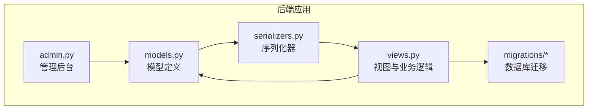
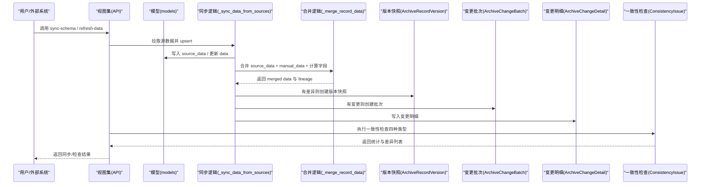
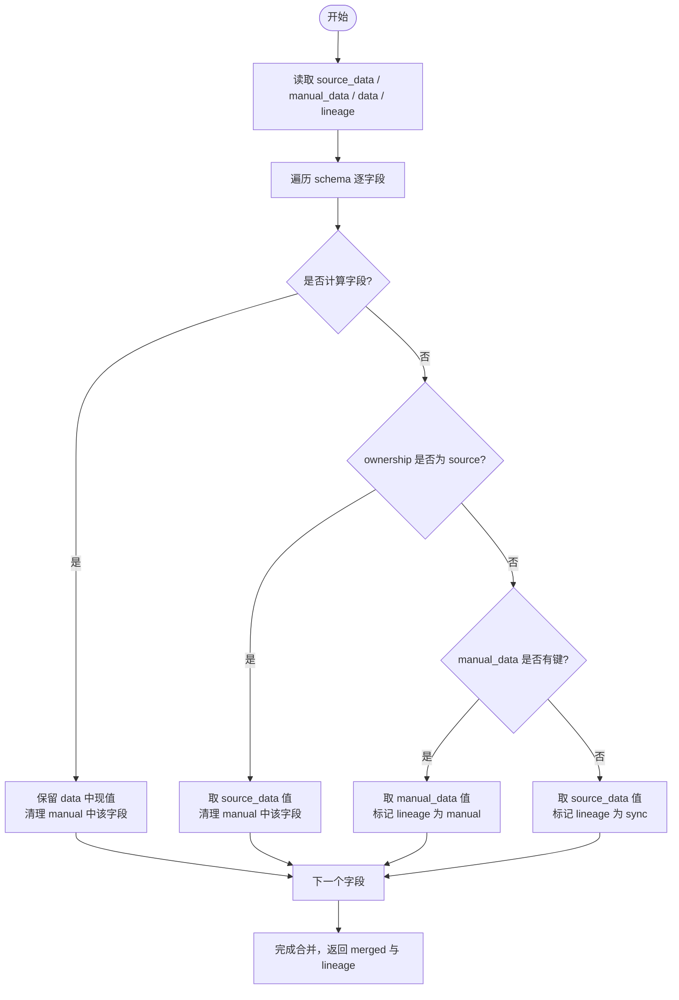
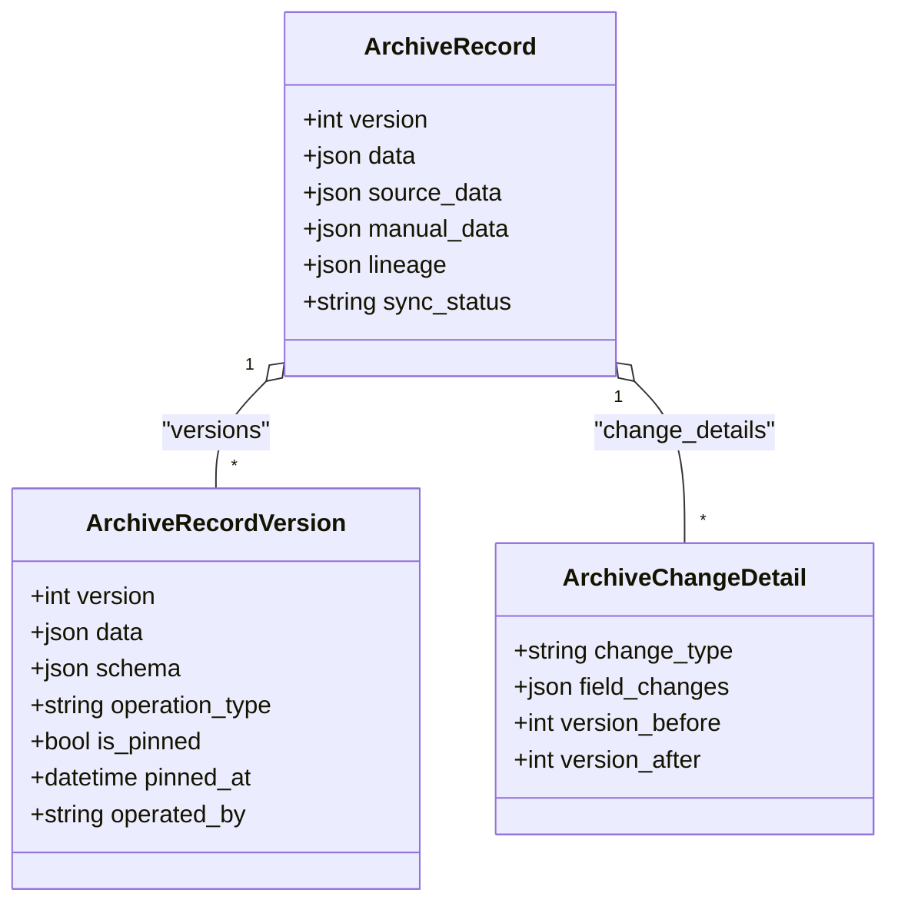
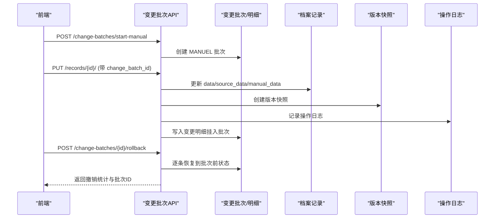
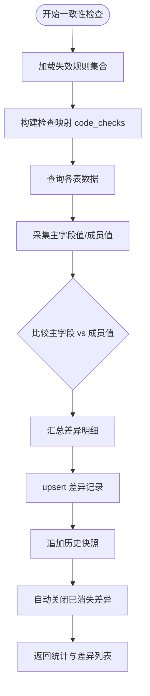
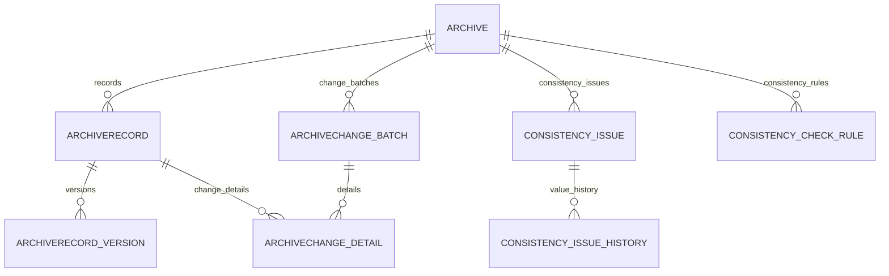

# 档案管理模块模型

<cite>
**本文引用的文件**   
- [models.py](file://backend/apps/archive/models.py)
- [serializers.py](file://backend/apps/archive/serializers.py)
- [views.py](file://backend/apps/archive/views.py)
- [admin.py](file://backend/apps/archive/admin.py)
- [0006_archivechangebatch_archivechangedetail_and_more.py](file://backend/apps/archive/migrations/0006_archivechangebatch_archivechangedetail_and_more.py)
- [0009_consistencyissuehistory.py](file://backend/apps/archive/migrations/0009_consistencyissuehistory.py)
- [0013_consistencycheckrule_and_more.py](file://backend/apps/archive/migrations/0013_consistencycheckrule_and_more.py)
</cite>

## 目录
1. [简介](#简介)
2. [项目结构](#项目结构)
3. [核心数据模型](#核心数据模型)
4. [架构总览](#架构总览)
5. [详细组件分析](#详细组件分析)
6. [依赖关系分析](#依赖关系分析)
7. [性能与一致性保障](#性能与一致性保障)
8. [故障排查指南](#故障排查指南)
9. [结论](#结论)
10. [附录：最佳实践与常见问题](#附录最佳实践与常见问题)

## 简介
本文件为 MetaData002 系统“档案管理模块”的数据模型文档，围绕以下核心模型展开：Archive、ArchiveRecord、ArchiveRecordVersion、ArchiveChangeBatch、ArchiveChangedetail、ConsistencyIssueHistory、ConsistencyCheckRule。文档重点说明：
- 档案版本控制机制（数据快照存储、变更追踪、历史记录管理）
- 一致性检查规则的自定义机制与问题跟踪流程
- 档案变更记录的完整审计链路（从变更触发到最终确认的全生命周期）
- 数据一致性保证策略、事务处理机制与性能优化考虑
- 档案操作最佳实践与常见问题解决方案

## 项目结构
档案管理模块位于 backend/apps/archive，包含模型、序列化器、视图集、迁移脚本与管理后台配置等。关键文件职责如下：
- models.py：定义所有业务数据模型及枚举
- serializers.py：提供 API 输入输出校验与字段映射
- views.py：实现同步、刷新、一致性检查、版本回滚、批量撤销等核心逻辑
- admin.py：Django Admin 展示与筛选配置
- migrations/*：数据库结构演进记录

图表来源
- [models.py:1-379](file://backend/apps/archive/models.py#L1-L379)
- [serializers.py:1-552](file://backend/apps/archive/serializers.py#L1-L552)
- [views.py:1-2487](file://backend/apps/archive/views.py#L1-L2487)
- [admin.py:1-44](file://backend/apps/archive/admin.py#L1-L44)

章节来源
- [models.py:1-379](file://backend/apps/archive/models.py#L1-L379)
- [serializers.py:1-552](file://backend/apps/archive/serializers.py#L1-L552)
- [views.py:1-2487](file://backend/apps/archive/views.py#L1-L2487)
- [admin.py:1-44](file://backend/apps/archive/admin.py#L1-L44)

## 核心数据模型
本节对核心模型进行结构化说明，包括字段含义、约束与用途。

- Archive（档案配置）
  - 作用：一个域对应一个档案，保存 schema 快照与版本
  - 关键字段：domain（一对一）、schema（JSON 快照）、schema_version（自增）、status（草稿/已发布/已归档）
  - 索引与排序：按创建时间倒序

- ArchiveRecord（档案记录）
  - 作用：主数据实例，采用双层存储 source_data（源底层）+ manual_data（人工覆盖层），data 为合并物化结果
  - 关键字段：archive（外键）、data/source_data/manual_data（JSON）、version（当前版本）、sync_status（同步状态）、overrides（修正保护标记）、lineage（字段血缘）
  - 索引：(archive, status)

- ArchiveRecordVersion（版本快照）
  - 作用：每次变更生成快照，支持定版（pin）与回滚
  - 关键字段：record（外键）、version（唯一于 record）、data/schema（快照）、operation_type（create/update/delete/rollback/pin/schema_sync）、is_pinned/pinned_at/pinned_by/pin_note
  - 约束：(record, version) 唯一；按 version 倒序

- ArchiveChangeBatch（数据变更批次）
  - 作用：一次源侧同步或一次人工编辑为一个批次，零变更不建批次
  - 关键字段：archive（外键）、change_source（sync/manual/consistency）、operator、stats（批次统计 JSON）、created_at
  - 索引：(archive, -created_at)

- ArchiveChangeDetail（数据变更明细）
  - 作用：一条记录在一个批次中的变更，含字段级旧值→新值
  - 关键字段：batch（外键）、archive（外键）、record（可空）、record_key（主键值快照）、record_label（组合字段值快照）、change_type（created/updated/deactivated/reactivated/reviewed/ignored/rollback）、field_changes（JSON）、version_before/version_after（v18 版本映射）
  - 索引：(archive, -created_at)

- ConsistencyIssue（一致性差异记录）
  - 作用：记录多种检查类型的差异，纯内部管理数据，不回写任何源表
  - 关键字段：archive、record（可空）、record_key、field_code、field_name、check_type、check_rule_key、primary_source/primary_value、member_source/member_value、detail（JSON）、status（open/reviewed/ignored/resolved）、review_note/reviewed_by/reviewed_at、first_found_at/last_checked_at
  - 约束：(archive, record_key, field_code, member_source, check_type) 唯一
  - 索引：(archive, status)、(archive, check_type)

- ConsistencyCheckRule（一致性检查规则失效配置）
  - 作用：用户可将特定检查规则失效，失效后该规则产生的差异不计入统计
  - 关键字段：archive、check_type、field_code、member_source、disabled、disabled_by/disabled_at/disabled_reason
  - 约束：(archive, check_type, field_code, member_source) 唯一

- ConsistencyIssueHistory（一致性差异历史）
  - 作用：每次检查发现差异时追加一条记录，保留历史变化轨迹
  - 关键字段：issue（外键）、checked_at、primary_value、member_value
  - 索引：按 checked_at 倒序

章节来源
- [models.py:1-379](file://backend/apps/archive/models.py#L1-L379)
- [0006_archivechangebatch_archivechangedetail_and_more.py:1-57](file://backend/apps/archive/migrations/0006_archivechangebatch_archivechangedetail_and_more.py#L1-L57)
- [0009_consistencyissuehistory.py:1-30](file://backend/apps/archive/migrations/0009_consistencyissuehistory.py#L1-L30)
- [0013_consistencycheckrule_and_more.py:1-79](file://backend/apps/archive/migrations/0013_consistencycheckrule_and_more.py#L1-L79)

## 架构总览
档案管理模块围绕“源数据同步 + 人工覆盖 + 计算字段重算 + 版本快照 + 变更日志 + 一致性检查”形成闭环。

图表来源
- [views.py:275-329](file://backend/apps/archive/views.py#L275-L329)
- [views.py:930-1085](file://backend/apps/archive/views.py#L930-L1085)
- [views.py:161-223](file://backend/apps/archive/views.py#L161-L223)
- [models.py:75-110](file://backend/apps/archive/models.py#L75-L110)
- [models.py:206-272](file://backend/apps/archive/models.py#L206-L272)
- [models.py:274-332](file://backend/apps/archive/models.py#L274-L332)

## 详细组件分析

### 档案记录的双层存储与合并物化
- 双层存储
  - source_data：源侧整层替换，零比对，用于保持权威数据源
  - manual_data：人工覆盖层，仅允许 ownership=archive 的字段存在键
  - data：合并结果（source_data 为底 + manual_data 覆盖 + 计算字段保留）
- 合并逻辑
  - 计算字段（source='computed'）：保留现有值，不允许人工覆盖
  - 源维护字段（ownership='source'）：强制取 source_data，清理遗留人工覆盖
  - 档案维护字段（ownership='archive'）：优先 manual_data，否则 fallback 到 source_data
  - 重建 lineage：manual/sync 来源与更新时间
- 影响范围
  - 人工修改会设置 overrides（修正保护标记）与 lineage（血缘）
  - 计算字段受影响时会触发重算（computed_service.recalculate_affected）

图表来源
- [views.py:161-223](file://backend/apps/archive/views.py#L161-L223)
- [serializers.py:198-377](file://backend/apps/archive/serializers.py#L198-L377)

章节来源
- [views.py:161-223](file://backend/apps/archive/views.py#L161-L223)
- [serializers.py:198-377](file://backend/apps/archive/serializers.py#L198-L377)

### 版本控制与回滚机制
- 版本快照
  - 每次新增/修改/删除/回滚/定版/模型同步均生成快照，记录 data、schema、操作人、操作时间与变更摘要
  - 支持定版（pin）锁定某版本，便于审计与合规
- 回滚语义
  - 版本回滚：恢复到指定版本的快照
  - 时间点回滚：根据变更明细的 version_after 定位快照并恢复
  - 批次回滚：将一批次影响的记录恢复到该批次之前的状态
- 版本映射
  - v18 引入 version_before/version_after，使回滚统一基于快照而非字段级 old 值反推

图表来源
- [models.py:33-73](file://backend/apps/archive/models.py#L33-L73)
- [models.py:75-110](file://backend/apps/archive/models.py#L75-L110)
- [models.py:235-272](file://backend/apps/archive/models.py#L235-L272)
- [views.py:1674-1728](file://backend/apps/archive/views.py#L1674-L1728)
- [views.py:2105-2200](file://backend/apps/archive/views.py#L2105-L2200)

章节来源
- [models.py:33-110](file://backend/apps/archive/models.py#L33-L110)
- [views.py:1674-1728](file://backend/apps/archive/views.py#L1674-L1728)
- [views.py:2105-2200](file://backend/apps/archive/views.py#L2105-L2200)

### 数据变更批次与审计链路
- 批次来源
  - 源侧同步：一次刷新产生一个批次（无变更不建批次）
  - 档案侧编辑：一次工作会话可通过 start-manual 开启批次，随后多条 PUT 归入同一批次
  - 一致性审核：批量标记 reviewed/ignored/reopen 产生一致性批次
- 变更明细
  - 记录级标识（record_key）与可读标签（record_label）便于识别
  - 字段级变更（field_changes）记录旧值→新值
  - v18 版本映射（version_before/version_after）支撑精确回滚
- 审计链路
  - 操作日志（ArchiveOperationLog）：记录动作类型与摘要
  - 版本快照（ArchiveRecordVersion）：记录数据快照与变更摘要
  - 变更批次与明细（ArchiveChangeBatch/ArchiveChangeDetail）：记录批次统计与字段级变更

图表来源
- [views.py:1863-1948](file://backend/apps/archive/views.py#L1863-L1948)
- [views.py:2061-2102](file://backend/apps/archive/views.py#L2061-L2102)
- [models.py:206-272](file://backend/apps/archive/models.py#L206-L272)

章节来源
- [views.py:1863-1948](file://backend/apps/archive/views.py#L1863-L1948)
- [views.py:2061-2102](file://backend/apps/archive/views.py#L2061-L2102)
- [models.py:206-272](file://backend/apps/archive/models.py#L206-L272)

### 一致性检查与问题跟踪
- 检查类型
  - composite_member：组合字段非主字段成员值≠主字段值
  - archive_source_diff：档案侧人工覆盖与源侧数据差异
  - orphan_source_record：源侧数据无法关联主表主键
  - schema_drift：档案 schema 与当前建模结构不一致
- 规则失效
  - 通过 ConsistencyCheckRule 将特定规则失效，失效后该规则产生的差异不计入统计
- 问题跟踪
  - ConsistencyIssue 记录差异（状态 open/reviewed/ignored/resolved）
  - ConsistencyIssueHistory 记录每次检查的差异快照，形成历史轨迹
  - 批量标记 reviewed/ignored/reopen，同时写入变更批次与明细

图表来源
- [views.py:396-600](file://backend/apps/archive/views.py#L396-L600)
- [models.py:274-332](file://backend/apps/archive/models.py#L274-L332)
- [models.py:334-362](file://backend/apps/archive/models.py#L334-L362)
- [models.py:364-379](file://backend/apps/archive/models.py#L364-L379)

章节来源
- [views.py:396-600](file://backend/apps/archive/views.py#L396-L600)
- [models.py:274-379](file://backend/apps/archive/models.py#L274-L379)

## 依赖关系分析
- 模型间关系
  - Archive 与 Domain 一对一
  - ArchiveRecord 与 Archive 一对多
  - ArchiveRecordVersion 与 ArchiveRecord 一对多
  - ArchiveChangeBatch 与 Archive 一对多
  - ArchiveChangeDetail 与 ArchiveChangeBatch 一对多，与 Archive 一对多，与 ArchiveRecord 一对多（可空）
  - ConsistencyIssue 与 Archive 一对多，与 ArchiveRecord 一对多（可空）
  - ConsistencyIssueHistory 与 ConsistencyIssue 一对多
  - ConsistencyCheckRule 与 Archive 一对多
- 视图与模型耦合
  - 视图集中大量使用 select_related/prefetch_related 减少 N+1 查询
  - 同步与合并逻辑强依赖 schema 与 ownership/source/computed 分类

图表来源
- [models.py:1-379](file://backend/apps/archive/models.py#L1-L379)

章节来源
- [models.py:1-379](file://backend/apps/archive/models.py#L1-L379)

## 性能与一致性保障
- 性能优化
  - 双层存储避免频繁比对，源侧整层替换（source_data）零比对
  - 合并物化惰性计算，仅在需要时合并 data，减少冗余写入
  - 预检接口（refresh-preview）零写入对比 schema 与数据变化，降低误操作风险
  - 批量 upsert 与 bulk_create/bulk_update 减少数据库往返
  - 查询优化：select_related/prefetch_related、索引设计（archive/status、archive/-created_at 等）
  - 外部数据源连接复用与临时别名管理，避免连接泄漏
- 一致性保障
  - 事务原子性：回滚执行器使用 transaction.atomic 确保版本快照、操作日志、变更明细一致
  - 停用清扫安全闸门：任一表同步出错或无主键时跳过停用，防止瞬时故障引发误停用
  - 版本映射（version_before/version_after）确保回滚语义准确，兼容存量历史
  - 一致性检查不写源表，遵循 Hub 式 MDM 宪法，仅内部管理与告警

章节来源
- [views.py:1530-1560](file://backend/apps/archive/views.py#L1530-L1560)
- [views.py:1605-1635](file://backend/apps/archive/views.py#L1605-L1635)
- [views.py:2158-2200](file://backend/apps/archive/views.py#L2158-L2200)
- [models.py:63-73](file://backend/apps/archive/models.py#L63-L73)
- [models.py:223-232](file://backend/apps/archive/models.py#L223-L232)

## 故障排查指南
- 常见错误与定位
  - 同步失败：查看 sync_stats.errors，检查 _query_local_table/_query_external_table 异常
  - 计算字段重算失败：关注 computed_recalculated.error，检查依赖字段与公式
  - 一致性检查报错：by_type 统计与 errors 数组，核对 code_to_physical 映射与主键配置
  - 回滚无效：确认 version_before/version_after 是否存在，存量历史需降级路径
- 调试建议
  - 使用 refresh-preview 预检 schema 与数据变化，确认影响面
  - 导出变更日志 Excel，快速定位批次与明细
  - 查看操作日志与版本快照，还原变更上下文

章节来源
- [views.py:275-329](file://backend/apps/archive/views.py#L275-L329)
- [views.py:1974-2059](file://backend/apps/archive/views.py#L1974-L2059)
- [views.py:2203-2283](file://backend/apps/archive/views.py#L2203-L2283)

## 结论
档案管理模块通过双层存储、版本快照、变更批次与明细、一致性检查与规则失效，构建了完整的档案数据治理体系。其设计兼顾了数据权威性（源侧为主）、人工灵活性（覆盖层与保护标记）、可追溯性（版本与审计链）与可运维性（预检与批量撤销）。在性能与一致性方面，采用批量操作、索引优化与事务原子性保障，满足大规模数据同步与复杂业务场景需求。

## 附录：最佳实践与常见问题
- 最佳实践
  - 同步前先执行 refresh-preview，评估 schema 与数据变化影响
  - 人工编辑使用 start-manual 开启批次，提升撤销效率与审计清晰度
  - 合理配置 ownership/source/computed，避免不必要的覆盖与冲突
  - 定期运行一致性检查，及时处理 open/reviewed/ignored 差异
  - 对关键版本进行 pin 定版，便于合规与审计
- 常见问题
  - 组合字段未设主字段：预检告警提示，需在建模侧设置主字段
  - 源侧刷新波及档案维护字段：预检告警提醒确认，必要时调整覆盖层
  - 存量历史明细无版本映射：回滚需走降级路径（字段级 old 值恢复）
  - 外部数据源连接异常：检查 db_type/engine 配置与权限

[无章节来源，因为本节为通用指导]