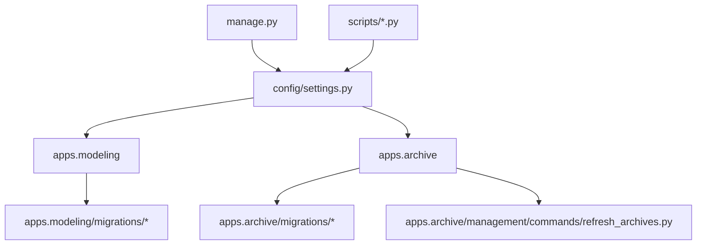
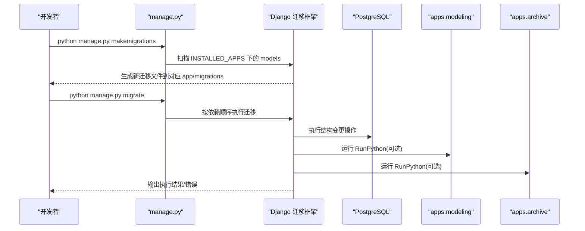
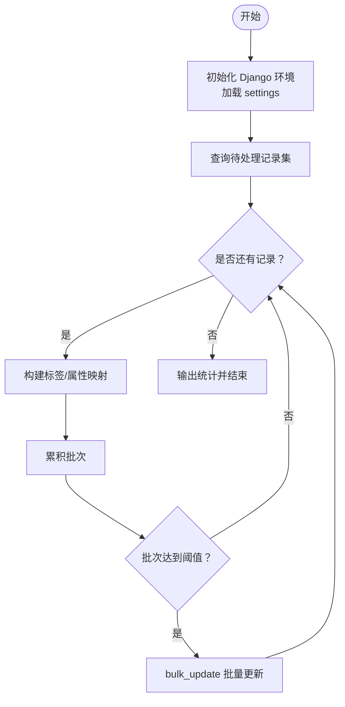
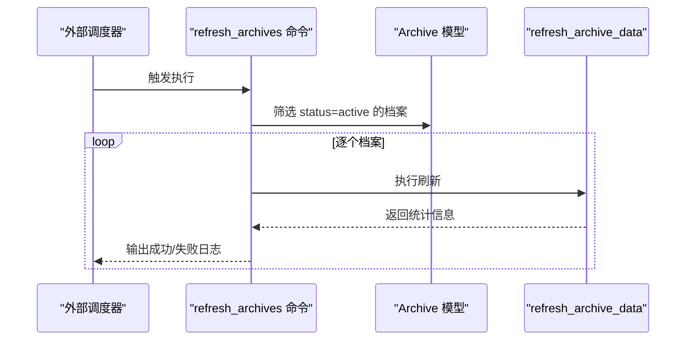
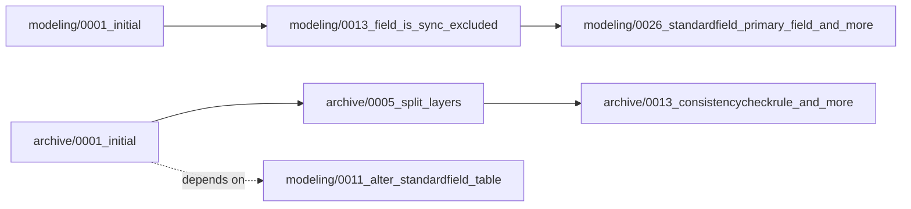

# 数据迁移

<cite>
**本文引用的文件**   
- [settings.py](file://backend/config/settings.py)
- [manage.py](file://backend/manage.py)
- [0001_initial.py（modeling）](file://backend/apps/modeling/migrations/0001_initial.py)
- [0001_initial.py（archive）](file://backend/apps/archive/migrations/0001_initial.py)
- [0005_archiverecord_manual_data_archiverecord_source_data_and_more.py](file://backend/apps/archive/migrations/0005_archiverecord_manual_data_archiverecord_source_data_and_more.py)
- [0013_field_is_sync_excluded.py](file://backend/apps/modeling/migrations/0013_field_is_sync_excluded.py)
- [0026_standardfield_primary_field_and_more.py](file://backend/apps/modeling/migrations/0026_standardfield_primary_field_and_more.py)
- [0013_consistencycheckrule_and_more.py](file://backend/apps/archive/migrations/0013_consistencycheckrule_and_more.py)
- [refresh_archives.py](file://backend/apps/archive/management/commands/refresh_archives.py)
- [backfill_change_record_label.py](file://backend/scripts/backfill_change_record_label.py)
- [migrate_standard_field_attrs.py](file://backend/scripts/migrate_standard_field_attrs.py)
</cite>

## 目录
1. [简介](#简介)
2. [项目结构](#项目结构)
3. [核心组件](#核心组件)
4. [架构总览](#架构总览)
5. [详细组件分析](#详细组件分析)
6. [依赖关系分析](#依赖关系分析)
7. [性能考虑](#性能考虑)
8. [故障排查指南](#故障排查指南)
9. [结论](#结论)
10. [附录](#附录)

## 简介
本文件面向 MetaData002 系统的数据迁移管理，聚焦 Django 迁移系统的配置、使用与最佳实践。内容涵盖：
- 迁移文件的生成与管理策略
- 数据迁移的最佳实践（向后兼容、备份与回滚）
- 生产环境迁移执行流程与自动化脚本
- 常见问题与调试技巧
- 数据校验与完整性检查机制
- 大表迁移的性能优化方案

本项目采用 PostgreSQL 作为默认数据库，Django 通过 manage.py 驱动迁移命令；业务模块 apps.modeling 与 apps.archive 各自维护独立迁移目录，并在关键演进中使用了 RunPython 进行存量数据清洗与回填。

## 项目结构
- 后端入口与配置
  - manage.py：设置 DJANGO_SETTINGS_MODULE 并调用 Django 命令行工具
  - config/settings.py：数据库、缓存、时区、REST Framework、应用注册等全局配置
- 应用与迁移
  - backend/apps/modeling/migrations：建模域模型与字段映射的迁移
  - backend/apps/archive/migrations：档案、记录、版本、同步日志与一致性检查规则的迁移
- 自定义命令与脚本
  - backend/apps/archive/management/commands/refresh_archives.py：外部调度刷新档案数据
  - backend/scripts/*.py：一次性或周期性数据回填/迁移脚本

图表来源
- [manage.py:1-22](file://backend/manage.py#L1-L22)
- [settings.py:1-123](file://backend/config/settings.py#L1-L123)

章节来源
- [manage.py:1-22](file://backend/manage.py#L1-L22)
- [settings.py:1-123](file://backend/config/settings.py#L1-L123)

## 核心组件
- Django 迁移系统
  - 通过 manage.py 驱动，自动发现各应用的 migrations 目录
  - 支持 CreateModel/AddField/RunPython 等操作，保证结构变更与数据演进的原子性
- 数据库与连接
  - 默认 PostgreSQL，连接参数由环境变量注入
  - 事务控制：ATOMIC_REQUESTS=False，迁移在迁移框架的事务内执行
- 应用注册
  - INSTALLED_APPS 包含 modeling 与 archive，确保迁移被扫描

章节来源
- [settings.py:56-66](file://backend/config/settings.py#L56-L66)
- [settings.py:10-24](file://backend/config/settings.py#L10-L24)
- [manage.py:7-17](file://backend/manage.py#L7-L17)

## 架构总览
下图展示迁移系统与业务模块的关系，以及数据迁移的关键路径：

图表来源
- [manage.py:7-17](file://backend/manage.py#L7-L17)
- [settings.py:10-24](file://backend/config/settings.py#L10-L24)
- [settings.py:56-66](file://backend/config/settings.py#L56-L66)

## 详细组件分析

### 迁移文件组织与命名规范
- 每个应用独立维护 migrations 目录，初始迁移以 0001_initial.py 命名
- 后续迁移按序号递增，保持线性可追踪
- 依赖声明 dependencies 用于保证执行顺序

示例参考
- [0001_initial.py（modeling）:1-127](file://backend/apps/modeling/migrations/0001_initial.py#L1-L127)
- [0001_initial.py（archive）:1-127](file://backend/apps/archive/migrations/0001_initial.py#L1-L127)

章节来源
- [0001_initial.py（modeling）:1-127](file://backend/apps/modeling/migrations/0001_initial.py#L1-L127)
- [0001_initial.py（archive）:1-127](file://backend/apps/archive/migrations/0001_initial.py#L1-L127)

### 结构变更与数据演进的组合模式
- 结构变更：CreateModel、AddField、AlterField、AddIndex、AddConstraint 等
- 数据演进：RunPython 用于存量数据清洗、回填、合并与拆分

典型用例
- 将 data 拆分为 source_data 与 manual_data 两层，并保留计算字段仅在 data
- 预勾选 ETL 审计列不同步写回
- 为组合字段分配默认主字段

章节来源
- [0005_archiverecord_manual_data_archiverecord_source_data_and_more.py:1-67](file://backend/apps/archive/migrations/0005_archiverecord_manual_data_archiverecord_source_data_and_more.py#L1-L67)
- [0013_field_is_sync_excluded.py:1-35](file://backend/apps/modeling/migrations/0013_field_is_sync_excluded.py#L1-L35)
- [0026_standardfield_primary_field_and_more.py:1-40](file://backend/apps/modeling/migrations/0026_standardfield_primary_field_and_more.py#L1-L40)

### 数据回填与批量处理脚本
- backfill_change_record_label.py：对 ArchiveChangeDetail 补全 record_label，使用迭代器与 bulk_update 提升性能
- migrate_standard_field_attrs.py：将 Physical Field 的属性复制到 StandardField，聚合枚举值并处理冲突

图表来源
- [backfill_change_record_label.py:1-54](file://backend/scripts/backfill_change_record_label.py#L1-L54)
- [migrate_standard_field_attrs.py:1-85](file://backend/scripts/migrate_standard_field_attrs.py#L1-L85)

章节来源
- [backfill_change_record_label.py:1-54](file://backend/scripts/backfill_change_record_label.py#L1-L54)
- [migrate_standard_field_attrs.py:1-85](file://backend/scripts/migrate_standard_field_attrs.py#L1-L85)

### 外部调度与数据刷新命令
- refresh_archives.py：遍历已发布档案，调用视图层刷新逻辑，统计新增/更新/错误信息，便于外部 cron 或任务调度器集成

图表来源
- [refresh_archives.py:1-39](file://backend/apps/archive/management/commands/refresh_archives.py#L1-L39)

章节来源
- [refresh_archives.py:1-39](file://backend/apps/archive/management/commands/refresh_archives.py#L1-L39)

### 一致性检查与约束设计
- 新增 ConsistencyCheckRule 与扩展 ConsistencyIssue，增加 check_type、detail、check_rule_key 等字段
- 通过 UniqueConstraint 与 Index 保障唯一性与查询性能

章节来源
- [0013_consistencycheckrule_and_more.py:1-79](file://backend/apps/archive/migrations/0013_consistencycheckrule_and_more.py#L1-L79)

## 依赖关系分析
- 应用间依赖
  - archive 的初始迁移依赖 modeling 的特定版本，确保跨应用模型可用
- 迁移间依赖
  - 每个迁移通过 dependencies 声明前序迁移，避免并发执行导致的顺序问题

图表来源
- [0001_initial.py（archive）:11-13](file://backend/apps/archive/migrations/0001_initial.py#L11-L13)
- [0013_field_is_sync_excluded.py:23-25](file://backend/apps/modeling/migrations/0013_field_is_sync_excluded.py#L23-L25)
- [0026_standardfield_primary_field_and_more.py:23-25](file://backend/apps/modeling/migrations/0026_standardfield_primary_field_and_more.py#L23-L25)
- [0005_archiverecord_manual_data_archiverecord_source_data_and_more.py:45-47](file://backend/apps/archive/migrations/0005_archiverecord_manual_data_archiverecord_source_data_and_more.py#L45-L47)
- [0013_consistencycheckrule_and_more.py:9-11](file://backend/apps/archive/migrations/0013_consistencycheckrule_and_more.py#L9-L11)

章节来源
- [0001_initial.py（archive）:11-13](file://backend/apps/archive/migrations/0001_initial.py#L11-L13)
- [0005_archiverecord_manual_data_archiverecord_source_data_and_more.py:45-47](file://backend/apps/archive/migrations/0005_archiverecord_manual_data_archiverecord_source_data_and_more.py#L45-L47)
- [0013_consistencycheckrule_and_more.py:9-11](file://backend/apps/archive/migrations/0013_consistencycheckrule_and_more.py#L9-L11)

## 性能考虑
- 大表迁移优化
  - 使用 iterator(chunk_size=N) 分批读取，避免一次性加载导致内存溢出
  - 使用 bulk_update 批量写入，减少数据库往返次数
- 索引与约束
  - 为新字段添加合适索引，提高查询与去重性能
  - 合理使用 UniqueConstraint，避免过度约束影响写入吞吐
- 事务与锁
  - 迁移在框架事务内执行，注意长事务可能带来的锁竞争
  - 对热点表分阶段执行，降低锁持有时间

章节来源
- [0005_archiverecord_manual_data_archiverecord_source_data_and_more.py:16-34](file://backend/apps/archive/migrations/0005_archiverecord_manual_data_archiverecord_source_data_and_more.py#L16-L34)
- [0013_consistencycheckrule_and_more.py:61-68](file://backend/apps/archive/migrations/0013_consistencycheckrule_and_more.py#L61-L68)

## 故障排查指南
- 常见错误定位
  - 查看迁移历史：python manage.py showmigrations
  - 模拟执行：python manage.py migrate --plan
  - 查看具体迁移文件中的 RunPython 函数，确认数据逻辑是否正确
- 回滚策略
  - 优先回滚最近一次迁移：python manage.py migrate <app> <previous_migration>
  - 对于复杂数据迁移，建议在 RunPython 中实现反向函数（noop 或逆向逻辑）
- 数据校验
  - 在迁移后执行一致性检查规则，核对 check_type 与 detail 字段
  - 针对关键表抽样比对 source_data、manual_data 与 data 的一致性
- 日志与监控
  - 使用 refresh_archives 命令的输出统计，关注错误数量
  - 结合数据库慢查询日志与索引使用情况，评估迁移后的性能

章节来源
- [0013_consistencycheckrule_and_more.py:14-31](file://backend/apps/archive/migrations/0013_consistencycheckrule_and_more.py#L14-L31)
- [refresh_archives.py:27-38](file://backend/apps/archive/management/commands/refresh_archives.py#L27-L38)

## 结论
MetaData002 的迁移体系基于 Django 迁移框架，结合 RunPython 与批量处理脚本，实现了结构变更与数据演进的解耦与可控。通过清晰的依赖声明、合理的索引与约束设计，以及完善的回滚与校验机制，能够在生产环境中安全、高效地推进数据迁移。建议持续遵循向后兼容原则，完善自动化脚本与监控告警，确保迁移过程的可观测性与可恢复性。

## 附录
- 常用命令
  - 生成迁移：python manage.py makemigrations
  - 执行迁移：python manage.py migrate
  - 查看迁移计划：python manage.py migrate --plan
  - 指定应用回滚：python manage.py migrate <app> <migration_name>
- 环境变量与配置
  - 数据库连接：DB_NAME、DB_USER、DB_PASSWORD、DB_HOST、DB_PORT
  - 缓存：REDIS_HOST、REDIS_PORT
  - 其他：DJANGO_SECRET_KEY、DEBUG、ALLOWED_HOSTS

章节来源
- [settings.py:56-74](file://backend/config/settings.py#L56-L74)
- [settings.py:6-8](file://backend/config/settings.py#L6-L8)