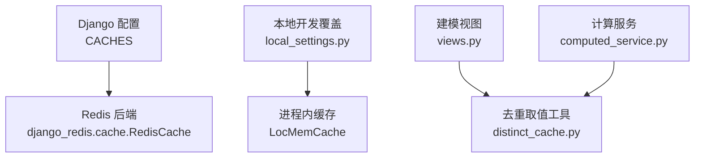
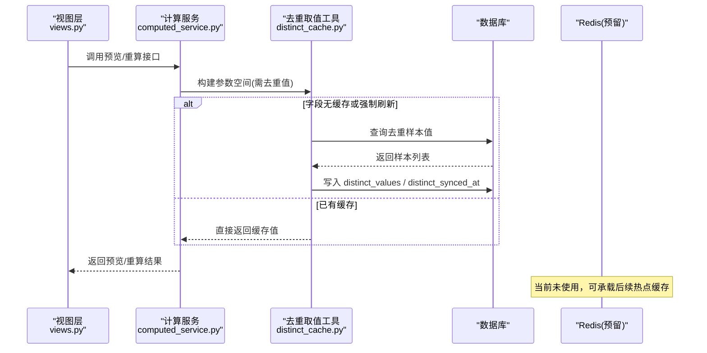
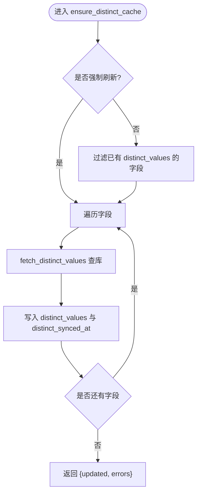
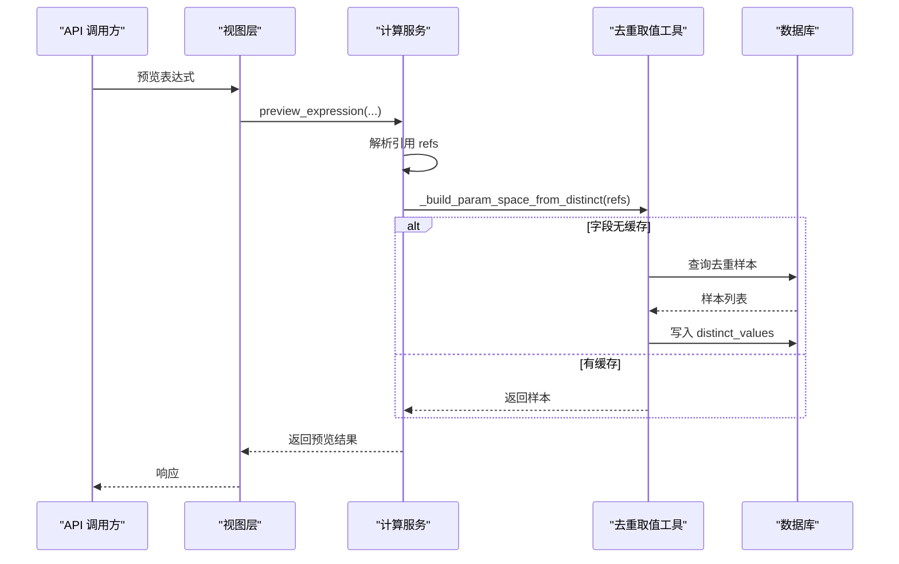
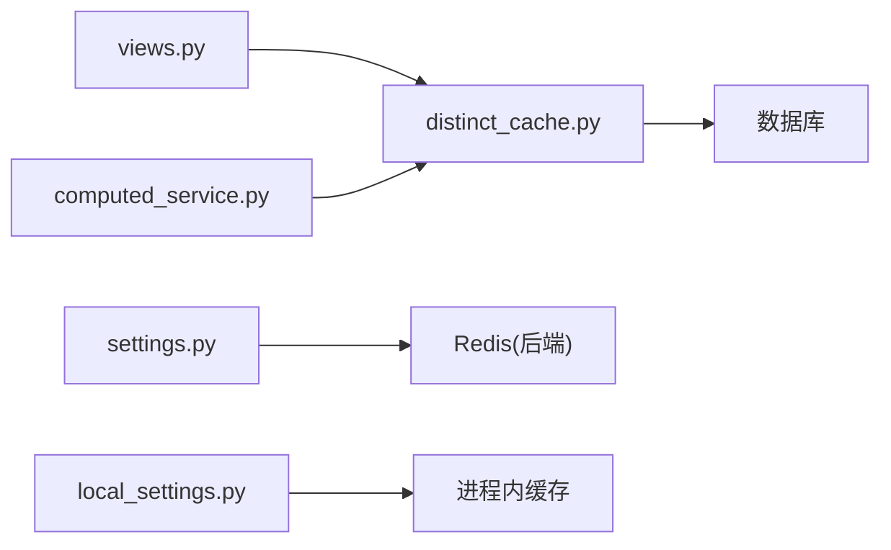

# 缓存策略

<cite>
**本文引用的文件**   
- [settings.py](file://backend/config/settings.py)
- [local_settings.py](file://backend/local_settings.py)
- [distinct_cache.py](file://backend/apps/modeling/distinct_cache.py)
- [computed_service.py](file://backend/apps/modeling/computed_service.py)
- [views.py](file://backend/apps/modeling/views.py)
</cite>

## 目录
1. [简介](#简介)
2. [项目结构](#项目结构)
3. [核心组件](#核心组件)
4. [架构总览](#架构总览)
5. [详细组件分析](#详细组件分析)
6. [依赖关系分析](#依赖关系分析)
7. [性能考虑](#性能考虑)
8. [故障排查指南](#故障排查指南)
9. [结论](#结论)
10. [附录](#附录)

## 简介
本文件为 MetaData002 系统的缓存策略文档，聚焦 Redis 缓存架构与配置、缓存数据组织（键命名规范与数据结构）、更新策略（失效/同步/一致性）、预热与懒加载方案、监控与调优、故障处理与降级、以及分布式环境下的缓存同步机制。当前仓库已实现基于 Django + django-redis 的 Redis 缓存后端配置，并在“字段去重取值”场景落地了“按需填充+持久化到模型字段”的轻量缓存模式；同时通过视图与服务层调用该能力，形成完整的懒加载链路。

## 项目结构
- 缓存后端配置位于 Django 配置文件，生产默认使用 Redis，开发环境回退到进程内内存缓存。
- 业务侧缓存集中在建模模块的“字段去重取值”能力中，以“按需查询+落库字段缓存”的方式避免重复 IO。
- 计算服务在预览与批量重算时，会触发去重取值的懒加载，确保参数空间构建不阻塞主流程。

图表来源 
- [settings.py:68-74](file://backend/config/settings.py#L68-L74)
- [local_settings.py:11-15](file://backend/local_settings.py#L11-L15)
- [views.py:22-27](file://backend/apps/modeling/views.py#L22-L27)
- [computed_service.py:444-462](file://backend/apps/modeling/computed_service.py#L444-L462)

章节来源
- [settings.py:68-74](file://backend/config/settings.py#L68-L74)
- [local_settings.py:11-15](file://backend/local_settings.py#L11-L15)

## 核心组件
- 缓存后端：Django CACHES 默认指向 Redis，连接信息通过环境变量注入；开发环境被 local_settings 覆盖为进程内缓存。
- 去重取值缓存：distinct_cache.py 提供 fetch_distinct_values 与 ensure_distinct_cache，按字段维度拉取样本值并写入模型字段 distinct_values 与 distinct_synced_at，作为“持久化缓存”。
- 计算服务集成：computed_service.py 在构建参数空间时，若字段未缓存则触发懒加载，失败时降级为占位值，保证预览与试算可用。
- 视图层调用：views.py 多处调用 ensure_distinct_cache，用于 AI 查重、组合字段抽屉、刷新去重等场景。

章节来源
- [settings.py:68-74](file://backend/config/settings.py#L68-L74)
- [local_settings.py:11-15](file://backend/local_settings.py#L11-L15)
- [distinct_cache.py:27-121](file://backend/apps/modeling/distinct_cache.py#L27-L121)
- [computed_service.py:444-471](file://backend/apps/modeling/computed_service.py#L444-L471)
- [views.py:22-27](file://backend/apps/modeling/views.py#L22-L27)

## 架构总览
系统采用“应用级持久化缓存 + 可选共享缓存”的分层设计：
- 应用级持久化缓存：将字段的去重取值样本持久化到数据库字段，跨请求、跨进程共享，具备简单可靠、无需额外运维的优势。
- 共享缓存（Redis）：当前仓库仅配置了 Redis 后端，尚未在业务代码中显式使用；可作为未来热点查询、会话、限流、分布式锁等的统一缓存层。

图表来源 
- [views.py:22-27](file://backend/apps/modeling/views.py#L22-L27)
- [computed_service.py:444-471](file://backend/apps/modeling/computed_service.py#L444-L471)
- [distinct_cache.py:100-121](file://backend/apps/modeling/distinct_cache.py#L100-L121)

## 详细组件分析

### 缓存后端与配置
- 生产环境：CACHES 默认使用 django_redis.cache.RedisCache，LOCATION 由 REDIS_HOST/REDIS_PORT 环境变量决定，使用 db=1 库。
- 开发环境：local_settings.py 覆盖为 LocMemCache，便于本地调试。
- 建议扩展：可在 settings 中增加通用前缀、超时、连接池等选项，便于后续统一治理。

章节来源
- [settings.py:68-74](file://backend/config/settings.py#L68-L74)
- [local_settings.py:11-15](file://backend/local_settings.py#L11-L15)

### 字段去重取值缓存（distinct_cache）
- 功能职责：
  - fetch_distinct_values：对本地表或外部数据源表执行 DISTINCT 查询，限制条数，返回 JSON 安全化的值列表。
  - ensure_distinct_cache：对传入字段集合进行“按需填充”，支持 force 强制刷新；记录更新时间并保存至模型字段。
- 数据结构：
  - 字段模型新增 distinct_values（样本值数组）与 distinct_synced_at（最近同步时间），作为“持久化缓存”。
- 复杂度与边界：
  - 单次查询 LIMIT 上限控制样本规模，避免大表扫描；异常捕获后返回错误列表，调用方可降级处理。
- 适用场景：
  - 公式预览、AI 查重、组合字段枚举、刷新去重等需要“有限样本”的场景。

图表来源 
- [distinct_cache.py:100-121](file://backend/apps/modeling/distinct_cache.py#L100-L121)

章节来源
- [distinct_cache.py:27-121](file://backend/apps/modeling/distinct_cache.py#L27-L121)

### 计算服务中的懒加载（computed_service）
- 参数空间构建：
  - 从表达式引用中提取字段依赖，若字段未缓存则调用 ensure_distinct_cache 懒加载。
  - 若仍无法获取样本值，则降级为占位值，保证预览流程不中断。
- 采样策略：
  - 当组合总数超过阈值时，采用轮转+随机采样，保证每列取值多样性且结果稳定可复现。

图表来源 
- [computed_service.py:444-471](file://backend/apps/modeling/computed_service.py#L444-L471)
- [computed_service.py:508-589](file://backend/apps/modeling/computed_service.py#L508-L589)
- [distinct_cache.py:100-121](file://backend/apps/modeling/distinct_cache.py#L100-L121)

章节来源
- [computed_service.py:444-471](file://backend/apps/modeling/computed_service.py#L444-L471)
- [computed_service.py:508-589](file://backend/apps/modeling/computed_service.py#L508-L589)

### 视图层调用点
- 导入 distinct_cache 的工具函数，并在多个 action 中按需触发去重缓存填充，例如 AI 查重、组合字段抽屉、刷新去重等。
- 调用方式统一，便于集中管理与监控埋点。

章节来源
- [views.py:22-27](file://backend/apps/modeling/views.py#L22-L27)

## 依赖关系分析
- 视图层依赖 distinct_cache 工具，计算服务也依赖 distinct_cache 工具，二者解耦于 views 与 service 之间。
- 缓存后端依赖 Django 配置与环境变量；开发环境与生产环境通过不同配置文件切换。

图表来源 
- [views.py:22-27](file://backend/apps/modeling/views.py#L22-L27)
- [computed_service.py:444-471](file://backend/apps/modeling/computed_service.py#L444-L471)
- [settings.py:68-74](file://backend/config/settings.py#L68-L74)
- [local_settings.py:11-15](file://backend/local_settings.py#L11-L15)

章节来源
- [views.py:22-27](file://backend/apps/modeling/views.py#L22-L27)
- [computed_service.py:444-471](file://backend/apps/modeling/computed_service.py#L444-L471)
- [settings.py:68-74](file://backend/config/settings.py#L68-L74)
- [local_settings.py:11-15](file://backend/local_settings.py#L11-L15)

## 性能考虑
- 查询限制：去重取值使用 LIMIT 控制样本量，避免全表扫描；建议在大数据集上评估是否需要分层抽样或近似算法。
- 懒加载：仅在需要时触发缓存填充，减少冷启动开销；对于高频访问字段，可通过定时任务预填充。
- 连接复用：外部数据源动态连接每次创建 alias，注意连接生命周期管理，避免连接泄漏。
- 序列化成本：json_safe 转换避免复杂类型序列化失败，必要时可引入更高效的序列化器。

[本节为通用性能建议，不直接分析具体文件]

## 故障排查指南
- 连接问题：
  - 检查 Redis 环境变量是否正确（REDIS_HOST、REDIS_PORT），确认端口可达。
  - 开发环境若使用 LocMemCache，请确认未误用生产配置。
- 去重取值失败：
  - 查看 ensure_distinct_cache 返回的错误列表，定位具体字段与错误消息。
  - 外部数据源需校验引擎映射、schema、权限与网络连通性。
- 缓存不一致：
  - 若存在强制刷新逻辑，需关注 distinct_synced_at 与业务期望的一致性。
  - 建议在关键路径增加缓存命中率与延迟指标。

章节来源
- [settings.py:68-74](file://backend/config/settings.py#L68-L74)
- [local_settings.py:11-15](file://backend/local_settings.py#L11-L15)
- [distinct_cache.py:100-121](file://backend/apps/modeling/distinct_cache.py#L100-L121)

## 结论
当前系统在“字段去重取值”场景实现了可靠的懒加载与持久化缓存，满足预览与试算需求；Redis 后端已就绪但未在业务层使用。建议后续逐步引入共享缓存层，统一键命名规范、过期策略与监控指标，提升整体性能与可观测性。

[本节为总结性内容，不直接分析具体文件]

## 附录

### 缓存数据组织与键命名规范（建议）
- 键命名规范（建议）：
  - 领域前缀：mdm:
  - 资源类型：field.distinct.values
  - 标识符：{domain_id}:{table_code}:{field_code}
  - 示例：mdm:field.distinct.values:{domain_id}:{table_code}:{field_code}
- 数据结构（建议）：
  - Hash：存储样本值数组与元数据（如 synced_at、limit、source_type）。
  - TTL：根据字段变更频率设置合理过期时间（如 1h~24h）。
- 当前实现说明：
  - 实际采用“模型字段持久化缓存”，未使用 Redis 键；可按上述规范在后续引入 Redis 时对齐。

[本节为概念性规范建议，不直接分析具体文件]

### 缓存更新策略（失效/同步/一致性）
- 失效机制（建议）：
  - 字段 schema 变更或数据源刷新后，主动删除对应键或缩短 TTL。
  - 支持强制刷新（force=True）以覆盖旧样本。
- 同步策略（建议）：
  - 异步任务在数据源变更后批量重建去重样本。
  - 事件驱动：监听数据源变更事件，触发增量重建。
- 一致性保证（建议）：
  - 读写分离：读优先命中缓存，写后失效；必要时加版本号或时间戳校验。
  - 幂等写入：确保多次刷新不会产生脏数据。

[本节为概念性策略建议，不直接分析具体文件]

### 缓存预热与懒加载（建议）
- 懒加载：当前已实现按需填充，适合冷启动与低频访问。
- 预热：
  - 启动时按域/表维度批量预填充高频字段样本。
  - 定时任务周期性刷新，避免长时间未访问导致样本过期。

[本节为概念性方案建议，不直接分析具体文件]

### 监控与性能调优（建议）
- 指标：
  - 命中率、平均延迟、P95/P99 延迟、错误率、样本大小分布。
- 工具：
  - Redis INFO/CLIENT/LATENCY 命令；应用层埋点（Prometheus/Grafana）。
- 调优：
  - 调整连接池大小、TTL、样本上限；热点字段分片存储。

[本节为通用监控与调优建议，不直接分析具体文件]

### 故障处理与降级策略（建议）
- 缓存不可用：
  - 回退到直连数据库查询，并记录告警。
- 数据源异常：
  - 返回空样本或占位值，前端提示“样本暂不可用”。
- 一致性冲突：
  - 版本比对失败时，强制刷新并重试一次，仍失败则告警。

[本节为通用降级建议，不直接分析具体文件]

### 分布式环境下缓存同步（建议）
- 多实例共享：
  - 使用 Redis 作为共享缓存，确保多进程/多实例一致。
- 广播失效：
  - 发布订阅或 Redis Pub/Sub 通知其他实例失效对应键。
- 分区与扩容：
  - 按 domain_id 哈希分片，支持水平扩容与迁移。

[本节为分布式缓存概念建议，不直接分析具体文件]