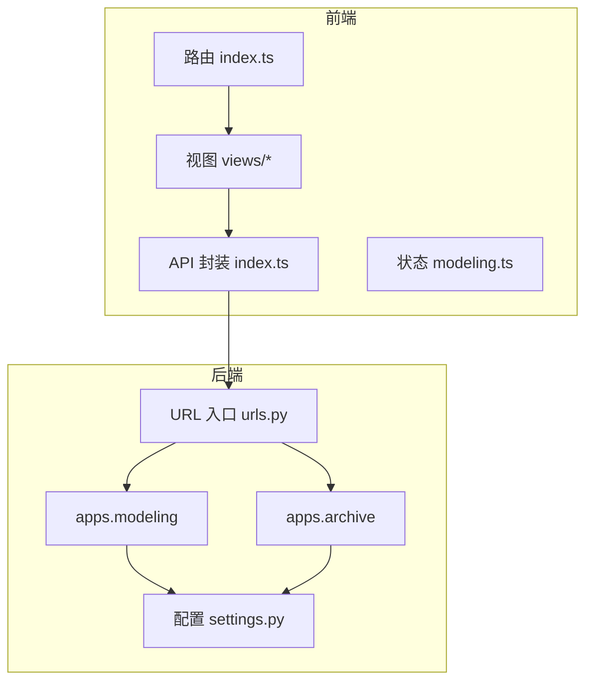
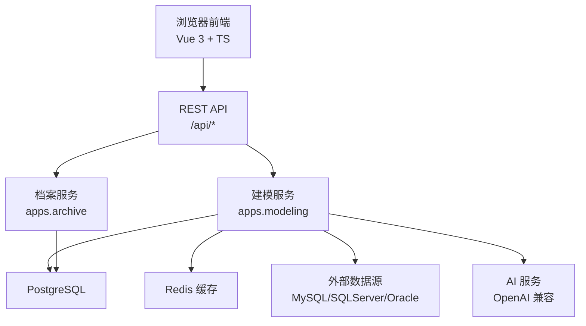
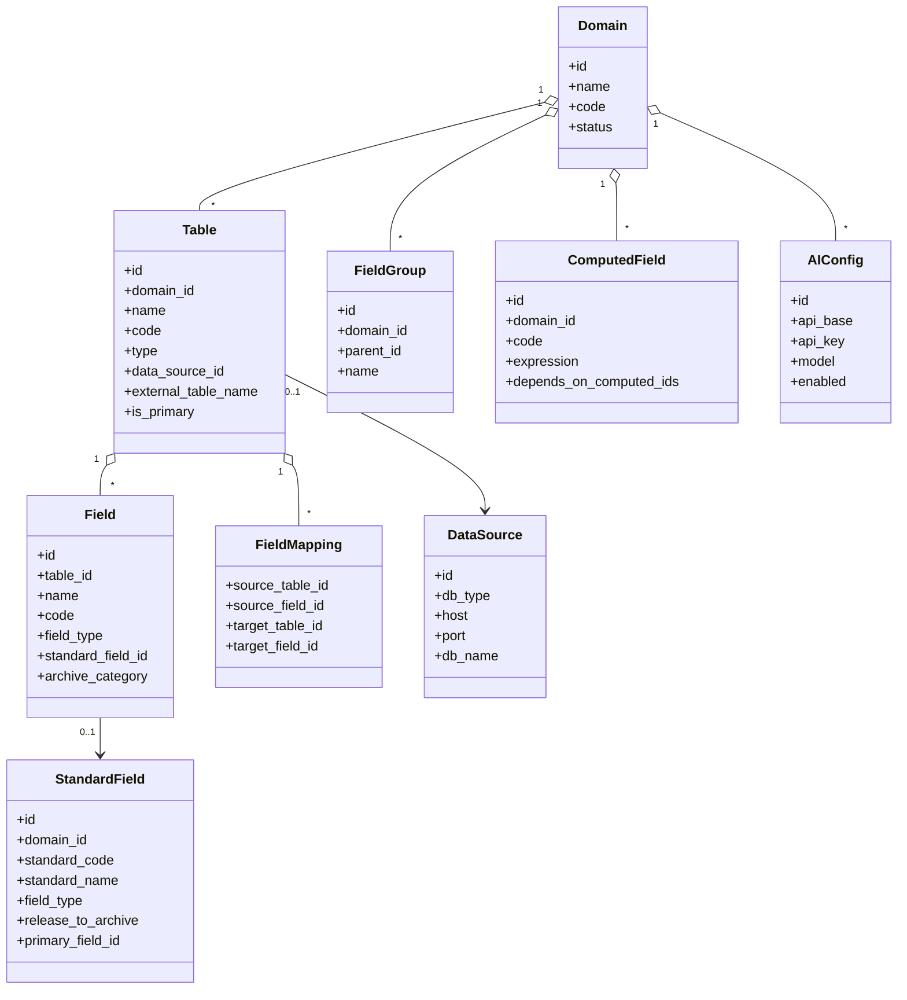
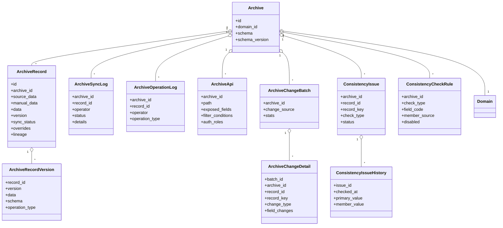
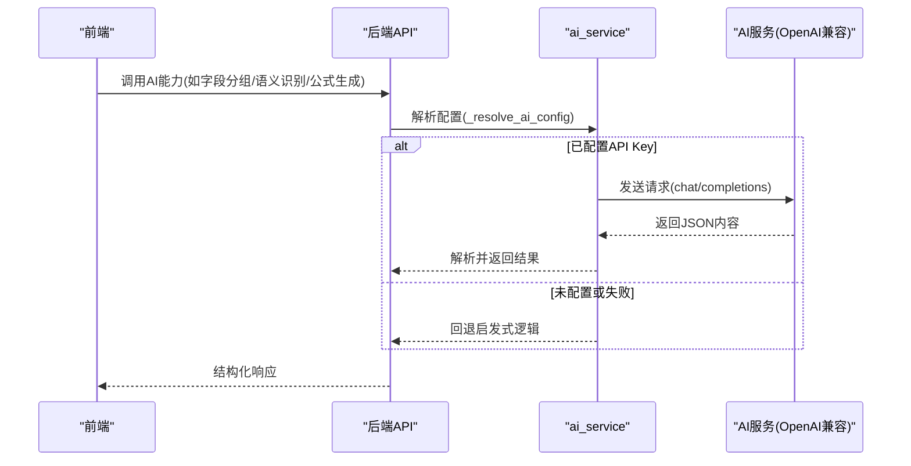
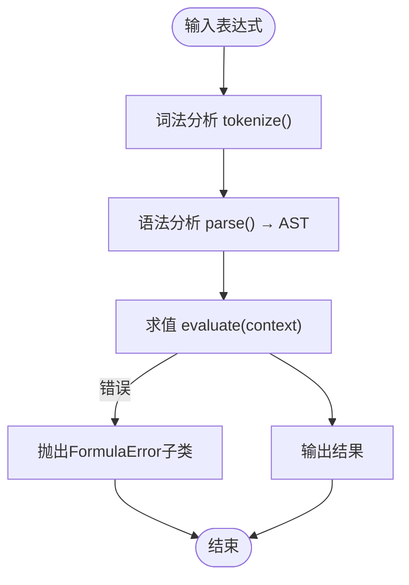
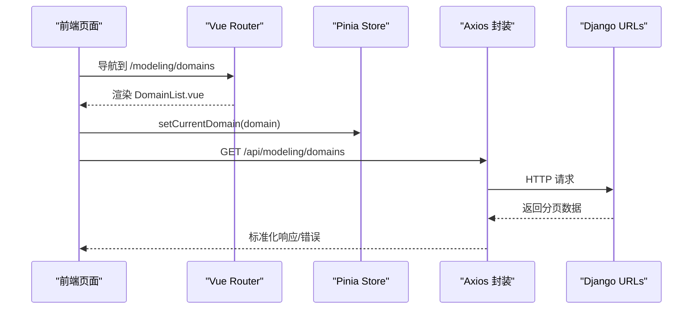
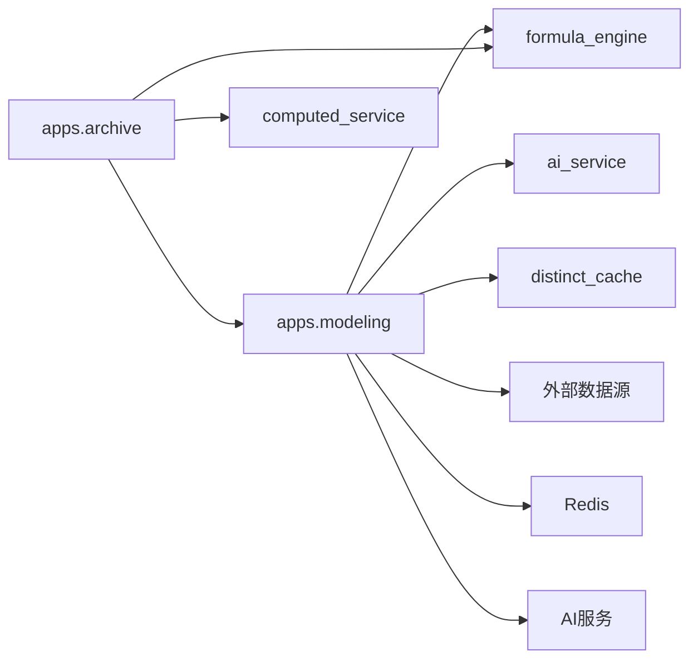

# 整体架构

<cite>
**本文引用的文件**   
- [backend/config/settings.py](file://backend/config/settings.py)
- [backend/config/urls.py](file://backend/config/urls.py)
- [backend/apps/modeling/models.py](file://backend/apps/modeling/models.py)
- [backend/apps/archive/models.py](file://backend/apps/archive/models.py)
- [backend/apps/modeling/views.py](file://backend/apps/modeling/views.py)
- [backend/apps/archive/views.py](file://backend/apps/archive/views.py)
- [backend/apps/modeling/ai_service.py](file://backend/apps/modeling/ai_service.py)
- [backend/apps/modeling/formula_engine.py](file://backend/apps/modeling/formula_engine.py)
- [backend/apps/modeling/computed_service.py](file://backend/apps/modeling/computed_service.py)
- [frontend/src/router/index.ts](file://frontend/src/router/index.ts)
- [frontend/src/api/index.ts](file://frontend/src/api/index.ts)
- [frontend/src/stores/modeling.ts](file://frontend/src/stores/modeling.ts)
- [frontend/src/types/index.ts](file://frontend/src/types/index.ts)
</cite>

## 目录
1. [简介](#简介)
2. [项目结构](#项目结构)
3. [核心组件](#核心组件)
4. [架构总览](#架构总览)
5. [详细组件分析](#详细组件分析)
6. [依赖关系分析](#依赖关系分析)
7. [性能考量](#性能考量)
8. [故障排查指南](#故障排查指南)
9. [结论](#结论)
10. [附录](#附录)

## 简介
本文件为 MetaData002 系统整体架构文档，面向开发者与实施人员，阐述前后端分离、微服务倾向的模块化设计。后端基于 Django + DRF，提供建模与档案两大业务域；前端采用 Vue 3 + TypeScript + Ant Design Vue，通过 REST API 与后端交互。系统围绕“数据建模—档案管理—AI智能服务—计算引擎”四大核心能力展开，强调概念层（标准字段）与物理层的解耦、Hub 式主数据治理、以及可插拔的外部数据源接入。

## 项目结构
- 后端 backend
  - config：Django 配置、路由入口、WSGI
  - apps.modeling：数据建模域（域、表、字段、标准字段、映射、AI 配置、计算字段等）
  - apps.archive：档案管理域（档案配置、记录、版本、同步日志、变更批次/明细、一致性检查等）
- 前端 frontend
  - src/router：页面路由
  - src/api：Axios 封装与各模块 API 调用
  - src/stores：Pinia 状态管理
  - src/views：页面视图（建模、档案、设置）
  - src/types：TypeScript 类型定义

图表来源 
- [backend/config/urls.py:1-9](file://backend/config/urls.py#L1-L9)
- [backend/config/settings.py:10-24](file://backend/config/settings.py#L10-L24)
- [frontend/src/router/index.ts:1-45](file://frontend/src/router/index.ts#L1-L45)
- [frontend/src/api/index.ts:1-22](file://frontend/src/api/index.ts#L1-L22)

章节来源
- [backend/config/urls.py:1-9](file://backend/config/urls.py#L1-L9)
- [backend/config/settings.py:10-24](file://backend/config/settings.py#L10-L24)
- [frontend/src/router/index.ts:1-45](file://frontend/src/router/index.ts#L1-L45)
- [frontend/src/api/index.ts:1-22](file://frontend/src/api/index.ts#L1-L22)

## 核心组件
- 数据建模模块
  - 领域模型：Domain、Table、Field、FieldGroup、StandardField、FieldMapping、ComputedField、DataSource、AIConfig
  - 职责：概念层（标准字段）与物理层（字段）解耦；跨表去重与组合字段；Excel 风格公式计算字段；外部数据源元数据同步
- 档案管理模块
  - 领域模型：Archive、ArchiveRecord、ArchiveRecordVersion、ArchiveSyncLog、ArchiveOperationLog、ArchiveApi、ArchiveChangeBatch、ArchiveChangeDetail、ConsistencyIssue、ConsistencyCheckRule、ConsistencyIssueHistory
  - 职责：Schema 快照与版本化；双层存储（source_data + manual_data）；合并策略与血缘追踪；一致性检查与差异闭环
- AI 智能服务
  - 能力：字段自动分组、语义识别（注释补全/同义歧义）、跨表去重检测、Excel 字段推断、自然语言生成计算表达式、表间映射建议
  - 特性：OpenAI 兼容接口优先，失败回退启发式；提示词可配置
- 计算引擎
  - 能力：Excel 风格公式解析器（词法/语法/AST/求值）、函数库注册与扩展、DAG 拓扑排序与循环依赖检测、批量重算与影响范围重算、枚举试算与预览

章节来源
- [backend/apps/modeling/models.py:1-489](file://backend/apps/modeling/models.py#L1-L489)
- [backend/apps/archive/models.py:1-379](file://backend/apps/archive/models.py#L1-L379)
- [backend/apps/modeling/ai_service.py:1-917](file://backend/apps/modeling/ai_service.py#L1-L917)
- [backend/apps/modeling/formula_engine.py:1-867](file://backend/apps/modeling/formula_engine.py#L1-L867)
- [backend/apps/modeling/computed_service.py:1-630](file://backend/apps/modeling/computed_service.py#L1-L630)

## 架构总览
系统采用前后端分离与模块化设计，后端按业务域拆分为 modeling 与 archive 两个应用，通过统一 URL 前缀对外暴露 REST API。前端以 Vue Router 组织页面，使用 Axios 封装统一请求拦截与错误处理，Pinia 维护全局状态。

图表来源 
- [backend/config/urls.py:1-9](file://backend/config/urls.py#L1-L9)
- [backend/config/settings.py:56-74](file://backend/config/settings.py#L56-L74)
- [backend/apps/modeling/views.py:31-147](file://backend/apps/modeling/views.py#L31-L147)
- [backend/apps/modeling/ai_service.py:19-49](file://backend/apps/modeling/ai_service.py#L19-L49)

章节来源
- [backend/config/urls.py:1-9](file://backend/config/urls.py#L1-L9)
- [backend/config/settings.py:56-74](file://backend/config/settings.py#L56-L74)

## 详细组件分析

### 数据建模模块
- 关键实体与关系
  - Domain → Table → Field（含 StandardField 关联）
  - FieldGroup 多层分组
  - FieldMapping 表间关系
  - ComputedField 依赖物理字段与其他计算字段
  - DataSource 多数据库类型支持
  - AIConfig 单例配置

图表来源 
- [backend/apps/modeling/models.py:32-123](file://backend/apps/modeling/models.py#L32-L123)
- [backend/apps/modeling/models.py:125-160](file://backend/apps/modeling/models.py#L125-L160)
- [backend/apps/modeling/models.py:162-300](file://backend/apps/modeling/models.py#L162-L300)
- [backend/apps/modeling/models.py:301-385](file://backend/apps/modeling/models.py#L301-L385)
- [backend/apps/modeling/models.py:387-419](file://backend/apps/modeling/models.py#L387-L419)
- [backend/apps/modeling/models.py:421-472](file://backend/apps/modeling/models.py#L421-L472)
- [backend/apps/modeling/models.py:474-489](file://backend/apps/modeling/models.py#L474-L489)

章节来源
- [backend/apps/modeling/models.py:1-489](file://backend/apps/modeling/models.py#L1-L489)

### 档案管理模块
- 关键实体与关系
  - Archive 与 Domain OneToOne
  - ArchiveRecord 双层存储 source_data/manual_data，合并后写入 data
  - ArchiveRecordVersion 版本快照
  - ArchiveSyncLog / ArchiveOperationLog 操作与同步日志
  - ArchiveApi 开放档案数据
  - ArchiveChangeBatch / ArchiveChangeDetail 变更批次与明细
  - ConsistencyIssue / ConsistencyCheckRule / ConsistencyIssueHistory 一致性检查与历史

图表来源 
- [backend/apps/archive/models.py:5-31](file://backend/apps/archive/models.py#L5-L31)
- [backend/apps/archive/models.py:33-73](file://backend/apps/archive/models.py#L33-L73)
- [backend/apps/archive/models.py:75-110](file://backend/apps/archive/models.py#L75-L110)
- [backend/apps/archive/models.py:112-137](file://backend/apps/archive/models.py#L112-L137)
- [backend/apps/archive/models.py:139-172](file://backend/apps/archive/models.py#L139-L172)
- [backend/apps/archive/models.py:174-204](file://backend/apps/archive/models.py#L174-L204)
- [backend/apps/archive/models.py:206-233](file://backend/apps/archive/models.py#L206-L233)
- [backend/apps/archive/models.py:235-272](file://backend/apps/archive/models.py#L235-L272)
- [backend/apps/archive/models.py:274-332](file://backend/apps/archive/models.py#L274-L332)
- [backend/apps/archive/models.py:334-362](file://backend/apps/archive/models.py#L334-L362)
- [backend/apps/archive/models.py:364-379](file://backend/apps/archive/models.py#L364-L379)

章节来源
- [backend/apps/archive/models.py:1-379](file://backend/apps/archive/models.py#L1-L379)

### AI 智能服务
- 功能要点
  - 连接解析：优先读取 AIConfig（enabled=True），回退到环境变量
  - 大模型调用：OpenAI 兼容 chat/completions，返回 JSON
  - 降级策略：无密钥或调用失败时启用启发式模拟
  - 能力：自动分组、语义识别、跨表去重、Excel 字段推断、自然语言生成公式、映射建议

图表来源 
- [backend/apps/modeling/ai_service.py:19-49](file://backend/apps/modeling/ai_service.py#L19-L49)
- [backend/apps/modeling/ai_service.py:56-76](file://backend/apps/modeling/ai_service.py#L56-L76)
- [backend/apps/modeling/ai_service.py:558-747](file://backend/apps/modeling/ai_service.py#L558-L747)

章节来源
- [backend/apps/modeling/ai_service.py:1-917](file://backend/apps/modeling/ai_service.py#L1-L917)

### 计算引擎
- 能力要点
  - 词法分析 tokenize：支持数字、字符串、布尔、引用{表.字段}、函数、运算符
  - 语法分析 Parser：递归下降构建 AST
  - 求值器 eval_node：上下文查找、二元运算、函数调用（IFERROR惰性求值）
  - 函数库：逻辑、文本、数学、判空、日期等函数注册
  - DAG 与重算：依赖解析、拓扑排序、循环检测、批量重算、影响范围重算、枚举试算与预览

图表来源 
- [backend/apps/modeling/formula_engine.py:99-197](file://backend/apps/modeling/formula_engine.py#L99-L197)
- [backend/apps/modeling/formula_engine.py:253-366](file://backend/apps/modeling/formula_engine.py#L253-L366)
- [backend/apps/modeling/formula_engine.py:669-768](file://backend/apps/modeling/formula_engine.py#L669-L768)

章节来源
- [backend/apps/modeling/formula_engine.py:1-867](file://backend/apps/modeling/formula_engine.py#L1-L867)
- [backend/apps/modeling/computed_service.py:1-630](file://backend/apps/modeling/computed_service.py#L1-L630)

### 前端通信机制
- Axios 封装：统一 baseURL=/api，超时与响应拦截，错误对象携带原始 response
- 路由：Vue Router 定义建模、档案、设置三大模块子路由
- 状态：Pinia store 维护当前域等全局状态
- 类型：TS 类型覆盖所有前后端数据结构

图表来源 
- [frontend/src/router/index.ts:1-45](file://frontend/src/router/index.ts#L1-L45)
- [frontend/src/api/index.ts:1-22](file://frontend/src/api/index.ts#L1-L22)
- [frontend/src/stores/modeling.ts:1-14](file://frontend/src/stores/modeling.ts#L1-L14)
- [backend/config/urls.py:1-9](file://backend/config/urls.py#L1-L9)

章节来源
- [frontend/src/router/index.ts:1-45](file://frontend/src/router/index.ts#L1-L45)
- [frontend/src/api/index.ts:1-22](file://frontend/src/api/index.ts#L1-L22)
- [frontend/src/stores/modeling.ts:1-14](file://frontend/src/stores/modeling.ts#L1-L14)
- [frontend/src/types/index.ts:1-388](file://frontend/src/types/index.ts#L1-L388)

## 依赖关系分析
- 模块耦合
  - 建模与档案通过 Domain 与 Schema 解耦；档案侧对建模侧仅依赖模型结构与标准字段
  - AI 服务作为建模域的增强能力，不侵入核心流程，具备降级保障
  - 计算引擎独立于业务，通过 ComputedField 与档案记录数据上下文交互
- 外部集成点
  - 多数据库类型动态连接（PostgreSQL/MySQL/SQLServer/Oracle）
  - Redis 缓存（distinct_values 缓存、通用缓存）
  - OpenAI 兼容 LLM（可配置提示词）
- 扩展点
  - 公式函数注册 register_function
  - 数据源引擎映射 ENGINE_MAP
  - 一致性检查规则失效配置

图表来源 
- [backend/apps/modeling/views.py:31-147](file://backend/apps/modeling/views.py#L31-L147)
- [backend/apps/modeling/formula_engine.py:372-387](file://backend/apps/modeling/formula_engine.py#L372-L387)
- [backend/apps/modeling/ai_service.py:19-49](file://backend/apps/modeling/ai_service.py#L19-L49)
- [backend/config/settings.py:68-74](file://backend/config/settings.py#L68-L74)

章节来源
- [backend/apps/modeling/views.py:1-800](file://backend/apps/modeling/views.py#L1-L800)
- [backend/apps/modeling/formula_engine.py:1-867](file://backend/apps/modeling/formula_engine.py#L1-L867)
- [backend/apps/modeling/ai_service.py:1-917](file://backend/apps/modeling/ai_service.py#L1-L917)
- [backend/config/settings.py:68-74](file://backend/config/settings.py#L68-L74)

## 性能考量
- 数据库连接与查询
  - 动态连接别名避免冲突，按需创建与释放
  - 数据预览限制行数（默认100，最大500）
- 缓存
  - distinct_values 缓存上限100条，减少重复采样
  - Redis 作为通用缓存
- 计算字段
  - DAG 拓扑排序保证执行顺序，避免重复计算
  - 批量重算与影响范围重算降低开销
- 一致性检查
  - 规则失效配置减少无效差异统计
  - 历史快照保留变化轨迹，便于审计

[本节为通用指导，不直接分析具体文件]

## 故障排查指南
- 数据源连接失败
  - 检查 db_type 是否受支持，驱动与参数是否正确
  - 查看 test-connection 接口返回的错误信息
- AI 服务不可用
  - 确认 AI_API_KEY 与 AI_API_BASE 配置
  - 若失败将回退启发式，不影响基本功能
- 公式语法错误
  - 使用 validate_expression 预检，定位错误位置与原因
  - 检查函数参数个数与类型
- 一致性差异持续存在
  - 检查 ConsistencyCheckRule 是否失效
  - 查看 ConsistencyIssueHistory 历史轨迹

章节来源
- [backend/apps/modeling/views.py:74-147](file://backend/apps/modeling/views.py#L74-L147)
- [backend/apps/modeling/ai_service.py:78-90](file://backend/apps/modeling/ai_service.py#L78-L90)
- [backend/apps/modeling/formula_engine.py:798-867](file://backend/apps/modeling/formula_engine.py#L798-L867)
- [backend/apps/archive/models.py:274-379](file://backend/apps/archive/models.py#L274-L379)

## 结论
MetaData002 通过清晰的前后端分离与模块化设计，实现了主数据建模与档案管理的完整闭环。AI 智能服务与计算引擎增强了建模效率与数据价值挖掘。系统在扩展性、稳定性与可观测性方面均有良好实践，适合企业级主数据平台建设。

[本节为总结，不直接分析具体文件]

## 附录
- 系统边界
  - 内部：建模域、档案域、AI 服务、计算引擎
  - 外部：多数据库、Redis、OpenAI 兼容 LLM
- 外部系统集成点
  - 数据源连接（PostgreSQL/MySQL/SQLServer/Oracle）
  - AI 服务（OpenAI 兼容）
- 扩展点设计
  - 公式函数注册
  - 数据源引擎映射
  - 一致性检查规则失效配置

[本节为补充说明，不直接分析具体文件]