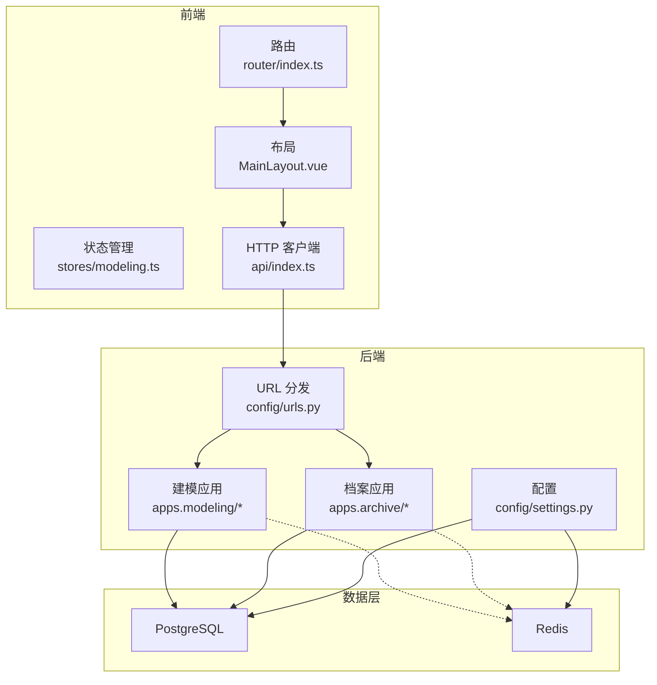
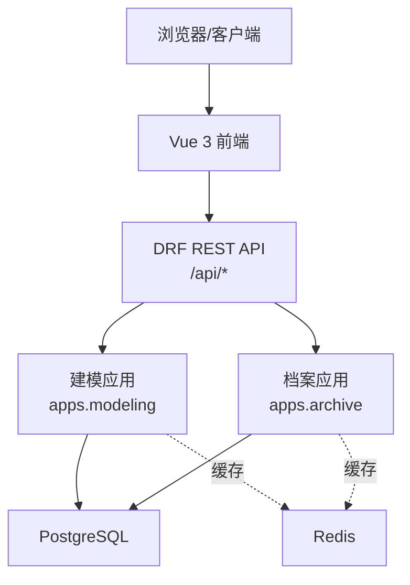
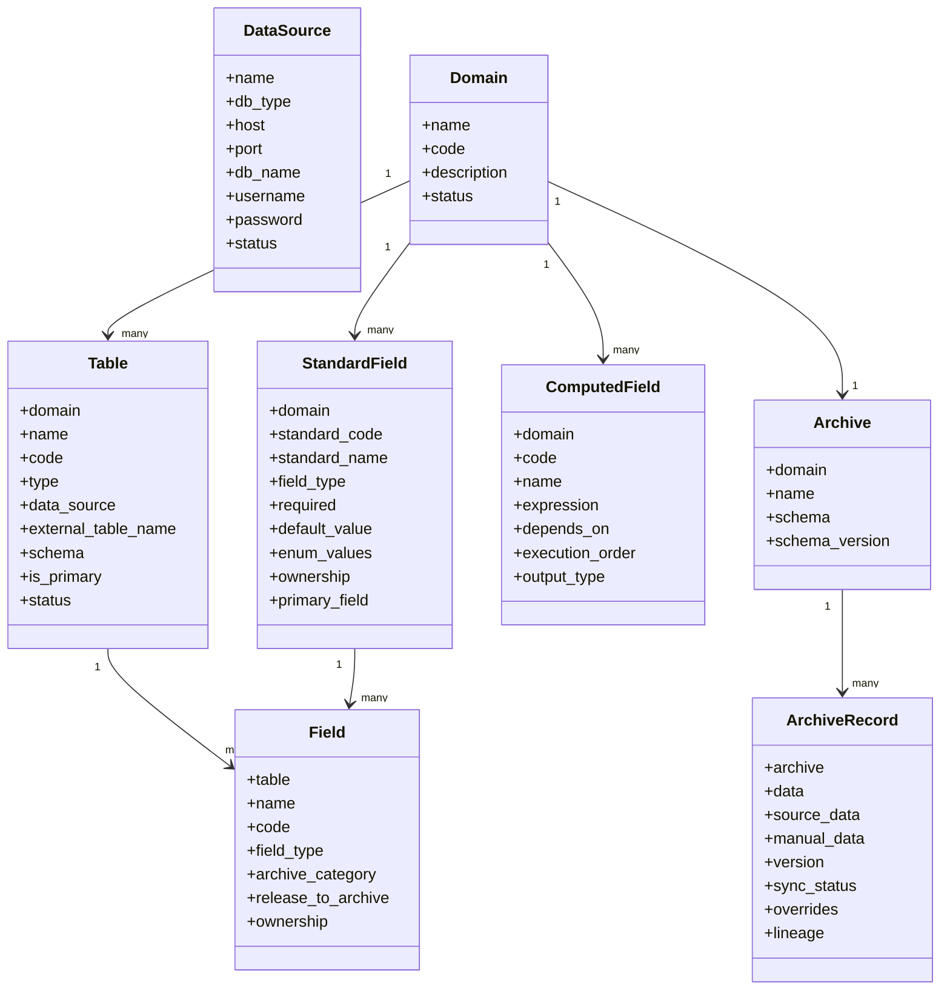
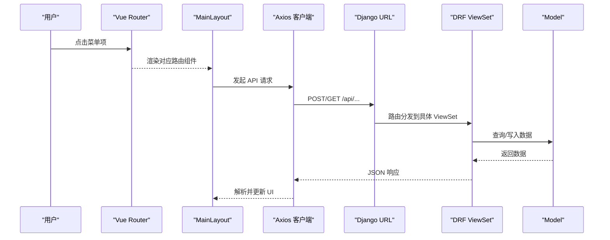
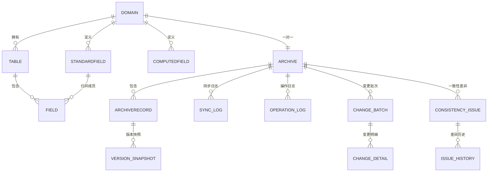
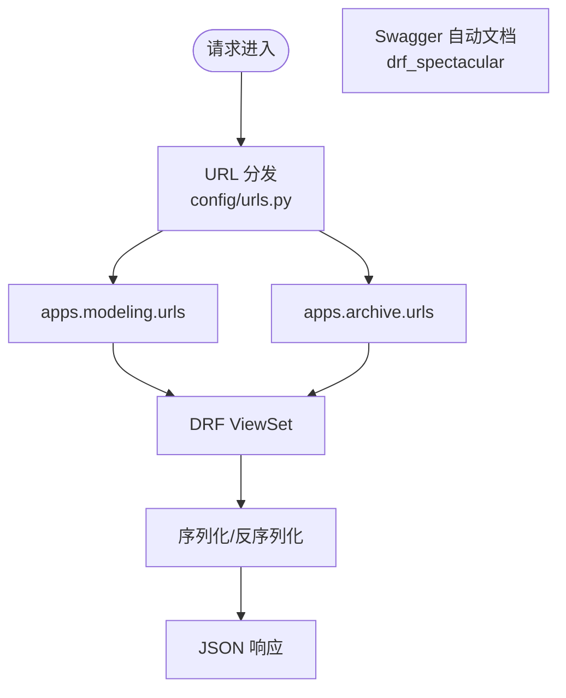
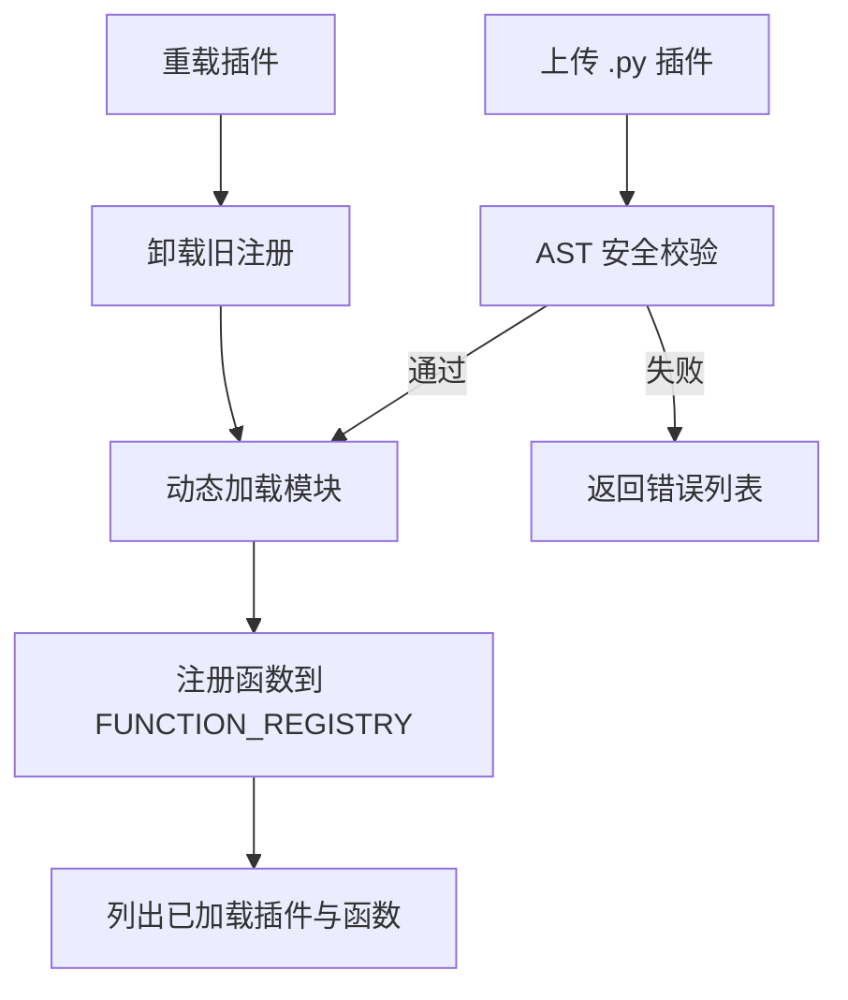
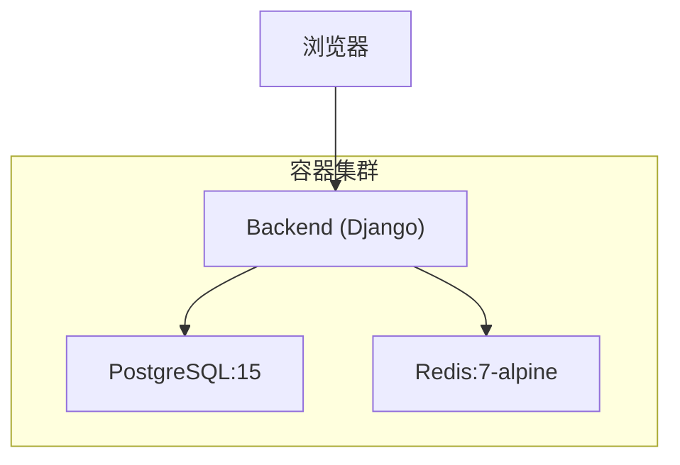
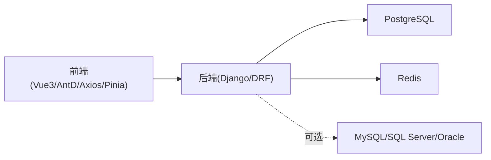

# 架构设计

<cite>
**本文引用的文件**   
- [backend/config/settings.py](file://backend/config/settings.py)
- [backend/config/urls.py](file://backend/config/urls.py)
- [backend/apps/modeling/models.py](file://backend/apps/modeling/models.py)
- [backend/apps/archive/models.py](file://backend/apps/archive/models.py)
- [backend/apps/modeling/views.py](file://backend/apps/modeling/views.py)
- [backend/apps/archive/views.py](file://backend/apps/archive/views.py)
- [backend/apps/modeling/plugin_loader.py](file://backend/apps/modeling/plugin_loader.py)
- [backend/apps/modeling/custom_functions.py](file://backend/apps/modeling/custom_functions.py)
- [frontend/src/router/index.ts](file://frontend/src/router/index.ts)
- [frontend/src/layouts/MainLayout.vue](file://frontend/src/layouts/MainLayout.vue)
- [frontend/src/stores/modeling.ts](file://frontend/src/stores/modeling.ts)
- [frontend/src/api/index.ts](file://frontend/src/api/index.ts)
- [backend/Dockerfile](file://backend/Dockerfile)
- [backend/docker-compose.yml](file://backend/docker-compose.yml)
- [frontend/package.json](file://frontend/package.json)
</cite>

## 目录
1. [简介](#简介)
2. [项目结构](#项目结构)
3. [核心组件](#核心组件)
4. [架构总览](#架构总览)
5. [详细组件分析](#详细组件分析)
6. [依赖关系分析](#依赖关系分析)
7. [性能考虑](#性能考虑)
8. [故障排查指南](#故障排查指南)
9. [结论](#结论)
10. [附录](#附录)

## 简介
本文件为 MetaData002 主数据管理系统的架构设计文档。系统采用前后端分离与微服务倾向的模块化架构：后端基于 Django + DRF，提供 RESTful API 与 Swagger/OpenAPI 文档；前端基于 Vue 3 + Vite + Ant Design Vue，使用 Pinia 进行状态管理、Vue Router 进行路由组织。数据存储以 PostgreSQL 为主，Redis 用于缓存。系统支持多数据源接入、档案化建模、计算字段、一致性检查、版本快照与变更审计，并提供插件机制扩展自定义函数。

## 项目结构
- 后端（Django）
  - 应用层：apps.modeling（建模域）、apps.archive（档案域）
  - 配置层：config.settings、config.urls、config.wsgi
  - 部署：Dockerfile、docker-compose.yml
- 前端（Vue 3）
  - 路由：router/index.ts
  - 布局与页面：layouts、views
  - 状态：stores（Pinia）
  - API 客户端：api/index.ts（axios 封装）
  - 构建：package.json、vite.config.ts

**图表来源** 
- [backend/config/urls.py:1-9](file://backend/config/urls.py#L1-L9)
- [backend/config/settings.py:56-74](file://backend/config/settings.py#L56-L74)
- [frontend/src/router/index.ts:1-45](file://frontend/src/router/index.ts#L1-L45)
- [frontend/src/layouts/MainLayout.vue:1-162](file://frontend/src/layouts/MainLayout.vue#L1-L162)
- [frontend/src/stores/modeling.ts:1-14](file://frontend/src/stores/modeling.ts#L1-L14)
- [frontend/src/api/index.ts:1-22](file://frontend/src/api/index.ts#L1-L22)

**章节来源**
- [backend/config/urls.py:1-9](file://backend/config/urls.py#L1-L9)
- [backend/config/settings.py:10-24](file://backend/config/settings.py#L10-L24)
- [frontend/src/router/index.ts:1-45](file://frontend/src/router/index.ts#L1-L45)
- [frontend/package.json:1-29](file://frontend/package.json#L1-L29)

## 核心组件
- 建模域（apps.modeling）
  - 模型：DataSource、Domain、Table、FieldGroup、StandardField、Field、FieldOption、AIConfig、ComputedField、FieldMapping
  - 视图：数据源连接测试、Schema/外部表枚举、表 CRUD、预览数据、域配置校验等
  - 插件：技术函数动态加载器与内置函数注册
- 档案域（apps.archive）
  - 模型：Archive、ArchiveRecord、ArchiveRecordVersion、ArchiveSyncLog、ArchiveOperationLog、ArchiveApi、ArchiveChangeBatch、ArchiveChangeDetail、ConsistencyIssue、ConsistencyCheckRule、ConsistencyIssueHistory
  - 视图：Schema 同步、数据刷新预检与执行、一致性检查、版本回滚、操作日志等
- 配置与集成
  - Django Settings：数据库、Redis、DRF、Swagger、AI 接口参数
  - URL 路由：统一 /api 前缀，按应用拆分子路由
- 前端
  - 路由：按“建模/档案/设置”三大模块划分
  - 布局：侧边菜单+面包屑+用户信息
  - 状态：Pinia 存储当前域上下文
  - HTTP：Axios 拦截错误并透传结构化响应

**章节来源**
- [backend/apps/modeling/models.py:1-489](file://backend/apps/modeling/models.py#L1-L489)
- [backend/apps/archive/models.py:1-379](file://backend/apps/archive/models.py#L1-L379)
- [backend/apps/modeling/views.py:1-800](file://backend/apps/modeling/views.py#L1-L800)
- [backend/apps/archive/views.py:1-800](file://backend/apps/archive/views.py#L1-L800)
- [backend/config/settings.py:91-107](file://backend/config/settings.py#L91-L107)
- [frontend/src/router/index.ts:1-45](file://frontend/src/router/index.ts#L1-L45)
- [frontend/src/layouts/MainLayout.vue:1-162](file://frontend/src/layouts/MainLayout.vue#L1-L162)
- [frontend/src/stores/modeling.ts:1-14](file://frontend/src/stores/modeling.ts#L1-L14)
- [frontend/src/api/index.ts:1-22](file://frontend/src/api/index.ts#L1-L22)

## 架构总览
系统采用前后端分离与模块化分层：
- 前端：Vue 3 SPA，通过 Axios 调用后端 /api 下的 RESTful 接口
- 后端：Django 应用按领域拆分为 modeling 与 archive，各自包含 models、serializers、views、urls
- 数据层：PostgreSQL 作为主存储，Redis 作为缓存（distinct 值缓存、通用缓存）
- 扩展点：技术函数插件机制（AST 安全校验 + 动态加载），公式引擎可扩展自定义函数
- 部署：容器化（Docker + docker-compose），开发环境一键启动 DB、Redis、Backend

**图表来源** 
- [backend/config/urls.py:1-9](file://backend/config/urls.py#L1-L9)
- [backend/config/settings.py:56-74](file://backend/config/settings.py#L56-L74)
- [frontend/src/api/index.ts:1-22](file://frontend/src/api/index.ts#L1-L22)

## 详细组件分析

### 后端分层架构（Django + DRF）
- 应用层（View/ViewSet）
  - 接收请求、参数校验、编排业务逻辑、返回序列化结果
  - 示例：数据源连接测试、Schema 枚举、表预览、档案 Schema 同步与数据刷新
- 业务逻辑层（Service/Helper）
  - 跨表合并、计算字段重算、一致性检查、版本快照生成、变更批次记录
  - 示例：_merge_record_data、_generate_schema_from_domain、一致性检查四类规则
- 数据访问层（Model/Migration）
  - 实体建模、约束、索引、JSON 字段、外键关系
  - 示例：标准字段与物理字段映射、档案双层存储（source_data + manual_data）

**图表来源** 
- [backend/apps/modeling/models.py:1-489](file://backend/apps/modeling/models.py#L1-L489)
- [backend/apps/archive/models.py:1-379](file://backend/apps/archive/models.py#L1-L379)

**章节来源**
- [backend/apps/modeling/views.py:1-800](file://backend/apps/modeling/views.py#L1-L800)
- [backend/apps/archive/views.py:1-800](file://backend/apps/archive/views.py#L1-L800)
- [backend/apps/modeling/models.py:1-489](file://backend/apps/modeling/models.py#L1-L489)
- [backend/apps/archive/models.py:1-379](file://backend/apps/archive/models.py#L1-L379)

### 前端组件化架构与状态管理
- 路由设计
  - 根路径重定向到建模域管理
  - 三大模块：/modeling、/archive、/settings，均挂载 MainLayout
- 布局与导航
  - 侧边栏菜单与面包屑联动路由元信息
  - 高亮匹配最长前缀，支持子路由父级回退
- 状态管理（Pinia）
  - useModelingStore 维护 currentDomain 上下文
- HTTP 客户端
  - axios 基础实例 baseURL=/api，超时与错误拦截，保留原始 response

**图表来源** 
- [frontend/src/router/index.ts:1-45](file://frontend/src/router/index.ts#L1-L45)
- [frontend/src/layouts/MainLayout.vue:1-162](file://frontend/src/layouts/MainLayout.vue#L1-L162)
- [frontend/src/api/index.ts:1-22](file://frontend/src/api/index.ts#L1-L22)
- [backend/config/urls.py:1-9](file://backend/config/urls.py#L1-L9)

**章节来源**
- [frontend/src/router/index.ts:1-45](file://frontend/src/router/index.ts#L1-L45)
- [frontend/src/layouts/MainLayout.vue:1-162](file://frontend/src/layouts/MainLayout.vue#L1-L162)
- [frontend/src/stores/modeling.ts:1-14](file://frontend/src/stores/modeling.ts#L1-L14)
- [frontend/src/api/index.ts:1-22](file://frontend/src/api/index.ts#L1-L22)

### 数据库架构设计（PostgreSQL + Redis）
- PostgreSQL
  - 主数据存储：建模与档案相关的所有实体与历史快照
  - 关键索引：变更记录、一致性差异、操作日志等高频查询字段
- Redis
  - 缓存策略：distinct 值缓存、通用缓存（CACHES 默认后端）
  - 用途：加速字段去重样本读取、热点数据缓存

**图表来源** 
- [backend/apps/modeling/models.py:1-489](file://backend/apps/modeling/models.py#L1-L489)
- [backend/apps/archive/models.py:1-379](file://backend/apps/archive/models.py#L1-L379)

**章节来源**
- [backend/config/settings.py:56-74](file://backend/config/settings.py#L56-L74)

### API 设计规范与 Swagger 集成
- RESTful 设计
  - 统一前缀 /api，按应用拆分子路由
  - 分页、过滤、搜索、排序由 DRF 中间件提供
- Swagger/OpenAPI
  - 使用 drf_spectacular 自动生成文档
  - 标题、描述、版本在 settings 中配置

**图表来源** 
- [backend/config/urls.py:1-9](file://backend/config/urls.py#L1-L9)
- [backend/config/settings.py:91-107](file://backend/config/settings.py#L91-L107)

**章节来源**
- [backend/config/settings.py:91-107](file://backend/config/settings.py#L91-L107)
- [backend/config/urls.py:1-9](file://backend/config/urls.py#L1-L9)

### 插件机制与自定义函数支持
- 插件加载器
  - AST 静态安全校验（白名单导入、禁止危险内建、禁止类定义与顶层控制流）
  - 动态加载 .py 插件，注册到公式引擎 FUNCTION_REGISTRY
  - 支持卸载、重载、列出已加载插件及函数清单
- 内置技术函数
  - 通过 @register_function 装饰器注册，参与表达式校验、求值、前端函数库展示与 AI 生成可用函数清单
- 安全策略
  - 限制网络、进程、IO、反射类访问，仅允许数学、正则、时间等安全模块

**图表来源** 
- [backend/apps/modeling/plugin_loader.py:1-288](file://backend/apps/modeling/plugin_loader.py#L1-L288)
- [backend/apps/modeling/custom_functions.py:1-108](file://backend/apps/modeling/custom_functions.py#L1-L108)

**章节来源**
- [backend/apps/modeling/plugin_loader.py:1-288](file://backend/apps/modeling/plugin_loader.py#L1-L288)
- [backend/apps/modeling/custom_functions.py:1-108](file://backend/apps/modeling/custom_functions.py#L1-L108)

### 部署架构图与容器化方案
- Dockerfile
  - 基于 python:3.12-slim，安装系统依赖与 Python 包
- docker-compose.yml
  - 服务：postgres、redis、backend
  - 环境变量：DB_*、REDIS_*、DEBUG
  - 健康检查：pg_isready、redis-cli ping
  - 卷：持久化 PostgreSQL 数据

**图表来源** 
- [backend/Dockerfile:1-20](file://backend/Dockerfile#L1-L20)
- [backend/docker-compose.yml:1-58](file://backend/docker-compose.yml#L1-L58)

**章节来源**
- [backend/Dockerfile:1-20](file://backend/Dockerfile#L1-L20)
- [backend/docker-compose.yml:1-58](file://backend/docker-compose.yml#L1-L58)

## 依赖关系分析
- 前端依赖
  - Vue 3、Ant Design Vue、Axios、Pinia、Vue Router、TypeScript、Vite
- 后端依赖
  - Django、DRF、django_filters、drf_spectacular、django_redis、PostgreSQL 驱动、可选 MySQL/SQL Server/Oracle 驱动
- 运行时依赖
  - PostgreSQL、Redis、Python 3.12

**图表来源** 
- [frontend/package.json:1-29](file://frontend/package.json#L1-L29)
- [backend/config/settings.py:10-24](file://backend/config/settings.py#L10-L24)
- [backend/config/settings.py:56-74](file://backend/config/settings.py#L56-L74)

**章节来源**
- [frontend/package.json:1-29](file://frontend/package.json#L1-L29)
- [backend/config/settings.py:10-24](file://backend/config/settings.py#L10-L24)
- [backend/config/settings.py:56-74](file://backend/config/settings.py#L56-L74)

## 性能考虑
- 数据库层面
  - 合理使用索引（变更记录、一致性差异、操作日志）
  - 避免 N+1 查询，使用 select_related/prefetch_related
  - 大对象 JSON 字段谨慎读写，必要时分表或归档
- 缓存层面
  - distinct 值缓存、热点 Schema/枚举缓存
  - 合理设置 TTL，避免脏读
- 计算字段
  - DAG 拓扑排序批量重算，减少重复计算
- API 层面
  - 分页、过滤、搜索、排序降低传输量
  - 异步任务（未来可引入 Celery）处理耗时同步与一致性检查

[本节为通用指导，不直接分析具体文件]

## 故障排查指南
- 数据源连接问题
  - 使用“测试连接”接口验证连通性与驱动兼容性
  - 检查主机、端口、用户名、密码、schema 与驱动选项
- 档案同步失败
  - 查看 sync-schema/refresh-data 返回的 sync_stats.errors
  - 核对主表主键、字段编码唯一性、组合字段主字段配置
- 一致性差异
  - 检查 composite_member、archive_source_diff、orphan_source_record、schema_drift 四类规则
  - 关注失效规则（disabled=True）是否影响统计
- 插件加载失败
  - 查看 AST 校验错误列表，修正语法与禁用导入
  - 确认函数通过 @register_function 正确注册

**章节来源**
- [backend/apps/modeling/views.py:1-800](file://backend/apps/modeling/views.py#L1-L800)
- [backend/apps/archive/views.py:1-800](file://backend/apps/archive/views.py#L1-L800)
- [backend/apps/modeling/plugin_loader.py:1-288](file://backend/apps/modeling/plugin_loader.py#L1-L288)

## 结论
MetaData002 通过清晰的领域拆分、稳健的数据建模与灵活的插件扩展，构建了可扩展的主数据管理平台。前后端分离与容器化部署提升了可维护性与交付效率。后续可在异步任务、权限与审计、质量规则等方面持续演进。

[本节为总结，不直接分析具体文件]

## 附录
- 环境变量与配置
  - DB_HOST、DB_PORT、DB_NAME、DB_USER、DB_PASSWORD
  - REDIS_HOST、REDIS_PORT
  - DEBUG、ALLOWED_HOSTS
  - AI_API_BASE、AI_API_KEY、AI_MODEL、AI_TIMEOUT
- 前端构建脚本
  - dev/build/preview 命令

**章节来源**
- [backend/config/settings.py:6-8](file://backend/config/settings.py#L6-L8)
- [backend/config/settings.py:56-74](file://backend/config/settings.py#L56-L74)
- [backend/config/settings.py:109-116](file://backend/config/settings.py#L109-L116)
- [frontend/package.json:1-29](file://frontend/package.json#L1-L29)