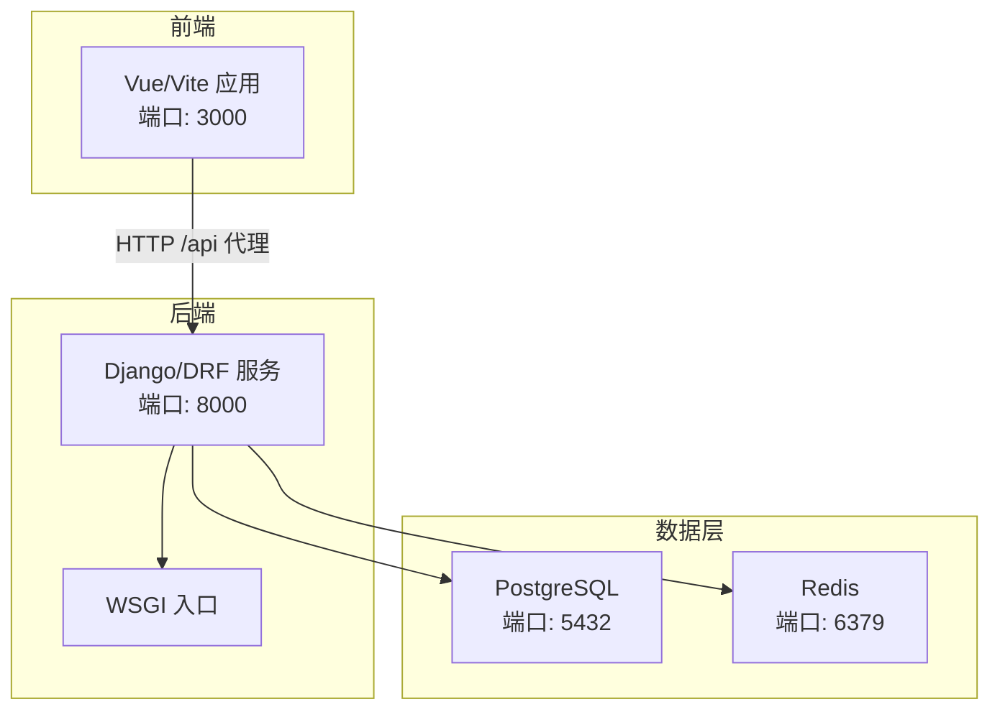
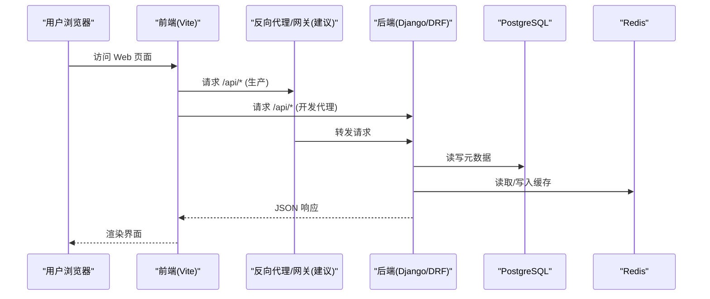
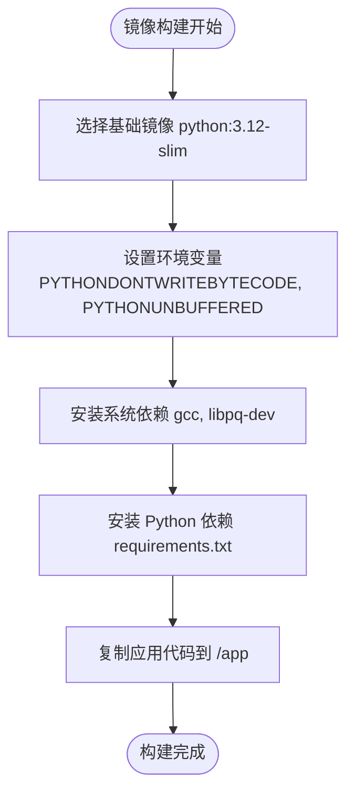
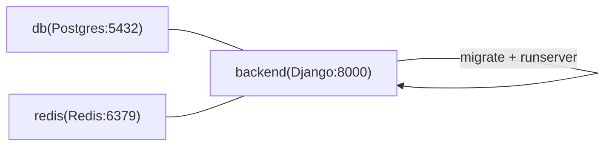
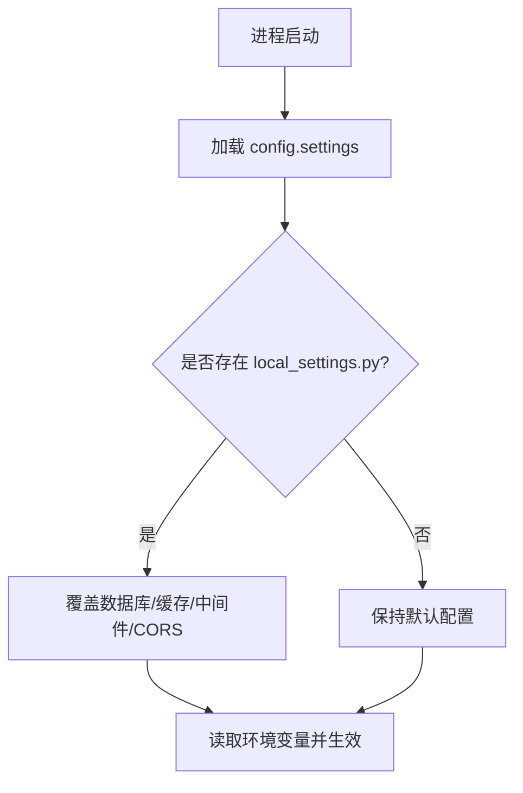
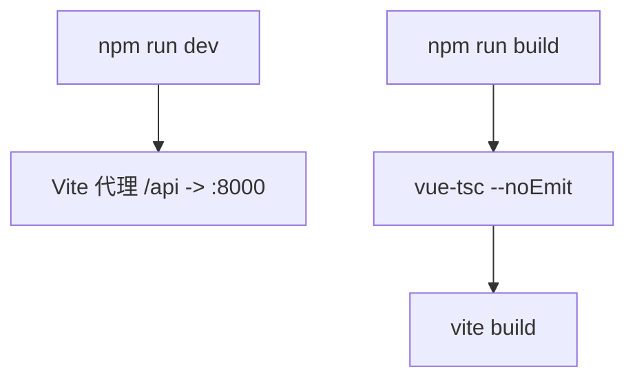
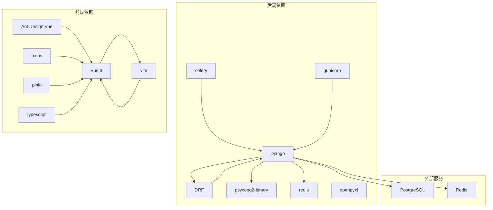
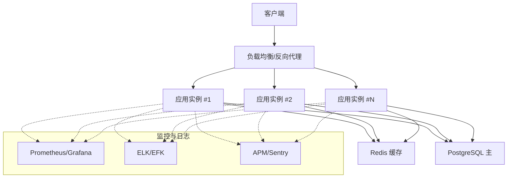

# 部署架构

<cite>
**本文引用的文件**   
- [backend/Dockerfile](file://backend/Dockerfile)
- [backend/docker-compose.yml](file://backend/docker-compose.yml)
- [backend/config/settings.py](file://backend/config/settings.py)
- [backend/local_settings.py](file://backend/local_settings.py)
- [backend/requirements.txt](file://backend/requirements.txt)
- [backend/config/wsgi.py](file://backend/config/wsgi.py)
- [frontend/package.json](file://frontend/package.json)
- [frontend/vite.config.ts](file://frontend/vite.config.ts)
- [scripts/check-all.ps1](file://scripts/check-all.ps1)
</cite>

## 目录
1. [简介](#简介)
2. [项目结构](#项目结构)
3. [核心组件](#核心组件)
4. [架构总览](#架构总览)
5. [详细组件分析](#详细组件分析)
6. [依赖关系分析](#依赖关系分析)
7. [性能考虑](#性能考虑)
8. [故障排查指南](#故障排查指南)
9. [结论](#结论)
10. [附录](#附录)

## 简介
本文件为 MetaData002 系统的部署架构文档，面向容器化部署、环境配置管理、生产拓扑、监控告警、CI/CD 流水线、安全加固与运维最佳实践。系统由后端（Django + DRF）、前端（Vue 3 + Vite）以及数据库（PostgreSQL）和缓存（Redis）组成，当前仓库提供了开发/本地环境的 Docker Compose 编排与基础镜像构建说明，可作为生产部署的基线方案进行扩展。

## 项目结构
- 后端：Python 3.12 镜像，基于 Django 5.x 与 DRF，使用 PostgreSQL 作为持久化存储，Redis 作为缓存；提供 Dockerfile 与 docker-compose.yml 用于本地快速启动。
- 前端：Vue 3 + TypeScript + Vite，默认开发端口 3000，并通过代理将 /api 请求转发至后端 8000 端口。
- 脚本：check-all.ps1 统一执行前后端检查与测试，便于在 CI 中集成。

**图表来源** 
- [backend/docker-compose.yml:1-58](file://backend/docker-compose.yml#L1-L58)
- [frontend/vite.config.ts:1-22](file://frontend/vite.config.ts#L1-L22)
- [backend/config/wsgi.py:1-6](file://backend/config/wsgi.py#L1-L6)

**章节来源**
- [backend/Dockerfile:1-20](file://backend/Dockerfile#L1-L20)
- [backend/docker-compose.yml:1-58](file://backend/docker-compose.yml#L1-L58)
- [frontend/vite.config.ts:1-22](file://frontend/vite.config.ts#L1-L22)

## 核心组件
- 后端服务：Django + DRF，通过 WSGI 暴露 HTTP API；数据库连接、缓存、鉴权、分页、API Schema 等均在 settings 中集中配置。
- 前端应用：Vite 开发服务器与构建产物，开发时通过反向代理访问后端 API。
- 数据与缓存：PostgreSQL 持久化元数据；Redis 作为缓存后端。
- 编排与镜像：Dockerfile 定义 Python 运行时与依赖安装；docker-compose.yml 编排 DB、Redis 与后端服务并设置健康检查与依赖顺序。

**章节来源**
- [backend/config/settings.py:1-123](file://backend/config/settings.py#L1-L123)
- [backend/config/wsgi.py:1-6](file://backend/config/wsgi.py#L1-L6)
- [backend/requirements.txt:1-11](file://backend/requirements.txt#L1-L11)
- [backend/Dockerfile:1-20](file://backend/Dockerfile#L1-L20)
- [backend/docker-compose.yml:1-58](file://backend/docker-compose.yml#L1-L58)

## 架构总览
下图展示从浏览器到后端、再到数据库与缓存的整体调用路径，以及开发环境与生产环境的差异点（如反向代理、负载均衡、多实例）。

**图表来源** 
- [frontend/vite.config.ts:12-21](file://frontend/vite.config.ts#L12-L21)
- [backend/docker-compose.yml:32-54](file://backend/docker-compose.yml#L32-L54)
- [backend/config/settings.py:56-74](file://backend/config/settings.py#L56-L74)

## 详细组件分析

### 容器镜像与运行环境（后端）
- 基础镜像：python:3.12-slim，启用 PYTHONDONTWRITEBYTECODE 与 PYTHONUNBUFFERED。
- 系统依赖：gcc、libpq-dev（PostgreSQL C 头文件），用于 psycopg2-binary 编译。
- Python 依赖：通过 requirements.txt 安装，包含 Django、DRF、psycopg2-binary、redis、celery、gunicorn、openpyxl 等。
- 工作目录：/app，代码复制后直接运行。

**图表来源** 
- [backend/Dockerfile:1-20](file://backend/Dockerfile#L1-L20)
- [backend/requirements.txt:1-11](file://backend/requirements.txt#L1-L11)

**章节来源**
- [backend/Dockerfile:1-20](file://backend/Dockerfile#L1-L20)
- [backend/requirements.txt:1-11](file://backend/requirements.txt#L1-L11)

### 容器编排与服务发现（docker-compose）
- 服务：db（PostgreSQL 15）、redis（Redis 7 Alpine）、backend（Django）。
- 健康检查：db 使用 pg_isready，redis 使用 redis-cli ping。
- 依赖顺序：backend 等待 db 与 redis 健康后再启动。
- 端口映射：db:5432、redis:6379、backend:8000（开发用途）。
- 卷：postgres_data 持久化数据库文件。

**图表来源** 
- [backend/docker-compose.yml:6-54](file://backend/docker-compose.yml#L6-L54)

**章节来源**
- [backend/docker-compose.yml:1-58](file://backend/docker-compose.yml#L1-L58)

### 环境配置管理（settings、local_settings、环境变量）
- 关键环境变量：
  - DJANGO_SECRET_KEY、DEBUG、ALLOWED_HOSTS
  - DB_*（名称、用户、密码、主机、端口）
  - REDIS_HOST、REDIS_PORT
  - AI_API_BASE、AI_API_KEY、AI_MODEL、AI_TIMEOUT
  - ARCHIVE_AUTO_REFRESH_MINUTES
- local_settings.py：覆盖数据库为 SQLite3、缓存为内存缓存、开启 CORS 中间件与允许所有源（仅开发）。
- settings.py：集中配置数据库、缓存、REST_FRAMEWORK、SPECTACULAR、中间件、模板、语言与时区等。

**图表来源** 
- [backend/config/settings.py:1-123](file://backend/config/settings.py#L1-L123)
- [backend/local_settings.py:1-26](file://backend/local_settings.py#L1-L26)

**章节来源**
- [backend/config/settings.py:1-123](file://backend/config/settings.py#L1-L123)
- [backend/local_settings.py:1-26](file://backend/local_settings.py#L1-L26)

### 前端开发与构建（Vite）
- 开发服务器：端口 3000，代理 /api 到 http://localhost:8000。
- 构建命令：vue-tsc 类型检查 + vite build 生成静态资源。
- 依赖：Vue 3、Ant Design Vue、Axios、Pinia、TypeScript、Vite 等。

**图表来源** 
- [frontend/vite.config.ts:12-21](file://frontend/vite.config.ts#L12-L21)
- [frontend/package.json:6-10](file://frontend/package.json#L6-L10)

**章节来源**
- [frontend/vite.config.ts:1-22](file://frontend/vite.config.ts#L1-L22)
- [frontend/package.json:1-29](file://frontend/package.json#L1-L29)

### WSGI 入口与运行方式
- wsgi.py 设置 DJANGO_SETTINGS_MODULE 并获取 application，供 gunicorn/uwsgi 等 WSGI 服务器使用。
- 当前 docker-compose 使用 manage.py runserver（开发），生产建议使用 gunicorn 并配合反向代理。

**章节来源**
- [backend/config/wsgi.py:1-6](file://backend/config/wsgi.py#L1-L6)

## 依赖关系分析
- 后端依赖：Django、DRF、django-filter、drf-spectacular、psycopg2-binary、redis、celery、gunicorn、openpyxl、python-dotenv。
- 前端依赖：Vue 3、Ant Design Vue、Axios、Pinia、TypeScript、Vite。
- 运行时依赖：PostgreSQL、Redis。

**图表来源** 
- [backend/requirements.txt:1-11](file://backend/requirements.txt#L1-L11)
- [frontend/package.json:11-27](file://frontend/package.json#L11-L27)

**章节来源**
- [backend/requirements.txt:1-11](file://backend/requirements.txt#L1-L11)
- [frontend/package.json:1-29](file://frontend/package.json#L1-L29)

## 性能考虑
- 数据库连接池：生产环境建议配置连接池参数（如 conn_max_age、CONN_MAX_AGE 或第三方库连接池），避免频繁建连。
- 缓存策略：Redis 作为默认缓存后端，合理设置 key 前缀与过期时间，热点数据优先命中缓存。
- 静态资源：生产构建后将静态资源交由 Nginx/对象存储托管，减少后端压力。
- 并发与水平扩展：使用 gunicorn 多 worker 模式，结合反向代理实现多实例横向扩展。
- 异步任务：引入 celery 处理耗时任务（如档案刷新、计算字段），避免阻塞请求线程。

[本节为通用指导，不直接分析具体文件]

## 故障排查指南
- 启动失败
  - 检查环境变量是否正确注入（DB_*、REDIS_*、DJANGO_SECRET_KEY、DEBUG、ALLOWED_HOSTS）。
  - 确认数据库与 Redis 健康检查通过，依赖服务已就绪。
  - 查看日志输出（确保 PYTHONUNBUFFERED=1 以便实时打印）。
- 数据库连接问题
  - 验证主机名、端口、用户名、密码与数据库名。
  - 检查网络连通性与防火墙规则。
- 缓存异常
  - 确认 Redis 地址与端口可达，客户端类配置正确。
- 前端无法访问 API
  - 开发环境检查 Vite 代理目标是否指向正确的后端端口。
  - 生产环境检查反向代理路由与跨域配置。
- 统一检查脚本
  - 使用 check-all.ps1 执行后端 Django check 与测试、前端 TypeScript 检查与构建，定位问题阶段。

**章节来源**
- [backend/docker-compose.yml:16-30](file://backend/docker-compose.yml#L16-L30)
- [backend/config/settings.py:56-74](file://backend/config/settings.py#L56-L74)
- [frontend/vite.config.ts:12-21](file://frontend/vite.config.ts#L12-L21)
- [scripts/check-all.ps1:42-76](file://scripts/check-all.ps1#L42-L76)

## 结论
当前仓库提供了可靠的开发/本地部署基线：Docker 镜像构建、Compose 编排、环境变量驱动的配置管理与前后端分离的开发体验。生产环境可在此基础上扩展反向代理、负载均衡、多实例高可用、监控告警与 CI/CD 自动化流程，以满足企业级稳定性与可观测性要求。

[本节为总结性内容，不直接分析具体文件]

## 附录

### 生产环境部署拓扑（建议）
- 反向代理：Nginx/Traefik/云厂商 LB，统一入口、HTTPS 终止、静态资源托管。
- 应用层：多副本 Django/Gunicorn 实例，无状态设计，会话外置（Redis）。
- 数据层：PostgreSQL 主从高可用（如 Patroni+Etcd），Redis 哨兵或集群。
- 任务队列：Celery Worker 独立部署，消息中间件（Redis/RabbitMQ）。
- 监控与日志：Prometheus + Grafana、ELK/EFK、APM（如 Sentry）。

[本图为概念性拓扑，不直接映射具体源码文件]

### 环境配置清单（示例键）
- 应用
  - DJANGO_SECRET_KEY、DEBUG、ALLOWED_HOSTS
  - REST_FRAMEWORK 相关（分页、过滤、Schema）
- 数据
  - DB_NAME、DB_USER、DB_PASSWORD、DB_HOST、DB_PORT
  - REDIS_HOST、REDIS_PORT
- AI 服务
  - AI_API_BASE、AI_API_KEY、AI_MODEL、AI_TIMEOUT
- 归档刷新
  - ARCHIVE_AUTO_REFRESH_MINUTES

**章节来源**
- [backend/config/settings.py:6-116](file://backend/config/settings.py#L6-L116)

### CI/CD 流水线设计（建议）
- 触发：代码推送/合并触发流水线。
- 步骤：
  - 安装依赖（后端 venv、前端 node_modules）。
  - 执行 check-all.ps1 统一检查（Django check、测试、TS 检查、构建）。
  - 构建镜像（backend Dockerfile）与前端静态资源。
  - 推送镜像到镜像仓库，更新编排配置。
  - 部署到目标环境（Staging → Production），灰度发布与健康检查。
- 回滚：保留历史镜像版本，一键回滚。

**章节来源**
- [scripts/check-all.ps1:42-76](file://scripts/check-all.ps1#L42-L76)
- [backend/Dockerfile:1-20](file://backend/Dockerfile#L1-L20)
- [frontend/package.json:6-10](file://frontend/package.json#L6-L10)

### 安全加固措施（建议）
- 密钥管理：使用环境变量或密钥管理服务注入敏感信息，禁止硬编码。
- 最小权限：容器以非 root 用户运行，限制文件系统权限。
- 网络安全：仅暴露必要端口，使用内网通信；生产启用 HTTPS。
- 访问控制：严格 ALLOWED_HOSTS，必要时启用认证与授权中间件。
- 依赖安全：定期扫描依赖漏洞，锁定版本。

[本节为通用指导，不直接分析具体文件]

### 运维最佳实践
- 健康检查：对 DB、Redis、应用均配置健康检查与探针。
- 日志规范：结构化日志，集中收集与检索。
- 容量规划：根据 QPS 与数据量评估 CPU/内存/磁盘/带宽。
- 备份恢复：数据库定时备份与演练恢复流程。
- 变更管理：灰度发布、蓝绿/金丝雀发布，变更回滚预案。

[本节为通用指导，不直接分析具体文件]