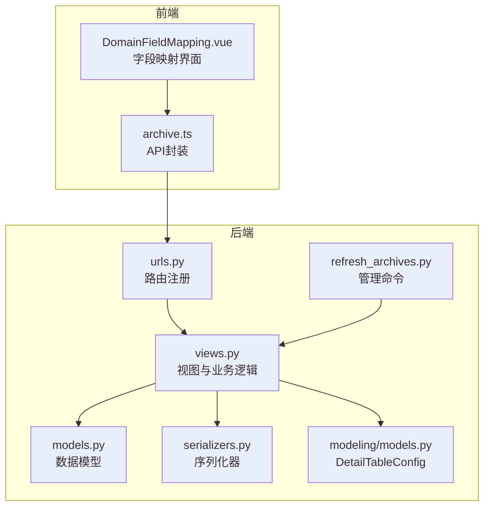
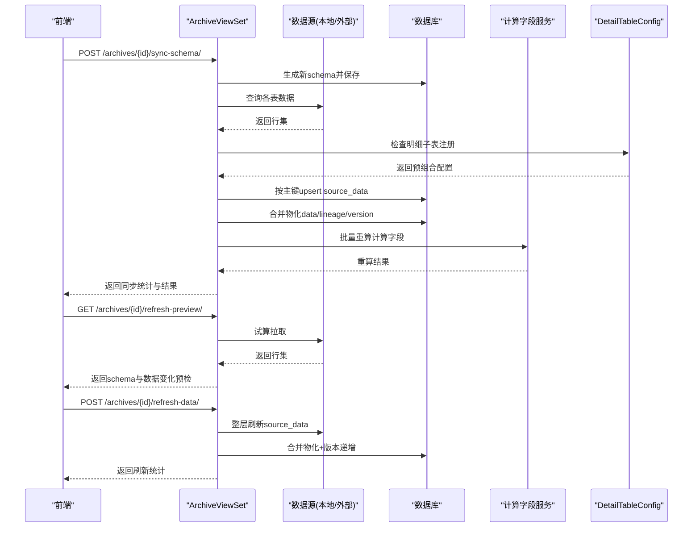
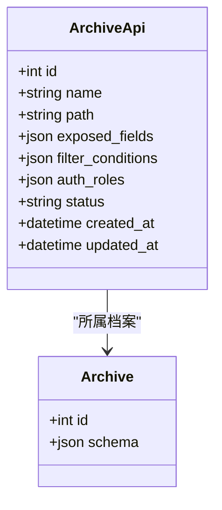
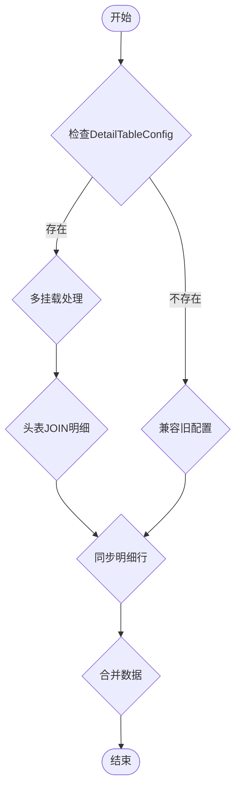
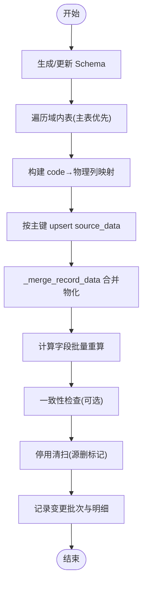
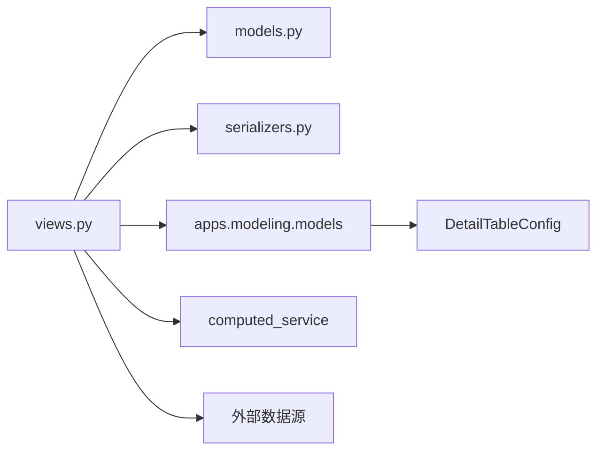

# API同步管理

<cite>
**本文引用的文件**   
- [models.py](file://backend/apps/archive/models.py)
- [views.py](file://backend/apps/archive/views.py)
- [serializers.py](file://backend/apps/archive/serializers.py)
- [urls.py](file://backend/apps/archive/urls.py)
- [refresh_archives.py](file://backend/apps/archive/management/commands/refresh_archives.py)
- [archive.ts](file://frontend/src/api/archive.ts)
- [DomainFieldMapping.vue](file://frontend/src/views/modeling/DomainFieldMapping.vue)
- [models.py](file://backend/apps/modeling/models.py)
</cite>

## 更新摘要
**变更内容**   
- 新增任意字段作为挂载点的档案同步机制，支持一对多归属场景
- 增强DetailTableConfig模型，支持预组合（头表+明细表）注册与多挂载
- 更新前端字段选择界面，移除主键强校验，支持任意字段作为挂载关联键
- 改进同步引擎，支持一子表多挂载和头表字段平铺合并
- 完善序列化器验证，确保detail_config必填和字段映射完整性

## 目录
1. [简介](#简介)
2. [项目结构](#项目结构)
3. [核心组件](#核心组件)
4. [架构总览](#架构总览)
5. [详细组件分析](#详细组件分析)
6. [依赖关系分析](#依赖关系分析)
7. [性能与优化](#性能与优化)
8. [故障排查指南](#故障排查指南)
9. [结论](#结论)
10. [附录：API配置完整指南](#附录api配置完整指南)

## 简介
本文件围绕 MetaData002 的"档案（Archive）"模块，系统性说明其 API 同步管理能力。重点包括：
- ArchiveApi 模型设计：接口路径、暴露字段控制、筛选条件与角色授权机制
- 同步日志（ArchiveSyncLog）记录机制：状态跟踪与错误详情
- 定时任务与手动触发的同步执行流程：多表同步与冲突处理
- **新增**：任意字段作为挂载点的档案同步机制，支持一对多归属场景
- 前端调用与后端视图交互
- 性能优化与故障排查最佳实践

## 项目结构
该功能位于 backend/apps/archive 应用内，包含模型、序列化器、视图、路由以及管理命令；前端通过 TypeScript API 封装调用。

图表来源
- [models.py:1-541](file://backend/apps/archive/models.py#L1-L541)
- [views.py:1-3919](file://backend/apps/archive/views.py#L1-L3919)
- [serializers.py:1-733](file://backend/apps/archive/serializers.py#L1-L733)
- [urls.py:1-21](file://backend/apps/archive/urls.py#L1-L21)
- [refresh_archives.py:1-39](file://backend/apps/archive/management/commands/refresh_archives.py#L1-L39)
- [archive.ts:1-179](file://frontend/src/api/archive.ts#L1-L179)
- [DomainFieldMapping.vue:730-929](file://frontend/src/views/modeling/DomainFieldMapping.vue#L730-L929)
- [models.py:577-625](file://backend/apps/modeling/models.py#L577-L625)

章节来源
- [urls.py:1-21](file://backend/apps/archive/urls.py#L1-L21)
- [archive.ts:1-179](file://frontend/src/api/archive.ts#L1-L179)

## 核心组件
- 档案与记录
  - Archive：档案配置，含 schema 快照与版本
  - ArchiveRecord：主数据实例，双层存储（source_data + manual_data），合并物化 data
- 同步与审计
  - ArchiveSyncLog：同步过程日志（状态、详情、时间）
  - ArchiveOperationLog：操作日志（创建/更新/删除/回滚/同步等）
  - ArchiveChangeBatch / ArchiveChangeDetail：变更批次与明细（支持源侧同步与人工编辑统一记录）
- 一致性检查
  - ConsistencyIssue / ConsistencyCheckRule / ConsistencyIssueHistory：差异发现、规则失效、历史轨迹
- 数据服务API
  - ArchiveApi：对外暴露档案数据的API配置（路径、暴露字段、筛选条件、角色授权）
- **新增**：明细子表注册与挂载
  - DetailTableConfig：明细子表独立注册，支持预组合（头表+明细表）
  - FieldMapping.detail_config：挂载到已注册的子表配置，支持一子表多挂载

章节来源
- [models.py:5-541](file://backend/apps/archive/models.py#L5-L541)
- [models.py:577-625](file://backend/apps/modeling/models.py#L577-L625)

## 架构总览
整体流程分为"模型同步→数据拉取→合并物化→计算字段重算→一致性检查→变更日志归档"，并提供"预览→确认→执行"的安全闸门。**新增任意字段挂载点支持，实现一对多归属场景**。

图表来源
- [views.py:275-329](file://backend/apps/archive/views.py#L275-L329)
- [views.py:331-342](file://backend/apps/archive/views.py#L331-L342)
- [views.py:344-394](file://backend/apps/archive/views.py#L344-L394)
- [views.py:930-1085](file://backend/apps/archive/views.py#L930-L1085)
- [views.py:1530-1560](file://backend/apps/archive/views.py#L1530-L1560)

## 详细组件分析

### ArchiveApi 模型设计与权限控制
- 字段与用途
  - path：接口路径（用于展示与路由映射）
  - exposed_fields：暴露字段（空表示全部）
  - filter_conditions：筛选条件数组（AND语义，支持 eq/ne/gt/lt/contains）
  - auth_roles：角色/部门授权（名称字符串数组）
  - status：启用/停用
- 数据访问流程
  - 列表/详情：由 ArchiveApiSerializer 输出元信息
  - 数据获取：/archive-apis/{id}/data/ 返回 schema + records + auth_roles + filter_conditions
  - 筛选：在 Python 层对每条记录的 data 应用条件匹配
  - 暴露字段：仅返回 exposed_fields 子集或全部
- 权限控制
  - 当前实现将 auth_roles 随响应返回给前端，未在后端做强制鉴权拦截
  - 建议在前端根据 auth_roles 控制可见性与可操作项，或在网关/中间件层进行校验

图表来源
- [models.py:208-250](file://backend/apps/archive/models.py#L208-L250)
- [views.py:2386-2448](file://backend/apps/archive/views.py#L2386-L2448)
- [serializers.py:625-691](file://backend/apps/archive/serializers.py#L625-L691)

章节来源
- [models.py:208-250](file://backend/apps/archive/models.py#L208-L250)
- [views.py:2402-2448](file://backend/apps/archive/views.py#L2402-L2448)
- [serializers.py:625-691](file://backend/apps/archive/serializers.py#L625-L691)

### 任意字段挂载点同步机制
**新增功能**：支持任意字段作为挂载点，实现一对多归属场景

- DetailTableConfig模型扩展
  - header_table：预组合头表（如价目表）
  - header_link_field：头表关联字段
  - detail_link_field：明细表关联字段
  - join_type：LEFT JOIN或INNER JOIN
- 同步引擎改造
  - 先查DetailTableConfig，有则循环多挂载
  - 头表字段JOIN进明细行，平铺宽表展示
  - 支持一子表多主表挂载
- 前端界面更新
  - 移除主键强校验，支持任意字段作为挂载关联键
  - 自动推荐关联字段（完全同名>FID↔ID后缀模式）
  - 支持预组合（头表+明细表）注册与挂载

图表来源
- [views.py:1291-1346](file://backend/apps/archive/views.py#L1291-L1346)
- [models.py:577-625](file://backend/apps/modeling/models.py#L577-L625)
- [DomainFieldMapping.vue:737-759](file://frontend/src/views/modeling/DomainFieldMapping.vue#L737-L759)

章节来源
- [views.py:1291-1346](file://backend/apps/archive/views.py#L1291-L1346)
- [models.py:577-625](file://backend/apps/modeling/models.py#L577-L625)
- [DomainFieldMapping.vue:737-759](file://frontend/src/views/modeling/DomainFieldMapping.vue#L737-L759)

### 同步日志（ArchiveSyncLog）记录机制
- 字段说明
  - archive：所属档案
  - record：关联的具体记录（可选）
  - operator：操作人
  - status：待同步/成功/部分成功/失败
  - details：JSON 数组，记录每表同步状态与错误/冲突
  - started_at/finished_at：起止时间
- 使用场景
  - 同步入口（如 refresh-data/sync-schema）会创建日志条目，记录开始/结束时间与总体状态
  - 若需逐条记录，可在 _sync_data_from_sources 中扩展写入（当前主要统计在 operation log 与 change batch/detail）

章节来源
- [models.py:181-206](file://backend/apps/archive/models.py#L181-L206)
- [serializers.py:531-537](file://backend/apps/archive/serializers.py#L531-L537)
- [views.py:1554-1560](file://backend/apps/archive/views.py#L1554-L1560)

### 同步执行流程与多表同步、冲突处理
- 触发方式
  - 手动：/archives/{id}/sync-schema/（重建schema并拉数）、/archives/{id}/refresh-data/（仅刷新数据）
  - 定时：management command refresh_archives [--archive-id N]
- 多表同步
  - 优先主表，再其他表；按主键匹配跨表累积
  - code_to_physical 映射决定字段来源与写入底层
  - 组合字段非主成员不写入档案，仅参与一致性检查
- 冲突处理
  - 源删自动停用（sync_status='stale'），重现时自动复活
  - 人工覆盖层（manual_data）优先于源层（source_data）
  - 计算字段保留现有值，不参与覆盖
- 变更日志
  - 有变更才建批次（零变更不产生噪声）
  - 批次统计与明细（created/updated/deactivated/reactivated/reviewed/ignored/rollback）

图表来源
- [views.py:930-1085](file://backend/apps/archive/views.py#L930-L1085)
- [views.py:1332-1517](file://backend/apps/archive/views.py#L1332-L1517)
- [views.py:1530-1560](file://backend/apps/archive/views.py#L1530-L1560)

章节来源
- [views.py:275-329](file://backend/apps/archive/views.py#L275-L329)
- [views.py:331-342](file://backend/apps/archive/views.py#L331-L342)
- [views.py:930-1085](file://backend/apps/archive/views.py#L930-L1085)
- [views.py:1332-1517](file://backend/apps/archive/views.py#L1332-L1517)
- [refresh_archives.py:1-39](file://backend/apps/archive/management/commands/refresh_archives.py#L1-L39)

### 数据服务API（ArchiveApi）前端调用
- 前端封装
  - list/get/create/update/delete/data
  - data 接口返回 schema、records、auth_roles、filter_conditions、name/path/status
- 典型用法
  - 先获取 schema 定义，再按 exposed_fields 渲染表格
  - 根据 auth_roles 控制前端按钮与菜单可见性
  - 使用 filter_conditions 在服务端过滤数据

章节来源
- [archive.ts:151-160](file://frontend/src/api/archive.ts#L151-L160)
- [views.py:2402-2448](file://backend/apps/archive/views.py#L2402-L2448)

## 依赖关系分析
- 视图依赖模型：Archive、ArchiveRecord、ArchiveSyncLog、ArchiveOperationLog、ArchiveApi、ArchiveChangeBatch、ArchiveChangeDetail、ConsistencyIssue、ConsistencyCheckRule
- 视图依赖建模模块：Table、Field、StandardField、ComputedField、Domain、DataSource、**DetailTableConfig**
- 计算字段服务：batch_recalculate/recalculate_affected
- 外部数据源：动态连接（Oracle/SQL Server/MySQL/PostgreSQL）

图表来源
- [views.py:1-3919](file://backend/apps/archive/views.py#L1-L3919)
- [models.py:1-541](file://backend/apps/archive/models.py#L1-L541)
- [serializers.py:1-733](file://backend/apps/archive/serializers.py#L1-L733)
- [models.py:577-625](file://backend/apps/modeling/models.py#L577-L625)

章节来源
- [views.py:1-3919](file://backend/apps/archive/views.py#L1-L3919)

## 性能与优化
- 数据拉取限制
  - 单次查询 LIMIT/TOP/ROWNUM 1000，避免大表全量扫描
- 索引与排序
  - 关键查询增加索引（如 archive+status、archive+-created_at）
- 合并策略
  - 换底重合并（source_data 整层替换），减少比对开销
- 计算字段
  - 批量重算，失败不影响主流程
- 变更日志
  - 零变更不建批次，降低写放大
- 外部连接
  - 临时连接别名，用完清理，避免连接泄漏
- **新增优化**
  - 多挂载时rows只拉一次，多路复用
  - DetailTableConfig缓存减少重复查询

章节来源
- [views.py:1259-1331](file://backend/apps/archive/views.py#L1259-L1331)
- [models.py:63-70](file://backend/apps/archive/models.py#L63-L70)
- [models.py:194-200](file://backend/apps/archive/models.py#L194-L200)
- [views.py:1530-1560](file://backend/apps/archive/views.py#L1530-L1560)

## 故障排查指南
- 常见错误定位
  - 外部数据源连接失败：查看 sync-stats.errors 与日志
  - 主键缺失：预检报错提示"未配置主键字段，无法试算"
  - 组合字段未设主字段：预检告警，建议到属性配置页设置
  - 计算字段重算失败：warning 日志，不影响主流程
- 排查步骤
  - 使用 refresh-preview 预检，观察 schema_changes 与 data_changes
  - 查看 OperationLog 与 ChangeBatch/Detail，定位具体变更
  - 检查 ConsistencyIssue 清单，关注 composite_member、archive_source_diff、orphan_source_record、schema_drift
- 恢复手段
  - 版本回滚（指定版本或时间点）
  - 单条/整批撤销（change-details/batch rollback）
  - 定版/取消定版锁定重要版本
- **新增排查要点**
  - DetailTableConfig注册检查：确认预组合配置正确
  - 多挂载冲突：检查同一子表是否被多个映射挂载
  - 头表JOIN失败：验证header_link_field与detail_link_field配对

章节来源
- [views.py:344-394](file://backend/apps/archive/views.py#L344-L394)
- [views.py:1674-1728](file://backend/apps/archive/views.py#L1674-L1728)
- [views.py:1882-1948](file://backend/apps/archive/views.py#L1882-L1948)
- [views.py:2061-2102](file://backend/apps/archive/views.py#L2061-L2102)

## 结论
本方案通过"双层存储+合并物化+版本快照+变更批次"的设计，实现了高可靠、可追溯、可回滚的档案数据同步体系。**新增任意字段挂载点支持**，实现了一对多归属场景，增强了系统的灵活性。ArchiveApi 提供灵活的对外数据服务能力，配合前端权限控制与筛选条件，满足多样化消费场景。建议在网关层增强 auth_roles 鉴权，结合监控与告警提升稳定性。

## 附录：API配置完整指南
- 字段映射
  - 使用 sync-schema 生成/更新 schema；refresh-data 仅刷新数据
  - 组合字段主字段作为唯一数据源头，非主成员只用于一致性检查
  - **新增**：DetailTableConfig注册与挂载，支持预组合（头表+明细表）
- 权限设置
  - auth_roles：前端控制可见性与操作；建议在网关/中间件层实施强制鉴权
  - exposed_fields：按需暴露字段，减少不必要的数据传输
- 监控配置
  - 开启 OperationLog/SyncLog/ChangeBatch/Detail 采集
  - 定期运行 consistency-check，关注四类差异
  - 对计算字段重算失败、外部连接异常建立告警
- 最佳实践
  - 每次同步前执行 refresh-preview，确认影响范围
  - 为组合字段设置主字段，避免歧义
  - 对敏感字段启用修正保护（overrides）与血缘追踪（lineage）
  - 使用版本管理与回滚能力保障数据安全
  - **新增**：合理配置DetailTableConfig，避免多挂载冲突
  - **新增**：使用预组合功能简化复杂的多表关联场景

章节来源
- [views.py:275-329](file://backend/apps/archive/views.py#L275-L329)
- [views.py:331-342](file://backend/apps/archive/views.py#L331-L342)
- [views.py:344-394](file://backend/apps/archive/views.py#L344-L394)
- [views.py:2402-2448](file://backend/apps/archive/views.py#L2402-L2448)
- [serializers.py:625-691](file://backend/apps/archive/serializers.py#L625-L691)
- [models.py:577-625](file://backend/apps/modeling/models.py#L577-L625)