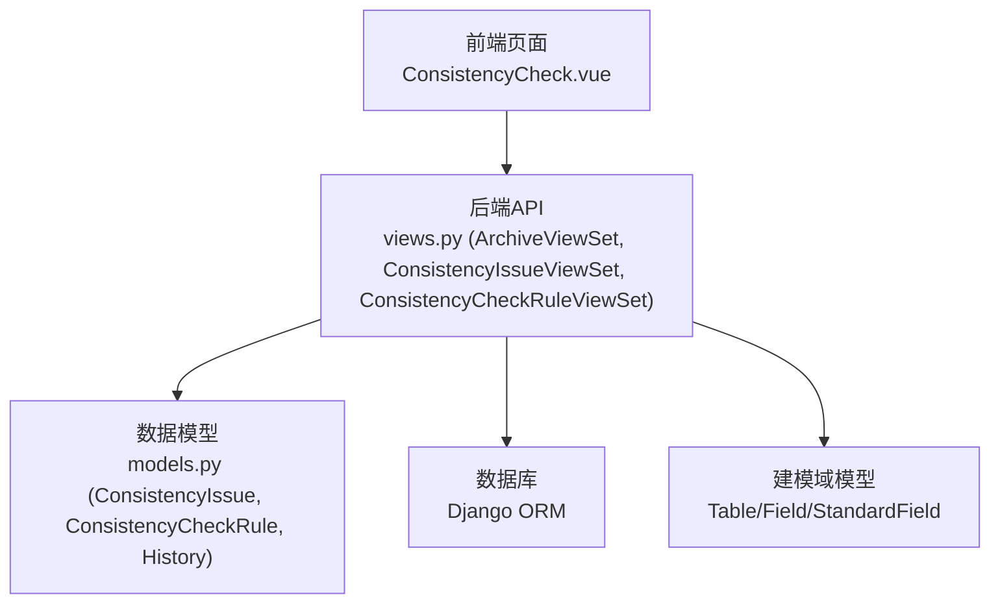
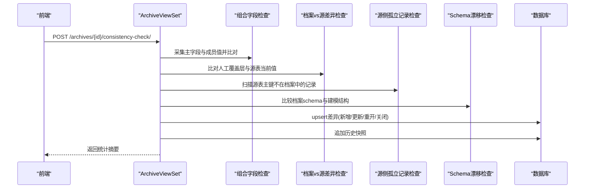
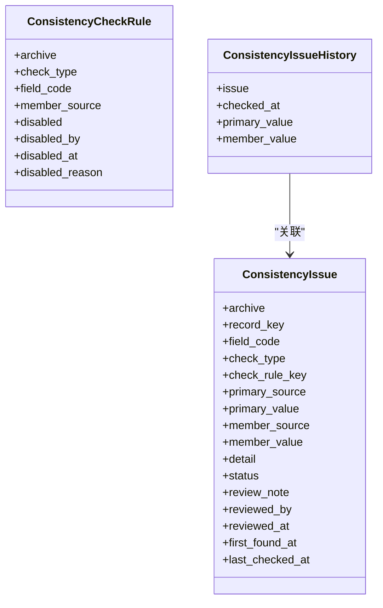
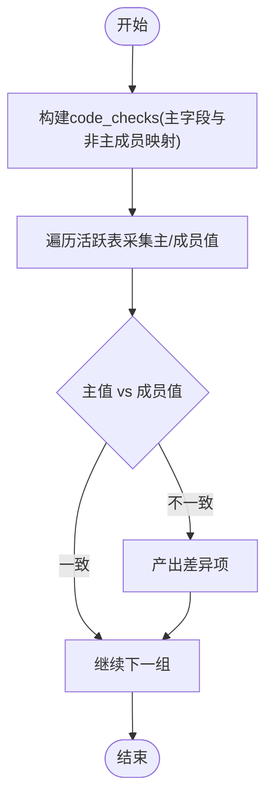
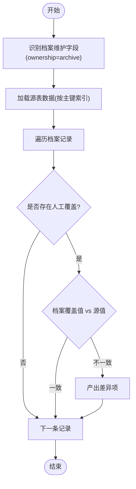
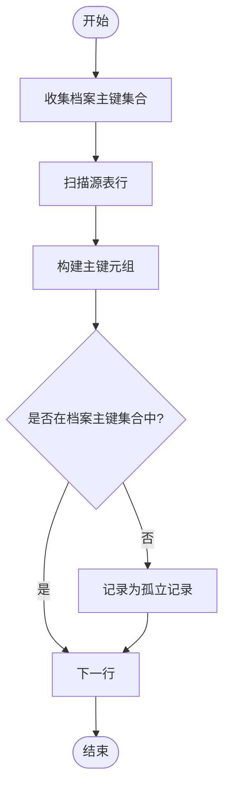
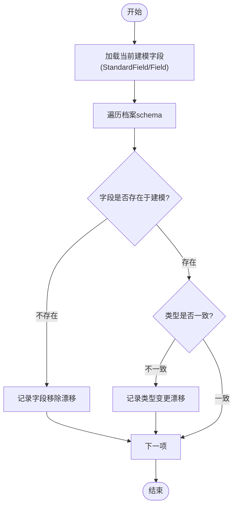
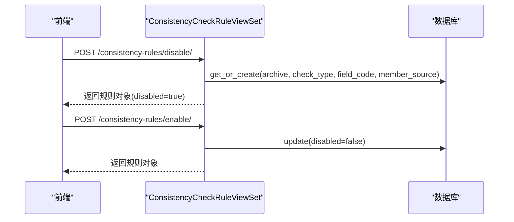
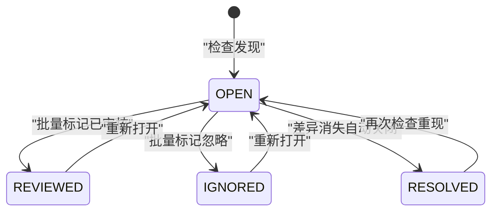
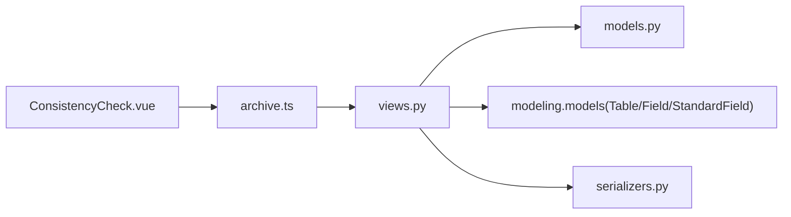

# 一致性检查系统

<cite>
**本文引用的文件**   
- [backend/apps/archive/models.py](file://backend/apps/archive/models.py)
- [backend/apps/archive/views.py](file://backend/apps/archive/views.py)
- [backend/apps/archive/serializers.py](file://backend/apps/archive/serializers.py)
- [backend/apps/archive/urls.py](file://backend/apps/archive/urls.py)
- [frontend/src/views/archive/ConsistencyCheck.vue](file://frontend/src/views/archive/ConsistencyCheck.vue)
- [frontend/src/api/archive.ts](file://frontend/src/api/archive.ts)
</cite>

## 目录
1. [引言](#引言)
2. [项目结构](#项目结构)
3. [核心组件](#核心组件)
4. [架构总览](#架构总览)
5. [详细组件分析](#详细组件分析)
6. [依赖关系分析](#依赖关系分析)
7. [性能考量](#性能考量)
8. [故障排查指南](#故障排查指南)
9. [结论](#结论)
10. [附录：配置与使用指南](#附录配置与使用指南)

## 引言
本文件系统性地阐述 MetaData002 档案模块中“一致性检查”的设计与实现，覆盖四种检查类型（组合字段成员一致性、档案侧与源侧差异、源侧孤立记录、Schema 结构漂移），并详细说明 ConsistencyIssue 模型设计、检查规则失效机制（ConsistencyCheckRule）、以及从发现到审核再到解决的完整生命周期。同时提供前端界面交互、后端 API、以及大数据量场景下的性能优化建议。

## 项目结构
一致性检查能力集中在档案应用（archive）中，由以下关键部分组成：
- 数据模型：ConsistencyIssue、ConsistencyCheckRule、ConsistencyIssueHistory
- 视图与接口：ArchiveViewSet 的 consistency_check 端点；ConsistencyIssueViewSet、ConsistencyCheckRuleViewSet
- 序列化器：用于前后端数据交换
- 前端页面：ConsistencyCheck.vue 提供检查执行、结果展示、批量审核、规则失效管理

图表来源 
- [backend/apps/archive/views.py](file://backend/apps/archive/views.py)
- [backend/apps/archive/models.py](file://backend/apps/archive/models.py)
- [frontend/src/views/archive/ConsistencyCheck.vue](file://frontend/src/views/archive/ConsistencyCheck.vue)

章节来源
- [backend/apps/archive/urls.py:1-21](file://backend/apps/archive/urls.py#L1-L21)
- [backend/apps/archive/views.py:396-600](file://backend/apps/archive/views.py#L396-L600)
- [backend/apps/archive/models.py:274-379](file://backend/apps/archive/models.py#L274-L379)

## 核心组件
- ConsistencyIssue：记录一次一致性差异，包含检查类型、主字段值与成员值对比、状态流转、首次发现与最近检查时间等
- ConsistencyCheckRule：按检查类型+字段编码+成员来源维度控制规则的启用/禁用，支持审计信息（操作人、原因、时间）
- ConsistencyIssueHistory：对每次检查的差异值进行追加式历史快照，便于追踪变化轨迹
- ArchiveViewSet.consistency_check：统一入口，聚合四类检查逻辑，生成差异清单并进行 upsert 与历史归档
- 前端页面：提供检查触发、结果分组展示、批量标记、规则失效管理等交互

章节来源
- [backend/apps/archive/models.py:274-379](file://backend/apps/archive/models.py#L274-L379)
- [backend/apps/archive/views.py:396-600](file://backend/apps/archive/views.py#L396-L600)
- [frontend/src/views/archive/ConsistencyCheck.vue:1-438](file://frontend/src/views/archive/ConsistencyCheck.vue#L1-L438)

## 架构总览
一致性检查流程以 ArchiveViewSet.consistency_check 为中枢，依次执行四类检查，汇总差异后通过 bulk_create/bulk_update 写入 ConsistencyIssue，并追加 ConsistencyIssueHistory 历史快照。已消失的差异自动关闭。

图表来源 
- [backend/apps/archive/views.py:396-600](file://backend/apps/archive/views.py#L396-L600)
- [backend/apps/archive/views.py:602-788](file://backend/apps/archive/views.py#L602-L788)

章节来源
- [backend/apps/archive/views.py:396-600](file://backend/apps/archive/views.py#L396-L600)

## 详细组件分析

### 模型设计与数据结构
- ConsistencyIssue
  - 关键字段：archive、record_key、field_code、check_type、check_rule_key、primary_source/primary_value、member_source/member_value、detail、status、review_note/reviewed_by/reviewed_at、first_found_at/last_checked_at
  - 唯一约束：(archive, record_key, field_code, member_source, check_type)，避免重复差异
  - 索引：(archive, status)、(archive, check_type) 提升查询效率
- ConsistencyCheckRule
  - 粒度：check_type + field_code + member_source，支持按具体规则失效
  - 审计字段：disabled、disabled_by、disabled_at、disabled_reason
- ConsistencyIssueHistory
  - 关联 issue，append-only 记录每次检查的主/成员值快照

图表来源 
- [backend/apps/archive/models.py:274-379](file://backend/apps/archive/models.py#L274-L379)

章节来源
- [backend/apps/archive/models.py:274-379](file://backend/apps/archive/models.py#L274-L379)

### 四种检查类型的实现原理

#### 1) 组合字段成员一致性（composite_member）
- 目标：校验组合字段的非主字段成员值是否与主字段值一致
- 实现要点：
  - 构建 code_checks：仅针对已设置主字段的 StandardField，提取主字段与其他成员映射
  - 遍历活跃表，采集主字段值与成员值（按主键分组）
  - 逐条比对，不一致则产出差异项（含主/成员来源与值）
- 输出：差异项包含 record_key、field、name、primary_source/value、member_source/value、check_rule_key

图表来源 
- [backend/apps/archive/views.py:1136-1160](file://backend/apps/archive/views.py#L1136-L1160)
- [backend/apps/archive/views.py:1175-1201](file://backend/apps/archive/views.py#L1175-L1201)
- [backend/apps/archive/views.py:1236-1257](file://backend/apps/archive/views.py#L1236-L1257)

章节来源
- [backend/apps/archive/views.py:1136-1160](file://backend/apps/archive/views.py#L1136-L1160)
- [backend/apps/archive/views.py:1175-1201](file://backend/apps/archive/views.py#L1175-L1201)
- [backend/apps/archive/views.py:1236-1257](file://backend/apps/archive/views.py#L1236-L1257)

#### 2) 档案侧与源侧差异（archive_source_diff）
- 目标：比对档案侧人工覆盖值与源表当前值是否一致
- 实现要点：
  - 筛选 ownership=archive 且非计算字段的字段
  - 采集源表数据并按主键建索引
  - 遍历档案记录，若存在人工覆盖（overrides），则与源值比对
- 输出：差异项包含档案值与源值、记录标识、检查规则 key

图表来源 
- [backend/apps/archive/views.py:602-668](file://backend/apps/archive/views.py#L602-L668)

章节来源
- [backend/apps/archive/views.py:602-668](file://backend/apps/archive/views.py#L602-L668)

#### 3) 源侧孤立记录（orphan_source_record）
- 目标：发现源表中存在但无法关联到档案主表主键的记录
- 实现要点：
  - 收集档案中已有主键集合
  - 遍历源表（默认主表或所有活跃表），构造主键元组，若不在档案主键集合中则视为孤立
- 输出：差异项包含表名、主键值、样例数据片段

图表来源 
- [backend/apps/archive/views.py:670-726](file://backend/apps/archive/views.py#L670-L726)

章节来源
- [backend/apps/archive/views.py:670-726](file://backend/apps/archive/views.py#L670-L726)

#### 4) Schema 结构漂移（schema_drift）
- 目标：检测档案 schema 与当前建模结构不一致（字段移除、类型变更）
- 实现要点：
  - 获取当前建模中的 StandardField 与 Field
  - 遍历档案 schema，判断字段是否存在、类型是否匹配
- 输出：差异项包含问题类型（removed/type_changed）、schema 项详情

图表来源 
- [backend/apps/archive/views.py:728-787](file://backend/apps/archive/views.py#L728-L787)

章节来源
- [backend/apps/archive/views.py:728-787](file://backend/apps/archive/views.py#L728-L787)

### 检查规则失效管理机制（ConsistencyCheckRule）
- 作用：按 check_type + field_code + member_source 维度禁用特定规则，使其不再产生新差异
- 生效位置：在 consistency_check 中预加载 disabled_rules 集合，过滤掉被禁用的差异项
- 管理接口：
  - disable：创建或更新一条失效规则
  - enable：恢复规则
  - toggle：切换状态
  - delete：删除规则

图表来源 
- [backend/apps/archive/views.py:2318-2362](file://backend/apps/archive/views.py#L2318-L2362)
- [backend/apps/archive/views.py:414-421](file://backend/apps/archive/views.py#L414-L421)

章节来源
- [backend/apps/archive/views.py:2318-2362](file://backend/apps/archive/views.py#L2318-L2362)
- [backend/apps/archive/views.py:414-421](file://backend/apps/archive/views.py#L414-L421)

### 一致性问题的处理流程（发现→审核→解决）
- 发现：consistency_check 执行四类检查，upsert 差异记录，追加历史快照
- 审核：前端批量标记 reviewed/ignored/reopen，后端写入变更日志批次（change_source='consistency'）
- 解决：差异消失时自动关闭（RESOLVED），用户也可通过业务修复后再次检查确认关闭

图表来源 
- [backend/apps/archive/views.py:513-600](file://backend/apps/archive/views.py#L513-L600)
- [backend/apps/archive/views.py:2222-2283](file://backend/apps/archive/views.py#L2222-L2283)

章节来源
- [backend/apps/archive/views.py:513-600](file://backend/apps/archive/views.py#L513-L600)
- [backend/apps/archive/views.py:2222-2283](file://backend/apps/archive/views.py#L2222-L2283)

### 前端交互与批量操作
- 页面功能：
  - 显示上次检查摘要（差异数、新增/消失/错误）
  - 按检查类型分组卡片展示计数与状态分布
  - 展开某类型后按日期分组展示差异明细
  - 支持状态筛选、记录标识搜索
  - 批量标记（已审核/忽略/重新打开）
  - 失效规则弹窗与抽屉管理（失效/恢复/删除）
- API 调用：
  - 触发检查：POST /archives/{id}/consistency-check/
  - 列表查询：GET /consistency-issues/?archive=&check_type=&status=&record_key=
  - 批量标记：POST /consistency-issues/batch-review/
  - 规则管理：POST /consistency-rules/disable/, /enable/, /toggle/, DELETE /{id}/

章节来源
- [frontend/src/views/archive/ConsistencyCheck.vue:1-438](file://frontend/src/views/archive/ConsistencyCheck.vue#L1-L438)
- [frontend/src/api/archive.ts:96-114](file://frontend/src/api/archive.ts#L96-L114)

## 依赖关系分析
- 视图依赖建模域模型（Table/Field/StandardField）以构建映射与检查条件
- 一致性检查与数据同步共享部分工具方法（如 _build_code_to_physical、_query_local_table/_query_external_table）
- 变更记录与版本快照贯穿整个生命周期，确保可追溯性

图表来源 
- [backend/apps/archive/views.py:930-1086](file://backend/apps/archive/views.py#L930-L1086)
- [backend/apps/archive/views.py:1087-1134](file://backend/apps/archive/views.py#L1087-L1134)

章节来源
- [backend/apps/archive/views.py:930-1086](file://backend/apps/archive/views.py#L930-L1086)
- [backend/apps/archive/views.py:1087-1134](file://backend/apps/archive/views.py#L1087-L1134)

## 性能考量
- 数据读取限制：外部数据源查询采用 LIMIT 1000，避免大表全量拉取导致超时
- 批量写入：使用 bulk_create/bulk_update 减少数据库往返
- 索引设计：ConsistencyIssue 与相关查询均建立索引，提升过滤与分页性能
- 预检模式：refresh-preview 提供零写入试算，帮助评估影响范围
- 建议优化方向：
  - 分区分批处理：对超大表增加游标分页或分批处理
  - 缓存映射：将 code_to_physical、field_name_map 等映射缓存至内存
  - 异步任务：将一致性检查迁移至后台任务队列，避免请求阻塞
  - 增量检查：基于 last_checked_at 与变更批次进行增量比对

章节来源
- [backend/apps/archive/views.py:1259-1331](file://backend/apps/archive/views.py#L1259-L1331)
- [backend/apps/archive/views.py:513-600](file://backend/apps/archive/views.py#L513-L600)

## 故障排查指南
- 常见问题定位：
  - 检查失败：查看 stats.errors 数组，定位具体表或数据源连接问题
  - 差异未出现：确认对应规则未被禁用（ConsistencyCheckRule.disabled=True）
  - 历史缺失：检查 ConsistencyIssueHistory 是否成功追加
  - 状态不更新：确认 batch-review 参数正确（ids、action、operated_by）
- 调试建议：
  - 使用 refresh-preview 预检数据变化与 schema 差异
  - 导出变更日志 Excel，核对批次与明细一致性
  - 查看操作日志（OperationLog）与变更批次（ChangeBatch）

章节来源
- [backend/apps/archive/views.py:396-600](file://backend/apps/archive/views.py#L396-L600)
- [backend/apps/archive/views.py:2222-2283](file://backend/apps/archive/views.py#L2222-L2283)

## 结论
一致性检查系统通过统一的 four-type 检查框架，结合灵活的规则失效管理与完整的审核生命周期，为档案数据的可信度提供了系统化保障。其设计兼顾了可扩展性与可观测性，适合在复杂多源数据环境下持续演进。

## 附录：配置与使用指南
- 自定义检查规则：
  - 通过 ConsistencyCheckRuleViewSet.disable 创建失效规则，指定 archive、check_type、field_code、member_source、reason、operated_by
  - 使用 enable/toggle 恢复或切换规则状态
- 批量处理操作：
  - 使用 batch-review 对多条差异进行统一标记，附带备注与操作人
  - 结合刷新预览（refresh-preview）评估影响后再执行实际刷新
- 前端操作流程：
  - 进入一致性检查页，点击“重新检查”触发后端检查
  - 按类型展开查看差异明细，支持筛选与搜索
  - 选择多条差异进行批量标记，或从单条差异快速失效规则
  - 在抽屉中管理失效规则（恢复/删除）

章节来源
- [backend/apps/archive/views.py:2318-2362](file://backend/apps/archive/views.py#L2318-L2362)
- [frontend/src/views/archive/ConsistencyCheck.vue:378-428](file://frontend/src/views/archive/ConsistencyCheck.vue#L378-L428)
- [frontend/src/api/archive.ts:96-114](file://frontend/src/api/archive.ts#L96-L114)