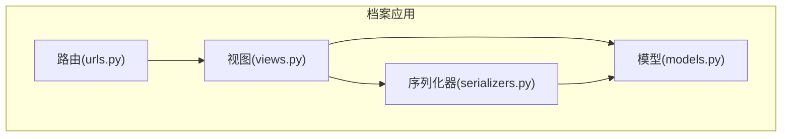
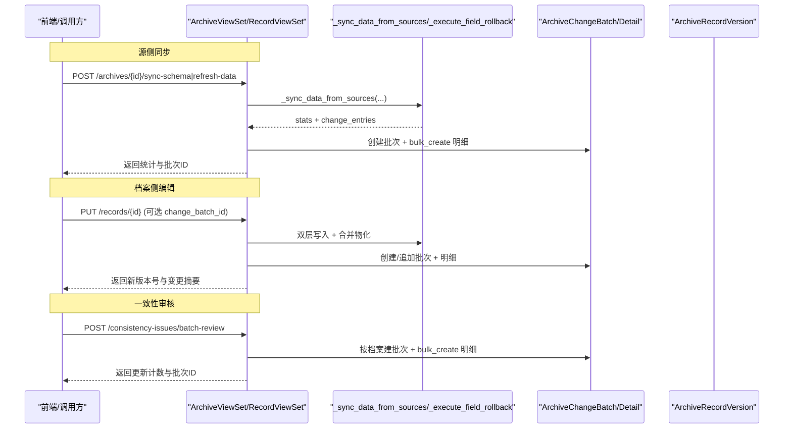
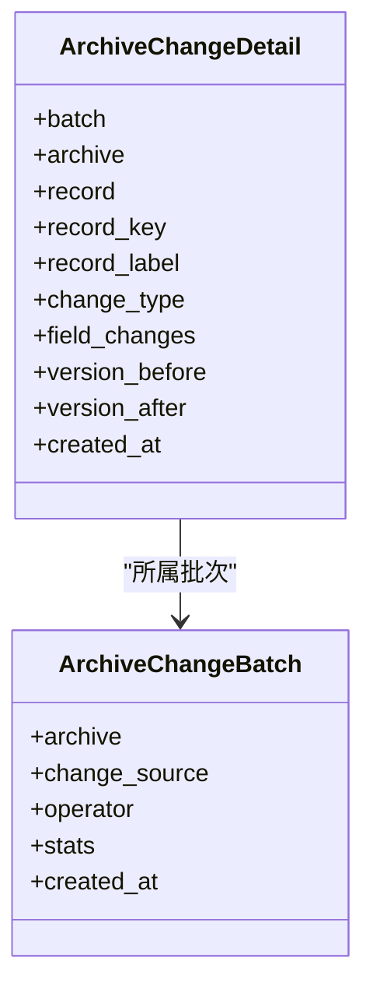
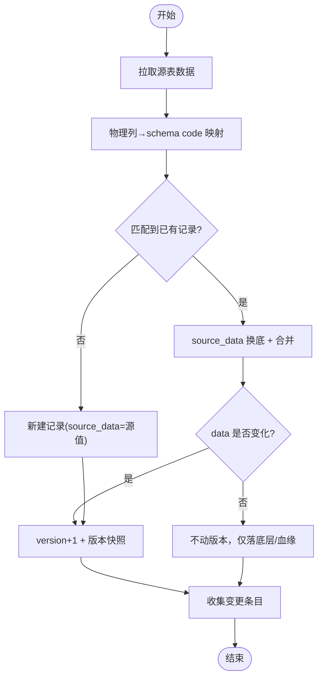
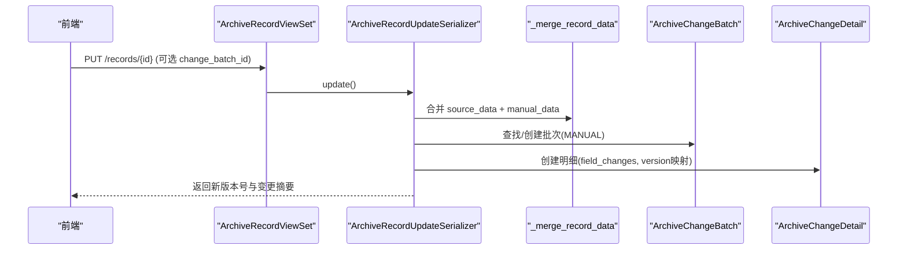
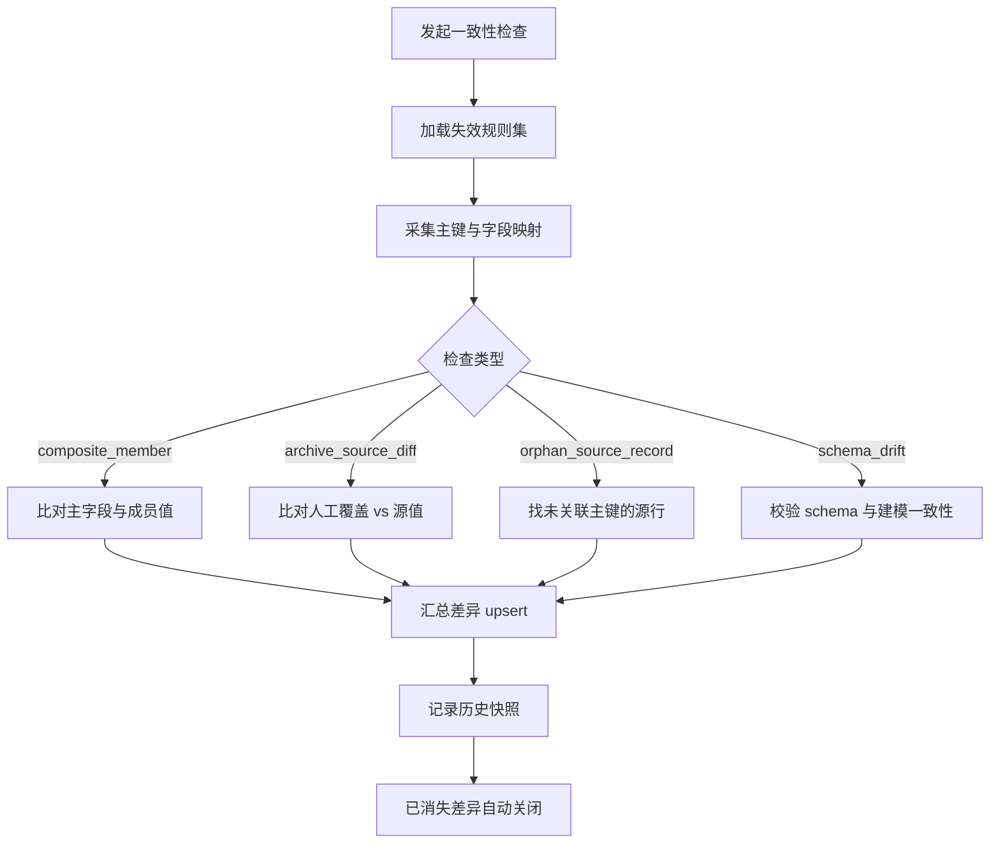
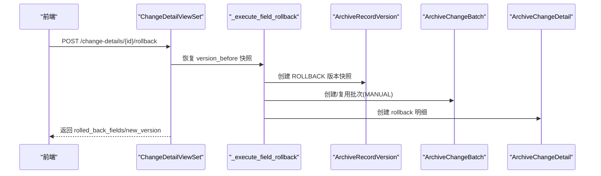
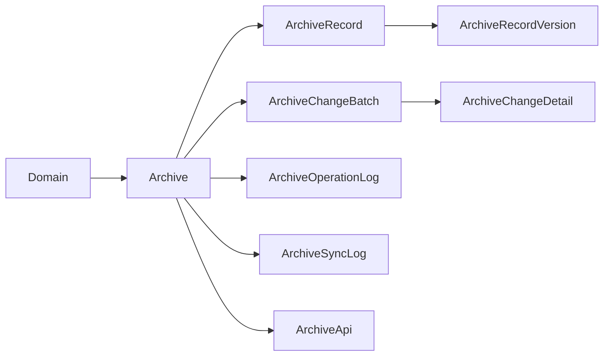

# 变更追踪系统

<cite>
**本文引用的文件**   
- [models.py](file://backend/apps/archive/models.py)
- [views.py](file://backend/apps/archive/views.py)
- [serializers.py](file://backend/apps/archive/serializers.py)
- [urls.py](file://backend/apps/archive/urls.py)
- [0006_archivechangebatch_archivechangedetail_and_more.py](file://backend/apps/archive/migrations/0006_archivechangebatch_archivechangedetail_and_more.py)
- [tests.py](file://backend/apps/archive/tests.py)
</cite>

## 目录
1. [简介](#简介)
2. [项目结构](#项目结构)
3. [核心组件](#核心组件)
4. [架构总览](#架构总览)
5. [详细组件分析](#详细组件分析)
6. [依赖关系分析](#依赖关系分析)
7. [性能与清理策略](#性能与清理策略)
8. [故障排查指南](#故障排查指南)
9. [结论](#结论)
10. [附录：API与查询能力](#附录api与查询能力)

## 简介
本文件为 MetaData002 档案模块的“变更追踪系统”技术文档，聚焦以下目标：
- 解释变更批次（ArchiveChangeBatch）与变更明细（ArchiveChangeDetail）的设计与职责
- 说明批次化变更管理的优势
- 描述三种变更来源的处理逻辑与统计机制：源侧同步、档案侧编辑、一致性审核
- 详述字段级变更追踪实现：旧值新值对比、变更摘要生成、变更记录存储
- 说明变更批次的聚合统计功能：记录数量统计、操作者分析
- 提供变更数据的查询与分析能力：按时间、操作者、变更类型等多维度筛选
- 给出变更数据清理策略与性能优化建议

## 项目结构
变更追踪系统位于后端 apps.archive 子应用中，核心由模型、序列化器、视图与路由组成：
- 模型层：定义变更批次、变更明细、版本快照、操作日志等
- 序列化层：对外暴露变更批次与明细的只读接口，并封装批量回滚、导出等扩展动作
- 视图层：实现源侧同步、人工编辑、一致性审核三类变更流程，以及变更导出、回滚、统计等
- 路由层：注册变更批次、变更明细、一致性差异、检查规则等 API

**图表来源** 
- [models.py:206-272](file://backend/apps/archive/models.py#L206-L272)
- [serializers.py:457-552](file://backend/apps/archive/serializers.py#L457-L552)
- [views.py:1848-2103](file://backend/apps/archive/views.py#L1848-L2103)
- [urls.py:12-15](file://backend/apps/archive/urls.py#L12-L15)

**章节来源**
- [models.py:206-272](file://backend/apps/archive/models.py#L206-L272)
- [serializers.py:457-552](file://backend/apps/archive/serializers.py#L457-L552)
- [views.py:1848-2103](file://backend/apps/archive/views.py#L1848-L2103)
- [urls.py:12-15](file://backend/apps/archive/urls.py#L12-L15)

## 核心组件
- 变更批次（ArchiveChangeBatch）
  - 作用：一次“刷新/编辑/审核”产生的原子性变更集合，便于统一统计与回滚
  - 关键字段：所属档案、变更来源（sync/manual/consistency）、操作人、批次统计 JSON、创建时间
- 变更明细（ArchiveChangeDetail）
  - 作用：批次内每条记录的字段级变更，含旧值→新值、记录标识、记录信息快照、版本映射
  - 关键字段：所属批次、所属档案、关联记录（可空）、记录标识、记录信息、变更类型、字段变更数组、变更前/后版本号、变更时间

**章节来源**
- [models.py:206-272](file://backend/apps/archive/models.py#L206-L272)
- [0006_archivechangebatch_archivechangedetail_and_more.py:14-47](file://backend/apps/archive/migrations/0006_archivechangebatch_archivechangedetail_and_more.py#L14-L47)

## 架构总览
变更追踪贯穿三大来源：
- 源侧同步：定时或触发式从源表拉取数据，整层替换 source_data，合并后产生变更明细与批次
- 档案侧编辑：用户通过更新接口修改档案维护字段，写入 manual_data，合并物化后落变更明细与批次
- 一致性审核：对差异进行批量标记（reviewed/ignored/reopen），以 consistency 来源生成批次与明细

**图表来源** 
- [views.py:930-1085](file://backend/apps/archive/views.py#L930-L1085)
- [views.py:1863-1881](file://backend/apps/archive/views.py#L1863-L1881)
- [views.py:2222-2283](file://backend/apps/archive/views.py#L2222-L2283)
- [serializers.py:185-377](file://backend/apps/archive/serializers.py#L185-L377)

## 详细组件分析

### 变更批次与明细的数据模型
- 变更批次
  - 变更来源枚举：sync（源侧同步）、manual（档案侧编辑）、consistency（一致性审核）
  - 批次统计：records_created/updated/deactivated/reactivated 等计数
- 变更明细
  - 变更类型枚举：created/updated/deactivated/reactivated/reviewed/ignored/rollback
  - 字段变更：field_changes 数组，包含 field、name、old、new
  - 版本映射：version_before/version_after，支撑时点回滚与批次级撤销

**图表来源** 
- [models.py:206-272](file://backend/apps/archive/models.py#L206-L272)

**章节来源**
- [models.py:206-272](file://backend/apps/archive/models.py#L206-L272)
- [0006_archivechangebatch_archivechangedetail_and_more.py:14-47](file://backend/apps/archive/migrations/0006_archivechangebatch_archivechangedetail_and_more.py#L14-L47)

### 源侧同步：处理逻辑与统计
- 数据拉取：按域主表优先，跨表累积；支持本地表与外部数据源
- 换底重合并：将映射到的物理列直接写入 source_data，再调用合并函数得到 data
- 版本与血缘：有差异才 version+1 并写版本快照；补全 sync 血缘 source_table
- 停用清扫：源端缺失的记录标记停用（软删除），若重现则自动复活
- 变更日志：本轮有变更才建批次；新增/修改/复活/停用分别记录，字段级 old/new
- 统计指标：records_created/updated/deactivated/reactivated、tables_synced、errors/warnings

**图表来源** 
- [views.py:1332-1517](file://backend/apps/archive/views.py#L1332-L1517)

**章节来源**
- [views.py:930-1085](file://backend/apps/archive/views.py#L930-L1085)
- [views.py:1332-1517](file://backend/apps/archive/views.py#L1332-L1517)

### 档案侧编辑：处理逻辑与统计
- 权限与门控：source 维护字段禁止人工修改；计算字段不参与覆盖
- 双层写入：变更的 archive 字段写入 manual_data；若新值等于底层源值则回落
- 合并物化：调用合并函数生成 data 与 lineage；状态切换也计入变更摘要
- 批次攒批：支持 start-manual 开启会话批次，后续逐条 PUT 挂入同一批次；无指定则自动建独立批次
- 统计指标：records_updated/deactivated/reactivated 累计；detail_count 用于展示

**图表来源** 
- [serializers.py:185-377](file://backend/apps/archive/serializers.py#L185-L377)
- [views.py:1863-1881](file://backend/apps/archive/views.py#L1863-L1881)

**章节来源**
- [serializers.py:185-377](file://backend/apps/archive/serializers.py#L185-L377)

### 一致性审核：处理逻辑与统计
- 四种检查类型：组合字段成员一致性、档案侧与源侧差异、源侧孤立记录、Schema 漂移
- 失效规则：ConsistencyCheckRule.disabled=True 的规则不产生新差异
- 批量标记：reviewed/ignored/reopen，按档案建批次（consistency），明细记录差异快照
- 历史轨迹：ConsistencyIssueHistory 保留每次检查的差异值历史

**图表来源** 
- [views.py:396-600](file://backend/apps/archive/views.py#L396-L600)
- [views.py:2222-2283](file://backend/apps/archive/views.py#L2222-L2283)

**章节来源**
- [views.py:396-600](file://backend/apps/archive/views.py#L396-L600)
- [views.py:2222-2283](file://backend/apps/archive/views.py#L2222-L2283)

### 字段级变更追踪：旧值新值对比、摘要与存储
- 旧值新值对比：在更新/同步路径中比较 data 前后差异，生成 field_changes
- 变更摘要：包含 action（如“源同步创建记录”“档案侧人工编辑”）与 changed_fields
- 存储位置：
  - 版本快照：ArchiveRecordVersion.change_summary
  - 操作日志：ArchiveOperationLog.change_summary
  - 变更明细：ArchiveChangeDetail.field_changes
- 记录标识与信息：record_key（主键值快照）、record_label（组合字段值拼接）

**章节来源**
- [serializers.py:185-377](file://backend/apps/archive/serializers.py#L185-L377)
- [views.py:1332-1517](file://backend/apps/archive/views.py#L1332-L1517)
- [models.py:75-110](file://backend/apps/archive/models.py#L75-L110)
- [models.py:174-204](file://backend/apps/archive/models.py#L174-L204)

### 变更批次的聚合统计与操作者分析
- 批次统计：records_created/updated/deactivated/reactivated 等计数
- 操作者分析：batch.operator 记录操作人；可按 operator 过滤与分组
- 明细数：detail_count 用于列表展示；导出 Excel 包含批次汇总 Sheet

**章节来源**
- [models.py:206-233](file://backend/apps/archive/models.py#L206-L233)
- [serializers.py:478-491](file://backend/apps/archive/serializers.py#L478-L491)
- [views.py:1974-2059](file://backend/apps/archive/views.py#L1974-L2059)

### 回滚与撤销能力
- 单条明细回滚：恢复到该明细之前的版本快照（v18 语义），兼容存量无版本映射的 old 值恢复
- 批次级撤销：将本批影响的记录逐条恢复到本批之前状态，跳过已被后续编辑的记录
- 执行器：_execute_field_rollback 按 ownership 分层写回，生成版本快照、操作日志与变更明细

**图表来源** 
- [views.py:2061-2103](file://backend/apps/archive/views.py#L2061-L2103)
- [views.py:2105-2200](file://backend/apps/archive/views.py#L2105-L2200)
- [views.py:1882-1948](file://backend/apps/archive/views.py#L1882-L1948)

**章节来源**
- [views.py:2061-2103](file://backend/apps/archive/views.py#L2061-L2103)
- [views.py:2105-2200](file://backend/apps/archive/views.py#L2105-L2200)
- [views.py:1882-1948](file://backend/apps/archive/views.py#L1882-L1948)

## 依赖关系分析
- 模型依赖：Domain → Archive → ArchiveRecord/Version/SyncLog/OperationLog/Api/Batch/Detail
- 视图依赖：ArchiveViewSet 负责同步与预检；RecordViewSet 负责记录操作；ChangeBatch/Detail 提供变更查询与回滚
- 序列化依赖：ArchiveRecordUpdateSerializer 负责人工编辑的双层写入与批次/明细落库
- 外部依赖：computed_service 计算字段重算；DataSourceViewSet 外部数据源访问

**图表来源** 
- [models.py:5-204](file://backend/apps/archive/models.py#L5-L204)
- [models.py:206-272](file://backend/apps/archive/models.py#L206-L272)

**章节来源**
- [models.py:5-204](file://backend/apps/archive/models.py#L5-L204)
- [models.py:206-272](file://backend/apps/archive/models.py#L206-L272)

## 性能与清理策略
- 零变更不建批次：源侧同步与人工编辑均遵循“无变更不建批次”，减少噪声
- 批量写入：变更明细使用 bulk_create 降低 IO 开销
- 索引设计：批次与明细按 archive + created_at 建立索引，提升分页与筛选性能
- 数据清理建议：
  - 基于 created_at 归档历史明细（例如超过 N 天迁移至冷存储）
  - 定期清理 ConsistencyIssueHistory 历史快照（按 issue 粒度保留最近 K 条）
  - 对 ArchiveOperationLog/SyncLog 做分区或归档
- 性能优化建议：
  - 大表同步限制 LIMIT 1000（当前实现已限制）
  - 预检模式（dry-run）避免误刷
  - 计算字段重算失败不阻塞主流程（异常隔离）

**章节来源**
- [views.py:1259-1331](file://backend/apps/archive/views.py#L1259-L1331)
- [views.py:1974-2059](file://backend/apps/archive/views.py#L1974-L2059)
- [models.py:223-233](file://backend/apps/archive/models.py#L223-L233)
- [models.py:262-272](file://backend/apps/archive/models.py#L262-L272)

## 故障排查指南
- 常见错误
  - 未配置主键字段：无法试算/同步，需先设置主键
  - 组合字段未设主字段：仅告警，成员数据全部写入
  - 外部数据源连接失败：记录 errors 并跳过该表
- 定位方法
  - 查看同步日志（ArchiveSyncLog）与操作日志（ArchiveOperationLog）
  - 查看变更批次与明细，确认 field_changes 与版本映射
  - 一致性差异页查看 open/reopened/resolved 状态与历史快照
- 修复步骤
  - 修正主键/主字段配置
  - 重新触发 refresh-data/sync-schema
  - 对差异进行 batch-review 标记

**章节来源**
- [views.py:800-928](file://backend/apps/archive/views.py#L800-L928)
- [views.py:1259-1331](file://backend/apps/archive/views.py#L1259-L1331)
- [views.py:396-600](file://backend/apps/archive/views.py#L396-L600)

## 结论
变更追踪系统通过“批次 + 明细”的结构，实现了源侧同步、档案侧编辑、一致性审核三类变更的统一记录与可追溯。字段级 old/new 对比与版本映射支撑了精确的回滚与撤销能力；批次统计与多维度查询满足运营分析与审计需求。配合合理的索引、批量写入与清理策略，系统在大规模数据场景下具备良好性能与可维护性。

## 附录：API与查询能力
- 变更批次 API
  - 列表：/api/change-batches/（支持 archive、change_source 过滤）
  - 开启人工批次：POST /api/change-batches/start-manual/
  - 整批撤销：POST /api/change-batches/{id}/rollback/
- 变更明细 API
  - 列表：/api/change-details/（支持 archive、batch、record、change_type、change_source、record_key 过滤）
  - 导出 Excel：GET /api/change-details/export/?archive={id}
  - 单条回滚：POST /api/change-details/{id}/rollback/
- 一致性差异 API
  - 列表：/api/consistency-issues/（支持 archive、status、field_code、record_key、check_type 过滤）
  - 批量标记：POST /api/consistency-issues/batch-review/
- 域变更统计
  - GET /api/domain-change-stats/（返回每个域的档案数、最近变更时间、近7天变更数）

**章节来源**
- [urls.py:12-18](file://backend/apps/archive/urls.py#L12-L18)
- [views.py:1848-1948](file://backend/apps/archive/views.py#L1848-L1948)
- [views.py:1951-2103](file://backend/apps/archive/views.py#L1951-L2103)
- [views.py:2203-2283](file://backend/apps/archive/views.py#L2203-L2283)
- [views.py:2457-2486](file://backend/apps/archive/views.py#L2457-L2486)